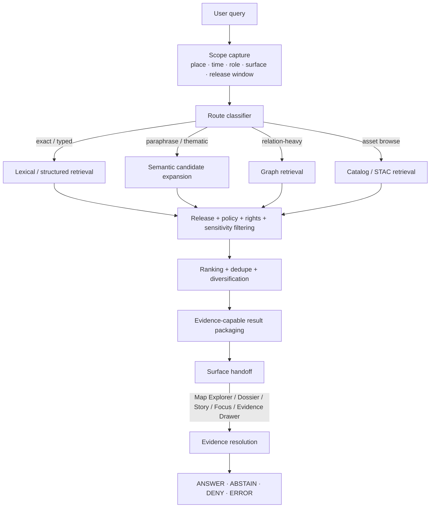

<!-- [KFM_META_BLOCK_V2]
doc_id: kfm://doc/<NEEDS_VERIFICATION_UUID>
title: KFM Semantic Search
type: standard
version: v1
status: draft
owners: @bartytime4life
created: YYYY-MM-DD
updated: 2026-03-25
policy_label: <NEEDS_VERIFICATION_POLICY_LABEL>
related: [docs/README.md, docs/search/README.md, docs/search/query-language.md, docs/search/index-architecture.md, docs/search/faircare-search-rules.md, docs/search/drift/README.md, docs/search/drift/embeddings/README.md, docs/search/drift/graph-queries/README.md, docs/search/drift/hyde/README.md, docs/search/drift/stac/README.md]
tags: [kfm, search, semantic-search]
notes: [Related paths are request-supplied and need mounted repo verification.; Current-session workspace evidence was PDF-only.; doc_id, created date, and policy_label remain unresolved.]
[/KFM_META_BLOCK_V2] -->

# KFM Semantic Search

Boundary and routing doctrine for semantic retrieval in Kansas Frontier Matrix.

> **Status:** draft  
> **Owners:** `@bartytime4life`  
> **Target path:** `docs/search/semantic-search.md`  
> **Badges:**      
> **Quick jumps:** [Scope](#scope) · [Repo fit](#repo-fit) · [Accepted inputs](#accepted-inputs) · [Governing doctrine](#governing-doctrine) · [Routing matrix](#routing-matrix) · [Semantic search flow](#semantic-search-flow) · [Surface integration](#surface-integration) · [Definition of done](#definition-of-done) · [FAQ](#faq)

[!IMPORTANT]
Semantic search in KFM is a **derived, rebuildable discovery layer**. It may improve recall, ranking, and cross-document finding, but it does **not** become sovereign truth, bypass release state, or replace evidence resolution.

[!NOTE]
This document separates **CONFIRMED**, **INFERRED**, **PROPOSED**, and **UNKNOWN / NEEDS VERIFICATION** material. In the current session, the mounted workspace evidence was PDF-only, so doctrinal claims are stronger than repo-shape claims.

## Scope

This document defines the role, boundary, and trust obligations of semantic retrieval inside KFM.

It covers:

- how semantic retrieval participates in discovery
- when semantic search should be preferred over lexical, structured, graph, or catalog-first routes
- how semantic results should hand off to Map Explorer, Dossier, Story, Focus Mode, and the Evidence Drawer
- which release, policy, freshness, and correction gates must remain ahead of outward use

It does **not** serve as:

- the end-user query language reference
- the graph query manual
- the STAC / catalog discovery reference
- a vendor bakeoff for embeddings or vector stores
- proof that a mounted semantic-search runtime is already live in the repository

## Repo fit

| Field | Value | Status |
|---|---|---|
| Target repo path | `docs/search/semantic-search.md` | request-supplied |
| Current-session evidence boundary | Attached KFM PDF corpus only; no mounted repo tree, schemas, tests, workflows, manifests, or runtime logs were directly reverified in this session | **CONFIRMED** |
| Primary doctrinal anchors used here | KFM canonical manual, KFM comprehensive compendium, unified geospatial architecture manual | **CONFIRMED** |
| Requested related material | `docs/README.md`, `docs/search/README.md`, `docs/search/query-language.md`, `docs/search/index-architecture.md`, `docs/search/faircare-search-rules.md`, and `docs/search/drift/*` | **NEEDS VERIFICATION** |
| Primary consumers | search/discovery flows, Focus Mode, Map Explorer, Story, Dossier, Evidence Drawer | **INFERRED** |
| Primary handoff | Evidence-capable references, release-aware result packaging, governed surface routing | **CONFIRMED doctrine** |

### Requested adjacency shape

```text
docs/search/
├── README.md                           # NEEDS VERIFICATION
├── semantic-search.md                  # target file
├── query-language.md                   # NEEDS VERIFICATION
├── index-architecture.md               # NEEDS VERIFICATION
├── faircare-search-rules.md            # NEEDS VERIFICATION
└── drift/
    ├── README.md                       # NEEDS VERIFICATION
    ├── embeddings/README.md            # NEEDS VERIFICATION
    ├── graph-queries/README.md         # NEEDS VERIFICATION
    ├── hyde/README.md                  # NEEDS VERIFICATION
    └── stac/README.md                  # NEEDS VERIFICATION
```

## Accepted inputs

These statuses reflect what is supported by the current evidence in this session, not what may already exist in mounted code.

| Input family | Status | What belongs here |
|---|---|---|
| Query scope context | **CONFIRMED** | place, time, role, surface, release window, and allowed audience |
| Released documentary text | **INFERRED** | reports, newspapers, archival text, captions, narrative excerpts, descriptive release-safe text |
| Released catalog and dataset descriptions | **INFERRED** | STAC / DCAT descriptions, titles, abstracts, summaries, aliases, outward metadata |
| Graph-linked descriptive text | **INFERRED** | relation labels, explainer text, discovery-oriented entity descriptions |
| Search-ready discovery objects from promoted scope | **INFERRED** | result records tied to released dataset versions, release refs, and evidence-capable drill-through |
| Embedding-specific derivatives | **PROPOSED** | chunks, query rewrites, HyDE outputs, vector centroids, reranker artifacts |
| Reviewer-only notes or unpublished deliberation text | **UNKNOWN / NEEDS VERIFICATION** | do not admit to outward semantic routes unless an explicit steward/review path says so |

## Exclusions

| Exclusion | Why it does **not** belong here | Where it should go instead |
|---|---|---|
| RAW / WORK / QUARANTINE / candidate-release material | semantic convenience may not outrun promotion law | governed intake, review, or candidate-release lanes |
| Canonical truth objects as write targets | semantic search is not an authority-writing surface | canonical build / release / correction workflows |
| Standalone answer generation | retrieval is not the final claim surface | Focus Mode + evidence resolution + citation verification |
| Exact identifiers, slugs, version IDs, or typed field filters | embeddings are a poor substitute for deterministic matching | structured query / lexical retrieval |
| Policy decisions | policy must remain explicit and typed | policy lane / decision artifacts |
| Hidden approval shortcuts or moderation bypasses | KFM rejects silent governance paths | review / stewardship workflows |
| Score-only “confidence” claims | similarity is a retrieval signal, not truth certainty | evidence-linked result packaging with visible caveats |
| Sensitive exact-location exposure | ranking cannot outrank rights, safety, or sensitivity policy | generalized, withheld, or steward-reviewed surfaces |

## Current evidence posture

| Area | Status | What is grounded now |
|---|---|---|
| Semantic search is derived, not sovereign truth | **CONFIRMED** | KFM treats search, graph, vector, tile, scene, cache, and summary layers as rebuildable accelerators by default |
| Focus Mode relation | **CONFIRMED** | Focus is retrieval-bounded, citation-checked, policy-checked, and limited to answer / abstain / deny / error outcomes |
| Evidence handoff requirement | **CONFIRMED** | outward runtime behavior depends on evidence resolution, citation checks, and policy checks before synthesis |
| Hybrid graph + vector + document retrieval pattern | **INFERRED** | supporting KFM corpus describes hybrid retrieval over Neo4j/PostGIS plus document/vector search for governed Q&A |
| Concrete search-area file inventory | **NEEDS VERIFICATION** | adjacent Markdown files were request-supplied, not repo-verified in this session |
| Concrete embedding model, chunking rules, ANN store, and reranking stack | **UNKNOWN** | no mounted runtime or repo evidence proved a live implementation |
| Routing matrix and starter result object below | **PROPOSED** | editorial structure added here to make the boundary reviewable and implementation-aware |

## Governing doctrine

### 1. Derived-layer law

Semantic search inherits KFM’s authoritative-versus-derived split.

| Retrieval family | Truth status | Allowed role | Must not become |
|---|---|---|---|
| Search index | derived by default | discovery, full-text, ranking, retrieval acceleration | the only place where meaning survives |
| Vector / embedding store | derived by default | similarity search, reranking, retrieval acceleration | a sovereign fact store |
| Graph projection | derived by default | relationship-heavy exploration and provenance traversal | a substitute for canonical truth |
| Tile / portrayal bundle | derived by default | rendered discovery context | evidence itself |
| Scene / 3D package | derived by default | controlled 3D context when 2D is insufficient | a parallel truth surface |

**Working rule:** semantic search may accelerate evidence resolution, but it must inherit release linkage, freshness basis, correction behavior, and policy state from promoted scope.

### 2. Scope-first query discipline

Before semantic expansion, KFM doctrine requires the effective scope to be determined first:

- place
- time
- role
- release window
- allowed surface

Semantic ranking without scope capture is not neutral. It increases the chance of stale, irrelevant, or policy-incompatible retrieval.

### 3. Evidence handoff law

Consequential results must remain **evidence-capable**. A semantic hit is only useful in KFM if it can hand off to:

- an inspectable evidence path
- release-linked metadata
- visible rights / sensitivity posture
- lineage and audit context where relevant

Semantic retrieval may package a candidate. It may not close the truth loop by itself.

### 4. Fail-closed runtime law

KFM outward runtime surfaces emit only:

- **ANSWER**
- **ABSTAIN**
- **DENY**
- **ERROR**

Semantic search must therefore support fail-closed behavior rather than certainty theater. If evidence cannot be reconstructed, citations fail, policy blocks detail, or the derived projection is stale beyond its declared basis, the correct result is a narrowed, generalized, stale-visible, denied, or abstained outcome.

### Representative reason and obligation cues

| Code | Typical meaning | Search consequence |
|---|---|---|
| `runtime.evidence_missing` | no reconstructible evidence path exists | do not elevate result into outward claim text |
| `runtime.citation_failed` | evidence was retrieved but user-visible claims failed citation verification | suppress answer path or reduce scope |
| `policy.denied` | policy explicitly blocks the requested action or surface | withhold or generalize |
| `projection.stale` | derived projection is older than its freshness basis | stale-visible or rebuild before outward use |
| `cite` | attach inspectable evidence or fail closed | require drill-through and citation checks |
| `review_required` | escalate to steward lane before outward use | no public-safe direct release |
| `disclose_partial` | label incompleteness in-place | visible partial state |
| `disclose_modeled` | label modeled / assimilated / forecast status | visible modeled-state cue |
| `log_audit` | emit decision and audit linkage | keep traceable runtime evidence |

[!WARNING]
A similarity score is **not** user-facing confidence. Do not present semantic rank, embedding distance, or reranker output as certainty, validity, or trustworthiness.

### Anti-patterns to reject

| Reject this | Why it fails KFM |
|---|---|
| Public answer text emitted directly from semantic retrieval | search is not a truth surface |
| Indexing unpublished or withdrawn material into outward routes | violates promotion and correction discipline |
| Treating embedding score as confidence | creates false certainty |
| Returning sensitive exact locations because they ranked highly | ranking cannot outrank policy |
| Using semantic retrieval where a typed or exact query is available | weakens verification for no gain |
| Hiding stale, partial, generalized, denied, or withdrawn states | KFM requires trust-visible negative states |
| Letting semantic-only context survive without release refs or evidence drill-through | derived meaning may not displace authoritative scope |

## Routing matrix

**PROPOSED routing matrix.** Use this to keep semantic search strong where it adds value and quiet where it does not.

| Query shape | Prefer first | Why | Semantic role |
|---|---|---|---|
| Exact identifiers, codes, slugs, release IDs, dataset version IDs | lexical / structured | exactness is cheaper, clearer, and easier to verify | optional fallback only |
| Known fields with explicit filters | query language / structured | typed predicates should stay typed | none or secondary |
| Asset and package discovery | catalog / STAC | catalog semantics already exist | optional recall expansion |
| Relationship-heavy exploration | graph queries | graph carries relation structure more directly | enrich aliases and phrasing |
| Vocabulary mismatch, paraphrase, naming drift, thematic discovery | semantic-hybrid | embeddings or semantic reranking help recall | primary |
| Consequential Q&A | Focus Mode + evidence resolution | final outward claim must stay evidence-bound | retrieval helper only |
| Map layer or feature discovery inside a known place/time window | hybrid lexical + semantic | scope narrows candidate space before ranking | rerank and diversify |
| Sensitive, review-bearing, or rights-heavy requests | policy / review route first | semantic convenience must not outrun governance | only after route clearance |

## Semantic search flow



### Reading rule for the diagram

Semantic search is valuable in the **candidate expansion and reranking** portion of the flow.

It is **not** the final mile of truth. The final mile remains evidence resolution, citation verification, policy evaluation, and visible runtime outcome handling.

## Surface integration

| Surface | Semantic search may do | Semantic search must not do |
|---|---|---|
| Map Explorer | surface relevant layers, features, dossiers, or story nodes for the active geography/time scope | mutate map truth, hide freshness, or bypass evidence launch points |
| Timeline | expand temporal aliases, related eras, and event descriptions | invent unsupported chronology or collapse time support |
| Dossier | surface related claims, events, datasets, and narrative fragments around a place/feature | replace dossier identity, support semantics, or evidence linkage |
| Story | assist citation discovery, excerpt recall, and related-publication finding | auto-publish unresolved citations or bypass review state |
| Evidence Drawer | provide a route into evidence inspection | become the inspection surface itself |
| Focus Mode | supply candidate evidence for scoped retrieval | emit uncited final answers |
| Review / Stewardship | expose false positives, stale entries, sensitive collisions, and drift candidates | silently suppress or “fix” governance issues without emitted artifacts |
| Export | support discovery of exportable released objects | create exports that outrun release or correction state |

## Quality, safety, and governance gates

| Gate | Minimum rule | Failure handling |
|---|---|---|
| Release scope filter | outward semantic routes search only promoted, released, surface-allowed scope | abstain, deny, or withhold |
| Policy and sensitivity filter | apply before exposure, not after click-through | generalize, withhold, or escalate |
| Evidence-capable packaging | consequential results must drill through to evidence | do not emit as final claim |
| Citation verification gate | publication and Q&A surfaces verify citations before outward use | abstain or narrow scope |
| Freshness and correction visibility | derived indexes carry release linkage and correction state | stale-visible or rebuild |
| Audit linkage | requests and result sets keep traceable audit references | log audit and decision path |
| Dedupe and diversification | avoid flooding one release subject with near-duplicates | rerank, collapse, or diversify |
| Evaluation harness | test stale, denied, partial, conflicted, and citation-negative cases | block merge or promotion when adopted |
| Model / index version capture | embeddings, chunking, and index builds should remain versioned derived artifacts | rebuild, quarantine, or disclose drift |

## Quickstart

Use this page as the **boundary doc** before writing search implementation detail elsewhere.

1. Confirm the request actually belongs to semantic retrieval rather than exact, graph, or catalog-first routing.
2. Capture scope first: place, time, role, surface, release window.
3. Limit candidates to promoted, policy-allowed scope before final ranking.
4. Return evidence-capable result packages, not prose conclusions.
5. Keep semantic retrieval downstream of release state, citation verification, policy, and correction visibility.
6. Treat every adjacent path named in this document as **target adjacency** until mounted repo verification proves the file inventory.

### Illustrative routing logic

```text
# pseudocode — illustrative only

if query.has_exact_identifier() or query.is_typed_filter():
    route = "lexical_or_structured"
elif query.targets_assets_or_catalog_browse():
    route = "catalog_or_stac"
elif query.is_relation_heavy():
    route = "graph"
else:
    route = "semantic_hybrid"

always_apply(
    scope_capture,
    release_filter,
    policy_and_sensitivity_filter,
    evidence_capable_packaging,
    surface_specific_handoff
)
```

[Back to top](#kfm-semantic-search)

## Definition of done

A semantic-search implementation is not done when results merely “feel smart.” It is done when trust rules survive contact with real use.

- [ ] Boundary is accepted: semantic search is explicitly derived and non-authoritative
- [ ] Routing is explicit: semantic vs lexical vs graph vs STAC responsibilities are documented
- [ ] Results are release-aware: every outward result carries release/freshness context
- [ ] Results are policy-aware: sensitivity and rights are handled before exposure
- [ ] Evidence handoff exists: consequential results can drill through to inspectable evidence
- [ ] Negative states are visible: stale, partial, denied, generalized, withdrawn, and abstained states are not hidden
- [ ] Correction path exists: rebuilt indexes and corrected outputs preserve lineage
- [ ] Evaluation exists: citation-negative, stale, partial, sensitive, and drift cases are tested
- [ ] CI / promotion gates exist for the semantic lane when implementation begins
- [ ] Adjacent docs, contracts, and route descriptions do not contradict this file
- [ ] Any repo paths named here have been reverified against mounted workspace reality before release

## FAQ

### Is semantic search the same as Focus Mode?

No. Semantic search is a retrieval aid. Focus Mode is a governed answer surface that still requires evidence resolution, citation verification, policy checks, and visible runtime outcomes.

### Is semantic search the same as vector search?

No. Vector search is one possible substrate. Semantic search is the broader retrieval job, routing discipline, and trust boundary.

### Can semantic search read unpublished material?

Not for outward use. Unpublished, quarantined, or candidate-release material stays outside outward semantic routes unless an explicitly authorized review path says otherwise.

### When should I prefer exact search?

Prefer exact or structured search for IDs, codes, slugs, fixed field queries, and cases where deterministic matching is better than thematic similarity.

### Can semantic search return map layers or features?

Yes, but only as release-scoped, policy-filtered candidates that preserve freshness and evidence handoff.

### Do embeddings become authoritative?

No. Embeddings, chunk stores, HyDE outputs, rerankers, and indexes remain derived artifacts unless a stronger promotion rule is explicitly defined.

### Does this document prove a live semantic stack is already mounted?

No. It defines the boundary, trust law, and routing expectations. Concrete stack details remain **UNKNOWN** until mounted repo or runtime evidence is surfaced.

[Back to top](#kfm-semantic-search)

## Appendix

<details>
<summary><strong>PROPOSED starter result object</strong></summary>

```json
{
  "object_type": "semantic_search_result_set",
  "status": "PROPOSED",
  "query": {
    "text": "user query text",
    "surface": "map_explorer|dossier|story|focus",
    "place_scope": ["optional place refs"],
    "time_scope": {
      "as_of": "optional timestamp",
      "range": ["optional start", "optional end"]
    }
  },
  "build_refs": {
    "search_build_id": "derived build identifier",
    "embedding_profile": "NEEDS_VERIFICATION",
    "chunking_profile": "NEEDS_VERIFICATION"
  },
  "results": [
    {
      "rank": 1,
      "kind": "dataset|feature|story_excerpt|dossier|event|asset",
      "subject_ref": "stable released subject reference",
      "evidence_ref": "inspectable evidence reference",
      "release_ref": "release identifier",
      "surface_state": "promoted|generalized|partial|stale-visible|withdrawn",
      "signals": {
        "semantic_score": 0.83,
        "lexical_score": 0.41
      },
      "why_returned": [
        "historic naming variant",
        "place alias match",
        "thematic similarity"
      ],
      "policy": {
        "reason_codes": [],
        "obligation_codes": []
      }
    }
  ],
  "audit_ref": "traceable runtime or search audit reference"
}
```

</details>

<details>
<summary><strong>UNKNOWN / NEEDS VERIFICATION backlog</strong></summary>

| Item | Why it matters |
|---|---|
| Actual embedding model(s) and multilingual strategy | changes recall, drift profile, and rebuild discipline |
| Chunking and windowing rules | changes evidence handoff quality and duplication behavior |
| Vector store / ANN index choice | affects latency, rebuild cost, and operational posture |
| Hybrid ranking weights | affects explainability and regressions |
| Dedupe and diversification policy | affects trust and review burden |
| Query logging, retention, and redaction rules | affects privacy, security, and audit posture |
| CI evaluation harness path | needed before calling implementation active |
| Route inventory and outward/internal split | needed for API and policy clarity |
| Correction-triggered rebuild rules | needed for stale index visibility and repair |
| Steward tooling for false positives and sensitive collisions | needed for review-bearing semantic operations |
| Mounted adjacency docs and actual repo placement | needed before treating named related files as confirmed repo reality |

</details>

<details>
<summary><strong>Glossary</strong></summary>

| Term | Working meaning in this document |
|---|---|
| **semantic search** | retrieval that uses thematic or paraphrase-aware similarity rather than exact string matching alone |
| **evidence-capable result** | a result that can drill through to an inspectable evidence path |
| **derived artifact** | something rebuildable from promoted scope, not sovereign truth |
| **surface state** | visible outward status such as promoted, generalized, partial, stale-visible, withdrawn, denied, or abstained |
| **semantic-hybrid** | a route that combines exact/lexical, semantic, and other retrieval signals without collapsing them into one opaque score |
| **EvidenceBundle** | request-time support package carrying evidence members, release refs, lineage hints, rights/sensitivity state, and preview policy |
| **RuntimeResponseEnvelope** | accountable runtime object carrying outcome, surface state, audit linkage, decision refs, and citation-check state |

</details>

[Back to top](#kfm-semantic-search)
