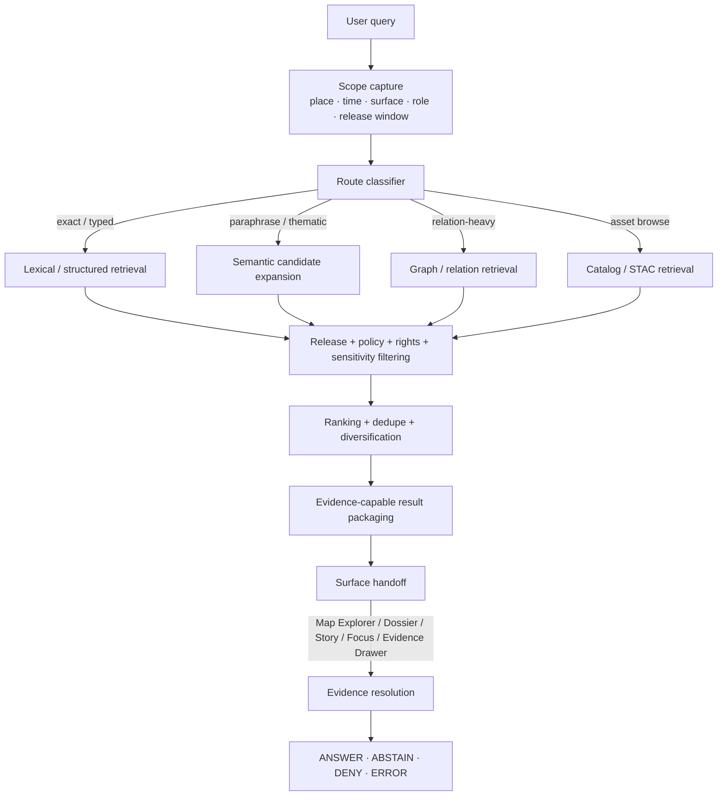

<!-- [KFM_META_BLOCK_V2]
doc_id: kfm://doc/<NEEDS_VERIFICATION_UUID>
title: KFM Semantic Search
type: standard
version: v1
status: draft
owners: @bartytime4life
created: YYYY-MM-DD
updated: 2026-03-25
policy_label: <NEEDS_VERIFICATION_POLICY_LABEL>
related: [docs/README.md, docs/search/README.md, docs/search/query-language.md, docs/search/index-architecture.md, docs/search/faircare-search-rules.md, docs/search/drift/README.md, docs/search/drift/embeddings/README.md, docs/search/drift/graph-queries/README.md, docs/search/drift/hyde/README.md, docs/search/drift/stac/README.md]
tags: [kfm, search, semantic-search]
notes: [Original file was a scaffold at review time; doc_id, created date, and policy_label still need verification.]
[/KFM_META_BLOCK_V2] -->

# KFM Semantic Search

Define how semantic retrieval expands discovery in Kansas Frontier Matrix without becoming a truth surface.

> **Status:** Draft replacement for scaffold  
> **Owners:** `@bartytime4life`  
> **Path:** `docs/search/semantic-search.md`  
> **Badges:**      
> **Quick jumps:** [Scope](#scope) · [Repo fit](#repo-fit) · [Accepted inputs](#accepted-inputs) · [Operating rules](#operating-rules) · [Routing matrix](#routing-matrix) · [Semantic search flow](#semantic-search-flow) · [Surface integration](#surface-integration) · [Definition of done](#definition-of-done) · [FAQ](#faq)

[!IMPORTANT]
Semantic search in KFM is a **derived, rebuildable discovery layer**. It may improve recall, ranking, and cross-document finding, but it does **not** become sovereign truth, bypass release state, or replace evidence resolution.

[!NOTE]
This file deliberately separates **CONFIRMED**, **INFERRED**, **PROPOSED**, and **UNKNOWN / NEEDS VERIFICATION** material. The goal is to make the document useful for implementation planning without overstating mounted repo reality.

## Scope

This document defines the role, boundary, and trust obligations of semantic search inside KFM.

It covers:

- how semantic retrieval participates in discovery
- when semantic search should be preferred over lexical, structured, graph, or catalog-first routes
- how results should hand off to Map Explorer, Dossier, Story, Focus Mode, and the Evidence Drawer
- which safety, release, policy, and correction gates must remain ahead of outward use

It does **not** serve as:

- the end-user query language reference
- the graph query manual
- the STAC / catalog discovery reference
- a vendor-specific embeddings bakeoff
- a claim that a semantic runtime stack is already mounted and active

## Repo fit

| Field | Value |
|---|---|
| Repo path | `docs/search/semantic-search.md` |
| Upstream context | [`../README.md`](../README.md), [`./README.md`](./README.md) |
| Lateral docs | [`./query-language.md`](./query-language.md), [`./index-architecture.md`](./index-architecture.md), [`./faircare-search-rules.md`](./faircare-search-rules.md) |
| Deeper implementation docs | [`./drift/README.md`](./drift/README.md), [`./drift/embeddings/README.md`](./drift/embeddings/README.md), [`./drift/graph-queries/README.md`](./drift/graph-queries/README.md), [`./drift/hyde/README.md`](./drift/hyde/README.md), [`./drift/stac/README.md`](./drift/stac/README.md) |
| Cross-cutting repo surfaces | [`../../contracts/`](../../contracts/), [`../../schemas/`](../../schemas/), [`../../policy/`](../../policy/), [`../../tests/`](../../tests/) |
| Primary consumers | Search, discovery, Focus, Story, Dossier, Map Explorer, Evidence Drawer |
| Primary handoff | Evidence-capable references, release-aware discovery objects, governed route selection |

### Related documentation tree

```text
docs/search/
├── README.md
├── semantic-search.md
├── query-language.md
├── index-architecture.md
├── faircare-search-rules.md
└── drift/
    ├── README.md
    ├── embeddings/README.md
    ├── graph-queries/README.md
    ├── hyde/README.md
    └── stac/README.md
```

## Accepted inputs

Semantic search belongs here when the input is **released or outward-safe** and benefits from thematic or paraphrase-aware retrieval.

| Input family | Status | What belongs here |
|---|---|---|
| Released dataset metadata | **CONFIRMED** | titles, abstracts, summaries, aliases, descriptive fields, release-linked metadata |
| Released historical documents and descriptive text | **CONFIRMED** | searchable document text, captions, summaries, narrative fragments, public-safe excerpts |
| Story / dossier / Focus-facing text | **CONFIRMED** | outward-facing story text, place dossier text, evidence-linked explanatory text |
| STAC / catalog / asset descriptions | **CONFIRMED** | asset descriptions and discovery metadata within published scope |
| Knowledge-graph relationship text | **CONFIRMED** | relation labels, explainer text, and discovery-oriented edge context |
| Spatial layer and temporal event descriptions | **CONFIRMED** | names, labels, descriptions, public-safe contextual text |
| Query context | **INFERRED** | place, time, surface, role, release window, and user intent |
| Embedding-specific derived representations | **PROPOSED** | chunks, semantic centroids, HyDE outputs, query rewrites, reranking artifacts |
| Reviewer-only notes or unpublished deliberation text | **UNKNOWN / NEEDS VERIFICATION** | do not admit to outward semantic search until policy and route boundaries are explicit |

## Exclusions

| Exclusion | Why it does **not** belong here | Where it should go instead |
|---|---|---|
| RAW / WORK / QUARANTINE / candidate-release material | Search may not outrun promotion law | governed intake, review, or candidate-release lanes |
| Canonical truth objects as write targets | Semantic search is not an authority-writing surface | canonical build / release / correction workflows |
| Standalone answer generation | Retrieval is not the final claim surface | Focus Mode + evidence resolution + citation verification |
| Purely exact field filters, IDs, or structured predicates | Embeddings are a poor substitute for exactness | query language / structured retrieval |
| Policy decisions | Policy must remain explicit and typed | policy lane / decision artifacts |
| Hidden reviewer actions or approval shortcuts | KFM rejects silent moderation paths | review / stewardship routes |
| Score-only “confidence” claims | Similarity is a retrieval signal, not truth certainty | evidence-linked result packaging with visible caveats |
| Sensitive exact-location exposure | Similarity ranking cannot override rights or sensitivity | generalized or withheld outward surfaces |

## Current evidence posture

| Area | Status | What is grounded now |
|---|---|---|
| File placement and role in the docs tree | **CONFIRMED** | this file exists in the live repo and is named by `docs/search/README.md` |
| Search-area boundary and doctrine | **CONFIRMED** | search is downstream of authoritative truth and supports governed surfaces |
| Relationship to graph / STAC / embeddings / HyDE docs | **INFERRED** | adjacent filenames imply a broader retrieval fabric rather than a single search mode |
| Semantic runtime, vector index, or model stack | **UNKNOWN** | no mounted implementation proof is asserted here |
| Routing matrix, result object, and checklist below | **PROPOSED** | editorial starter structure added to make the file reviewable and actionable |

## Operating rules

### CONFIRMED boundary

Semantic search in KFM:

1. stays **derived and rebuildable**
2. remains **downstream of authoritative truth**
3. supports **Map Explorer, Story, Dossier, Focus Mode, and Evidence Drawer**
4. must not bypass **governed APIs**, **policy checks**, or **evidence resolution**
5. must preserve **release**, **policy**, **freshness**, and **correction** context
6. participates in **rights, sensitivity, and sovereignty handling**
7. may help discovery, but not replace the inspectable evidence path

### INFERRED architecture consequences

Because the search area already names companion docs for query language, graph queries, STAC, embeddings, and HyDE, semantic search should be treated as **one route in a broader retrieval fabric**, not as the only search mode.

That implies a practical rule:

- prefer **exact / typed / lexical** retrieval when the query is exact
- prefer **catalog / STAC** retrieval when the user is browsing assets or packages
- prefer **graph** retrieval when the question is relation-heavy
- use **semantic** retrieval when vocabulary mismatch, paraphrase, historical naming drift, or thematic similarity matter most

### PROPOSED starter discipline

Use the following as a reviewable starting point:

- capture **query scope first**: place, time, surface, role, release window
- generate candidates only from **promoted and policy-allowed** scope
- run **policy and release filtering before final ranking**
- return **evidence-capable references**, not prose conclusions
- preserve **audit linkage** and **derived-build lineage**
- show **why returned** hints, not fake certainty
- treat semantic search as **assistive retrieval**, not final adjudication

[!WARNING]
A similarity score is **not** user-facing confidence. Do not present it as certainty, trustworthiness, or legal/administrative validity.

### Anti-patterns to reject

| Reject this | Why it fails KFM |
|---|---|
| Public answer text emitted directly from the semantic layer | Search is not a truth surface |
| Indexing unpublished or withdrawn material into outward semantic routes | Violates promotion and correction discipline |
| Treating embedding score as confidence | Creates certainty theater |
| Returning sensitive exact locations because they ranked highly | Ranking cannot outrank policy |
| Using semantic retrieval where an exact identifier or typed filter is available | Makes verification harder for no gain |
| Hiding stale, partial, denied, or generalized states | KFM requires trust-visible negative states |

## Routing matrix

**PROPOSED routing matrix.** Use this to keep semantic search strong where it adds value and quiet where it does not.

| Query shape | Prefer first | Why | Semantic role |
|---|---|---|---|
| Exact identifiers, codes, slugs, release IDs, dataset version IDs | lexical / structured | exactness is cheaper, clearer, and easier to verify | optional fallback only |
| Known fields with explicit filters | query language / structured | typed predicates should stay typed | none or secondary |
| Asset and package discovery | catalog / STAC | catalog semantics already exist | optional recall expansion |
| Relationship-heavy exploration | graph queries | graph carries relation structure more directly | enrich phrasing and aliases |
| Vocabulary mismatch, paraphrase, historical naming drift, thematic discovery | semantic-hybrid | embeddings or semantic reranking help recall | primary |
| Consequential Q&A | Focus Mode + evidence resolution | final outward claim must stay evidence-bound | retrieval helper only |
| Map layer or feature discovery inside a known place/time window | hybrid lexical + semantic | place/time scope narrows candidate space | rerank and diversify results |
| Sensitive, review-bearing, or rights-heavy requests | policy / review route first | semantic convenience must not outrun governance | only after route clearance |

## Semantic search flow



### Reading rule for the diagram

Semantic search is valuable in the **candidate expansion and reranking** part of the flow.

It is **not** the last mile of truth. The last mile remains evidence resolution, citation verification, policy evaluation, and visible runtime outcome handling.

## Surface integration

| Surface | Semantic search may do | Semantic search must not do |
|---|---|---|
| Map Explorer | surface relevant layers, features, dossiers, or story nodes for the current geography/time window | mutate map truth, hide freshness, or bypass evidence launch points |
| Timeline | expand temporal aliases, related eras, and event descriptions | invent unsupported chronology or collapse time support |
| Dossier | surface related claims, events, datasets, and narrative fragments around a place/feature | replace dossier identity, support semantics, or evidence linkage |
| Story | assist citation discovery, excerpt recall, and related-publication finding | auto-publish unresolved citations or bypass review state |
| Evidence Drawer | provide a route into evidence inspection | become the inspection surface itself |
| Focus Mode | supply candidate evidence for scoped retrieval | emit uncited final answers |
| Review / Stewardship | reveal false positives, stale entries, sensitive collisions, and drift | silently suppress or “fix” governance issues without emitted artifacts |
| Export | support discovery of exportable released objects | create exports that outrun release or correction state |

## Quality, safety, and governance gates

| Gate | Minimum rule | Failure handling |
|---|---|---|
| Release scope filter | outward semantic routes search only promoted, released, surface-allowed scope | abstain, deny, or withhold |
| Policy and sensitivity filter | apply before exposure, not after click-through | generalize, withhold, or escalate |
| Evidence-capable result packaging | consequential results must drill through to evidence | do not emit as final claim |
| Citation verification gate | publication and Q&A surfaces verify citations before outward use | abstain or reduce scope |
| Freshness and correction visibility | derived indexes carry release linkage and correction state | stale-visible or rebuild |
| Audit linkage | requests and result sets keep traceable audit references | log audit and decision path |
| Dedupe and diversification | avoid flooding one release subject with near-duplicates | rerank, collapse, or diversify |
| Evaluation harness | test stale, denied, partial, conflicted, and citation-negative cases | block promotion or merge when adopted |
| Model / index version capture | embeddings, chunking, and index builds should remain versioned derived artifacts | rebuild or quarantine on drift |

## Quickstart

Use this page as the **boundary doc** before writing implementation detail elsewhere.

1. Read [`./README.md`](./README.md) for the whole search area.
2. Use the [routing matrix](#routing-matrix) to decide whether the request truly belongs to semantic search.
3. Keep semantic search behind promoted scope, policy filters, and evidence-capable result packaging.
4. Expand drift docs only after this boundary is accepted:
   - [`./drift/embeddings/README.md`](./drift/embeddings/README.md)
   - [`./drift/hyde/README.md`](./drift/hyde/README.md)
   - [`./drift/graph-queries/README.md`](./drift/graph-queries/README.md)
   - [`./drift/stac/README.md`](./drift/stac/README.md)

### Illustrative routing logic

```text
# pseudocode — illustrative only

if query.has_exact_identifier() or query.is_typed_filter():
    route = "lexical_or_structured"
elif query.targets_assets_or_catalog_browse():
    route = "catalog_or_stac"
elif query.is_relation_heavy():
    route = "graph"
else:
    route = "semantic_hybrid"

always_apply(
    scope_capture,
    release_filter,
    policy_and_sensitivity_filter,
    evidence_capable_packaging,
    surface_specific_handoff
)
```

[Back to top](#kfm-semantic-search)

## Definition of done

A semantic-search implementation is not done when results “feel smart.” It is done when trust rules survive contact with real use.

- [ ] Boundary is accepted: semantic search is explicitly derived and non-authoritative
- [ ] Routing is explicit: semantic vs lexical vs graph vs STAC responsibilities are documented
- [ ] Results are release-aware: every outward result carries release/freshness context
- [ ] Results are policy-aware: sensitivity and rights are handled before exposure
- [ ] Evidence handoff exists: consequential results can drill through to inspectable evidence
- [ ] Negative states are visible: stale, partial, denied, generalized, withdrawn, and abstained states are not hidden
- [ ] Correction path exists: rebuilt indexes and corrected outputs preserve lineage
- [ ] Evaluation exists: citation-negative, stale, partial, sensitive, and drift cases are tested
- [ ] CI / promotion gates exist for the semantic lane when implementation begins
- [ ] Adjacent docs do not contradict this file

## FAQ

### Is semantic search the same as Focus Mode?

No. Semantic search is a retrieval aid. Focus Mode is a governed answer surface that still requires evidence resolution, citation verification, policy checks, and visible runtime outcomes.

### Is semantic search the same as vector search?

No. Vector search is one possible implementation substrate. Semantic search is the broader retrieval job, trust boundary, and routing discipline.

### Can semantic search read unpublished material?

Not for outward use. Unpublished, quarantined, or candidate-release material should remain outside outward semantic routes unless an explicitly authorized review path says otherwise.

### When should I prefer exact search?

Prefer exact or structured search for IDs, codes, slugs, fixed field queries, and cases where deterministic matching is better than thematic similarity.

### Can semantic search return map layers or features?

Yes, but only as release-scoped, policy-filtered candidates that preserve freshness and evidence handoff.

### Do embeddings become authoritative?

No. Embeddings, chunk stores, HyDE outputs, rerankers, and indexes remain derived artifacts unless a stronger promotion rule is explicitly defined.

[Back to top](#kfm-semantic-search)

## Appendix

<details>
<summary><strong>PROPOSED starter result object</strong></summary>

```json
{
  "object_type": "semantic_search_result_set",
  "status": "PROPOSED",
  "query": {
    "text": "user query text",
    "surface": "map_explorer|dossier|story|focus",
    "place_scope": ["optional place refs"],
    "time_scope": {
      "as_of": "optional timestamp",
      "range": ["optional start", "optional end"]
    }
  },
  "build_refs": {
    "search_build_id": "derived build identifier",
    "embedding_profile": "NEEDS_VERIFICATION",
    "chunking_profile": "NEEDS_VERIFICATION"
  },
  "results": [
    {
      "rank": 1,
      "kind": "dataset|feature|story_excerpt|dossier|event|asset",
      "subject_ref": "stable released subject reference",
      "evidence_ref": "inspectable evidence reference",
      "release_ref": "release identifier",
      "surface_state": "promoted|generalized|partial|stale-visible|withdrawn",
      "signals": {
        "semantic_score": 0.83,
        "lexical_score": 0.41
      },
      "why_returned": [
        "historic naming variant",
        "place alias match",
        "thematic similarity"
      ],
      "policy": {
        "reason_codes": [],
        "obligation_codes": []
      }
    }
  ],
  "audit_ref": "traceable runtime or search audit reference"
}
```

</details>

<details>
<summary><strong>UNKNOWN / NEEDS VERIFICATION backlog</strong></summary>

| Item | Why it matters |
|---|---|
| Actual embedding model(s) and multilingual strategy | changes recall, drift profile, and rebuild discipline |
| Chunking and windowing rules | changes evidence handoff quality and duplication behavior |
| Vector store / ANN index choice | affects performance, rebuild cost, and operational posture |
| Hybrid ranking weights | affects result explainability and regressions |
| Dedupe and diversification policy | affects user trust and review burden |
| Query logging, retention, and redaction rules | affects privacy, security, and audit posture |
| CI evaluation harness path | needed before calling implementation active |
| Route inventory and outward/internal split | needed for API and policy clarity |
| Correction-triggered rebuild rules | needed for stale index visibility and repair |
| Steward tooling for false positives and sensitive collisions | needed for review-bearing semantic operations |

</details>

<details>
<summary><strong>Glossary</strong></summary>

| Term | Working meaning in this document |
|---|---|
| **semantic search** | retrieval that uses thematic or paraphrase-aware similarity rather than exact string matching alone |
| **evidence-capable result** | a result that can drill through to an inspectable evidence path |
| **derived artifact** | something rebuildable from promoted scope, not sovereign truth |
| **surface state** | visible outward status such as promoted, generalized, partial, stale-visible, withdrawn, denied, or abstained |
| **semantic-hybrid** | a route that combines exact/lexical, semantic, and other retrieval signals without collapsing them into one opaque score |

</details>

[Back to top](#kfm-semantic-search)
