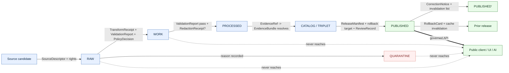

<!-- [KFM_META_BLOCK_V2]
doc_id: kfm://doc/security-audit-invariants-v1
title: Audit Invariants
type: standard
version: v1
status: draft
owners: [docs-steward, security-reviewer]            # PLACEHOLDER — confirm in registry
created: 2026-05-13
updated: 2026-05-13
policy_label: public
related:
  - docs/doctrine/lifecycle-law.md                   # PROPOSED — verify presence
  - docs/doctrine/trust-membrane.md                  # PROPOSED — verify presence
  - docs/doctrine/truth-posture.md                   # PROPOSED — verify presence
  - docs/doctrine/authority-ladder.md                # PROPOSED — verify presence
  - docs/doctrine/directory-rules.md
  - docs/architecture/governed-api.md                # PROPOSED — verify presence
  - docs/security/THREAT_MODEL.md                    # PROPOSED — sibling doc
  - docs/security/INCIDENT_RESPONSE.md               # PROPOSED — sibling doc
  - docs/registers/DRIFT_REGISTER.md                 # PROPOSED — verify presence
  - docs/registers/VERIFICATION_BACKLOG.md           # PROPOSED — verify presence
tags: [kfm, security, audit, governance, invariants, doctrine]
notes:
  - Doctrine-class document. Lists the invariants whose violation is auditable.
  - Implementation-state claims (paths, validators, CI jobs) are PROPOSED until verified against mounted-repo evidence.
[/KFM_META_BLOCK_V2] -->

<a id="top"></a>

# Audit Invariants

> The set of governance properties whose violation must be detectable, citable, and remediable. If an invariant in this document silently fails, an audit has failed.

<!-- Badge row — PLACEHOLDER targets until CI/repo are wired. -->


**Status:** draft &middot; **Owners:** docs-steward, security-reviewer *(placeholder — confirm in registry)* &middot; **Updated:** 2026-05-13

---

## Quick jump

- [1. Purpose & scope](#1-purpose--scope)
- [2. How to read this document](#2-how-to-read-this-document)
- [3. Authority and relationship to other doctrine](#3-authority-and-relationship-to-other-doctrine)
- [4. Core audit invariants (master list)](#4-core-audit-invariants-master-list)
- [5. Lifecycle invariants](#5-lifecycle-invariants)
- [6. Trust-membrane invariants](#6-trust-membrane-invariants)
- [7. Evidence and citation invariants](#7-evidence-and-citation-invariants)
- [8. Identity, hashing, and receipt invariants](#8-identity-hashing-and-receipt-invariants)
- [9. AI-surface invariants](#9-ai-surface-invariants)
- [10. Sensitivity, rights, and publication invariants](#10-sensitivity-rights-and-publication-invariants)
- [11. Release, correction, and rollback invariants](#11-release-correction-and-rollback-invariants)
- [12. Separation-of-duties invariants](#12-separation-of-duties-invariants)
- [13. Audit flow (diagram)](#13-audit-flow-diagram)
- [14. Anti-patterns audits must catch](#14-anti-patterns-audits-must-catch)
- [15. Audit failure-mode catalogue](#15-audit-failure-mode-catalogue)
- [16. Verification backlog (what this document cannot yet assert)](#16-verification-backlog-what-this-document-cannot-yet-assert)
- [17. Related docs](#17-related-docs)
- [Appendix A — Glossary (collapsible)](#appendix-a--glossary)
- [Appendix B — Conformance language](#appendix-b--conformance-language)

---

## 1. Purpose & scope

Audit Invariants enumerates the **governance properties whose violation should be detectable, surface-able, and remediable**. It is the reference document an auditor, a CI gate, an incident responder, or a senior reviewer consults to answer the question: *"is KFM behaving the way KFM says it must?"*

The document is **doctrinal**, not operational. It tells you *what is invariant*; it does not configure the validator that enforces it, host the schema that shapes it, encode the policy that decides it, or run the test that proves it. Those live, respectively, under `tools/validators/`, `schemas/`, `policy/`, and `tests/` *(paths PROPOSED per Directory Rules; verify on a mounted repo)*.

**In scope**

- The CONFIRMED-as-doctrine invariants that govern KFM as a knowledge system.
- The auditable artifact families those invariants depend on (receipts, manifests, decisions, bundles).
- The failure modes whose detection is the audit's job.
- The anti-patterns whose presence indicates an invariant has been broken or routed around.

**Out of scope**

- Specific validator code, schema shapes, or OPA/Rego policy bundles. *(See `schemas/`, `policy/`, `tools/validators/`.)*
- Concrete threat-actor modelling. *(See `docs/security/THREAT_MODEL.md` — PROPOSED sibling.)*
- Incident response procedures. *(See `docs/security/INCIDENT_RESPONSE.md` — PROPOSED sibling.)*
- Per-domain rules. *(See `docs/domains/<lane>/`.)*

> [!IMPORTANT]
> An invariant listed here is **doctrine-class**. Bending it requires an accepted ADR per [Directory Rules §2.4](../doctrine/directory-rules.md) and a recorded migration note. Silent deviation is itself an auditable failure.

---

## 2. How to read this document

Each invariant is presented with three labels so a reader can quickly tell **what is settled doctrine** versus **what is still proposed implementation**:

| Label | Meaning |
|---|---|
| **Doctrine** | CONFIRMED in KFM doctrine across the attached corpus (lifecycle law, trust membrane, EvidenceBundle, Directory Rules). |
| **Implementation** | The state of enforcement — usually PROPOSED until repo evidence confirms validators, schemas, policies, tests, and CI exist and run. |
| **Audit handle** | The artifact family or surface where evidence of compliance (or violation) is most likely to be found. |

Truth-label tokens used: **CONFIRMED**, **PROPOSED**, **INFERRED**, **UNKNOWN**, **NEEDS VERIFICATION**.

---

## 3. Authority and relationship to other doctrine

Audit Invariants does **not** create new doctrine. It re-states, consolidates, and makes auditable what is already written elsewhere. When two layers disagree, the higher layer wins.

| Layer | Document(s) | Audit Invariants' relationship |
|---|---|---|
| **KFM core invariants** | Lifecycle law, truth posture, trust membrane, authority ladder *(PROPOSED locations under `docs/doctrine/`)* | This document **must not** contradict them. It **may** make them checkable. |
| **Directory Rules** | [`docs/doctrine/directory-rules.md`](../doctrine/directory-rules.md) | Audit Invariants assumes Directory Rules' placement law and conformance language. |
| **Domain rules** | `docs/domains/<lane>/*` *(PROPOSED)* | Domain rules **refine** invariants; they never weaken them. |
| **ADRs** | `docs/adr/*` *(PROPOSED; ADR-0001 schema home exists per Directory Rules)* | An accepted ADR can amend an invariant. A draft or superseded ADR cannot. |
| **Threat model & runbooks** | `docs/security/THREAT_MODEL.md`, `docs/runbooks/*` *(PROPOSED)* | Operationalize this document. They consume invariants; they do not redefine them. |

> [!NOTE]
> Where this document quotes a specific path, the **path is PROPOSED** unless verified against a mounted repository. Audit Invariants is doctrinal; it does not assert repo state.

---

## 4. Core audit invariants (master list)

The following are the **invariants whose violation an audit must be able to detect**. Detection capability is doctrinal even where the validator that performs it is PROPOSED.

| # | Invariant | Doctrine | Implementation | Audit handle |
|---|---|---|---|---|
| **I-1** | The lifecycle chain holds: `RAW → WORK / QUARANTINE → PROCESSED → CATALOG / TRIPLET → PUBLISHED`. Promotion is a **governed state transition, not a file move.** | CONFIRMED | PROPOSED | Lifecycle gate receipts; `data/` placement vs. release manifests |
| **I-2** | Public clients and ordinary UI surfaces consume **governed APIs, released artifacts, catalog records, tile services, EvidenceBundles, release manifests, and safe envelopes only.** | CONFIRMED | PROPOSED | Renderer-boundary tests; route map; `apps/governed-api/` traffic |
| **I-3** | Every consequential claim resolves **EvidenceRef → EvidenceBundle**. When resolution fails, the system **ABSTAINs** rather than answering. | CONFIRMED | PROPOSED | EvidenceBundle resolver; CitationValidationReport |
| **I-4** | Catalogs, triplets, graph projections, PMTiles, layer manifests, model outputs, summaries, and UI answers are **derivative**. They do not become root truth. | CONFIRMED | PROPOSED | Object-family register; LayerManifest provenance fields |
| **I-5** | Promotion to PUBLISHED requires **validation, policy decision, evidence/citation closure, release manifest, review state (where required), correction path, rollback target, and receipt trail.** | CONFIRMED doctrine; PROPOSED implementation | PROPOSED | PromotionDecision / PromotionReceipt; ReleaseManifest |
| **I-6** | AI is **interpretive and subordinate**. EvidenceBundle, source authority, policy decision, review state, release state, and citation validation outrank generated language. | CONFIRMED | PROPOSED | AIReceipt; RuntimeResponseEnvelope; finite-outcome envelope |
| **I-7** | Sensitive lanes **fail closed**. Unknown rights, unresolved source role, missing evidence, unresolved sensitivity, or absent release state blocks public promotion. | CONFIRMED | PROPOSED | PolicyDecision; RedactionReceipt; sensitive-geometry deny fixture |
| **I-8** | **Source role is fixed at admission.** Promotion never upgrades a source role (e.g., modeled → observed is forbidden). | CONFIRMED | PROPOSED | SourceDescriptor `source_role`; source-role anti-collapse tests |
| **I-9** | Deterministic identity exists for trust-bearing objects: **`spec_hash` via RFC 8785 JCS + SHA-256**, recorded as `jcs:sha256:<hex>`. | CONFIRMED doctrine | PROPOSED implementation | Run receipts; `spec_hash` recompute-and-compare gates |
| **I-10** | Every governance-significant action emits a **receipt**: RunReceipt, PromotionReceipt, AIReceipt, RedactionReceipt, ValidationReport, PolicyDecision, ReleaseManifest, CorrectionNotice, RollbackCard, ReviewRecord. | CONFIRMED doctrine | PROPOSED implementation | Receipt schemas under `schemas/contracts/v1/*` *(PROPOSED home)* |
| **I-11** | The **audit ledger is append-only**. Revocation is a new tombstone receipt; nothing is deleted in place. | PROPOSED *(C1-06 idea card; ADR-class decision)* | PROPOSED | Object-store policy (Object Lock / versioning / OCI digest addressing) |
| **I-12** | Correction and rollback are **publication requirements, not afterthoughts.** Every published claim has a visible correction path and rollback target. | CONFIRMED | PROPOSED | CorrectionNotice; RollbackCard; ReleaseManifest `rollback_target` |
| **I-13** | Policy-significant release duties are **separated when maturity justifies it.** Author ≠ release authority when materiality applies. | CONFIRMED | PROPOSED | Separation-of-duties matrix; ReviewRecord actor field |
| **I-14** | Migrations between schema, policy, source, registry, release, proof, or receipt homes require an **accepted ADR**. | CONFIRMED | PROPOSED | `docs/adr/`; Drift Register; supersession entries |
| **I-15** | Exposed local systems use **deny-by-default access, least privilege, audit logging, and no public admin shortcut.** | CONFIRMED doctrine | NEEDS VERIFICATION | `infra/` configuration; reverse-proxy rules; admin route inventory |
| **I-16** | **No real secrets** are stored under `configs/` — even in `dev/`, `test/`, or `local/`. A real secret landing there is an incident. | CONFIRMED | NEEDS VERIFICATION | `configs/` scanners; secret-leak detection in CI |

> [!WARNING]
> The list above is doctrine. The **enforcement** of these invariants — validators, CI jobs, policy bundles, receipts wired into pipelines — is PROPOSED until verified on a mounted repo. Reporting an invariant as "enforced" without that verification is itself an audit failure (see §14, anti-pattern *Atlas-as-implementation-proof*).

---

## 5. Lifecycle invariants

The lifecycle invariant is **governance, not storage organization.** A path-level move that bypasses validators, policy gates, evidence-bundle creation, catalog closure, and release-decision recording is a **violation regardless of which directory the bytes ended up in.**

### 5.1 The chain

> **RAW → WORK / QUARANTINE → PROCESSED → CATALOG / TRIPLET → PUBLISHED**

CONFIRMED doctrine, preserved verbatim across the corpus.

| State | Meaning | Public visible? |
|---|---|---|
| RAW | Source-native immutable input under source identity. | No |
| WORK | Transformations and unresolved candidates. | No |
| QUARANTINE | Rights, sensitivity, validation, source-role, temporal, or evidence defects held under reason. | No |
| PROCESSED | Normalized outputs that passed transformation checks. | Limited |
| CATALOG / TRIPLET | Claim, layer, graph, provenance, and discovery surfaces; release candidates. | Governed |
| PUBLISHED | Released, policy-allowed, reviewable, rollback-capable artifacts only. | Yes |

### 5.2 Gate requirements (PROPOSED minimum artifacts)

| Gate | Required artifacts | Failure-closed outcome |
|---|---|---|
| **Admission** (— → RAW) | `SourceDescriptor` (role, authority, rights, sensitivity, cadence); payload/reference hash. | Not admitted; logged as candidate awaiting steward. |
| **Normalization** (RAW → WORK/QUARANTINE) | `TransformReceipt`; `ValidationReport` (working set); `PolicyDecision`; QUARANTINE record for failures. | Quarantine with reason; never silently promotes. |
| **Validation** (WORK → PROCESSED) | `ValidationReport` pass; `RedactionReceipt` if sensitivity applies; `AggregationReceipt` if applies. | Stay in WORK; structured FAIL outcome. |
| **Catalog closure** (PROCESSED → CATALOG/TRIPLET) | `CatalogMatrix` entry; `EvidenceBundle`; graph/triplet projections if applicable. | HOLD at PROCESSED; no public edge. |
| **Release** (CATALOG/TRIPLET → PUBLISHED) | `ReleaseManifest`; rollback target; correction path; `ReviewRecord` (if required). | HOLD at CATALOG; no public surface change. |
| **Correction** (PUBLISHED → PUBLISHED′) | `CorrectionNotice`; `ReviewRecord`; invalidation list; ReleaseManifest update or supersession. | Stale-state announcement; no silent edit. |
| **Rollback** (PUBLISHED → prior release) | `RollbackCard`; `CorrectionNotice`; manifest revert; derivative invalidation. | Held at current state until rollback validated. |

### 5.3 Closure rule (CONFIRMED doctrine)

A transition is closed only when:

1. The required artifacts above exist.
2. Every required artifact **resolves** — not just references — the artifacts it depends on (`EvidenceRef → EvidenceBundle`, `source_id → SourceDescriptor`, `model_id → ModelRunReceipt`).
3. The policy gate evaluated and **recorded its decision**.

Missing any of these means the transition fails closed and the prior state is preserved.

[Back to top ↑](#top)

---

## 6. Trust-membrane invariants

> [!IMPORTANT]
> The trust membrane forbids any public client, any normal UI surface, and any released AI surface from reaching **RAW, WORK, QUARANTINE, canonical/internal stores, graph internals, vector indexes, source APIs, or direct model runtimes.** The lifecycle gates above are the **only routes** by which content reaches PUBLISHED, and PUBLISHED is the **only state** from which the governed API may emit ANSWER.

| Invariant | Enforcement surface (PROPOSED) |
|---|---|
| No public RAW path | Renderer-boundary tests; route map; layer manifest resolver |
| No direct model client | Governed API + `ModelAdapter` boundary; no browser-to-model route |
| No canonical/internal client fetch | MapLibre adapter; explorer-web reads via `apps/governed-api/` |
| No unreleased tile load | `LayerManifest`/`MapReleaseManifest` resolver; release-state-tagged tiles |
| No sensitive geometry hidden only by style | Tile-time transformation; restricted tier; deny gate |
| No popup as Evidence Drawer substitute | Material claims require `EvidenceDrawerPayload` + bundle resolution |
| No uncited export | Screenshots, reports, Story Nodes, and Focus answers retain citations + manifest version |
| No admin route as public path | Admin shortcuts must be justified, constrained, documented, and audited |

[Back to top ↑](#top)

---

## 7. Evidence and citation invariants

**Cite-or-abstain** is the default truth posture. The chain below is non-optional for material public claims.

```text
claim → EvidenceRef → EvidenceBundle → source list / receipts → policy state → review state → release state
```

| Invariant | Audit handle |
|---|---|
| Material claims carry an `EvidenceRef` resolvable to an `EvidenceBundle`. | `CitationValidationReport` |
| `EvidenceBundle` outranks generated language, renderer state, graph projections, search indexes, tiles, PMTiles, COGs, dashboards, and synthetic scenes. | Object-family register; anti-collapse rule |
| Stale or unresolved evidence triggers **ABSTAIN**, not invention. | Finite-outcome envelope; stale-source fixture |
| `EvidenceRef` resolution failure on a public surface is a **High-severity** audit event. | Resolver logs; renderer side-channel audit |
| Aggregate sources may not be cited as per-place observations (source-role anti-collapse). | Source-role validator; matrix-cell semantics |

[Back to top ↑](#top)

---

## 8. Identity, hashing, and receipt invariants

### 8.1 Deterministic identity

CONFIRMED doctrine: `spec_hash` is computed by canonicalizing JSON via **RFC 8785 JCS** and applying **SHA-256**, recorded as `jcs:sha256:<hex>`. The choice of canonicalization matters more than the hash function: hashing developer-formatted JSON is not acceptable.

> [!TIP]
> URDNA2015 (RDF canonicalization) is reserved for cases where RDF semantic equivalence is the relevant invariant. The default for receipts and bundle hashes remains JCS. The decision should be **recorded in the receipt**.

### 8.2 Receipt families

Receipts are how the audit ledger learns what happened. Each governance-significant action emits one.

| Receipt / decision object | Records | Status |
|---|---|---|
| `RunReceipt` | Inputs, outputs, `spec_hash`/config hash, timestamp, operator, result. | CONFIRMED doctrine; PROPOSED implementation |
| `PromotionReceipt` / `PromotionDecision` | Gate results, materiality, review state, attestations, release/rollback target. | CONFIRMED doctrine; PROPOSED implementation |
| `ValidationReport` | Schema, geometry, time, identity, evidence, rights, sensitivity check outcomes. | CONFIRMED doctrine; PROPOSED implementation |
| `PolicyDecision` | `allow` / `deny` / `restrict` / `abstain` / `error`, rule IDs, reasons, obligations. | CONFIRMED doctrine; PROPOSED implementation |
| `RedactionReceipt` | Public-safe field or geometry transformation record. | CONFIRMED |
| `AggregationReceipt` | Geometry-scope unit + suppression posture. | CONFIRMED |
| `AIReceipt` | Provider/model/runtime, context IDs, citation validation, policy decision, finite outcome. | PROPOSED |
| `ReleaseManifest` | Published artifact set, digests, policy posture, rollback target. | CONFIRMED doctrine; PROPOSED implementation |
| `CorrectionNotice` | Defect class, derivative invalidation list, superseding release. | CONFIRMED |
| `RollbackCard` | Prior release manifest, artifact digests, cache state, rollback receipt. | CONFIRMED |
| `ReviewRecord` | Reviewer identity, review state, outcome. | CONFIRMED |

### 8.3 Ledger invariants

> [!WARNING]
> The audit ledger is **append-only**. Revocation appends a **tombstone** that points at the retracted `run_id`, records the reason and supersession reference, and bears a timestamp. UI clients hide tombstoned items from public views; lineage remains explorable. Storage backend (filesystem under `data/AUDIT/`, OCI registry with referrers, versioned object store with Object Lock) is **ADR-class** and PROPOSED.

[Back to top ↑](#top)

---

## 9. AI-surface invariants

AI is interpretive, not the root truth source. Audit must be able to demonstrate that every public AI answer flows through the trust spine.

**Preferred AI request flow (CONFIRMED doctrine, PROPOSED implementation):**

1. Define scope.
2. Resolve `EvidenceRef` → `EvidenceBundle`.
3. Apply rights, sensitivity, role, and release checks (policy precheck).
4. Provide **only admissible context** to the model adapter.
5. Require structured output.
6. Validate citations and policy after generation.
7. Emit a finite outcome — **ANSWER, ABSTAIN, DENY,** or **ERROR** — with `AIReceipt` and inspectable support.

### 9.1 Finite outcomes (the only legal returns)

| Outcome | When | Required artifacts |
|---|---|---|
| **ANSWER** | Evidence sufficient, policy permits, release/review state allows. | `EvidenceBundle` resolved; `PolicyDecision = allow`; `ReleaseManifest` applies. |
| **ABSTAIN** | Evidence insufficient, AI cannot cite, or evidence is stale with no released alternative. | `AIReceipt` with reason; no claim emitted. |
| **DENY** | Policy, rights, sensitivity, or release state forbids. Sensitive lanes default here. | `PolicyDecision = deny` + reason code; `AIReceipt`. |
| **ERROR** | Schema missing, query malformed, contract violated, infrastructure failed. | Error envelope with diagnostic code; **no claim leakage**. |
| **HOLD** | Promotion / release / correction paused pending review. | `ReviewRecord` pending; no public claim emitted while held. |

### 9.2 AI-surface forbidden behaviors

- Reading RAW, WORK, QUARANTINE, unpublished candidate data, direct canonical stores, or sensitive exact-location material on a public surface.
- Bypassing evidence resolution, citation validation, policy gates, release state, correction lineage, or rollback discipline.
- Source-role upgrade by paraphrase (e.g., quoting an aggregate as a per-place fact).
- Presenting synthetic content as observed reality without a Reality Boundary Note.

[Back to top ↑](#top)

---

## 10. Sensitivity, rights, and publication invariants

> [!CAUTION]
> The following classes **fail closed** on unclear rights or sensitivity: exact archaeology locations, living-person and DNA-derived material, rare-species occurrence geometry, culturally sensitive route or site information, critical infrastructure details, and high-risk hazards context. Quarantine, redaction, generalization, staged access, delayed publication, or denial is preferred to risk. **Transforms and reasons must be recorded.**

| Invariant | Audit handle |
|---|---|
| Unknown rights → deny / quarantine until rights resolved. | `RightsDecision`; `PolicyDecision = deny` with reason code |
| Sensitive geometry is **transformed at tile time**, not hidden by style. | Sensitive-geometry deny fixture; tile-generation audit |
| Aggregate-cell joins to single records are denied. | `AggregationReceipt`; minimum-cell suppression rule |
| Living-person and DNA-derived material: deny by default; staged review for any use. | Domain reviewer + rights-holder representative |
| Tier upgrades (toward more public) require **both** a transform receipt **and** a review record. | Tier-transition matrix |
| Tier downgrades (toward less public) require **only** a CorrectionNotice. | Same |

[Back to top ↑](#top)

---

## 11. Release, correction, and rollback invariants

| Invariant | Audit handle |
|---|---|
| A released claim, layer, catalog record, artifact, or answer has a **visible correction path** and **rollback target** before it is treated as safely publishable. | `ReleaseManifest.rollback_target`; `CorrectionNotice` template |
| Correction preserves the original release record, **classifies the defect**, emits a `CorrectionNotice`, updates `EvidenceBundle` and `ReleaseManifest`, and publishes a **superseding** release rather than silently mutating the old one. | CorrectionNotice schema; supersession entry |
| Rollback identifies the affected release, locates the prior safe artifact set, verifies digests and manifests, disables or withdraws affected public surfaces, preserves audit receipts, and restores or republishes the rollback target **through the same governed release path**. | RollbackCard; manifest revert receipt |
| Rollback is **not a hidden file copy.** | Renderer-boundary tests; cache invalidation receipt |
| A correction that does not list invalidated derivatives is itself a defect. | Derivative invalidation list |

### 11.1 Defect classes (PROPOSED catalog)

| Class | Correction posture | Rollback posture |
|---|---|---|
| Evidence gap | ABSTAIN or withdraw unsupported claim | Restore prior evidence-supported release |
| Source-role drift | Restore correct role + supersession | Roll back to last role-consistent release |
| Rights / sensitivity change | Redact / generalize / withdraw | Restore prior public-safe release |
| Geometry / temporal defect | Re-process + supersede | Roll back to last validated geometry/time state |
| Policy / validation defect | Re-evaluate + supersede | Roll back to last gate-passing release |
| Rendering / API / AI-output defect | Patch the carrier; receipts unchanged | Disable / withdraw the surface; canonical truth unchanged |

[Back to top ↑](#top)

---

## 12. Separation-of-duties invariants

CONFIRMED doctrine: KFM **separates policy-significant release duties when maturity justifies it.** Early-stage doctrine work may be authored and approved by the same actor when materiality is low. As maturity rises and the public trust surface expands, separation must be **enforced through tooling, not custom**.

| Action | Author may approve? | Required separation (PROPOSED) |
|---|---|---|
| Source admission (— → RAW) | Yes for routine; No when rights / sovereignty unresolved | Source steward + rights-holder rep where applicable |
| Validator authorship & run | Yes (validators are deterministic) | Domain steward; periodic audit by docs steward |
| Promotion to PROCESSED / CATALOG | Yes for non-sensitive routine; No for sensitive lanes | Domain steward + sensitivity reviewer (sensitive lanes) |
| Release to PUBLISHED | No when materiality applies | Author ≠ release authority; rights-holder rep where applicable |
| Sensitive-lane release | **No** | Author + sensitivity reviewer + release authority + rights-holder rep |
| Correction / rollback | No when correction is steward-significant | Author / detector + correction reviewer + release authority |
| AI surface change (template / policy binding) | **No** | AI surface steward + docs steward |
| Atlas / supplement publication | **No** | Docs steward + at least one subsystem owner |

> [!NOTE]
> Where this matrix says **No**, the audit must be able to show that two distinct actors signed off, with a `ReviewRecord` linking them. A self-approved release on a sensitive lane is a doctrine violation, not a process exception.

[Back to top ↑](#top)

---

## 13. Audit flow (diagram)

The diagram below shows the **happy path** an audit traces. Each arrow represents a governance edge that must produce evidence the audit can read.



> [!NOTE]
> This diagram is a doctrinal flow, not a literal pipeline graph. The actual routing and validators that implement each arrow are **PROPOSED / NEEDS VERIFICATION** until inspected against a mounted repository.

[Back to top ↑](#top)

---

## 14. Anti-patterns audits must catch

These are failure modes whose presence is itself a signal that an invariant has been routed around. Each entry is a checkable behavior, not a personality flaw.

| Anti-pattern | Invariant it violates | What to look for |
|---|---|---|
| Public client reads RAW / WORK / QUARANTINE. | I-1, I-2 | Renderer-boundary test failures; non-governed routes to data lanes. |
| Map shell consumes canonical / internal store directly. | I-2, I-4 | MapLibre adapter wired to graph store or DB; layer registry bypass. |
| AI returns uncited language. | I-3, I-6 | `CitationValidationReport.verdict = fail` reaching an ANSWER. |
| AI answers from RAW / WORK rather than `EvidenceBundle`. | I-3, I-6 | AIReceipt evidence list contains unreleased material. |
| Sensitive content released without redaction. | I-7 | Missing `RedactionReceipt`; release authority absent. |
| Aggregate cited as per-place observation. | I-8 | `source_role = aggregate` paraphrased as `observed` in popup or Focus answer. |
| Synthetic surface presented without Reality Boundary Note. | I-6 | Scene admission gate bypass; `Representation Receipt` missing. |
| KFM used as alert / instruction authority. | Out-of-scope use | Hazards / Air / Hydrology surfaces returning life-safety guidance. |
| Release without ReleaseManifest or rollback target. | I-5, I-12 | Public surface change with no `ReleaseManifest.rollback_target`. |
| AI generation routed through admin shortcut. | I-15 | Admin route reachable from a normal public path; audit logs show it. |
| Documenting a change instead of validating it. | I-14 | PR changes prose only; no test, fixture, or schema update. |
| Approving one's own release on a sensitive lane. | I-13 | Author == `ReleaseManifest.release_authority` on sensitive object. |
| Treating an Atlas summary or matrix as evidence. | I-3 | Atlas section cited where an `EvidenceBundle` is required. |
| Silent schema or policy migration. | I-14 | Parallel home appears with no ADR or supersession entry. |
| Promotion that 'upgrades' a source role. | I-8 | `source_role` changed across versions without correction notice. |
| Re-publishing a correction without invalidating derivatives. | I-12 | `CorrectionNotice` exists; derivative invalidation list missing. |
| Real secret committed under `configs/`. | I-16 | Secret-scanner hit; pre-commit/CI miss. |
| *Atlas-as-implementation-proof* — citing a planning dossier as evidence the repo enforces an invariant. | I-3, I-14 | Status claim with no validator / fixture / CI run cited. |

[Back to top ↑](#top)

---

## 15. Audit failure-mode catalogue

| Failure family | Reason code (PROPOSED) | Gate(s) where it fires | Recovery path |
|---|---|---|---|
| Missing required artifact | `MISSING_RECEIPT`, `MISSING_EVIDENCE`, `MISSING_REVIEW` | Normalization / Validation / Catalog / Release | Re-emit missing receipt; re-run review; re-validate. |
| Schema / contract mismatch | `SCHEMA_MISMATCH`, `CONTRACT_DRIFT` | Normalization / Validation | Schema fix and/or ADR; re-run validator. |
| Rights / sensitivity unresolved | `RIGHTS_UNKNOWN`, `SENSITIVITY_UNRESOLVED` | Admission / Validation / Catalog / Release | Steward review; rights resolution; tier reassignment. |
| Source-role collapse risk | `ROLE_COLLAPSE`, `ROLE_DOWNCAST_FORBIDDEN` | Validation / Catalog / Release | Restore source role; refuse upcast. |
| Review state inadequate | `REVIEW_NEEDED`, `REVIEW_INSUFFICIENT`, `REVIEW_REJECTED` | Catalog / Release | Run required review; supply `ReviewRecord`. |
| Release infrastructure error | `RELEASE_MANIFEST_INVALID`, `ROLLBACK_TARGET_MISSING` | Release | Manifest fix; supply rollback target. |
| Correction lineage broken | `CORRECTION_DERIVATIVES_UNRESOLVED`, `CORRECTION_PRIOR_RELEASE_MISSING` | Correction | Resolve derivatives; supersession entry. |
| Identity drift | `SPEC_HASH_MISMATCH`, `HASH_ALGO_UNSUPPORTED` | Promotion / Publication | Recompute under canonical normalization; ADR for algo migration. |
| Trust-membrane bypass | `ADMIN_PATH_AS_PUBLIC`, `RAW_REACHABLE_FROM_PUBLIC` | Renderer / API | Disable route; revert alias; record incident. |
| Ledger integrity | `LEDGER_TAMPER_DETECTED`, `TOMBSTONE_MISSING` | Audit ledger | Quarantine surface; rebuild ledger from immutable store. |

[Back to top ↑](#top)

---

## 16. Verification backlog (what this document cannot yet assert)

Audit Invariants is doctrine. It does **not** prove that the validators, fixtures, policies, CI jobs, or runtime checks exist or pass. The following are **NEEDS VERIFICATION** items that should resolve against a mounted repository.

- [ ] **Validator coverage** — does `tools/validators/` contain a validator for each invariant in §4? *(Path PROPOSED.)*
- [ ] **Schema homes** — do object families have schemas under `schemas/contracts/v1/...` per ADR-0001? *(Path PROPOSED.)*
- [ ] **Policy bundles** — does `policy/` carry OPA/Rego rules for `ReleaseManifest`, `AIReceipt`, sensitive-lane denial, source-role anti-collapse? *(Path PROPOSED.)*
- [ ] **Receipt ledger backend** — is the append-only audit ledger storage decision recorded in an accepted ADR (filesystem / OCI / object store with Object Lock)?
- [ ] **CI enforcement** — does a workflow under `.github/workflows/` (or equivalent) fail-close on missing receipts, invalid `spec_hash`, missing `EvidenceBundle`, missing rollback target?
- [ ] **Separation-of-duties tooling** — is reviewer separation enforced by tooling, or only by custom?
- [ ] **Drift register & verification backlog** — are `docs/registers/DRIFT_REGISTER.md` and `docs/registers/VERIFICATION_BACKLOG.md` present and current?
- [ ] **Sensitive-lane fixtures** — do `tests/fixtures/` deny / abstain fixtures exist for archaeology, fauna, flora, people-DNA-land?
- [ ] **No public RAW path test** — does an e2e or contract test prove the trust-membrane boundary?
- [ ] **Admin route inventory** — are admin shortcuts enumerated, audited, and kept off the normal public path?

Items resolved against repo evidence should move from this list to a per-invariant **CONFIRMED implementation** note in §4.

[Back to top ↑](#top)

---

## 17. Related docs

- [`docs/doctrine/directory-rules.md`](../doctrine/directory-rules.md) — Where files belong; what bends require an ADR.
- `docs/doctrine/lifecycle-law.md` — Canonical statement of the lifecycle chain. *(PROPOSED.)*
- `docs/doctrine/trust-membrane.md` — Canonical statement of the public trust boundary. *(PROPOSED.)*
- `docs/doctrine/truth-posture.md` — Cite-or-abstain doctrine. *(PROPOSED.)*
- `docs/doctrine/authority-ladder.md` — What outranks what. *(PROPOSED.)*
- `docs/architecture/governed-api.md` — The trust membrane in executable form. *(PROPOSED.)*
- `docs/security/THREAT_MODEL.md` — Threats whose mitigation depends on the invariants above. *(PROPOSED sibling.)*
- `docs/security/INCIDENT_RESPONSE.md` — What to do when an invariant fails in production. *(PROPOSED sibling.)*
- `docs/security/EXPOSURE_POSTURE.md` — Deny-by-default, least-privilege, audit-logging posture for exposed systems. *(PROPOSED sibling.)*
- `docs/registers/DRIFT_REGISTER.md` — Where invariant violations are recorded for triage. *(PROPOSED.)*
- `docs/registers/VERIFICATION_BACKLOG.md` — Where §16 items go. *(PROPOSED.)*
- `docs/adr/ADR-0001-schema-home.md` — Schema-home decision underlying §8. *(Referenced by Directory Rules.)*

---

## Appendix A — Glossary

<details>
<summary><strong>Click to expand glossary</strong></summary>

| Term | Definition |
|---|---|
| **EvidenceRef** | CONFIRMED — Reference that must resolve to `EvidenceBundle` before public claim authority. |
| **EvidenceBundle** | CONFIRMED — Resolved evidence package: source list, excerpts/records, provenance, policy/review/release state. Outranks generated language. |
| **SourceDescriptor** | CONFIRMED doctrine / PROPOSED implementation — Identity, role, rights, cadence, access, sensitivity, release posture of a source. |
| **PolicyDecision / DecisionEnvelope** | Finite `allow` / `deny` / `restrict` / `abstain` / `error` decision envelope. |
| **RunReceipt** | Auditable record of an intake, transform, validation, catalog, release, or rebuild action. |
| **PromotionReceipt** | Auditable record of Promotion Gates A–G outcomes. |
| **ReleaseManifest** | Published artifact set, digests, policy posture, rollback target. |
| **CorrectionNotice** | Public record of a defect, classification, invalidation list, and superseding release. |
| **RollbackCard** | Record of rollback action: prior release, digests, cache state. |
| **ReviewRecord** | Reviewer identity, review state, outcome. |
| **AIReceipt** | Provider/model/runtime, context IDs, citation validation, policy decision, finite outcome — without storing private chain-of-thought. |
| **Governed API** | CONFIRMED doctrine / PROPOSED implementation — Interface enforcing evidence, policy, release, finite outcomes, and audit. |
| **Trust membrane** | The boundary preventing public surfaces from reaching RAW / WORK / QUARANTINE / canonical stores / direct model runtimes. |
| **Cite-or-abstain** | Default truth posture: emit a citation-supported answer or ABSTAIN. |
| **Promotion** | CONFIRMED — Governed release transition between lifecycle states, **not** a file movement. |
| **spec_hash** | CONFIRMED doctrine — `jcs:sha256:<hex>` deterministic identity over canonicalized JSON. |
| **Append-only ledger** | PROPOSED — Tamper-evident store of receipts; revocation is a new tombstone, not a deletion. |
| **Source role** | CONFIRMED — `observed` / `regulatory` / `modeled` / `aggregate` / `administrative` / `candidate` / `synthetic`. Fixed at admission. |
| **Reality Boundary Note** | UI / record disclosure that a surface is reconstruction, not observation. |
| **Stale claim** | A published claim whose evidence, source freshness, dependent data, or context has aged past its declared tolerance — distinct from a *wrong* claim. |

</details>

[Back to top ↑](#top)

---

## Appendix B — Conformance language

The document uses RFC 2119-style conformance language, consistent with Directory Rules §2.2:

| Term | Meaning |
|---|---|
| **MUST / MUST NOT** | Non-negotiable. Violations are merge-blocking and audit-failing absent an accepted ADR. |
| **SHOULD / SHOULD NOT** | Strong default. Deviation requires brief justification in the PR body or in the affected per-root README. |
| **MAY** | Permitted; no justification required, but stay consistent within the lane. |

> [!NOTE]
> Doctrine-level invariants in §4 are **MUST**-class by default. Where this document uses **SHOULD**, it reflects a deliberate maturity-dependent stance documented in the source corpus (typically separation of duties, ledger backend choice, AI provider selection).

---

<sub><sup>Last updated: 2026-05-13 &middot; Doc version: v1 (draft) &middot; Doctrine class &middot; Implementation status of every invariant is PROPOSED until verified on a mounted repository.</sup></sub>

[Back to top ↑](#top)
