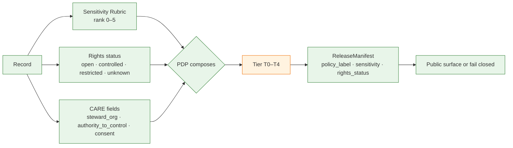
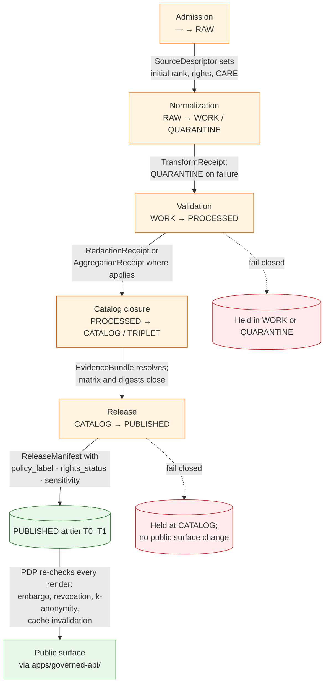

<!-- [KFM_META_BLOCK_V2]
doc_id: kfm://doc/security/data-classification
title: KFM Data Classification
type: standard
version: v0.1
status: draft
owners: TODO — Security steward + Policy steward (see CODEOWNERS)
created: 2026-05-13
updated: 2026-05-13
policy_label: public
related:
  - docs/doctrine/trust-membrane.md
  - docs/doctrine/lifecycle-law.md
  - docs/doctrine/truth-posture.md
  - docs/security/THREAT_MODEL.md
  - docs/security/EXPOSURE_POSTURE.md
  - docs/security/INCIDENT_RESPONSE.md
  - docs/standards/SENSITIVITY_RUBRIC.md
  - docs/standards/CONSENT_TOKENS.md
  - docs/standards/DP_BUDGETS.md
  - docs/runbooks/revocation.md
  - policy/sensitivity/README.md
  - policy/rights/README.md
  - policy/release/README.md
  - schemas/contracts/v1/release/release_manifest.schema.json
tags: [kfm, security, classification, sensitivity, rights, care, policy]
notes:
  - Reconciles four interlocking vocabularies (rubric 0–5, tiers T0–T4, ReleaseManifest fields, Deny-by-Default Register).
  - Specific paths labeled PROPOSED until verified against mounted repo evidence.
[/KFM_META_BLOCK_V2] -->

# KFM Data Classification

> **Every KFM record carries a sensitivity, a rights posture, and a tier — and every public path is gated by them. Fail closed when any of the three is unknown.**

<p align="center">
  
  
  
  
  
  
  
</p>

| Field | Value |
|---|---|
| **Status** | `draft` |
| **Owners** | `TODO` — Security steward + Policy steward (per CODEOWNERS) |
| **Last reviewed** | 2026-05-13 |
| **Authority of this document** | CONFIRMED for the **classification vocabulary** it consolidates; specific path references PROPOSED until verified against mounted repo evidence |
| **Supersedes** | None — first consolidation of classification dimensions for `docs/security/` |

---

## Quick jump

- [1. Scope and purpose](#1-scope-and-purpose)
- [2. Authority and source basis](#2-authority-and-source-basis)
- [3. The four classification dimensions](#3-the-four-classification-dimensions)
- [4. Sensitivity Rubric (0–5)](#4-sensitivity-rubric-05)
- [5. Tier scheme (T0–T4)](#5-tier-scheme-t0t4)
- [6. ReleaseManifest classification fields](#6-releasemanifest-classification-fields)
- [7. Deny-by-Default Register](#7-deny-by-default-register)
- [8. Allowed transforms and named redaction profiles](#8-allowed-transforms-and-named-redaction-profiles)
- [9. CARE fields (MetaBlock v2)](#9-care-fields-metablock-v2)
- [10. Tier transitions and required artifacts](#10-tier-transitions-and-required-artifacts)
- [11. Classification through the lifecycle](#11-classification-through-the-lifecycle)
- [12. Where classification is enforced](#12-where-classification-is-enforced)
- [13. Risk register (excerpt)](#13-risk-register-excerpt)
- [14. Open questions and verification backlog](#14-open-questions-and-verification-backlog)
- [15. Related docs](#15-related-docs)

---

## 1. Scope and purpose

Classification in Kansas Frontier Matrix is the per-record answer to three operational questions every gate must be able to ask:

1. **How sensitive is the underlying record?** (the **Sensitivity Rubric**, ranks 0–5)
2. **At what audience tier may we expose it?** (the **Tier scheme**, T0–T4)
3. **Under what rights, consent, and review obligations?** (the **ReleaseManifest fields** and the **Deny-by-Default Register**)

> [!IMPORTANT]
> Classification is **not a label applied at publication**. It is a property of the record from admission onward, persisted in catalog records, evidence bundles, and release manifests, and re-checked by the policy decision point (PDP) on every render. **CONFIRMED doctrine.**

**What this document is:** a single, consolidated reference to the classification vocabularies the project already uses, with crosswalk and enforcement notes. It is the public-facing surface of `docs/security/` for *what gets classified, how, and what the categories mean*.

**What this document is not:**

- It is not the threat model — see `docs/security/THREAT_MODEL.md` *(PROPOSED path)*.
- It is not the exposure posture — see `docs/security/EXPOSURE_POSTURE.md` *(PROPOSED path)*.
- It is not the policy engine itself — see `policy/` and `schemas/contracts/v1/policy/`.
- It does not decide individual cases — that is the PDP at runtime and the steward at review.

---

## 2. Authority and source basis

The classification framework is assembled from four CONFIRMED doctrinal sources in the project:

| Source (project) | Contributes |
|---|---|
| `kfm_encyclopedia.pdf` §13 — *Sensitive / Deny-by-Default Register* | The per-class default outcomes and required controls |
| `KFM_Domains_Culmination_Atlas_v1_1.pdf` §7 / §24.5 — *Master Sensitivity / Rights Tier Reference* | The T0–T4 tier scheme, allowed transforms, and tier transitions (CONFIRMED doctrine; specific per-domain tier values PROPOSED) |
| `KFM_Components_Pass_10…` §6.6 (Category C6) and §6.15 (Category C15) | Sensitivity Rubric 0–5, named redaction profiles, CARE fields (MetaBlock v2), OPA default-deny on CARE-tagged assets |
| `New_Ideas_5-8-26.pdf` — *ReleaseManifest schema and starter Rego* | The `policy_label` / `rights_status` / `sensitivity` field vocabulary used inside the release decision artifact |

> [!NOTE]
> Where these sources reference one another — for example, the Domains Culmination Atlas explicitly extends the encyclopedia's Deny-by-Default Register with the T0–T4 tier scheme — this document follows that lineage. Where they do not yet crosswalk explicitly, **PROPOSED** crosswalks are flagged in §3 and §4.

---

## 3. The four classification dimensions

KFM does **not** collapse classification into one number. It carries four small, well-scoped dimensions that the PDP composes at decision time.



| Dimension | What it answers | Source vocabulary | Status |
|---|---|---|---|
| **Sensitivity Rubric** | How sensitive is the underlying record? | `sensitivity_rank` ∈ {0, 1, 2, 3, 4, 5} | CONFIRMED doctrine; biodiversity-origin, extensible per C6-01 expansion notes |
| **Tier scheme** | At what audience tier may it be exposed? | `tier` ∈ {T0, T1, T2, T3, T4} | CONFIRMED scheme; per-domain default tiers PROPOSED per Atlas §24.5.2 |
| **ReleaseManifest fields** | What did the release decision record? | `policy_label`, `rights_status`, `sensitivity` | CONFIRMED schema; values per record PROPOSED until release artifact exists |
| **CARE fields (MetaBlock v2)** | Which community authority governs the record? | `steward_org`, `authority_to_control`, `consent`, `obligations`, `benefit_commitments` | CONFIRMED doctrine (C15-01); per-asset population is curatorial |

> [!CAUTION]
> A PROPOSED rubric → tier crosswalk is given in §4. It reflects the project's stated intent but is **not** an explicit doctrinal table in the supplied sources. Treat it as a reviewable default, not as authority, until written into `policy/sensitivity/` and an ADR pins it.

---

## 4. Sensitivity Rubric (0–5)

**Status:** CONFIRMED doctrine. **Source:** `KFM_Components_Pass_10…` C6-01.

> Records carry a `sensitivity_rank` in 0–5. The rank is required on every node and is persisted in catalog records and evidence bundles.

| Rank | Label | Definition (CONFIRMED) | Default redaction profile (CONFIRMED) | PROPOSED tier crosswalk |
|:---:|---|---|---|:---:|
| **0** | Public / open | No sensitivity constraint beyond standard release. | `kfm:redact:none` | T0 |
| **1** | Common, non-sensitive | Public-safe; routine record. | `kfm:redact:none` | T0 |
| **2** | Watchlist | Public-safe with monitoring; review on change of circumstances. | `kfm:redact:none` (monitor only) | T0 / T1 |
| **3** | SINC / locally sensitive | Generalized public products only. | `profile:sinc-obscure-10km` | T1 |
| **4** | Threatened / rare | Strict mask **or** embargo. | Strict generalization (e.g., `point_10km_hex_seeded_v1`) or `embargo_until` | T1 (post-transform) / T4 default |
| **5** | Sacred / critical | **Fail-closed.** No map or timeline exposure. | None (deny) | T4 |

> [!IMPORTANT]
> **Rubric origin is biodiversity.** Per the C6-01 expansion note, mapping it to people, archaeology, and infrastructure may need additional ranks or richer obligation descriptors. The project's stated direction is *one rubric with domain-specific rules layered on top*, not multiple rubrics. **PROPOSED.**

**Where it is persisted (PROPOSED paths):**

```text
contracts/governance/sensitivity.md              # meaning of the rank
schemas/contracts/v1/common/sensitivity.schema.json   # machine shape
policy/sensitivity/rubric.rego                   # rank → required profile
policy/redaction/profiles.yaml                   # named-profile catalog
data/registry/sensitivity/                       # append-only register
```

---

## 5. Tier scheme (T0–T4)

**Status:** CONFIRMED scheme (Atlas §7). **Per-domain default tiers:** PROPOSED (Atlas §24.5.2). **Source:** `KFM_Domains_Culmination_Atlas_v1_1.pdf` §24.5.

KFM publishes only the safest representation that still answers the steward's and the public's reasonable needs. The tier scheme makes "publish at tier N" a reviewable, repeatable action across every domain.

| Tier | Name | Definition | Default audience |
|:---:|---|---|---|
| **T0** | Open | Public-safe with no transformations required; no rights, sensitivity, or steward gating beyond standard release. | Any public client via governed API. |
| **T1** | Generalized | Public-safe **only after** generalization, fuzzing, aggregation, or redaction; transform is reviewed and recorded. | Any public client via governed API. |
| **T2** | Reviewer | Released only to authenticated reviewers or domain stewards; policy-bounded; correction path active. | Stewards, reviewers, named research collaborators. |
| **T3** | Restricted | Released only under named agreement (rights, sovereignty, or consent) and recorded. | Named authorized parties only. |
| **T4** | Denied | Not released to any audience; the existence of a record may be released only as steward review permits. | — |

### 5.1 Per-domain default tiers (excerpt; PROPOSED)

| Domain / object class | Default tier | Allowed transforms toward more public | Required gates |
|---|:---:|---|---|
| Archaeology — site location | **T4** | Steward review + cultural review + generalized geometry + RedactionReceipt → T2 or T1 | RedactionReceipt + ReviewRecord + PolicyDecision |
| Archaeology — human remains / sacred sites | **T4** | No transform releases this to T0; T3 only under explicit named authorization | Sovereignty review + ReviewRecord + PolicyDecision |
| Fauna — sensitive occurrence | **T4** | Geoprivacy generalization + RedactionReceipt → T1 | RedactionReceipt + ReviewRecord + PolicyDecision |
| Fauna — range polygon | **T1** | Aggregate / generalized public-safe layer | AggregationReceipt or RedactionReceipt |
| Flora — rare or culturally sensitive plant location | **T4** | Generalized geometry + steward review → T2 or T1 | RedactionReceipt + ReviewRecord |
| People/DNA — living-person fields | **T4** | Aggregation by tract or county + AggregationReceipt → T1 | Consent or aggregation gate + ReviewRecord |
| People/DNA — raw DNA segment data | **T4** | No transform releases this to a public tier; T3 only under explicit research agreement | Named consent + ReviewRecord + PolicyDecision |
| People/Land — private person-parcel join | **T4** | Generalized parcel + de-identified person → T2 only | RedactionReceipt + ReviewRecord |
| Infrastructure — critical asset detail | **T4** | Generalized facility footprint + suppressed dependency → T1 | Steward review + RedactionReceipt |
| Infrastructure — condition / vulnerability | **T4** | T3 to named authorities only; never T0 / T1 | Steward review + named-party agreement |
| **Hazards — KFM as alert authority** | **T4 forever** | **No transform** permits KFM to act as an emergency-alert authority. The boundary holds. | Policy boundary; deny at runtime |
| Governed AI — RAW / WORK access via AI surface | **T4** | AI never reads RAW or WORK content; only released `EvidenceBundle`. | PolicyDecision + AIReceipt |
| Planetary/3D — sensitive 3D scene content | **T4** | Generalization / clipping / withholding; Reality Boundary Note + Representation Receipt → T1 or T2 where steward review supports | Steward review + RedactionReceipt + RepresentationReceipt |

> [!WARNING]
> **Hazards as life-safety authority is T4 forever.** No combination of transforms, manifests, reviews, or admin overrides allows KFM to act as an emergency-alert authority. This boundary is enforced at infra, policy, and UI layers. **CONFIRMED doctrine.**

---

## 6. ReleaseManifest classification fields

**Status:** CONFIRMED at the schema level (`New_Ideas_5-8-26.pdf` → `ReleaseManifest.schema.json`). Field semantics are CONFIRMED; per-record values are PROPOSED until a release artifact exists.

The `ReleaseManifest` is the release decision artifact and carries three classification-bearing fields:

```json
{
  "policy_label":  { "enum": ["public", "restricted", "unknown"] },
  "rights_status": { "enum": ["open", "controlled", "restricted", "unknown"] },
  "sensitivity":   { "enum": ["public", "generalized", "restricted", "review_required"] }
}
```

| Field | What it answers | Values | Used by |
|---|---|---|---|
| `policy_label` | Is the artifact admissible to the public path at all? | `public` · `restricted` · `unknown` | Promotion gate (`policy/gates/promotion.rego`); access gate (`policy/access/by_label.rego`) |
| `rights_status` | Are the rights cleared? | `open` · `controlled` · `restricted` · `unknown` | Promotion gate (unknown = deny); rights register |
| `sensitivity` | Are the sensitivity obligations satisfied? | `public` · `generalized` · `restricted` · `review_required` | Obligations gate (`policy/obligations/redaction.rego`); render-time PDP |

> [!IMPORTANT]
> **`unknown` is a fail-closed value, not a placeholder.** The starter promotion policy in the project denies on `policy_label == "unknown"`, `rights_status == "unknown"`, and on `sensitivity == "restricted"` without steward review. This is doctrine, not implementation suggestion. **CONFIRMED in policy fixtures.**

### 6.1 How the four dimensions compose into a release

```text
sensitivity_rank ──► sensitivity (rubric obligation satisfied?)  ─┐
rights register   ─► rights_status                                ├─► policy_label ─► tier
CARE fields       ─► OPA default-deny if authority_to_control set ─┘
```

A release is **only** admissible to T0/T1 when:

- `policy_label == "public"`, **and**
- `rights_status != "unknown"`, **and**
- the obligations attached to the record's `sensitivity_rank` are satisfied by a receipt (RedactionReceipt, AggregationReceipt, etc.), **and**
- if CARE fields name an `authority_to_control`, an explicit, current, unrevoked consent grant is present.

Any missing condition fails closed.

---

## 7. Deny-by-Default Register

**Status:** CONFIRMED doctrine. **Source:** `kfm_encyclopedia.pdf` §13.

The Deny-by-Default Register names per-class default outcomes and the controls that may move the record toward a more public tier. It is the prose form of the tier defaults in §5.1.

| Class | Examples | Default outcome | Required controls | Source basis |
|---|---|---|---|---|
| Living persons | Personal data, residences, identity assertions | **DENY** public exact/identifying output unless legal basis, consent/review, and release state are proven | Privacy review; redaction; aggregate; staged access | SRC-PEOPLE |
| DNA / genomics | DNA matches, genomic inference, living-person relatives | **DENY** by default; restricted steward/research only with policy approval | Separate restricted store; no public AI inference | SRC-PEOPLE |
| Rare species | Exact taxa occurrence / nest / den / roost / spawning sites | **DENY** public exact location; generalized public products only | Geoprivacy transform receipt; steward review | SRC-FAUNA, SRC-FLORA |
| Archaeology | Site coordinates, burial / sacred / culturally sensitive materials | **DENY** exact public location by default | Cultural / steward review; suppression / generalization | SRC-ARCH |
| Sacred / culturally sensitive places | Oral history, cultural routes, sacred sites | **DENY** until steward review and access class approve | Consultation record; sensitivity transform | SRC-ARCH, SRC-ROAD |
| Critical infrastructure | Exact facilities, dependencies, condition observations | **RESTRICT / DENY** public precision | Public-safe aggregation; role-based access | SRC-SET |
| Private landowner-sensitive data | Field boundaries, owner identity, operations | **DENY** exact / public if private or rights unclear | Aggregation; permissions; policy review | SRC-AG, SRC-PEOPLE |
| Exact sensitive locations | Any exact point that increases harm risk | **DENY** by default | Redaction / generalization; audit | SRC-DIR |
| Emergency warning misuse | Operational warnings, forecasts, hazard instructions | **DENY** life-safety replacement; contextual-only with official redirection | Not-for-life-safety disclaimer; issue / expiry freshness | SRC-HAZ, SRC-AIR |
| Source-rights-limited records | Licensed, restricted, no-redistribution, uncertain terms | **DENY** public release until terms resolved | Rights register; attribution; no public derivative if barred | SRC-BUILD |

---

## 8. Allowed transforms and named redaction profiles

**Status:** CONFIRMED catalog (C6-02). **Specific profile parameters and IDs:** CONFIRMED *as illustrative names* in the project; PROPOSED as repo state until the profile catalog file is verified.

Transforms move a record from a less-public tier to a more-public tier. They are named, versioned, parameterized, and verifiable.

| Transform family | Used for | Canonical profile name(s) (illustrative) | Receipt |
|---|---|---|---|
| **Radius mask** | Coarse generalization of exact points | `profile:sinc-obscure-10km` | RedactionReceipt |
| **Hex / grid generalization** | Density-aware public mapping (H3 default) | `point_10km_hex_seeded_v1` | RedactionReceipt |
| **Seeded jitter** | Reproducible point fuzzing for display | `point_3km_jitter_v1` | RedactionReceipt |
| **Centroid** | Reduce geometry to a representative point | `centroid_1km_v1` | RedactionReceipt |
| **Differential privacy (DP)** | **Aggregates only** — counts, heatmaps (epsilon-delta) | DP-tagged with `(epsilon, delta)` in receipt | AggregationReceipt |
| **k-anonymity** | Living-people overlays (default `k=10`, `cell_m=500`, fallback radius mask) | `density_k_anonymity_grid` | AggregationReceipt + PDP decision |
| **Time-bucketing / embargo** | Suppress until `embargo_until`; PDP introspects revocation endpoint | per-asset `embargo_until` | PolicyDecision |
| **Suppression / withholding** | Fail-closed for sensitivity rank 5 or T4 records | None — denied | PolicyDecision (DENY) |
| **No-op** | Public records | `kfm:redact:none` | RedactionReceipt (recorded for auditability) |

> [!NOTE]
> **Differential privacy applies to aggregates only.** Per C6-05, raw points are never DP-noised; DP applied to raw points produces noise that misleads users. DP parameters `(epsilon, delta)` are recorded in receipts. **CONFIRMED doctrine.**

<details>
<summary><strong>Verifier expectations (PROPOSED)</strong></summary>

Each profile MUST ship:

- Method documentation under `docs/standards/` (e.g., `docs/standards/SENSITIVITY_RUBRIC.md`).
- A Rego fixture stating which sensitivity ranks it satisfies.
- A verifier that re-runs the transform from the receipt's parameters and checks determinism.
- A canonical profile id (versioned, e.g., `…@v1`); profile changes are breaking changes for records produced under the old profile.

The profile catalog's PROPOSED home is `policy/redaction/profiles.yaml`; the verifier home is `tools/validators/redaction_profile/`.

</details>

---

## 9. CARE fields (MetaBlock v2)

**Status:** CONFIRMED doctrine (C15-01 — C15-04).

CARE (Collective Benefit, Authority to Control, Responsibility, Ethics) is paired with FAIR in KFM's framing slogan **"FAIR by design, CARE in practice."** The MetaBlock v2 extension adds five CARE-aligned fields to the catalog entry:

| Field | Meaning |
|---|---|
| `steward_org` | The institutional steward of the asset |
| `authority_to_control` | The community or body whose authority governs the asset |
| `consent` | The consent grant under which the asset is held |
| `obligations` | The obligations attached to use of the asset |
| `benefit_commitments` | What benefit flows back to the relevant community from publication and reuse |

> [!IMPORTANT]
> **Any asset whose MetaBlock v2 declares a non-empty `authority_to_control` is gated by an OPA rule that defaults to deny on publication.** The explicit allow path requires the named authority's consent grant to be present, valid, and unrevoked. **CONFIRMED doctrine (C15-03).** The rule runs at both the promotion gate and the admission webhook, so a CARE violation is rejected at build time *and* at runtime.

CARE fields are surfaced into DCAT and STAC through the `kfm:care` JSON-LD namespace extension (C15-02), so downstream catalog consumers see them without reading the full MetaBlock.

---

## 10. Tier transitions and required artifacts

**Status:** CONFIRMED doctrine (Atlas §24.5.3).

Reading note from the Atlas: *a tier upgrade (toward more public) always needs both a transform receipt and a review record; a tier downgrade (toward less public) never needs both — correction alone is sufficient to remove or restrict.*

| From → To | Required artifact | Required reviewer | Reversibility |
|---|---|---|---|
| **T4 → T3** | PolicyDecision + ReviewRecord + agreement | Steward + rights-holder where applicable | Reversible — agreement revocation returns object to T4 with CorrectionNotice |
| **T4 → T2** | PolicyDecision + ReviewRecord | Steward | Reversible — review revocation returns object to T4 |
| **T4 → T1** | RedactionReceipt + ReviewRecord | Steward | Reversible — redaction may be re-evaluated; correction may demote a published T1 to T4 |
| **T3 → T2** | PolicyDecision + ReviewRecord | Steward | Reversible |
| **T2 → T1** | RedactionReceipt + ReviewRecord | Steward | Reversible |
| **T1 → T0** | ReleaseManifest + ReviewRecord | Steward + release authority | Reversible — rollback supported via RollbackCard |
| **Any tier → T4** (downgrade) | CorrectionNotice + ReviewRecord | Steward + rights-holder where applicable | Always permitted; precedes derivative invalidation |

> [!TIP]
> **Downgrades are always permitted.** Correction is sufficient. This is the operational guarantee that "publish what we can defend, and we can always pull it back" remains true.

---

## 11. Classification through the lifecycle

Classification is set at admission, refined through normalization and validation, decided at release, and re-checked at every render.



> [!NOTE]
> Promotion is **a governed state transition, not a file move.** A path-level move that bypasses validators, policy gates, evidence-bundle creation, catalog closure, and release-decision recording is a violation of the lifecycle invariant regardless of which directory the bytes ended up in. **CONFIRMED doctrine (Directory Rules §9.1).**

---

## 12. Where classification is enforced

Classification appears in many places by design — meaning, shape, policy, proof, and runtime — so no single layer is the sole authority.

| Layer | Responsibility for classification | Canonical home (per Directory Rules) | Status |
|---|---|---|---|
| **Meaning** | What `sensitivity_rank`, `policy_label`, `rights_status`, and CARE fields *mean* | `contracts/governance/`, `contracts/source/`, `contracts/release/` | PROPOSED file paths |
| **Shape** | JSON Schema for each classification field | `schemas/contracts/v1/common/`, `schemas/contracts/v1/release/`, `schemas/contracts/v1/source/` | PROPOSED file paths |
| **Admissibility** | Rego rules: rank → required profile; default-deny on CARE; promotion gate; access by label; redaction obligations | `policy/sensitivity/`, `policy/rights/`, `policy/access/`, `policy/obligations/`, `policy/gates/`, `policy/release/` | PROPOSED file paths; CONFIRMED that the canonical singular root is `policy/`, not `policies/` |
| **Proof** | EvidenceBundle, RedactionReceipt, AggregationReceipt, ReviewRecord, PolicyDecision, CorrectionNotice | `data/proofs/`, `data/receipts/`, `release/manifests/`, `release/correction_notices/`, `release/rollback_cards/` | PROPOSED file paths |
| **Tests** | Schema, contract, policy, evidence, release, source-role, AI-boundary tests | `tests/`, `fixtures/`, `tests/runtime_proof/` | PROPOSED |
| **Runtime** | PDP introspection per render: embargo, k-anonymity, revocation, consent token validity | `apps/governed-api/`, `runtime/envelopes/`, `packages/policy-runtime/` | PROPOSED; CONFIRMED that the trust membrane is `apps/governed-api/` |
| **UI** | Evidence Drawer shows tier, sensitivity, rights, and review state; never substitutes for them | `apps/explorer-web/`, `packages/ui/` | PROPOSED |

> [!WARNING]
> **No public client reads classification from anywhere but the released artifact.** Public clients MUST NOT reach into `data/raw`, `data/work`, `data/quarantine`, canonical / internal stores, graph internals, vector indexes, source APIs, or direct model runtimes to determine sensitivity, rights, or tier. **CONFIRMED doctrine.**

---

## 13. Risk register (excerpt)

**Status:** PROPOSED register summary; **Source:** Atlas §24.10 *(Master Risk Register and Threat Posture)*. Severity is qualitative.

| Risk family | Specific risk | Severity | Existing guardrails | Residual concern |
|---|---|:---:|---|---|
| Source integrity | Source rights or sovereignty status changes without re-evaluation | High | Stale-state markers; source freshness cadence; review aged-out tolerance | Rights-change detection across third-party sources is not automated |
| Evidence chain | `EvidenceRef` fails to resolve at runtime; public surface still renders | High | Cite-or-abstain rule; governed API; `ABSTAIN` as a finite outcome | Public-surface caching could mask resolution failure; audit needed |
| Promotion | Promotion skipped or short-circuited (admin path used as public path) | High | Trust membrane; admin shortcuts justified, constrained, audited | Local-runtime admin endpoints can drift; deny-by-default infra and audit |
| Sensitivity | Sensitive coordinates leaked via tile / vector / 3D / screenshot / export | High | Tiered scheme (§5); RedactionReceipt; sensitive-lane fail-closed; 3D admission gate | Side-channel leaks via labels, popups, or AI text; cross-surface lint needed |
| Sensitivity | Living-person data exposed via inference (aggregate + context join) | High | Aggregation receipt; minimum-cell suppression; person-parcel join denial | Inference risk grows with cross-lane joins; periodic threat modeling of joins |
| AI governance | AI emits uncited or weakly cited language | High | AIReceipt; `ABSTAIN` / `DENY` outcomes; AI surface steward audit; Focus Mode templates | Template drift; out-of-distribution prompts; mandatory AIReceipt sampling |
| AI governance | AI presents synthetic content as observed reality | High | Reality Boundary Note; Representation Receipt; deny-by-default 3D admission | — |

For the full risk register, see `KFM_Domains_Culmination_Atlas_v1_1.pdf` §24.10. A `docs/security/THREAT_MODEL.md` *(PROPOSED path)* should consolidate these into actionable threat scenarios.

[↑ Back to top](#kfm-data-classification)

---

## 14. Open questions and verification backlog

> [!NOTE]
> These items are explicitly **not resolved** by this document and SHOULD be tracked in `docs/registers/VERIFICATION_BACKLOG.md` and addressed via ADR.

- **NEEDS VERIFICATION:** Whether the canonical paths quoted in §8 and §12 exist in the mounted repo, and at what implementation depth (`policy/sensitivity/`, `policy/redaction/profiles.yaml`, `schemas/contracts/v1/common/sensitivity.schema.json`, etc.).
- **OPEN (PROPOSED here):** The crosswalk between the 0–5 Sensitivity Rubric and the T0–T4 Tier scheme is reviewable but **not** explicitly written into project doctrine; an ADR should pin it.
- **OPEN:** Whether the rubric should remain single (one rubric + domain rules) or split (domain-specific rubrics). C6-01 records this as an open question.
- **OPEN:** DP epsilon budgets per dataset and whether budgets must span datasets (cumulative leakage across heatmaps); see C6-05.
- **OPEN:** Cache TTL for revocation introspection results (C6-07 / C6-08); fail-closed behavior on introspection outage.
- **NEEDS VERIFICATION:** Right cell size for KDWP SINC species and whether it varies by county density (C6-04).
- **OPEN:** Versioning rule for named redaction profiles — major-only (breaking) vs. major + patch (C6-02).
- **OPEN:** Boundary between **tombstone** and **erasure** for personal data (C6 expansion note); GDPR / Tribal data alignment.
- **OPEN:** Whether `kfm:care` should be submitted upstream to the STAC-extensions registry or kept KFM-local (C15-02).
- **NEEDS VERIFICATION:** Operational facts — package CVEs, dependency licenses, host hardening, signing key custody, audit retention, branch protections (Build Manual §27).

---

## 15. Related docs

> [!NOTE]
> All paths below follow Directory Rules §6.1. Existence in the mounted repo is **PROPOSED** until verified; this document is the consolidation, not the implementation.

- `docs/doctrine/trust-membrane.md` — boundary that classification protects
- `docs/doctrine/lifecycle-law.md` — RAW → PUBLISHED invariant
- `docs/doctrine/truth-posture.md` — cite-or-abstain
- `docs/doctrine/directory-rules.md` — placement authority for every path quoted here
- `docs/security/THREAT_MODEL.md` *(TODO — does not yet exist)*
- `docs/security/EXPOSURE_POSTURE.md` *(TODO — does not yet exist)*
- `docs/security/INCIDENT_RESPONSE.md` *(TODO — does not yet exist)*
- `docs/standards/SENSITIVITY_RUBRIC.md` *(PROPOSED, C6-01 expansion direction)*
- `docs/standards/CONSENT_TOKENS.md` *(PROPOSED, C6-07 expansion direction)*
- `docs/standards/DP_BUDGETS.md` *(PROPOSED, C6-05 expansion direction)*
- `docs/runbooks/revocation.md` *(PROPOSED, C6-08)*
- `docs/architecture/governed-api.md` — operational form of the trust membrane
- `docs/registers/VERIFICATION_BACKLOG.md`, `docs/registers/DRIFT_REGISTER.md`
- `policy/sensitivity/`, `policy/rights/`, `policy/redaction/`, `policy/gates/`, `policy/release/`
- `schemas/contracts/v1/release/release_manifest.schema.json` *(PROPOSED path)*
- `release/manifests/`, `release/correction_notices/`, `release/rollback_cards/`

---

<sub>**Last updated:** 2026-05-13 · **Status:** draft · **Owners:** TODO (Security steward + Policy steward) · [↑ Back to top](#kfm-data-classification)</sub>
