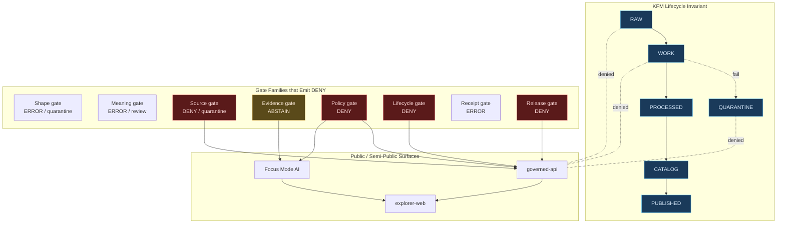

<!-- [KFM_META_BLOCK_V2]
doc_id: kfm://doc/security-deny-tests
title: KFM Deny Tests — Doctrine, Catalog, and Authoring Guide
type: standard
version: v1
status: draft
owners: <docs steward + security steward + policy steward — TODO>
created: 2026-05-13
updated: 2026-05-13
policy_label: public
related: [
  docs/doctrine/trust-membrane.md,
  docs/doctrine/truth-posture.md,
  docs/doctrine/lifecycle-law.md,
  docs/doctrine/directory-rules.md,
  docs/architecture/governed-api.md,
  docs/security/THREAT_MODEL.md,
  docs/security/EXPOSURE_POSTURE.md,
  docs/security/INCIDENT_RESPONSE.md,
  docs/runbooks/POLICY_VALIDATION.md,
  policy/README.md,
  tests/policy/README.md
]
tags: [kfm, security, policy, tests, governance, deny]
notes: [
  "Path-shaped claims are PROPOSED until verified against a mounted repo.",
  "OPA/Conftest examples follow the project's PROPOSED policy-as-code bootstrap; engine choice tracked in ADR backlog.",
  "Related sibling files in docs/security/ are placeholders pending creation."
]
[/KFM_META_BLOCK_V2] -->

# KFM Deny Tests

> **Negative-path proofs that the trust membrane fails closed — not just open.** Deny tests turn every refusal KFM promises (RAW exposure, uncited claims, sensitive coordinates, unresolved rights, missing receipts) into a reproducible, CI-enforced check.

<!-- BADGES — placeholder Shields.io targets; replace endpoints once repo + CI workflow names are verified. -->


| Field | Value |
|---|---|
| **Status** | `draft` — doctrine CONFIRMED, implementation PROPOSED |
| **Owners** | Docs steward · Security steward · Policy steward *(individual names TODO)* |
| **Last updated** | 2026-05-13 |
| **Authority** | Doctrine: CONFIRMED (per KFM encyclopedia + unified manual). Paths/tooling: PROPOSED until repo-verified. |
| **Conformance language** | RFC 2119-style — `MUST`, `SHOULD`, `MAY` |
| **Related doctrine** | [Trust membrane](../doctrine/trust-membrane.md) · [Truth posture](../doctrine/truth-posture.md) · [Lifecycle law](../doctrine/lifecycle-law.md) · [Directory Rules](../doctrine/directory-rules.md) |

---

## Contents

1. [Purpose & Scope](#1-purpose--scope)
2. [Doctrinal Basis](#2-doctrinal-basis)
3. [Where Deny Tests Live](#3-where-deny-tests-live)
4. [The Seven Gate Families & Their Deny Surfaces](#4-the-seven-gate-families--their-deny-surfaces)
5. [Deny Test Classes](#5-deny-test-classes)
6. [Fixture Conventions](#6-fixture-conventions)
7. [Example Deny Test (Rego + Fixture)](#7-example-deny-test-rego--fixture)
8. [Denial-Surface Flow Diagram](#8-denial-surface-flow-diagram)
9. [CI Parity & Spec-Hash Match](#9-ci-parity--spec-hash-match)
10. [Sensitive / Deny-by-Default Register](#10-sensitive--deny-by-default-register)
11. [Domain-Specific Deny Tests](#11-domain-specific-deny-tests)
12. [Anti-Patterns](#12-anti-patterns)
13. [What Deny Tests Do **Not** Cover](#13-what-deny-tests-do-not-cover)
14. [Authoring a New Deny Test — Checklist](#14-authoring-a-new-deny-test--checklist)
15. [Related Docs](#15-related-docs)
16. [Appendix A — Extended Fixture Vocabulary](#16-appendix-a--extended-fixture-vocabulary)
17. [Appendix B — Open Verification Items](#17-appendix-b--open-verification-items)

---

## 1. Purpose & Scope

Deny tests are the negative half of KFM's validation contract. Where positive tests prove an artifact *can* publish, deny tests prove the same artifact *cannot* publish under stated failure conditions — and that the system emits a structured, auditable refusal when it doesn't.

> [!IMPORTANT]
> **CONFIRMED negative-state rule** *(KFM Unified Implementation Architecture Build Manual, Phase 5 §24)*:
> validators **MUST** test `DENY`, `ABSTAIN`, `ERROR`, `quarantine`, `stale`, `restricted`, and `review-needed` paths — **not only successful publication.**

This document covers:

- The doctrinal basis for deny testing in KFM.
- The seven canonical gate families and the deny surfaces each guards.
- The fixture vocabulary every deny test draws from.
- An illustrative Rego/Conftest example and a fixture pair.
- CI/runtime parity expectations and spec-hash discipline.
- The Sensitive / Deny-by-Default Register and its test obligations.
- Authoring guidance for new deny tests.

It does **not** define schemas, contracts, policy bundles, or specific routes — those live in `schemas/`, `contracts/`, `policy/`, and `apps/governed-api/` respectively, and remain subject to Directory Rules §6 and ADR-0001.

[↑ Back to top](#kfm-deny-tests)

---

## 2. Doctrinal Basis

### 2.1 The four foundations

| Foundation | What it requires | Source |
|---|---|---|
| **Trust membrane** | Public and ordinary UI surfaces `MUST` deny direct access to RAW, WORK, QUARANTINE, unpublished candidate material, canonical/internal stores, direct databases, direct source credentials, direct model clients, and exact sensitive geometry. | CONFIRMED — Unified Manual §27; Domains Atlas §24.9.2 |
| **Cite-or-abstain** | Generated language without admissible evidence `MUST NOT` ride out as an `ANSWER`. The runtime collapses to `ABSTAIN` or `DENY`. | CONFIRMED — Encyclopedia AI Behavior; Governed AI Expansion §25 |
| **Lifecycle invariant** | Objects move RAW → WORK / QUARANTINE → PROCESSED → CATALOG / TRIPLET → PUBLISHED only through governed state transitions, never via file moves. Deny tests guard each transition. | CONFIRMED — Encyclopedia; Directory Rules §3 |
| **Fail-closed default** | When rights, sensitivity, evidence, source role, release state, or receipt is unclear or missing, the gate refuses. Silence and ambiguity are denials, not allowances. | CONFIRMED — Encyclopedia §13; Build Manual §24 |

### 2.2 What "DENY" means in KFM

`DENY` is a **finite runtime outcome** alongside `ANSWER`, `ABSTAIN`, and `ERROR`. It is carried in the `RuntimeResponseEnvelope` (governed API), the `DecisionEnvelope` (policy/promotion), and the `AIReceipt` (AI surface). A deny test asserts that a specific input yields a specific `DENY` outcome with a structured reason — not a generic 4xx, not a thrown exception, not silent dropping.

> [!NOTE]
> A deny test that asserts only "request fails" is **incomplete**. It `MUST` assert the *outcome enum*, the *reason code(s)*, and the *receipt or envelope shape* that the system emits on refusal.

[↑ Back to top](#kfm-deny-tests)

---

## 3. Where Deny Tests Live

> [!WARNING]
> The repository is **not mounted in the current session**. Every path below is **PROPOSED** per Directory Rules §6.5–§6.6 and ADR-0001 (schema-home convention). Treat as a placement *target*, verify against current repo evidence before relying on it, and record drift in `docs/registers/DRIFT_REGISTER.md`.

### 3.1 Proposed homes

| Home | Class | What lives here |
|---|---|---|
| `tests/policy/` | CONFIRMED canonical (Dir. Rules §6.6) | Conftest/OPA-style deny tests against `policy/` bundles. |
| `tests/runtime_proof/` | CONFIRMED canonical (Dir. Rules §6.6) | Finite-outcome proofs: `DENY`/`ABSTAIN`/`ERROR` envelope assertions. |
| `tests/contracts/`, `tests/schemas/`, `tests/validators/` | CONFIRMED canonical | Shape, meaning, and validator deny tests (schema-rejection, contract-violation). |
| `tests/api/`, `tests/ui/`, `tests/e2e/` | CONFIRMED canonical | Surface-level deny tests (route returns `DENY`, drawer renders denial, UI never reveals RAW). |
| `tests/domains/<domain>/` | CONFIRMED canonical | Domain-specific deny tests (e.g., archaeology exact-site denial). |
| `policy/tests/` | CONFIRMED (Dir. Rules §6.5) | Tests packaged *with* a policy bundle when needed; `MUST NOT` become a parallel home for `tests/policy/`. |
| `tests/fixtures/` **or** `fixtures/` | CONFIRMED — one home, not two | Deny fixtures. Two competing fixture roots are forbidden unless their READMEs declare the difference. |
| `docs/security/DENY_TESTS.md` | PROPOSED — this file | The doctrine + catalog (you are here). |

### 3.2 What does *not* belong here

- **Schema files.** They live under `schemas/contracts/v1/...` (ADR-0001).
- **Policy bundle source.** That lives under `policy/<family>/...`.
- **Release-decision artifacts.** Those live under `release/` and `data/manifests/`.
- **Receipts, proofs, and manifests.** Those live under `data/receipts/`, `data/proofs/`, `data/manifests/` and are *consumed* by deny tests, not authored here.

[↑ Back to top](#kfm-deny-tests)

---

## 4. The Seven Gate Families & Their Deny Surfaces

CONFIRMED gate matrix *(Unified Manual §24)*. Each row is a deny test family.

| Gate | Question it answers | Default failure outcome | Example deny fixture |
|---|---|---|---|
| **Shape gate** | Does the object match its schema and required version? | `ERROR` / quarantine | `invalid_schema_version.json` |
| **Meaning gate** | Does it conform to contract and vocabulary? | `ERROR` / review | `source_role_mismatch.json` |
| **Source gate** | Are source role, rights, cadence, and sensitivity known? | `DENY` / quarantine | `unresolved_rights.json` |
| **Evidence gate** | Do `EvidenceRef`s resolve to `EvidenceBundle`s? | `ABSTAIN` | `unresolved_evidence.json` |
| **Policy gate** | Is exposure allowed for this user, purpose, release class? | `DENY` | `restricted_exact_geometry.json` |
| **Lifecycle gate** | Is the object in the correct RAW → PUBLISHED state? | `DENY` | `publication_before_review.json` |
| **Receipt gate** | Are `RunReceipt` / `PromotionReceipt` / decision logs present? | `ERROR` | `missing_spec_hash.json` |
| **Release gate** | Does the manifest include proof, correction, rollback? | `DENY` | `release_without_rollback.json` |

> [!TIP]
> The `ABSTAIN` outcome on the **evidence gate** is intentional. Missing evidence is not a security denial — it is a truth refusal. Deny tests for evidence-gate failures `SHOULD` assert `ABSTAIN`, not `DENY`. Conflating the two is a documented anti-pattern.

[↑ Back to top](#kfm-deny-tests)

---

## 5. Deny Test Classes

CONFIRMED list *(repeated across every domain chapter of the KFM Encyclopedia, "K. Tests and validators")*: schema validation; source-descriptor validation; rights validation; sensitivity validation; evidence closure; temporal logic; geometry validity; **policy deny tests**; citation validation; release-manifest validation; rollback drill; no-network fixtures; non-regression tests.

The classes below organize those into reviewable families.

### 5.1 Trust-membrane deny tests

Public clients `MUST` not reach RAW, WORK, QUARANTINE, canonical/internal stores, model runtimes, or unpublished candidates. These tests probe surfaces with credentials and inputs designed to bypass the membrane and assert that every attempt yields a structured `DENY`.

| Test | Asserts |
|---|---|
| **No public RAW path** | Public route never returns a payload sourced from `data/raw/`. |
| **No public WORK / QUARANTINE path** | Same for work and quarantine lanes. |
| **No direct model client** | Browser/public route cannot call a local model runtime (Ollama, etc.) directly. |
| **No direct canonical store read** | Map shell / Evidence Drawer never reads canonical stores; reads via `governed-api/` only. |
| **Admin endpoint not on public path** | Admin routes refuse unauthenticated traffic and refuse the standard public origin. |

### 5.2 Source / rights deny tests

| Test | Asserts |
|---|---|
| **Unresolved rights → DENY** | Missing or ambiguous rights status blocks public promotion. |
| **Source-role mismatch → DENY** | A `modeled` source cannot be used where `observed` authority is required, and vice versa. |
| **Stale rights re-evaluation** | Aged-out rights cadence triggers re-review, not silent re-publication. |
| **No-redistribution license** | Licensed-but-not-redistributable sources cannot enter `PUBLISHED`. |

### 5.3 Sensitivity deny tests

Cross-references the [Sensitive / Deny-by-Default Register](#10-sensitive--deny-by-default-register).

| Test | Asserts |
|---|---|
| **Exact rare-species location → DENY** | Public surface returns generalized geometry only. |
| **Exact archaeology site → DENY** | Exact coordinates fail closed regardless of route, payload format, or 3D scene. |
| **Living-person exact data → DENY** | Personal data without legal basis / consent / review blocks public exposure. |
| **DNA/genomic inference → DENY** | Public AI surface refuses DNA-class inference. |
| **Aggregate-as-per-place** | An aggregate cited as a per-place observation triggers `DENY` (source-role collapse). |
| **Cross-lane join inference** | Aggregate + context joins that re-identify living persons fail closed. |

### 5.4 Evidence / citation deny tests

| Test | Asserts |
|---|---|
| **Uncited claim → ABSTAIN** | AI/runtime surface cannot publish language without admissible citations. |
| **Unresolved `EvidenceRef` → ABSTAIN** | Citation that doesn't resolve to an `EvidenceBundle` collapses the outcome to `ABSTAIN`. |
| **Citation validation failure → DENY** | A citation that resolves but fails admissibility checks blocks the answer. |

### 5.5 Lifecycle / release deny tests

| Test | Asserts |
|---|---|
| **Publish without review** | Material lacking required `ReviewRecord` cannot reach `PUBLISHED`. |
| **Publish without rollback target** | `ReleaseManifest` missing a rollback path fails the release gate. |
| **Publish without correction path** | Missing correction route fails the release gate. |
| **Source-role upgrade at promotion** | Promotion cannot upgrade `modeled` → `observed`; attempt yields `DENY`. |

### 5.6 Receipt / integrity deny tests

| Test | Asserts |
|---|---|
| **Missing `spec_hash`** | Promotion without a JCS+SHA-256 spec hash fails closed. |
| **`spec_hash` mismatch** | Run-time spec hash ≠ CI-recomputed hash is a hard fail *(C5-04, CONFIRMED)*. |
| **Unsigned receipt** | A `RunReceipt` lacking DSSE/cosign attestation fails the receipt gate. |
| **Provider not in allowlist** | A run claiming an unapproved provider/source is denied. |

### 5.7 Governed-AI deny tests

| Test | Asserts |
|---|---|
| **AI cannot answer from RAW/WORK** | `MockAdapter` (and real adapters) refuse to generate an `ANSWER` without admissible `EvidenceBundle`. |
| **AI never replaces life-safety guidance** | Emergency-warning prompts collapse to `DENY` with redirection. |
| **AI never returns exact sensitive geometry** | Even when the model "knows" the location from training, the gate denies. |
| **AI never paraphrases out of source role** | Upcasting an aggregate to a per-place fact via paraphrase is `DENY`. |

[↑ Back to top](#kfm-deny-tests)

---

## 6. Fixture Conventions

CONFIRMED fixture rule *(Build Manual §24)*: every major object family `MUST` have at least **one valid, one invalid, one denied, one abstention, and one rollback/correction fixture.** Sensitive lanes `MUST` use public-safe transformed fixtures — not real exact locations, living-person data, DNA material, rare-species coordinates, infrastructure detail, or archaeology geometry.

### 6.1 Canonical negative-fixture set

CONFIRMED catalog from KFM project notes *(New Ideas 5-8-26 §"Add Negative Tests Immediately")*:

| Fixture | Expected outcome | Gate family |
|---|---|---|
| `missing_spec_hash.json` | `DENY` | Receipt |
| `unresolved_evidence.json` | `ABSTAIN` | Evidence |
| `restricted_exact_geometry.json` | `DENY` | Policy / Sensitivity |
| `stale_evidence.json` | `DENY` *(or ABSTAIN, depending on policy module)* | Evidence / Source |
| `unknown_policy_label.json` | `DENY` | Policy |
| `publication_before_review.json` | `DENY` | Lifecycle / Release |

### 6.2 Naming and shape

| Convention | Rule |
|---|---|
| Naming | `<failure_class>_<short_descriptor>.{valid\|invalid}.json` |
| Outcome assertion | Each fixture **MUST** be paired with an expected `DecisionEnvelope` snapshot. |
| Determinism | Canonical JSON (JCS / RFC 8785) and sorted keys; `json.dumps(obj, sort_keys=True, separators=(",", ":"))` is the reference shape. |
| Public-safety | No real restricted coordinates, identities, or DNA bytes — synthesize. |
| Marker | Fixtures `MUST` carry an obvious mock/synthetic marker so they cannot be mistaken for real records. |

### 6.3 Fixture lock

CONFIRMED *(C5-03, Policy Parity)*: deny fixtures `MUST` be pinned by a `fixtures.lock` (or equivalent digest manifest) that both CI and the runtime PDP reference. Drift between CI fixtures and production fixtures is a parity break.

[↑ Back to top](#kfm-deny-tests)

---

## 7. Example Deny Test (Rego + Fixture)

> [!NOTE]
> The example below is **illustrative**. Tooling (OPA/Conftest) is a PROPOSED bootstrap candidate — the engine choice is not yet ratified in an ADR. Paths, package names, and the policy bundle layout are PROPOSED per Directory Rules §6.5. Use this to learn the shape of a deny test, not as a runnable recipe.

### 7.1 Illustrative Rego (promotion deny on missing spec hash)

```rego
package kfm.policy.gates.promotion

default allow = false
default outcome = "DENY"
default reasons = []

allow {
  input.action == "promote"
  input.resource.policy_label != ""
  input.resource.spec_hash != ""
  input.resource.release_review == "approved"
  count(blockers) == 0
}

outcome = "ANSWER" { allow }
outcome = "DENY"   { not allow }

blockers := [o | o := obligations[_]; o.type == "hold" or o.type == "deny"]
obligations := data.kfm.policy.obligations.redaction.obligations with input as input

reasons := rs {
  rs := [
    msg | msg := reason_required("policy_label", input.resource.policy_label);
    msg != ""
  ]
}

reason_required(name, v) := msg {
  v == ""
  msg := sprintf("missing_%s", [name])
}
```

### 7.2 Paired deny fixture (illustrative)

```json
{
  "actor":   { "id": "u2", "roles": ["public"] },
  "action":  "promote",
  "resource": {
    "kind":            "EvidenceBundle",
    "policy_label":    "restricted",
    "sensitivity":     "review_required",
    "spec_hash":       "",
    "release_review":  "pending"
  },
  "_meta": { "synthetic": true, "purpose": "deny_test_missing_spec_hash" }
}
```

### 7.3 Paired expected envelope (illustrative)

```json
{
  "decision_id":   "dec-<uuid>",
  "outcome":       "DENY",
  "policy_family": "promotion",
  "reasons":       ["missing_spec_hash", "release_review_not_approved"],
  "obligations":   [{ "type": "hold", "op": "steward_review" }],
  "evaluated_at":  "2026-05-13T00:00:00Z"
}
```

### 7.4 Local invocation (illustrative)

```bash
# PROPOSED — exact command names depend on the chosen policy engine and repo conventions.
conftest test \
  --policy policy/ \
  --namespace kfm.policy.gates.promotion \
  --input tests/fixtures/policy/missing_spec_hash.json

# Expect: failing assertion in the *allow* test, passing assertion in the *deny* test.
```

[↑ Back to top](#kfm-deny-tests)

---

## 8. Denial-Surface Flow Diagram



> [!NOTE]
> The dashed edges denote **denied** reads: no public surface may read directly from RAW/WORK/QUARANTINE. The trust membrane lives in `apps/governed-api/`; the renderer is *not* the membrane.

[↑ Back to top](#kfm-deny-tests)

---

## 9. CI Parity & Spec-Hash Match

CONFIRMED *(KFM Components Pass 10, C5-03 and C5-04)*: what runs in production policy enforcement `MUST` be exactly what CI tested.

| Requirement | Rule |
|---|---|
| **Bundle pinning** | The same OPA-style bundle digest (or equivalent) `MUST` be referenced by CI workflows and runtime deployment manifests. |
| **PDP version match** | The Policy Decision Point container/tag used in CI `MUST` match production. |
| **Fixture lock** | Deny fixtures `MUST` be versioned by a lockfile both CI and runtime reference. |
| **Golden suite** | A golden allow/deny suite `MUST` pass on every PR. Drift is a parity break. |
| **Spec-hash match (C5-04)** | The receipt's `spec_hash` `MUST` equal a freshly recomputed JCS + SHA-256 of the checked-in spec. Mismatch is a **hard fail**, never a warning. |
| **Admission control parity** | If/when cluster-side enforcement (Gatekeeper-style admission webhooks) lands, the same Rego the CI runs `MUST` run in-cluster *(C5-05)*. |

> [!CAUTION]
> A deny test that passes in CI but cannot be reproduced against the production PDP is not a deny test — it is **policy theatre**. Parity is the line between the two.

[↑ Back to top](#kfm-deny-tests)

---

## 10. Sensitive / Deny-by-Default Register

CONFIRMED register *(KFM Encyclopedia §13)*. Each row is a standing deny obligation that `MUST` be covered by at least one automated deny test.

| Class | Examples | Default outcome | Required controls |
|---|---|---|---|
| **Living persons** | Personal data, residences, identity assertions | `DENY` public exact / identifying output | Privacy review; redaction; aggregation; staged access |
| **DNA / genomics** | DNA matches, genomic inference, living-person relatives | `DENY` by default; restricted research only with policy approval | Separate restricted store; no public AI inference |
| **Rare species** | Exact taxa occurrence, nest, den, roost, spawning sites | `DENY` public exact location; generalized public products only | Geoprivacy transform receipt; steward review |
| **Archaeology** | Site coordinates, burial / sacred / culturally sensitive materials | `DENY` exact public location by default | Cultural / steward review; suppression / generalization |
| **Sacred / culturally sensitive places** | Oral history, cultural routes, sacred sites | `DENY` until steward review and access class approve | Consultation record; sensitivity transform |
| **Critical infrastructure** | Exact facilities, dependencies, condition observations | `RESTRICT` / `DENY` public precision | Public-safe aggregation; role-based access |
| **Private landowner-sensitive data** | Field boundaries, owner identity, operations | `DENY` exact / public if rights unclear | Aggregation; permissions; policy review |
| **Exact sensitive locations** | Any exact point that raises harm risk | `DENY` by default | Redaction / generalization; audit |
| **Emergency warning misuse** | Operational warnings, forecasts, hazard instructions | `DENY` life-safety replacement; contextual-only with official redirection | Not-for-life-safety disclaimer; issue / expiry freshness |
| **Source-rights-limited records** | Licensed, restricted, no-redistribution, uncertain terms | `DENY` public release until terms resolved | Rights register; attribution; no public derivative if barred |

> [!IMPORTANT]
> For every register row, the test suite `MUST` include a fixture that attempts the public-exact exposure and asserts `DENY` with a structured reason — and a public-safe-transform fixture that asserts the redacted public product is permitted.

[↑ Back to top](#kfm-deny-tests)

---

## 11. Domain-Specific Deny Tests

CONFIRMED rule *(Encyclopedia, every domain chapter "K. Tests and validators")*: every domain `MUST` include public-safe redaction / generalization, source-role mismatch denial, stale-state handling, and non-regression for prior lineage where relevant.

| Domain *(per Encyclopedia)* | Representative deny test |
|---|---|
| Hydrology | Source-role-collapse denial (model output cited as gauge observation). |
| Atmosphere / Air | AQI-as-concentration denial; AOD-as-PM2.5 denial; model-as-observed denial. |
| Fauna | Exact rare-species occurrence denial. |
| Flora | Exact rare-flora location denial. |
| Geology & natural resources | Source-rights-limited denial; exact-extraction-site denial. |
| Archaeology | Exact-site coordinate denial; burial / sacred-site denial; AI exact-location denial. |
| Roads, Rail & Trade | Cultural-route sensitivity denial; aggregate-as-per-place denial. |
| Settlements & Infrastructure | Critical-infrastructure precision denial. |
| Hazards | Life-safety-replacement denial; stale-warning denial. |
| Agriculture | Owner-identity denial; field-boundary denial when rights unclear. |
| People, DNA & Land | Living-person exact-data denial; DNA inference denial; person-parcel join denial. |
| Soil | Public-safe generalization denial when source role is unverified. |
| Habitat | Composite-sensitivity denial across fauna / flora / archaeology overlays. |
| 3D / synthetic spatial | Synthetic-as-observed denial (Reality Boundary Note required). |

Domain files belong under `tests/domains/<domain>/` and `fixtures/domains/<domain>/` (or `tests/fixtures/domains/<domain>/`) per Directory Rules §6.6.

[↑ Back to top](#kfm-deny-tests)

---

## 12. Anti-Patterns

> [!WARNING]
> These are the failure modes deny tests exist to catch. Each row maps to at least one mandatory deny test.

| Anti-pattern | What goes wrong | DENY surface |
|---|---|---|
| Public client reads RAW / WORK / QUARANTINE | Trust membrane bypassed; promotion gates skipped. | Governed API; layer manifest resolver |
| Map shell consumes canonical / internal store directly | Renderer becomes the public surface and inherits no governance. | MapLibre shell wiring; layer registry |
| AI returns uncited language | Generated text substitutes for evidence; cite-or-abstain broken. | Focus Mode; AI surface steward |
| AI answers from RAW / WORK rather than `EvidenceBundle` | AI becomes its own truth source. | Governed AI runtime; `AIReceipt` evaluator |
| Sensitive content released without redaction | `RedactionReceipt` missing; rights / sovereignty violation. | Release queue; sensitivity reviewer |
| Aggregate cited as per-place observation | Source-role collapse; matrix-cell semantics violated. | Validator; Focus Mode citation evaluator |
| Synthetic surface presented without Reality Boundary Note | Reconstruction read as observation. | Scene admission gate; representation-receipt validator |
| KFM used as alert / instruction authority | Out-of-scope life-safety use. | Hazards / Air / Hydrology surfaces |
| Release without `ReleaseManifest` or rollback target | Public surface cannot be rolled back; release not auditable. | Release queue; release authority |
| AI generation routed through admin shortcut | Admin bypass becomes a normal public path. | Trust-membrane audit; infra |
| Promotion that "upgrades" a source role | Source role is fixed at admission; never upgraded. | Validator; promotion gate |
| Deny test that asserts only "request fails" | Outcome enum, reasons, and envelope shape not checked. | Test review |

[↑ Back to top](#kfm-deny-tests)

---

## 13. What Deny Tests Do **Not** Cover

Deny tests are necessary but not sufficient. They `MUST NOT` be relied on for:

- **Penetration testing.** Adversarial discovery against deployed infra belongs to `docs/security/INCIDENT_RESPONSE.md` *(PROPOSED sibling)* and infra hardening drills.
- **Performance / DoS budgets.** Render budgets, decode/hash/heap probes, and tile-fetch rate limits live in runtime safety probes, not policy tests.
- **Schema discovery.** Deny tests assume the schema is correct; schema authoring lives in `schemas/contracts/v1/`.
- **Rights determination.** Deny tests *enforce* rights state; they do not *decide* it. Rights decisions live with the rights register and stewards.
- **Replacement for human review.** Two-key approval at the release gate is a human duty; deny tests guard the surface around it, not the judgment.

[↑ Back to top](#kfm-deny-tests)

---

## 14. Authoring a New Deny Test — Checklist

A new deny test is acceptable when **every** box can be checked:

- [ ] **Doctrine alignment.** The denial maps to a CONFIRMED rule in trust-membrane, truth-posture, lifecycle-law, the gate matrix, or the Sensitive / Deny-by-Default Register.
- [ ] **Gate family identified.** The test names exactly one gate family (Shape, Meaning, Source, Evidence, Policy, Lifecycle, Receipt, Release).
- [ ] **Expected outcome enum stated.** `DENY`, `ABSTAIN`, or `ERROR` — not just "fails".
- [ ] **Reason code(s) specified.** Structured reasons, not free text.
- [ ] **Envelope / receipt asserted.** The test checks the emitted `DecisionEnvelope`, `RuntimeResponseEnvelope`, or `AIReceipt` shape, not just the HTTP code.
- [ ] **Paired fixture present.** Fixture in `tests/fixtures/...` (or `fixtures/...`) with synthetic marker and no real restricted data.
- [ ] **Fixture lock updated.** Fixture digest registered in the parity lockfile.
- [ ] **CI parity verified.** Same bundle digest / PDP tag in CI and runtime.
- [ ] **Rollback path noted.** PR description identifies how to disable the rule and revert the fixture if it fires unexpectedly.
- [ ] **Receipt for the test run** *(PROPOSED)*. The CI job emits a structured run receipt; deny-test outcomes are themselves auditable.
- [ ] **Cross-references added.** This file, the per-domain README, and `docs/registers/DRIFT_REGISTER.md` (if the test exposes an existing drift) are updated.

[↑ Back to top](#kfm-deny-tests)

---

## 15. Related Docs

- [docs/doctrine/trust-membrane.md](../doctrine/trust-membrane.md) *(PROPOSED — sibling doctrine doc)*
- [docs/doctrine/truth-posture.md](../doctrine/truth-posture.md) *(PROPOSED)*
- [docs/doctrine/lifecycle-law.md](../doctrine/lifecycle-law.md) *(PROPOSED)*
- [docs/doctrine/directory-rules.md](../doctrine/directory-rules.md) — placement authority
- [docs/architecture/governed-api.md](../architecture/governed-api.md) *(PROPOSED — finite-outcome envelopes)*
- [docs/security/THREAT_MODEL.md](./THREAT_MODEL.md) *(PROPOSED — sibling, may not yet exist)*
- [docs/security/EXPOSURE_POSTURE.md](./EXPOSURE_POSTURE.md) *(PROPOSED — sibling, may not yet exist)*
- [docs/security/INCIDENT_RESPONSE.md](./INCIDENT_RESPONSE.md) *(PROPOSED — sibling, may not yet exist)*
- [docs/runbooks/POLICY_VALIDATION.md](../runbooks/POLICY_VALIDATION.md) *(PROPOSED)*
- [policy/README.md](../../policy/README.md) *(PROPOSED)*
- [tests/policy/README.md](../../tests/policy/README.md) *(PROPOSED)*

[↑ Back to top](#kfm-deny-tests)

---

## 16. Appendix A — Extended Fixture Vocabulary

<details>
<summary><b>Click to expand — illustrative fixture name catalog (PROPOSED).</b></summary>

The names below extend the canonical six negative fixtures from §6.1. Treat as a *vocabulary*, not a required tree.

```text
tests/fixtures/policy/
├── promotion/
│   ├── missing_spec_hash.json                # → DENY (Receipt)
│   ├── unknown_policy_label.json             # → DENY (Policy)
│   ├── publication_before_review.json        # → DENY (Lifecycle)
│   ├── release_without_rollback.json         # → DENY (Release)
│   ├── source_role_upgrade_attempt.json      # → DENY (Source / Meaning)
│   └── unsigned_run_receipt.json             # → ERROR/DENY (Receipt)
├── evidence/
│   ├── unresolved_evidence.json              # → ABSTAIN (Evidence)
│   ├── stale_evidence.json                   # → DENY or ABSTAIN
│   └── citation_validation_failure.json      # → DENY (Evidence)
├── sensitivity/
│   ├── restricted_exact_geometry.json        # → DENY (Policy / Sensitivity)
│   ├── living_person_exact_data.json         # → DENY
│   ├── dna_inference_request.json            # → DENY
│   ├── rare_species_exact_location.json      # → DENY
│   ├── archaeology_exact_site.json           # → DENY
│   └── infrastructure_exact_facility.json    # → DENY / RESTRICT
├── trust_membrane/
│   ├── public_read_raw.json                  # → DENY
│   ├── public_read_work.json                 # → DENY
│   ├── public_read_quarantine.json           # → DENY
│   ├── direct_model_client_call.json         # → DENY
│   └── admin_route_via_public_origin.json    # → DENY
└── ai/
    ├── uncited_answer.json                   # → ABSTAIN
    ├── ai_from_raw.json                      # → DENY
    ├── ai_paraphrase_role_upcast.json        # → DENY
    ├── ai_life_safety_replacement.json       # → DENY
    └── ai_exact_sensitive_location.json      # → DENY
```

Each entry `SHOULD` be accompanied by:

- A `*.expected.json` envelope snapshot (or equivalent assertion file).
- A short docstring identifying the doctrinal rule it enforces.
- A `synthetic: true` flag in the fixture body.

</details>

[↑ Back to top](#kfm-deny-tests)

---

## 17. Appendix B — Open Verification Items

> [!NOTE]
> These items are NEEDS VERIFICATION until a mounted repo confirms them.

| Item | Current label | Verification step |
|---|---|---|
| Existence of `tests/policy/`, `tests/runtime_proof/`, `policy/tests/` | NEEDS VERIFICATION | Inspect repo against Directory Rules §6.5–§6.6. |
| Policy engine choice (OPA/Conftest vs alternative) | PROPOSED | Open / locate ADR; pin engine and bundle format. |
| Bundle pinning mechanism (digest source of truth) | PROPOSED | Confirm `governance/policy-bundle.json` or equivalent (per C5-03). |
| Fixture-lock format | PROPOSED | Confirm `fixtures.lock` or per-bundle digest manifest. |
| CI workflow names for deny suites | UNKNOWN | Inspect `.github/workflows/` once mounted. |
| Sibling `docs/security/` files referenced here | NEEDS VERIFICATION | Confirm `THREAT_MODEL.md`, `EXPOSURE_POSTURE.md`, `INCIDENT_RESPONSE.md` paths. |
| Sensitive-class enumeration parity | NEEDS VERIFICATION | Cross-check this file's §10 against `policy/sensitivity/` once present. |
| In-cluster admission control parity (Gatekeeper-style) | PROPOSED | Verify whether Kubernetes admission is in scope for current deployment topology. |

[↑ Back to top](#kfm-deny-tests)

---

<sub>
**Related docs:** [Trust membrane](../doctrine/trust-membrane.md) · [Directory Rules](../doctrine/directory-rules.md) · [Governed API](../architecture/governed-api.md) · [Threat model](./THREAT_MODEL.md) · [Exposure posture](./EXPOSURE_POSTURE.md) · [Incident response](./INCIDENT_RESPONSE.md)<br/>
**Last updated:** 2026-05-13 · **Version:** v1 (draft) · **Owners:** Docs / Security / Policy stewards *(TODO)* · [↑ Back to top](#kfm-deny-tests)
</sub>
