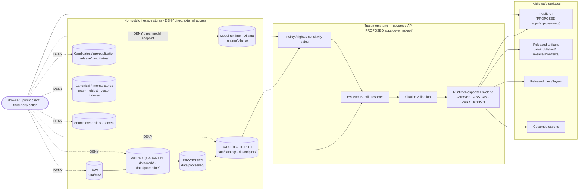
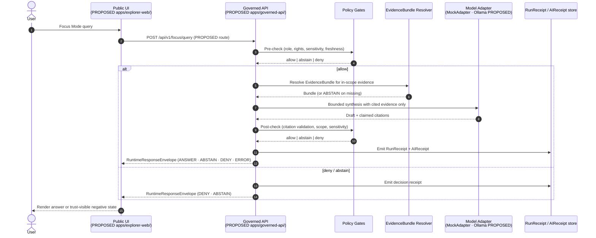

<!-- [KFM_META_BLOCK_V2]
doc_id: kfm://doc/NEEDS_VERIFICATION
title: KFM Exposure Plan
type: standard
version: v1
status: draft
owners: [Security steward (NEEDS_VERIFICATION), Docs steward (NEEDS_VERIFICATION), Release manager (NEEDS_VERIFICATION)]
created: 2026-05-13
updated: 2026-05-13
policy_label: public
related:
  - docs/doctrine/trust-membrane.md
  - docs/doctrine/directory-rules.md
  - docs/architecture/governed-api.md
  - docs/architecture/deployment-topology.md
  - docs/runbooks/
  - infra/README.md
  - policy/README.md
tags: [kfm, security, exposure, trust-membrane, governed-api, deny-by-default]
notes:
  - Path-shaped claims are PROPOSED until verified against the mounted repository.
  - Doctrinal claims are CONFIRMED from the attached KFM corpus.
  - This document is policy-significant; changes require security-steward sign-off.
[/KFM_META_BLOCK_V2] -->

# KFM Exposure Plan

> **What KFM exposes, what it must not expose, and the membrane that decides.**
> A governance document for the Kansas Frontier Matrix exposure posture: which surfaces leave the system, what governs each surface, and what must remain deny-by-default.

<p align="left">
  
  
  
  
  
  
</p>

| Field | Value |
|---|---|
| **Status** | `draft` |
| **Owners** | Security steward · Docs steward · Release manager *(names NEEDS VERIFICATION)* |
| **Policy label** | `public` *(the doc itself; not its subject matter)* |
| **Last reviewed** | 2026-05-13 |
| **Authority** | Doctrine sections — **CONFIRMED**. Path-shaped claims — **PROPOSED** until mounted-repo evidence is inspected. |
| **Related ADRs** | None accepted yet *(NEEDS VERIFICATION; track in `docs/adr/`)* |

> [!IMPORTANT]
> **The exposure plan is a policy-significant artifact.** Public clients and normal UI surfaces consume governed APIs and released payloads — never raw stores, canonical truth, model runtimes, or unpublished candidates. **Deny-by-default is the rule, not a tuning knob.** When in doubt, this document deny.

---

<a id="top"></a>

## Quick jump

- [1. Purpose and scope](#1-purpose-and-scope)
- [2. Authority and sources](#2-authority-and-sources)
- [3. Trust membrane (diagram)](#3-trust-membrane)
- [4. Surface inventory](#4-surface-inventory)
- [5. What MAY be exposed](#5-what-may-be-exposed)
- [6. What MUST NOT be exposed](#6-what-must-not-be-exposed)
- [7. Sensitivity posture](#7-sensitivity-posture)
- [8. Local deployment controls](#8-local-deployment-controls)
- [9. AI exposure boundary](#9-ai-exposure-boundary)
- [10. Admin, review, and steward surfaces](#10-admin-review-and-steward-surfaces)
- [11. Telemetry and logging](#11-telemetry-and-logging)
- [12. Verification and test hooks](#12-verification-and-test-hooks)
- [13. Incident response](#13-incident-response)
- [14. Open verification items](#14-open-verification-items)
- [15. Change discipline](#15-change-discipline)
- [Related docs](#related-docs)

---

## 1. Purpose and scope

The Exposure Plan answers four questions for every surface that touches the outside world:

1. **What** is being exposed (object family, lifecycle phase, sensitivity)?
2. **Where** does it cross the boundary (route, file path, header, log line)?
3. **What governs** the crossing (policy gate, evidence resolution, release state)?
4. **What happens** when the governance check fails (deny, abstain, quarantine, error)?

The plan covers public web UI, public/semi-public APIs, exported files, tile and asset hosting, telemetry, logs, AI runtime egress, and the review/steward surfaces that sit alongside the public path.

The plan **does not** cover:

- Object-family meaning *(see `contracts/`)*
- Field-level shape *(see `schemas/`)*
- Per-decision policy rules *(see `policy/`)*
- Release decisions and rollback cards *(see `release/`)*
- Deployment mechanics or host hardening *(see `infra/` — those concerns belong in `infra/README.md` and the relevant runbooks; this document references them but does not duplicate them)*

> [!NOTE]
> **Exposure is governed by responsibility, not by topic.** A "public map tile" is not exposed because it is a tile; it is exposed because it carries a resolved `EvidenceBundle`, a valid `ReleaseManifest`, a passed `PolicyDecision`, and a known rollback target. Strip any one of those and the exposure becomes a violation.

[Back to top ↑](#top)

---

## 2. Authority and sources

### 2.1 Authority order

When sources disagree about exposure posture, resolve in this order:

1. **KFM core invariants** — lifecycle law, truth posture (cite-or-abstain), trust membrane, authority ladder.
2. **Accepted ADRs that amend this plan**, by ADR number. *(None recorded yet — NEEDS VERIFICATION.)*
3. **This document.**
4. **`infra/README.md`** for deployment-level posture *(PROPOSED; path NEEDS VERIFICATION).*
5. **Per-policy bundle README** under `policy/` for fine-grained access rules.
6. **Current repo convention.** When it conflicts with this plan, raise it as a `docs/registers/DRIFT_REGISTER.md` entry — not as new authority.

### 2.2 Doctrinal anchors

| Anchor | Status | Source |
|---|---|---|
| Public surfaces consume governed APIs and released artifacts only | **CONFIRMED** | KFM Unified Manual §5.4 / Whole-UI Expansion §25 |
| AI runtime must sit behind governed API, evidence, policy, citation, envelope, receipt | **CONFIRMED** | KFM Unified Manual §5.4 |
| Exact archaeology / living-person / DNA / rare-species / sensitive infrastructure → fail-closed | **CONFIRMED** | KFM Unified Manual §5.4 (DOM-ARCH, DOM-PEOPLE, DOM-FAUNA, DOM-FLORA, DOM-HAZ) |
| Local deployments — least privilege, deny-by-default CORS, secret isolation, audit logs, no public admin shortcuts | **PROPOSED** | KFM Unified Manual §5.4 (BLD-GREEN §18; BLD-COMP §§21-23, 31) |
| Reverse-proxy rules, branch protections, signing-key custody, SSO/role mapping, audit retention, backup/restore | **NEEDS VERIFICATION** | KFM Unified Manual §5.4 |
| Promotion is a governed state transition, **not** a file move | **CONFIRMED** | Directory Rules §0 / Lifecycle invariant |

[Back to top ↑](#top)

---

## 3. Trust membrane

The trust membrane is the single boundary between non-public lifecycle stores and public-safe surfaces. **Operational form: a governed API (PROPOSED home `apps/governed-api/`).** No public client, normal UI, or released AI surface may reach across this membrane.



> [!NOTE]
> **What the diagram says doctrinally:** every arrow that crosses the membrane carries a `PolicyDecision`, a resolved `EvidenceBundle`, and a finite `RuntimeResponseEnvelope` outcome. Every dashed line is an exposure-violation pattern that must be denied by route configuration, by browser-network policy, and by tests — not just by convention.

[Back to top ↑](#top)

---

## 4. Surface inventory

A surface is any place where bytes leave KFM custody and reach a non-steward consumer. Each surface MUST declare its governing route, its release state, and its negative-state behavior.

| Surface | Direction | Governed by | Default exposure | Status |
|---|---|---|---|---|
| Public web UI | egress | Governed API client *(PROPOSED `apps/explorer-web/src/api/governedClient.ts`)* | Released layers, drawer payloads, story manifests | **PROPOSED** |
| Governed API HTTP routes | egress | `apps/governed-api/` *(PROPOSED)* | Released artifacts, `RuntimeResponseEnvelope` | **PROPOSED** |
| Tile / PMTiles / COG hosting | egress | `data/published/`, `release/manifests/` | Released artifacts only; Range + CORS pinned | **PROPOSED** |
| Style / sprite / glyph hosting | egress | `StyleManifest` references | Versioned, manifest-tied | **PROPOSED** |
| Governed exports (downloads) | egress | Export policy *(PROPOSED `policy/export/`)* | Rights + sensitivity + proof refs travel with the export, or export is denied | **CONFIRMED doctrine / PROPOSED implementation** |
| Telemetry (UI event stream) | egress | Safe-by-construction envelope *(PROPOSED `schemas/contracts/v1/telemetry/ui_event.schema.json`)* | No raw evidence, no prompt text, no restricted geometry, no secrets, no full `EvidenceBundle` copies | **CONFIRMED doctrine / PROPOSED schema** |
| Source connectors | ingress | `connectors/` → `data/raw/` or `data/quarantine/` | Connectors do not publish | **CONFIRMED doctrine** |
| Admin / review console | egress (to stewards) | Separate route + auth; never the public path | Deny-by-default; auth required; admin shortcuts must be justified, constrained, documented | **PROPOSED implementation** |
| AI runtime (Focus Mode) | internal egress to model | Governed-API adapter only | No direct browser → model; pre/post policy checks; citation validation | **CONFIRMED doctrine / PROPOSED implementation** |
| Source credentials | none | `infra/` secret store + per-connector identities | **Never** reach the browser; never live in `configs/` | **CONFIRMED doctrine** |
| Logs / audit | internal only | `infra/` log sinks | Redacted; no raw payloads, no PII; **NEEDS VERIFICATION** retention policy | **NEEDS VERIFICATION** |

> [!CAUTION]
> **Any surface that does not appear in this table is implicitly DENY.** Adding a surface requires updating this inventory in the same PR — no quiet exposures.

[Back to top ↑](#top)

---

## 5. What MAY be exposed

Public-safe outputs are downstream of evidence resolution, policy decision, sensitivity review, and release. **CONFIRMED** in KFM doctrine; **PROPOSED** in implementation.

A surface MAY be exposed when **all** of the following hold:

1. The underlying object resolves to an `EvidenceBundle`.
2. The `PolicyDecision` is `allow` for the requested action, role, sensitivity, and rights.
3. The `ReleaseManifest` shows `release_state == PUBLISHED`, `policy_label != unknown`, `rights_status != unknown`, `sensitivity == public` (or a documented public-safe transform applies).
4. A rollback target exists.
5. A correction path exists.
6. The payload is validated against its `schemas/contracts/v1/...` shape at the boundary.
7. The response is wrapped in a finite `RuntimeResponseEnvelope` (`ANSWER`, `ABSTAIN`, `DENY`, `ERROR`).

If any of (1)–(7) fails, the surface returns `ABSTAIN` or `DENY` — never a best-effort answer.

```text
EvidenceBundle resolves
   AND  PolicyDecision == allow
   AND  ReleaseManifest in PUBLISHED state
   AND  rollback target exists
   AND  correction path exists
   AND  schema validates at the boundary
   AND  envelope is finite
   ──>  MAY expose
otherwise
   ──>  ABSTAIN  or  DENY  (never a partial answer)
```

[Back to top ↑](#top)

---

## 6. What MUST NOT be exposed

The non-public set is **CONFIRMED doctrine**. Browser, public client, and any released AI surface must be denied direct access to:

- `RAW` — admitted source material under source identity.
- `WORK` / `QUARANTINE` — candidate and held material.
- `PROCESSED` — pre-publication normalized outputs.
- `CATALOG` / `TRIPLET` — discovery and graph surfaces, except via governed payloads.
- Unpublished release candidates *(`release/candidates/`, PROPOSED path)*.
- Canonical / internal stores — direct databases, graph stores, object stores, vector indexes.
- Direct source credentials and secrets.
- Direct model client endpoints (Ollama or any LLM runtime).
- Exact sensitive geometry — archaeology sites, rare-species occurrence, living-person locations, sensitive infrastructure assets.
- Service handles, admin endpoints, and steward console routes via the public path.

> [!WARNING]
> **A toggle on the public UI is not publication.** Showing a feature in MapLibre does not constitute a release. Publication is a governed state transition recorded in `release/manifests/`. Hiding a sensitive feature with a style filter is not redaction — the geometry must be transformed before publication and proven absent from public artifacts.

[Back to top ↑](#top)

---

## 7. Sensitivity posture

The following lanes require **fail-closed** exposure controls until release support is explicit. **CONFIRMED.**

| Lane | Default exposure | Required transform before any public surface |
|---|---|---|
| Archaeology — exact site locations | **DENY** | Generalize (e.g., H3 floor), redact, or stage access; never publish exact geometry without steward + rights-holder approval. |
| People · genealogy · DNA · land | **DENY / RESTRICT** | Living-person and DNA-derived outputs remain denied or restricted by default; deceased/historical persons follow review state and rights. |
| Fauna · rare-species occurrence | **DENY exact** | Geoprivacy controls; rare-species generalization; aggregate-only public surfaces. |
| Flora · rare-species occurrence | **DENY exact** | Same as fauna; rare-status uses generalization. |
| Critical infrastructure | **POLICY-GATED** | Bridge / condition / inspection / vulnerable facility geometry requires generalization, staged access, or denial. |
| Hazards | **CONTEXT-ONLY** | Hazards analysis is not an emergency alerting system; freshness, source, and confidence must travel with every claim. |
| Culturally sensitive routes / sites | **CARE / consent-first** | Sovereignty and CARE chips govern display; default tier generalizes or hides. |

> [!IMPORTANT]
> **Per-lane gates expand in domain dossiers** *(see `docs/domains/archaeology/`, `docs/domains/people-dna-land/`, `docs/domains/hazards/`, etc.)*. This table is the exposure-side summary, not the source of truth. When the domain dossier and this table disagree, the dossier wins and this table is corrected.

[Back to top ↑](#top)

---

## 8. Local deployment controls

KFM is designed to run as a local, optionally exposed deployment (e.g., behind a home reverse proxy or VPN). **PROPOSED** controls follow; specific configurations are **NEEDS VERIFICATION** against mounted `infra/` evidence.

### 8.1 Network posture

| Control | Doctrine | Status |
|---|---|---|
| Deny-by-default CORS — explicit allow-list of trusted UI origins | **CONFIRMED doctrine** | **PROPOSED** config |
| Reverse-proxy rules — public path reaches `apps/governed-api/` only | **CONFIRMED doctrine** | **NEEDS VERIFICATION** rules |
| No public surface for source credentials, canonical stores, model runtimes | **CONFIRMED doctrine** | **PROPOSED** rules |
| TLS on every external surface, including LAN exposures | **PROPOSED** | **NEEDS VERIFICATION** |
| Rate limits on governed-API egress and Focus Mode | **PROPOSED** | **NEEDS VERIFICATION** thresholds |
| Range / CORS headers pinned for PMTiles and COG hosting | **CONFIRMED doctrine** | **NEEDS VERIFICATION** in staging |
| Outbound network egress for AI runtimes restricted to known endpoints | **PROPOSED** | **NEEDS VERIFICATION** |

### 8.2 Secrets and credentials

- `configs/` MUST NOT store real secrets — ever, even for `test` or `local`. *(Directory Rules §10.3, **CONFIRMED**.)*
- Real secrets live in environment-specific secret stores referenced by name; if a real secret lands in `configs/`, treat it as an incident: **rotate, audit, and write a runbook entry in `docs/runbooks/`.**
- Source credentials never reach the browser and never appear in client-side bundles, source maps, or telemetry payloads.
- Signing-key custody for DSSE attestations is **NEEDS VERIFICATION**; resolve before any signed release.

### 8.3 Admin shortcuts

Admin endpoints exist, but they are **not** the normal public path.

> [!CAUTION]
> **Admin shortcuts MUST be justified, constrained, documented, and kept out of the normal public path.** No "admin via query parameter," no "elevated by header," no "trust the local network." If a shortcut exists, it must appear in this document, in `infra/README.md`, and in an ADR explaining why.

[Back to top ↑](#top)

---

## 9. AI exposure boundary

**CONFIRMED** — AI runtime access must sit behind governed API controls, evidence resolution, policy checks, citation validation, finite response envelopes, and receipts.



Rules:

- **MockAdapter first.** `MockAdapter` is the default for tests and bootstrap. Real model adapters are **PROPOSED**.
- **Ollama** (or any local LLM) is permitted only as a replaceable runtime **behind the governed boundary** — never as a public truth surface or direct client endpoint.
- **No browser → model** direct calls. Ever. The Focus Mode client speaks only to the governed API.
- **Citation validation is mandatory.** Uncited model output → `ABSTAIN`.
- **Telemetry** about Focus Mode calls excludes prompt text, raw evidence, and restricted geometry.

[Back to top ↑](#top)

---

## 10. Admin, review, and steward surfaces

Stewards and release managers need surfaces that public clients must not have. Separating them is part of the exposure plan, not separate from it.

| Surface | Audience | Path | Exposure rule |
|---|---|---|---|
| Public UI | Anyone | `apps/explorer-web/` *(PROPOSED)* | Governed API only; no admin affordances visible |
| Review console | Stewards, release managers | Distinct route or app; auth required *(PROPOSED)* | Never on the normal public path; deny-by-default to unauthenticated callers |
| Promotion dry-run | Release managers | CI + `release/candidates/` *(PROPOSED)* | No live publication side-effects |
| Rollback drill | Release managers | Runbook-driven *(PROPOSED `docs/runbooks/release_rollback.md`)* | Produces `RollbackCard`; never silently restores |
| Source-credential management | Infra owners | `infra/` only | Never via browser; never in `configs/` |

> [!NOTE]
> **Separation of duties.** When materiality justifies it, the author of a release candidate is **not** the same person who promotes it. The exposure plan does not enforce this on its own — it relies on the review record, the promotion decision, and the release manifest carrying distinct identities. The audit is the enforcement; this document is the doctrine.

[Back to top ↑](#top)

---

## 11. Telemetry and logging

Telemetry is **safe by construction**. **CONFIRMED.**

UI events crossing the membrane must conform to a `TelemetryEvent` shape *(PROPOSED `schemas/contracts/v1/telemetry/ui_event.schema.json`)* that **excludes**:

- Raw evidence content
- Prompt text or model output bodies
- Restricted or exact-sensitive geometry
- Secrets, tokens, or session credentials
- Full `EvidenceBundle` copies

Logs follow the same posture. Server-side logs may include identifiers, timing, decision outcomes, and policy-decision IDs, but **not** payloads that would re-create the underlying sensitive object.

> [!WARNING]
> **No-data is not silence.** If the system cannot emit a safe telemetry event, it emits **nothing** — but the failure is recorded in an internal audit log. Hiding the failure from the audit is a violation; hiding it from the user is fine.

[Back to top ↑](#top)

---

## 12. Verification and test hooks

Exposure rules must be enforceable. **PROPOSED** minimum test set:

| Test class | Asserts | Status |
|---|---|---|
| Route fixture — no public RAW / WORK / QUARANTINE / canonical path | The browser cannot reach non-public stores by any route or query trick | **PROPOSED** |
| No-direct-model test | No client bundle, no route, and no CORS rule permits browser → model runtime | **PROPOSED** |
| No-unreleased-tile test | Layer catalog and style JSON load only manifests with `release_state == PUBLISHED` | **PROPOSED** |
| Sensitive-geometry deny + redaction-receipt fixture | Public surfaces never serve exact restricted geometry; redaction emits a receipt | **PROPOSED** |
| Citation-validation pass / fail | Cited model output validates; uncited or unresolved citations → `ABSTAIN` | **PROPOSED** |
| Rollback-restoration test | A rollback drill restores the prior manifest and records cache invalidation | **PROPOSED** |
| Stale-source badge + Focus Mode `ABSTAIN` fixture | Stale evidence triggers the trust-visible badge and forces `ABSTAIN` | **PROPOSED** |
| Telemetry-payload schema test | No raw evidence, prompt text, restricted geometry, or secrets leak through telemetry | **PROPOSED** |
| Export-citation preservation | Exports carry rights, sensitivity, proof refs, release state, correction lineage — or are denied | **PROPOSED** |
| CORS deny-by-default | Origins outside the allow-list receive a CORS denial, not a partial response | **PROPOSED** |
| Admin-surface auth test | Unauthenticated and under-privileged callers receive `DENY` on every admin route | **PROPOSED** |

CI workflow status is **NEEDS VERIFICATION** until a mounted-repo inspection confirms which of these run today.

[Back to top ↑](#top)

---

## 13. Incident response

Incident response is governed by a separate runbook *(PROPOSED `docs/runbooks/security_incident.md`)*. This section names the exposure-side hooks only.

<details>
<summary><b>Exposure-side incident triggers and required first actions</b></summary>

| Trigger | First action | Then |
|---|---|---|
| Real secret found in `configs/`, repo history, logs, or any artifact | **Rotate immediately**, audit, open a runbook entry | Open a `docs/registers/DRIFT_REGISTER.md` entry; review the connector / runner that emitted it |
| Public route reaches RAW / WORK / QUARANTINE / canonical | Disable the route via feature flag; revert PR | File ADR for the bypass discovery; add the missing route fixture test |
| Public path returns uncited AI output | Disable Focus Mode (feature flag); fall back to `ABSTAIN` envelope | Audit `AIReceipt` for the offending session; add the missing citation-validation test |
| Sensitive geometry exposed in a tile, layer, popup, or export | Withdraw the release manifest; emit `CorrectionNotice`; invalidate downstream derivatives | Re-promote only after redaction receipt + steward sign-off |
| Direct model endpoint reachable from a browser | Block at reverse proxy; remove the route; rotate any model credentials | Add the no-direct-model fixture; add a regression test |
| Source-rights violation discovered after publication | Withdraw release; emit `CorrectionNotice`; notify rights-holder per source descriptor | Re-promote only after rights resolution + steward sign-off |
| Telemetry payload includes raw evidence or prompt text | Stop the telemetry stream; purge downstream stores per retention policy | Tighten `TelemetryEvent` schema; add a payload test |
| Admin shortcut found on the public path | Remove the shortcut; revert PR; require ADR before re-introduction | Document the violation in `docs/registers/DRIFT_REGISTER.md` |

</details>

> [!IMPORTANT]
> **Fail-closed is the default response to ambiguity.** When the incident is in progress and the cause is unclear, the safe action is to deny, withdraw, or quarantine — not to investigate while the surface stays open.

[Back to top ↑](#top)

---

## 14. Open verification items

These items are explicitly **not resolved** by this document and SHOULD be tracked in `docs/registers/VERIFICATION_BACKLOG.md` and addressed via ADR, runbook, or per-root README.

- **NEEDS VERIFICATION:** Whether `apps/governed-api/` exists in the current mounted repo, and which framework / routing convention it uses.
- **NEEDS VERIFICATION:** Whether `apps/explorer-web/` exists, or whether the current shell home is `ui/`, `web/`, or another path.
- **NEEDS VERIFICATION:** Reverse-proxy rules, branch protections, CORS allow-list, rate limits, audit retention, backup / restore behavior.
- **NEEDS VERIFICATION:** Signing-key custody for DSSE attestations and the cosign / sigstore configuration.
- **NEEDS VERIFICATION:** SSO / role mapping for review, release, and admin surfaces.
- **NEEDS VERIFICATION:** Package CVEs, dependency licenses, and the dependency allow-list for MapLibre, PMTiles, GDAL, Tippecanoe, and related tooling.
- **NEEDS VERIFICATION:** Per-lane redaction transform thresholds (e.g., H3 floor) and steward-approval records.
- **NEEDS VERIFICATION:** Storage-bucket policy (PMTiles / COG hosting) and immutable-cache configuration.
- **NEEDS VERIFICATION:** Whether `infra/README.md` exists and whether it carries the deny-by-default declaration required by Directory Rules §10.2.
- **OPEN:** Whether the review console lives in `apps/` (as a sibling app) or behind a role-gated route in the same governed-API surface. An ADR is recommended.

[Back to top ↑](#top)

---

## 15. Change discipline

This document is policy-significant. Changes follow the same discipline KFM imposes on any governance artifact.

| Change type | What's required |
|---|---|
| Typo, clarification, dead-link fix | Routine PR |
| Adding a surface to the inventory | PR + security-steward review |
| Tightening a deny rule | PR + security-steward review |
| Loosening a deny rule | **ADR required**; cite the doctrine being amended; record in `docs/registers/DRIFT_REGISTER.md` |
| Introducing a new admin shortcut on or near the public path | **ADR required**; the ADR must explain constraint, audit, and exit path |
| Changing the AI exposure boundary (e.g., admitting a new model runtime) | **ADR required** + tests + runbook update |
| Changing the trust-membrane operational form (e.g., moving the governed API home) | **ADR required** + migration plan + Directory Rules update |

> [!NOTE]
> **Every PR touching this document MUST update §0 "Last reviewed" and SHOULD cite the ADR if one applies.** Anchor stability matters: the `#top` and section anchors here are linked from runbooks, ADRs, and per-root READMEs.

[Back to top ↑](#top)

---

## Related docs

- `docs/doctrine/trust-membrane.md` — the doctrinal definition of the boundary this plan operationalizes *(PROPOSED path; NEEDS VERIFICATION).*
- `docs/doctrine/directory-rules.md` — placement law for `docs/security/`, `infra/`, `apps/governed-api/`, and friends *(CONFIRMED home per §6.1).*
- `docs/architecture/governed-api.md` — the API surface this plan defends *(PROPOSED).*
- `docs/architecture/deployment-topology.md` — host, network, and deployment shape *(PROPOSED).*
- `docs/runbooks/` — security incident, rollback drill, validation runs, secret rotation *(PROPOSED).*
- `infra/README.md` — deny-by-default, least-privilege deployment posture per Directory Rules §10.2 *(PROPOSED).*
- `policy/README.md` — admissibility and release-policy modules *(PROPOSED).*
- `docs/registers/DRIFT_REGISTER.md` — record exposure drifts here; not as new authority *(PROPOSED).*
- `docs/registers/VERIFICATION_BACKLOG.md` — track the NEEDS VERIFICATION items above *(PROPOSED).*
- `docs/adr/` — ADRs that amend this plan *(PROPOSED; none accepted yet).*

---

<!--
  Footer block — required by KFM presentation standard for long docs.
  Keep the back-to-top anchor and the last-updated line in sync with the meta block.
-->

**Last updated:** 2026-05-13 · **Version:** v1 (draft) · **Owners:** Security steward · Docs steward · Release manager *(NEEDS VERIFICATION)*

[Back to top ↑](#top)
