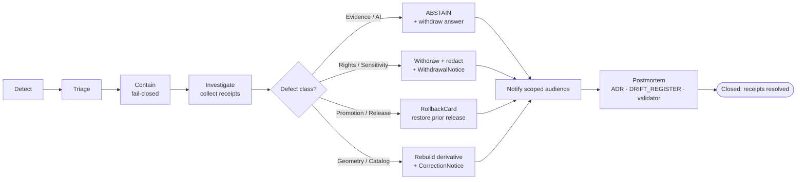

<!-- [KFM_META_BLOCK_V2]
doc_id: kfm://doc/security/incident-response
title: KFM Security Incident Response
type: standard
version: v0.1
status: draft
owners: docs steward + security steward (PROPOSED — replace before publish)
created: 2026-05-13
updated: 2026-05-13
policy_label: public
related:
  - docs/doctrine/trust-membrane.md
  - docs/doctrine/lifecycle-law.md
  - docs/doctrine/truth-posture.md
  - docs/doctrine/directory-rules.md
  - docs/security/THREAT_MODEL.md
  - docs/security/EXPOSURE_POSTURE.md
  - docs/governance/ROLES.md
  - docs/runbooks/
  - release/correction_notices/
  - release/rollback_cards/
  - release/withdrawal_notices/
tags: [kfm, security, incident-response, governance, fail-closed]
notes:
  - Path docs/security/INCIDENT_RESPONSE.md is endorsed by directory-rules.md §6.1.
  - Owners, dates, SLA numbers, and intake channels are placeholders pending governance sign-off.
  - Repository not mounted in authoring session; all repo-state claims labeled accordingly.
[/KFM_META_BLOCK_V2] -->

# 🛡️ KFM Security Incident Response

> The governed procedure for detecting, containing, correcting, and learning from events that compromise — or threaten to compromise — the Kansas Frontier Matrix trust membrane.

| Status | Owners | Last reviewed |
|---|---|---|
| draft (PROPOSED) | docs steward + security steward *(PROPOSED — replace before publish)* | 2026-05-13 |

---

## Jump to

- [1. Scope](#1-scope)
- [2. What counts as a security incident](#2-what-counts-as-a-security-incident)
- [3. Incident response flow](#3-incident-response-flow)
- [4. Severity classes](#4-severity-classes)
- [5. Roles and separation of duties](#5-roles-and-separation-of-duties)
- [6. Detect](#6-detect)
- [7. Contain — fail closed](#7-contain--fail-closed)
- [8. Investigate](#8-investigate)
- [9. Correct, roll back, or withdraw](#9-correct-roll-back-or-withdraw)
- [10. Notify](#10-notify)
- [11. Postmortem and lineage](#11-postmortem-and-lineage)
- [12. Reporting an incident](#12-reporting-an-incident)
- [13. Open verification items](#13-open-verification-items)
- [14. Related docs](#14-related-docs)
- [15. Appendix](#15-appendix)

---

## 1. Scope

### Purpose

Incident response in KFM is the **governed procedure** that activates when a trust-membrane invariant is violated, an exposure boundary is crossed, or evidence emerges that a published claim, artifact, or surface is unsafe to keep on the public path. Its job is to **restore the failure-closed state quickly**, preserve audit trails, and convert the event into durable governance memory.

CONFIRMED doctrine: KFM treats **correction and rollback as publication requirements, not afterthoughts** — every released artifact has a visible correction path and rollback target *before* it is treated as safely publishable.

### In scope

| In scope | Why |
|---|---|
| Sensitive-geometry exposure (vector, raster, tile, 3D, popup, screenshot, export, AI text side channel) | Sensitivity posture is **fail-closed**. |
| Rights, sovereignty, or consent violations on published material | Rights posture is **fail-closed**. |
| Trust-membrane bypass — public client reaching RAW / WORK / QUARANTINE / canonical / direct model | Trust membrane is an invariant. |
| Promotion bypass — admin shortcut used as public path; release without manifest or rollback target | Promotion is a governed state transition, not a file move. |
| Evidence-chain failure on a public surface — `EvidenceRef` does not resolve, citation absent | Cite-or-abstain is the default truth posture. |
| AI surface emitting uncited, weakly cited, or out-of-evidence content as `ANSWER` | Governed AI rule. |
| Secret or credential exposure (real credential in `configs/`, source credential reachable from a public client) | Explicit incident trigger per `directory-rules.md` §10.3. |
| Supply-chain compromise affecting connectors, signing keys, or release infrastructure | Release integrity. |

### Out of scope

| Not an incident here | Belongs in |
|---|---|
| Routine bugs that do not breach the trust membrane | Issue tracker; ordinary bugfix PR. |
| Domain-content updates (corrected data values, normal staleness) | `release/correction_notices/`, source review queue. |
| Public emergency / hazards / life-safety alerting | **DENY by doctrine.** KFM is not an alerting authority. |
| Personnel and HR matters | Governance documents outside this file. |

> [!IMPORTANT]
> KFM is **not** an emergency alerting authority. A "security incident" in this document is an event affecting the integrity, governance, or exposure posture of the KFM system itself — not a public hazard. Conflating the two is itself an anti-pattern.

[Back to top](#jump-to)

---

## 2. What counts as a security incident

A security incident is **any event for which the safe response is to take a public surface fail-closed** while the cause is investigated. The classes below are derived from the **Master Risk Register and Threat Posture** in KFM doctrine and the **defect → correction/rollback table** in the Build Manual.

| Class | Defining signal | Doctrinal anchor |
|---|---|---|
| **Sensitivity leak** | Exact restricted geometry, living-person field, rare-species coordinate, archaeology site, sovereign material, or DNA-derived attribute reachable from a public surface — via tile, vector, 3D, popup, screenshot, AI text, or label side channel. | Domains Atlas Risk Register; domain sensitivity sections. |
| **Rights / sovereignty defect** | Material is published outside its license, consent, or rights-holder agreement; or rights status has changed and the public surface still renders. | Master Risk Register; people-DNA-land lane. |
| **Trust-membrane bypass** | A public client, ordinary UI, or AI surface successfully reached RAW, WORK, QUARANTINE, a canonical/internal store, a direct source API, or a direct model runtime. | trust-membrane doctrine; governed-API rule. |
| **Promotion bypass** | Released content lacks `ReleaseManifest`, rollback target, or required `ReviewRecord`; or an admin shortcut was wired into the normal public path. | lifecycle-law; Directory Rules. |
| **Evidence-chain failure** | `EvidenceRef` does not resolve on a public surface; a published claim has no citation; an `AIReceipt` records `ANSWER` without admissible evidence. | truth-posture (cite-or-abstain); Governed AI doctrine. |
| **AI governance defect** | Focus Mode or other AI surface emits uncited, weakly cited, or out-of-evidence text; AI runtime is reached without the governed API; synthetic content presented without a Reality Boundary Note. | UIAI-GAI; UIAI-OLLAMA. |
| **Source-role collapse** | A modeled output was admitted as observation; an aggregate is cited as a per-place observation. | Source-Role Anti-Collapse Register. |
| **Secret / credential exposure** | A real secret has landed in `configs/` or any tracked path; source credentials reachable by a public client. | Directory Rules §10.3 (explicit incident trigger). |
| **Supply-chain / signing compromise** | Connector code, signing keys, DSSE/Sigstore material, or release infrastructure is suspected compromised. | Release integrity; NEEDS VERIFICATION operational facts. |
| **Infrastructure exposure** | Reverse-proxy, firewall, VPN, CORS, or network posture has drifted from deny-by-default. | Directory Rules §10.2; infra doctrine. |

> [!CAUTION]
> When the class is unclear, treat the event as **higher-severity** until a steward triages it. Cite-or-abstain extends to incident handling: when in doubt, ABSTAIN the **affected surface**, not the alarm.

[Back to top](#jump-to)

---

## 3. Incident response flow

CONFIRMED doctrine: a transition out of the incident state is closed only when (i) the required governance artifacts exist, (ii) every required artifact resolves the artifacts it depends on, and (iii) the policy gate evaluated and recorded its decision. Missing any of these means the transition **fails closed** and the prior state is preserved.

The diagram captures the **governed shape** of the procedure. Specific tooling (issue templates, alert wiring, paging) is **NEEDS VERIFICATION** pending repository and infra inspection.

[Back to top](#jump-to)

---

## 4. Severity classes

Severity guides containment urgency. It does **not** override the cite-or-abstain rule — a low-severity event that lacks evidence should ABSTAIN, not guess.

| Severity | Definition | Containment SLA *(PROPOSED — replace)* | Examples |
|---|---|---|---|
| **S0 — Active leak** | A public surface is currently exposing restricted geometry, rights-violating content, living-person data, or an uncited AI `ANSWER` that materially misleads. | Immediate (minutes). Public surface MUST go fail-closed. | Sensitive-coordinate tile reaching production; AI surface returns a confident uncited claim. |
| **S1 — Trust-membrane bypass** | A public route reaches RAW / WORK / QUARANTINE / canonical / direct model, but no leak is yet confirmed. | Hours. Take affected route fail-closed. | Admin shortcut wired to public path; CORS allows an unauthorized origin. |
| **S2 — Evidence chain at risk** | `EvidenceRef` does not resolve on a published claim, or `CitationValidationReport` is failing in CI for released content. | Days. ABSTAIN affected payloads until repaired. | Caching masks a resolver failure; an export carries broken citations. |
| **S3 — Drift or near-miss** | A pattern has appeared that would be S0–S2 if released, caught before public exposure. | Open a drift entry; address in next governed change. | Parallel schema home appears in a PR without ADR. |

> [!NOTE]
> Containment SLAs above are **PROPOSED placeholders**. Actual response timing, paging, and on-call rotation are NEEDS VERIFICATION until governance and infra docs are mounted.

[Back to top](#jump-to)

---

## 5. Roles and separation of duties

CONFIRMED doctrine: KFM separates policy-significant release duties when maturity justifies it. Incident handling **inherits** this rule — an author should not be the sole approver of a correction to their own released content.

| Role | Responsibility during an incident |
|---|---|
| **Incident commander** *(PROPOSED role — needs governance ratification)* | Coordinates response, opens the incident record, calls fail-closed actions. |
| **Sensitivity reviewer** | Required for any rights, sovereignty, sensitivity, living-person, DNA, archaeology, or rare-species incident. |
| **Rights-holder representative** | Required where the affected material is sovereign, cultural-heritage, consent-bound, or living-person data. |
| **Release authority** | Issues `RollbackCard`, withdraws release, signs the superseding `ReleaseManifest`. Distinct from authorship when materiality applies. |
| **Correction reviewer** | Reviews the `CorrectionNotice` before it amends a `PUBLISHED` claim. |
| **AI surface steward** | Owns Focus Mode and `AIReceipt` incidents; audits templates and policy bindings. |
| **Source steward** | Owns incidents whose root cause is admission, rights tag, or source-role mislabeling on a named source family. |
| **Docs steward** | Owns the incident record, the drift register entry, and any ADR raised in the postmortem. |

PROPOSED rule: **for any S0 or S1 incident, the actor who introduced or authored the affected change MUST NOT be the sole approver of the correction or rollback.** This mirrors the separation-of-duties matrix in the Domains Atlas.

[Back to top](#jump-to)

---

## 6. Detect

Detection is the union of automated signals and human reports. The doctrine commitment is that **signals exist for every fail-closed posture KFM declares** — an unmonitored guardrail is a drift candidate.

Detection signals — PROPOSED catalog; each signal SHOULD be wired to a validator, dashboard, or runbook before the system is treated as covered:

- **Validator / CI signal** — `ValidationReport` failure on released artifacts; `CitationValidationReport` non-pass on `ANSWER` outputs; schema or contract drift on `RuntimeResponseEnvelope`.
- **Policy gate signal** — `PolicyDecision` repeatedly returning `DENY` / `ABSTAIN` on routes that previously `ALLOW`ed (rights or sensitivity change), or `ALLOW` on routes that should `DENY` (regression).
- **Resolver signal** — `EvidenceRef` resolution failure rate above baseline; `ABSTAIN` rate spike in Focus Mode.
- **Receipt-stream signal** — Missing `RunReceipt`, `AIReceipt`, or `ReleaseManifest` for a route that should have emitted one; a receipt that points to an `EvidenceBundle` that no longer resolves.
- **Infrastructure signal** — Reverse-proxy, firewall, or CORS rules drifted from deny-by-default; an admin shortcut reachable from a non-admin origin.
- **External report** — A user, steward, rights-holder, or researcher reports content that should not be public.

> [!TIP]
> A `DENY` is **not** an incident — it is the system working. An incident is when something **should have been** `DENY` and was not.

[Back to top](#jump-to)

---

## 7. Contain — fail closed

Containment is **doctrinally cheap**: KFM is built so taking a surface fail-closed is the default safe action, not the exceptional one. ABSTAIN is a finite outcome of every governed surface.

Containment actions, smallest sufficient action first:

1. **Withdraw the answer.** For an AI / Focus Mode incident: switch the affected query path to ABSTAIN; preserve the offending `AIReceipt` for investigation; do not silently delete it.
2. **Hide or withdraw the layer.** For a map / tile / vector incident: remove from the active `LayerManifest`; invalidate caches; serve fail-closed at the resolver, not the renderer.
3. **Disable the route.** For a trust-membrane bypass: take the affected route down at the governed API; **do not** patch with a style filter, popup hide, or client-side check.
4. **Rotate and audit secrets.** For credential exposure: rotate at the secret store; audit the audit log; record the rotation in `docs/runbooks/` per Directory Rules §10.3.
5. **Quarantine the source.** For a source-integrity incident: route new admissions for the affected `SourceDescriptor` to `data/quarantine/<reason>/`; pause the connector.
6. **Hold the release.** For an in-flight release: HOLD at the release queue; do not promote until the correction path is closed.

> [!WARNING]
> **DENY surface-only fixes.** Hiding sensitive geometry with a style filter, suppressing a popup field, or muting an AI label is **not containment**. It leaves the canonical record exposed and breaks the trust membrane. Generalize, redact, withdraw, or DENY at the resolver.

[Back to top](#jump-to)

---

## 8. Investigate

Investigation is **evidence-driven** — the same posture KFM uses for content. The output is a packet that supports a `CorrectionNotice`, `RollbackCard`, or `WithdrawalNotice`, not a narrative alone.

Required evidence — PROPOSED minimum:

- The affected `release_id` and the prior safe `release_id` (rollback target candidate).
- The relevant `ReleaseManifest`, `EvidenceBundle`, `PolicyDecision`, `ReviewRecord`, and any `AIReceipt` / `RunReceipt`.
- A reproducer — deterministic where possible (`spec_hash` and input hashes preserved).
- The defect class (per §4), tied to the doctrine reason code where available (e.g., `MISSING_EVIDENCE`, `RIGHTS_UNKNOWN`, `SENSITIVITY_UNRESOLVED`, `ROLLBACK_TARGET_MISSING`).
- Downstream derivatives that may be affected — catalog records, tiles, exports, story snapshots, AI receipts.

<strong>Reason-code catalog (from the Master Pipeline Gate Reference)</strong>

PROPOSED catalog inherited from doctrine. Apply the closest match; if none fits, propose a new code in the postmortem.

| Failure family | Reason codes |
|---|---|
| Missing required artifact | `MISSING_RECEIPT`, `MISSING_EVIDENCE`, `MISSING_REVIEW` |
| Schema / contract mismatch | `SCHEMA_MISMATCH`, `CONTRACT_DRIFT` |
| Rights / sensitivity unresolved | `RIGHTS_UNKNOWN`, `SENSITIVITY_UNRESOLVED` |
| Source-role collapse risk | `ROLE_COLLAPSE`, `ROLE_DOWNCAST_FORBIDDEN` |
| Review state inadequate | `REVIEW_NEEDED`, `REVIEW_INSUFFICIENT`, `REVIEW_REJECTED` |
| Release infrastructure error | `RELEASE_MANIFEST_INVALID`, `ROLLBACK_TARGET_MISSING` |
| Correction lineage broken | `CORRECTION_DERIVATIVES_UNRESOLVED`, `CORRECTION_PRIOR_RELEASE_MISSING` |

[Back to top](#jump-to)

---

## 9. Correct, roll back, or withdraw

CONFIRMED doctrine: corrections **preserve the original release record**. KFM does not silently mutate a published claim. The choice between `CorrectionNotice`, `RollbackCard`, and `WithdrawalNotice` follows the defect class (this table follows the Build Manual's defect-class table).

| Defect class | Correction posture | Rollback / withdrawal posture | Doctrine artifact |
|---|---|---|---|
| Evidence gap | ABSTAIN or withdraw unsupported claim. | Restore prior evidence-supported release. | `CorrectionNotice` + `RollbackCard` |
| Rights defect | DENY public use; quarantine source/artifact. | Withdraw affected artifacts. | `WithdrawalNotice` + `CorrectionNotice` |
| Sensitivity leak | Redact / generalize and notify stewards. | Immediate public disablement. | `RedactionReceipt` + `WithdrawalNotice` |
| Geometry defect | Rebuild derivative layer and evidence payload. | Restore previous digest-pinned artifact. | `CorrectionNotice` + `RollbackCard` |
| Temporal defect | Correct valid / source / retrieval / release time. | Mark stale until rebuilt. | `CorrectionNotice` |
| Policy defect | Re-run policy and decision envelope. | Disable route / layer if the gate failed. | `PolicyDecision` re-emission + `RollbackCard` |
| AI answer defect | Invalidate `AIReceipt` and response envelope. | Remove answer; preserve underlying `EvidenceBundle`. | `AIReceipt` invalidation record |
| Catalog defect | Re-emit catalog closure after proof repair. | Restore previous catalog state. | `CorrectionNotice` + `RollbackCard` |

> [!IMPORTANT]
> **A rollback is a release, not a file move.** It goes through the same governed path: `ReleaseManifest` reverts to the prior `release_id`, downstream derivatives are explicitly invalidated, a `RollbackCard` records the decision, and a `CorrectionNotice` accompanies it. **No silent rollback.**

Proposed artifact homes (per `directory-rules.md` §9.2 — PROPOSED until verified against the mounted repo):

- `release/correction_notices/<release_id>/` — `CorrectionNotice` records.
- `release/rollback_cards/<release_id>/` — `RollbackCard` records.
- `release/withdrawal_notices/<release_id>/` — `WithdrawalNotice` records.
- `release/manifests/<release_id>/` — superseding `ReleaseManifest`.
- `data/rollback/<domain>/<release_id>/` — alias-revert receipts (data plane).

[Back to top](#jump-to)

---

## 10. Notify

Notification is **scoped to the audience whose decisions depend on the fact**. KFM does not amplify; it informs.

| Audience | Trigger | Channel *(PROPOSED — verify with security steward)* |
|---|---|---|
| Affected stewards (source, domain, sensitivity, AI surface) | Any S0 / S1 / S2. | Internal review console / steward queue. |
| Rights-holder representative | Any rights, sovereignty, living-person, DNA, or cultural-sensitivity incident. | Direct contact through the established stewardship channel. |
| Release authority | Any S0 / S1 affecting a `PUBLISHED` artifact. | Release queue. |
| Public surface | When a `PUBLISHED` claim is corrected or withdrawn. | `CorrectionNotice` / `WithdrawalNotice` visible on the public surface — stale-state announcement, no silent edit. |
| Researchers / downstream consumers | When invalidated derivatives may affect their work. | Listed in the `CorrectionNotice` invalidation array. |

> [!CAUTION]
> Notification text MUST NOT itself leak the restricted detail it is about — precise coordinates, sensitive identifiers, exploit specifics. Public-facing notices follow the same generalization, redaction, and sensitivity rules as released content.

[Back to top](#jump-to)

---

## 11. Postmortem and lineage

Every closed incident produces durable governance memory. The postmortem **stands in for evidence** of the next reviewer's confidence — decoration is not enough.

PROPOSED postmortem outputs:

1. **Incident record** — appended to `docs/registers/DRIFT_REGISTER.md` (drift class) or to a dedicated incident register if one is added under ADR.
2. **ADR** — when the incident reveals a doctrine ambiguity or requires a Directory Rules amendment.
3. **`VERIFICATION_BACKLOG.md` entry** for anything left NEEDS VERIFICATION after the response.
4. **Validator or fixture** — a regression fixture proving the failure is now detected. A postmortem without a corresponding test or validator is incomplete.
5. **Runbook update** in `docs/runbooks/` when operational steps changed.

CONFIRMED doctrine: **documenting a change instead of validating it is an anti-pattern.** The postmortem produces documentation **and** an enforceable check — not one or the other.

[Back to top](#jump-to)

---

## 12. Reporting an incident

> [!NOTE]
> The contact and intake channels below are **NEEDS VERIFICATION**. The reporting path is part of governance and SHOULD be filled in by the security steward before this document leaves draft.

PROPOSED intake — placeholders only; replace before publish:

- **Where to report:** `<TODO: dedicated security contact path>`. Until established, route through the docs steward and the issue tracker with a `security` label.
- **What to include:** affected surface (URL, route, layer, or AI query path); approximate first-observed time; suspected class (per §2); whether the reporter believes the content is currently visible to the public; any reproducer that does **not** itself republish sensitive content.
- **What to avoid:** raw sensitive coordinates, living-person identifiers, exploit details, or restricted material directly in the report body. Refer to the artifact by `release_id`, `dataset_id`, or `layer_id` instead.

PROPOSED triage commitment — replace with real numbers when set:

- S0 triage within `<TODO>` minutes.
- S1 triage within `<TODO>` hours.
- S2 acknowledgment within `<TODO>` business days.
- S3 drift entry opened within `<TODO>` business days.

[Back to top](#jump-to)

---

## 13. Open verification items

These are operational facts the supplied KFM corpus explicitly does **not** establish. They MUST be resolved by the security and infra stewards before this document leaves draft.

- **NEEDS VERIFICATION:** Package CVEs and dependency licenses in the current repo.
- **NEEDS VERIFICATION:** Host hardening, reverse-proxy rules, firewall, VPN posture (`infra/`).
- **NEEDS VERIFICATION:** Branch protections, required reviewers, status checks.
- **NEEDS VERIFICATION:** Signing-key custody and rotation cadence; DSSE / Sigstore / cosign configuration; Rekor inclusion expectations.
- **NEEDS VERIFICATION:** Storage bucket policy, audit-log retention, backup and restore behavior.
- **NEEDS VERIFICATION:** Source credentials policy, SSO and role mapping, identity provider.
- **NEEDS VERIFICATION:** Incident on-call rotation, paging tool, SLA numbers, escalation graph.
- **NEEDS VERIFICATION:** Whether `INCIDENT_RESPONSE.md` (CAPS_WITH_UNDERSCORES) is the chosen filename casing in this `docs/security/` lane, vs. `incident-response.md` (lowercase-with-hyphens). Both casings appear in `directory-rules.md`; resolve via per-root README or convention scan.
- **OPEN:** Whether to add a dedicated `docs/registers/INCIDENT_REGISTER.md` distinct from `DRIFT_REGISTER.md`. ADR-class change.

These items SHOULD be tracked in `docs/registers/VERIFICATION_BACKLOG.md`.

[Back to top](#jump-to)

---

## 14. Related docs

PROPOSED — verify each path on first link-check pass. Several siblings may not yet exist; create or stub as they come online.

- [`docs/doctrine/trust-membrane.md`](../doctrine/trust-membrane.md) — what the membrane forbids and why.
- [`docs/doctrine/lifecycle-law.md`](../doctrine/lifecycle-law.md) — RAW → PUBLISHED invariant.
- [`docs/doctrine/truth-posture.md`](../doctrine/truth-posture.md) — cite-or-abstain.
- [`docs/doctrine/directory-rules.md`](../doctrine/directory-rules.md) — placement law and the `docs/security/` charter.
- [`docs/security/THREAT_MODEL.md`](./THREAT_MODEL.md) — system-level threat model. *(TODO — stub if absent.)*
- [`docs/security/EXPOSURE_POSTURE.md`](./EXPOSURE_POSTURE.md) — deny-by-default and least-privilege posture. *(TODO.)*
- [`docs/governance/ROLES.md`](../governance/ROLES.md) — role definitions and separation-of-duties matrix. *(TODO.)*
- [`docs/runbooks/`](../runbooks/) — operational runbooks (rollback drills, validation runs, secret rotation).
- [`docs/registers/DRIFT_REGISTER.md`](../registers/DRIFT_REGISTER.md) — drift entries that may originate from incident postmortems.
- [`docs/registers/VERIFICATION_BACKLOG.md`](../registers/VERIFICATION_BACKLOG.md) — open verification items.
- [`docs/adr/`](../adr/) — ADRs raised by postmortems.
- [`release/correction_notices/`](../../release/correction_notices/) · [`release/rollback_cards/`](../../release/rollback_cards/) · [`release/withdrawal_notices/`](../../release/withdrawal_notices/) — correction, rollback, and withdrawal artifacts.

[Back to top](#jump-to)

---

## 15. Appendix

<strong>A. Governance artifact glossary</strong>

Short definitions for the artifacts this procedure invokes. Full definitions live in `docs/doctrine/` and `contracts/`.

| Artifact | Purpose during an incident |
|---|---|
| `ReleaseManifest` | Identifies what was released and what is being rolled back or superseded. |
| `EvidenceBundle` / `EvidenceRef` | Support package for a claim; an unresolvable `EvidenceRef` triggers ABSTAIN. |
| `PolicyDecision` | Recorded gate decision (`ALLOW` / `RESTRICT` / `DENY` / `ABSTAIN` / `ERROR`). |
| `ReviewRecord` | Recorded reviewer action; required for sensitive-lane release and for correction-reviewer sign-off. |
| `CorrectionNotice` | Public notice that a published claim was corrected; lists invalidated derivatives. |
| `RollbackCard` | Decision artifact identifying the prior safe release and the reason. |
| `WithdrawalNotice` | Public notice that a release has been withdrawn. |
| `RedactionReceipt` | Records the transform applied when sensitive material is generalized or removed. |
| `AIReceipt` | Records what a Focus Mode or AI surface emitted, including evidence IDs and policy decisions. |
| `RunReceipt` | Process-memory record for a pipeline run; pins inputs, outputs, hashes, timestamps. |

<strong>B. Anti-patterns this procedure rejects</strong>

From the Domains Atlas trust-membrane and governance anti-pattern registers, and the MapLibre Anti-Patterns Register:

- Hiding sensitive geometry with a **style filter** instead of generalizing, redacting, or withdrawing.
- **AI generation routed through an admin shortcut** that then becomes a normal-path public route.
- **Release without `ReleaseManifest` or rollback target** — public surface cannot be rolled back; release not auditable.
- **Re-publishing a corrected claim without invalidating derivatives** — `CorrectionNotice` MUST list invalidated derivatives.
- **Documenting a change instead of validating it** — docs do not substitute for validators, fixtures, or schema.
- **Approving one's own release on a sensitive lane** — separation-of-duties applies.
- **Treating the renderer as truth** — MapLibre is downstream of trust; it does not bless content.
- **Uncited popups, screenshots, Story Nodes, or exports** — citation preservation required.

<strong>C. Outcome envelope reference</strong>

The finite outcomes recognized by KFM-governed surfaces. Incident response uses them directly — the response is itself a governed sequence of outcomes.

| Surface | Outcomes |
|---|---|
| Governed API resolver / drawer payload / Focus Mode | `ANSWER` / `ABSTAIN` / `DENY` / `ERROR` |
| Layer manifest resolver | `ANSWER` / `DENY` / `ERROR` |
| Validator harness | `PASS` / `FAIL` / `ERROR` |
| Release queue | `ALLOW` / `HOLD` / `DENY` / `ERROR` |
| Correction / rollback | `ACCEPTED` / `HOLD` / `DENY` / `ERROR` |
| Policy gate | `ALLOW` / `RESTRICT` / `DENY` / `ABSTAIN` / `ERROR` |

[Back to top](#jump-to)

---

**Related:** [trust-membrane](../doctrine/trust-membrane.md) · [lifecycle-law](../doctrine/lifecycle-law.md) · [directory-rules](../doctrine/directory-rules.md) · [runbooks](../runbooks/) · [release/](../../release/)
**Last updated:** 2026-05-13 · **Status:** draft (PROPOSED) · **[Back to top](#jump-to)**
