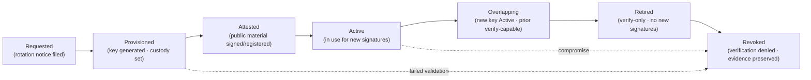

<!-- [KFM_META_BLOCK_V2]
doc_id: kfm://doc/REPLACE-WITH-UUID-AT-MERGE
title: Key Rotation Policy
type: standard
version: v1
status: draft
owners: [security-steward, release-manager]
created: 2026-05-13
updated: 2026-05-13
policy_label: public
related:
  - docs/doctrine/trust-membrane.md
  - docs/doctrine/lifecycle-law.md
  - docs/standards/SIGNING.md
  - docs/standards/PROVENANCE.md
  - docs/standards/CANONICALIZATION.md
  - docs/runbooks/key-rotation-cosign.md
  - docs/runbooks/credential-leak-response.md
  - docs/runbooks/pseudonymisation-key-cycle.md
  - infra/README.md
  - configs/README.md
  - control_plane/key_register.yaml
tags: [kfm, security, signing, cosign, sigstore, pseudonymisation, rotation, kms, governance]
notes:
  - Policy doc; class-specific operations live under docs/runbooks/.
  - Default cadences are PROPOSED and require ADR ratification before they become operating reality.
  - Owners are placeholders; confirm at merge.
[/KFM_META_BLOCK_V2] -->

<a id="top"></a>

# Key Rotation Policy

> Governed rotation, custody, and revocation for every long-lived cryptographic key, signing identity, and named secret in scope of KFM.

<p align="center">
  <b>Kansas Frontier Matrix — Deny-by-Default · Least Privilege · Fail-Closed</b>
</p>

<p align="center">
  
  
  
  
  
  
</p>

|   |   |
|---|---|
| **Status** | `draft` — awaiting ADR for default cadences |
| **Owners** | `security-steward` · `release-manager` *(placeholders — confirm at merge)* |
| **Last updated** | 2026-05-13 |
| **Applies to** | every long-lived signing key, KMS data key, pseudonymisation key, salt, source credential, and CI secret in KFM scope |

---

## Quick links

- [1. Purpose and scope](#1-purpose-and-scope)
- [2. KFM trust posture for keys](#2-kfm-trust-posture-for-keys)
- [3. Key inventory and classes](#3-key-inventory-and-classes)
- [4. Default rotation cadence](#4-default-rotation-cadence)
- [5. Key lifecycle](#5-key-lifecycle)
- [6. Roles and separation of duties](#6-roles-and-separation-of-duties)
- [7. Rotation procedure summary](#7-rotation-procedure-summary)
- [8. Verification and validation](#8-verification-and-validation)
- [9. Storage and custody requirements](#9-storage-and-custody-requirements)
- [10. Compromise and incident response](#10-compromise-and-incident-response)
- [11. Audit, receipts, and traceability](#11-audit-receipts-and-traceability)
- [12. Anti-patterns](#12-anti-patterns)
- [13. Open questions and NEEDS VERIFICATION](#13-open-questions-and-needs-verification)
- [14. Related docs](#14-related-docs)

---

## 1. Purpose and scope

This policy defines **how cryptographic keys, signing identities, and named secrets are rotated, revoked, and audited inside KFM**, with default cadences, ownership boundaries, and procedural anchors. Operational step-by-steps live in `docs/runbooks/`; this document sets the policy floor those runbooks operate under.

**In scope.** Long-lived cosign signing keys (pinned mode), KMS data keys protecting receipts and artifacts, pseudonymisation re-identification keys, redaction-jitter salts, source-connector credentials, CI/CD secrets, OIDC issuer trust roots, OCI registry credentials, and any other named secret KFM relies on to enforce the trust membrane.

**Out of scope.** Ephemeral cosign keyless certificates — these are issued and discarded per signature by Sigstore Fulcio and need no rotation in the operational sense. Also out: short-lived session tokens, per-request JWTs from the governed API, and transient TLS handshake keys. Each of those has its own integrity rules and is governed elsewhere.

> [!IMPORTANT]
> Rotation is a **governed transition**, not a file swap. Every rotation MUST emit a run receipt with policy decision, evidence references, signer identity, and a rollback target. A rotation without a receipt is a missing-evidence event and is quarantined by the next promotion gate.

[Back to top](#top)

---

## 2. KFM trust posture for keys

The trust posture for keys mirrors KFM's general data posture: **deny by default, least privilege, audit always, and rotation is a state transition rather than a maintenance chore.**

| Doctrine | What it means for keys |
|---|---|
| **Cite-or-abstain** | Every receipt MUST reference the signing identity by `keyid` (or Fulcio cert subject) and, when applicable, the Rekor inclusion proof. Unsigned or weakly attested receipts fail closed. |
| **RAW → WORK/QUARANTINE → PROCESSED → CATALOG/TRIPLET → PUBLISHED lifecycle** | Receipts for promotion past WORK MUST be signature-verified before any catalog or published-state transition. |
| **Trust membrane** | Public clients never see raw key material, KMS handles, or private key files. `configs/` MUST NOT contain real secrets. |
| **Reversibility** | Every rotation has a rollback target. The previous key remains *verify-capable* during a documented overlap window before revocation. |
| **Separation of duties** | When maturity justifies it, the actor that signs is not the same actor that approves promotion. |

> [!NOTE]
> **CONFIRMED:** cosign keyless via Sigstore (OIDC + Fulcio + Rekor) is the KFM default signing mode; pinned key pairs are a documented fallback for offline or sovereignty constraints. **PROPOSED / UNKNOWN:** the specific OIDC issuer allowlist (e.g., GitHub Actions OIDC, an in-house issuer, or both) is unresolved at the time of writing.

[Back to top](#top)

---

## 3. Key inventory and classes

KFM classifies every long-lived key or named secret into one of the classes below. A new key family MUST be added to this register **before** it enters service; an unclassified key is treated as quarantined.

| Class | Key / secret family | Default rotation | Storage requirement | Custodian role | Status |
|---|---|---|---|---|---|
| `K1` | Cosign pinned key pair (offline / sovereignty fallback) | **PROPOSED: 90 days** | KMS or HSM-backed; never in repo, never in `configs/` | release-manager + security-steward (dual control) | PROPOSED |
| `K2` | Cosign keyless identity (OIDC subject) | per-signature ephemeral — no rotation | n/a — Fulcio-issued cert | n/a (CI identity) | CONFIRMED default |
| `K3` | OIDC issuer trust roots (cosign verifier allowlist) | **PROPOSED: 180-day review; rotate on upstream change** | repo-tracked allowlist file with attestation | security-steward | PROPOSED |
| `K4` | KMS data-encryption keys for S3-stored receipts, evidence, attestations | **PROPOSED: 365 days; SSE-KMS automatic rotation enabled** | cloud KMS (provider TBD via ADR) | infra-owner | PROPOSED |
| `K5` | Pseudonymisation re-identification keys (people / DNA lane) | **PROPOSED: 365 days per scheme, with per-scheme override** | KMS / HSM only; segregated from analytics lanes | data-steward + security-steward | PROPOSED |
| `K6` | Redaction jitter server-side salt (geoprivacy) | **PROPOSED: 365 days, or upon a `spec_hash` bump that would invalidate jitter determinism** | secret store referenced by name | data-steward | PROPOSED |
| `K7` | Source-connector credentials (API keys, OAuth client secrets) | **PROPOSED: 90 days, or upon vendor rotation event** | secret store, scoped per connector | connector-owner | PROPOSED |
| `K8` | CI/CD platform secrets (e.g., `COSIGN_KEY`, `COSIGN_PASSWORD`) | **PROPOSED: 90 days, or upon CI runner identity change** | CI secret store; no echo, no log | release-manager | PROPOSED |
| `K9` | Storage and OCI registry credentials | **PROPOSED: 90 days** | platform IAM / token store | infra-owner | PROPOSED |

> [!CAUTION]
> Every cadence in the table above is **PROPOSED** and has not been ratified by an ADR at the time of writing. The KFM corpus is explicit (see C9-05) that **default rotation intervals have not yet been specified by the project**; the values here are a starting point for review, not facts about the operating system. See [§13](#13-open-questions-and-needs-verification).

[Back to top](#top)

---

## 4. Default rotation cadence

Three forces set a cadence:

1. **Blast radius** — how much data a leaked key can affect.
2. **Verification window** — how long verifiers need both the new and previous keys present to continue resolving past receipts.
3. **External commitment** — pseudonymisation key handling tracks **EDPB Guidelines 01/2025**; differential-privacy parameter and key-management posture tracks **NIST SP 800-226**. KFM publishes its defaults against those frameworks rather than ad hoc.

### Cadence triggers

| Trigger | Action |
|---|---|
| Scheduled (per-class default) | File rotation notice; run class runbook; emit rotation receipt |
| Vendor / upstream rotation event | Initiate rotation immediately; record upstream rationale |
| Suspected compromise | Revoke and rotate now; escalate to incident response ([§10](#10-compromise-and-incident-response)) |
| Custodian change | Rotate within 14 days; record handoff receipt |
| Tool-version pin advance affecting signing | Re-verify identity; rotate if cert / identity has changed |

> [!TIP]
> Prefer **shorter** cadences when in doubt. In a governed pipeline, rotation cost is mostly receipt and verification overhead — both already required for every artifact. The marginal cost of frequent rotation is small; the marginal cost of stale custody is much larger.

[Back to top](#top)

---

## 5. Key lifecycle

Every key in scope moves through a finite set of states. Promotion between states is itself a governed transition: it MUST emit a receipt and MUST pass policy.



> [!NOTE]
> *Overlap* is mandatory for any key whose signatures will be consumed later — including humans reading audit logs months down the line. **PROPOSED defaults:** 30 days for K1 and K8; 90 days for K4, K5, and K6. A zero-overlap rotation is treated as a compromise rotation, not a routine one.

### State transitions

| From → To | Required evidence | Required gate |
|---|---|---|
| Requested → Provisioned | rotation notice with custodian sign-off | policy: `scheduled-rotation` OR `incident-rotation` |
| Provisioned → Attested | public-material registration receipt | identity verification (OIDC subject for K2/K3; key fingerprint for K1) |
| Attested → Active | verifier-config update receipt | dual-control sign-off (K1, K4, K5) |
| Active → Overlapping | overlap-start receipt | none beyond schedule |
| Overlapping → Retired | last-signature-by-prior-key receipt | overlap-window expiry |
| Retired → Revoked | revocation receipt | policy: `no-active-receipts-depend-on-key` OR incident-driven |

[Back to top](#top)

---

## 6. Roles and separation of duties

Rotation is one of the points where KFM's separation-of-duties stance becomes operational. Different actors hold different parts of the procedure; no single role can both mint and approve a new signing identity for a published artifact.

| Role | Responsibility |
|---|---|
| **security-steward** | Owns this policy; approves rotation-schedule changes; final approver on compromise rotations; classifies new key families. |
| **release-manager** | Operates rotation runbooks for K1 and K8; signs rotation receipts; cannot self-approve compromise rotations. |
| **infra-owner** | Owns KMS, secret store, and OCI registry credentials (K4, K9); cannot sign release artifacts directly. |
| **data-steward** | Owns K5 and K6 in coordination with the people/DNA and geoprivacy lanes. |
| **connector-owner** | Per-connector role; rotates K7 for the owned connector; cannot rotate connectors they did not author. |
| **CI identity** (K2) | Non-human; cannot be impersonated by a human role. |

> [!WARNING]
> Compromise rotations MUST involve at least two roles. If only one role is available — for example an after-hours incident with one on-call — the rotation is **performed immediately and audited within 24 hours by a second role**. The single-role execution is logged as a deviation, not a normal path.

[Back to top](#top)

---

## 7. Rotation procedure summary

The full procedure lives in the runbook (PROPOSED path: `docs/runbooks/key-rotation-cosign.md` and class-specific siblings). The summary below is the **policy-level minimum**; anything less is not a KFM rotation.

1. **File the rotation notice.** Open a tracked record naming the key class, reason (scheduled / vendor / compromise / handoff), proposed window, and rollback target. CI fixtures remain unchanged.
2. **Provision the new key.** Generate in approved storage: HSM/KMS for K1, K4, K5; CI secret store for K8; per-vendor mechanism for K7. Never on a developer laptop, never in `configs/`, never echoed to logs.
3. **Attest the public material.** Publish the new public key / cert subject / fingerprint with a signed attestation. For K2 keyless, register the new OIDC subject in the verifier allowlist.
4. **Update verifiers.** Roll verifier-config changes (cosign trust policy, OPA policy bundle, allowlist files) out to *every* consumer **before** activating the new key for signing.
5. **Activate.** Begin signing with the new key. Both old and new keys are *verify-capable* during the overlap window.
6. **Drain.** No new signatures with the old key after the activation moment. Already-signed artifacts retain validity until revocation.
7. **Retire.** At overlap-window expiry, mark the old key Retired; verifiers continue to accept its signatures on pre-dated artifacts unless the key is revoked.
8. **Revoke (when warranted).** For routine rotation, retired keys remain verify-only indefinitely so historical receipts continue to resolve. For compromise rotation, revoke immediately and re-evaluate every artifact signed by the compromised key (see [§10](#10-compromise-and-incident-response)).
9. **Emit a rotation receipt.** Canonical JSON, DSSE-wrapped, cosign-signed by the **incoming** identity, with `decision_id`, `policy_id="key.rotation"`, evidence refs to the rotation notice and attestations, and `target_zone="PUBLISHED"`. Store immutably with the artifact audit ledger.

<details>
<summary><b>Illustrative — rotation receipt skeleton (PROPOSED shape; verify against the canonical run-receipt schema at merge)</b></summary>

```json
{
  "spec_hash": "<jcs:sha256:...>",
  "policy_id": "key.rotation",
  "decision_log": {
    "decision_id": "<uuid>",
    "decision": "allow",
    "obligations": ["overlap-window", "verifier-config-rolled"]
  },
  "rotation": {
    "key_class": "K1",
    "key_id_prev": "<fingerprint>",
    "key_id_next": "<fingerprint>",
    "reason": "scheduled | vendor | compromise | handoff",
    "overlap_window_days": 30,
    "rollback_target_uri": "s3://.../rotation_notices/<id>.json"
  },
  "evidence_refs": [
    { "type": "rotationNotice",    "uri": "s3://.../rotation_notices/<id>.json" },
    { "type": "publicAttestation", "uri": "s3://.../attestations/<id>.json"   }
  ],
  "runner_id": "github-actions",
  "timestamp": "2026-05-13T00:00:00Z",
  "kfm_spec_version": "vNext",
  "target_zone": "PUBLISHED"
}
```

This shape mirrors the canonical `run_receipt` used elsewhere in KFM. The authoritative schema home is **NEEDS VERIFICATION** against the mounted repo (see OQ-KR-09 in [§13](#13-open-questions-and-needs-verification)).

</details>

[Back to top](#top)

---

## 8. Verification and validation

Verification is **fail-closed**. A verifier that cannot resolve a key's current state denies promotion.

```mermaid
flowchart TD
    A[New artifact / receipt] --> B{Signature parses?}
    B -- no --> Q[QUARANTINE]
    B -- yes --> C{Signing key in trust set?}
    C -- no --> Q
    C -- yes --> D{Key state in &#123;Active, Overlapping, Retired-verify-only&#125;?}
    D -- no --> Q
    D -- yes --> E{Signature verifies?}
    E -- no --> Q
    E -- yes --> F{For keyless: Rekor inclusion proof present?}
    F -- no --> Q
    F -- yes --> G[PASS to next gate]
```



> [!IMPORTANT]
> A `Revoked` key MUST NOT verify. A `Retired-verify-only` key MUST verify pre-dated artifacts (those whose receipt timestamp is within the key's Active or Overlapping window) and MUST NOT verify newly-claimed signatures dated after retirement.

### Required validator checks

| Check | Source of truth |
|---|---|
| Key class is registered | this document + control-plane key register *(PROPOSED: `control_plane/key_register.yaml`)* |
| Key state allows signature acceptance | rotation receipts (Active / Overlapping / Retired with timestamp-bound acceptance) |
| Rekor inclusion proof present (for K2 keyless) | Sigstore Rekor index persisted with the artifact |
| Receipt timestamp within key's signing window | receipt + rotation receipts |
| Policy bundle hash matches the policy in force at signing time | `policy_bundle_hash` in the receipt |

[Back to top](#top)

---

## 9. Storage and custody requirements

The storage requirements below are **MUST**-level when the class is in production use.

| Requirement | K1 | K2 | K3 | K4 | K5 | K6 | K7 | K8 | K9 |
|---|---|---|---|---|---|---|---|---|---|
| Never in repo | ✓ | n/a | ✓ public only | ✓ | ✓ | ✓ | ✓ | ✓ | ✓ |
| Never in `configs/` | ✓ | n/a | ✓ public only | ✓ | ✓ | ✓ | ✓ | ✓ | ✓ |
| HSM / KMS-backed | ✓ | n/a | n/a | ✓ | ✓ | recommended | optional | optional | optional |
| Object Lock / WORM where stored | ✓ when offline | n/a | recommended | ✓ | ✓ | recommended | n/a | n/a | n/a |
| Dual-control to access | ✓ | n/a | ✓ for trust changes | ✓ | ✓ | ✓ | optional | recommended | recommended |
| Audit log of every access | ✓ | ✓ (Rekor) | ✓ | ✓ | ✓ | ✓ | ✓ | ✓ | ✓ |

> [!CAUTION]
> **CONFIRMED doctrine:** `configs/` MUST NOT store real secrets — ever, even for "test" or "local". If a real secret lands in `configs/`, treat it as a **security incident**: rotate the affected key, audit any access during the exposure window, and write a runbook entry under `docs/runbooks/`. See [`docs/runbooks/credential-leak-response.md`](../runbooks/credential-leak-response.md) *(PROPOSED path; verify at merge)*.

[Back to top](#top)

---

## 10. Compromise and incident response

A compromise rotation is **not** a faster scheduled rotation. It is a different state machine: keys move directly from Active → Revoked, the overlap window collapses, and every artifact signed by the compromised key is re-evaluated.

### Triggers

- Private key material observed outside its sanctioned storage.
- Unauthorized access logged against KMS, HSM, or secret store.
- A signed artifact whose contents were not produced by the recorded build identity (Rekor inclusion proof present but materials do not match the SLSA predicate).
- Vendor announcement of compromise affecting cosign, Fulcio, Rekor, the KMS provider, or an upstream OIDC issuer.
- Credential leak event for a CI secret (see [`docs/runbooks/credential-leak-response.md`](../runbooks/credential-leak-response.md), PROPOSED path).

### Required response actions

1. **Revoke immediately.** Update the trust set; verifiers SHOULD start denying within minutes.
2. **Page the security-steward and release-manager.** The two-role rule applies ([§6](#6-roles-and-separation-of-duties)).
3. **Freeze new releases** that would depend on the compromised key class.
4. **Re-evaluate published artifacts.** Every artifact whose receipt references the revoked key is moved to `QUARANTINE` pending re-verification with the new key chain or formal acceptance of risk.
5. **Open a correction notice** for any artifact that cannot be re-attested. Per KFM doctrine, the correction notice MUST list invalidated derivatives.
6. **Emit an incident receipt.** Standard rotation-receipt shape with `reason="compromise"` and a link to the incident record under `docs/runbooks/`.
7. **Post-incident review** within 14 days. Update this policy and class cadences if the incident exposes a systemic gap.

> [!WARNING]
> A compromise rotation that does **not** produce a correction-notice review for affected artifacts is incomplete. The rotation closes only when every affected artifact has either (a) been re-attested under the new chain, (b) been formally retired with a rollback target recorded, or (c) been accepted with a documented risk decision signed by the security-steward.

[Back to top](#top)

---

## 11. Audit, receipts, and traceability

Every key event — provisioning, attestation, activation, retirement, revocation, compromise — emits a receipt. The receipts are first-class evidence and live alongside other run receipts in the immutable audit ledger.

| Event | Receipt `policy_id` | Joined to |
|---|---|---|
| Rotation notice filed | `key.rotation.notice` | rotation lifecycle thread |
| Key provisioned | `key.rotation.provision` | rotation notice |
| Public material attested | `key.rotation.attest` | verifier-config change |
| Active transition | `key.rotation.activate` | overlap-window timer |
| Retire transition | `key.rotation.retire` | last-signature-by-prior-key |
| Revoke transition | `key.rotation.revoke` | incident record (when compromise) |
| Verifier-config update | `policy.bundle.update` | OPA bundle hash |

Use `decision_id` as the join key across the receipts in a single rotation thread, exactly as KFM's general receipt doctrine prescribes. Persist URIs for the receipt, the signature, and — for keyless mode — the Rekor inclusion proof.

[Back to top](#top)

---

## 12. Anti-patterns

These are denied by default. A reviewer who sees one of these in a PR should block the change pending an ADR or runbook entry that justifies the deviation.

| Anti-pattern | Why it's denied |
|---|---|
| Storing a real secret in `configs/`, `examples/`, or `fixtures/` | CONFIRMED doctrine: `configs/` MUST NOT store real secrets. A real secret here is an incident. |
| Rotating without a receipt | Receipts are how every other gate proves a transition happened. No receipt = no transition. |
| Zero-overlap rotation outside compromise context | Verifiers reading historical receipts months later will fail closed. |
| Granting a single human role both signer and approver for a production release | Violates the separation-of-duties invariant when maturity justifies it. |
| Embedding signing keys in container images | Image layers are not a custody mechanism; secrets MUST live in a secret store. |
| Verifying receipts without a Rekor inclusion proof in keyless mode | Sigstore transparency is part of the trust model; missing proof = quarantine. |
| Renaming a key class without policy update | Class identity is the audit join key; silent renames break the ledger. |
| Reusing a pseudonymisation key across CARE-distinct release lanes | Cross-lane reuse undermines re-identification controls; EDPB Guidelines 01/2025 disfavors it. |
| Hard-coding the OIDC issuer in code | Issuer trust is a policy decision; it belongs in the verifier allowlist, not in source. |

[Back to top](#top)

---

## 13. Open questions and NEEDS VERIFICATION

The items below are explicitly unresolved. Each links to the upstream open question in the KFM corpus where applicable; resolving them is on the verification backlog and SHOULD trigger the next ADR update against this document.

| ID | Question / item | Source | Disposition |
|---|---|---|---|
| OQ-KR-01 | Default rotation cadence for K1 cosign pinned key pair | C1-03 (Pass 10) suggests "capture key-rotation procedure in a runbook" without specifying interval | PROPOSED 90 days; awaiting ADR |
| OQ-KR-02 | OIDC issuer allowlist contents for keyless cosign verification | C1-03 open question | PROPOSED: GitHub Actions OIDC + in-house issuer (decision pending) |
| OQ-KR-03 | Default pseudonymisation key rotation interval | C9-05 open question ("What is the right key-rotation cadence for a long-running pseudonymisation scheme?") | PROPOSED 365 days, per-scheme override; awaiting EDPB-aligned playbook |
| OQ-KR-04 | Salt policy for redaction jitter seeds (whether to salt with a server-side secret to prevent third-party reproduction of jittered points) | C6-03 open question | PROPOSED: salt with K6 server-side secret; awaiting decision |
| OQ-KR-05 | KMS provider choice for K4 and K5 | Build Manual: "signing key custody … not established by the supplied corpus" | UNKNOWN |
| OQ-KR-06 | Authoritative repo home for the key register | Directory Rules `control_plane/` vs `policy/` boundary | PROPOSED: `control_plane/key_register.yaml`; verify against ADR-0001-style decision |
| OQ-KR-07 | Whether to require a Rekor inclusion proof for *every* keyless signature, or to allow a documented exception for offline runners | implied by C1-03 dual-mode policy | UNKNOWN |
| OQ-KR-08 | SLSA target level (1, 2, or 3) — affects build-platform hardening that interacts with K2 identity | C1-04 open question | UNKNOWN |
| OQ-KR-09 | Authoritative home for the run-receipt schema (`tools/attest/schemas/` vs `schemas/contracts/v1/`) | Directory Rules §6.5 vs sample paths in New Ideas 5-8-26 packet | NEEDS VERIFICATION against mounted repo |

> [!NOTE]
> The KFM corpus is explicit (Pass 10, C9-05) that **default key-rotation intervals have not yet been specified by the project**. The cadences in this document are therefore PROPOSED — published here so reviewers can ratify or amend them via ADR, not asserted as the operating reality.

[Back to top](#top)

---

## 14. Related docs

The links below use PROPOSED paths consistent with `docs/doctrine/directory-rules.md`. Targets MUST be verified or stubbed at merge.

- [`docs/doctrine/trust-membrane.md`](../doctrine/trust-membrane.md) — the trust-membrane invariant this policy enforces
- [`docs/doctrine/lifecycle-law.md`](../doctrine/lifecycle-law.md) — the lifecycle this policy treats rotation as a transition within
- [`docs/standards/SIGNING.md`](../standards/SIGNING.md) — cosign signing standard *(PROPOSED — referenced as expansion direction in C1-03)*
- [`docs/standards/PROVENANCE.md`](../standards/PROVENANCE.md) — SLSA / in-toto provenance standard *(PROPOSED — C1-04 expansion direction)*
- [`docs/standards/CANONICALIZATION.md`](../standards/CANONICALIZATION.md) — JCS / `spec_hash` determinism
- [`docs/runbooks/key-rotation-cosign.md`](../runbooks/key-rotation-cosign.md) — operational runbook for cosign key rotations *(PROPOSED path)*
- [`docs/runbooks/credential-leak-response.md`](../runbooks/credential-leak-response.md) — incident response for real-secret leaks into configs *(PROPOSED path)*
- [`docs/runbooks/pseudonymisation-key-cycle.md`](../runbooks/pseudonymisation-key-cycle.md) — EDPB-aligned worked example *(PROPOSED path; C9-05 suggested future work)*
- [`infra/README.md`](../../infra/README.md) — deny-by-default, audit, secret-isolation posture *(PROPOSED path per Directory Rules §10.2)*
- [`configs/README.md`](../../configs/README.md) — the "no real secrets in configs" rule *(PROPOSED path per Directory Rules §10.3)*
- [`control_plane/key_register.yaml`](../../control_plane/key_register.yaml) — machine-readable key inventory *(PROPOSED path)*

---

<details>
<summary><b>Appendix A — External framework references</b></summary>

External commitments KFM aligns with for key handling. These are referenced because the corpus already aligns to them; they are **not** ad hoc choices introduced by this document.

- **NIST SP 800-226** — Differential Privacy guidance. Governs DP parameter selection, privacy budgets, and reporting. KFM aligns DP key/parameter posture with this framework. *(CONFIRMED reference per Pass 10, C9-05.)*
- **EDPB Guidelines 01/2025** — Pseudonymisation guidance from the European Data Protection Board. Governs what counts as effective pseudonymisation under GDPR and what must be done with re-identification keys. *(CONFIRMED reference per Pass 10, C9-05.)*
- **Sigstore (Fulcio + Rekor)** — Identity issuance and transparency log for cosign keyless signing. *(CONFIRMED as KFM default per Pass 10, C1-03.)*
- **SLSA / in-toto** — Supply-chain provenance predicate format used alongside cosign signatures. *(CONFIRMED per Pass 10, C1-04. Target level UNKNOWN — see OQ-KR-08.)*
- **RFC 8785 JCS (JSON Canonicalization Scheme)** — basis for deterministic `spec_hash` computation; relevant here because every rotation receipt is canonicalized before signing. *(CONFIRMED per Pass 10, C1-02.)*

</details>

<details>
<summary><b>Appendix B — Pre-rotation checklist (operator-facing)</b></summary>

Before initiating any non-compromise rotation, confirm:

- [ ] Rotation notice filed and reviewed
- [ ] Custodians named and reachable (two-role rule for K1, K4, K5)
- [ ] New-key storage target prepared (KMS slot / HSM / secret-store binding)
- [ ] Verifier-config rollout path identified (which consumers, which order)
- [ ] Overlap window length set (per class default; deviation requires a note)
- [ ] Rollback target URI captured and tested-resolvable
- [ ] Receipt template prepared with the correct `policy_id`
- [ ] OPA policy bundle version pinned for the rotation thread
- [ ] No active release blocking on the soon-to-rotate identity (otherwise schedule around it)
- [ ] Incident-response on-call notified, so a compromise that surfaces mid-rotation is escalable

For compromise rotation, treat every box above as completable in parallel within minutes, not days — and skip the overlap entirely.

</details>

---

|   |   |
|---|---|
| **Doc type** | KFM standard · policy |
| **Owners (placeholders)** | `security-steward` · `release-manager` |
| **Last updated** | 2026-05-13 |
| **Status** | `draft` — cadences PROPOSED pending ADR |

**Related:** [trust-membrane](../doctrine/trust-membrane.md) · [SIGNING](../standards/SIGNING.md) · [PROVENANCE](../standards/PROVENANCE.md) · [key-rotation-cosign runbook](../runbooks/key-rotation-cosign.md) · [credential-leak-response runbook](../runbooks/credential-leak-response.md) · [`configs/`](../../configs/README.md) · [`infra/`](../../infra/README.md)

[⤴ Back to top](#top)
