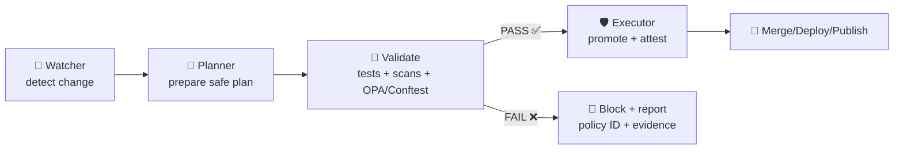

# 🔐 `docs/security/` — Security Docs & Playbooks (KFM)

<div align="center">


</div>

> [!IMPORTANT]
> 🚨 **Do not report security bugs via public GitHub Issues/Discussions/PR comments.**  
> Use **private vulnerability reporting** as described in **[`SECURITY.md`](../../SECURITY.md)**.

---

## 🧭 What is this folder?

This directory is the **security “ops + engineering + governance” notebook** for the Kansas Frontier Matrix (KFM) repository.

KFM spans **web UI + APIs + GIS + remote sensing + ML/AI + containers + CI** — so “security” here is broader than AppSec:
- 🧱 **Architecture & trust boundaries** (inputs, layers, pipelines, UI)
- 🚦 **Policy gates** (machine-enforced governance: metadata, provenance, sensitivity, licenses)
- ⛓️ **Auditability** (PROV + catalogs + immutable governance ledger)
- 🤖 **AI + automation safety** (Focus Mode + Watcher/Planner/Executor)
- 📦 **Supply chain integrity** (SBOM, attestations, signed artifacts)
- 🧯 **Incident response** (runbooks you can execute under stress)

> [!NOTE]
> KFM’s security philosophy is **“governance you can run.”** If a check can’t be performed, we prefer to **fail closed** 🚫✅.

---

## 🧭 Table of contents

- [📌 Quick links](#-quick-links)
- [🗓️ Metadata](#️-metadata)
- [🗂️ Suggested contents](#️-suggested-contents-of-docssecurity)
- [🧱 KFM security invariants](#-kfm-security-invariants)
- [✅ Security controls matrix](#-security-controls-matrix)
- [🧠 KFM security model](#-kfm-security-model)
  - [🧩 Trust boundaries](#-trust-boundaries)
  - [🚦 Policy gates: Detect → Validate → Promote](#-policy-gates-detect--validate--promote)
  - [📜 Policy-as-code (OPA + Rego)](#-policy-as-code-opa--rego)
  - [⛓️ Provenance + governance ledger](#️-provenance--governance-ledger)
  - [🧑‍⚖️ FAIR + CARE oversight](#️-fair--care-oversight)
  - [🤖 Focus Mode security](#-focus-mode-security)
  - [📦 Supply chain security](#-supply-chain-security)
  - [📡 Observability & security telemetry](#-observability--security-telemetry)
- [🌎 Domain-specific risks & guidance](#-domain-specific-risks--guidance)
- [🧪 Security testing playbook](#-security-testing-playbook)
- [🧯 Incident response](#-incident-response)
- [🧾 Templates](#-templates)
- [📚 Internal reference library](#-internal-reference-library)
- [✅ Contributing to security docs](#-contributing-to-security-docs)

---

## 📌 Quick links

- 🔥 **Report a vulnerability:** [`SECURITY.md`](../../SECURITY.md)
- 🧾 **PR security checklist:** [`SECURITY.md`](../../SECURITY.md#-pr-security-checklist-copy-into-prs)

**Recommended (living) docs in this folder:**
- 🧠 Threat model: `docs/security/threat-model.md`
- 🚦 Security testing: `docs/security/security-testing.md`
- 🧯 Incident response: `docs/security/incident-response.md`
- 🔐 Data governance: `docs/security/data-governance.md`
- 🤖 AI & agent security: `docs/security/ai-security.md`
- 📦 Supply chain: `docs/security/supply-chain.md`
- 🔑 PGP key: `docs/security/pgp-public-key.asc` *(optional)*

**“Source of truth” enforcement (elsewhere in the repo):**
- ⚖️ Policy Pack docs: `api/scripts/policy/README.md`
- 🧾 Rego policies: `tools/validation/policy/*.rego`
- 🧬 Architecture references: `docs/architecture/*` *(AI system architecture, redesign blueprint, system overview, etc.)*

---

## 🗓️ Metadata

| Field | Value |
|---|---|
| Folder | `docs/security/` |
| Audience | Maintainers • contributors • security reviewers |
| Posture | **Fail‑closed** 🚫✅ |
| Status | Active ✅ |
| Last updated | **2026-01-19** |

---

## 🗂️ Suggested contents of `docs/security/`

> [!TIP]
> Keep this README as the “table of contents + operating model.” Put deeper details in focused docs/runbooks.

<details>
<summary><strong>📁 Recommended layout</strong></summary>

```text
📦 docs/security/
 ├─ 📘 README.md                      # You are here
 ├─ 🧠 threat-model.md                # Assets + boundaries + attacker models + mitigations
 ├─ 🚦 security-testing.md            # CI + runtime checks, "done means..." evidence
 ├─ 🧯 incident-response.md           # Triage → contain → eradicate → recover → postmortem
 ├─ 🔐 data-governance.md             # Classification, retention, redaction, sovereignty/CARE
 ├─ 🤖 ai-security.md                 # Focus Mode + W‑P‑E controls, prompt injection defenses
 ├─ 📦 supply-chain.md                # SBOM, pinning, attestations, release hardening
 ├─ 🔑 pgp-public-key.asc             # Optional encrypted disclosure support
 ├─ ✅ checklists/
 │   ├─ 🧾 pr-review.md                # Human security review checklist
 │   ├─ 🛰️ data-intake.md              # Dataset/metadata intake checklist
 │   ├─ 🧬 model-release.md            # Model registry + eval + redaction checklist
 │   └─ 🚀 release.md                  # Tagged release security checklist
 └─ 🧰 runbooks/
     ├─ 🧨 secret-leak.md              # Token/key exposure response
     ├─ 🕵️ sensitive-data-leak.md      # PII/cultural site/location leak response
     ├─ 🧬 data-poisoning.md           # Malicious/tampered data pipeline response
     ├─ 🛰️ gis-integrity-drift.md      # CRS/schema drift, silent geometry corruption
     ├─ 🤖 prompt-injection.md         # Focus Mode prompt attack response
     ├─ 📦 supply-chain-incident.md    # Typosquat/lockfile compromise response
     └─ 🌩️ outage-ddos.md              # Availability incidents (if in scope)
```
</details>

---

## 🧱 KFM security invariants

These are “stop-the-line” rules (if we violate one, we pause merges/releases until fixed):

1. ⛓️ **Provenance-first publishing**
   - No dataset, model, export, or Focus Mode output should ship without traceable provenance/citations.
2. 🚫✅ **Fail-closed by default**
   - If we can’t validate metadata, provenance, license, sensitivity, or schema: we reject the change.
3. 🔐 **No secrets in the repo**
   - No keys/tokens/credentials in code, configs, docs, or logs.
4. 📜 **Policy-as-code is the baseline**
   - Governance rules live in OPA/Rego + CI enforcement, not tribal knowledge.
5. 👤 **Human agency**
   - Sensitive/high-impact changes require explicit human review/approval (especially CARE-governed or restricted datasets).
6. 🧩 **Boundary validation**
   - Every boundary validates assumptions: UI → API → DB, pipeline stage boundaries, agent/tool boundaries.
7. 🛰️ **Geospatial integrity is security**
   - CRS/schema drift, geometry corruption, and silent misalignment are security-grade failures.

---

## ✅ Security controls matrix

| Risk | Typical root cause | Baseline control | “Done” evidence |
|---|---|---|---|
| Secrets exposure | `.env` committed, logs leak tokens | Secret scanning + redaction rules | CI pass + checklist sign-off |
| Broken authZ (IDOR) | Missing object-level checks | Centralized authZ helpers + negative tests | Reviewed routes + failing negatives |
| Injection (SQL/command) | String concat, unsafe shell | Parameterized queries, safe exec wrappers | Tests + lint rules |
| SSRF | URL fetchers w/o allowlist | Egress allowlist + URL parsing | Tests + blocked private ranges |
| XSS | Unsafe HTML/Markdown rendering | Output encoding + CSP + safe renderers | CSP headers + UI tests |
| Upload malware | Untrusted files accepted | Allowed formats + scanning + size caps | Gate logs + policy pass |
| Supply-chain compromise | Unpinned deps, typosquats | Lockfiles + review + SBOM | Diff evidence + release artifacts |
| Dataset tampering | Raw changed silently | Checksums + manifests | `checksums.sha256` + provenance update |
| Data poisoning | Untrusted training/inputs | Provenance + checksums + review flags | Dataset registry + policy pass |
| GIS integrity drift | CRS/schema changes | Validation + metadata checks | Failing-fast validations |
| AI hallucination | Ungrounded generation | Citations required + policy checks | “No cite → refuse” evidence |
| Prompt injection | Model coerced to leak / misuse | Prompt Gate + tool allowlists + OPA runtime denies | Red-team prompts + audit logs |
| Sensitive site disclosure | Exact coordinates exposed | Classification + generalization + approval workflow | Review record + ledger entry |

---

## 🧠 KFM security model

KFM’s security posture is shaped by:
- **Evidence-first architecture** (DCAT/STAC/PROV + Neo4j knowledge graph)
- **Automated policy gates** (OPA/Rego policies in CI; selective runtime enforcement)
- **Human-in-the-loop governance** (FAIR + CARE oversight, approvals, auditability)
- **Controlled automation** (Watcher → Planner → Executor with explicit checks)

---

### 🧩 Trust boundaries

```mermaid
flowchart LR
  subgraph LowTrust["🌩️ Low-Trust Zone (Internet / External)"]
    U((User))
    EXT[3rd-party Providers<br/>GIS / Remote Sensing / APIs]
    UP[(Uploads: datasets / docs / 3D assets)]
  end

  subgraph App["🧱 KFM Application Zone"]
    UI[Web UI / Map UI / WebGL]
    API[API / Services]
    FM[Focus Mode (AI)]
    W[Workers / Pipelines / Jobs]
    OPA[Policy Engine (OPA)]
  end

  subgraph Evidence["⛓️ Evidence & Governance Zone"]
    PROV[(PROV lineages)]
    CATALOG[(STAC/DCAT catalogs)]
    LEDGER[(Immutable governance ledger)]
  end

  subgraph Data["🗄️ Data Zone"]
    DB[(PostgreSQL / PostGIS)]
    KG[(Neo4j Knowledge Graph)]
    OBJ[(Artifacts / Object Storage)]
    LOG[(Logs / Audit Trails)]
  end

  U -->|HTTPS| UI
  UI -->|REST/WS| API
  UI -->|prompts| FM
  API -->|policy query| OPA
  FM -->|policy query| OPA

  API -->|enqueue| W
  UP -->|ingestion gate| W

  W -->|write evidence| PROV
  W -->|write catalogs| CATALOG
  FM -->|log output + citations| LEDGER

  API -->|SQL| DB
  API -->|graph queries| KG
  W -->|read/write| OBJ

  API -->|events| LOG
  W -->|events| LOG
  FM -->|events| LOG

  API <-->|integrations| EXT
```

> [!TIP]
> In `threat-model.md`, turn this into a **table of assets + threats + controls** and keep it updated as architecture evolves.

---

### 🚦 Policy gates: Detect → Validate → Promote

KFM uses a **detect → validate → promote** model with gates at key points:
- 🧾 Metadata & catalog completeness (STAC/DCAT/PROV)
- 🏷️ License presence + usage constraints
- 🔐 Sensitivity classification + handling rules
- 🛰️ Spatial data validation (CRS, bounds, geometry validity)
- 🤖 AI output constraints (citations required, policy compliance)
- 📦 Security scans (secrets, deps, containers)



> [!NOTE]
> Some automation elements (W‑P‑E, attestations) may be implemented incrementally. The *security requirement* remains: automation must be **least-privileged**, **audited**, and **stoppable**.

---

### 📜 Policy-as-code (OPA + Rego)

Policy-as-code encodes “rules we refuse to debate every PR”:
- ✅ Required metadata fields (STAC/DCAT profiles)
- ✅ License requirements
- ✅ Sensitivity classification rules (public/internal/restricted)
- ✅ Provenance-first publishing (including PR → PROV mapping where used)
- ✅ AI output constraints (citations required; policy checks)
- ✅ Dev rules (tests required, no secrets, no deprecated endpoints, etc.)

**Where to look in the repo:**
- `api/scripts/policy/README.md` — policy pack docs and usage
- `tools/validation/policy/*.rego` — Rego rules evaluated by Conftest

**Runtime enforcement (when enabled):**
- Policies can be queried before showing an AI answer, before serving a sensitive layer, or before promoting a change.

---

### ⛓️ Provenance + governance ledger

KFM treats auditability as a security primitive:

- 🧾 **PROV everywhere**: datasets, pipelines, and (optionally) repo changes modeled so you can query “where did this come from?”
- 🔏 **Immutable governance ledger**: key decisions + AI outputs logged in an **append-only, signed** ledger with compliance metadata.
- 🪟 **User-visible provenance**: UI panels can show layer source, license, and processing summary so users never have to “trust the black box.”

This supports incident response:
- “Which dataset introduced the bad geometry?”
- “Which PR touched the hydrology model?”
- “Which policies were active when this answer was generated?”

---

### 🧑‍⚖️ FAIR + CARE oversight

KFM’s governance model uses:
- **FAIR**: Findable, Accessible, Interoperable, Reusable (metadata + standards + licensing)
- **CARE**: Collective Benefit, Authority to Control, Responsibility, Ethics (sovereignty + sensitive data handling)

High-stakes datasets may require a governance workflow like:
**Intake → Ethical Screening → FAIR check → Sustainability audit → Accessibility review → Council approval**.

> [!CAUTION]
> If a dataset contains culturally sensitive information, endangered species locations, or PII: treat it as **restricted** until proven otherwise.

---

### 🤖 Focus Mode security

Focus Mode expands the attack surface (prompt injection, exfiltration attempts, social engineering). KFM’s controls emphasize:

- 🧼 **Prompt Gate**: sanitize/normalize user input before it reaches the model.
- 🧾 **Citations required**: responses must be grounded in approved, in-domain sources; no citation → refusal.
- 🛡️ **OPA checks**: policy engine can deny unsafe outputs or data access.
- 🧠 **Bias + drift monitoring**: monitor citation coverage, accuracy, and drift; flag for review.
- 👤 **Human escalation**: sensitive or ambiguous scenarios escalate to humans (especially CARE-governed contexts).

> [!TIP]
> Never let Focus Mode bypass AuthZ. AI is a *client* of data services — not a privileged backdoor.

---

### 📦 Supply chain security

KFM’s goal is provable supply chain integrity:
- 🔒 Lock/pin dependencies where possible
- 🧾 Generate and ship **SBOMs** (e.g., SPDX) for releases/artifacts
- 🪪 Prefer attestations for automated outputs (SLSA-style provenance)
- 🐳 Pin container bases (ideally by digest) and scan images regularly
- 🧯 Treat CI as production infrastructure (least privilege + strong audit logs + kill switches)

---

### 📡 Observability & security telemetry

Observability supports security and reliability:
- 🧾 Correlation IDs, run IDs, config hashes for pipeline runs
- 📊 Focus telemetry (latency, query counts, energy usage where relevant)
- 🚨 Alerting on anomalies (burst traffic, suspicious access patterns, repeated policy failures)

---

## 🌎 Domain-specific risks & guidance

### 🗺️ GIS + mapping workflows
- Validate CRS, bounds, geometry validity, schema on ingest.
- Treat CRS/schema drift as a “silent failure” integrity breach.
- For sensitive locations: **generalize/aggregate** (hex bins, bounding regions) and apply access controls.

### 🛰️ Remote sensing, OCR, and simulation pipelines
- Assume inputs are untrusted (especially PDFs/images from unknown sources).
- Verify file integrity at ingestion (checksums + manifests).
- Keep processing deterministic and replayable (pin versions, log configs).

### 🌐 Web UI + WebGL / 3D asset handling
- Treat 3D models/textures/tiles/shaders as **untrusted**.
- Enforce CSP, safe CORS, and avoid unsafe HTML rendering.
- Avoid injecting untrusted data into JS strings; serialize as JSON and escape properly.

### 🧠 Privacy & responsible analytics
Protect sensitive layers **and derived outputs**, not just raw data:
- k-anonymity / l-diversity / t-closeness for public aggregates
- query auditing / inference control for analytics endpoints
- (optional) differential privacy for high-risk releases

### 🤝 Crowdsourcing / community contributions
- Submissions flow into a **review queue** with moderation controls.
- Scan uploads, restrict allowed formats, and store provenance for accepted contributions.
- Ensure revertability: contributions should be disableable/revocable quickly (and logged in the ledger).

---

## 🧪 Security testing playbook

> [!NOTE]
> Keep exact commands + tool versions in `docs/security/security-testing.md`. This README tracks the model.

### CI (minimum bar)
- ✅ Unit + integration tests
- ✅ Policy Pack checks (OPA/Rego via Conftest)
- ✅ Secret scanning
- ✅ Dependency scanning (lockfiles, containers)
- ✅ Data validation (schema + CRS + geometry + ranges)
- ✅ “AI output must cite sources” checks for Focus Mode artifacts/exports

### Local dev (recommended)
- Run policy tests against changed data/configs
- Run secret scan before pushing
- Validate geodata on changed layers (geometry validity, CRS)

<details>
<summary><strong>🧾 Examples (adapt paths to repo conventions)</strong></summary>

```bash
# Run policy checks (example)
conftest test . -p tools/validation/policy

# Secret scanning (example)
trufflehog git file://. --since-commit HEAD~50
```
</details>

---

## 🧯 Incident response

> [!CAUTION]
> If you suspect active exploitation: **stop the bleeding first** (containment), then investigate.

### 1) Triage (first hour)
- Identify impact scope (users, data, infra, public vs restricted)
- Preserve evidence (logs, timestamps, versions, policy versions)
- Establish a single incident channel + incident commander

### 2) Containment
- Rotate credentials / invalidate tokens
- Disable affected endpoints/features (feature flags, rate limit clamps)
- Freeze promotions (pause Executor automation) if supply-chain risk exists

### 3) Eradication & recovery
- Patch root cause
- Add regression tests (including policy tests when appropriate)
- Redeploy and monitor

### 4) Postmortem
- Timeline + contributing factors
- Detection gaps (“what would have caught it earlier?”)
- Prevent recurrence (policies, tooling, docs, training)

---

## 🧾 Templates

<details>
<summary><strong>🐛 Vulnerability report template</strong></summary>

```markdown
## Summary
(What is vulnerable?)

## Impact
(What can an attacker do? Data exposure? Privilege escalation?)

## Affected component(s)
- UI / WebGL
- API / services
- Data ingestion pipeline
- Knowledge graph / catalogs / provenance
- Focus Mode / AI
- Automation (Watcher/Planner/Executor)
- CI/CD / containers

## Reproduction steps
1.
2.
3.

## Environment
- Commit/tag:
- Deployment type:
- OS/Browser:
- Runtime versions:

## Proof of concept (safe, non-destructive)
(paste minimal PoC or description)

## Suggested fix (optional)
(what change would mitigate?)
```
</details>

<details>
<summary><strong>🧯 Incident timeline template</strong></summary>

```markdown
# Incident: <short-name>
Date:
Severity:
Incident Commander:
Comms Owner:

## Summary
## Customer/User Impact
## Root Cause

## Timeline (UTC)
- T+00:
- T+15:
- T+60:

## Detection
## Containment
## Fix
## Recovery

## Follow-ups (owners + due dates)
- [ ]
```
</details>

---

## 📚 Internal reference library

These references shape KFM’s approach to security across architecture, web, data, GIS/remote sensing, AI/ML, and human-centered computing.

<details>
<summary><strong>🏗️ KFM architecture, governance & ops</strong></summary>

- Kansas Frontier Matrix (KFM) – Comprehensive Architecture, Features, and Design  
- Kansas Frontier Matrix (KFM) – AI System Overview 🧭🤖  
- Kansas Frontier Matrix – Comprehensive UI System Overview  
- Kansas Frontier Matrix (KFM) – Comprehensive Technical Documentation  
- 📚 Kansas Frontier Matrix (KFM) Data Intake – Technical & Design Guide  
- 🌟 Kansas Frontier Matrix – Latest Ideas & Future Proposals  
- Innovative Concepts to Evolve the Kansas Frontier Matrix (KFM)  

</details>

<details>
<summary><strong>📦 Supply chain + reproducibility mindset</strong></summary>

- Scientific Method / Research / Master Coder Protocol Documentation (model registry, snapshots, traceability)  

</details>

<details>
<summary><strong>🧠 Privacy-preserving analytics</strong></summary>

- Data Mining Concepts & Applications (k-anonymity, l-diversity, t-closeness, query auditing)  

</details>

<details>
<summary><strong>🌎 Geospatial + web visualization</strong></summary>

- Kansas-Frontier-Matrix: Open-Source Geospatial Historical Mapping Hub Design  
- AI Concepts & more (AI foundations, risk framing)  
- Maps / Google Maps / Virtual Worlds / Archaeological CG / Geospatial WebGL (web mapping & 3D visualization references)  
- Various programming languages & resources (implementation references across stacks)  
- Data Management / Architectures / Bayesian methods (data systems references)  

</details>

---

## ✅ Contributing to security docs

- Keep guidance **actionable** (commands, checks, “done means…” evidence)
- Prefer **checklists + examples** over essays
- Don’t include exploit payloads that are destructive or enable misuse
- When adding a new system component, update:
  - threat model
  - data governance rules
  - test guidance
  - incident runbooks (new failure modes)

<!-- Maintainers’ TODOs (remove if you prefer)
- Add docs/security/threat-model.md
- Add docs/security/security-testing.md
- Add docs/security/incident-response.md
- Add docs/security/data-governance.md
- Add docs/security/ai-security.md
- Add docs/security/supply-chain.md
- Add docs/security/pgp-public-key.asc + fingerprint in SECURITY.md
-->