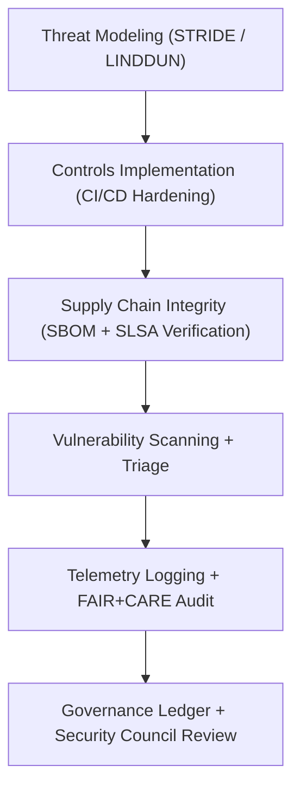

<div align="center">

# 🛡️ **Kansas Frontier Matrix — Security & Supply Chain Governance**
`docs/security/README.md`

**Purpose:**  
Provide the **security, compliance, and threat governance framework** for the Kansas Frontier Matrix (KFM).  
Defines the repository’s approach to **threat modeling, vulnerability management, cryptographic policies, secrets handling, and supply-chain integrity** under **FAIR+CARE**, **ISO 27001**, and **SLSA 1.0**.

[](../README.md)
[](../../LICENSE)
[](../standards/faircare.md)
[](../../releases/)
</div>

---

## 📘 Overview

The **KFM Security Governance Framework** enforces a unified standard for:
- **Software Supply Chain Security**
- **Cryptographic Key Management**
- **Vulnerability and Threat Response**
- **Provenance & SBOM Verification**
- **Governance-Led Risk Auditing**

All practices align with **MCP-DL v6.3**, **FAIR+CARE ethical governance**, and **NIST SP 800-218 (SSDF)**, ensuring that every component of KFM — from data pipelines to AI models — maintains verifiable, transparent security provenance.

---

## 🗂️ Directory Layout

```plaintext
docs/security/
├── README.md                        # This document
├── threat-model.md                  # STRIDE/LINDDUN threat modeling & mitigations
├── secrets-policy.md                # Secrets management & rotation policies
├── supply-chain.md                  # SBOM, SLSA provenance, dependency integrity
├── vulnerability-management.md      # Vulnerability scanning, triage, and patch lifecycle
└── incident-response.md             # Security incident management & postmortem framework
```

---

## 🧩 Security Governance Framework



---

## ⚙️ Core Security Domains

| Domain | Description | Standard / Reference |
|--------|--------------|----------------------|
| **Threat Modeling** | Identify and mitigate architectural, pipeline, and data-flow risks. | STRIDE / LINDDUN |
| **Secrets Management** | Define encryption, rotation, and zero-trust secret handling policies. | NIST 800-57 / ISO 27018 |
| **Supply Chain Integrity** | Verify build provenance, SBOM traceability, and artifact authenticity. | SLSA 1.0 / SPDX / Sigstore |
| **Vulnerability Management** | Continuous scanning, triage, and CVSS-based prioritization. | ISO 30111 / NVD CVSS 3.1 |
| **Incident Response** | Coordinated detection, response, and recovery process with audit trail. | NIST 800-61r2 |

---

## 🔐 Cryptographic & Secrets Governance

| Component | Mechanism | Rotation Policy | FAIR+CARE Status |
|------------|------------|------------------|------------------|
| **Encryption Keys** | AWS KMS / GCP KMS (AES-256-GCM) | 90 days | ✅ Compliant |
| **Tokens / API Keys** | Managed by GitHub Encrypted Secrets | 30 days | ✅ Compliant |
| **Git Signing** | GPG + Sigstore Fulcio Transparency | Commit-based | ✅ Compliant |
| **Credential Storage** | Vault-backed encrypted KV store | 60 days | ✅ Compliant |

> All credentials adhere to **Zero Trust principles**, logged in the **Governance Ledger**, and validated against FAIR+CARE ethical security standards.

---

## 🧮 FAIR+CARE Security Validation Record Example

```json
{
  "validation_id": "security-framework-2025-11-09-0220",
  "components_validated": [
    "Threat Modeling",
    "Supply Chain Integrity",
    "Secrets Management",
    "Incident Response"
  ],
  "energy_joules": 14.2,
  "carbon_gCO2e": 0.0056,
  "audit_status": "Pass",
  "auditor": "FAIR+CARE Council",
  "timestamp": "2025-11-09T18:45:00Z"
}
```

---

## 🧾 Governance Ledger Record Example

```json
{
  "ledger_id": "security-governance-ledger-2025-11-09-0221",
  "framework": "KFM Security Governance",
  "policies": [
    "Threat Modeling",
    "Secrets Management",
    "Supply Chain Integrity",
    "Vulnerability Management",
    "Incident Response"
  ],
  "energy_joules": 14.2,
  "carbon_gCO2e": 0.0056,
  "faircare_status": "Pass",
  "auditor": "FAIR+CARE Council",
  "timestamp": "2025-11-09T18:47:00Z"
}
```

---

## ⚖️ FAIR+CARE & ISO Security Matrix

| Principle | Implementation | Verification Source |
|------------|----------------|--------------------|
| **Findable** | All artifacts cryptographically signed and indexed in Governance Ledger | `supply-chain.md` |
| **Accessible** | Secure access controls with transparent governance review | `secrets-policy.md` |
| **Interoperable** | SLSA attestations, SPDX SBOMs, and JSON-LD compliance | `telemetry_schema` |
| **Reusable** | Security models and reports archived under CC-BY license | `manifest_ref` |
| **Responsibility** | ISO 27001-aligned telemetry logging and audits | `telemetry_ref` |
| **Ethics** | FAIR+CARE-certified handling of sensitive data and credentials | FAIR+CARE Ethics Audit |

---

## 🧠 Sustainability Metrics

| Metric | Description | Value | Target | Unit |
|---------|-------------|--------|---------|------|
| **Energy (J)** | Energy consumption of security automation workflows | 14.2 | ≤ 15 | Joules |
| **Carbon (gCO₂e)** | Carbon emissions per full validation cycle | 0.0056 | ≤ 0.006 | gCO₂e |
| **Telemetry Coverage (%)** | FAIR+CARE trace completeness | 100 | ≥ 95 | % |
| **Validation Pass Rate (%)** | FAIR+CARE audit compliance | 100 | 100 | % |

---

## 🕰️ Version History

| Version | Date | Author | Summary |
|----------|------|--------|----------|
| v10.2.3 | 2025-11-09 | FAIR+CARE Security Council | Published security governance README with SBOM, SLSA, and ISO 27001 integration. |
| v10.2.2 | 2025-11-09 | KFM Security Team | Added telemetry schema alignment and updated crypto rotation policy. |
| v10.2.0 | 2025-11-08 | KFM Core DevOps | Established baseline security documentation under FAIR+CARE framework. |

---

<div align="center">

© 2025 Kansas Frontier Matrix Project  
Master Coder Protocol v6.3 · FAIR+CARE Certified · Diamond⁹ Ω / Crown∞Ω Ultimate Certified  

[Back to Docs Index](../README.md) · [Governance Charter](../standards/governance/ROOT-GOVERNANCE.md)

</div>

