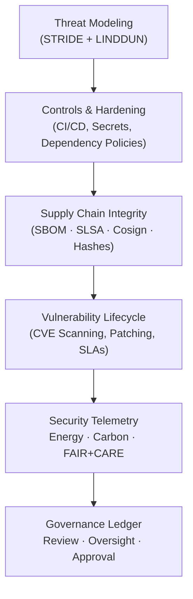

<div align="center">

# 🛡️ **Kansas Frontier Matrix — Security & Supply Chain Governance**  
`docs/security/README.md`

**Purpose**  
Act as the **top-level index** for all security, provenance, secret management, dependency integrity, supply-chain safeguards, and NPM Worm Defense standards across the Kansas Frontier Matrix (KFM).  
Defines the mandatory requirements for **cryptographic integrity**, **SBOM/SLSA provenance**, **CI hardening**, **attack-surface minimization**, **vulnerability lifecycle**, and **FAIR+CARE-aligned security ethics**.

[]() ·
[]() ·
[]() ·
[]()
</div>

---

## 📘 1. Overview

This index governs KFM’s unified security program:

- **Threat modeling** (STRIDE & LINDDUN)  
- **Zero-trust secrets management**  
- **Supply-chain provenance** (SPDX, CycloneDX, SLSA)  
- **Artifact authenticity** (Sigstore / Cosign)  
- **Dependency & vulnerability scanning**  
- **NPM Worm Defense** (full lifecycle-script suppression + package forensics)  
- **Incident response** (NIST 800-61)  
- **Governance ledger & FAIR+CARE ethics integration**  
- **Telemetry** capturing sustainability + security metrics  

All standards beneath this directory are **normative** and **CI-enforced**, producing machine-readable outputs for KFM governance.

---

## 🗂️ 2. Directory Layout (Canonical)

```text
📁 docs/
└── 📁 security/
    ├── 📄 README.md                        — ← Security & supply chain governance index
    ├── 📄 threat-model.md                  — STRIDE/LINDDUN threat modeling
    ├── 📄 secrets-policy.md                — Secret lifecycle, encryption, rotation
    ├── 📄 supply-chain.md                  — Supply chain integrity (SBOM, SLSA, signing)
    ├── 📄 vulnerability-management.md      — CVE scanning, triage, patch rules
    ├── 📄 incident-response.md             — Incident lifecycle & postmortems
    └── 📁 supply-chain/
        ├── 📄 README.md                    — NPM worm defense + supply chain sub-framework
        └── 📁 npm-ignore-scripts/          — CI lifecycle-script suppression standard
```

This structure is aligned with the **global canonical directory layout** for v11.2.2.

---

## 🧩 3. Security Governance Framework



Security flows upward into FAIR+CARE governance for long-term archival, auditability, and public-interest oversight.

---

## 🔐 4. Cryptographic & Secret Management Controls

| Security Component | Mechanism | Rotation | Status |
|--------------------|-----------|----------|--------|
| Encryption         | AES-256-GCM with KMS envelope encryption | 90 days | ✅ |
| OIDC Tokens        | Ephemeral GitHub OIDC tokens | 30 days | ✅ |
| TLS                | TLS 1.3 (HSTS, OCSP stapling) | Continuous | ✅ |
| Secret Stores      | Vault/KMS, encrypted KV | 60 days | ✅ |
| Artifact Signing   | Sigstore Fulcio + Cosign | Per build | ✅ |

**Hard Rule:**  
Secrets MUST NOT appear in code, configs, logs, or Git history. Violations trigger governance review.

---

## 🔗 5. Supply Chain Integrity (SBOM · SLSA · Cosign)

### Mandatory for all releases:

- **SPDX 2.3 SBOM**  
- **CycloneDX 1.5 SBOM**  
- **Cosign signatures**  
- **SLSA provenance attestations**  
- **Checksum matching against manifest**  
- **Dependency audit scanning** (Trivy, osv-scanner, Grype)  
- **NPM worm behavior detection** (Shai-Hulud-class defenses)

Any component failing integrity gates is quarantined and cannot be deployed.

---

## 🧪 6. Vulnerability Management (CVSS + SLAs)

| Severity | Detection SLA | Patch SLA | Notes |
|----------|--------------|------------|-------|
| Critical | 4 hours | 24 hours | Blocks CI/CD |
| High     | 24 hours | 72 hours | Telemetry alert |
| Medium   | 48 hours | 7 days | Logged, not blocking |
| Low      | Weekly | Next sprint | Optional fix |

All activity is recorded in:

```
docs/reports/audit/vulnerability-ledger.json
```

---

## 🚨 7. Incident Response (NIST 800-61)

KFM follows a 6-phase lifecycle:

1. Detection  
2. Analysis  
3. Containment  
4. Eradication  
5. Recovery  
6. Postmortem (MCP format)  

Artifacts stored under:

```
docs/security/reports/incident-response/
```

---

## 📊 8. FAIR+CARE Security Telemetry

Example telemetry block:

```json
{
  "security_standard": "v11.2.2",
  "status": "pass",
  "energy_wh": 8.12,
  "carbon_gco2e": 0.0039,
  "controls_active": [
    "sbom",
    "slsa",
    "cosign",
    "worm-defense",
    "secret-manager"
  ],
  "timestamp": "2025-11-27T20:42:00Z"
}
```

Telemetry drives:

- Oversight  
- Resource optimization  
- Sustainability compliance  
- Public accountability  
- Focus Mode narratives  

---

## 🧭 9. Story Node & Focus Mode Integration

Security metadata feeds:

- **“Hardened Build Path”** Story Node  
- **“Supply Chain Worm Attempt Timeline”**  
- **“Key Rotation Across KFM Governance Cycles”**  
- **“Integrity Chains in Historical Data Reconstruction”**  

Focus Mode surfaces:

- SBOM completeness  
- Provenance quality  
- Risk posture  
- CARE impact scores  

---

## 🗂️ 10. Related Standards

- **supply-chain.md** — SLSA, SBOM, Cosign, provenance  
- **npm-ignore-scripts/** — lifecycle-script lockdown  
- **secrets-policy.md** — encryption, rotation, zero-trust rules  
- **vulnerability-management.md** — scanning + patch lifecycle  
- **incident-response.md** — IR lifecycle and postmortems  
- **faircare.md** — ethical & sovereignty alignment  

---

## 🕰️ 11. Version History

| Version | Date | Summary |
|---------|------|---------|
| v11.2.2 | 2025-11-27 | Fully upgraded to KFM-MDP v11.2.2; canonical layout; governance links; telemetry & worm defense integration. |
| v10.2.4 | 2025-11-12 | Prior security governance version; aligned to FAIR+CARE v10.2. |
| v10.2.3 | 2025-11-09 | Added vulnerability SLA and expanded scanning rules. |

---

<div align="center">

🛡️ **Kansas Frontier Matrix — Security Governance Index (v11.2.2)**  
Secure by design · Governed by community · Proven through lineage.

© 2025 Kansas Frontier Matrix — CC-BY 4.0  
Master Coder Protocol v6.3 · FAIR+CARE Security Council · Diamond⁹ Ω / Crown∞Ω

[⬅ Back to Security Overview](README.md) ·  
[⚖ Root Governance Charter](../standards/governance/ROOT-GOVERNANCE.md)

</div>
