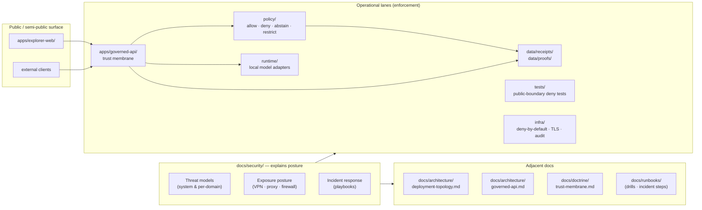

<!-- [KFM_META_BLOCK_V2]
doc_id: kfm://doc/docs-security-readme
title: docs/security — Threat Model, Exposure Posture, Incident Response
type: standard
version: v1
status: draft
owners: <!-- TBD: security/ops steward + governance steward; populate from CODEOWNERS -->
created: 2026-05-09
updated: 2026-05-09
policy_label: public
related:
  - docs/doctrine/directory-rules.md
  - docs/doctrine/trust-membrane.md
  - docs/doctrine/lifecycle-law.md
  - docs/architecture/deployment-topology.md
  - docs/architecture/governed-api.md
  - docs/governance/
  - docs/runbooks/
  - infra/
  - policy/
  - apps/governed-api/
  - runtime/
tags: [kfm, security, governance, doctrine, exposure, incident-response]
notes:
  - This README is PROPOSED; the folder itself is canonical per Directory Rules §6.1.
  - Specific threat-model documents listed in the index are PROPOSED until authored.
  - No mounted repository was inspected when this README was authored; convention-sensitive
    claims are labeled PROPOSED or NEEDS VERIFICATION.
[/KFM_META_BLOCK_V2] -->

# `docs/security/`

> **Threat model, exposure posture, and incident-response doctrine for the Kansas Frontier Matrix (KFM).**
> This folder *explains* what the system defends against and why. The operational implementation lives in `infra/`, `policy/`, `apps/governed-api/`, `runtime/`, `tests/`, and `docs/runbooks/`.

[](#3-status)
[](#2-authority-level)
[](#1-purpose)
[](#11-related-folders)
[](#1-purpose)
[](#15-last-reviewed)

> [!IMPORTANT]
> Real secrets (tokens, keys, credentials, source-license terms) **MUST NOT** be committed anywhere in the repository — including this folder. Real secrets live in environment-specific secret stores referenced by name. If a real secret lands in-tree, treat it as a **security incident**: rotate, audit, and write a runbook entry in `docs/runbooks/`.
> _Source: `docs/doctrine/directory-rules.md` §10.3._

---

### Quick jump

[1. Purpose](#1-purpose) ·
[2. Authority level](#2-authority-level) ·
[3. Status](#3-status) ·
[4. Repo fit](#4-repo-fit) ·
[5. What belongs here](#5-what-belongs-here) ·
[6. What does NOT belong here](#6-what-does-not-belong-here) ·
[7. Inputs](#7-inputs) ·
[8. Outputs](#8-outputs) ·
[9. Validation](#9-validation) ·
[10. Review burden](#10-review-burden) ·
[11. Related folders](#11-related-folders) ·
[12. ADRs](#12-adrs) ·
[13. Document index](#13-document-index) ·
[14. Open questions](#14-open-questions) ·
[15. Last reviewed](#15-last-reviewed)

---

## 1. Purpose

`docs/security/` is the **doctrinal home** for KFM's security posture. It explains:

- **What the trust boundary is.** KFM publishes through one trust membrane — `apps/governed-api/` — that returns finite outcomes (`ANSWER`, `ABSTAIN`, `DENY`, `ERROR`) bound to evidence, policy, review, release, and correction state. Public clients and normal UI surfaces never read directly from `data/raw/`, `data/work/`, `data/quarantine/`, canonical internal stores, or model runtimes.
- **What threats apply.** KFM may be locally hosted and exposed through a home firewall, reverse proxy, or VPN. Threat models here name the risks (prompt/source injection, sensitive prompt persistence, artifact swap, public bypass, secret leakage, reverse-proxy misconfiguration, model-runtime exposure, SSRF, sensitive-geometry exposure, rights leakage) and the controls KFM doctrine pins to each.
- **What posture is required.** Default posture is **deny-by-default, least privilege, no secret leakage, no direct public access to canonical or internal stores, no direct public model runtime, audit logs that record actor / tool / request id / policy decision / evidence refs / release refs / correction or rollback action — but never secrets, raw sensitive evidence, or hidden chain-of-thought.**
- **What incident response looks like.** Procedures for secret leakage, sensitive-geometry leakage, rollback, correction notice issuance, and supersession — pointing to the operational runbooks under `docs/runbooks/` and the receipts/proofs lifecycle under `data/receipts/` and `data/proofs/`.

This folder does **not** enforce. Enforcement lives in `policy/` (admit/deny/abstain rules), `apps/governed-api/` (the membrane), `infra/` (deployment hardening), `tests/` (deny tests), and the gate matrix referenced in `docs/governance/`.

[Back to top ↑](#docssecurity)

---

## 2. Authority level

**Canonical** — sub-folder of canonical root `docs/` (Directory Rules §6.1).

`docs/` *explains*; this sub-folder explains the security/threat/exposure dimension. It is **not** a policy authority, **not** a schema authority, **not** an enforcement runtime. Documents here cite policy rules, schema fields, and route names that live elsewhere; they do not redefine them.

| Layer | Owner | This folder's role |
|---|---|---|
| Object **meaning** | `contracts/` | Cited, not redefined. |
| Object **shape** | `schemas/contracts/v1/...` | Cited, not redefined. |
| Allow / deny / abstain | `policy/` | Cited, not redefined. |
| Public route surface | `apps/governed-api/` | Constrained by docs here; not authored here. |
| Deployment & exposure | `infra/` | Constrained by docs here; not authored here. |
| Operational drills | `docs/runbooks/` | Tightly coupled, distinct purpose (see §6). |
| Audit trail | `data/receipts/`, `data/proofs/` | Cited, never produced here. |

[Back to top ↑](#docssecurity)

---

## 3. Status

**PROPOSED.**

- The folder is **CONFIRMED** in doctrine: it is named in `docs/doctrine/directory-rules.md` §6.1 with the comment *"threat model, exposure posture, incident response."*
- This README is **PROPOSED**: it is being introduced from doctrine without a mounted-repo inspection.
- The specific threat-model and incident-response documents named in the [Document index](#13-document-index) are **PROPOSED**.
- The local-exposure security ADR (`ADR-0009-local-exposure-security`) is **PROPOSED** per the Pipeline Living Implementation Manual decision register.

> [!NOTE]
> Path/convention claims about adjacent roots (`infra/`, `policy/`, `apps/governed-api/`, `runtime/`, `docs/runbooks/`) are **PROPOSED** until verified against mounted-repo evidence. If the repository contradicts what this README says, raise a `docs/registers/DRIFT_REGISTER.md` entry per Directory Rules §2.5; do not silently conform either way.

[Back to top ↑](#docssecurity)

---

## 4. Repo fit

`docs/security/` sits inside `docs/`, the human-facing control plane. It is upstream of every operational lane that has a public-facing or exposure-bearing surface.

```
docs/
├── doctrine/
├── architecture/
├── adr/
├── governance/
├── runbooks/        ← operational procedures (incident-response drills)
├── security/        ← THIS FOLDER (doctrine, threat models, exposure posture)
├── domains/<domain>/
└── ...
```


```mermaid
flowchart LR
  subgraph Doctrine["docs/security/ — explains posture"]
    direction TB
    TM["Threat models<br/>(system &amp; per-domain)"]
    EP["Exposure posture<br/>(VPN · proxy · firewall)"]
    IR["Incident response<br/>(playbooks)"]
  end

  subgraph Doc["Adjacent docs"]
    direction TB
    DEP["docs/architecture/<br/>deployment-topology.md"]
    GAPI["docs/architecture/<br/>governed-api.md"]
    TRUST["docs/doctrine/<br/>trust-membrane.md"]
    RB["docs/runbooks/<br/>(drills · incident steps)"]
  end

  subgraph Op["Operational lanes (enforcement)"]
    direction TB
    INFRA["infra/<br/>deny-by-default · TLS · audit"]
    POL["policy/<br/>allow · deny · abstain · restrict"]
    API["apps/governed-api/<br/>trust membrane"]
    RT["runtime/<br/>local model adapters"]
    TST["tests/<br/>public-boundary deny tests"]
    REC["data/receipts/<br/>data/proofs/"]
  end

  subgraph Pub["Public / semi-public surface"]
    direction TB
    UI["apps/explorer-web/"]
    EXT["external clients"]
  end

  Doctrine --> Doc
  Doctrine --> Op
  UI --> API
  EXT --> API
  API --> POL
  API --> RT
  API --> REC
  POL --> REC
```

**Upstream of `docs/security/`:** `docs/doctrine/` (lifecycle law, truth posture, trust membrane, authority ladder), `docs/architecture/` (deployment topology, governed-api), `docs/governance/` (separation of duties).

**Downstream of `docs/security/`:** `infra/`, `policy/`, `apps/governed-api/`, `runtime/`, `tests/security/` *(name PROPOSED)*, `docs/runbooks/`, `configs/` (only insofar as it confirms *no real secrets*).

[Back to top ↑](#docssecurity)

---

## 5. What belongs here

Documents that **explain** KFM's defensive posture and the reasoning behind it. Every document here is human-authored prose and tables — **no enforcement code, no schemas, no fixtures, no secrets**.

Accepted document classes:

- **System threat models.** What threats the deployed system faces (locally hosted; firewall / reverse proxy / VPN exposure; LAN-wide model runtime; multi-tenant or shared environments). For each threat, the named control and the file or route where the control lives.
- **Per-domain threat models.** For domains with elevated harm potential — e.g., `hazards-local-exposure-threat-model.md`, `archaeology-sensitive-location-threat-model.md`, `people-dna-living-persons-threat-model.md`. Each cites the domain's source-role taxonomy, sensitivity register entries, and policy denials.
- **Exposure posture.** Documented assumptions about the deployment edge: VPN vs allowlisted reverse proxy with TLS, authentication, rate limits, request-size limits, audit logging without secrets, no LAN-wide unauthenticated model API, no direct browser-to-model traffic, CORS/CSP rules, SSRF protections.
- **Public-boundary control catalogue.** The list of denials the governed API must enforce (e.g., public request for `data/raw|work|quarantine` returns `DENY`; public request for unreleased layer returns `DENY` with `release.unpublished` reason; Focus request without `EvidenceBundle` returns `ABSTAIN`; restricted exact geometry returns `DENY` or generalized derivative). Each item references the policy module, route, and test that enforce it.
- **Sensitivity register.** The deny-by-default register: living persons, DNA/genomics, rare-species exact occurrence, archaeology / burials / sacred sites, critical-infrastructure precision, private-landowner data, exact sensitive locations, emergency-warning misuse, source-rights-limited records. Each row names the default outcome, required controls, and source basis.
- **Secrets, tokens, and credentials policy.** What may live in `configs/` (templates and defaults only), what must live outside repo, how `.env.example` is structured, when receipts may carry hashed/key IDs, how source credentials and source-license terms are stored.
- **Prompt-injection and source-text safety.** The discipline that source content (Markdown, issue/PR text, YAML, JSON, maps, labels, transcripts) is *evidence, not instructions*; that citation validation runs on AI output; that no chain-of-thought is persisted; that AI receipts record provider/model, prompt-template hash, evidence-bundle refs, validation outcome, and reason codes — but not secrets, hidden reasoning, or raw sensitive evidence.
- **Incident-response doctrine and playbooks.** The classes of incident KFM recognises (secret leakage, sensitive-geometry leakage, model-runtime exposure, public-bypass attempt, artifact swap, dependency-supply-chain compromise, source-rights breach), the immediate-response posture (feature-flag disable, withdraw alias, quarantine, correction notice), and pointers into `docs/runbooks/` for the step-by-step drills.
- **Dependency-admission notes.** New packages require license/security/reason/owner/replacement/rollback notes; this folder explains *why*.
- **Threat-model meta and review cadence.** When threat models are reauthored, who signs off, how they tie into Promotion Gate D (Security and Sensitivity).

[Back to top ↑](#docssecurity)

---

## 6. What does NOT belong here

This folder is **doctrine and explanation**. The "do not put X here" list is as load-bearing as the "do put Y here" list (Directory Rules §15).

| Do not put here | Belongs in | Why |
|---|---|---|
| Real secrets, tokens, keys, credentials, cookies, source-license private terms | Environment-specific secret store, **not the repository** | Repo is not a secret store. If a secret lands in-tree, treat as incident. |
| `.env` files with real values | Outside repo; `.env.example` with safe defaults belongs in `configs/templates/` | `configs/` MUST NOT store real secrets, ever (Directory Rules §10.3). |
| Allow / deny / restrict / abstain rules (Rego, Cedar, etc.) | `policy/` (canonical) | Rules are policy authority, not doctrine. |
| Object schemas, JSON Schemas, OpenAPI contracts | `schemas/contracts/v1/...` (per ADR-0001, PROPOSED) | Shape authority lives there. |
| Object meaning definitions | `contracts/` | Meaning authority lives there. |
| Source descriptors, source rights, source role registries | `data/registry/sources/<domain>/`, `policy/sensitivity/` | Source identity / rights / sensitivity authority. |
| Tests, fixtures, validators | `tests/`, `fixtures/`, `tools/validators/` | Proof of enforcement, not doctrine. |
| Deployment manifests, reverse-proxy configs, firewall rules, systemd units, Terraform, Kubernetes manifests | `infra/{docker,compose,reverse_proxy,vpn,firewall,systemd,kubernetes,terraform,hardening}/` | Deployment authority. Doctrine here cites these; never replaces. |
| API route adapters, evidence resolvers, auth middleware | `apps/governed-api/` | Route authority. |
| Local model runtime configuration | `runtime/` | Runtime authority. Local runtimes MUST stay behind the governed API. |
| Operational step-by-step procedures (refresh runbooks, rollback drills, correction-drill walk-throughs) | `docs/runbooks/` | Procedures vs doctrine — different lane. |
| Release decisions, manifests, rollback receipts, correction notices (instances) | `release/`, `data/releases/<domain>/`, `data/receipts/<domain>/`, `data/proofs/<domain>/` | Release / receipt / proof authority. |
| Specific incident-event records, audit trails, log dumps | `data/receipts/...`, audit log store | Process memory and forensic evidence, not doctrine. |
| AI receipts, citation validation reports (instances) | `data/receipts/ai/...` *(PROPOSED)* | Trust evidence, not doctrine. |
| Generated review or release reports | `docs/reports/` (read-only) | Generated, not authored. |
| Sensitive coordinates, exact archaeological locations, rare-species exact occurrence points | Quarantine, redaction transform, or DENY — never any doc | Doctrine never carries the sensitive payload; it explains the rule. |

[Back to top ↑](#docssecurity)

---

## 7. Inputs

Where the documents in this folder come from:

- **Authored by** the security/ops steward, governance steward, and (for per-domain threat models) the relevant domain steward.
- **Triggered by**:
  - Changes to deployment topology (`docs/architecture/deployment-topology.md`).
  - Changes to the governed-API surface (`docs/architecture/governed-api.md`).
  - New ADRs that affect exposure, AI runtime, sensitivity, or release posture (notably ADR-0008 sensitive-location-policy, ADR-0009 local-exposure-security — both PROPOSED).
  - New domain dossiers introducing new sensitivity classes (archaeology, people-DNA-land, hazards, agriculture, fauna/flora, settlements/infrastructure).
  - New source-rights findings or supersession events that change what may be public.
  - Post-incident review findings — every incident closed in `docs/runbooks/` should leave a doctrinal trace here when a class of risk is newly recognised.
- **Cites**: `docs/doctrine/`, `docs/architecture/`, `docs/governance/`, the source-role taxonomy in each domain dossier, the sensitive / deny-by-default register, the public-boundary deny tests in `tests/`.

[Back to top ↑](#docssecurity)

---

## 8. Outputs

What `docs/security/` *emits or supports* downstream — without authoring those artifacts itself:

- **Constraints on `infra/`** — deny-by-default, least privilege, no direct model-endpoint exposure, no raw-data exposure, audit logs.
- **Required denials in `apps/governed-api/`** — public request for raw/work/quarantine returns `DENY`; unreleased layer returns `DENY (release.unpublished)`; restricted exact geometry returns `DENY` or generalized derivative; Focus request without `EvidenceBundle` returns `ABSTAIN`; model-adapter failure returns `ERROR` without leaking prompt, secret, or internal context; stale sources beyond policy return `STALE` / `ABSTAIN` per endpoint contract.
- **Test obligations in `tests/`** *(path PROPOSED — likely `tests/security/` or `tests/runtime_proof/`)* — public-boundary deny tests, secrets-redaction tests, no-chain-of-thought tests, no-direct-model-client tests, role-gated review/admin endpoint tests.
- **Policy obligations in `policy/`** — sensitivity propagation, restricted exact geometry, public bypass, freshness/stale checks, source-rights gates.
- **Runbook obligations in `docs/runbooks/`** — refresh runbooks, correction/rollback drills, incident response steps, secret-leak rotation procedure, local-AI-runtime hardening, focus-mode debug without raw model exposure.
- **Promotion Gate D inputs** — Security and Sensitivity gate evidence that this folder's threat models have been reviewed and that the controls they require are present in `policy/` and `tests/`.

[Back to top ↑](#docssecurity)

---

## 9. Validation

How `docs/security/` is checked. Each item below is **PROPOSED** unless attached to an existing validator name.

- **Documentation linter.** `docs/security/` is part of the documentation control plane; the documentation validator MUST verify the KFM_META_BLOCK_V2 header, the required README sections (Purpose, Authority level, Status, What belongs here, What does NOT belong here, Inputs, Outputs, Validation, Review burden, Related folders, ADRs, Last reviewed) per Directory Rules §15, and the no-orphan rule (every doc reachable from `docs/README.md`). *(Validator name: PROPOSED — e.g., `tools/docs/validate_readmes.*`.)*
- **Cross-link verification.** Every threat-model document MUST cite at least one policy module, one route, and one test that enforce the controls it claims. Dangling claims are blocked.
- **Drift register check.** When the mounted repo's `infra/`, `policy/`, `apps/governed-api/`, or `runtime/` shape contradicts a claim here, an entry MUST appear in `docs/registers/DRIFT_REGISTER.md` (Directory Rules §2.5).
- **No-secrets scan.** A repo-wide secret scanner (name: NEEDS VERIFICATION) MUST run on every PR; a hit anywhere — including under `docs/security/` — triggers the secret-leak runbook.
- **Promotion Gate D evidence.** For domains with a public release, the security and sensitivity gate MUST consult the per-domain threat model in this folder; releases without a referenced, reviewed threat model are blocked.
- **Last-reviewed cadence.** A document older than **6 months** is flagged for review (Directory Rules §15). Living-person, DNA, archaeology, hazards, and infrastructure threat models SHOULD be reviewed at least every release cycle.

[Back to top ↑](#docssecurity)

---

## 10. Review burden

Reviewers required for changes here. Mirror to `CODEOWNERS` once that file exists.

| Role | Responsibility | Review trigger |
|---|---|---|
| **Security / ops steward** | Exposure posture, secrets discipline, audit, deployment edge, dependency admission. | Every change in this folder. |
| **Governance / docs steward** | Conformance with Directory Rules §15, README contract, doctrine alignment, drift registry hygiene. | Every change in this folder. |
| **Domain steward** | Per-domain threat models, sensitivity posture for that domain. | Changes to `<domain>-*-threat-model.md`. |
| **Policy / sensitivity reviewer** | That denials claimed here actually exist (or are PROPOSED with an open ADR) in `policy/`. | Changes that name a policy rule. |
| **Release manager** | That Promotion Gate D wires to the threat model named here. | Changes affecting release-gating language. |
| **AI / governed-AI reviewer** | Prompt-injection doctrine, AI-runtime exposure, AI-receipt redaction. | Changes touching AI runtime, prompts, model adapters. |

> [!IMPORTANT]
> Doctrine forbids one person being able to author, approve, publish, and correct without a review trail. Significant security-doctrine changes require **at least two independent reviewers** drawn from different roles above.

[Back to top ↑](#docssecurity)

---

## 11. Related folders

| Folder | Relation | Contract |
|---|---|---|
| [`docs/doctrine/`](../doctrine/) | Upstream | Lifecycle law, truth posture, trust membrane, authority ladder. |
| [`docs/architecture/deployment-topology.md`](../architecture/deployment-topology.md) | Upstream | Deployment shape this folder threat-models against. |
| [`docs/architecture/governed-api.md`](../architecture/governed-api.md) | Upstream | Public trust membrane; defines envelope and finite outcomes. |
| [`docs/governance/`](../governance/) | Sibling | Roles, review burden, separation of duties. |
| [`docs/runbooks/`](../runbooks/) | Sibling | Operational procedures and drills (incident-response steps live there). |
| [`docs/adr/`](../adr/) | Sibling | ADR-0008, ADR-0009, ADR-0001 (PROPOSED). |
| [`docs/registers/DRIFT_REGISTER.md`](../registers/DRIFT_REGISTER.md) | Sibling | Where doctrine ↔ repo conflicts get raised. |
| [`docs/domains/<domain>/`](../domains/) | Sibling | Per-domain dossiers carrying source-role taxonomy and sensitivity. |
| [`infra/`](../../infra/) | Downstream | Deny-by-default deployment; firewall, VPN, reverse-proxy, hardening. |
| [`policy/`](../../policy/) | Downstream | Allow/deny/restrict/abstain rules cited from threat models here. |
| [`apps/governed-api/`](../../apps/governed-api/) | Downstream | Public trust path; carries the denials enumerated here. |
| [`runtime/`](../../runtime/) | Downstream | Local model adapters; bound private; not a public surface. |
| [`tests/`](../../tests/) | Downstream | Public-boundary deny tests; secrets-redaction tests. |
| [`configs/`](../../configs/) | Downstream | Templates and defaults only — *no real secrets, ever* (Directory Rules §10.3). |
| [`data/receipts/`](../../data/receipts/) · [`data/proofs/`](../../data/proofs/) | Downstream | Audit-evidence stores; threat models cite them, never write them. |

> Relative-path correctness is **NEEDS VERIFICATION** until the mounted repo is inspected; the link targets above assume the canonical layout in Directory Rules §6.1 and §10.

[Back to top ↑](#docssecurity)

---

## 12. ADRs

Architecture Decision Records that govern this folder. Status reflects what the source manuals report; verify against `docs/adr/` once mounted.

| ADR | Topic | Status |
|---|---|---|
| `ADR-0001-schema-home` | Resolves `schemas/contracts/v1/...` vs `contracts/...` authority. Indirect: threat models cite schema paths. | **PROPOSED** |
| `ADR-0008-sensitive-location-policy` | Fail-closed treatment for sensitive exact locations (archaeology, rare species, infrastructure precision). | **PROPOSED** |
| `ADR-0009-local-exposure-security` | VPN / reverse-proxy / firewall / auth / audit posture for locally hosted KFM. | **PROPOSED** |

> [!NOTE]
> A new ADR is **required** before bending any invariant in Directory Rules §3 — including any change that would create a parallel home for security policy, source descriptors, or release decisions, or that would relax deny-by-default exposure. See Directory Rules §2.4.

[Back to top ↑](#docssecurity)

---

## 13. Document index

The documents below are **PROPOSED** unless explicitly marked otherwise. Filenames follow the existing PROPOSED naming pattern in domain blueprints (`<domain>-<topic>.md` and `<topic>.md`). Adjust to match repo convention once verified.

<details>
<summary><strong>System-level (proposed)</strong></summary>

| File | Purpose | Status |
|---|---|---|
| `threat-model.md` | System-wide threat model: prompt/source injection, sensitive prompt persistence, artifact swap, public bypass, secret leakage, reverse-proxy misconfiguration, model-runtime exposure, SSRF. | PROPOSED |
| `local-exposure-posture.md` | Firewall / VPN / reverse-proxy assumptions, deny-by-default rules, TLS, rate limits, request size limits, audit logging without secrets, CORS/CSP. | PROPOSED |
| `public-boundary-controls.md` | Catalogue of governed-API denials and their backing policy modules, routes, and tests. | PROPOSED |
| `secrets-and-credentials.md` | What may live in `configs/`, what must live outside repo, `.env.example` discipline, source-credentials handling, hashed/key-id receipt fields. | PROPOSED |
| `prompt-injection-and-source-text.md` | Source-text-as-evidence-not-instructions discipline; citation validator; no chain-of-thought persistence; AI-receipt redaction. | PROPOSED |
| `model-runtime-exposure.md` | Local Ollama / model-adapter binding rules; no LAN-wide unauthenticated model API; no direct browser-to-model traffic. | PROPOSED |
| `sensitivity-register.md` | Living persons, DNA/genomics, rare species exact occurrence, archaeology, sacred sites, critical infrastructure precision, private-landowner data, source-rights-limited records — defaults and required controls. | PROPOSED |
| `incident-response.md` | Incident classes, immediate-response posture, decision tree, escalation, references to `docs/runbooks/` for step-by-step drills. | PROPOSED |
| `dependency-admission.md` | License / security / reason / owner / replacement / rollback note discipline for new packages. | PROPOSED |

</details>

<details>
<summary><strong>Per-domain threat models (proposed)</strong></summary>

The hazards blueprint already names `docs/security/hazards-local-exposure-threat-model.md` (PROPOSED). Other domains will add equivalents as they reach release maturity:

| File | Domain | Status |
|---|---|---|
| `hazards-local-exposure-threat-model.md` | Hazards | PROPOSED |
| `archaeology-sensitive-location-threat-model.md` | Archaeology | PROPOSED |
| `people-dna-living-persons-threat-model.md` | People / DNA / land ownership | PROPOSED |
| `fauna-rare-species-threat-model.md` | Fauna | PROPOSED |
| `flora-rare-species-threat-model.md` | Flora | PROPOSED |
| `infrastructure-precision-threat-model.md` | Settlements / infrastructure | PROPOSED |
| `agriculture-private-landowner-threat-model.md` | Agriculture | PROPOSED |

</details>

> [!TIP]
> When adding a new document here, run through the [Path-Validation Checklist](../doctrine/directory-rules.md#16-path-validation-checklist-for-reviewers) (Directory Rules §16). The owning root is `docs/`; the responsibility root is documentation; the file MUST cite its policy / route / test counterparts; it MUST NOT contain enforcement code, schemas, fixtures, or secrets.

[Back to top ↑](#docssecurity)

---

## 14. Open questions

> _Per `KFM-IDX-DOC-003`, every README MUST carry an Open Questions section; a folder claiming none is suspect._

The following items are **NEEDS VERIFICATION** or **UNKNOWN** and SHOULD be resolved as the repo matures:

- [ ] **Repository topology.** Is `docs/security/` already present in the mounted repo? With what siblings? *(UNKNOWN — repository not inspected in this session.)*
- [ ] **Owner / CODEOWNERS.** Who is the named security/ops steward? Until set, the meta-block `owners` field is a placeholder.
- [ ] **`tests/security/` path.** PROPOSED. Verify against the actual `tests/` layout; may live under `tests/runtime_proof/` or `tests/api/` depending on convention.
- [ ] **ADR-0009 acceptance.** Local-exposure security ADR is PROPOSED in source manuals; track its acceptance and back-link from this README.
- [ ] **Secret scanner identity & version.** Which scanner runs in CI? Pinned at what version? *(NEEDS VERIFICATION.)*
- [ ] **Audit-log store.** Where do audit logs land — `data/receipts/...`, an external SIEM, or both? *(NEEDS VERIFICATION.)*
- [ ] **Sensitivity propagation rule.** "Most-restrictive wins" is the implicit default in source materials; pin it as a Rego module reference once `policy/sensitivity/propagation.rego` exists.
- [ ] **Threat-model review cadence.** Six months is the Directory Rules default; per-domain releases may need shorter intervals — PROPOSED at "every release cycle" for hazards / archaeology / people-DNA-land / infrastructure.
- [ ] **Relationship to a separate `SECURITY.md` at repo root.** GitHub recognises a top-level `SECURITY.md` for vulnerability disclosure; decide whether that file delegates to `docs/security/incident-response.md` or carries its own short policy. *(PROPOSED: a thin `SECURITY.md` that points here.)*
- [ ] **Per-domain dossier ↔ this folder mapping.** Each domain's dossier already names a `docs/security/<domain>-...threat-model.md`; verify naming consistency once the first two land.

[Back to top ↑](#docssecurity)

---

## 15. Last reviewed

| Field | Value |
|---|---|
| **Last reviewed** | `2026-05-09` *(initial draft)* |
| **Next review due** | `2026-11-09` *(six-month default per Directory Rules §15)* |
| **Reviewed by** | _<!-- TBD: security/ops steward + governance steward -->_ |

---

<sub>This README is part of the KFM documentation control plane. It is doctrine, not enforcement. If the repo contradicts it, the answer is a `DRIFT_REGISTER.md` entry and an ADR — never silent conformance in either direction. See [`docs/doctrine/directory-rules.md`](../doctrine/directory-rules.md) §2.5.</sub>

[Back to top ↑](#docssecurity)
