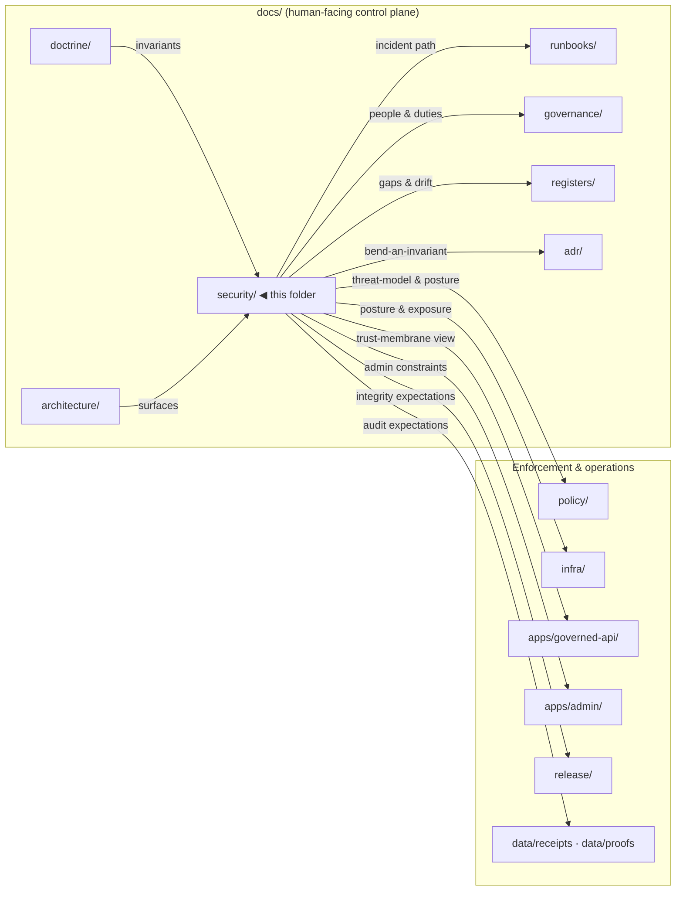

<!-- [KFM_META_BLOCK_V2]
doc_id: kfm://doc/docs-security-readme
title: docs/security/ — Security Doctrine, Threat Model, and Incident Response
type: standard
version: v1
status: draft
owners: <docs-steward>, <security-owner>
created: 2026-05-10
updated: 2026-05-10
policy_label: public
related:
  - docs/doctrine/trust-membrane.md
  - docs/doctrine/truth-posture.md
  - docs/doctrine/lifecycle-law.md
  - docs/doctrine/directory-rules.md
  - docs/architecture/governed-api.md
  - docs/runbooks/
  - docs/governance/
  - policy/
  - infra/
  - apps/governed-api/
  - release/signatures/
  - SECURITY.md
tags: [kfm, security, governance, docs, readme, doctrine]
notes:
  - Authority of this README is PROPOSED until verified against mounted-repo evidence.
  - Doctrine claims derived from directory-rules.md §6.1, §7.1, §9.2, §10.2, §10.3, §13.5, §15, §19.
  - Path-presence and CODEOWNERS claims are PROPOSED / NEEDS VERIFICATION.
  - Repo workspace was unmounted at creation; no implementation-shape claims made without doctrinal grounding.
[/KFM_META_BLOCK_V2] -->

# `docs/security/` — Security Doctrine, Threat Model, and Incident Response

> **The security home for KFM doctrine: what we defend, where the trust membrane runs, how exposure is bounded, and how incidents are recognized, contained, and reversed.**

[](#status)
[-1f6feb)](#authority-level)
[](#repo-fit)
[](#core-postures)
[](#review-burden)
[](#last-reviewed)

> **NOTE** — Badge link targets are placeholders. Replace with workflow / status endpoints once `tools/` and `.github/workflows/` evidence is verified. All path-presence claims in this README are **PROPOSED** until checked against mounted-repo evidence (see [§ Open verification](#open-verification)).

---

## Quick jump

[Purpose](#purpose) ·
[Repo fit](#repo-fit) ·
[Authority level](#authority-level) ·
[Status](#status) ·
[What belongs here](#what-belongs-here) ·
[What does NOT belong here](#what-does-not-belong-here) ·
[Inputs](#inputs) ·
[Outputs](#outputs) ·
[Validation](#validation) ·
[Review burden](#review-burden) ·
[Related folders](#related-folders) ·
[ADRs](#adrs) ·
[Directory tree](#directory-tree-proposed) ·
[Diagram](#diagram) ·
[Doctrine alignment](#doctrine-alignment) ·
[Task list](#task-list) ·
[FAQ](#faq) ·
[Last reviewed](#last-reviewed) ·
[Appendix](#appendix)

---

## Status & Authority

| Field | Value |
|---|---|
| **Document type** | Per-root README (§15 README contract, Directory Rules) |
| **Authority of this README** | **PROPOSED** — sits under `docs/`; specific subpath presence not yet verified against mounted repo. |
| **Owning responsibility root** | `docs/` (human-facing control plane) |
| **Subpath role** | `docs/security/` — threat model, exposure posture, incident response (Directory Rules §6.1) |
| **Class** | Canonical (under `docs/`) — not a compatibility root |
| **Lifecycle phase** | n/a (governance doctrine, not lifecycle data) |
| **Owners** | `<security-owner>` and `<docs-steward>` — fill from CODEOWNERS |
| **Reviewers required** | Docs steward + named security owner; ADR required for changes that bend an invariant (§ADRs) |
| **Supersedes** | None yet — this is the initial README for `docs/security/`. |
| **Related doctrine** | `docs/doctrine/trust-membrane.md`, `docs/doctrine/truth-posture.md`, `docs/doctrine/lifecycle-law.md`, `docs/doctrine/directory-rules.md`, `docs/architecture/governed-api.md`, `docs/runbooks/`, `docs/governance/` |

---

## Purpose

`docs/security/` is the **human-facing security control plane** for Kansas Frontier Matrix. It explains how KFM is defended, what postures apply by default, where the trust membrane runs, how secrets and exposure are bounded, and how incidents are recognized, contained, recorded, and reversed.

Three responsibilities, named directly by Directory Rules §6.1:

1. **Threat model** — what we defend against and what is explicitly out of scope.
2. **Exposure posture** — deny-by-default, least privilege, no direct model endpoint exposure, no raw-data exposure, audit logs (Directory Rules §10.2).
3. **Incident response** — how an incident is recognized, declared, contained, communicated, post-mortemed, and tied to a corrective change with a rollback path.

`docs/security/` **explains**. Enforcement lives elsewhere: `policy/` decides admissibility, `infra/` carries posture, `apps/governed-api/` is the executable trust membrane, `release/signatures/` and `data/proofs/` carry verifiable proof. This README is the orientation document for those connections.

---

## Repo fit

```
Kansas-Frontier-Matrix/
└── docs/
    ├── doctrine/        ← invariants & laws (truth, trust, lifecycle, directory)
    ├── architecture/    ← system context, governed-api, map-shell, …
    ├── security/  ◀──── you are here
    ├── runbooks/        ← ops procedures, rollback drills, secret-rotation runbook
    ├── governance/      ← roles, review burden, separation of duties
    ├── registers/       ← AUTHORITY_LADDER, DRIFT_REGISTER, VERIFICATION_BACKLOG, …
    └── adr/             ← Architecture Decision Records
```

**Upstream (inputs to this folder):**
`docs/doctrine/`, `docs/architecture/`, ADRs, drift register, verification backlog, runbooks, governance roles, sensitivity / rights policy under `policy/sensitivity/` and `policy/rights/`, and CI-hardening evidence under `tools/` and `.github/workflows/`.

**Downstream (consumers of this folder):**
PR reviewers, on-call responders, ADR authors, release stewards, the `SECURITY.md` advisory at repo root, and external researchers reading the public threat model.

> **IMPORTANT** — `docs/security/` is **not** a policy authority. It does not allow, deny, restrict, or abstain on anything. Those decisions live in `policy/`. If a rule is enforceable, it MUST also live in `policy/` and `tests/`.

---

## Authority level

**Canonical (under `docs/`).** Not a compatibility root. The folder is canonical *within* `docs/` as the security-doctrine lane. It does not override `policy/`, `infra/`, `tools/`, `release/`, or `apps/governed-api/`; it explains how they collectively keep KFM safe and reversible.

Per Directory Rules §13.5 ("Documentation as truth"): `docs/` explains; `docs/` does not decide alone. A page in `docs/security/` cannot be cited as the canonical decision for an admissibility, release, or enforcement question — that requires an ADR or a `control_plane/` register and the corresponding `policy/` rule.

---

## Status

**PROPOSED.**

- The **rule** that `docs/security/` is a canonical lane under `docs/` is **CONFIRMED** by Directory Rules §6.1.
- The **presence** of `docs/security/` and every file path proposed below is **PROPOSED** / **NEEDS VERIFICATION** until inspected in the mounted repository (see [Open verification](#open-verification)).
- Move to `CONFIRMED` once: (a) the folder exists with this README, (b) the canonical threat model, exposure posture, and incident response pages are present, and (c) CODEOWNERS lists a security owner.

---

## What belongs here

Files in `docs/security/` are **human-facing security explanation**. Accepted content:

- **Threat model.** A named, scoped enumeration of what KFM defends against, with adversary classes, attack surfaces, and explicit out-of-scope items. Tied to specific KFM surfaces — public web reads, the governed API, connectors, pipelines, the catalog, the trust membrane, AI runtime, the admin surface.
- **Exposure posture.** How the local-and-exposed deployment is bounded: deny-by-default, least privilege, no direct model endpoint exposure, no raw-data exposure, audit logging. Explanatory companion to `infra/` (Directory Rules §10.2).
- **Trust-membrane security guidance.** How `apps/governed-api/`, finite-outcome `RuntimeResponseEnvelope` (ANSWER · ABSTAIN · DENY · ERROR), `EvidenceBundle`, and integrity headers protect public consumers. *Companion to `docs/doctrine/trust-membrane.md`, not a replacement.*
- **Supply-chain and integrity guidance.** Sigstore / DSSE / Rekor expectations for `release/signatures/`, SBOM/SLSA references, CI-hardening expectations (pinned action SHAs, OIDC subject restrictions, scoped secrets). *Companion to `tools/` and `.github/workflows/` evidence.*
- **Secret handling.** Where secrets live, where they MUST NOT live (`configs/` is not a secret store — Directory Rules §10.3), rotation expectations, what to do on suspected exposure.
- **Sensitivity and rights interaction.** How the sensitivity rubric and rights gates intersect with security exposure (precise location, living-person data, archaeology, infrastructure). *Cross-references `policy/sensitivity/`, `policy/rights/`, and the rights doctrine; does not duplicate them.*
- **Incident response.** Recognition, declaration, severity classes, containment, public communication discipline, post-mortem template, and the path from incident → correction notice → rollback card → ADR.
- **Reporting channel.** How an internal or external reporter contacts KFM. Coordinated disclosure window. References to repo-root `SECURITY.md`.
- **Drills.** Tabletop exercises, redacted incident archive, rollback-drill links into `docs/runbooks/`.

Accepted file types: `*.md`, `*.mmd`/Mermaid embedded in Markdown, illustrative diagrams under `assets/` if needed.

---

## What does NOT belong here

The "do-not list" is as important as the "do list" (Directory Rules §15).

- **No enforcement code, no policy bundles, no schemas.** Policy lives in `policy/` (Rego/OPA, sensitivity, rights, runtime, promotion, release); schemas live in `schemas/contracts/v1/...` (ADR-0001).
- **No infrastructure manifests, host configs, firewall rules, reverse-proxy or VPN config.** Those belong in `infra/` (Directory Rules §10.2).
- **No real secrets, tokens, certificates, private keys, `.env` files.** If a real secret appears here, treat it as a **security incident**: rotate, audit, and open a runbook entry in `docs/runbooks/` (Directory Rules §10.3).
- **No release decisions, release manifests, promotion decisions, rollback cards, correction notices, withdrawal notices.** Those live in `release/`.
- **No signed artifacts, evidence bundles, proof packs, integrity bundles, AI receipts, run receipts.** Those live in `release/signatures/`, `data/proofs/`, `data/receipts/`.
- **No active incident records or live triage notes containing personal data, internal IPs, or unredacted source data.** Active triage uses the incident channel referenced from `docs/runbooks/`; post-incident, only redacted post-mortems land here.
- **No vulnerability working-data, raw scan output, exploit payloads, or reproduction recipes for unfixed issues.** Coordinated disclosure: keep until remediated and approved for publication.
- **No connector source-specific fetch code, allowlist data, or per-source secrets.** Connector posture stays in `connectors/` with source descriptors.
- **No "convenience" docs that just rename concepts from `docs/doctrine/`.** Cross-reference; do not duplicate.

---

## Inputs

| From | What flows in | Why |
|---|---|---|
| `docs/doctrine/trust-membrane.md`, `truth-posture.md`, `lifecycle-law.md`, `directory-rules.md` | Invariants this folder must explain consistently | Doctrine is the upstream source of truth. |
| `docs/architecture/governed-api.md`, `system-context.md`, `deployment-topology.md` | The surfaces this folder threat-models | You can only defend what you can name. |
| `policy/sensitivity/`, `policy/rights/`, `policy/runtime/`, `policy/release/` | Admissibility and gating rules referenced by the threat model | Security guidance must match what is enforceable. |
| `infra/` (`docker/`, `reverse_proxy/`, `vpn/`, `firewall/`, `hardening/`) | The deployed posture this folder describes | Exposure posture is operational, not aspirational. |
| `tools/`, `.github/workflows/` | CI-hardening evidence, signature/SBOM workflows | Supply-chain guidance must reflect actual CI. |
| `release/signatures/`, `data/proofs/`, `data/receipts/` | What "verifiable" looks like in practice | Integrity claims must point at real artifacts. |
| `docs/registers/DRIFT_REGISTER.md`, `VERIFICATION_BACKLOG.md` | Known gaps, contradictions, drift | Honest incompleteness over polish. |

---

## Outputs

| To | What this folder emits or supports | How it shows up |
|---|---|---|
| `SECURITY.md` (repo root) | Public-facing reporting channel, coordinated-disclosure policy, scope | Short root file links into `docs/security/` for the full text. |
| PR reviewers | A reusable security checklist for PRs touching `apps/`, `infra/`, `connectors/`, `policy/`, `release/`, `configs/` | Linked from `docs/governance/` and CODEOWNERS. |
| On-call responders | An incident playbook with recognition criteria, containment steps, communication template, and rollback hooks | Referenced from `docs/runbooks/`. |
| Release stewards | Threat-model context for promotion-gate sign-off | Cited in `docs/runbooks/` and ADRs. |
| External researchers | A public threat model and disclosure policy | Linked from project README and `SECURITY.md`. |
| ADR authors | A baseline of named threats and postures to argue against | Cited in ADRs that change exposure surface. |

---

## Core postures

The four postures `docs/security/` MUST explain and keep aligned across all surfaces:

| Posture | What it means | Where enforced |
|---|---|---|
| **Deny-by-default** | Nothing is reachable unless an explicit, reviewed rule allows it. | `infra/` exposure config; `apps/governed-api/` route registration; `policy/runtime/`. |
| **Least privilege** | No app, worker, connector, CI job, or person holds more access than its role requires. | `infra/hardening/`, CI OIDC subject restrictions, CODEOWNERS, `apps/admin/` constraints. |
| **Fail-closed** | When evidence, policy, identity, or integrity cannot be established, the surface returns DENY or ABSTAIN — never a guess. | `apps/governed-api/` `RuntimeResponseEnvelope`; `policy/runtime/`; promotion gates. |
| **Auditability** | Every consequential action emits a receipt or decision that can be replayed and inspected. | `data/receipts/`, `data/proofs/`, `release/`, append-only audit ledger. |

> **WARNING** — A "convenience" deviation from any of the four (a wide-open admin shortcut, a fail-open path, an unaudited worker write to `data/published/`) is a doctrinal violation under Directory Rules §13.5 and §7.1. Document, justify, constrain, and keep it out of the normal public path — or do not ship it.

---

## Validation

How `docs/security/` is checked (rather than how policy is enforced — that's `policy/` and `tests/`):

- **Link discipline.** Internal links resolve; doctrine cross-references match `docs/doctrine/` files; no broken anchors.
- **Posture consistency.** Claims here MUST NOT contradict `docs/doctrine/`, `policy/`, or `infra/`. Conflicts open an entry in `docs/registers/DRIFT_REGISTER.md`.
- **Reporting channel reachability.** The disclosure channel named in `SECURITY.md` and here is the same channel and is currently monitored.
- **Drill currency.** Tabletop / rollback drills referenced from `docs/runbooks/` have been exercised within the documented window.
- **CODEOWNERS coverage.** `docs/security/**` is covered by CODEOWNERS with at least one security owner.
- **README-contract conformance (§15).** This README contains every required section.

> **PROPOSED** — A `tools/validators/docs/security_doc_lint.<ext>` could enforce link discipline, required-section presence, and posture-table parity with doctrine. *Validator name and location are illustrative; create per Directory Rules §7.5 if adopted.*

---

## Review burden

| Change | Who reviews | Gate |
|---|---|---|
| Typo, link fix, clarification | Docs steward | Routine PR |
| New page, restructure, table changes | Docs steward + security owner | PR with rationale |
| Threat-model scope change, new adversary class, new public-disclosure language | Docs steward + security owner + one architecture owner | PR + advisory to release steward |
| Change that **bends an invariant** (e.g., proposes a normal public path that bypasses the trust membrane, or weakens fail-closed) | Docs steward + security owner + ADR | **ADR required** (Directory Rules §2.4 / §17) |
| Change to the reporting channel, coordinated-disclosure window, or severity rubric | Docs steward + security owner + governance owner | PR + update to `SECURITY.md` and `docs/governance/` |

CODEOWNERS entry (PROPOSED): `docs/security/   @kfm/docs-steward @kfm/security-owner` — verify the team handles match your CODEOWNERS file.

---

## Related folders

| Folder | Relationship |
|---|---|
| `docs/doctrine/` | Upstream invariants. `docs/security/` explains how they hold under adversarial pressure. |
| `docs/architecture/governed-api.md` | The executable trust membrane. Threat-modeled here. |
| `docs/runbooks/` | Operational procedures, rollback drills, secret-rotation, incident playbook. |
| `docs/governance/` | Roles, review burden, separation of duties — names the people in the incident path. |
| `docs/registers/` | DRIFT_REGISTER, VERIFICATION_BACKLOG, CONTRADICTION_REGISTER referenced from open items here. |
| `docs/adr/` | ADRs that change exposure surface, fail-closed posture, or the trust membrane. |
| `policy/` | Where the enforceable rules live. Security guidance references; policy enforces. |
| `infra/` | Deployed posture. Directory Rules §10.2: deny-by-default, least privilege, audit. |
| `apps/governed-api/` | Public trust path; finite-outcome envelopes. |
| `apps/admin/` | Restricted admin; explicitly **not** the normal public path (Directory Rules §7.1). |
| `release/` | Signatures, manifests, rollback cards, correction notices — the verifiable side of "we said this, we can prove it, we can take it back". |
| `data/receipts/`, `data/proofs/` | Append-only process memory and proof closure. |
| `connectors/` | Source-edge surfaces. Threat-model adversary classes for source spoofing, mirror poisoning, license drift. |
| Root `SECURITY.md` | Public advisory pointer; this folder is its long form. |

---

## ADRs

ADRs related to security and the trust membrane belong in `docs/adr/`. PROPOSED candidates (none yet verified):

- **ADR-XXXX — Coordinated disclosure policy and reporting channel.** *PROPOSED.*
- **ADR-XXXX — Fail-closed posture across the governed API.** *PROPOSED.*
- **ADR-XXXX — Supply-chain integrity: Sigstore + DSSE + Rekor for release signatures.** *PROPOSED.*
- **ADR-XXXX — Admin-surface exposure constraints (`apps/admin/` is not the normal public path).** *PROPOSED.*
- **ADR-XXXX — Secret-handling and rotation policy; `configs/` is not a secret store.** *PROPOSED.*

> **NOTE** — These are placeholders for the verification backlog, not claims that the ADRs exist. ADR-0001 (schema home) is already cited in Directory Rules §0; security ADRs are not yet enumerated in attached doctrine.

---

## Directory tree (PROPOSED)

```
docs/security/
├── README.md                      # this file
├── threat-model.md                # adversary classes, surfaces, out-of-scope items
├── exposure-posture.md            # deny-by-default, least privilege, audit; companion to infra/
├── trust-membrane-security.md     # security view of apps/governed-api/ and finite-outcome envelopes
├── supply-chain.md                # Sigstore / DSSE / Rekor / SBOM / SLSA; CI-hardening reference
├── secrets.md                     # where secrets live, where they MUST NOT live, rotation, exposure response
├── sensitivity-and-rights.md      # how security interacts with sensitivity rubric and rights gates
├── incident-response.md           # recognition → containment → comms → post-mortem → correction
├── disclosure.md                  # coordinated disclosure policy; reporting channel; safe-harbor
├── drills/                        # tabletop exercises and redacted post-mortems
│   └── README.md
└── assets/                        # diagrams referenced from the pages above
    └── .gitkeep
```

> **NEEDS VERIFICATION** — Every path above is PROPOSED until the repo is mounted. None of these files exist by virtue of being listed here.

---

## Diagram

How the security docs fit into the governance landscape. The arrows are **"explains / references,"** not "controls / decides."


```mermaid
flowchart LR
  subgraph DOCS["docs/  (human-facing control plane)"]
    DOCT["doctrine/"]
    ARCH["architecture/"]
    SEC["security/  ◀ this folder"]
    RUN["runbooks/"]
    GOV["governance/"]
    REG["registers/"]
    ADR["adr/"]
  end

  subgraph ENFORCE["Enforcement & operations"]
    POL["policy/"]
    INF["infra/"]
    API["apps/governed-api/"]
    ADM["apps/admin/"]
    REL["release/"]
    DATA["data/receipts · data/proofs"]
  end

  DOCT -- invariants --> SEC
  ARCH -- surfaces --> SEC
  SEC -- threat-model & posture --> POL
  SEC -- posture & exposure --> INF
  SEC -- trust-membrane view --> API
  SEC -- admin constraints --> ADM
  SEC -- integrity expectations --> REL
  SEC -- audit expectations --> DATA
  SEC -- incident path --> RUN
  SEC -- people & duties --> GOV
  SEC -- gaps & drift --> REG
  SEC -- bend-an-invariant --> ADR
```

> Diagram reflects relationships named in Directory Rules §6.1, §7.1, §10.2, §13.5 and the trust-membrane category in the components dossier. **PROPOSED** for visual layout; relationships are CONFIRMED by doctrine.

---

## Doctrine alignment

Quick traceback from each canonical posture to where it is grounded.

| Posture / claim | Source |
|---|---|
| `docs/security/` owns threat model, exposure posture, incident response | Directory Rules §6.1 — `docs/` canonical tree |
| Deny-by-default, least privilege, no direct model endpoint, no raw-data exposure, audit logs | Directory Rules §10.2 — `infra/` |
| Trust membrane is `apps/governed-api/`; public clients use it, not canonical/internal stores | Directory Rules §7.1, §13.5; KFM core invariants |
| Finite outcomes: ANSWER · ABSTAIN · DENY · ERROR (`RuntimeResponseEnvelope`) | Directory Rules §19 (glossary); §7.1 |
| `apps/admin/` MUST NOT be the normal public path | Directory Rules §7.1 |
| `configs/` MUST NOT store real secrets; exposure → runbook + rotation + audit | Directory Rules §10.3 |
| Release signatures live in `release/signatures/` (DSSE / Sigstore) | Directory Rules §9.2 |
| Watcher-as-non-publisher (workers emit receipts/candidates only) | Directory Rules §13.5; KFM core invariants |
| Append-only audit ledger of receipts | KFM components dossier (Pass 10, "C1-06 Immutable, Append-Only Audit Ledger of Receipts") |
| CI hardening: pinned action SHAs, OIDC subject restrictions, scoped secrets | KFM components dossier (Pass 11, "K.4 CI Hardening") |
| Integrity headers, Sigstore/DSSE, Rekor in the trust membrane | KFM components dossier (Pass 11, "Category F — Trust Membrane") |
| Fail-closed at public exposure; problems live at the edge, not in the membrane | KFM components dossier (Pass 11, §12.5 and fail-closed discussion) |
| Sensitivity rubric (0–5) and redaction profiles | KFM components dossier (Pass 10, sensitivity rubric) |

---

## Task list

Minimum bar for `docs/security/` to be **CONFIRMED**.

- [ ] `docs/security/README.md` (this file) merged
- [ ] `threat-model.md` drafted, listing adversary classes per surface and explicit out-of-scope items
- [ ] `exposure-posture.md` mirrors actual `infra/` posture; gaps logged in `docs/registers/DRIFT_REGISTER.md`
- [ ] `trust-membrane-security.md` cross-linked with `docs/doctrine/trust-membrane.md` and `docs/architecture/governed-api.md`
- [ ] `supply-chain.md` names which workflows are pinned, where SBOM lives, and how signatures are verified
- [ ] `secrets.md` confirms `configs/` is not a secret store and names the actual secret store
- [ ] `sensitivity-and-rights.md` cross-links `policy/sensitivity/` and `policy/rights/`
- [ ] `incident-response.md` names severities, the comms template, and the bridge to `release/correction_notices/` and `release/rollback_cards/`
- [ ] `disclosure.md` matches root `SECURITY.md`; reporting channel verified reachable
- [ ] CODEOWNERS covers `docs/security/**` with a security owner
- [ ] At least one tabletop drill referenced and dated under `drills/`
- [ ] Open items moved from this README into `docs/registers/VERIFICATION_BACKLOG.md`

**Definition of Done.** All boxes checked, no entry for `docs/security/` in `DRIFT_REGISTER.md`, security owner sign-off recorded in PR.

---

## FAQ

<details>
<summary><b>Why is this folder under <code>docs/</code> and not at repo root?</b></summary>

Because security explanation is human-facing doctrine. Per Directory Rules §6.1, `docs/` is the canonical human-facing control plane, and `security/` is listed inside it. A root `security/` would be a **drift candidate** (§3 "no root-level domain folders"). Enforcement and posture live in `policy/` and `infra/` — those *are* canonical roots.

</details>

<details>
<summary><b>What's the difference between this folder and the root <code>SECURITY.md</code>?</b></summary>

`SECURITY.md` is the short, public-facing advisory (reporting channel, scope, coordinated-disclosure window). `docs/security/` is the long-form, internally-cited body the advisory points to. Treat `SECURITY.md` as the front door and this folder as the building.

</details>

<details>
<summary><b>Where does the actual policy live?</b></summary>

In `policy/` (Directory Rules §6.5). Sensitivity rules in `policy/sensitivity/`, rights in `policy/rights/`, runtime gates in `policy/runtime/`, promotion gates in `policy/promotion/`, release gates in `policy/release/`. This folder explains and references; `policy/` decides.

</details>

<details>
<summary><b>Can I file a vulnerability here?</b></summary>

No. Use the channel named in `SECURITY.md` and `docs/security/disclosure.md`. Public issues for un-remediated vulnerabilities violate coordinated-disclosure discipline.

</details>

<details>
<summary><b>Where do incident records go?</b></summary>

Active triage uses the operational channel referenced in `docs/runbooks/`, not this folder. Once an incident is closed and approved for publication, a **redacted** post-mortem lands in `docs/security/drills/` or as a referenced ADR. Receipts and signatures from the incident live in `data/receipts/` and `release/`.

</details>

<details>
<summary><b>Why so many "PROPOSED" labels?</b></summary>

Because the repository was not mounted when this README was written; Directory Rules require that paths and presence claims be checked against actual repo evidence before being labeled CONFIRMED. The **doctrine** the README is built from is CONFIRMED; the **implementation** of `docs/security/` is PROPOSED until inspected.

</details>

---

## Open verification

Items to verify against the mounted repository before this README can move from PROPOSED to CONFIRMED. Open them into `docs/registers/VERIFICATION_BACKLOG.md`.

1. Does `docs/security/` exist? Does any of the listed substructure already exist?
2. Does root `SECURITY.md` exist? Does it reference `docs/security/`?
3. Does CODEOWNERS cover `docs/security/**` with a named security owner?
4. Does `docs/doctrine/trust-membrane.md` exist (the page this folder must stay aligned with)?
5. Does `apps/governed-api/` exist; does it return `RuntimeResponseEnvelope` with the finite outcomes named here?
6. Does `policy/` exist (singular, canonical) and not `policies/`? Drift if both.
7. Does `release/signatures/` exist with Sigstore/DSSE artifacts referenced?
8. Are `.github/workflows/` action versions pinned to SHAs? Is OIDC subject-restricted?
9. Is the secret store named and referenced from `docs/security/secrets.md`?
10. Has a tabletop drill been run and dated under `drills/` within the policy window?

---

## Last reviewed

| Field | Value |
|---|---|
| **Created** | `<!-- TBD: ISO date when this README first lands -->` |
| **Last reviewed** | `<!-- TBD: ISO date of most recent review -->` |
| **Review cadence** | Every 6 months, or on any change to `docs/doctrine/trust-membrane.md`, `apps/governed-api/`, `infra/`, or `policy/` posture |
| **Reviewers (last)** | `<docs-steward>`, `<security-owner>` |

---

## Appendix

<details>
<summary><b>A. README §15 contract — section coverage check</b></summary>

| §15 section | This README |
|---|---|
| Purpose | [Purpose](#purpose) |
| Authority level | [Authority level](#authority-level) |
| Status | [Status](#status) |
| What belongs here | [What belongs here](#what-belongs-here) |
| What does NOT belong here | [What does NOT belong here](#what-does-not-belong-here) |
| Inputs | [Inputs](#inputs) |
| Outputs | [Outputs](#outputs) |
| Validation | [Validation](#validation) |
| Review burden | [Review burden](#review-burden) |
| Related folders | [Related folders](#related-folders) |
| ADRs | [ADRs](#adrs) |
| Last reviewed | [Last reviewed](#last-reviewed) |

</details>

<details>
<summary><b>B. PR security checklist (illustrative — not yet wired into CI)</b></summary>

For PRs touching `apps/`, `apps/admin/`, `apps/governed-api/`, `infra/`, `connectors/`, `policy/`, `release/`, `configs/`, or `runtime/`:

- [ ] No new public route bypasses `apps/governed-api/`.
- [ ] No new fail-open path. Fail-closed by default; ABSTAIN/DENY are returned with reason.
- [ ] No new admin shortcut on the normal public path. `apps/admin/` constraints documented.
- [ ] No new secret in `configs/`, in source, in fixtures, in logs, or in receipts.
- [ ] No connector writes to `data/processed/`, `data/catalog/`, or `data/published/`.
- [ ] No worker writes to `data/published/` or `data/catalog/` (watcher-as-non-publisher).
- [ ] Receipts and proofs land in `data/receipts/` / `data/proofs/`, not `artifacts/`.
- [ ] If exposure surface changes, ADR cited and threat model updated.
- [ ] If audit-relevant behavior changes, runbook updated.
- [ ] If posture-relevant invariant bends, ADR cited (Directory Rules §2.4).

</details>

<details>
<summary><b>C. Glossary pointers (defined in <code>docs/doctrine/</code>)</b></summary>

- **Trust membrane** — the boundary preventing raw / unreviewed / model-generated / internal state from becoming public truth; executable form is `apps/governed-api/`.
- **Cite-or-abstain** — default truth posture; without resolvable evidence, return ABSTAIN.
- **EvidenceBundle / EvidenceRef** — resolved support package and reference for claims; `data/proofs/` + `packages/evidence-resolver/`.
- **RuntimeResponseEnvelope** — finite-outcome wrapper (ANSWER · ABSTAIN · DENY · ERROR).
- **Watcher-as-non-publisher** — workers emit receipts and candidate decisions; they never publish or mutate canonical records.
- **Promotion** — governed state transition between lifecycle phases. Not a file move.
- **Fail-closed** — when prerequisites cannot be established, the surface denies/abstains rather than guesses.

Authoritative definitions live in `docs/doctrine/` and `contracts/`. This list is a pointer only.

</details>

[Back to top ⤴](#docssecurity--security-doctrine-threat-model-and-incident-response)
