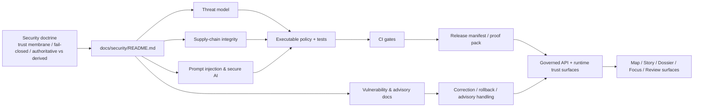

<!-- [KFM_META_BLOCK_V2]
doc_id: kfm://doc/<REVIEW-REQUIRED-UUID>
title: Kansas Frontier Matrix Security & Supply Chain Governance
type: standard
version: v1
status: review
owners: <REVIEW-REQUIRED>
created: <REVIEW-REQUIRED>
updated: 2026-03-16
policy_label: <REVIEW-REQUIRED>
related: [./threat-model.md, ./vulnerability-management.md, ./prompt-injection/README.md, ./ai-supply-chain/README.md, ./vulns/README.md, ./supply-chain/dependency-confusion/README.md, ./supply-chain/sigstore-cosign-v3/README.md]
tags: [kfm, security, supply-chain, governance, docs]
notes: [mounted workspace in this session exposed PDFs only; owners, policy label, created date, and repo-adjacent upstream links need verification]
[/KFM_META_BLOCK_V2] -->

# Kansas Frontier Matrix Security & Supply Chain Governance

Evidence-first orientation for KFM security doctrine, supply-chain integrity, runtime-boundary rules, advisories, and trust-visible release behavior under `docs/security/`.

> [!IMPORTANT]
> **Status:** active  
> **Owners:** `<REVIEW-REQUIRED>`  
>        
> **Quick jump:** [Scope](#scope) · [Repo fit](#repo-fit) · [Accepted inputs](#accepted-inputs) · [Exclusions](#exclusions) · [Directory tree](#directory-tree-observed-security-doc-footprint) · [Quickstart](#quickstart) · [Usage](#usage) · [Diagram](#diagram) · [Security control areas](#security-control-areas) · [Quality gates](#quality-gates--definition-of-done) · [FAQ](#faq)

> [!WARNING]
> This README is doctrine-grounded, but the mounted workspace in this session did **not** expose a live repo tree, schema inventory, workflow directory, deployment manifests, or runtime logs. Treat repo structure below as **CONFIRMED** only where the corpus explicitly names it; treat broader implementation detail as **INFERRED**, **PROPOSED**, or **NEEDS VERIFICATION** where marked.

## Scope

This directory is the security-facing documentation hub for KFM’s trust membrane, governed publication, supply-chain integrity, runtime-boundary discipline, and security-visible release behavior.

It exists to keep security material aligned with the same non-negotiable rules that govern the rest of KFM:

- security begins with governed publication, not perimeter polish
- clients do not bypass governed APIs
- authoritative truth stays distinct from derived or rebuildable projections
- policy executes in **CI and runtime**, not only in prose
- negative outcomes such as **deny**, **abstain**, **generalize**, **withdraw**, and **correction-pending** are valid trust-preserving states
- documentation, contracts, receipts, and runbooks are production security surfaces

### KFM-specific doctrine this README must preserve

| KFM rule | What it means for `docs/security/` |
|---|---|
| Trust membrane | Security docs must document how public and steward surfaces stay downstream of governed APIs, policy, and release state. |
| Fail-closed posture | Missing evidence, broken provenance, unresolved rights, weak redaction, or failed gates should block publish/promote/respond rather than degrade silently. |
| Authoritative vs. derived separation | Graph, vector, tile, cache, summary, embedding, and AI outputs must never be documented as sovereign truth. |
| Policy in CI and runtime | This subtree should describe both merge/promotion gates and request-time enforcement. |
| Docs as production surface | Behavior-significant security changes should update docs, contracts, tests, and runbooks together. |
| UNKNOWN stays visible | Unverified repo or runtime claims must be called out, not polished into certainty. |

[Back to top](#kansas-frontier-matrix-security--supply-chain-governance)

## Repo fit

**Path:** `docs/security/README.md`

**Role in repo:** entry point for the security and supply-chain documentation subtree.

**Upstream:** `../README.md` *(INFERRED; verify against mounted repo before commit if the docs index path differs)*

**Downstream (observed in corpus-backed repo indexes):**
- [`./threat-model.md`](./threat-model.md)
- [`./vulnerability-management.md`](./vulnerability-management.md)
- [`./prompt-injection/README.md`](./prompt-injection/README.md)
- [`./prompt-injection-defense.md`](./prompt-injection-defense.md)
- [`./ai-supply-chain/README.md`](./ai-supply-chain/README.md)
- [`./vulns/README.md`](./vulns/README.md)
- [`./supply-chain/dependency-confusion/README.md`](./supply-chain/dependency-confusion/README.md)
- [`./supply-chain/sigstore-cosign-v3/README.md`](./supply-chain/sigstore-cosign-v3/README.md)

### How this README fits the wider KFM docs set

This file should orient readers before they drop into deeper, narrower documents. It should not try to duplicate the canonical master manuals, the domain atlas, or executable policy bundles. Instead, it should answer three practical questions quickly:

1. What security laws govern KFM?
2. Which security doc lane should I open next?
3. What must change together when security-significant behavior changes?

## Accepted inputs

Content that belongs here or under this subtree:

- threat-model and trust-boundary documentation
- security doctrine mapped to KFM concepts such as trust membrane, fail-closed promotion, citation-negative testing, and evidence-bearing rollback
- supply-chain integrity guidance: signatures, attestations, SBOMs, provenance, release manifests, digest-first release identity
- runtime-boundary notes for governed API exposure, model-runtime containment, least-privilege services, and narrow network exposure
- prompt-injection, secure AI, and AI supply-chain controls
- vulnerability-management, advisories, emergency hardening, and bulletin-style references
- reviewer/operator-facing guidance for promotion gates, rollback, correction, and evidence reconstruction

## Exclusions

Content that does **not** belong here:

| Keep out of `docs/security/` | Where it goes instead |
|---|---|
| Secrets, private keys, tokens, live credentials | Secret manager, deployment environment, or other controlled runtime secret boundary — never docs |
| Executable policy as prose-only documentation | Keep enforcement in executable policy bundles and tests; mirror intent and reviewer guidance here |
| Raw incident artifacts, restricted evidence, or sensitive exact locations | Governed evidence/artifact stores and steward-only review lanes |
| Broad canonical architecture copied verbatim | Canonical/root KFM manuals and architecture references |
| Domain-specific stewardship detail that is not cross-cutting security policy | Domain/source atlas and steward review materials |
| Repo/runtime claims not directly evidenced | Mark as `UNKNOWN` / `NEEDS VERIFICATION` until mounted repo or runtime proof exists |

[Back to top](#kansas-frontier-matrix-security--supply-chain-governance)

## Directory tree (observed security doc footprint)

> [!NOTE]
> This is a **partial, corpus-confirmed footprint**, not a live `tree` output from the mounted repo.

```text
docs/security/
├── README.md
├── threat-model.md
├── vulnerability-management.md
├── prompt-injection-defense.md
├── ai-supply-chain/
│   └── README.md
├── prompt-injection/
│   └── README.md
├── vulns/
│   ├── README.md
│   ├── apache-tika-cve-2025-66516.md
│   └── node-forge/
│       └── CVE-2025-12816.md
├── react2shell/
│   └── README.md
├── react2shell-advisory/
│   └── README.md
├── bulletins/
│   └── android/
│       └── 2025-12-android-security-bulletin.md
└── supply-chain/
    ├── dependency-confusion/
    │   ├── README.md
    │   ├── policy/README.md
    │   ├── checks/README.md
    │   └── examples/
    │       ├── lockfile-drift-attack.md
    │       └── namespace-collision-basic.md
    ├── sigstore-cosign-v3/
    │   └── README.md
    ├── reference-repos/
    │   └── README.md
    └── shai-hulud-2.0/
        ├── README.md
        ├── protections/README.md
        ├── workflows/README.md
        └── indicators/
            ├── README.md
            ├── signatures/README.md
            └── samples/README.md
```

## Quickstart

Start here when a change touches trust, release, runtime exposure, or supply-chain integrity.

1. Read this README first to identify the relevant control lane.
2. Update the deeper doc in this subtree that owns the narrow topic.
3. Change executable artifacts in the same governed stream when behavior changes: policy bundles, contracts, fixtures, tests, runbooks, and release evidence.
4. Keep implementation facts explicitly labeled if the repo or runtime proof is not mounted.
5. Treat missing docs for behavior-significant change as a release concern, not a cleanup task.

```text
Minimum security-doc change set for one governed PR

- docs/security/README.md                       # orientation and cross-links
- affected deeper security doc(s)              # threat model / prompt injection / advisories / supply chain
- affected contracts or policy bundles         # executable enforcement, not prose only
- affected test fixtures or gates              # especially negative fixtures
- affected runbook / rollback / correction note
- release-evidence references updated together
```

## Usage

### Use this README when you need to…

| Task | Start here | Then go deeper |
|---|---|---|
| Explain KFM’s security posture to contributors or reviewers | This README | [`./threat-model.md`](./threat-model.md) |
| Document trust-boundary or bypass risks | This README | [`./threat-model.md`](./threat-model.md) |
| Add prompt-injection or secure AI guidance | This README | [`./prompt-injection/README.md`](./prompt-injection/README.md) and [`./prompt-injection-defense.md`](./prompt-injection-defense.md) |
| Add signing / attestation / digest / provenance guidance | This README | [`./supply-chain/sigstore-cosign-v3/README.md`](./supply-chain/sigstore-cosign-v3/README.md) |
| Document dependency-confusion or package-origin defenses | This README | [`./supply-chain/dependency-confusion/README.md`](./supply-chain/dependency-confusion/README.md) |
| Add or update advisories / CVE notes | This README | [`./vulns/README.md`](./vulns/README.md) |
| Describe AI supply-chain controls | This README | [`./ai-supply-chain/README.md`](./ai-supply-chain/README.md) |
| Capture remediation policy and lifecycle | This README | [`./vulnerability-management.md`](./vulnerability-management.md) |

### Review posture for this subtree

Use KFM’s explicit truth labels whenever the doc would otherwise sound more implemented than the evidence proves:

- **CONFIRMED** — directly supported by mounted doctrine or observed file/path evidence
- **INFERRED** — likely from corpus cross-reference, but not directly mounted as live repo fact
- **PROPOSED** — target-state contract or control direction consistent with doctrine
- **UNKNOWN / NEEDS VERIFICATION** — not strong enough to present as settled repo/runtime reality

## Diagram


```mermaid
flowchart LR
    A[Security doctrine<br/>trust membrane / fail-closed / authoritative vs derived] --> B[docs/security/README.md]
    B --> C[Threat model]
    B --> D[Supply-chain integrity]
    B --> E[Prompt injection & secure AI]
    B --> F[Vulnerability & advisory docs]

    C --> G[Executable policy + tests]
    D --> G
    E --> G
    F --> H[Correction / rollback / advisory handling]

    G --> I[CI gates]
    I --> J[Release manifest / proof pack]
    J --> K[Governed API + runtime trust surfaces]
    H --> K

    K --> L[Map / Story / Dossier / Focus / Review surfaces]
```

## Security control areas

| Area | Core concern | KFM-specific obligation | Primary doc lane |
|---|---|---|---|
| Threat model | Bypass, direct store access, over-privileged runtime, rights leakage | Keep the trust membrane explicit and test non-bypass | `threat-model.md` |
| Supply-chain integrity | Mutable tags, weak provenance, unsigned artifacts, build drift | Prefer digest identity, SBOMs, attestations, signatures, and evidence-bearing promotion | `supply-chain/` |
| Policy enforcement | Prose-only controls, incomplete redaction, missing review logic | Enforce deny-by-default in CI and runtime | this README + executable policy/test locations |
| Runtime boundary | Direct model/runtime exposure, over-broad network paths, long-lived secrets | Keep model runtimes and canonical stores behind governed APIs; prefer least privilege | this README + threat model |
| Secure AI / prompt injection | Scope creep, unsafe retrieval, uncited synthesis, hostile input | Retrieve, cite, verify, abstain; sanitize inputs and bound outputs | `prompt-injection/` + `ai-supply-chain/` |
| Vulnerability management | Advisory drift, incomplete remediation notes, emergency hardening gaps | Keep correction/rollback visible and connect advisories to actual mitigation behavior | `vulns/` + `vulnerability-management.md` |
| Docs as production surface | Drift between docs, contracts, tests, and runtime | Security-significant behavior changes must update docs in the same change stream | this README |

[Back to top](#kansas-frontier-matrix-security--supply-chain-governance)

## Quality gates & definition of done

A security-doc change in this subtree is not done when prose looks finished. It is done when the relevant trust obligations are still inspectable.

### Definition of done

- [ ] The affected document states the **security boundary** or trust obligation clearly.
- [ ] Any behavior-significant change is reflected in the matching contract, policy, test, runbook, or release-evidence reference.
- [ ] The change does not silently turn a **PROPOSED** or **UNKNOWN** repo/runtime claim into asserted fact.
- [ ] Public-surface implications are documented where relevant: evidence state, freshness, denial/abstention, review-required, redaction/generalization.
- [ ] Negative paths are documented where relevant, not only the happy path.
- [ ] Cross-links from this README still land on the deeper docs that own the narrow topic.
- [ ] Security-significant docs remain usable as operational material, not just narrative commentary.

### Release-sensitive gates this README assumes exist or should exist

| Gate family | Why it matters to this subtree |
|---|---|
| Schema / contract gate | Security docs should not drift away from machine-checkable envelopes and fixtures. |
| Policy bundle gate | Missing evidence, broken provenance, insufficient redaction, or unresolved rights should block merge/promotion. |
| Documentation gate | Security-significant behavior changes should update docs, examples, and runbooks together. |
| Citation-negative / runtime denial tests | The system should prove it abstains, denies, or errors rather than fabricating support. |
| Release assembly gate | Visibility change should require a complete release manifest or proof pack. |
| Correction drill | Withdrawal, supersession, or narrowing should preserve lineage and update surface state. |

> [!TIP]
> KFM’s own doctrine points to a small next-artifact set rather than more broad conceptual writing: contract starter files, policy bundles, valid/invalid fixtures, proof objects, one governed thin slice, and repo/runtime evidence surfaced honestly. This README should stay aligned with that bias.

## FAQ

### Is this README proof that the controls are implemented?
No. This README is a governed orientation surface. It explains doctrine, expected boundaries, and the doc subtree. It is not a substitute for mounted contracts, executable policy, tests, manifests, or runtime proof.

### Why is documentation treated as part of security?
Because KFM treats docs, contracts, receipts, and runbooks as production security surfaces. If those drift from behavior, the trust membrane weakens even when code still runs.

### Why does this README keep calling out denial, abstention, and generalization?
Because KFM is fail-closed by design. Negative outcomes are not UX failures; they are valid trust-preserving states when evidence, policy, rights, or review obligations are incomplete.

### Why avoid precise implementation claims?
Because the mounted workspace in this session exposed PDFs, not the live repo tree or runtime. This README should help reviewers avoid accidental overclaiming.

## Appendix

<details>
<summary><strong>Observed downstream security docs from the support-file index</strong></summary>

This extended list is useful when wiring cross-links or checking for overlap before creating new files.

- `docs/security/README.md`
- `docs/security/threat-model.md`
- `docs/security/vulnerability-management.md`
- `docs/security/prompt-injection/README.md`
- `docs/security/prompt-injection-defense.md`
- `docs/security/ai-supply-chain/README.md`
- `docs/security/vulns/README.md`
- `docs/security/vulns/apache-tika-cve-2025-66516.md`
- `docs/security/vulns/node-forge/CVE-2025-12816.md`
- `docs/security/react2shell/README.md`
- `docs/security/react2shell-advisory/README.md`
- `docs/security/bulletins/android/2025-12-android-security-bulletin.md`
- `docs/security/supply-chain/dependency-confusion/README.md`
- `docs/security/supply-chain/dependency-confusion/policy/README.md`
- `docs/security/supply-chain/dependency-confusion/checks/README.md`
- `docs/security/supply-chain/dependency-confusion/examples/lockfile-drift-attack.md`
- `docs/security/supply-chain/dependency-confusion/examples/namespace-collision-basic.md`
- `docs/security/supply-chain/sigstore-cosign-v3/README.md`
- `docs/security/supply-chain/reference-repos/README.md`
- `docs/security/supply-chain/shai-hulud-2.0/README.md`
- `docs/security/supply-chain/shai-hulud-2.0/protections/README.md`
- `docs/security/supply-chain/shai-hulud-2.0/workflows/README.md`
- `docs/security/supply-chain/shai-hulud-2.0/indicators/README.md`
- `docs/security/supply-chain/shai-hulud-2.0/indicators/signatures/README.md`
- `docs/security/supply-chain/shai-hulud-2.0/indicators/samples/README.md`

</details>

<details>
<summary><strong>Compact corpus-grounded security checklist</strong></summary>

```text
Use this subtree to keep these KFM rules visible:

- Security begins with governed publication.
- Clients do not bypass governed APIs.
- Derived layers are not authoritative by default.
- Policy executes in CI and runtime.
- Short-lived workload identity beats long-lived credentials.
- Documentation, contracts, receipts, and runbooks are production security surfaces.
- Missing evidence, broken provenance, unresolved rights, or weak redaction should fail closed.
- Model runtimes stay behind the trust membrane.
- Correction and rollback must be evidence-bearing.
- UNKNOWN stays visible until direct evidence exists.
```

</details>

<details>
<summary><strong>Verification backlog for this README</strong></summary>

- Confirm the actual upstream docs index path and replace the inferred upstream link if needed.
- Verify owners, policy label, created date, and canonical doc ID.
- Compare this README title against the mounted repo’s existing `docs/security/README.md` title and preserve it if the repo uses a stricter naming convention.
- Replace partial observed footprint language with a real repo tree snapshot once the repo is mounted.
- Confirm whether additional security subtrees exist beyond the support-file index excerpt.

</details>

[Back to top](#kansas-frontier-matrix-security--supply-chain-governance)# Security

This directory stores security-related documentation for Kansas Frontier Matrix.

- Add documents here as work is produced.
- Keep filenames descriptive and scoped to a single topic.
