<div align="center">

# 🛡️ **Kansas Frontier Matrix — Security & Supply Chain Governance**
`docs/security/README.md`

**Purpose:**  
Define the **security, threat, provenance, and supply-chain governance standards** for the Kansas Frontier Matrix (KFM).  
This framework enforces **cryptographic integrity**, **pipeline hardening**, **secret lifecycle controls**, and **SLSA-compliant provenance**, ensuring KFM adheres to **MCP-DL v6.3**, **FAIR+CARE**, **ISO 27001**, and **NIST SSDF (SP 800-218)**.

[](../README.md)
[](../../LICENSE)
[](../standards/faircare.md)
[](../../releases/)
</div>

---

## 📘 Overview

The **KFM Security & Supply Chain Governance Framework** defines the project’s end-to-end approach to:

- **Threat Modeling & Architectural Risk Mapping**  
- **Secrets Management & Zero-Trust Access Controls**  
- **Cryptographic Signatures & Integrity Policies**  
- **SBOM Production + SLSA Provenance Attestation**  
- **Vulnerability Management & Patch Governance**  
- **Incident Response & Postmortem Protocols**  
- **FAIR+CARE-aligned Ethical Security Oversight**  
- **Telemetry-based audit trails**  

This framework is continuously validated through CI workflows such as:

- `.github/workflows/docs-lint.yml`  
- `.github/workflows/faircare-validate.yml`  
- `.github/workflows/security-scan.yml`  
- `.github/workflows/telemetry-export.yml`  
- `.github/workflows/supply-chain-verify.yml`  

All outputs log into the **Governance Ledger** and `focus-telemetry.json`.

---

## 🗂️ Directory Layout

```plaintext
docs/security/
├── README.md                        # Security governance index (this file)
├── threat-model.md                  # STRIDE + LINDDUN risk modeling and mitigations
├── secrets-policy.md                # Encryption, rotation, and zero-trust access rules
├── supply-chain.md                  # SLSA v1.0, SBOM, dependency and artifact integrity
├── vulnerability-management.md      # CVE scanning, triage, patch SLAs, CVSS scoring
└── incident-response.md             # Incident lifecycle, severity, and postmortem SOP
```

---

## 🧩 Security Governance Framework

```mermaid
flowchart TD
  A["Threat Modeling (STRIDE / LINDDUN)"] --> B["Controls + Hardening (CI/CD + Runtime)"]
  B --> C["Supply Chain Integrity (SPDX SBOM + SLSA Provenance)"]
  C --> D["Vulnerability Management (Scanning + Triage + Patch SLA)"]
  D --> E["Security Telemetry + FAIR+CARE Audit"]
  E --> F["Governance Ledger → Council Review + Approvals"]
```



---

## ⚙️ Core Security Domains (v10.2+)

| Domain | Description | Standard / Framework |
|--------|-------------|----------------------|
| **Threat Modeling** | Systematic analysis of risks across data flows, APIs, and pipelines. | STRIDE / LINDDUN |
| **Secrets Governance** | Zero-trust key lifecycle: rotation, encryption, ephemeral tokens. | NIST 800-57, ISO 27018 |
| **Supply Chain Security** | Provenance, reproducibility, attestation, and artifact authenticity. | SLSA 1.0 / SPDX 2.3 / Sigstore |
| **Vulnerability Lifecycle** | CVSS-based prioritization, patch SLAs, regression validation. | ISO 30111 / NVD CVSS 3.1 |
| **Cryptographic Controls** | Key lengths, hashing, TLS, GPG/Sigstore signing policies. | FIPS-validated suites |
| **Incident Response** | Severity classifications, triage timelines, reporting & recovery. | NIST 800-61r2 |
| **Ethical Security** | Minimizing data exposure, enforcing CARE-aligned responsibilities. | FAIR+CARE |

---

## 🔐 Cryptographic & Secret Management Policies

| Component | Mechanism | Rotation | Status |
|----------|-----------|----------|--------|
| **Encryption Keys** | KMS (AES-256-GCM) + envelope encryption | 90 days | ✅ |
| **Access Tokens** | GitHub OIDC + ephemeral GHA tokens | 30 days | ✅ |
| **Commit/Artifact Signing** | Sigstore Fulcio + Cosign | Per commit/release | ✅ |
| **Credential Storage** | Vault/KMS encrypted KV with audit logging | 60 days | ✅ |
| **TLS Enforcement** | TLS 1.3 only; HSTS, OCSP stapling | Continuous | ✅ |

**Hard Rule:**  
Secrets **never** stored in repository, Git history, configs, or environment dumps.

---

## 🔗 Supply Chain Integrity (SBOM + SLSA)

All builds must include:

1. **SPDX SBOM**  
2. **SLSA build provenance attestation**  
3. **Signature via Cosign**  
4. **Dependency integrity verification** (`npm audit`, `pip-audit`, `osv-scanner`)  
5. **Hash validation** against release manifest checksums  

Artifacts failing integrity gates are quarantined.

---

## 🧪 Example SLSA Provenance Snippet

```json
{
  "subject": [
    {
      "name": "kfm-focus-transformer-v2",
      "digest": { "sha256": "f35bc1af8b..." }
    }
  ],
  "builder": {
    "id": "https://github.com/kfm/actions/ai-train"
  },
  "metadata": {
    "buildInvocationID": "d0fae28b-992e-4d8c-a3d4-8821c431b981",
    "buildStartedOn": "2025-11-08T21:05:00Z",
    "buildFinishedOn": "2025-11-08T21:11:33Z"
  }
}
```

---

## 🧮 FAIR+CARE Security Telemetry Record

```json
{
  "validation_id": "security-framework-v10.2.3",
  "status": "passed",
  "controls": [
    "threat_model",
    "supply_chain",
    "secrets_management",
    "incident_response"
  ],
  "energy_wh": 13.9,
  "carbon_gco2e": 0.0047,
  "auditor": "FAIR+CARE Security Council",
  "timestamp": "2025-11-12T05:32:17Z"
}
```

---

## ⚠️ Vulnerability Management & Patch SLAs

| Severity (CVSS) | Response Time | Patch Deadline | Notes |
|-----------------|----------------|----------------|--------|
| **Critical (9.0+)** | 4 hours | 24 hours | Immediate CI/CD block |
| **High (7.0–8.9)** | 24 hours | 72 hours | Telemetry alert issued |
| **Medium (4.0–6.9)** | 48 hours | 7 days | Logged, not blocking |
| **Low (<4.0)** | Weekly | Next sprint | Optional fix |

All events logged in `reports/audit/vulnerability-ledger.json`.

---

## 🚨 Incident Response Lifecycle

Following NIST 800-61:

1. **Detection & Analysis**  
2. **Containment**  
3. **Eradication & Patch**  
4. **Recovery Validation**  
5. **Postmortem (MCP format)**  
6. **Governance Ledger entry**  

Artifacts stored under:
```
reports/audit/incident-response/
```

---

## 🧭 FAIR+CARE & ISO Security Alignment Matrix

| Principle | Security Integration | File/Workflow |
|-----------|----------------------|---------------|
| **Findable** | Signed artifacts, traceable ledger metadata | SBOM, manifest |
| **Accessible** | Secure but transparent governance | `secrets-policy.md` |
| **Interoperable** | SLSA attestations + SPDX JSON | `supply-chain.md` |
| **Reusable** | Open-source configs & SOPs | `incident-response.md` |
| **CARE – Responsibility** | Ethical handling of sensitive data & cryptographic materials | `faircare-validate.yml` |

---

## 🌱 Sustainability Metrics (Security Workflows)

| Metric | Value | Target | Unit |
|--------|--------|---------|-------|
| Energy Consumption | 13.9 | ≤ 15.0 | Wh |
| Carbon Emissions | 0.0047 | ≤ 0.006 | gCO₂e |
| Telemetry Completeness | 100 | ≥ 95 | % |
| Security Validation Pass Rate | 100 | 100 | % |

Telemetry logged to:
```
releases/v10.2.0/focus-telemetry.json
```

---

## 🕰️ Version History

| Version | Date | Author | Summary |
|---------|------|--------|---------|
| v10.2.4 | 2025-11-12 | FAIR+CARE Security Council | Aligned to v10.2 telemetry rules, refreshed SBOM/SLSA sections, tightened ISO 27001 mappings. |
| v10.2.3 | 2025-11-09 | FAIR+CARE Security Council | Baseline publication with supply-chain policies and cryptographic governance. |
| v10.2.2 | 2025-11-09 | KFM Security Team | Added expanded threat modeling and telemetry schema updates. |
| v10.2.0 | 2025-11-08 | KFM DevOps | Established MVP version of Security Governance. |

---

<div align="center">

**© 2025 Kansas Frontier Matrix — CC-BY 4.0**  
Master Coder Protocol v6.3 · FAIR+CARE Certified · Diamond⁹ Ω / Crown∞Ω Ultimate Certified  
[Back to Security Index](../security/README.md) · [Governance Charter](../standards/governance/ROOT-GOVERNANCE.md)

</div>
