# 🔐 `docs/security/` — Security Docs & Playbooks (KFM)


> [!IMPORTANT]
> 🚨 **Do not report security bugs via public GitHub Issues/Discussions/PR comments.**  
> Use **private vulnerability reporting** as described in **[`SECURITY.md`](../../SECURITY.md)**.

---

## 🧭 What is this folder?

This directory is the **security “ops + engineering” notebook** for the Kansas Frontier Matrix (KFM) repository.

It exists to:
- 🧱 Keep **security architecture notes** close to the codebase
- 🧪 Provide **repeatable security testing guidance** for contributors
- 🧯 Document **incident response & triage** playbooks
- 🌎 Capture **domain-specific risks** (GIS, remote sensing, WebGL/3D assets, ML pipelines)
- ✅ Make security reviews **faster and less subjective** (checklists + templates)

---

## 📌 Quick links

- 🔥 **Report a vulnerability:** [`SECURITY.md`](../../SECURITY.md)
- 🧾 **PR security checklist:** [`SECURITY.md`](../../SECURITY.md#-pr-security-checklist-copy-into-prs)
- 🧠 **Threat model:** `docs/security/threat-model.md` *(recommended; may be added next)*
- 🧪 **Security testing:** `docs/security/security-testing.md` *(recommended)*
- 🧯 **Incident response:** `docs/security/incident-response.md` *(recommended)*
- 🔑 **PGP key:** `docs/security/pgp-public-key.asc` *(recommended)*

---

## 🗓️ Metadata

| Field | Value |
|---|---|
| Folder | `docs/security/` |
| Audience | Maintainers + contributors + security reviewers |
| Status | Active ✅ |
| Last updated | **2026-01-06** |

---

## 🗂️ Suggested contents of `docs/security/`

> [!NOTE]
> You can commit these gradually. This README is the “table of contents” and operating model.

<details>
<summary><strong>📁 Recommended layout</strong></summary>

```text
📦 docs/security/
 ├─ 📘 README.md                 # You are here
 ├─ 🧠 threat-model.md           # Trust boundaries, attacker models, assets, controls
 ├─ 🧪 security-testing.md       # How we test (SAST/DAST/IAST), what “done” means
 ├─ 🧯 incident-response.md      # Triage → contain → eradicate → recover → postmortem
 ├─ 🔐 data-governance.md        # Data classes, handling, retention, redaction rules
 ├─ 🔑 pgp-public-key.asc        # Encrypted disclosure support (optional but 🔥)
 ├─ 📦 supply-chain.md           # Dependency policy, SBOM, release hardening
 └─ 🧰 runbooks/
     ├─ 🧨 secret-leak.md         # What to do if tokens/keys were exposed
     ├─ 🌩️ outage-ddos.md         # Availability events (if in scope)
     └─ 🧬 model-integrity.md     # ML poisoning/leakage response
```
</details>

---

## 🧱 Security principles (KFM-style)

KFM’s stack spans **web UI + APIs + GIS + remote sensing + ML + containers**. That means our “security baseline” must be broad and practical.

### 🧩 1) Layer boundaries are security boundaries
- Clean architecture helps keep high-trust domain logic insulated from low-trust inputs.
- Each layer must validate assumptions at its boundary (DTO validation, schemas, permissions, type checks).

### 🔐 2) Least privilege everywhere
- DB roles, service accounts, cloud assets, CI permissions, and runtime users should all be **minimum required**.

### 🧾 3) Reproducibility is part of security
- Deterministic builds, pinned dependencies, and versioned datasets reduce “unknown unknowns” and supply-chain surprises.

### 🛰️ 4) Data integrity is a first-class asset
- GIS/remote sensing pipelines must defend against tampering, poisoning, and silent schema/CRS drift.

### 🧠 5) Human agency is a requirement
- KFM’s outputs may influence real decisions. Security includes: auditability, explainability where relevant, and guardrails against misuse.

---

## 🧭 System trust boundaries (at a glance)

```mermaid
flowchart LR
  subgraph LowTrust["🌩️ Low-Trust Zone (Internet / External)"]
    U((User))
    EXT[3rd-party Providers<br/>GIS / RS / APIs]
  end

  subgraph App["🧱 KFM Application Zone"]
    UI[Web UI / WebGL]
    API[API / Services]
    W[Workers / Jobs]
  end

  subgraph Data["🗄️ Data Zone"]
    DB[(PostgreSQL / PostGIS)]
    OBJ[(Artifacts / Object Storage)]
    LOG[(Logs / Audit Trails)]
  end

  U -->|HTTPS| UI
  UI -->|REST / WS| API
  API -->|enqueue| W
  API -->|SQL| DB
  W -->|read/write| OBJ
  API -->|events| LOG
  W -->|events| LOG
  API <-->|integrations| EXT
```



> [!TIP]
> In the threat model doc, turn this into a **table of assets + threats + controls** and keep it updated as architecture evolves.

---

## ✅ Security controls matrix (starter)

| Risk | Typical root cause | Baseline control | “Done” evidence |
|---|---|---|---|
| Secrets exposure | `.env` committed, logs leak tokens | Secret scanning + redaction rules | CI pass + code review checklist |
| Broken authZ (IDOR) | Missing object-level checks | Centralized authZ helpers + tests | Negative tests + reviewed routes |
| Injection (SQL/command) | String concatenation, unsafe shell | Parameterized queries, safe exec | Unit tests + lint rules |
| SSRF | URL fetchers without allowlist | Egress allowlist + URL parsing | Tests + blocked private ranges |
| XSS | Unsafe HTML rendering | Output encoding + CSP | CSP headers + UI tests |
| Supply-chain compromise | Unpinned deps, typosquats | Lockfiles + dependency review | Diff evidence + SBOM (optional) |
| Data poisoning | Untrusted training data | Provenance + checksums | Dataset registry + checks |
| GIS integrity drift | CRS/schema changes | Validation + metadata checks | Failing-fast validations |

---

## 🌎 Domain-specific guidance

### 🗺️ GIS + mapping workflows
- Treat **layers and assets** like code: version them, validate schema, and track provenance.
- Protect sensitive geometries (private infrastructure, precise locations): use access control and redaction/aggregation rules.
- Validate incoming geodata:
  - CRS / bounds sanity checks
  - Geometry validity checks
  - Expected attribute schema checks

### 🛰️ Remote sensing & Earth Engine-style pipelines
- Restrict service accounts and cloud permissions (assets, buckets, exports).
- Log “who ran what” for accountability (audit trails are security features).
- Maintain reproducible pipelines: scripts + pinned dependencies + versioned inputs.

### 🌐 Web UI + WebGL / 3D asset handling
- Treat **3D models, textures, tiles, and shaders** as **untrusted inputs**.
- Apply standard web protections: secure cookies, CSRF where relevant, CSP, safe CORS.
- Avoid parsing “exotic” formats in the browser unless necessary; when you do, sandbox + validate.

### 🧠 ML / analytics integrity & privacy
- Track dataset versions, checksums, and lineage.
- Prevent leakage:
  - avoid printing rows/PII in logs
  - scrub artifacts (models, caches, notebooks) before publishing
- Consider abuse cases for exposed models:
  - membership inference / inversion risks
  - prompt injection / tool misuse (if applicable)
- Separate train/eval/test *physically* (not just logically).

### 🐳 Containers, CI/CD, and deployments
- Run as non-root where possible.
- Keep images minimal and rebuild regularly.
- Don’t bake secrets into images.
- Treat CI as production infrastructure (least privilege + protected secrets).
- Prefer immutable releases (tags, digests) over “latest”.

### 🗄️ Database security
- Use least-privilege roles (read/write separation when feasible).
- Use parameterized queries everywhere.
- Encrypt backups and restrict access.
- Ensure migrations are tested and reversible where possible.

---

## 🧯 Incident response mini-playbook

> [!CAUTION]
> If you suspect active exploitation: **stop the bleeding first** (containment), then investigate.

### 1) Triage (first 30–60 minutes)
- Identify impact scope (users, data, infra)
- Preserve evidence (logs, timestamps, versions)
- Establish a single incident channel / commander

### 2) Containment
- Rotate credentials / invalidate tokens
- Disable affected endpoints or features (feature flags)
- Restrict network access if needed

### 3) Eradication & recovery
- Patch root cause
- Add regression tests (security case)
- Redeploy and monitor

### 4) Postmortem
- Timeline + contributing factors
- What would have detected it earlier?
- Prevent recurrence (controls, tooling, docs)

---

## 🧾 Templates (copy/paste)

<details>
<summary><strong>🐛 Vulnerability report template</strong></summary>

```markdown
## Summary
(What is vulnerable?)

## Impact
(What can an attacker do? Data exposure? Privilege escalation?)

## Affected component(s)
- UI / WebGL
- API / services
- DB layer
- GIS / remote sensing connectors
- ML pipelines
- Containers / CI/CD

## Reproduction steps
1.
2.
3.

## Environment
- Commit/tag:
- Deployment type:
- OS/Browser:
- Runtime versions:

## Proof of concept (safe, non-destructive)
(paste minimal PoC or description)

## Suggested fix (optional)
(what change would mitigate?)
```
</details>

<details>
<summary><strong>🧯 Incident timeline template</strong></summary>

```markdown
# Incident: <short-name>
Date:
Severity:
Incident Commander:
Comms Owner:

## Summary
## Customer/User Impact
## Root Cause
## Timeline (UTC)
- T+00:
- T+15:
- T+60:

## Detection
## Containment
## Fix
## Recovery
## Follow-ups (owners + due dates)
- [ ] 
```
</details>

---

## 📚 Internal reference library (project files)

These references shape KFM’s approach to security across architecture, web, data, GIS/remote sensing, ML, and human-centered computing:

<details>
<summary><strong>🏗️ Architecture & engineering foundations</strong></summary>

- Kansas Frontier Matrix (KFM) – Master Technical Specification  
- Clean Architectures in Python  
- Implementing Programming Languages (Compilers/Interpreters)  
- Introduction to Docker  
- Command Line Kung Fu (Bash scripting & shell ops)

</details>

<details>
<summary><strong>🌐 Web UI, visualization & graphics</strong></summary>

- Responsive Web Design with HTML5 and CSS3  
- WebGL Programming Guide (Interactive 3D Graphics)  
- Computer Graphics using JAVA 2D & 3D

</details>

<details>
<summary><strong>🗄️ Databases & scalable data systems</strong></summary>

- PostgreSQL Notes for Professionals  
- MySQL Notes for Professionals  
- Scalable Data Management for Future Hardware

</details>

<details>
<summary><strong>🌎 GIS, mapping & geoprocessing</strong></summary>

- Geographic Information System Basics  
- Geoprocessing with Python  
- Python Geospatial Analysis Cookbook  
- Making Maps (Visual Guide to Map Design for GIS)  
- Google Maps JavaScript API Cookbook  
- Google Maps API Succinctly

</details>

<details>
<summary><strong>🛰️ Remote sensing & Earth Engine workflows</strong></summary>

- Cloud-Based Remote Sensing with Google Earth Engine (Fundamentals & Applications)  
- Google Earth Engine Applications

</details>

<details>
<summary><strong>📊 Statistics, experiments & scientific computing integrity</strong></summary>

- Understanding Statistics & Experimental Design  
- Statistics Done Wrong  
- Bayesian Computational Methods  
- Graphical Data Analysis with R  
- Regression Analysis with Python  
- Scientific Modeling and Simulation (NASA‑grade guide)  
- MATLAB Programming for Engineers

</details>

<details>
<summary><strong>🤖 AI / ML / data mining foundations</strong></summary>

- AI Foundations of Computational Agents  
- Data Mining Concepts & Applications  
- Artificial Neural Networks (Introduction)  
- Deep Learning in Python — Prerequisites  
- Data Science & Machine Learning (Mathematical & Statistical Methods)  
- Applied Data Science with Python and Jupyter

</details>

<details>
<summary><strong>🧠 Human factors, autonomy & responsible systems</strong></summary>

- Introduction to Digital Humanism  
- Principles of Biological Autonomy

</details>

---

## ✅ Contributing to security docs

- Keep guidance **actionable** (commands, checks, “done means…”)
- Prefer **checklists + examples** over essays
- Don’t include exploit payloads that are destructive or enable misuse
- When adding a new system component, update:
  - threat model
  - data governance rules
  - test guidance
  - incident playbooks (if new failure modes exist)

---

<!-- Maintainers’ TODOs (remove if you prefer)
- Add docs/security/threat-model.md
- Add docs/security/security-testing.md
- Add docs/security/incident-response.md
- Add docs/security/data-governance.md
- Add docs/security/pgp-public-key.asc + fingerprint in SECURITY.md
-->
