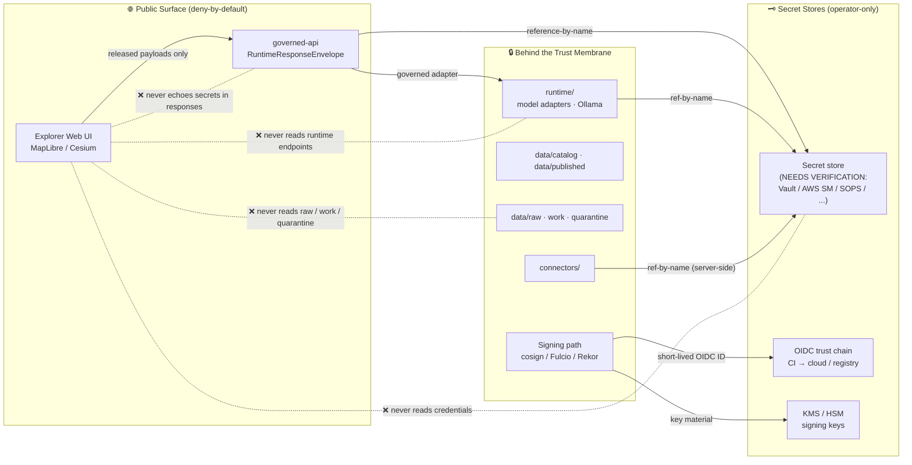

<!-- [KFM_META_BLOCK_V2]
doc_id: kfm://doc/security-secrets
title: Secrets Management
type: standard
version: v0.1
status: draft
owners: Security steward; Infra steward; Docs steward (placeholder — confirm in CODEOWNERS)
created: 2026-05-13
updated: 2026-05-13
policy_label: public
related:
  - docs/doctrine/directory-rules.md
  - docs/doctrine/trust-membrane.md
  - docs/security/THREAT_MODEL.md
  - docs/security/INCIDENT_RESPONSE.md
  - docs/runbooks/SECRET_LEAK_RUNBOOK.md
  - docs/standards/SIGNING.md
  - infra/README.md
  - configs/README.md
tags: [kfm, security, secrets, governance, deny-by-default]
notes:
  - "Doctrine-level claims are CONFIRMED from attached KFM materials."
  - "Implementation specifics (secret store choice, rotation cadence, owner teams) are PROPOSED or NEEDS VERIFICATION until a repo is inspected."
  - "External-tool syntax (cosign, GitHub Actions OIDC) is described from KFM source materials, not from a live web check."
[/KFM_META_BLOCK_V2] -->

# 🔐 Secrets Management

> **How credentials, signing keys, and API tokens enter, live, rotate, and leave the Kansas Frontier Matrix (KFM) system — and why most of them must never appear in the repository at all.**


<!-- TODO: replace with real Shields.io endpoints once CI/coverage targets exist -->

| Field          | Value                                                                 |
| :------------- | :-------------------------------------------------------------------- |
| **Status**     | Draft — doctrine-level CONFIRMED; implementation NEEDS VERIFICATION   |
| **Owners**     | Security steward + Infra steward (placeholder — confirm in CODEOWNERS) |
| **Last updated** | 2026-05-13                                                          |
| **Authority**  | Sits below `docs/doctrine/*`; refines `infra/` and `configs/` rules   |

---

## 📑 Contents

- [1. Purpose](#1-purpose)
- [2. Scope & Authority](#2-scope--authority)
- [3. Definitions](#3-definitions)
- [4. Core Doctrine](#4-core-doctrine)
- [5. Trust Membrane for Secrets](#5-trust-membrane-for-secrets)
- [6. Secret Classes](#6-secret-classes)
- [7. Where Secrets May & May Not Live](#7-where-secrets-may--may-not-live)
- [8. Lifecycle: Issuance, Rotation, Revocation, Audit](#8-lifecycle-issuance-rotation-revocation-audit)
- [9. CI/CD Secrets — OIDC-First](#9-cicd-secrets--oidc-first)
- [10. Signing Keys (Cosign / DSSE / Rekor)](#10-signing-keys-cosign--dsse--rekor)
- [11. Source Credentials & Connector API Keys](#11-source-credentials--connector-api-keys)
- [12. Browser & Client Boundary](#12-browser--client-boundary)
- [13. Telemetry, Logging, and Diagnostics](#13-telemetry-logging-and-diagnostics)
- [14. Leak Detection](#14-leak-detection)
- [15. Incident Response Hooks](#15-incident-response-hooks)
- [16. Verification & Audit](#16-verification--audit)
- [17. Open Questions (NEEDS VERIFICATION)](#17-open-questions-needs-verification)
- [18. Related Docs](#18-related-docs)
- [Appendix A — Pre-Commit Leak-Check Recipe (illustrative)](#appendix-a--pre-commit-leak-check-recipe-illustrative)
- [Appendix B — Incident Response Checklist (illustrative)](#appendix-b--incident-response-checklist-illustrative)

---

## 1. Purpose

KFM is a **governed, evidence-first, map-first** knowledge system. Most of what it publishes is traceable, citable, and inspectable — but the things that make the system trustworthy (signing keys, source API tokens, deployment credentials, model runtime keys) must remain **deliberately invisible** to public clients, public artifacts, the repository, and most operators.

This document records how KFM **enters, holds, rotates, and removes** those secrets, and how it keeps them out of the places they don't belong. It is the secrets-specific refinement of broader KFM doctrine: deny-by-default exposure, least privilege, and audit.

> [!IMPORTANT]
> Doctrine in this file is **CONFIRMED** from attached KFM materials. Specific tools, owners, paths, and cadences are **PROPOSED** or **NEEDS VERIFICATION** until verified against repository evidence. Treat every concrete name (`AWS Secrets Manager`, `Vault`, `kfm-bot`, `30 days`) as a reviewable placeholder.

[⬆ Back to top](#-secrets-management)

---

## 2. Scope & Authority

### 2.1 In scope

- All material that, if disclosed, would let an outside party act as KFM, falsify provenance, exfiltrate restricted data, or bypass policy gates. This includes: signing keys, attestation private keys, CI tokens, deployment credentials, third-party source API keys, model runtime keys, database passwords, object-store credentials, internal service handles, session signing secrets, and reverse-proxy auth material.
- Where those secrets may live in the repo (almost nowhere), in CI, in infra, on operator workstations, and on any exposed local deployment surface.
- How they are introduced, rotated, revoked, audited, and how a leak is handled.

### 2.2 Out of scope

- The **threat model** in full — that lives in [`docs/security/THREAT_MODEL.md`](./THREAT_MODEL.md) **(PROPOSED file)**.
- **Incident response** procedural detail — that lives in [`docs/security/INCIDENT_RESPONSE.md`](./INCIDENT_RESPONSE.md) and the operational runbook [`docs/runbooks/SECRET_LEAK_RUNBOOK.md`](../runbooks/SECRET_LEAK_RUNBOOK.md) **(PROPOSED files)**.
- **Signing standards** in detail — that lives in [`docs/standards/SIGNING.md`](../standards/SIGNING.md) **(PROPOSED file)**. This document references it but does not duplicate it.

### 2.3 Authority chain

This document inherits authority from, and must not contradict:

1. KFM core invariants (lifecycle law, trust membrane, deny-by-default).
2. `docs/doctrine/directory-rules.md` — placement rules for `configs/`, `infra/`, `runtime/`, `docs/security/`. **CONFIRMED.**
3. Accepted ADRs that touch secrets or signing.
4. Per-root READMEs (`configs/README.md`, `infra/README.md`, `runtime/README.md`).

If this document conflicts with any of those, this document is wrong and must be corrected.

[⬆ Back to top](#-secrets-management)

---

## 3. Definitions

| Term | Meaning |
| :--- | :--- |
| **Secret** | Any value whose disclosure would let an outside party impersonate KFM, falsify provenance, bypass policy, or read restricted data. |
| **Secret store** | An environment-specific, access-controlled, auditable system that holds secrets at rest. The repository is **not** a secret store. |
| **Reference-by-name** | A non-secret identifier (e.g., `${PURPLEAIR_API_KEY}`, `secrets.COSIGN_KEY`) that resolves to a real secret at runtime via a secret store or CI variable system. |
| **OIDC-minted credential** | A short-lived credential issued to a CI job by an OIDC trust chain (e.g., GitHub Actions → cloud provider), bound to repo, ref, job, and audience, with a short TTL. **CONFIRMED** as the preferred CI credential mode in KFM source materials. |
| **Keyless signing** | Cosign signing using an ephemeral Fulcio-issued certificate against an OIDC identity, with the signature anchored in the Rekor transparency log. **CONFIRMED** as the preferred KFM signing mode. |
| **Trust membrane** | The boundary that separates governed APIs and released artifacts (public-facing) from raw/work/quarantine stores, canonical stores, model runtimes, and **credentials** (internal-only). |

[⬆ Back to top](#-secrets-management)

---

## 4. Core Doctrine

The following statements are **CONFIRMED** from attached KFM materials. They are not negotiable inside KFM without an ADR and a security review.

1. **No real secrets in the repository — ever.** This applies even to material labeled "test" or "local". Templates and references-by-name are fine; real values are not. If a real secret lands in `configs/`, it is a **security incident**: rotate, audit, and write a runbook entry under `docs/runbooks/`.
2. **Deny by default at the exposure boundary.** Public UI, normal clients, and any externally reachable surface (reverse proxy, VPN, home firewall) must default to deny. Admin shortcuts must be justified, constrained, documented, and **kept out of the normal public path**.
3. **No browser access to credentials.** Browsers, public UI, MapLibre/Cesium clients, popups, exports, telemetry payloads, and AI response envelopes must not read, embed, log, or surface credentials, raw store handles, model runtime endpoints, or internal service handles.
4. **No secrets in catalog metadata or source-visible outputs.** API keys for upstream sources (e.g., third-party sensor networks) must be passed by header from server-side code and must never be emitted in STAC, DCAT, PROV records, tile metadata, or any public catalog artifact.
5. **CI uses short-lived, least-privilege OIDC credentials** bound to repository, ref, job, and audience — not long-lived broad PATs or shared API keys.
6. **Signing prefers keyless.** Cosign keyless (OIDC + Fulcio + Rekor) is the default. Keyed signing using a CI secret or HSM is **supported**; offline signing is **PROPOSED** and **NEEDS VERIFICATION** for KFM workflows.
7. **Telemetry is safe by construction.** No secrets, no prompt text, no raw evidence, no restricted geometry, and no full EvidenceBundle copies in telemetry payloads. Diagnostics may show schema/policy status; they must not leak credentials, prompts, or store handles.
8. **Local AI runtimes (Ollama and similar) sit behind the governed API.** They must not receive public client traffic and must not read canonical or raw stores directly. Their runtime keys are secrets and follow the same rules as every other secret.
9. **Every secret has a named owner, a rotation cadence, and a revocation path.** A secret without an owner is a leak-in-waiting.

> [!WARNING]
> The repository is **not** a secret store, a credential cache, a shared password file, or a "temporary" parking spot. The only things that may live next to code are: (a) references-by-name, (b) public keys / verifier material, (c) templates with placeholder values, (d) example fixtures that contain obvious mock markers.

[⬆ Back to top](#-secrets-management)

---

## 5. Trust Membrane for Secrets

The diagram below is **PROPOSED** — it reflects the doctrine in attached KFM materials but does not claim to mirror any specific runtime topology in the current repository. **NEEDS VERIFICATION** against `infra/` and deployment evidence once inspected.



**Read this diagram as a rule, not a topology:**

- Every solid arrow is allowed and observable.
- Every dotted line is a **denial path** that must be defended by infra (CORS, reverse proxy, network policy), code (no client-readable env vars), and policy tests.

[⬆ Back to top](#-secrets-management)

---

## 6. Secret Classes

KFM does not treat all secrets identically. The class determines store, rotation, and blast-radius. The table below is **PROPOSED** for review; cadences and stores are placeholders until owners confirm.

| Class | Examples | Typical store | Rotation cadence | Blast radius if leaked |
| :--- | :--- | :--- | :--- | :--- |
| **Signing keys** | Cosign signing key, HSM/KMS key reference | KMS / HSM (preferred); CI secret only when KMS unavailable | On schedule + on suspicion; key reference recorded in receipts | Forged attestations; loss of provenance trust |
| **CI-issued credentials** | OIDC-minted cloud tokens, ephemeral registry pushes | OIDC trust chain (no stored value) | Per-job (TTL minutes) | Job-scoped impersonation |
| **Source / connector API keys** | Third-party sensor networks, hosted geocoders, weather APIs | Secret store, server-side only | Per source policy; minimum quarterly (**PROPOSED**) | Source revocation; rate-limit lockout; attribution risk |
| **Deployment credentials** | Reverse-proxy auth, VPN material, infra automation tokens | Secret store + infra config plane | Per environment policy (**PROPOSED**) | Service compromise; lateral movement |
| **Database / store credentials** | Postgres / graph store / object store credentials | Secret store; injected at startup | On schedule + on personnel change | Direct read/write of canonical data |
| **Model runtime keys** | Hosted LLM API keys, local runtime tokens | Secret store; never on client | On schedule + on personnel change | AI surface impersonation; cost abuse; prompt leak |
| **Session / signing secrets (web)** | Session signing key, CSRF secrets | Secret store; injected at startup | On schedule + on incident | Session hijacking |

> [!NOTE]
> The list above is doctrinal. **Concrete store names, cadences, and owners are PROPOSED** until they appear in `infra/`, `configs/`, and an owner register (`control_plane/` or `CODEOWNERS`).

[⬆ Back to top](#-secrets-management)

---

## 7. Where Secrets May & May Not Live

The table below is **CONFIRMED at the doctrinal level** by `docs/doctrine/directory-rules.md` and the KFM "no real secrets in repo" rule. Implementation specifics remain **NEEDS VERIFICATION**.

| Location | May hold secrets? | May hold references-by-name? | Notes |
| :--- | :---: | :---: | :--- |
| `configs/dev/`, `configs/test/`, `configs/local/` | ❌ No | ✅ Yes | Real value here ⇒ **security incident**. Rotate + audit + runbook entry. |
| `configs/templates/`, `configs/examples/` | ❌ No | ✅ Yes (placeholders) | Placeholders must be obviously fake (e.g., `CHANGE_ME`, `__example__`). |
| `infra/` | ❌ No | ✅ Yes | Compose / k8s / reverse proxy may **reference** secrets, not contain them. |
| `runtime/` | ❌ No | ✅ Yes (via adapter config) | Model runtime keys are injected; never committed. |
| `apps/` source code | ❌ No | ✅ Yes (env var lookups) | Code reads `process.env.X` / `os.environ['X']` from runtime, not from disk in repo. |
| `tests/`, `fixtures/` | ⚠️ Only obvious mock markers | ✅ Yes | Mock keys MUST be unambiguous (e.g., `MOCK-COSIGN-DEV-ONLY`, never a real-looking value). |
| `.github/workflows/`, CI configs | ❌ No (secret bodies) | ✅ Yes (`${{ secrets.X }}`) | CI must use OIDC-minted credentials wherever the provider supports them. |
| Repo root, top-level dotfiles | ❌ Absolutely not | n/a | `.env`, `*.pem`, `*.key`, `id_rsa`, `cosign.key` are blocked at pre-commit and CI. |
| `data/raw`, `data/work`, `data/quarantine` | ❌ No (and not addressable from clients) | n/a | Lifecycle invariant. |
| Public artifacts (STAC, DCAT, PROV, tiles, exports) | ❌ Never | ❌ Never | Even reference-by-name strings must not leak into catalog metadata. |
| Telemetry / logs / dashboards | ❌ Never | ⚠️ Identifier-only, redact-aware | No secrets, prompts, raw evidence, or store handles. |
| Browser memory (any client) | ❌ Never | ❌ Never | The browser never reads a secret. Period. |

```text
ALLOWED-IN-REPO            FORBIDDEN-IN-REPO
─────────────────          ─────────────────
public keys / certs        private keys
verifier material          .env values
SPDX license text          API keys (any environment)
reference-by-name strings  passwords / passphrases
obvious mock fixtures      cosign signing keys
templates with placeholders bearer tokens / PATs
README guidance            session secrets
                           dump files containing any of the above
```

[⬆ Back to top](#-secrets-management)

---

## 8. Lifecycle: Issuance, Rotation, Revocation, Audit

Every secret follows a **named lifecycle**. The states below are **PROPOSED** as a normative model; specific tools and cadences are **NEEDS VERIFICATION**.

```mermaid
stateDiagram-v2
  [*] --> Requested
  Requested --> Issued: owner approves; store records audit entry
  Issued --> Active: deployed via reference-by-name
  Active --> Rotated: scheduled rotation OR suspicion
  Rotated --> Active: new version live; old version overlap window
  Active --> Revoked: owner / incident / personnel change
  Revoked --> Audited: post-revocation review
  Audited --> [*]
  Active --> Compromised: leak detected
  Compromised --> Revoked: immediate, fail-closed
```



### 8.1 Issuance

- Secrets are **requested** through a named procedure (PROPOSED in `docs/runbooks/SECRET_REQUEST.md` — **NEEDS VERIFICATION** that this file exists or should be authored alongside this doc).
- Issuance is **logged** to an append-only audit ledger (PROPOSED) — at minimum: who, what class, scope, expiration, owner.
- The repository receives only a **reference-by-name** plus any required public verifier material.

### 8.2 Rotation

- Every secret class has a default cadence (see §6). Cadences below 90 days are preferred for high-blast-radius secrets.
- Rotations must **overlap** to avoid outage: the new version goes live before the old version is revoked.
- Rotation events are audited; signing-key rotations also update key references in any receipt/manifest schema fields that pin a key identity.

### 8.3 Revocation

- Revocation is **fail-closed**: the revoked secret stops being honored everywhere it is consumed.
- Revocation triggers: scheduled cadence reached, personnel change, suspected leak, confirmed leak, dependency CVE, vendor compromise.

### 8.4 Audit

- All issuance, rotation, and revocation events go to an append-only audit ledger.
- Audit retention duration is **NEEDS VERIFICATION** — KFM source materials list it among unverified operational facts.

[⬆ Back to top](#-secrets-management)

---

## 9. CI/CD Secrets — OIDC-First

KFM source materials state, **CONFIRMED**: *"CI tools need short-lived least-privilege OIDC credentials"* bound to repo, ref, job, and audience with short TTL; tool allowlists pin command, args, image, and digest; broad long-lived credentials in map/tile workflows are an anti-pattern.

### 9.1 Preferred mode

- CI jobs request a credential at runtime via OIDC trust chain to the target system (cloud provider, container registry, signing service).
- The credential is **short-TTL**, **scoped to the job**, and **never written to disk** or to logs.
- The OIDC subject claim is recorded in the receipt or job log, so receipts can be traced to the exact CI run.

### 9.2 Acceptable fallback

When a target system does not yet support OIDC federation, a long-lived credential **may** be stored in the CI secret system, subject to:

| Requirement | Doctrine |
| :--- | :--- |
| Least privilege | Scoped to the smallest action set that completes the job. |
| Short rotation | At minimum quarterly (**PROPOSED**); shorter where supported. |
| Audited | Issuance and rotation recorded. |
| Documented | Listed in a deprecation register with a target migration date. |

### 9.3 Forbidden CI patterns

- Echoing a secret into a log (`echo "$SECRET"`, `set -x` with secret env vars, `printenv` dumps).
- Writing a secret to a workspace file that is later uploaded as an artifact.
- Passing a secret on a command line where it appears in process listings.
- Sharing a secret across unrelated jobs because "it's easier."
- Using a long-lived PAT where OIDC federation is available.

> [!CAUTION]
> Job logs are evidence. If a job log contains a secret, the job log is a leak. Pre-commit and CI must scan logs and artifacts for high-entropy strings and known token formats; matches block promotion.

[⬆ Back to top](#-secrets-management)

---

## 10. Signing Keys (Cosign / DSSE / Rekor)

Signing keys are the **highest-blast-radius secrets** in KFM because they back attestations that the rest of the system treats as evidence.

### 10.1 Preferred: keyless

**CONFIRMED** from KFM source materials:

- Cosign **keyless** (OIDC + Fulcio + Rekor) is the default signing mode.
- Receipts and the artifacts they describe are signed; the bundle digest is recorded inside the receipt.
- When keyless is used, transparency-log inclusion (Rekor) SHOULD be enabled, the Rekor index SHOULD be persisted, and the inclusion proof SHOULD be archived.

### 10.2 Supported: keyed

When offline operation or sovereignty constraints require it:

- The key lives in a KMS or HSM (preferred) or, as a last resort, a CI secret.
- The key reference (not the key value) is recorded next to the receipt and in the signing decision log.
- Rotation overlap follows §8.2.

### 10.3 PROPOSED: offline signing

- Offline signing is listed in KFM materials with status `NEEDS_VERIFICATION`. Until a documented offline procedure exists, treat offline signing as **out of scope** for production signing.

### 10.4 Verification side

- Verifier material (public keys, Fulcio root, Rekor public key) is **public** and may live in the repository under a clearly named directory (PROPOSED: `attest/` per KFM source materials).
- Verification is **fail-closed**: missing or unverifiable signatures, spec-hash mismatch, missing Rekor proof, or unresolved evidence references each force `target_zone = QUARANTINE` and block promotion.

For the full signing standard, see [`docs/standards/SIGNING.md`](../standards/SIGNING.md) **(PROPOSED file)**.

[⬆ Back to top](#-secrets-management)

---

## 11. Source Credentials & Connector API Keys

KFM connectors fetch from upstream sources, many of which require API keys. The doctrine here is **CONFIRMED** from KFM source materials (the PurpleAir-class example):

1. **API keys are passed by header from server-side connector code.** Never embedded in URLs that may be logged. Never embedded in any client-bound payload.
2. **API keys live in secrets / environment variables**, injected at connector runtime. They are **never** committed to the repository.
3. **API keys never appear in STAC, DCAT, PROV records, tile metadata, or any catalog artifact.** Leaking a key through catalog metadata is a tracked anti-pattern.
4. **Per-source rotation** follows the source's policy, with a minimum quarterly default (**PROPOSED**).
5. **Per-source provenance**: each connector run captures the source URL, ETag/Last-Modified, content length, retrieval time, and license posture — but **never** the key value.

> [!TIP]
> When in doubt about whether a field is safe to include in catalog metadata, ask: "If this field is published, would the source provider be unhappy?" If yes, it is a secret or it is sensitive. Either way, it does not belong there.

[⬆ Back to top](#-secrets-management)

---

## 12. Browser & Client Boundary

**CONFIRMED** doctrine: the browser is on the wrong side of the trust membrane for any secret material.

- The Explorer Web UI, MapLibre adapter, Cesium adapter, popups, exports, and AI response envelopes must not read, embed, log, or surface:
  - credentials, raw store handles, model runtime endpoints, vector index handles, internal service handles, unpublished candidates, restricted geometry, or anything in `data/raw`, `data/work`, `data/quarantine`.
- The governed API is the **only** sanctioned path for client-facing data; even there, it must return finite outcomes (ANSWER, ABSTAIN, DENY, ERROR) and **never** echo a secret into a response.
- Client-side environment variables are **not** secret storage. Anything baked into a public JS bundle is public.
- AI Focus Mode payloads must use server-side `EvidenceBundle` resolution and citation validation; they must not pass model runtime keys, prompt text, or store handles through the client.

[⬆ Back to top](#-secrets-management)

---

## 13. Telemetry, Logging, and Diagnostics

**CONFIRMED**: KFM telemetry is "safe by construction" — no raw evidence, no prompt text, no restricted geometry, no secrets, no full EvidenceBundle copies.

### 13.1 What telemetry MAY carry

- Anonymous error class, latency, schema validation status, policy decision status (allow / deny / abstain / error), correction state references (by ID), release state references (by ID).

### 13.2 What telemetry MUST NOT carry

- Secret values; bearer tokens; API keys; signing keys; raw evidence; prompt text; restricted geometry; user-identifiable detail beyond what is necessary for the action; full EvidenceBundle copies; internal service handles; raw store URIs.

### 13.3 Logging rules

- Server logs may include opaque correlation IDs and policy/decision IDs.
- Server logs must **redact** secret-shaped substrings at the logger layer, not at the call site.
- Diagnostics endpoints may expose schema and policy status. They must not expose credentials, prompts, store handles, or restricted internal state.
- Crash dumps and stack traces are treated as logs: scrubbed before they leave the host.

[⬆ Back to top](#-secrets-management)

---

## 14. Leak Detection

The repository, CI, and any host that handles secrets must run **defense in depth**:

| Layer | Mechanism (PROPOSED) | What it catches |
| :--- | :--- | :--- |
| Author | Pre-commit hooks (entropy scan, known-token regex) | Most accidental commits before they reach the remote |
| PR | CI secret scanning on every push | Anything the local hook missed; PR-time block |
| Repo hosting | Provider-side secret scanning | Tokens with vendor-recognized formats; partner-reported leaks |
| Artifact | Catalog metadata lint (no secret-shaped substrings in STAC/DCAT/PROV) | Leakage through public catalog records |
| Log | Logger-layer redaction of known token patterns | Secrets reaching logs at runtime |
| Telemetry | Schema-validated payloads with allowlisted fields | Secrets reaching telemetry (defense in depth even if log redaction holds) |

> [!IMPORTANT]
> Detection is necessary but not sufficient. A detected leak is still a leak — rotation, revocation, and audit follow regardless of whether the leak ever left the organization.

[⬆ Back to top](#-secrets-management)

---

## 15. Incident Response Hooks

This section is a **hooks-only summary**. Full procedural detail belongs in [`docs/security/INCIDENT_RESPONSE.md`](./INCIDENT_RESPONSE.md) and the leak runbook [`docs/runbooks/SECRET_LEAK_RUNBOOK.md`](../runbooks/SECRET_LEAK_RUNBOOK.md) **(PROPOSED files)**.

A confirmed or suspected leak triggers, in order:

1. **Revoke** the credential at the source of truth (KMS/HSM, secret store, OIDC issuer, vendor console).
2. **Rotate** any dependents to the new credential and verify that downstream services pick up the rotation.
3. **Audit** what the leaked credential could have done within its valid window: which jobs ran, which artifacts were signed, which sources were fetched, which receipts were produced.
4. **Quarantine** any artifact whose attestation chain depends on the leaked key during its valid window, pending re-signing under a new key.
5. **Correct** affected releases via a `CorrectionNotice` that lists invalidated derivatives, per KFM correction doctrine.
6. **Runbook entry** in `docs/runbooks/` describing what happened, what was done, and what changed.
7. **Post-incident review** at a cadence appropriate to severity.

> [!WARNING]
> A leak is not "fixed" by a force-push. Git history rewrites do not erase a credential from caches, mirrors, public archives, or the attacker's clipboard. **Rotate first; clean history second; document always.**

[⬆ Back to top](#-secrets-management)

---

## 16. Verification & Audit

The following items become testable as the repository is built out. They are **PROPOSED** until concrete tests, workflows, or policy bundles exist.

| Check | Where it lives (PROPOSED) | Expected outcome |
| :--- | :--- | :--- |
| No secret-shaped strings in committed files | Pre-commit + CI secret scanner | Fail closed on match |
| No secret-shaped strings in catalog metadata | `tests/catalog/` lint | Fail closed on match |
| `configs/` contains no high-entropy fields | `tests/configs/` lint | Fail closed on match |
| CI logs redact known token patterns | CI logger config | Logs show redaction markers, not values |
| Signing path uses OIDC keyless OR documented keyed fallback | Policy bundle in `policy/` | Deny otherwise |
| Receipts record key reference (not key value) | Receipt schema validation | Schema fails on bare key material |
| Build produces no environment dump artifacts | CI artifact lint | No `.env`, `printenv`, `env.json` in artifacts |
| Telemetry payloads validate against allowlisted-fields schema | Schema validation in client + server | Schema-invalid payloads dropped |
| Secret store audit ledger append-only | Infra config + periodic audit | No retroactive edits |

[⬆ Back to top](#-secrets-management)

---

## 17. Open Questions (NEEDS VERIFICATION)

KFM source materials explicitly mark several secrets-relevant operational facts as **NEEDS VERIFICATION**. They are reproduced here so they do not silently become doctrine.

- [ ] **Concrete secret store choice** (Vault / AWS Secrets Manager / SOPS / managed alternative) for production and for local development.
- [ ] **Signing key custody** — who holds the KMS/HSM key reference, who can rotate, who can revoke.
- [ ] **Source credential register** — which connectors require keys, where each key lives, who rotates each one.
- [ ] **SSO / role mapping** for operator access to the secret store.
- [ ] **Audit ledger retention duration** and storage class.
- [ ] **Backup / restore behavior** for the secret store, including disaster recovery.
- [ ] **Branch protections** that enforce required checks on PRs touching `infra/`, `configs/`, `runtime/`, or `.github/workflows/`.
- [ ] **Reverse-proxy auth, CORS, rate-limit, and log retention** posture on any externally exposed deployment.
- [ ] **Pre-commit hook installation policy** — is it advisory, enforced by CI, or both?
- [ ] **Verifier material location** — confirm `attest/` (or equivalent) and document expected files.

[⬆ Back to top](#-secrets-management)

---

## 18. Related Docs

> [!NOTE]
> Items marked **(PROPOSED file)** are referenced for completeness but may not yet exist in the repository. Confirm presence and link target before relying on them.

- [`docs/doctrine/directory-rules.md`](../doctrine/directory-rules.md) — placement rules for `configs/`, `infra/`, `runtime/`, `docs/security/`. **CONFIRMED.**
- [`docs/doctrine/trust-membrane.md`](../doctrine/trust-membrane.md) — public/internal exposure boundary doctrine. **(PROPOSED file).**
- [`docs/security/THREAT_MODEL.md`](./THREAT_MODEL.md) — adversary model and assumptions. **(PROPOSED file).**
- [`docs/security/INCIDENT_RESPONSE.md`](./INCIDENT_RESPONSE.md) — full incident procedure. **(PROPOSED file).**
- [`docs/runbooks/SECRET_LEAK_RUNBOOK.md`](../runbooks/SECRET_LEAK_RUNBOOK.md) — operator step-by-step on confirmed leaks. **(PROPOSED file).**
- [`docs/runbooks/SECRET_ROTATION.md`](../runbooks/SECRET_ROTATION.md) — operator step-by-step on scheduled rotations. **(PROPOSED file).**
- [`docs/standards/SIGNING.md`](../standards/SIGNING.md) — Cosign / DSSE / Rekor standard. **(PROPOSED file).**
- [`infra/README.md`](../../infra/README.md) — deny-by-default exposure posture. **(PROPOSED file).**
- [`configs/README.md`](../../configs/README.md) — non-secret config defaults and templates. **(PROPOSED file).**
- [`runtime/README.md`](../../runtime/README.md) — adapters and harnesses behind the governed API. **(PROPOSED file).**

[⬆ Back to top](#-secrets-management)

---

## Appendix A — Pre-Commit Leak-Check Recipe (illustrative)

> [!IMPORTANT]
> The recipe below is **illustrative**, not prescriptive. Tool choice is **PROPOSED**. Adapt to the repository's actual toolchain after inspection.

<details>
<summary><strong>Illustrative pre-commit secret-scan configuration</strong></summary>

```yaml
# .pre-commit-config.yaml  (illustrative)
# Status: PROPOSED — verify tool versions, hook IDs, and exclusion patterns
#         against the actual repo before adoption.
repos:
  - repo: https://github.com/gitleaks/gitleaks
    rev: vX.Y.Z   # NEEDS VERIFICATION — pin to a current release
    hooks:
      - id: gitleaks
        name: "gitleaks — block committed secrets"
        # Custom rules belong in .gitleaks.toml next to this config.

  - repo: local
    hooks:
      - id: block-env-files
        name: "Block .env and key files from being committed"
        entry: bash -c '
          if git diff --cached --name-only |
             grep -E "(^|/)(\.env(\..*)?$|.*\.(key|pem)$|^id_rsa$|^cosign\.key$)" ; then
            echo "❌ Refusing to commit secret-shaped files."
            exit 1
          fi'
        language: system
        pass_filenames: false
```

```text
# .gitignore additions (illustrative)
.env
.env.*
*.key
*.pem
id_rsa
id_rsa.pub
cosign.key
```

</details>

[⬆ Back to top](#-secrets-management)

---

## Appendix B — Incident Response Checklist (illustrative)

> [!CAUTION]
> This checklist is a **starting point**. The authoritative procedure belongs in `docs/security/INCIDENT_RESPONSE.md` and `docs/runbooks/SECRET_LEAK_RUNBOOK.md` **(PROPOSED files)**.

<details>
<summary><strong>Illustrative checklist — confirmed or suspected leak</strong></summary>

**T+0 (containment, minutes)**

- [ ] Identify the leaked credential class and the specific secret.
- [ ] Revoke at source of truth (KMS / HSM / secret store / OIDC issuer / vendor console).
- [ ] Confirm revocation propagated to all consumers.
- [ ] If a signing key was leaked, set the affected scope to `QUARANTINE` per KFM promotion doctrine.

**T+1 (rotation, hours)**

- [ ] Issue replacement secret(s).
- [ ] Deploy new references-by-name; verify dependents pick up the rotation.
- [ ] Re-sign any artifacts whose attestation chain depends on the leaked key (within their valid window).

**T+1 (audit, hours)**

- [ ] Enumerate all jobs, artifacts, sources, and receipts produced under the leaked credential's valid window.
- [ ] Flag suspicious activity for review.
- [ ] Preserve logs in append-only storage; do not edit history.

**T+1..N (correction, days)**

- [ ] Emit a `CorrectionNotice` listing invalidated derivatives (per KFM correction doctrine).
- [ ] Add a rollback target if any release must be reverted.
- [ ] Open a `docs/runbooks/` entry describing the incident, response, and changes.

**T+N (review)**

- [ ] Post-incident review.
- [ ] Update this document and adjacent docs if doctrine needs to change.
- [ ] Update tests, scanners, and policy gates to catch this class of leak earlier.

</details>

[⬆ Back to top](#-secrets-management)

---

> 🗂️ **Related docs:** [`directory-rules.md`](../doctrine/directory-rules.md) · [`THREAT_MODEL.md`](./THREAT_MODEL.md) · [`INCIDENT_RESPONSE.md`](./INCIDENT_RESPONSE.md) · [`SIGNING.md`](../standards/SIGNING.md)
>
> 📅 **Last updated:** 2026-05-13 · **Doc version:** v0.1 · **Status:** draft · **Owners:** Security steward + Infra steward (placeholder)
>
> ⬆ [Back to top](#-secrets-management)
