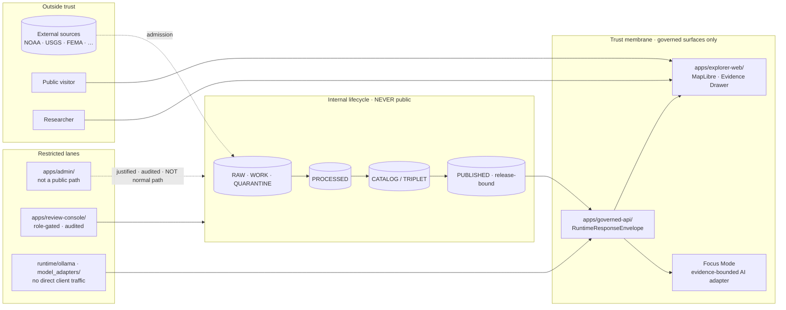
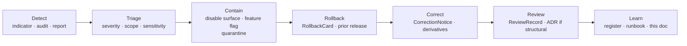

<!-- [KFM_META_BLOCK_V2]
doc_id: kfm://doc/security/threat-model
title: KFM Threat Model
type: standard
version: v0.1
status: draft
owners: docs-steward, security-steward (PROPOSED role assignments)
created: 2026-05-13
updated: 2026-05-13
policy_label: public (governance doctrine; describes posture, not exploits)
related:
  - docs/security/EXPOSURE_POSTURE.md
  - docs/security/INCIDENT_RESPONSE.md
  - docs/doctrine/directory-rules.md
  - docs/doctrine/trust-membrane.md
  - docs/doctrine/lifecycle-law.md
  - docs/doctrine/authority-ladder.md
  - docs/doctrine/truth-posture.md
  - docs/governance/separation-of-duties.md
  - docs/runbooks/
  - docs/adr/
tags: [kfm, security, threat-model, governance]
notes:
  - Path is PROPOSED until verified against mounted-repo evidence.
  - Owners are placeholder role labels; assign before status moves to review.
  - This document is a reference view; EvidenceBundle remains authoritative.
[/KFM_META_BLOCK_V2] -->

# 🛡 KFM Threat Model

> The trust-relevant risks Kansas Frontier Matrix is built to refuse, the guardrails that refuse them, and the residual concerns still on the table.


**Status:** draft &nbsp;·&nbsp; **Owners:** docs-steward, security-steward *(PROPOSED — see [§14](#14-known-gaps-and-verification-backlog))* &nbsp;·&nbsp; **Last updated:** 2026-05-13

---

## Table of Contents

1. [Purpose and scope](#1-purpose-and-scope)
2. [Where this doc fits](#2-where-this-doc-fits)
3. [Threat-model frame](#3-threat-model-frame)
4. [Trust membrane and lifecycle](#4-trust-membrane-and-lifecycle)
5. [Master risk register](#5-master-risk-register)
6. [Trust-membrane anti-patterns](#6-trust-membrane-anti-patterns)
7. [Sensitive-data and inference threats](#7-sensitive-data-and-inference-threats)
8. [Governed-AI threats](#8-governed-ai-threats)
9. [Exposure and infrastructure threats](#9-exposure-and-infrastructure-threats)
10. [Forbidden behaviors per public surface](#10-forbidden-behaviors-per-public-surface)
11. [Separation of duties (release-relevant)](#11-separation-of-duties-release-relevant)
12. [Detection, telemetry, and health indicators](#12-detection-telemetry-and-health-indicators)
13. [Incident-response posture (summary)](#13-incident-response-posture-summary)
14. [Known gaps and verification backlog](#14-known-gaps-and-verification-backlog)
15. [Related docs](#15-related-docs)
16. [Appendix: Glossary and ADR backlog](#16-appendix-glossary-and-adr-backlog)

---

## 1. Purpose and scope

This document is the **threat-posture surface** of KFM doctrine. It names the risks a governed, evidence-first, map-first, time-aware spatial knowledge system must refuse, the guardrails KFM doctrine already encodes, and the residual concerns that remain open. It is a **planning view**, not a vulnerability catalog: severity is qualitative, and concrete exploitation detail is intentionally absent. *[CONFIRMED doctrinal posture.]* `[ENCY]` `[DIRRULES]` `[GAI]`

### What this doc *is*

- A consolidated reading of trust-relevant risks across data, evidence, sensitivity, AI, release, and exposure surfaces.
- A reviewable mapping from each risk family to the **CONFIRMED doctrinal guardrail** that addresses it and the **PROPOSED residual concern** that still needs work.
- A reference for stewards, reviewers, release authority, and developers when asking *“can this go public?”*

### What this doc is *not*

- It is **not** a vulnerability disclosure log. KFM keeps that posture in `docs/runbooks/` and a sibling `INCIDENT_RESPONSE.md` (PROPOSED — see [§2](#2-where-this-doc-fits)).
- It is **not** an exploitation guide. Specific attack chains, payloads, and reproduction steps belong in restricted-tier review artifacts, not in a public-class governance doc.
- It is **not** evidence. Like every Atlas, supplement, or master matrix, this document is a **reference view**; the canonical truth surfaces remain `EvidenceBundle`, source dossiers, and `schemas/contracts/v1/…`. `[ENCY]`

> [!IMPORTANT]
> Treating this document as evidence is itself a governance anti-pattern. If a release decision depends on a claim made here, resolve the underlying `EvidenceBundle` before acting. `[ENCY]` `[DIRRULES]`

[Back to top ↑](#table-of-contents)

---

## 2. Where this doc fits

`docs/security/` is the **threat model, exposure posture, and incident response** lane of the human-facing control plane. The lane has three sibling concerns; this document carries the first. *[CONFIRMED lane purpose from Directory Rules; PROPOSED filenames.]* `[DIRRULES]`

| Sibling | Concern | Status |
|---|---|---|
| `docs/security/THREAT_MODEL.md` *(this doc)* | What KFM is built to refuse, and the guardrails that refuse it. | **PROPOSED** — drafted here; exact filename not verified against mounted repo. |
| `docs/security/EXPOSURE_POSTURE.md` | Public/semi-public surface inventory; deny-by-default, secrets, and audit posture. | **PROPOSED — NEEDS VERIFICATION** that the path exists. |
| `docs/security/INCIDENT_RESPONSE.md` | Detection → triage → containment → rollback → correction loop for trust-relevant incidents. | **PROPOSED — NEEDS VERIFICATION** that the path exists. |

> [!NOTE]
> Per `directory-rules.md`, **the authority of any specific path quoted in this document is PROPOSED until verified against mounted-repo evidence.** This applies to every path on this page, including the sibling paths above. `[DIRRULES]`

### Upstream doctrine this doc inherits

- `docs/doctrine/trust-membrane.md` — the boundary that prevents raw / unreviewed / model-generated / internal state from becoming public truth. *[CONFIRMED concept; PROPOSED path.]* `[ENCY]` `[DIRRULES]`
- `docs/doctrine/lifecycle-law.md` — `RAW → WORK / QUARANTINE → PROCESSED → CATALOG / TRIPLET → PUBLISHED`. Promotion is a **governed state transition, not a file move.** *[CONFIRMED invariant; PROPOSED path.]* `[ENCY]` `[DIRRULES]`
- `docs/doctrine/authority-ladder.md` — the source-of-truth order for placement and release decisions. *[CONFIRMED concept; PROPOSED path.]* `[DIRRULES]`
- `docs/doctrine/truth-posture.md` — cite-or-abstain as the default truth posture; `ABSTAIN` is a finite outcome. *[CONFIRMED concept; PROPOSED path.]* `[ENCY]` `[GAI]`

### Downstream surfaces this doc constrains

- `apps/governed-api/` — the trust membrane in executable form; returns the `RuntimeResponseEnvelope` with finite outcomes (`ANSWER`, `ABSTAIN`, `DENY`, `ERROR`). *[CONFIRMED doctrinal role; PROPOSED app path.]* `[ENCY]` `[DIRRULES]`
- `apps/explorer-web/`, `apps/review-console/`, `apps/admin/` — the public, steward, and restricted client surfaces. *[PROPOSED app paths.]* `[DIRRULES]`
- `infra/` — deny-by-default, least privilege, no direct model endpoint exposure, no raw data exposure, audit logs. *[CONFIRMED doctrinal posture; PROPOSED implementation.]* `[DIRRULES]` `[UNIFIED]`
- `runtime/` — local AI runtimes (Ollama, etc.) MUST stay behind the governed API and remain subordinate to evidence, policy, review, and release state. *[CONFIRMED doctrinal posture.]* `[DIRRULES]` `[UIAI]` `[GAI]`

[Back to top ↑](#table-of-contents)

---

## 3. Threat-model frame

### 3.1 Assets KFM is built to protect

| Asset | Why it matters | Citation |
|---|---|---|
| **Source integrity** — `SourceDescriptor`, source role, rights, sensitivity. | If a source’s role (observation / model / context / authority) collapses, downstream releases inherit a false truth posture. | `[ENCY]` |
| **Evidence chain** — `EvidenceRef` → `EvidenceBundle`. | Public claims that resolve to nothing break the cite-or-abstain rule. | `[ENCY]` `[GAI]` |
| **Promotion gates** — `RAW → WORK / QUARANTINE → PROCESSED → CATALOG / TRIPLET → PUBLISHED`. | A bypassed gate makes the trust membrane decorative. | `[ENCY]` `[DIRRULES]` |
| **Sensitivity tiers** — T0 Open · T1 Generalized · T2 Reviewer · T3 Restricted · T4 Denied. | A leaked T4 coordinate or T3 dataset is not recoverable by rollback alone. | `[ENCY]` *(tier scheme PROPOSED — ADR-S-05)* |
| **Release manifest and rollback target** — `ReleaseManifest`, `CorrectionNotice`, `RollbackCard`. | A release with no rollback target cannot be safely withdrawn. | `[ENCY]` `[DIRRULES]` |
| **AI surface boundary** — `AIReceipt`, Focus Mode templates, citation validation. | An uncited or admin-shortcut AI path turns generation into authority. | `[GAI]` `[UIAI]` |
| **Audit trail** — Run, Transform, Validation, Redaction, Aggregation, Review, AI receipts. | If receipts can be silently rewritten, every other guardrail becomes unverifiable. | `[ENCY]` `[UNIFIED]` |

### 3.2 Trust boundaries

KFM has four boundaries that matter for this document. Each is enforced by one or more guardrails; each has a residual concern.



*Diagram intent: every solid arrow that enters the membrane is a governed boundary; every dashed arrow is a restricted path that **must not** become the normal public path. The diagram is **CONFIRMED in shape** against KFM doctrine; the **exact app paths are PROPOSED** until repo verification.* `[ENCY]` `[DIRRULES]` `[MAP-MASTER]` `[GAI]`

### 3.3 Actors and capabilities (summary)

The full actor matrix lives in the encyclopedia’s `Master Action Matrix`; this section summarizes only what is threat-relevant. `[ENCY]`

| Actor | Allowed actions | Capability that creates risk |
|---|---|---|
| Public visitor | Browse public map, search, inspect Evidence Drawer, view stories, download public-safe exports. | Side-channel inference via labels, popups, AI text, screenshots, cross-lane joins. |
| Researcher | Advanced search, compare sources, export public/research datasets. | Cross-lane joins; export retention; downstream republication outside KFM. |
| Steward / reviewer | Restricted review, redaction approval, correction handling. | Author-as-approver collapse on sensitive lanes; review-state shortcuts. |
| Release authority | Issues `ReleaseManifest`; authorizes `PUBLISHED` transitions. | Release without rollback target; release without separation of duties. |
| Source connector | Fetches source under approved descriptor; emits receipts. | Fetching unknown-rights data into a public path. |
| AI assistant | Summarizes released `EvidenceBundle`; drafts; suggests validators. | Uncited claims; direct model endpoint; policy override; admin-shortcut routing. |
| Operator / admin | Restricted infra and runtime management. | Admin shortcut becoming a normal public route; secret leakage; audit gap. |

### 3.4 Out of scope

This document is **not** scoped to:

- Specific package CVEs, dependency licenses, host hardening, model runtime settings, reverse-proxy rules, branch protections, signing-key custody, storage-bucket policy, source credentials, SSO / role mapping, audit retention, or backup / restore behavior. These are **NEEDS VERIFICATION** operational facts and belong in `EXPOSURE_POSTURE.md` and `docs/runbooks/` once those exist. `[UNIFIED]`
- Life-safety, emergency-alert, or instruction-authority use cases. **KFM MUST NOT be used as an alert / instruction authority**; that boundary holds at T4 forever. `[DOM-HAZ]` `[ENCY]`
- Threat modeling of *external* systems KFM cites. KFM evaluates source role, rights, sensitivity, and freshness; it does not assume responsibility for upstream-system security.

[Back to top ↑](#table-of-contents)

---

## 4. Trust membrane and lifecycle

The trust membrane is the operational form of the cite-or-abstain rule: **public clients and normal UI surfaces use governed interfaces, not canonical / internal stores.** `[ENCY]` `[DIRRULES]`

### 4.1 Lifecycle invariant (CONFIRMED doctrine)

```text
RAW  →  WORK / QUARANTINE  →  PROCESSED  →  CATALOG / TRIPLET  →  PUBLISHED
```

- **Promotion is a governed state transition, not a file move.** `[ENCY]` `[DIRRULES]`
- Public surfaces consume only `PUBLISHED` artifacts via the governed API, with finite outcomes (`ANSWER`, `ABSTAIN`, `DENY`, `ERROR`). `[ENCY]`
- Workers and watchers emit receipts and candidate decisions; they **never** publish or rewrite catalog. *(Watcher-as-non-publisher.)* `[DIRRULES]`

### 4.2 Promotion gates (failure-closed)

Each gate fails closed if its required artifact is missing. `[ENCY]` `[DIRRULES]`

| Gate (transition) | Required artifact (PROPOSED minimum) | Failure-closed outcome |
|---|---|---|
| Admission (→ RAW) | `SourceDescriptor` (role, authority, rights, sensitivity, cadence); payload hash. | Candidate awaits steward. |
| Normalization (RAW → WORK / QUARANTINE) | `TransformReceipt`; `ValidationReport`; `PolicyDecision`. | Quarantine with reason. |
| Validation (WORK → PROCESSED) | `ValidationReport` PASS; `RedactionReceipt` if sensitivity applies; `AggregationReceipt` if applies. | Stay in WORK; structured FAIL. |
| Catalog closure (PROCESSED → CATALOG / TRIPLET) | `CatalogMatrix` entry; `EvidenceBundle`; graph / triplet projections if applicable. | HOLD at PROCESSED; no public edge. |
| Release (CATALOG / TRIPLET → PUBLISHED) | `ReleaseManifest`; rollback target; correction path; `ReviewRecord` if required. | HOLD at CATALOG; no public-surface change. |
| Correction (PUBLISHED → PUBLISHED′) | `CorrectionNotice`; derivative-invalidation list; `RollbackCard` if needed. | No silent mutation of prior release. |

[Back to top ↑](#table-of-contents)

---

## 5. Master risk register

> [!IMPORTANT]
> This register is **PROPOSED** as a planning view. Severity is qualitative. The full per-domain risk decomposition lives in the encyclopedia’s per-domain `M. Risks and mitigations` sections and in Domains Atlas v1.1 §24.10. The table below is a consolidated reading; it does not replace per-domain authority. `[ENCY]` `[DIRRULES]` `[GAI]`

| Risk family | Specific risk | Severity | Existing guardrail · CONFIRMED doctrine | Residual concern · PROPOSED |
|---|---|:--:|---|---|
| Source integrity | Source role mislabeled at admission (e.g., model output ingested as observation). | High | `SourceDescriptor.role`; validator rejecting role inconsistency; Source-Role Anti-Collapse Register. | Validator coverage may not include every role-pair; periodic audit needed. |
| Source integrity | Source rights / sovereignty status changes without re-evaluation. | High | Stale-state markers; source freshness cadence; review-aged-out tolerance. | Rights-change detection across third-party sources is not automated. |
| Evidence chain | `EvidenceRef` fails to resolve at runtime; public surface still renders. | High | Cite-or-abstain rule; governed API; `ABSTAIN` as a finite outcome. | Public-surface caching could mask resolution failure; audit needed. |
| Promotion | Promotion skipped or short-circuited (admin path used as public path). | High | Trust membrane forbids public access to RAW / WORK; admin shortcuts must be justified, constrained, audited. | Local-runtime admin endpoints can drift; deny-by-default infra and audit. |
| Sensitivity | Sensitive coordinates leaked via tile / vector / 3D / screenshot / export. | High | Tier scheme (T0–T4); `RedactionReceipt`; sensitive-lane fail-closed; 3D admission gate. | Side-channel leaks via labels, popups, AI text; cross-surface lint needed. |
| Sensitivity | Living-person data exposed via inference (e.g., aggregate + context join). | High | `AggregationReceipt`; minimum-cell suppression; person-parcel join denial. | Inference risk grows with cross-lane joins; periodic threat modeling of joins. |
| AI governance | AI emits uncited or weakly cited language. | High | `AIReceipt`; `ABSTAIN` / `DENY` outcomes; AI surface steward audit; Focus Mode templates. | Template drift; out-of-distribution prompts; mandatory `AIReceipt` sampling. |
| AI governance | AI presents synthetic content as observed reality. | High | Reality Boundary Note; Representation Receipt; deny-by-default 3D admission. | Cross-surface lint for label / popup / AI-text drift. |
| AI governance | AI generation routed through admin shortcut. | High | Trust-membrane audit; infra deny-by-default. | Admin-path drift; periodic audit needed. |
| Release | Release without `ReleaseManifest` or rollback target. | High | Release queue; release-authority role; rollback drill cadence. | Drill cadence not yet codified. |
| Release | Correction re-published without invalidating downstream derivatives. | Medium | `CorrectionNotice` must list invalidated derivatives; `RollbackCard` if needed. | Cross-derivative graph completeness depends on graph coverage. |
| Authority drift | Atlas / matrix summary treated as evidence. | Medium | Atlas, supplements, and master matrices are reference views; `EvidenceBundle` remains authoritative. | Reader-convenience risk; addressed by repeated callouts. |
| Authority drift | Documenting a change instead of validating it. | Medium | Docs are part of the working system but never substitute for validators, fixtures, schema. | Schema / fixture / validator coverage NEEDS VERIFICATION. |
| Out-of-scope use | KFM used as life-safety / alert / instruction authority. | Critical | Hazards / Air / Hydrology surfaces deny this at T4 forever. | Public messaging must repeat this in product copy; runbook not yet drafted. |

[Back to top ↑](#table-of-contents)

---

## 6. Trust-membrane anti-patterns

These are the operational anti-patterns the trust membrane is specifically designed to deny. *[CONFIRMED doctrine; PROPOSED enforcement maturity.]* `[ENCY]` `[DIRRULES]` `[GAI]`

| Anti-pattern | What goes wrong | DENY surface |
|---|---|---|
| Public client reads `RAW` / `WORK` / `QUARANTINE`. | Trust membrane bypassed; promotion gates skipped. | Governed API; layer manifest resolver. |
| Map shell consumes canonical / internal store directly. | Renderer becomes the public surface and inherits no governance. | MapLibre shell wiring; layer registry. |
| AI returns uncited language. | Generated text substitutes for evidence; cite-or-abstain rule broken. | Focus Mode; AI surface steward. |
| AI answers from `RAW` / `WORK` rather than `EvidenceBundle`. | AI becomes its own truth source. | Governed AI runtime; `AIReceipt` evaluator. |
| Sensitive content released without redaction. | `RedactionReceipt` missing; rights / sovereignty violation. | Release queue; sensitivity reviewer. |
| Aggregate cited as per-place observation. | Source-role collapse; matrix-cell semantics violated. | Validator; Focus Mode citation evaluator. |
| Synthetic surface presented without Reality Boundary Note. | Reconstruction read as observation. | Scene admission gate; representation-receipt validator. |
| Release without `ReleaseManifest` or rollback target. | Public surface cannot be rolled back; release not auditable. | Release queue; release authority. |
| AI generation routed through admin shortcut. | Admin bypass becomes a normal-path public route. | Trust-membrane audit; infra. |
| KFM used as alert / instruction authority. | Out-of-scope use of governed evidence as life-safety guidance. | Hazards / Air / Hydrology surfaces. |

### 6.1 Governance-process anti-patterns

| Anti-pattern | Counter-rule |
|---|---|
| Documenting a change instead of validating it. | Docs are part of the working system but never substitute for validators, fixtures, or schema. `[DIRRULES]` |
| Approving one’s own release on a sensitive lane. | Separation-of-duties matrix; release authority distinct from author. `[ENCY]` |
| Treating an Atlas summary or matrix as evidence. | Atlas, supplements, and master matrices are reference views; `EvidenceBundle` remains authoritative. `[ENCY]` |
| Silent migrations between schema or policy homes. | ADR required (Directory Rules §2.4); migration plan; supersession entry. `[DIRRULES]` |
| Promotion that “upgrades” a source role (e.g., modeled → observed). | Source role is fixed at admission; never upgraded by promotion. `[ENCY]` |
| Re-publishing a corrected claim without invalidating derivatives. | `CorrectionNotice` must list invalidated derivatives; `RollbackCard` if needed. `[ENCY]` `[DIRRULES]` |

[Back to top ↑](#table-of-contents)

---

## 7. Sensitive-data and inference threats

### 7.1 Sensitivity tier scheme (PROPOSED — ADR-S-05)

The tier scheme makes “publish at tier N” a reviewable, repeatable action across domains. `[ENCY]`

| Tier | Name | Definition (PROPOSED) | Default audience |
|:--:|---|---|---|
| **T0** | Open | Public-safe with no transforms required. | Any public client via governed API. |
| **T1** | Generalized | Public-safe **only after** generalization / fuzzing / aggregation / redaction; transform reviewed and recorded. | Any public client via governed API. |
| **T2** | Reviewer | Released to authenticated reviewers / domain stewards; policy-bounded; correction path active. | Stewards, reviewers, named research collaborators. |
| **T3** | Restricted | Released **only** under named agreement (rights / sovereignty / consent) and recorded. | Named authorized parties only. |
| **T4** | Denied | Not released to any audience; existence may be acknowledged only as steward review permits. | — |

### 7.2 Default-deny defaults (extends encyclopedia §20.5)

A non-exhaustive selection of object classes that default to **T4** unless transformed and reviewed. `[ENCY]` `[DOM-ARCH]` `[DOM-FAUNA]` `[DOM-FLORA]` `[DOM-PEOPLE]` `[DOM-SETTLE]` `[DOM-HAZ]`

| Domain / object class | Default tier | Allowed transforms (PROPOSED) | Required gates |
|---|:--:|---|---|
| Archaeology — site location | T4 | Steward + cultural review + generalized geometry → T2 or T1. | `RedactionReceipt` + `ReviewRecord` + `PolicyDecision`. |
| Archaeology — human remains / sacred sites | T4 | No transform releases this to T0; T3 only under explicit named authorization. | Sovereignty review + `ReviewRecord` + `PolicyDecision`. |
| Fauna — sensitive occurrence | T4 | Geoprivacy generalization + `RedactionReceipt` → T1. | `RedactionReceipt` + `ReviewRecord` + `PolicyDecision`. |
| Flora — rare or culturally sensitive plant location | T4 | Generalized geometry + steward review → T2 or T1. | `RedactionReceipt` + `ReviewRecord`. |
| People / DNA — living-person fields | T4 | Aggregation by tract or county + `AggregationReceipt` → T1. | Consent or aggregation gate + `ReviewRecord`. |
| People / DNA — raw DNA segment data | T4 | No transform releases this to a public tier; T3 only under explicit research agreement. | Named consent + `ReviewRecord` + `PolicyDecision`. |
| People / Land — private person–parcel join | T4 | Generalized parcel + de-identified person → T2 only. | `RedactionReceipt` + `ReviewRecord`. |
| Infrastructure — critical asset detail | T4 | Generalized facility footprint + suppressed dependency → T1. | Steward review + `RedactionReceipt`. |
| Hazards — KFM as alert authority | **T4 forever** | No transform permits KFM to act as an emergency-alert authority. | Policy boundary; deny at runtime. |
| Governed AI — RAW / WORK access via AI surface | T4 | AI never reads RAW or WORK; only released `EvidenceBundle`. | `PolicyDecision` + `AIReceipt`. |
| Planetary / 3D — sensitive scene content | T4 | Generalization / clipping / withholding; Reality Boundary Note + Representation Receipt → T1 or T2. | Steward review + `RedactionReceipt` + `RepresentationReceipt`. |

### 7.3 Inference threats specific to cross-lane joins

> [!WARNING]
> Cross-lane joins are **inference-risk multipliers**. A T0 aggregate joined to a T0 context layer can yield a T4-equivalent disclosure (e.g., living-person identification, sensitive-site location recovery). The tier of a join result is **not** the minimum of the input tiers; it must be evaluated as a new claim. ADR-S-14 (cross-lane join policy) remains open. `[DOM-PEOPLE]` `[ENCY]`

Common inference paths to refuse or gate:

- Aggregate demographic layer + parcel layer → living-person identification.
- Generalized rare-species range + habitat-suitability model → recovered occurrence geometry.
- Generalized archaeology footprint + soil / hydrology context → site re-localization.
- AI text summary repeating exact coordinates from an `EvidenceBundle` whose Drawer geometry was generalized.
- Screenshot or export of a generalized layer with a query-bar value that re-encodes the exact value.

[Back to top ↑](#table-of-contents)

---

## 8. Governed-AI threats

KFM’s AI surface (Focus Mode and adjacent) is **interpretive, not the root truth source.** `EvidenceBundle` outranks generated language. `[GAI]` `[UIAI]` `[ENCY]`

### 8.1 Threats specific to the AI surface

| Threat | Guardrail · CONFIRMED doctrine | Residual concern · PROPOSED |
|---|---|---|
| AI returns uncited / weakly cited language. | `AIReceipt`; cite-or-abstain rule; `ABSTAIN` / `DENY` as finite outcomes. | `AIReceipt` sampling cadence and out-of-distribution prompt handling NEEDS VERIFICATION. |
| AI answers from `RAW` / `WORK` rather than `EvidenceBundle`. | Governed AI runtime; AI never reads RAW / WORK; only released `EvidenceBundle`. | Adapter-boundary tests NEEDS VERIFICATION (no mounted runtime in this session). |
| AI presents synthetic content as observed reality. | Reality Boundary Note; Representation Receipt; deny-by-default 3D admission. | Cross-surface lint for label / popup / AI-text drift PROPOSED. |
| AI generation routed through an admin shortcut. | Trust-membrane audit; infra deny-by-default; no-public-admin-shortcut rule. | Periodic audit of admin endpoints PROPOSED. |
| Direct browser → model client call (no governed API). | Adapter-first runtime; MockAdapter for deterministic tests; Ollama / OpenAI / provider adapters live behind the governed API. | Production model-runtime adapter and provider auth NEEDS VERIFICATION. |
| Prompt or context telemetry leaks restricted material. | No raw prompt telemetry; no source credentials in client; least-privilege adapters. | Telemetry posture NEEDS VERIFICATION; recorded as PROPOSED control. |
| Focus Mode template drift. | AI surface steward audit; template change governance. | Template-change ADR / review record NEEDS VERIFICATION. |

### 8.2 AI finite outcomes

The AI runtime returns the same finite outcomes as every governed surface. **Generated language is never a substitute for any of these outcomes.** `[GAI]` `[ENCY]`

| Outcome | Meaning | Forbidden behavior |
|---|---|---|
| `ANSWER` | A cite-supported response with `AIReceipt`. | Returning prose that does not resolve to an `EvidenceBundle`. |
| `ABSTAIN` | Evidence insufficient or out-of-scope. | Replacing `ABSTAIN` with a plausible-sounding completion. |
| `DENY` | Policy, rights, sensitivity, or release-state blocks the request. | Returning the denied content under a softened label. |
| `ERROR` | Adapter / validator / resolver failure. | Silently downgrading `ERROR` to `ANSWER`. |

[Back to top ↑](#table-of-contents)

---

## 9. Exposure and infrastructure threats

### 9.1 Exposure controls (PROPOSED)

For a local system exposed through a home firewall, reverse proxy, or VPN, the `infra/` root MUST be explicit about: **deny-by-default, least privilege, no direct model endpoint exposure, no raw data exposure, audit logs.** Admin shortcuts MUST be justified, constrained, documented, and kept out of the normal public path. `[DIRRULES]` `[UNIFIED]`

| Control | Posture | Status |
|---|---|---|
| Deny-by-default CORS and network posture | Public and normal client traffic terminates at `apps/governed-api/`; no direct read of canonical, raw, or internal stores. | **PROPOSED** |
| No direct model endpoint exposure | `runtime/ollama` and other adapters sit **behind** the governed API; no direct client traffic. | **CONFIRMED doctrine** / **PROPOSED** implementation |
| Least privilege | Role-aware policy checks; review-console separation from public client behavior. | **PROPOSED** |
| Secret isolation | `configs/` **MUST NOT** store real secrets — ever. Real secrets live in environment-specific secret stores referenced by name. | **CONFIRMED doctrine** `[DIRRULES]` |
| No browser access to source credentials | Source connectors run server-side; credentials never reach the client. | **PROPOSED** |
| Audit logs | `apps/admin/` and `apps/review-console/` actions audited; receipts emitted for policy-significant operations. | **PROPOSED** |
| Admin-shortcut posture | Justified, constrained, documented, audited. **Not the normal public path.** | **CONFIRMED doctrine** `[DIRRULES]` |

### 9.2 The secret-leakage incident class

A leaked real secret in `configs/` is **already** declared a security incident in doctrine, not a near miss. `[DIRRULES]`

> [!CAUTION]
> If a real secret lands in `configs/` — even for “test” or “local” — the doctrinal response is: **rotate the secret, audit access, and write a runbook entry in `docs/runbooks/`.** This is not optional and not a code-review preference. `[DIRRULES]`

### 9.3 NEEDS VERIFICATION operational facts

The following are explicitly **NEEDS VERIFICATION** in current KFM doctrine and are not established by the supplied corpus. They are listed here so reviewers know not to assume them: `[UNIFIED]`

- Package CVEs and dependency licenses.
- Host hardening posture.
- Model runtime settings (context length, sampling, system prompts).
- Reverse-proxy rules and TLS posture.
- Branch protections and required reviewers.
- Signing-key custody (cosign / DSSE / equivalent).
- Storage-bucket policy.
- Source credentials and rotation cadence.
- SSO / role-mapping topology.
- Audit retention windows.
- Backup / restore behavior.

These belong in `docs/security/EXPOSURE_POSTURE.md` and `docs/runbooks/` once verified. *[PROPOSED placement.]* `[DIRRULES]`

[Back to top ↑](#table-of-contents)

---

## 10. Forbidden behaviors per public surface

Each governed surface returns finite outcomes; each has a forbidden behavior the trust membrane is built to deny. `[ENCY]` `[DIRRULES]` `[MAP-MASTER]` `[GAI]`

| Surface | Outcomes returned | Forbidden behavior |
|---|---|---|
| Source summary resolver | `ANSWER` / `ABSTAIN` / `DENY` / `ERROR` | Returning raw source bytes; returning quarantined source as `ANSWER`. |
| Domain feature / detail lookup | `ANSWER` / `ABSTAIN` / `DENY` / `ERROR` | Returning an unreleased candidate as `ANSWER`; exposing internal-store identifiers. |
| Layer manifest resolver | `ANSWER` / `DENY` / `ERROR` | Returning a layer that lacks a `ReleaseManifest`; serving WORK or CATALOG layers to public clients. |
| Evidence Drawer payload | `ANSWER` / `ABSTAIN` / `DENY` / `ERROR` | Returning a payload that includes restricted geometry or uncited claim text. |
| Focus Mode (AI runtime) | `ANSWER` / `ABSTAIN` / `DENY` / `ERROR` | Generating uncited language as `ANSWER`; substituting model output for `EvidenceBundle`. |
| Review queue / steward console | `ALLOW` / `RESTRICT` / `DENY` / `HOLD` / `ERROR` | Mixing review and publication duties on the same actor when separation is required; bypassing logging. |
| Validator harness | `PASS` / `FAIL` / `ERROR` | Returning `PASS` without a `ValidationReport`; emitting `PASS` for non-deterministic inputs. |
| Release queue | `ALLOW` / `HOLD` / `DENY` / `ERROR` | Publishing without `ReleaseManifest`, rollback target, or correction path. |
| Correction / rollback | `ACCEPTED` / `HOLD` / `DENY` / `ERROR` | Accepting a correction without invalidating downstream derivatives; silent rollback without `RollbackCard`. |

[Back to top ↑](#table-of-contents)

---

## 11. Separation of duties (release-relevant)

Separation of duties is **maturity-dependent**: early-stage doctrine work may be authored and approved by the same actor when materiality is low; as maturity rises and the public-trust surface expands, separation must be enforced through tooling, not custom. `[ENCY]` `[DIRRULES]`

The release-relevant subset of the separation-of-duties matrix:

| Action | May the author also approve? | Required separation (PROPOSED) |
|---|---|---|
| Source admission (→ RAW) | Yes for routine; **No** when source has unresolved rights / sovereignty. | Source steward + rights-holder rep where applicable. |
| Promotion to PROCESSED / CATALOG | Yes for non-sensitive routine; **No** for sensitive lanes. | Domain steward + sensitivity reviewer (sensitive lanes). |
| Release to PUBLISHED | **No** when materiality applies. | Author ≠ release authority; rights-holder rep where applicable. |
| Sensitive-lane release | **No.** | Author + sensitivity reviewer + release authority + rights-holder rep. |
| Correction / rollback | **No** when correction is steward-significant. | Author / detector + correction reviewer + release authority. |
| AI surface change (template / policy binding) | **No.** | AI surface steward + docs steward (policy binding). |
| Atlas / supplement publication | **No.** | Docs steward + at least one subsystem owner. |

> [!NOTE]
> Atlas v1.1 §24.7 lists the full role roster (source steward, domain steward, sensitivity reviewer, rights-holder representative, release authority, correction reviewer, AI surface steward, docs steward). The full matrix should live in `docs/governance/separation-of-duties.md` once that path is verified. `[ENCY]` `[DIRRULES]`

[Back to top ↑](#table-of-contents)

---

## 12. Detection, telemetry, and health indicators

The **PROPOSED** governance-health indicators that surface threat-relevant drift. Instrumentation status is **NEEDS VERIFICATION**. `[ENCY]` `[DIRRULES]`

<details>
<summary><b>Source-integrity indicators</b></summary>

| Indicator | What it measures | Healthy posture (PROPOSED) |
|---|---|---|
| Source-role validator pass rate | % of admissions passing role-consistency checks. | 100% for sensitive lanes. |
| Review-aged-out incidence | Number of sensitive-lane claims past their review cadence. | Visibly tracked; trend not regressing. |
| Rights-change response time | Median time from rights-change detection to tier reassignment. | Within stated tolerance per source family. |
| Sensitive-content side-channel audit | Frequency of automated checks for label / popup / AI-text leaks. | Periodic; documented. |

</details>

<details>
<summary><b>AI-surface indicators</b></summary>

| Indicator | What it measures | Healthy posture (PROPOSED) |
|---|---|---|
| `AIReceipt` presence rate | % of Focus Mode answers with an `AIReceipt`. | 100%. |
| `ABSTAIN` rate by template | How often each Focus Mode template abstains. | Visibly tracked; very low `ABSTAIN` suggests over-fitting; very high suggests evidence gaps. |
| `DENY` reason distribution | Reason codes returned by Focus Mode denials. | Stable; large new-reason spikes investigated. |
| Synthetic-claim incidence | % of audited AI answers flagged for presenting synthetic content as observed. | Approaches zero; never silently. |

</details>

<details>
<summary><b>Documentation-and-drift indicators</b></summary>

| Indicator | What it measures | Healthy posture (PROPOSED) |
|---|---|---|
| ADR completeness | % of structural moves with an accepted ADR. | 100% for Directory Rules §2.4 cases. |
| Drift register size | Open entries in `docs/registers/DRIFT_REGISTER.md`. | Visibly tracked; aged entries investigated. |
| Per-root README presence | % of canonical roots with a current README declaring authority class. | 100%. |
| Atlas / supplement lineage clarity | Each Atlas / supplement carries a current supersession entry. | 100%. |

</details>

[Back to top ↑](#table-of-contents)

---

## 13. Incident-response posture (summary)

A full incident-response runbook is **out of scope** for this document and belongs in `docs/security/INCIDENT_RESPONSE.md` (PROPOSED — NEEDS VERIFICATION that the path exists) with operational specifics in `docs/runbooks/`. The summary posture is:



*Posture diagram: KFM treats incidents as governed transitions, not ad-hoc fixes. `RollbackCard` + `CorrectionNotice` are the durable artifacts. **[PROPOSED diagram; CONFIRMED upstream doctrine.]*** `[ENCY]` `[DIRRULES]`

### 13.1 Incident-class quick reference

| Incident class | First action | Required artifact |
|---|---|---|
| Secret in `configs/` (real, not template). | Rotate the secret; revoke leaked material. | Runbook entry in `docs/runbooks/`. |
| Sensitive coordinate leak (tile / vector / 3D / screenshot / export). | Disable the affected surface; raise to sensitivity reviewer. | `RedactionReceipt`; `RollbackCard` if released; `CorrectionNotice`. |
| `EvidenceRef`-resolution failure on a public surface. | Force the surface to `ABSTAIN`; audit cache. | `CorrectionNotice` if the surface served an unsupported claim. |
| Admin-shortcut traffic to a public route. | Disable the shortcut; audit affected requests. | ADR; trust-membrane audit entry. |
| Uncited AI answer detected in audit. | Pull the affected template; require AI-surface-steward review. | `AIReceipt` audit; template ADR if structural. |
| Release without rollback target detected post-publication. | Hold further release; build the rollback target retroactively. | `ReleaseManifest` amendment; `RollbackCard`. |

> [!WARNING]
> Specific exploitation steps, vulnerability identifiers, and reproduction details **do not belong in this public document.** They belong in restricted-tier review artifacts behind the trust membrane.

[Back to top ↑](#table-of-contents)

---

## 14. Known gaps and verification backlog

The following items are explicitly **PROPOSED** / **NEEDS VERIFICATION** in current doctrine. They are the items that, until resolved, prevent this document from being upgraded from *draft* to *review*. `[ENCY]` `[DIRRULES]` `[UNIFIED]`

| # | Item | What would settle it | Status |
|:--:|---|---|---|
| VB-TM-01 | Sibling docs `EXPOSURE_POSTURE.md` and `INCIDENT_RESPONSE.md` exist at `docs/security/`. | Mounted repo tree. | **NEEDS VERIFICATION** |
| VB-TM-02 | Sensitivity tier scheme (T0–T4) adopted as canonical (ADR-S-05). | ADR text + policy bundle. | **PROPOSED / NEEDS VERIFICATION** |
| VB-TM-03 | Cross-lane join policy ADR drafted (ADR-S-14). | ADR text. | **PROPOSED / NEEDS VERIFICATION** |
| VB-TM-04 | Reviewer separation-of-duties enforcement threshold (ADR-S-09). | ADR + tooling reference. | **PROPOSED / NEEDS VERIFICATION** |
| VB-TM-05 | AI surface boundary ADR (ADR-S-06). | ADR text + Focus Mode template policy. | **PROPOSED / NEEDS VERIFICATION** |
| VB-TM-06 | 3D admission policy ADR (ADR-S-07). | ADR text + admission gate. | **PROPOSED / NEEDS VERIFICATION** |
| VB-TM-07 | Drift register triage rule (ADR-S-13). | ADR text. | **PROPOSED / NEEDS VERIFICATION** |
| VB-TM-08 | Owner assignment for `docs/security/`. | Repo CODEOWNERS or doc steward roster. | **NEEDS VERIFICATION** |
| VB-TM-09 | Periodic threat-modeling cadence for cross-lane joins. | Steward note or governance schedule. | **PROPOSED** |
| VB-TM-10 | Side-channel lint (labels, popups, AI text, screenshots, exports) for sensitive lanes. | Test / fixture coverage. | **PROPOSED** |
| VB-TM-11 | Public-surface cache audit for `EvidenceRef`-resolution failures. | Operational telemetry posture. | **PROPOSED** |
| VB-TM-12 | Admin-endpoint drift audit. | Audit-log retention + review cadence. | **PROPOSED** |

[Back to top ↑](#table-of-contents)

---

## 15. Related docs

- [`docs/doctrine/directory-rules.md`](../doctrine/directory-rules.md) — placement law and conformance language. *(CONFIRMED authority of rules; PROPOSED authority of any specific quoted path.)*
- [`docs/doctrine/trust-membrane.md`](../doctrine/trust-membrane.md) — boundary doctrine. *(PROPOSED path; CONFIRMED concept.)*
- [`docs/doctrine/lifecycle-law.md`](../doctrine/lifecycle-law.md) — lifecycle invariant. *(PROPOSED path; CONFIRMED invariant.)*
- [`docs/doctrine/authority-ladder.md`](../doctrine/authority-ladder.md) — source-of-truth order. *(PROPOSED path; CONFIRMED concept.)*
- [`docs/doctrine/truth-posture.md`](../doctrine/truth-posture.md) — cite-or-abstain. *(PROPOSED path; CONFIRMED concept.)*
- [`docs/architecture/governed-api.md`](../architecture/governed-api.md) — operational form of the trust membrane. *(PROPOSED path.)*
- [`docs/architecture/contract-schema-policy-split.md`](../architecture/contract-schema-policy-split.md) — meaning / shape / policy split. *(PROPOSED path.)*
- [`docs/governance/separation-of-duties.md`](../governance/separation-of-duties.md) — full role and duty matrix. *(PROPOSED path.)*
- [`docs/registers/DRIFT_REGISTER.md`](../registers/DRIFT_REGISTER.md) — drift entries that may concern this document. *(PROPOSED path.)*
- [`docs/registers/VERIFICATION_BACKLOG.md`](../registers/VERIFICATION_BACKLOG.md) — repo-state verification queue. *(PROPOSED path.)*
- [`docs/adr/`](../adr/) — ADR index including the open ADRs cited above (ADR-S-05 … ADR-S-15). *(PROPOSED path.)*
- [`docs/runbooks/`](../runbooks/) — operational runbooks (rotation, rollback drills, validation runs). *(PROPOSED path.)*
- [`docs/security/EXPOSURE_POSTURE.md`](./EXPOSURE_POSTURE.md) — public/semi-public surface posture. *(PROPOSED — NEEDS VERIFICATION.)*
- [`docs/security/INCIDENT_RESPONSE.md`](./INCIDENT_RESPONSE.md) — detection → containment → rollback → correction loop. *(PROPOSED — NEEDS VERIFICATION.)*

[Back to top ↑](#table-of-contents)

---

## 16. Appendix: Glossary and ADR backlog

<details>
<summary><b>Glossary (placement-relevant subset)</b></summary>

| Term | Definition (short) |
|---|---|
| **Trust membrane** | The boundary that prevents raw / unreviewed / model-generated / internal state from becoming public truth. Operational form: `apps/governed-api/`. |
| **EvidenceBundle / EvidenceRef** | Resolved support package for claims; `EvidenceRef` resolves to `EvidenceBundle` via `packages/evidence-resolver/`. |
| **ReleaseManifest** | The release decision artifact; lives in `release/manifests/`. |
| **CorrectionNotice** | Public notice of a corrected claim; lives in `release/correction_notices/`. |
| **RollbackCard** | Rollback decision artifact; lives in `release/rollback_cards/`. |
| **RuntimeResponseEnvelope** | Finite-outcome wrapper (`ANSWER`, `ABSTAIN`, `DENY`, `ERROR`) returned by the governed API; schema in `schemas/contracts/v1/runtime/`. |
| **AIReceipt** | Per-answer audit artifact for the AI surface; binds answer to evidence, policy, and template state. |
| **RedactionReceipt / AggregationReceipt / RepresentationReceipt** | Transform receipts that gate sensitive-lane release and synthetic-surface release. |
| **Source role** | Fixed-at-admission tag (observation / model / context / authority / …); never upgraded by promotion. |
| **T0 … T4** | Sensitivity tiers: Open · Generalized · Reviewer · Restricted · Denied. *(PROPOSED — ADR-S-05.)* |
| **Watcher-as-non-publisher** | Pipeline workers emit receipts and candidate decisions; they never publish or rewrite catalog. |

*Full definitions live in `docs/doctrine/` and `contracts/`.* `[DIRRULES]`

</details>

<details>
<summary><b>Open ADR backlog touching this document</b></summary>

| ADR | Question / decision needed | Why it’s ADR-class |
|---|---|---|
| ADR-S-05 | Sensitivity tier scheme T0–T4 — adopt as canonical or revise. | Tier scheme directly governs public release. |
| ADR-S-06 | AI surface boundary: Focus Mode vs. open AI access (denied / bounded / steward-only). | AI access boundary is a trust-membrane question. |
| ADR-S-07 | 3D admission policy: minimum receipts, deny lanes, reality-boundary disclosure. | 3D scenes are higher-exposure. |
| ADR-S-09 | Reviewer role separation: when is separation enforced by tooling vs. custom. | Separation-of-duties affects release authority. |
| ADR-S-10 | Stale-state propagation rules across cross-lane edges. | Stale upstream propagation is a correction-path question. |
| ADR-S-13 | Drift-register triage: cadence, owner, outcome. | Drift register bridges repo state and doctrine. |
| ADR-S-14 | Cross-lane join policy: which joins require steward review, which are denied, which are open. | Cross-lane joins are inference-risk multipliers. |

*The full open-ADR backlog lives in `docs/adr/` (PROPOSED path) and is consolidated in Atlas v1.1 §24.12.* `[ENCY]` `[DIRRULES]`

</details>

<details>
<summary><b>Source short-name key</b></summary>

| Tag | Source |
|---|---|
| `[ENCY]` | KFM Domain & Capability Encyclopedia. |
| `[DIRRULES]` | Directory Rules. |
| `[GAI]` | Governed AI doctrine. |
| `[MAP-MASTER]` | Master MapLibre Components / Features. |
| `[UIAI]` | Whole-UI & Governed-AI Expansion Report. |
| `[UNIFIED]` | Unified Implementation Architecture & Build Manual. |
| `[DDD]` | Domain-Driven Design Reference. |
| `[DOM-*]` | Per-domain chapter (e.g., `[DOM-ARCH]`, `[DOM-PEOPLE]`, `[DOM-HAZ]`). |

</details>

[Back to top ↑](#table-of-contents)

---

> **Related** · [`directory-rules.md`](../doctrine/directory-rules.md) · [`trust-membrane.md`](../doctrine/trust-membrane.md) · [`lifecycle-law.md`](../doctrine/lifecycle-law.md) · [`EXPOSURE_POSTURE.md`](./EXPOSURE_POSTURE.md) *(PROPOSED)* · [`INCIDENT_RESPONSE.md`](./INCIDENT_RESPONSE.md) *(PROPOSED)*
>
> **Last updated** · 2026-05-13 · **Status** · draft · **Version** · v0.1
>
> [↑ Back to top](#table-of-contents)
