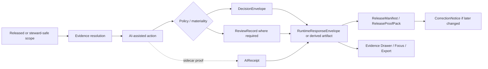

<!-- [KFM_META_BLOCK_V2]
doc_id: kfm://doc/PLACEHOLDER-AI-RECEIPTS-README
title: AI Receipts
type: standard
version: v1
status: draft
owners: @bartytime4life
created: YYYY-MM-DD
updated: YYYY-MM-DD
policy_label: public
related: [docs/security/README.md, docs/security/ai-supply-chain/README.md, docs/security/promotion-contract.md, apps/governed-api/README.md, schemas/contracts/v1/evidence/README.md, schemas/contracts/v1/runtime/README.md, policy/README.md, tests/contracts/README.md, tests/policy/README.md, .github/actions/README.md, .github/workflows/README.md]
tags: [kfm, security, ai, provenance, receipts]
notes: [Public-main path and owner are confirmed; doc_id and dates still NEED VERIFICATION; AIReceipt remains PROPOSED and no mounted schema or workflow enforcement is confirmed on current public main.]
[/KFM_META_BLOCK_V2] -->

# AI Receipts

Governed documentation for proposed `AIReceipt` objects that record AI participation without turning model output into authority.

> [!IMPORTANT]
> **Status:** experimental surface · document state `draft`  
> **Owners:** `@bartytime4life` *(current public `/docs/` fallback owner)*  
> 
> 
> 
> 
> 
>
> **Path:** `docs/security/ai-receipts/README.md`  
> **Repo fit:** child lane under [`../README.md`](../README.md), adjacent to [`../ai-supply-chain/README.md`](../ai-supply-chain/README.md) and [`../promotion-contract.md`](../promotion-contract.md), and downstream of governed API, schema, policy, and test surfaces.  
> **Quick jumps:** [Scope](#scope) · [Current public snapshot](#current-public-snapshot) · [Repo fit](#repo-fit) · [Accepted inputs](#accepted-inputs) · [Exclusions](#exclusions) · [Where AI receipts fit](#where-ai-receipts-fit) · [Contract-home options](#contract-home-options) · [Directory tree](#directory-tree) · [Flow](#flow) · [Minimal receipt shape](#minimal-receipt-shape) · [Gate model](#gate-model) · [Quickstart](#quickstart) · [Task list](#task-list) · [FAQ](#faq)

> [!WARNING]
> Current public `main` confirms this documentation lane exists. It does **not** confirm a mounted `AIReceipt` schema, fixture pack, policy bundle, local action, or workflow gate already enforcing AI-receipt behavior.

---

## Scope

This README defines the **documentation lane** for **AI receipts** in Kansas Frontier Matrix.

It covers four things:

1. when an AI receipt should exist,
2. what minimum fields it should carry,
3. how it should relate to adjacent proof objects,
4. where machine-checkable contract, fixture, policy, and reproducibility work should likely live.

This README does **not** claim that a live `AIReceipt` object family is already implemented in the current public repository.

### Working rule

An AI receipt is useful only if it strengthens all three of these questions for a reviewer:

1. **What happened?**
2. **What evidence, policy, and review state allowed it?**
3. **What stops it from becoming hidden authority?**

[Back to top](#ai-receipts)

---

## Current public snapshot

The current public repository gives a stronger picture than an earlier PDF-only reading, but it is still incomplete.

| Item | Current public posture | Status |
| --- | --- | --- |
| `docs/security/ai-receipts/README.md` | Present on public `main` | **CONFIRMED** |
| `docs/security/ai-receipts/` contents | `README.md` only | **CONFIRMED** |
| Adjacent AI/security docs | `ai-supply-chain`, `promotion-contract`, parent security docs are visible | **CONFIRMED** |
| Governed API doc surface | `apps/governed-api/README.md` exists and frames governed assistance as bounded to admissible released evidence | **CONFIRMED** |
| Policy lanes | `policy/`, `policy/fixtures/`, `policy/tests/` are visible | **CONFIRMED** |
| Test lanes | `tests/contracts/`, `tests/policy/`, `tests/reproducibility/` are visible | **CONFIRMED** |
| Schema lanes | `schemas/contracts/v1/` families are visible, but current public schema bodies are still placeholder-heavy | **CONFIRMED** |
| Local action lanes | `.github/actions/` exposes named placeholder lanes such as `opa-gate` and `provenance-guard` | **CONFIRMED** |
| Workflow YAML enforcement | `.github/workflows/` is still README-only on current public `main` | **CONFIRMED** |
| Mounted `AIReceipt` schema | No public `ai_receipt.schema.json` was directly confirmed | **UNKNOWN** |
| Mounted `AIReceipt` fixtures | No public valid/invalid AI-receipt fixture pair was directly confirmed | **UNKNOWN** |
| Mounted merge-blocking AI-receipt gate | No public workflow or action implementation was directly confirmed | **UNKNOWN** |

### Why that matters

This lane should now be written as a **repo-aware draft**, not a repo-blind concept note.

That means:

- path and ownership claims should be grounded,
- current public lane structure should be shown as it is,
- future contract and fixture placement should align to the repo’s visible schema / policy / test layout,
- schema and enforcement claims must remain clearly **PROPOSED** or **UNKNOWN** where public evidence stops.

[Back to top](#ai-receipts)

---

## Repo fit

### Upstream and downstream surfaces

| Surface | Path | Role here | Posture |
| --- | --- | --- | --- |
| Parent security index | [`../README.md`](../README.md) | Parent lane for security doctrine and child-lane routing | **CONFIRMED** |
| AI supply-chain lane | [`../ai-supply-chain/README.md`](../ai-supply-chain/README.md) | Adjacent secure-AI / provenance lane | **CONFIRMED** |
| Promotion contract | [`../promotion-contract.md`](../promotion-contract.md) | Closest adjacent promotion / proof-pack language | **CONFIRMED** |
| Governed API | [`../../../apps/governed-api/README.md`](../../../apps/governed-api/README.md) | Runtime boundary for bounded assistance | **CONFIRMED** |
| Contracts index | [`../../../contracts/README.md`](../../../contracts/README.md) | Public contract surface | **CONFIRMED** |
| Schemas root | [`../../../schemas/README.md`](../../../schemas/README.md) | Schema home is active, but authority boundaries are still being clarified | **CONFIRMED** |
| Evidence-family schema lane | [`../../../schemas/contracts/v1/evidence/README.md`](../../../schemas/contracts/v1/evidence/README.md) | Current `EvidenceBundle` family location | **CONFIRMED** |
| Runtime-family schema lane | [`../../../schemas/contracts/v1/runtime/README.md`](../../../schemas/contracts/v1/runtime/README.md) | Current `RuntimeResponseEnvelope` family location | **CONFIRMED** |
| Policy root | [`../../../policy/README.md`](../../../policy/README.md) | Deny-by-default policy surface | **CONFIRMED** |
| Policy bundle-local fixtures | [`../../../policy/fixtures/README.md`](../../../policy/fixtures/README.md) | Bundle-local example / assertion lane | **CONFIRMED** |
| Policy bundle-local tests | [`../../../policy/tests/README.md`](../../../policy/tests/README.md) | Bundle-local policy behavior lane | **CONFIRMED** |
| Tests root | [`../../../tests/README.md`](../../../tests/README.md) | Verification family index | **CONFIRMED** |
| Contract-proof tests | [`../../../tests/contracts/README.md`](../../../tests/contracts/README.md) | Sharper repo-facing contract-proof lane | **CONFIRMED** |
| Repo-facing policy tests | [`../../../tests/policy/README.md`](../../../tests/policy/README.md) | Policy behavior verification in repo context | **CONFIRMED** |
| Reproducibility tests | [`../../../tests/reproducibility/README.md`](../../../tests/reproducibility/README.md) | Deterministic replay / rerun checks | **CONFIRMED** |
| Local action placeholders | [`../../../.github/actions/README.md`](../../../.github/actions/README.md) | Potential future gate wrappers (`opa-gate`, `provenance-guard`) | **CONFIRMED** |
| Workflow lane | [`../../../.github/workflows/README.md`](../../../.github/workflows/README.md) | Public workflow lane exists, but is README-only | **CONFIRMED** |

### Repo-fit summary

`AIReceipt` belongs in KFM as a **cross-surface governance object**:

- **documented** in `docs/security/ai-receipts/`,
- **linked** to governed runtime via `apps/governed-api/`,
- **placed** in a chosen schema family under `schemas/contracts/v1/` only after schema-home authority is resolved,
- **proved** through `tests/contracts/`, `tests/policy/`, and `tests/reproducibility/`,
- **enforced** through policy lanes and, later, gatehouse actions/workflows.

[Back to top](#ai-receipts)

---

## Accepted inputs

An AI receipt should bind an AI-assisted step to **released scope**, **policy state**, **review state**, and **audit linkage**.

| Input | Why it belongs here | Posture |
| --- | --- | --- |
| `subject_ref` or artifact reference | Ties the receipt to the thing produced, evaluated, or surfaced | **PROPOSED** |
| `artifact_digest` | Binds the receipt to a concrete output | **PROPOSED** |
| `spec_hash` | Supports deterministic replay and diffability | **PROPOSED** |
| Model / adapter identity | Distinguishes runtime configuration from Kansas truth objects | **PROPOSED** |
| `evidence_refs` or `evidence_bundle_ref` | Keeps AI downstream of admissible evidence | **CONFIRMED doctrine / PROPOSED field shape** |
| `decision_ref` | Links the AI step to policy mediation instead of duplicating policy prose | **CONFIRMED doctrine / PROPOSED field shape** |
| `review_ref` | Preserves human review linkage where materiality requires it | **CONFIRMED doctrine / PROPOSED field shape** |
| `runtime_envelope_ref` or `release_manifest_ref` | Connects the AI step to the outward contract actually shown or published | **PROPOSED** |
| `result` and citation/check state | Keeps finite outcomes and citation-negative behavior visible | **CONFIRMED doctrine / PROPOSED field shape** |
| Attestation pointers / audit refs | Makes provenance portable and explainable later | **PROPOSED / CONFIRMED doctrine for audit linkage** |

---

## Exclusions

AI receipts are **not** the right place for several other KFM concerns.

| Does **not** belong here | Handle it through |
| --- | --- |
| Raw source fetch proof | `IngestReceipt` + `ValidationReport` |
| Authoritative dataset identity and promotion | `DatasetVersion` + `ReleaseManifest` / `ReleaseProofPack` |
| Full request-time evidence package | `EvidenceBundle` |
| Canonical request-time answer contract | `RuntimeResponseEnvelope` |
| Human approval / denial / escalation | `ReviewRecord` + `DecisionEnvelope` |
| Post-release correction lineage | `CorrectionNotice` |
| Builder-wide materialization proof | promotion/run-receipt style artifacts, not `AIReceipt` alone |
| Raw secrets, unrestricted prompts, or canonical-store access | never publish them; keep them behind governed internal handling |

> [!CAUTION]
> An AI receipt must never be treated as an authority upgrade. It records **how** AI participated; it does not convert AI output into authoritative truth.

---

## Where AI receipts fit

KFM already has stronger doctrine around adjacent proof objects. `AIReceipt` should therefore fit **beside** those objects, not replace them.

| Object family | Primary seam | What it already does | How AI receipts relate |
| --- | --- | --- | --- |
| `IngestReceipt` | source edge → RAW | proves fetch and landing | AI receipts do **not** replace raw ingest proof |
| `EvidenceBundle` | runtime evidence resolution | packages support for a claim, export, story, or answer | AI receipts should point into evidence, not substitute for it |
| `DecisionEnvelope` | policy mediation | records allow / deny / obligation logic | AI receipts should reference policy outcome, not restate policy as prose |
| `ReviewRecord` | human review boundary | records approval, denial, escalation, note | AI receipts should reference review when materiality requires it |
| `RuntimeResponseEnvelope` | request-time output | preserves finite runtime outcome | AI receipts may supplement persisted AI actions, but the runtime envelope remains the runtime contract |
| `ReleaseManifest` / `ReleaseProofPack` | CATALOG → PUBLISHED | assembles public-safe release and proof | AI receipts can be included or referenced when AI materially contributed |
| `CorrectionNotice` | post-release change | preserves visible correction lineage | AI-derived outputs still need ordinary correction / supersession handling |

### Emission guidance

| Situation | Emit AI receipt? | Also emit |
| --- | --- | --- |
| AI-assisted derived artifact intended for review or release | **Yes — recommended** | `DecisionEnvelope`, `ReviewRecord` where needed, `ReleaseManifest` / `ReleaseProofPack` |
| AI-assisted runtime answer retained for audit, steward review, or consequential export | **Policy-dependent — recommended when persisted** | `EvidenceBundle`, `RuntimeResponseEnvelope` |
| Pure source ingest or canonical transformation with **no** AI step | **No** | `IngestReceipt`, `ValidationReport`, `DatasetVersion` |
| Human-authored story or dossier with no AI assistance | **No** | ordinary publication and evidence objects |
| Experimental model evaluation in a sandbox | **Yes — recommended** | checksums, validation outputs, reviewable test evidence |

### Alongside promotion evidence

`AIReceipt` should also stay distinct from broader build/materialization proof.

| Proof seam | Typical concern | Relationship to `AIReceipt` |
| --- | --- | --- |
| Run / materialization receipt | what job ran, with what inputs, outputs, checksums, and attestations | complementary; not a substitute |
| Release proof pack | what public-safe thing was assembled and approved | `AIReceipt` may be referenced inside it |
| Policy decision record | what rule bundle allowed or denied | `AIReceipt` should point to it |
| Reviewer record | who approved, denied, escalated, or held | `AIReceipt` should point to it |

[Back to top](#ai-receipts)

---

## Contract-home options

The public repo now exposes several plausible homes for machine-checkable `AIReceipt` work. None should be treated as settled without an explicit placement decision.

| Candidate home | Why it is plausible | What is already visible | Status |
| --- | --- | --- | --- |
| `docs/security/ai-receipts/` | doctrinal explanation, review guidance, repo navigation | `README.md` only | **CONFIRMED docs lane** |
| `schemas/contracts/v1/evidence/` | AI receipts are evidence-adjacent and often bundle-facing | `EvidenceBundle` family exists, current public schema body is placeholder-heavy | **Plausible / NEEDS VERIFICATION** |
| `schemas/contracts/v1/runtime/` | AI receipts often accompany retained runtime actions | `RuntimeResponseEnvelope` family exists | **Plausible / NEEDS VERIFICATION** |
| `schemas/contracts/v1/release/` | release-worthy AI artifacts may need release-proof linkage | release family exists under `v1/` | **Plausible / NEEDS VERIFICATION** |
| New sibling family under `schemas/contracts/v1/` | keeps `AIReceipt` explicit instead of hiding it under another family | no such family currently visible | **PROPOSED** |
| `schemas/tests/fixtures/contracts/v1/{valid,invalid}/` | schema-facing fixture scaffolds already exist | scaffold-only fixture tree is visible | **CONFIRMED fixture lane** |
| `tests/contracts/` | sharper repo-facing contract-proof lane | active README surface visible | **CONFIRMED test lane** |
| `policy/fixtures/` + `policy/tests/` | bundle-local policy examples and assertions | visible on public `main` | **CONFIRMED policy lanes** |
| `tests/policy/` | repo-facing policy behavior proof | visible on public `main` | **CONFIRMED test lane** |
| `tests/reproducibility/` | replay / determinism proof | visible, currently README-only | **CONFIRMED lane / thin** |

### Working recommendation

Until schema-home authority is explicit, keep this docs lane **clean and boundary-first**:

- keep doctrine and placement guidance here,
- choose schema home explicitly,
- place fixtures where the chosen schema home and repo test lanes can both verify them,
- avoid silently inventing a mixed docs-plus-schema mini-subtree inside `docs/security/ai-receipts/`.

[Back to top](#ai-receipts)

---

## Directory tree

### Current verified snapshot

```text
docs/security/
├── ai-receipts/
│   └── README.md
├── ai-supply-chain/
├── bulletins/
├── prompt-injection/
├── react2shell-advisory/
├── react2shell/
├── supply-chain/
├── vulns/
├── README.md
├── promotion-contract.md
├── prompt-injection-defense.md
├── threat-model.md
└── vulnerability-management.md
```

### Proposed growth shape

```text
docs/security/ai-receipts/
├── README.md
└── notes/
    └── placement-and-rollout.md              # PROPOSED

schemas/contracts/v1/
├── evidence/                                 # existing family
├── runtime/                                  # existing family
├── release/                                  # existing family
└── ai/                                       # PROPOSED explicit family, only if chosen

schemas/tests/fixtures/contracts/v1/
├── valid/
│   └── ai_receipt.min.json                   # PROPOSED
└── invalid/
    └── ai_receipt.missing-refs.json          # PROPOSED

policy/
├── fixtures/
│   └── ai_receipts/                          # PROPOSED
└── tests/
    └── ai_receipts/                          # PROPOSED

tests/
├── contracts/
│   └── ai_receipts/                          # PROPOSED
├── policy/
│   └── ai_receipts/                          # PROPOSED
└── reproducibility/
    └── ai_receipts/                          # PROPOSED
```

### Why the proposed shape is split

- docs stay readable,
- schemas stay machine-checkable,
- policy stays fail-closed,
- tests stay explicit about contract, policy, and replay expectations.

---

## Flow



### Reading the diagram

The key point is structural:

- `AIReceipt` is a **sidecar governance object**,
- the **runtime** and **release** contracts still do the outward work,
- policy, review, evidence, and correction stay in their own seams.

[Back to top](#ai-receipts)

---

## Minimal receipt shape

> [!NOTE]
> The object below is an **illustrative starter**, not a mounted repo contract. It intentionally prefers references to adjacent proof objects over duplicating their payloads.

```json
{
  "kind": "AIReceipt",
  "schema_version": "0.1.0",
  "receipt_id": "ar.example.2026-03-28.001",
  "subject_ref": "dv.hydrology.example.2026-03-28.v1",
  "artifact_digest": "sha256:...",
  "spec_hash": "sha256:...",
  "model": {
    "adapter_id": "adapter.local.example",
    "model_id": "model.example",
    "model_checksum": "sha256:..."
  },
  "scope": {
    "lane": "hydrology",
    "surface_class": "focus",
    "release_window": "rel.example.2026-03-28",
    "time_basis": "2026-03-28T00:00:00Z"
  },
  "evidence_refs": [
    "eb.example.2026-03-28.001"
  ],
  "input_refs": [
    "input.example.001"
  ],
  "output_refs": [
    "output.example.001"
  ],
  "decision_ref": "de.example.2026-03-28.001",
  "review_ref": null,
  "runtime_envelope_ref": "rre.example.2026-03-28.001",
  "release_manifest_ref": null,
  "result": "answer",
  "citations_check": "passed",
  "obligations": [],
  "attestations": [
    {
      "type": "attestation.pointer",
      "ref": "att.example.001"
    }
  ],
  "audit_ref": "audit:ai:2026-03-28:001",
  "created_at": "2026-03-28T00:00:00Z"
}
```

### Field notes

| Field family | Why it matters | Posture |
| --- | --- | --- |
| `receipt_id`, `schema_version`, `kind` | Makes the object identifiable and evolvable | **PROPOSED** |
| `subject_ref`, `artifact_digest` | Binds the receipt to the thing produced or surfaced | **PROPOSED** |
| `spec_hash` | Supports deterministic replay and diffability | **PROPOSED** |
| `model.*` | Separates runtime configuration from Kansas truth objects | **PROPOSED** |
| `scope.*` | Prevents scope drift across lane, surface, and release window | **PROPOSED** |
| `evidence_refs` | Keeps the receipt downstream of admissible evidence | **CONFIRMED doctrine / PROPOSED field shape** |
| `decision_ref`, `review_ref` | Preserves policy and review traceability | **CONFIRMED doctrine / PROPOSED field shape** |
| `runtime_envelope_ref`, `release_manifest_ref` | Links the AI step to the outward contract actually emitted | **PROPOSED** |
| `result`, `citations_check` | Keeps finite outcomes and citation-negative behavior visible | **CONFIRMED doctrine / PROPOSED field shape** |
| `attestations`, `audit_ref` | Supports portable provenance and operational explainability | **PROPOSED / CONFIRMED doctrine for audit linkage** |

---

## Gate model

An AI receipt should fail closed if any of the following are true.

| Gate | Minimum check | Consequence |
| --- | --- | --- |
| Structure gate | Receipt fails schema validation or required refs are absent | deny |
| Scope gate | Subject is not tied to released or explicitly allowed steward scope | hold / deny |
| Evidence gate | Evidence refs or bundle refs do not resolve | abstain / deny |
| Policy gate | No `DecisionEnvelope`, or decision result conflicts with requested action | deny |
| Review gate | Materiality requires review and no `ReviewRecord` exists | hold / deny |
| Reproducibility gate | Missing `spec_hash`, unstable digest chain, or non-replayable identity | deny |
| Citation gate | Runtime or export action failed citation checks | abstain / deny |
| Provenance gate | Required attestation / audit linkage is absent for the materiality class | hold / deny |
| Rights / sensitivity gate | Public-safe state is unresolved or obligations are missing | deny / generalize |
| Correction gate | Receipt points to superseded or withdrawn release scope without visible correction handling | stale-visible / deny |

### Rule of thumb

AI receipts should be **strict enough** to increase trust, but **narrow enough** to avoid duplicating every other KFM object.

That usually means:

- keep support in `EvidenceBundle`,
- keep policy in `DecisionEnvelope`,
- keep approval in `ReviewRecord`,
- keep outward runtime behavior in `RuntimeResponseEnvelope`,
- keep outward release assembly in `ReleaseManifest` / `ReleaseProofPack`,
- let the AI receipt record the AI-assisted step that connected those things.

[Back to top](#ai-receipts)

---

## Quickstart

### Smallest credible starter path

1. **Confirm schema-home law before adding machine files.**  
   Decide whether `AIReceipt` becomes its own family under `schemas/contracts/v1/` or a profile nested beside `evidence/`, `runtime/`, or `release/`.

2. **Add one valid and one invalid example first.**  
   Use the visible fixture scaffolds under `schemas/tests/fixtures/contracts/v1/{valid,invalid}/`.

3. **Split policy tests across both policy and repo-facing lanes.**  
   Use bundle-local checks under `policy/tests/` and repo-facing behavior checks under `tests/policy/`.

4. **Add a reproducibility proof, not only a schema proof.**  
   A receipt with `spec_hash` but no replay expectation is weaker than it looks.

5. **Keep docs and machine surfaces synchronized.**  
   This README should stay doctrinal; machine files should carry the exact field names and negative-path cases the repo intends to enforce.

### Practical review loop

```bash
# docs and adjacent lanes
sed -n '1,220p' docs/security/ai-receipts/README.md
sed -n '1,220p' docs/security/ai-supply-chain/README.md
sed -n '1,220p' docs/security/promotion-contract.md

# schema and fixture surfaces
find schemas/contracts/v1 -maxdepth 2 -type f | sort
find schemas/tests/fixtures/contracts/v1 -maxdepth 3 -type f | sort

# policy and repo-facing test surfaces
find policy -maxdepth 3 -type f | sort
find tests -maxdepth 3 -type f | sort
```

> [!WARNING]
> The commands above are review aids only. They do **not** prove that an `AIReceipt` implementation already exists.

---

## Usage

### When to emit

Emit an AI receipt when AI materially influences:

- a **derived artifact** under review,
- a **bounded runtime answer** retained for audit or consequential use,
- a **proposal or patch** whose governance story must remain portable,
- a **release proof pack** that later reviewers may need to reconstruct.

### When not to emit

Do **not** emit an AI receipt merely to decorate low-risk activity logs or to create the appearance of governance.

If AI did not meaningfully participate, use the ordinary proof objects and skip the extra surface.

### Review principle

An AI receipt is most useful when a reviewer can answer these quickly:

1. **What happened?**
2. **What evidence and release scope allowed it?**
3. **What stops this from becoming hidden authority?**

---

## Task list

- [ ] Keep this lane path and owner metadata synchronized with current public repo reality
- [ ] Decide the canonical schema home for `AIReceipt`
- [ ] Add a starter schema and one valid / one invalid fixture pair
- [ ] Add bundle-local policy assertions under `policy/tests/`
- [ ] Add repo-facing behavior checks under `tests/policy/`
- [ ] Add one contract-proof case under `tests/contracts/`
- [ ] Add one reproducibility case tying `spec_hash` and attestation refs to rerun expectations
- [ ] Decide whether request-time Focus retention uses only `RuntimeResponseEnvelope` or also emits `AIReceipt`
- [ ] Decide whether release-significant AI receipts point to signed blobs, DSSE / attestation refs, or both
- [ ] Add correction guidance for AI-derived outputs that later become stale, superseded, or withdrawn

### Definition of done

| Criterion | Done means |
| --- | --- |
| Path | This README reflects the real repo location and adjacent lanes |
| Contract | `AIReceipt` schema exists and validates examples |
| Fixtures | At least one valid and one invalid example are committed |
| Policy | A deny-by-default rule checks required refs and minimum posture |
| Proof | One reviewable evidence bundle contains runtime/release linkage plus `AIReceipt` |
| Reproducibility | One rerun case proves `spec_hash` and digest behavior |
| Negative path | One blocked case proves hold / deny / abstain behavior |
| Docs | This README and adjacent machine surfaces stay in sync |

[Back to top](#ai-receipts)

---

## FAQ

### Why not put everything in `RuntimeResponseEnvelope`?

Because runtime envelopes answer a different question: **what was returned at request time?** An AI receipt is more useful when it records the AI-assisted step itself and links outward to policy, review, and release objects.

### Is an AI receipt authoritative truth?

No. It is a **governance object**. It proves participation, not authority.

### Does every AI-assisted action need human review?

Not necessarily. The doctrine strongly supports policy and review linkage, but the mandatory review boundary still depends on lane and materiality.

### Why not place schemas directly under `docs/security/ai-receipts/`?

Because the current repo already exposes stronger schema, fixture, policy, and test roots. Mixing docs and machine contract files here would make authority boundaries blurrier, not clearer.

### Should AI receipts exist for non-release experiments?

Often yes, when replayability, audit linkage, or sandbox evaluation evidence matters. Keep them clearly separate from public-safe release artifacts.

[Back to top](#ai-receipts)

---

## Appendix

<details>
<summary>Open verification items</summary>

### Current public limits

The current public repository did **not** directly confirm:

- an `AIReceipt` schema file,
- an AI-receipt fixture pack,
- a populated local action for AI-receipt enforcement,
- a non-README workflow YAML gate in `.github/workflows/`,
- a public proof pack already carrying AI receipts.

### Questions to settle next

1. Should `AIReceipt` become its own schema family or a profile under `evidence/`, `runtime/`, or `release/`?
2. Should release-significant AI receipts point to signed blobs, DSSE / in-toto attestations, or both?
3. Should request-time Focus retention emit `AIReceipt`, or should `RuntimeResponseEnvelope` remain the only persistent outward object?
4. Should builder-wide run receipts and AI receipts remain strictly separate at all materiality classes?
5. Which fields are safe to retain publicly, and which should remain steward-only or internal-only?

</details>

<details>
<summary>Why this revision is stricter than the earlier draft</summary>

This revision keeps the earlier doctrinal center, but changes the repo-grounding posture:

- path and owner are no longer left as unknown,
- the docs lane is shown as it exists on public `main`,
- contract / fixture / policy / reproducibility placement is aligned to visible repo roots,
- workflow and schema enforcement remain clearly unconfirmed where public evidence still stops.

</details>

[Back to top](#ai-receipts)