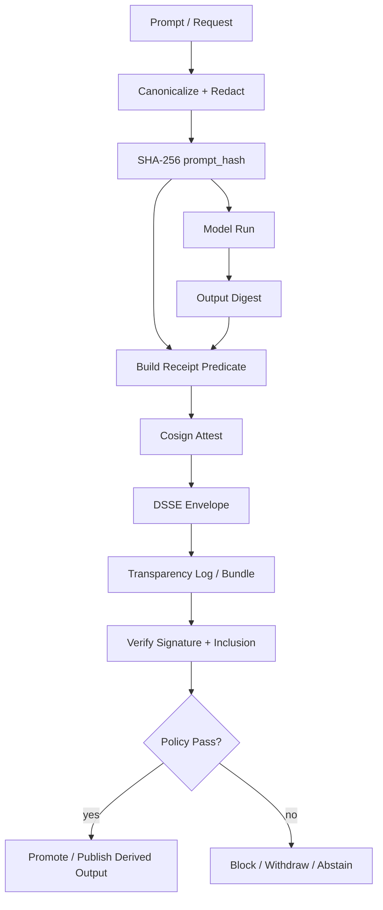
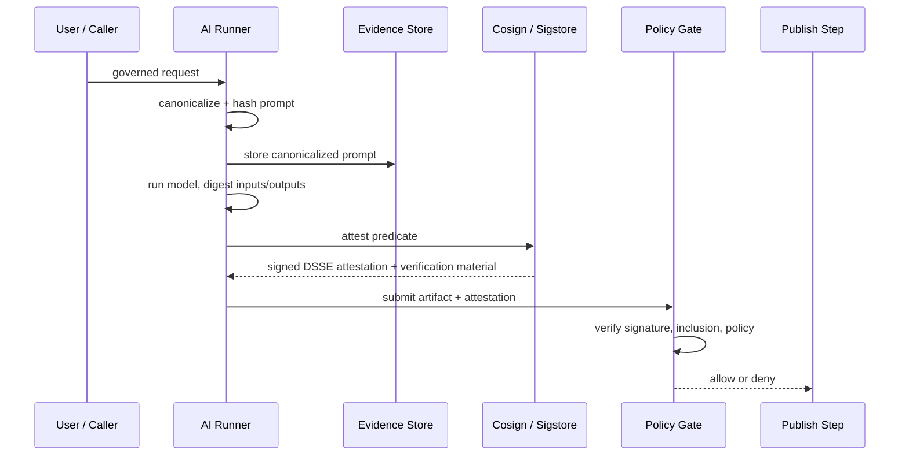

Here’s a **copy-pasteable KFM-style starter** for AI receipts.

The command path is current: Cosign supports creating in-toto attestations with `cosign attest`, and verification with `cosign verify-attestation`. Sigstore documents attestations, bundles, and verification material; in-toto’s attestation framework recommends DSSE envelopes; and JCS remains a solid way to canonicalize JSON before hashing. ([Sigstore][1])

---

# `docs/security/ai-receipts/README.md`

````md
<!-- [KFM_META_BLOCK_V2]
doc_id: kfm://doc/PLACEHOLDER-AI-RECEIPTS-README
title: AI Receipts
type: standard
version: v1
status: draft
owners: [NEEDS VERIFICATION]
created: 2026-03-28
updated: 2026-03-28
policy_label: public
related:
  - docs/security/README.md
  - docs/standards/README.md
  - policy/
  - tests/
tags: [kfm, security, provenance, ai, attestations]
notes: Source-bounded draft. Exact repo paths, owners, workflow names, and artifact references NEED VERIFICATION in a live checkout.
[/KFM_META_BLOCK_V2] -->

# AI Receipts

Governed, signed provenance records for AI-assisted runs and derived outputs.

> [!IMPORTANT]
> This document is **source-bounded** and **doctrine-aligned**. It proposes a KFM-compatible AI receipt pattern using in-toto attestations, DSSE envelopes, and Sigstore/Cosign verification. Live repo wiring, owners, and workflow paths **NEED VERIFICATION** before merge.

---

## Impact

**Status:** draft  
**Owners:** NEEDS VERIFICATION  
**Path:** `docs/security/ai-receipts/README.md`  
**Repo fit:** security / supply-chain governance / derived-output provenance  
**Truth posture:**  
- **CONFIRMED:** Cosign supports in-toto attestations and verification. :contentReference[oaicite:1]{index=1}  
- **CONFIRMED:** in-toto attestation specs recommend DSSE for envelopes. :contentReference[oaicite:2]{index=2}  
- **CONFIRMED:** JCS defines deterministic JSON canonicalization suitable for hashing. :contentReference[oaicite:3]{index=3}  
- **PROPOSED:** KFM-specific schema fields, evidence references, and policy gates  
- **NEEDS VERIFICATION:** exact CI workflows, repo paths, contract files, and test harness locations


**Quick jumps:** [Scope](#scope) · [Repo fit](#repo-fit) · [Inputs](#accepted-inputs) · [Exclusions](#exclusions) · [Schema](#minimal-receipt-schema) · [Flow](#flow) · [Quickstart](#quickstart) · [Policy gate](#policy-gate) · [FAQ](#faq)

---

## Scope

This document defines a **minimal, auditable receipt** for AI-assisted execution in KFM.

An AI receipt is a signed record that binds:

- a canonicalized prompt representation,
- its cryptographic hash,
- model/runtime metadata,
- input/output digests,
- actor identity,
- timestamp,
- review state,

to a derived output artifact.

The receipt is intended to support:

- fail-closed promotion,
- tamper evidence,
- reproducible verification,
- policy enforcement in CI and runtime,
- evidence drill-through for derived AI outputs.

---

## Repo fit

**Path:** `docs/security/ai-receipts/README.md`  
**Upstream:**  
- `docs/security/README.md`
- `docs/architecture/TRUST_MEMBRANE.md` or equivalent (**NEEDS VERIFICATION**)
- `docs/architecture/TRUTH_PATH_LIFECYCLE.md` or equivalent (**NEEDS VERIFICATION**)
- `docs/standards/README.md`

**Downstream:**  
- `policy/` attestation gates
- `tests/policy/` and `tests/e2e/` verification flows
- release / promotion workflows
- derived-output publication surfaces

**Adjacent:**  
- `contracts/` for JSON Schema / predicate contract (**PROPOSED**)
- `tools/` for canonicalization / hashing / verification helpers (**PROPOSED**)
- `scripts/` for thin orchestration entrypoints (**PROPOSED**)

---

## Accepted inputs

This surface expects, at minimum:

- a canonicalizable prompt payload,
- a model identifier or version string,
- a deterministic config representation or config hash,
- digests for governed input and output artifacts,
- actor identity,
- timestamp,
- review state,
- subject artifact reference for attestation.

---

## Exclusions

This document does **not** authorize:

- treating AI outputs as authoritative truth,
- storing raw secrets in prompts or receipts,
- publishing unsigned or unverifiable derived artifacts,
- bypassing governed APIs, evidence resolution, or policy checks,
- burying canonical contract truth in ad hoc scripts,
- using receipts as a substitute for rights, sensitivity, or sovereignty review.

> [!CAUTION]
> AI receipts apply to **derived** artifacts. They do not elevate an AI result to authoritative status.

---

## Directory tree

```text
docs/security/ai-receipts/        # this document and examples (PROPOSED)
contracts/ai-receipts/            # predicate schema(s) (PROPOSED)
policy/ai-receipts/               # OPA / Conftest rules (PROPOSED)
tools/ai-receipts/                # canonicalization / verification helpers (PROPOSED)
tests/policy/ai-receipts/         # negative and positive policy cases (PROPOSED)
tests/e2e/ai-receipts/            # promotion / tamper / missing-attestation flows (PROPOSED)
````

---

## Minimal receipt schema

Receipt payload example embedded as an in-toto predicate:

```json
{
  "_type": "https://in-toto.io/Statement/v1",
  "subject": [
    {
      "name": "kfm://artifact/output/<sha256>",
      "digest": {
        "sha256": "<OUTPUT_SHA256>"
      }
    }
  ],
  "predicateType": "https://kfm.dev/ai-receipt/v1",
  "predicate": {
    "prompt_hash": "<PROMPT_SHA256>",
    "canonicalized_prompt_ref": "kfm://evidence/prompt/<PROMPT_SHA256>",
    "model_version": "model-name-or-version",
    "model_config_hash": "<CONFIG_SHA256>",
    "input_digest": "sha256:<INPUT_SHA256>",
    "output_digest": "sha256:<OUTPUT_SHA256>",
    "actor_id": "service://kfm/ai-runner",
    "timestamp": "2026-03-28T00:00:00Z",
    "human_review_flag": false
  }
}
```

### Field notes

| Field                      | Purpose                                            | Posture  |
| -------------------------- | -------------------------------------------------- | -------- |
| `prompt_hash`              | Stable digest of canonicalized prompt payload      | PROPOSED |
| `canonicalized_prompt_ref` | Evidence-store reference to governed prompt record | PROPOSED |
| `model_version`            | Model identity used for the run                    | PROPOSED |
| `model_config_hash`        | Digest of effective model/runtime config           | PROPOSED |
| `input_digest`             | Digest of governed input                           | PROPOSED |
| `output_digest`            | Digest of produced output                          | PROPOSED |
| `actor_id`                 | Service or human principal responsible for the run | PROPOSED |
| `timestamp`                | RFC 3339 run time                                  | PROPOSED |
| `human_review_flag`        | Review state for policy gates                      | PROPOSED |

> [!NOTE]
> The outer structure is a v1 in-toto statement. Cosign supports generating and verifying in-toto attestations around a supplied predicate. ([Sigstore][1])

---

## Flow



---

## Diagram



---

## Quickstart

### 1) Canonicalize the prompt

Use a deterministic canonicalization scheme for structured JSON inputs. RFC 8785 defines the JSON Canonicalization Scheme (JCS), which produces a stable, hashable JSON representation. ([RFC Editor][2])

Python example:

```python
import hashlib
import json

def canonicalize_json(obj: dict) -> str:
    return json.dumps(obj, sort_keys=True, separators=(",", ":"))

def sha256_hex(text: str) -> str:
    return hashlib.sha256(text.encode("utf-8")).hexdigest()

prompt = {
    "text": "Analyze Kansas hydrology deltas",
    "params": {"temperature": 0.2}
}

canonicalized = canonicalize_json(prompt)
prompt_hash = sha256_hex(canonicalized)

print(canonicalized)
print(prompt_hash)
```

### 2) Create the predicate file

Save a predicate like the example above as `receipt.json`.

### 3) Sign and attach the attestation

Cosign documents attestation creation like this: `cosign attest --predicate <file> --key cosign.key <image>`. ([Sigstore][1])

```bash
cosign attest \
  --predicate receipt.json \
  --type https://kfm.dev/ai-receipt/v1 \
  --key cosign.key \
  <artifact-ref>
```

### 4) Verify before promotion

Cosign documents attestation verification with `cosign verify-attestation`. ([Sigstore][1])

```bash
cosign verify-attestation \
  --type https://kfm.dev/ai-receipt/v1 \
  --key cosign.pub \
  <artifact-ref> > attestation.json
```

### 5) Validate the statement payload

```bash
jq -r '.[0].payload' attestation.json | base64 -d > statement.json
jq . statement.json
```

> [!WARNING]
> CLI flags can vary across Cosign releases. Verify against the version pinned by your repo or toolchain before merge. The general attestation flow is current, but exact flags and bundle behaviors may differ by release. ([Sigstore][1])

---

## Policy gate

Example Rego policy:

```rego
package kfm.ai_receipts

default allow = false

allow {
  input.predicateType == "https://kfm.dev/ai-receipt/v1"
  input.predicate.prompt_hash != ""
  input.predicate.output_digest != ""
  startswith(input.predicate.actor_id, "service://kfm/")
}

deny[msg] {
  input.predicate.prompt_hash == ""
  msg := "missing prompt_hash"
}

deny[msg] {
  input.predicate.output_digest == ""
  msg := "missing output_digest"
}

deny[msg] {
  input.predicate.model_version == "experimental"
  input.predicate.human_review_flag == false
  msg := "experimental model requires human review"
}
```

Conftest example:

```bash
conftest test statement.json
```

### Fail-closed expectations

Promotion or publication should be blocked when:

* attestation is missing,
* signature verification fails,
* transparency verification material is missing where required by policy,
* predicate type is wrong,
* required fields are empty,
* prompt hash does not recompute,
* review requirements are unmet,
* rights / sovereignty / sensitivity gates remain unresolved.

---

## Usage guidance

### Canonicalization

Prefer:

* secret-redacted prompt structures,
* deterministic key ordering,
* normalized whitespace rules,
* normalized numeric / boolean encoding,
* explicit versioning for canonicalization logic.

Avoid:

* hashing raw, unredacted prompt text with secrets,
* mixing multiple incompatible canonicalization rules,
* mutable prompt records after receipt issuance.

### Evidence storage

Store:

* canonicalized prompt record,
* prompt hash,
* receipt predicate,
* signed attestation or bundle,
* verification result,
* policy decision outcome.

Do not require downstream clients to trust the AI system by assertion alone; they should be able to verify cryptographic and policy evidence.

### Trust membrane

Receipts should remain inside governed publication and verification flows. Clients should not bypass governed APIs or runtime policy to fetch or trust unsigned AI outputs.

---

## Tables

### Verification checklist

| Check                                       | Required         | Notes       |
| ------------------------------------------- | ---------------- | ----------- |
| Signature valid                             | Yes              | Fail closed |
| Attestation type matches expected predicate | Yes              | Fail closed |
| Subject digest matches artifact             | Yes              | Fail closed |
| `prompt_hash` present                       | Yes              | Fail closed |
| Recomputed prompt hash matches              | Yes              | Fail closed |
| `output_digest` present and matches         | Yes              | Fail closed |
| Actor identity allowed by policy            | Yes              | Fail closed |
| Human review satisfied where required       | Policy-dependent | Fail closed |
| Rights / sensitivity obligations cleared    | Policy-dependent | Fail closed |

### Negative outcomes are valid

| Condition                         | Outcome              |
| --------------------------------- | -------------------- |
| Missing attestation               | deny                 |
| Invalid signature                 | deny                 |
| Missing evidence ref              | abstain / deny       |
| Review not completed              | deny                 |
| Post-publication error discovered | withdraw / supersede |
| Sensitivity conflict detected     | generalize / deny    |

---

## Task list

* [ ] Verify live repo path placement
* [ ] Add contract schema under `contracts/`
* [ ] Add example predicate fixtures
* [ ] Add canonicalization helper under `tools/` or `packages/`
* [ ] Add OPA / Conftest rule bundle
* [ ] Add CI gate for verify-attestation
* [ ] Add negative tests for missing / tampered receipts
* [ ] Confirm release artifact references and subject naming
* [ ] Confirm owner metadata and policy labels
* [ ] Confirm whether keyless signing is allowed in this repo

---

## FAQ

### Why not just log prompts in a database?

A database record is useful operationally, but it is not enough for portable, cryptographically verifiable provenance. DSSE-wrapped attestations and Sigstore verification material are designed for independent verification and policy enforcement. ([GitHub][3])

### Why use in-toto?

The in-toto attestation framework is built for authenticated metadata intended to be consumed by automated policy engines. It supports custom predicates, which makes it a good fit for an AI receipt schema. ([GitHub][4])

### Why canonicalize before hashing?

Without deterministic canonicalization, logically identical prompts can hash differently. JCS addresses that for JSON by defining a canonical, hashable representation. ([RFC Editor][2])

### Do we need DSSE?

The in-toto attestation framework recommends DSSE for envelopes. That is the standard path for portable, interoperable attestations. ([GitHub][3])

### Does this make AI output authoritative?

No. In KFM terms, AI outputs remain **derived**. Receipts prove provenance and policy posture; they do not convert derived content into sovereign truth.

---

## Appendix

<details>
<summary>Minimal shell flow</summary>

```bash
# 1. Prepare receipt predicate
cat > receipt.json <<'JSON'
{
  "_type": "https://in-toto.io/Statement/v1",
  "subject": [
    {
      "name": "kfm://artifact/output/<sha256>",
      "digest": { "sha256": "<OUTPUT_SHA256>" }
    }
  ],
  "predicateType": "https://kfm.dev/ai-receipt/v1",
  "predicate": {
    "prompt_hash": "<PROMPT_SHA256>",
    "canonicalized_prompt_ref": "kfm://evidence/prompt/<PROMPT_SHA256>",
    "model_version": "model-name-or-version",
    "model_config_hash": "<CONFIG_SHA256>",
    "input_digest": "sha256:<INPUT_SHA256>",
    "output_digest": "sha256:<OUTPUT_SHA256>",
    "actor_id": "service://kfm/ai-runner",
    "timestamp": "2026-03-28T00:00:00Z",
    "human_review_flag": false
  }
}
JSON

# 2. Attest
cosign attest \
  --predicate receipt.json \
  --type https://kfm.dev/ai-receipt/v1 \
  --key cosign.key \
  <artifact-ref>

# 3. Verify
cosign verify-attestation \
  --type https://kfm.dev/ai-receipt/v1 \
  --key cosign.pub \
  <artifact-ref> > attestation.json

# 4. Decode statement
jq -r '.[0].payload' attestation.json | base64 -d > statement.json

# 5. Gate with policy
conftest test statement.json
```

</details>

---

## Evidence notes

This draft relies on official Sigstore, in-toto, and RFC sources for the attestation, DSSE, bundle, and canonicalization claims. Exact KFM repo integration points remain **NEEDS VERIFICATION** in a live tree. ([Sigstore][1])

```

A good companion file would be `contracts/ai-receipts/receipt.schema.json` plus two tests: one valid fixture and one tampered `prompt_hash` fixture.
::contentReference[oaicite:14]{index=14}
```

[1]: https://docs.sigstore.dev/cosign/verifying/attestation/?utm_source=chatgpt.com "In-Toto Attestations"
[2]: https://www.rfc-editor.org/rfc/rfc8785?utm_source=chatgpt.com "RFC 8785: JSON Canonicalization Scheme (JCS)"
[3]: https://github.com/in-toto/attestation/blob/main/spec/v1/envelope.md?utm_source=chatgpt.com "envelope.md - in-toto/attestation"
[4]: https://github.com/in-toto/attestation/blob/main/spec/README.md?utm_source=chatgpt.com "attestation/spec/README.md at main · in-toto/attestation"
