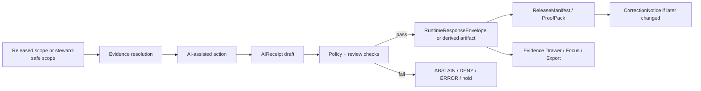

<!-- [KFM_META_BLOCK_V2]
doc_id: kfm://doc/PLACEHOLDER-AI-RECEIPTS-README
title: AI Receipts
type: standard
version: v1
status: draft
owners: [NEEDS VERIFICATION]
created: 2026-03-28
updated: 2026-03-28
policy_label: public
related: [docs/security/README.md, docs/standards/README.md, policy/, tests/]
tags: [kfm, security, provenance, ai, attestations]
notes: [Source-bounded draft. Target path, dates, and related links are preserved from the task baseline; owners, mounted repo fit, workflow names, and companion artifact paths still NEED VERIFICATION.]
[/KFM_META_BLOCK_V2] -->

# AI Receipts

Governed receipts for AI-assisted runs, runtime answers, and AI-derived artifacts in Kansas Frontier Matrix.

> [!IMPORTANT]
> **Source-bounded reading rule:** KFM doctrine around fail-closed publication, proof objects, EvidenceBundle-centered trust, finite runtime outcomes, and bounded AI is **CONFIRMED**. A named `AIReceipt` object family is **PROPOSED** in the March 2026 corpus and is documented here as a standard draft, **not** as mounted implementation fact.

## Impact

| Item | Value |
| --- | --- |
| Status | experimental |
| Owners | NEEDS VERIFICATION |
| Path | `docs/security/ai-receipts/README.md` *(target path from task; live repo placement NEEDS VERIFICATION)* |
| Repo fit | security / provenance / proof objects / bounded AI |
| Truth posture | doctrine confirmed · receipt family proposed · repo wiring unknown |


**Quick jumps:** [Scope](#scope) · [Repo fit](#repo-fit) · [Accepted inputs](#accepted-inputs) · [Exclusions](#exclusions) · [Where AI receipts fit](#where-ai-receipts-fit) · [Directory tree](#directory-tree) · [Flow](#flow) · [Minimal receipt shape](#minimal-receipt-shape) · [Quickstart](#quickstart) · [Task list](#task-list) · [FAQ](#faq) · [Appendix](#appendix)

---

## Scope

This document defines a KFM-aligned standard draft for **AI receipts** as proof-bearing records that accompany AI-assisted work without weakening the trust membrane.

It covers four things:

1. when an AI receipt should exist,
2. what minimum fields it should carry,
3. how it relates to adjacent KFM proof objects,
4. which fail-closed gates should block promotion, publication, or consequential runtime use.

This document does **not** claim that a mounted `AIReceipt` schema, workflow, or enforcement path already exists in the live repository.

[Back to top](#ai-receipts)

---

## Repo fit

**Target path:** `docs/security/ai-receipts/README.md`

### Confirmed adjacent documentation surfaces

| Role | Relative path | Status | Why it matters here |
| --- | --- | --- | --- |
| Repo identity | [`../../../README.md`](../../../README.md) | CONFIRMED doc surface | Establishes project-level doctrine and trust posture. |
| Contract surface | [`../../../contracts/README.md`](../../../contracts/README.md) | CONFIRMED doc surface | AI receipts should fit the contract lattice, not bypass it. |
| Schema surface | [`../../../schemas/README.md`](../../../schemas/README.md) | CONFIRMED doc surface | Any eventual `AIReceipt` schema belongs inside the broader schema discipline. |
| Policy surface | [`../../../policy/README.md`](../../../policy/README.md) | CONFIRMED doc surface | Deny-by-default policy is a core dependency. |
| Test surface | [`../../../tests/README.md`](../../../tests/README.md) | CONFIRMED doc surface | Valid/invalid fixtures and negative-path tests are part of the proof story. |
| Workflow surface | [`../../../.github/workflows/README.md`](../../../.github/workflows/README.md) | CONFIRMED doc surface | Merge gates and verification coverage remain relevant even when workflow YAML is still thin. |

### Proposed companion artifacts

| Likely companion | Status | Why it is adjacent |
| --- | --- | --- |
| `../../../contracts/runtime/ai_receipt.schema.json` | PROPOSED | Makes the receipt machine-checkable. |
| `../../../fixtures/valid/ai_receipt.*` | PROPOSED | Positive examples for schema and policy gates. |
| `../../../fixtures/invalid/ai_receipt.*` | PROPOSED | Negative examples proving fail-closed behavior. |
| `../../../tests/policy/ai_receipts/*` | PROPOSED | Conftest/OPA gate coverage. |
| `../../../evidence/` or PR-scoped evidence bundle layout | PROPOSED | Reviewable storage for receipts, checksums, and attestation pointers. |

> [!NOTE]
> The relative links above are intentionally conservative. They point only to surfaces that were explicitly reported as repo-visible documentation areas, while companion paths remain marked **PROPOSED** until a live checkout confirms them.

---

## Accepted inputs

An AI receipt should be able to bind an AI-assisted action to **released scope**, **policy state**, and **audit linkage**.

| Input | Why it belongs here | Posture |
| --- | --- | --- |
| `subject_ref` or artifact reference | Ties the receipt to the thing produced, evaluated, or surfaced. | PROPOSED |
| `spec_hash` or equivalent canonical digest | Supports determinism, replay checks, and review diffing. | PROPOSED |
| Model / adapter identity | Distinguishes AI configuration from authoritative Kansas truth. | PROPOSED |
| Evidence or release references | Keeps AI downstream of admissible released scope. | CONFIRMED doctrine / PROPOSED field shape |
| Decision / review references | Prevents AI receipts from becoming a shadow approval path. | CONFIRMED doctrine / PROPOSED field shape |
| Output digests and attestation pointers | Make provenance portable and later-verifiable. | PROPOSED |
| `audit_ref` | Joins logs, policy, release, and runtime surfaces. | CONFIRMED doctrine / PROPOSED field shape |
| Runtime result or surface state | Preserves finite outcomes and negative-path visibility. | CONFIRMED doctrine / PROPOSED field shape |

---

## Exclusions

AI receipts are **not** the right place for several other KFM concerns.

| Does **not** belong here | Handle it through |
| --- | --- |
| Raw source-fetch proof | `IngestReceipt` + `ValidationReport` |
| Authoritative dataset identity and release promotion | `DatasetVersion` + `ReleaseManifest` / `ReleaseProofPack` |
| Full request-time support package | `EvidenceBundle` |
| Canonical request-time answer object | `RuntimeResponseEnvelope` |
| Human approval or denial | `ReviewRecord` + `DecisionEnvelope` |
| Correction lineage after publication | `CorrectionNotice` |
| Raw secrets, private prompts, or unrestricted canonical store access | Never publish them; keep them behind governed internal handling |

> [!CAUTION]
> An AI receipt must never be treated as an authority upgrade. It records **how** AI participated; it does not convert AI output into authoritative truth.

---

## Where AI receipts fit

KFM already has a confirmed doctrine for adjacent proof objects. `AIReceipt` should therefore be treated as an **extension** that fits **beside** them, not as a replacement for them.

| Object family | Primary seam | What it already does | How AI receipts relate |
| --- | --- | --- | --- |
| `IngestReceipt` | source edge → RAW | proves fetch and landing | AI receipts do **not** replace raw ingest proof. |
| `DecisionEnvelope` | policy mediation | records allow/deny/obligation logic | AI receipts should point to policy outcome, not restate policy as prose. |
| `ReviewRecord` | human review boundary | records approval, denial, escalation, note | AI receipts should reference review where materiality requires it. |
| `ReleaseManifest` / `ReleaseProofPack` | CATALOG → PUBLISHED | assembles public-safe release and proof | AI receipts can be included or referenced inside the proof pack when AI contributed. |
| `EvidenceBundle` | runtime evidence resolution | packages support for a claim, export, story, or answer | AI receipts must not substitute for supporting evidence. |
| `RuntimeResponseEnvelope` | request-time output | preserves finite runtime outcome | AI receipts may supplement persisted or audited AI actions, but the envelope remains the runtime contract. |
| `CorrectionNotice` | post-release change | preserves visible lineage under correction | AI-derived outputs still need visible correction, supersession, or withdrawal paths. |

### Emission matrix

| Situation | Emit AI receipt? | Also emit |
| --- | --- | --- |
| AI-assisted derived artifact intended for review or release | **Yes — recommended** | `DecisionEnvelope`, `ReviewRecord` where needed, `ReleaseManifest` / `ReleaseProofPack` |
| AI-assisted runtime answer retained for audit, steward review, or consequential export | **Policy-dependent — recommended when persisted** | `EvidenceBundle`, `RuntimeResponseEnvelope` |
| Pure source ingest or canonical transformation with **no** AI step | **No** | `IngestReceipt`, `ValidationReport`, `DatasetVersion` |
| Human-authored story or dossier with no AI assistance | **No** | existing publication and evidence objects |
| Experimental model evaluation in a sandbox | **Yes — recommended** | test evidence, checksums, validation outputs |

[Back to top](#ai-receipts)

---

## Directory tree

```text
docs/security/ai-receipts/
├── README.md                       # this standard draft
├── examples/                       # PROPOSED
│   ├── ai_receipt.min.json         # PROPOSED
│   ├── ai_receipt.focus.answer.json# PROPOSED
│   └── ai_receipt.blocked.json     # PROPOSED
├── schemas/                        # PROPOSED local examples only if repo pattern allows
└── notes/                          # PROPOSED review aids or migration notes

contracts/                          # CONFIRMED doc surface; mounted schema inventory unknown
schemas/                            # CONFIRMED doc surface; mounted schema inventory unknown
policy/                             # CONFIRMED doc surface; mounted Rego bundles unknown
tests/                              # CONFIRMED doc surface; runnable coverage unknown
.github/workflows/                  # CONFIRMED doc surface; active merge-gate YAML unknown
```

---

## Flow



### Working interpretation

The important KFM rule is not “AI produced a result.” The important rule is:

1. the action stayed inside governed scope,
2. the evidence route remained inspectable,
3. the result passed finite-outcome handling,
4. the release or runtime surface can explain what happened later.

---

## Minimal receipt shape

> [!NOTE]
> The object below is an **illustrative starter**, not a mounted repo contract. It is shaped to fit confirmed KFM proof-object doctrine while keeping `AIReceipt` itself explicitly **PROPOSED**.

```json
{
  "kind": "AIReceipt",
  "schema_version": "0.1.0",
  "receipt_id": "ar.example.2026-03-28.001",
  "subject_ref": "dv.hydrology.example.2026-03-28.v1",
  "artifact_digest": "sha256:...",
  "spec_hash": "sha256:...",
  "model": {
    "adapter_id": "adapter.local.example",
    "model_id": "model.example",
    "model_checksum": "sha256:..."
  },
  "scope": {
    "lane": "hydrology",
    "surface_class": "focus",
    "release_window": "rel.example.2026-03-28",
    "time_basis": "2026-03-28T00:00:00Z"
  },
  "evidence_refs": [
    "eb.example.2026-03-28.001"
  ],
  "input_refs": [
    "input.example.001"
  ],
  "output_refs": [
    "output.example.001"
  ],
  "decision_ref": "de.example.2026-03-28.001",
  "review_ref": null,
  "result": "answer",
  "citations_check": "passed",
  "obligations": [],
  "attestations": [
    {
      "type": "attestation.pointer",
      "ref": "att.example.001"
    }
  ],
  "audit_ref": "audit:ai:2026-03-28:001",
  "created_at": "2026-03-28T00:00:00Z"
}
```

### Field notes

| Field family | Why it matters | Posture |
| --- | --- | --- |
| `receipt_id`, `schema_version`, `kind` | Makes the object identifiable and evolvable. | PROPOSED |
| `subject_ref`, `artifact_digest` | Binds the receipt to the thing that was produced or surfaced. | PROPOSED |
| `spec_hash` | Supports deterministic replay and diffability. | PROPOSED |
| `model.*` | Separates runtime configuration from Kansas truth objects. | PROPOSED |
| `scope.*` | Prevents scope drift across place, lane, surface, and release. | PROPOSED |
| `evidence_refs` | Keeps the receipt downstream of admissible evidence. | CONFIRMED doctrine / PROPOSED field shape |
| `decision_ref`, `review_ref` | Preserves policy and review traceability. | CONFIRMED doctrine / PROPOSED field shape |
| `result`, `citations_check` | Keeps finite outcomes and citation-negative behavior visible. | CONFIRMED doctrine / PROPOSED field shape |
| `attestations`, `audit_ref` | Supports portable provenance and operational explainability. | PROPOSED / CONFIRMED doctrine for audit linkage |

---

## Policy gate

An AI receipt should **fail closed** if any of the following are true.

| Gate | Minimum check | Consequence |
| --- | --- | --- |
| Scope gate | Subject is not tied to released or explicitly allowed steward scope | hold / deny |
| Evidence gate | Evidence or release references do not resolve | abstain / deny |
| Policy gate | No `DecisionEnvelope`, or decision result conflicts with requested action | deny |
| Review gate | Materiality requires human review and no `ReviewRecord` exists | hold / deny |
| Determinism gate | Missing `spec_hash`, unstable digest chain, or non-replayable object identity | deny |
| Citation gate | Runtime or export action failed citation checks | abstain / deny |
| Rights/sensitivity gate | Public-safe state is unresolved or obligations are missing | deny / generalize |
| Correction gate | Receipt points to superseded or withdrawn release scope without visible correction handling | stale-visible / deny |

### Minimal rule of thumb

AI receipts should be **strict enough** that they increase trust, but **narrow enough** that they do not duplicate every other KFM object.

That usually means:

- keep support in `EvidenceBundle`,
- keep policy in `DecisionEnvelope`,
- keep approval in `ReviewRecord`,
- keep outward release assembly in `ReleaseManifest` / `ReleaseProofPack`,
- let the AI receipt record the AI-assisted step that connected those things.

---

## Quickstart

### Smallest credible starter path

1. **Emit AI receipts in reviewable evidence bundles first.**  
   Start in PR- or branch-scoped evidence layouts, not in a silent publish path.

2. **Validate structure before meaning.**  
   A starter schema plus valid/invalid fixtures should exist before policy claims become merge expectations.

3. **Gate with policy-as-code.**  
   Deny by default if receipt structure, review refs, evidence refs, or attestation pointers are missing.

4. **Pair with existing proof objects.**  
   Do not publish an AI receipt by itself for release-worthy work; link it to the surrounding proof pack.

5. **Add one positive and one negative example.**  
   The fastest trust-bearing proof is one passing case and one blocked case.

### Illustrative evidence layout

```text
evidence/
├── run_manifest.json
├── ai_receipt.json
├── checksums.txt
├── attestation.pointer.json
└── decision.pointer.json
```

### Illustrative local gate

```bash
# Illustrative only — exact repo commands and filenames NEED VERIFICATION
conftest test evidence/ai_receipt.json -p policy/
```

> [!WARNING]
> This section is intentionally **illustrative**. The current session did not expose mounted schema files, runnable policy bundles, or active workflow YAML implementing this path.

[Back to top](#ai-receipts)

---

## Usage

### When to emit

Emit an AI receipt when AI materially influences:

- a **derived artifact** under review,
- a **bounded runtime answer** retained for audit or consequential use,
- a **proposal or patch** whose governance story must remain portable,
- a **release proof pack** that later reviewers may need to reconstruct.

### When not to emit

Do **not** emit an AI receipt merely to decorate low-risk activity logs or to create the appearance of governance. If AI did not meaningfully participate, use the ordinary proof objects and skip the extra surface.

### Review principle

An AI receipt is most useful when a reviewer can answer all three of these questions quickly:

1. **What happened?**
2. **What evidence and release scope allowed it?**
3. **What stops this from becoming hidden authority?**

---

## Tables

### Standards-profile fit

| Profile family | Why it matters here | Posture |
| --- | --- | --- |
| JSON Schema Draft 2020-12 | Natural fit for machine-validatable contract files and fixtures | CONFIRMED standards direction |
| STAC | Outward asset linkage when the AI-assisted result is spatiotemporal | CONFIRMED standards direction |
| DCAT 3 | Outward dataset/distribution discovery where releases are published | CONFIRMED standards direction |
| PROV-O | Lineage vocabulary for activities, entities, and agents | CONFIRMED standards direction |
| Attestation / signature profile | Portable provenance and verification path | PROPOSED KFM realization detail |

### Definition-of-done matrix

| Criterion | Done means |
| --- | --- |
| Contract | `AIReceipt` schema exists and validates examples |
| Fixtures | At least one valid and one invalid fixture are committed |
| Policy | A deny-by-default rule bundle evaluates receipt presence and minimum refs |
| Proof | One reviewable PR evidence bundle contains `run_manifest` + `ai_receipt` + checksums |
| Negative path | One blocked example proves hold/deny/abstain behavior |
| Linkage | Receipt points to decision/review/release objects without duplicating them |
| Docs | This README and adjacent contract/policy/test docs stay in sync |
| Surface behavior | Evidence Drawer / Focus / review UI can show receipt presence or absence clearly |

---

## Task list

- [ ] Verify live repo placement for `docs/security/ai-receipts/README.md`
- [ ] Confirm whether `AIReceipt` should be its own top-level schema or a proof-pack subprofile
- [ ] Add a starter `AIReceipt` schema and fixture pair
- [ ] Add policy tests proving deny-by-default behavior on missing refs
- [ ] Add one positive example linked to release-worthy proof objects
- [ ] Add one blocked negative example showing missing evidence, review, or attestation
- [ ] Confirm whether request-time Focus answers persist only through `RuntimeResponseEnvelope` or also emit `AIReceipt`
- [ ] Confirm signing / attestation expectations by materiality class
- [ ] Add documentation links from security, contracts, policy, and tests surfaces
- [ ] Add rollback / correction guidance for AI-derived outputs

---

## FAQ

### Why not put everything in `RuntimeResponseEnvelope`?

Because runtime envelopes answer a different question: **what was returned at request time?** An AI receipt is more useful when it records the AI-assisted step itself and links outward to policy, review, and release objects.

### Is an AI receipt authoritative truth?

No. It is a **governance object**. It proves participation, not authority.

### Does every AI-assisted action need human review?

Not necessarily. The corpus strongly supports policy and review linkage, but it still leaves the mandatory review boundary open by lane and materiality.

### Should AI receipts exist for non-release experiments?

Often yes, when you need replayability, audit linkage, or sandbox evaluation evidence. In that case, keep them clearly separate from public-safe release artifacts.

[Back to top](#ai-receipts)

---

## Appendix

<details>
<summary>Open verification items</summary>

### Current-session limits

The current session did **not** surface:

- a mounted repo tree under the target path,
- a confirmed `AIReceipt` schema file,
- confirmed workflow YAML enforcing receipt gates,
- a mounted policy bundle proving current receipt checks,
- a mounted proof pack that already includes AI receipts.

### What to verify next

1. Whether the repository already has a preferred proof-object directory for AI/runtime artifacts.
2. Whether receipt examples belong under `docs/`, `contracts/`, `fixtures/`, or a shared `evidence/` pattern.
3. Whether release-significant AI receipts must carry attestation pointers, signed blobs, or both.
4. Whether steward-only flows require a stricter receipt profile than public-safe exports.
5. Whether Focus Mode needs a persistent AI receipt or only an auditable runtime envelope.

</details>

<details>
<summary>Why this document is intentionally conservative</summary>

The KFM corpus is strongest when it separates:

- **confirmed doctrine**,
- **proposed realization**,
- **unknown mounted implementation**.

This README keeps that distinction visible on purpose. Its job is to make a future `AIReceipt` implementation easier to review, not easier to overclaim.

</details>

[Back to top](#ai-receipts)
