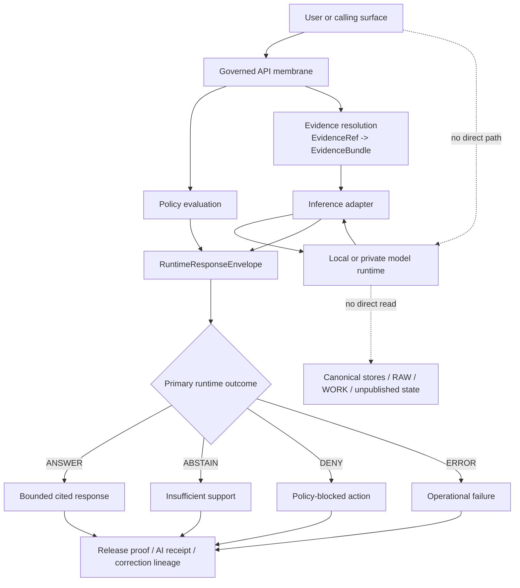

<!-- [KFM_META_BLOCK_V2]
doc_id: kfm://doc/NEEDS-VERIFICATION
title: KFM AI Supply-Chain & Governed Model Runtime
type: standard
version: v1
status: review
owners: @bartytime4life
created: YYYY-MM-DD
updated: YYYY-MM-DD
policy_label: public
related: [../../README.md, ../README.md, ../threat-model.md, ../vulnerability-management.md, ../vulns/README.md, ../prompt-injection/README.md, ../prompt-injection-defense.md, ../supply-chain/README.md, ../promotion-contract.md, ../ai-receipts/README.md, ../../../contracts/README.md, ../../../policy/README.md, ../../../schemas/README.md, ../../../.github/actions/README.md, ../../../.github/workflows/README.md, ../../../.github/SECURITY.md]
tags: [kfm, security, ai, supply-chain, model-runtime, prompt-injection]
notes: [doc_id and dates require merge-time verification; current public main shows a substantive README in this directory while the directory itself remains README-only; adjacent ai-receipts and promotion-contract surfaces are now visible and should absorb narrower proof and promotion detail]
[/KFM_META_BLOCK_V2] -->

# KFM AI Supply-Chain & Governed Model Runtime

Public-safe guidance for model provenance, adapter boundaries, prompt/input hardening, evaluation, and evidence-bounded AI behavior under `docs/security/ai-supply-chain/`.

> Status: `experimental`
> Owners: `@bartytime4life`
> Path: `docs/security/ai-supply-chain/README.md`
> Repo fit: secure-AI lane under [`../README.md`](../README.md), adjacent to [`../ai-receipts/README.md`](../ai-receipts/README.md), [`../promotion-contract.md`](../promotion-contract.md), prompt-injection, the narrower vulnerability lane, and broader supply-chain docs, downstream into the governed API membrane, contracts, policy, tests, repo-local actions, and workflow gates.
>
> 
> 
> 
> 
> 
>
> Quick jumps: [Scope](#scope) · [Repo fit](#repo-fit) · [Accepted inputs](#accepted-inputs) · [Exclusions](#exclusions) · [Current verified snapshot](#current-verified-snapshot) · [Directory tree](#directory-tree) · [Quickstart](#quickstart) · [Usage](#usage) · [Diagram](#diagram) · [Control surfaces](#control-surfaces) · [Task list](#task-list--definition-of-done) · [FAQ](#faq) · [Appendix](#appendix)

> [!IMPORTANT]
> This lane is **repo-grounded for currently visible public repo surfaces** and **doctrine-grounded for KFM’s AI/runtime rules**. It does **not** claim that signed builds, SBOM export, evaluation gates, policy bundles, or model-runtime enforcement are already active in checked-in workflow YAML on current public `main`.

> [!WARNING]
> In KFM, “AI supply chain” is broader than dependency CVEs. It includes model or embedding artifacts, tokenizer/config provenance, inference adapters, runtime containment, retrieved-context shaping, prompt/input boundaries, accountable output envelopes, release proof, AI-run receipts, and correction lineage.

---

## Scope

This directory defines the **secure-AI and model-runtime lane** for KFM.

The lane exists because KFM treats AI as a **bounded helper inside a governed evidence system**, not as a sovereign truth source. In practical terms, that means this README is about the part of the system where model artifacts, adapters, policy checks, evidence resolution, runtime outcomes, and release/correction visibility meet.

This file should help maintainers answer four questions quickly:

1. What belongs in the AI supply-chain lane?
2. What belongs in neighboring lanes instead?
3. What is **CONFIRMED**, what is **INFERRED**, and what remains **UNKNOWN**?
4. What should be added next without pretending the repo already enforces it?

[Back to top](#kfm-ai-supply-chain--governed-model-runtime)

---

## Repo fit

| Relation | Path | Why it matters here | Posture |
|---|---|---|---|
| Docs index | [`../../README.md`](../../README.md) | Wider docs conventions and navigation context | `CONFIRMED` |
| Parent security index | [`../README.md`](../README.md) | Security subtree map; entry point into secure-AI and adjacent lanes | `CONFIRMED` |
| Adjacent AI receipts lane | [`../ai-receipts/README.md`](../ai-receipts/README.md) | Keeps signed or attested AI-run provenance detail separate from full model/runtime-lane doctrine | `CONFIRMED` |
| Adjacent promotion contract | [`../promotion-contract.md`](../promotion-contract.md) | Keeps AI-bearing release-admission, steward approval, and promotion-gate detail in the narrower contract doc instead of expanding this README sideways | `CONFIRMED` |
| Adjacent threat model | [`../threat-model.md`](../threat-model.md) | Cross-cutting trust boundary, failure-mode, and attack-surface context | `CONFIRMED` |
| Adjacent vulnerability lane | [`../vulnerability-management.md`](../vulnerability-management.md) | Intake, triage, remediation, and disclosure path for discovered issues | `CONFIRMED` |
| Adjacent advisory / CVE detail lane | [`../vulns/README.md`](../vulns/README.md) | Keeps issue-specific notes, package-family advisories, and correction-aware leaves out of this doctrinal lane | `CONFIRMED` |
| Adjacent prompt-injection lane | [`../prompt-injection/README.md`](../prompt-injection/README.md) | Hostile-input, retrieval-scope, and instruction-conflict guidance | `CONFIRMED` |
| Adjacent prompt defense note | [`../prompt-injection-defense.md`](../prompt-injection-defense.md) | Narrow defensive guidance for input and prompt-boundary controls | `CONFIRMED` |
| Adjacent broader supply-chain lane | [`../supply-chain/README.md`](../supply-chain/README.md) | Provenance, release integrity, attestation, SBOM, and artifact trust | `CONFIRMED` |
| Governed API membrane | [`../../../apps/governed-api/README.md`](../../../apps/governed-api/README.md) | AI/runtime discussion must stay downstream of the executable trust membrane, not invent direct client-to-model paths | `CONFIRMED` |
| Contract surface | [`../../../contracts/README.md`](../../../contracts/README.md) | AI/runtime trust objects should stay typed and machine-checkable | `CONFIRMED` |
| Policy surface | [`../../../policy/README.md`](../../../policy/README.md) | AI behavior must stay deny-by-default and runtime-enforced | `CONFIRMED` |
| Schema boundary | [`../../../schemas/README.md`](../../../schemas/README.md) | Avoids inventing a second schema home for trust-bearing objects | `CONFIRMED` |
| Verification surface | [`../../../tests/README.md`](../../../tests/README.md) | Negative-path, runtime-proof, correction, and reproducibility families are the eventual proof burden for this lane | `CONFIRMED` |
| Local actions surface | [`../../../.github/actions/README.md`](../../../.github/actions/README.md) | Future AI/runtime gate wrappers belong in repo-local actions rather than buried in lane prose | `CONFIRMED` |
| Workflow lane | [`../../../.github/workflows/README.md`](../../../.github/workflows/README.md) | Any future merge gates, attestation, eval, or proof automation belong here | `CONFIRMED` |
| Gatehouse disclosure surface | [`../../../.github/SECURITY.md`](../../../.github/SECURITY.md) | Public disclosure/reporting surface is visible in the gatehouse; keep wording aligned with the wider security docs instead of assuming the canonical-path question is fully settled here | `CONFIRMED surface` |

### Upstream / downstream reading order

```text
../../README.md
  └─ ../README.md
      ├─ ../threat-model.md
      ├─ ../prompt-injection/README.md
      ├─ ../prompt-injection-defense.md
      ├─ ../ai-receipts/README.md
      ├─ ../promotion-contract.md
      ├─ ../supply-chain/README.md
      ├─ ../vulnerability-management.md
      ├─ ../vulns/README.md
      └─ THIS FILE
             ├─ ../../../apps/governed-api/README.md
             ├─ ../../../contracts/README.md
             ├─ ../../../policy/README.md
             ├─ ../../../schemas/README.md
             ├─ ../../../tests/README.md
             ├─ ../../../.github/actions/README.md
             └─ ../../../.github/workflows/README.md
```

[Back to top](#kfm-ai-supply-chain--governed-model-runtime)

---

## Accepted inputs

This lane accepts material that is specifically about **AI-bearing trust surfaces**.

| Accepted input | What belongs here |
|---|---|
| Model origin and admission notes | Where a model, embedding model, tokenizer, or adapter came from; intended role; digest/provenance expectations; review burden |
| Runtime boundary rules | Local/private runtime placement, governed API membrane, no-direct-client-path rules, container/runtime isolation notes |
| Prompt/input hardening links | Secure handling of retrieved text, user prompts, tool context, and model-facing instructions when discussed as part of the AI runtime chain |
| Governed API handoff notes | Where evidence resolution, policy checks, adapter calls, and accountable response envelopes meet without bypassing the membrane |
| AI-specific release proof expectations | What an AI-bearing release must prove before promotion or public exposure |
| Evaluation expectations | Negative-path tests, citation-failure tests, abstain/deny behavior, stale-scope or partial-coverage behavior |
| AI receipt / attestation linkage notes | How signed or attested AI-run provenance connects to derived outputs without turning receipts into sovereign truth |
| Trust-object guidance | `EvidenceBundle`, `RuntimeResponseEnvelope`, `DecisionEnvelope`, `CorrectionNotice`, and related AI-relevant object families |
| Public-safe mitigation notes | Contributor instructions that reduce AI/runtime risk without exposing secrets or exploitable internals |

---

## Exclusions

This lane is **not** the dumping ground for everything adjacent to AI.

| Exclusion | Put it here instead |
|---|---|
| General dependency or container provenance docs with no AI/runtime angle | [`../supply-chain/README.md`](../supply-chain/README.md) |
| Generic threat-model text not specific to AI/runtime boundaries | [`../threat-model.md`](../threat-model.md) |
| Prompt-injection content focused on user input, retrieval attacks, or system-prompt conflict | [`../prompt-injection/README.md`](../prompt-injection/README.md) and [`../prompt-injection-defense.md`](../prompt-injection-defense.md) |
| AI receipt predicate shape, DSSE / in-toto recipe detail, or receipt-verification how-to | [`../ai-receipts/README.md`](../ai-receipts/README.md) |
| Promotion contract detail for signatures, referrers, steward approval, or runtime admission recheck | [`../promotion-contract.md`](../promotion-contract.md) |
| Vulnerability intake, disclosure, or remediation process docs | [`../vulnerability-management.md`](../vulnerability-management.md) |
| Issue-specific advisory / CVE notes or package-family vulnerability leaves | [`../vulns/README.md`](../vulns/README.md) |
| Governed API route-family ownership or request-boundary inventory | [`../../../apps/governed-api/README.md`](../../../apps/governed-api/README.md) |
| Live secrets, endpoints, tokens, hostnames, internal registries, or unpublished incident evidence | keep out of public docs |
| Machine-readable schemas themselves | [`../../../contracts/README.md`](../../../contracts/README.md) or verified schema home after merge-time confirmation |
| Rego bundles, test harnesses, or workflow YAML | `../../../policy/`, `../../../tests/`, `../../../.github/workflows/` |
| Free-form benchmark marketing or uncited vendor capability claims | do not place in repo docs |

[Back to top](#kfm-ai-supply-chain--governed-model-runtime)

---

## Current verified snapshot

The current public `main` branch now exposes a more useful secure-AI picture than the earlier scaffold-era draft text implied.

| Item | Current public posture |
|---|---|
| `docs/security/ai-supply-chain/README.md` | Substantive lane README visible on public `main`; this revision is an in-place improvement, not a net-new file |
| `docs/security/ai-supply-chain/` | No additional child files were directly visible from the current directory page |
| `docs/security/ai-receipts/README.md` | Sibling secure-AI receipt lane is visible; it explicitly documents a draft/proposed receipt family and should absorb receipt-shape and attestation-detail drift |
| `docs/security/promotion-contract.md` | Adjacent promotion and runtime-admission contract is visible on public `main`; AI-bearing release-admission detail should route there instead of widening this README |
| `apps/governed-api/README.md` | Governed API membrane README is visible and should anchor no-direct-client-to-model claims |
| `.github/actions/` | Repo-local action directories are visible (`metadata-validate-v2/`, `metadata-validate/`, `opa-gate/`, `provenance-guard/`, `sbom-produce-and-sign/`, plus `src/`) |
| `.github/workflows/` | README visible; no checked-in workflow YAML is visible on current public `main`; public Actions history is historical signal, not current file inventory |
| `policy/` | `bundles/`, `fixtures/`, `policy-runtime/`, `tests/`, and `README.md` are visible |
| `tests/` | `accessibility/`, `contracts/`, `e2e/`, `integration/`, `policy/`, `reproducibility/`, `unit/`, and `README.md` are visible |
| `contracts/` | README-bearing contract boundary remains visible; current public directory page shows `README.md` only |
| `schemas/` | `README.md` plus `contracts/`, `schemas/`, `standards/`, `tests/`, and `workflows/` are visible; schema-home authority still needs explicit resolution |

> [!NOTE]
> This README should no longer describe itself as replacing a scaffold-only file. The more accurate posture now is: **the lane README exists and is substantive, the directory itself is still compact, the proof surfaces are distributed across sibling repo lanes, and live workflow YAML for AI/runtime enforcement is still not visible on current public `main`.**

> [!TIP]
> The wider `docs/security/` subtree also now exposes `promotion-contract.md` and `vulns/`. Keep this lane narrow: route promotion/runtime-admission depth and advisory leaf detail outward instead of absorbing both here.

[Back to top](#kfm-ai-supply-chain--governed-model-runtime)

---

## Directory tree

### Current verified snapshot

```text
docs/security/ai-supply-chain/
└── README.md
```

### PROPOSED growth shape

Only add narrower files when there is both a named owner and an executable neighbor surface to keep them honest.

```text
docs/security/ai-supply-chain/
├── README.md
├── model-origin-and-admission.md
├── runtime-containment.md
├── adapter-boundary.md
├── evaluation-and-negative-fixtures.md
└── provenance-and-correction.md
```

> [!TIP]
> Keep this lane compact. If a proposed file mostly duplicates prompt-injection, AI-receipt, promotion-contract, supply-chain, policy, or vulnerability material, link outward instead of branching inward.

[Back to top](#kfm-ai-supply-chain--governed-model-runtime)

---

## Quickstart

Use this sequence before editing or extending the lane.

```bash
# 1) Read the wider security subtree first
sed -n '1,240p' docs/security/README.md
sed -n '1,240p' docs/security/threat-model.md
sed -n '1,240p' docs/security/supply-chain/README.md
sed -n '1,240p' docs/security/promotion-contract.md
sed -n '1,240p' docs/security/vulnerability-management.md
sed -n '1,240p' docs/security/vulns/README.md

# 2) Read secure-AI neighbors
sed -n '1,240p' docs/security/ai-receipts/README.md
sed -n '1,240p' docs/security/prompt-injection/README.md
sed -n '1,240p' docs/security/prompt-injection-defense.md

# 3) Inspect this lane as it exists on your branch
find docs/security/ai-supply-chain -maxdepth 3 -type f | sort
sed -n '1,320p' docs/security/ai-supply-chain/README.md

# 4) Inspect membrane, policy, proof, and gate-adjacent surfaces
sed -n '1,240p' apps/governed-api/README.md
sed -n '1,240p' contracts/README.md
sed -n '1,240p' policy/README.md
sed -n '1,240p' schemas/README.md
sed -n '1,240p' tests/README.md
sed -n '1,240p' .github/actions/README.md
sed -n '1,240p' .github/workflows/README.md
sed -n '1,240p' .github/SECURITY.md

# 5) Before claiming implementation, verify the tree directly
git ls-files docs/security/ai-supply-chain
git ls-files docs/security/ai-receipts
git ls-files docs/security/promotion-contract.md
git ls-files docs/security/vulns
git ls-files apps/governed-api
git ls-files .github/actions
git ls-files .github/workflows
git ls-files contracts
git ls-files policy
git ls-files schemas
git ls-files tests
```

### Minimum review questions

1. Does the change describe a **trust-bearing AI/runtime surface**, or is it really a prompt-injection, promotion-contract, supply-chain, AI-receipts, policy, or vulnerability doc?
2. Does the change keep **implementation claims proportional** to visible repo evidence?
3. Does the change preserve the **governed API membrane** and fail-closed posture?
4. Does the change make negative outcomes easier to test and explain?
5. Does the change avoid creating a second, drifting schema vocabulary?
6. Does the change leave route-family ownership in `apps/governed-api/`, receipt-shape ownership in `docs/security/ai-receipts/`, and release-admission depth in `docs/security/promotion-contract.md` where those surfaces already exist?

[Back to top](#kfm-ai-supply-chain--governed-model-runtime)

---

## Usage

| Task | Start here | Then verify |
|---|---|---|
| Explain what “AI supply chain” means in KFM | this file | [`../README.md`](../README.md), [`../threat-model.md`](../threat-model.md) |
| Document model/runtime containment | this file | [`../../../policy/README.md`](../../../policy/README.md), [`../../../apps/governed-api/README.md`](../../../apps/governed-api/README.md), and branch-local runtime/config surfaces |
| Document AI receipt / attestation pattern | [`../ai-receipts/README.md`](../ai-receipts/README.md) | [`../../../contracts/README.md`](../../../contracts/README.md), [`../../../schemas/README.md`](../../../schemas/README.md), [`../../../policy/README.md`](../../../policy/README.md), and [`../../../.github/workflows/README.md`](../../../.github/workflows/README.md) |
| Document AI-bearing promotion, release-admission, or runtime revalidation burden | [`../promotion-contract.md`](../promotion-contract.md) | [`../../../policy/README.md`](../../../policy/README.md), [`../../../.github/actions/README.md`](../../../.github/actions/README.md), [`../../../.github/workflows/README.md`](../../../.github/workflows/README.md), and branch-local release evidence |
| Document prompt-boundary and hostile-input risk | [`../prompt-injection/README.md`](../prompt-injection/README.md) | [`../prompt-injection-defense.md`](../prompt-injection-defense.md), then return here for runtime-chain implications |
| Document dependency, base-image, attestation, or release provenance concerns | [`../supply-chain/README.md`](../supply-chain/README.md) | [`../../../.github/actions/README.md`](../../../.github/actions/README.md), [`../../../.github/workflows/README.md`](../../../.github/workflows/README.md), and release docs |
| Map negative-path proof burden | [`../../../tests/README.md`](../../../tests/README.md) | branch-local `tests/policy/`, `tests/e2e/runtime_proof/`, `tests/e2e/correction/`, and reproducibility surfaces |
| Draft machine-checkable AI/runtime objects | [`../../../contracts/README.md`](../../../contracts/README.md) | [`../../../schemas/README.md`](../../../schemas/README.md) and verified schema location |
| Record issue-specific advisory or CVE detail | [`../vulns/README.md`](../vulns/README.md) | [`../vulnerability-management.md`](../vulnerability-management.md), relevant supply-chain docs, and release evidence |
| Describe future merge gates or eval automation | this file for lane intent | [`../../../.github/actions/README.md`](../../../.github/actions/README.md) and [`../../../.github/workflows/README.md`](../../../.github/workflows/README.md) for actual control-plane placement |

---

## Diagram



### Reading rule

The diagram is the governing mental model for this lane:

- clients talk to the **governed API**, not to the model runtime
- the model runtime works only on **admissible scoped context**
- outputs become accountable through a **typed response envelope**
- negative outcomes are **valid system behavior**
- proof, AI-run receipts, and correction visibility continue **after** the answer is generated

[Back to top](#kfm-ai-supply-chain--governed-model-runtime)

---

## Control surfaces

### AI supply-chain control map

| Control area | KFM obligation | Primary neighbor surface | Current posture |
|---|---|---|---|
| Model origin and identity | Track source, digest, intended role, and review burden before admission | [`../supply-chain/README.md`](../supply-chain/README.md) | `CONFIRMED doctrine` / implementation depth `UNKNOWN` |
| Runtime containment | Keep model runtime behind the governed API; no direct client path | [`../threat-model.md`](../threat-model.md), [`../../../policy/README.md`](../../../policy/README.md), [`../../../apps/governed-api/README.md`](../../../apps/governed-api/README.md) | `CONFIRMED doctrine` / executable boundary doc visible / mounted runtime depth `UNKNOWN` |
| Prompt and input boundary | Prevent hostile or stale input from silently changing scope, policy, or release visibility | [`../prompt-injection/README.md`](../prompt-injection/README.md) | adjacent lane `CONFIRMED` |
| Evidence-bounded synthesis | Retrieve, cite, verify, and abstain rather than improvise | [`../../../contracts/README.md`](../../../contracts/README.md), [`../../../tests/README.md`](../../../tests/README.md) | `CONFIRMED doctrine` / executable proof depth `UNKNOWN` |
| Runtime accountability | Emit bounded primary outcomes and visible surface state | this file + contract surfaces | `CONFIRMED doctrine` / schema inventory `UNKNOWN` |
| AI-run provenance / receipts | Bind derived AI outputs to signed or attested run proof without promoting them to authoritative truth | [`../ai-receipts/README.md`](../ai-receipts/README.md) | sibling lane visible / execution depth `UNKNOWN` |
| Promotion / runtime admission | Keep AI-bearing release proof, steward approval, and runtime revalidation explicit and fail-closed | [`../promotion-contract.md`](../promotion-contract.md), [`../supply-chain/README.md`](../supply-chain/README.md) | adjacent contract doc visible / automation `UNKNOWN` |
| Release and correction | Preserve proof, rollback, stale-state, and correction lineage for AI-bearing surfaces | [`../promotion-contract.md`](../promotion-contract.md), [`../supply-chain/README.md`](../supply-chain/README.md), [`../vulnerability-management.md`](../vulnerability-management.md) | `CONFIRMED doctrine` / automation `UNKNOWN` |
| Dependency/container trust | Watch packages, base images, registries, and build artifacts without confusing them with epistemic trust | [`../supply-chain/README.md`](../supply-chain/README.md) | broader lane `CONFIRMED` |
| Policy vocab and fixtures | Keep reasons, obligations, valid/invalid samples, and negative-path tests machine-checkable | [`../../../policy/README.md`](../../../policy/README.md), [`../../../tests/README.md`](../../../tests/README.md), [`../../../.github/workflows/README.md`](../../../.github/workflows/README.md) | directory signals visible / enforcement depth `UNKNOWN` |

### Minimum trust objects for this lane

| Object family | Why this lane cares | Current posture |
|---|---|---|
| `EvidenceBundle` | The bounded support package for any answer, story excerpt, or export preview | doctrinally named; repo implementation `UNKNOWN` |
| `RuntimeResponseEnvelope` | Makes AI/runtime outcomes accountable instead of implicit | doctrinally named; schema inventory `UNKNOWN` |
| `DecisionEnvelope` | Carries machine-readable policy result, reasons, obligations, and audit linkage | doctrinally named; execution surface `UNKNOWN` |
| `ReleaseManifest` / `ReleaseProofPack` | Prevents AI-bearing release from becoming a trust-the-docs gesture | doctrinally named; checked-in proof example `UNKNOWN` |
| `CorrectionNotice` | Keeps stale, withdrawn, replaced, or corrected AI-bearing outputs visibly linked | doctrinally named; mounted examples `UNKNOWN` |
| `AIReceipt` / attestation predicate | Binds AI-assisted derived outputs to auditable run proof where the branch adopts that pattern | sibling lane visible as a draft-standard surface; canonical contract path `NEEDS VERIFICATION` |
| Valid / invalid fixtures | Proves fail-closed behavior under missing evidence, citation failure, denial, and stale scope | high-priority / mounted depth `UNKNOWN` |

> [!NOTE]
> Where the branch chooses signed AI receipts, keep the predicate shape and verification recipe in [`../ai-receipts/README.md`](../ai-receipts/README.md) or the owning contract surface. This file should reference that burden, not fork it.

### Allowed vs disallowed posture

| Allowed in KFM | Not allowed in KFM |
|---|---|
| Local/private model runtime behind the membrane | Direct public client traffic to the model runtime |
| Bounded synthesis over admissible evidence | Model improvisation in place of evidence |
| Derived retrieval/search/vector layers as helpers | Derived layers becoming sovereign truth |
| Visible negative outcomes (`ABSTAIN`, `DENY`, `ERROR`) | Hiding failure behind confident prose |
| Public-safe summaries with correction lineage | Publishing uncited answers as authoritative |
| Replaceable inference adapter | Hard-coding the product around one runtime vendor |
| Receipt-bearing derived outputs with policy linkage | Unsigned AI-derived artifacts promoted as if they were reviewed release objects |
| Role-aware, policy-aware release | Model access to RAW, WORK, QUARANTINE, or unpublished candidate state |

[Back to top](#kfm-ai-supply-chain--governed-model-runtime)

---

## Task list & definition of done

### Immediate tasks for this README

- [ ] Keep cross-links aligned to live neighbor docs, including `ai-receipts/`, `promotion-contract.md`, and `apps/governed-api/`.
- [ ] State the current public-branch snapshot plainly.
- [ ] Preserve the no-direct-client-to-model rule.
- [ ] Name the trust objects this lane depends on.
- [ ] Keep workflow, schema, policy, and test claims proportional to visible evidence.
- [ ] Avoid inventing a second schema-home or duplicate trust vocabulary.
- [ ] Keep receipt-shape detail in the sibling receipt lane when that lane already exists.
- [ ] Keep promotion and runtime-admission detail in the narrower promotion contract when that surface already exists.
- [ ] Keep all mitigation guidance public-safe.

### Definition of done for this lane

A change in this directory is ready when all of the following are true:

| Gate | What must be true |
|---|---|
| Scope gate | The content is genuinely about AI-bearing trust surfaces, not a duplicate of another security lane |
| Evidence gate | Confirmed repo state is separated from doctrine and from proposed next steps |
| Boundary gate | The governed API membrane and fail-closed posture remain explicit |
| Linkage gate | The lane points readers to contracts, policy, tests, actions/workflows, promotion contract, and adjacent secure-AI docs without inventing implementation |
| Ownership gate | Receipt details live in `ai-receipts/`, promotion details live in `promotion-contract.md`, and membrane route ownership lives in `apps/governed-api/` where those surfaces exist |
| Testability gate | Negative outcomes, reason/obligation vocab, and proof objects are easier to test after the change |
| Drift gate | The change does not create a parallel schema, policy, or terminology universe |
| Publication gate | The document stays public-safe and does not reveal secrets, sensitive endpoints, or unpublished incident evidence |

> [!IMPORTANT]
> A polished README is not sufficient evidence of a live control. For KFM, the lane only becomes operationally strong when documentation, contracts, fixtures, policy, tests, actions/workflows, and release-proof behavior agree.

[Back to top](#kfm-ai-supply-chain--governed-model-runtime)

---

## FAQ

### Is this the same as dependency security?

No. Dependency and container provenance are part of this lane, but KFM’s AI supply chain is wider: it includes model admission, runtime containment, evidence access, accountable outputs, and correction lineage.

### How is this different from `docs/security/ai-receipts/`?

This lane covers the full AI-bearing trust chain. `ai-receipts/` is the narrower proof-bearing lane for signed or attested AI-assisted execution records and derived-output provenance.

### Why route some release detail to `promotion-contract.md`?

Because AI-bearing release and runtime-admission detail should stay machine-checkable and fail-closed in the narrower promotion contract rather than turning this README into a second promotion spec.

### Does this README prove the repo already runs AI-specific workflow gates?

No. This file documents the lane and its required posture. It should not be read as proof that attestation, evaluation, or merge-blocking automation is already checked in and active on public `main`.

### Why is prompt injection only adjacent, not central, here?

Because prompt injection is one attack class inside a larger chain. This lane stays focused on the whole governed AI/runtime path; the narrower hostile-input tactics live in the prompt-injection docs.

### Why do negative outcomes get so much space?

Because fail-closed behavior is part of KFM’s trust model. An honest abstain, deny, or visible error is more correct than a polished unsupported answer.

### Why keep AI behind the governed API membrane?

Because KFM’s model runtime is subordinate to evidence, policy, release state, and correction state. Direct client-to-model paths would bypass those trust-bearing layers.

[Back to top](#kfm-ai-supply-chain--governed-model-runtime)

---

## Appendix

<details>
<summary><strong>Current evidence used to shape this lane</strong></summary>

### Public repo surfaces inspected during this revision

- `docs/security/ai-supply-chain/README.md`
- `docs/security/ai-supply-chain/` directory view
- `docs/security/README.md`
- `docs/security/threat-model.md`
- `docs/security/vulnerability-management.md`
- `docs/security/vulns/README.md`
- `docs/security/prompt-injection/README.md`
- `docs/security/prompt-injection-defense.md`
- `docs/security/supply-chain/README.md`
- `docs/security/promotion-contract.md`
- `docs/security/ai-receipts/README.md`
- `apps/governed-api/README.md`
- `contracts/README.md`
- `contracts/` directory view
- `policy/README.md`
- `policy/` directory view
- `schemas/README.md`
- `schemas/` directory view
- `tests/README.md`
- `tests/` directory view
- `.github/README.md`
- `.github/CODEOWNERS`
- `.github/actions/README.md`
- `.github/actions/` directory view
- `.github/workflows/README.md`
- `.github/workflows/` directory view
- `.github/SECURITY.md`

### Doctrine overlays used for lane depth

- KFM canonical master-reference material
- KFM secure-AI / Ollama integration guidance
- KFM replacement-grade blueprint material
- KFM components / category atlas material
- KFM successor geospatial architecture manual

### Merge-time verification reminders

- Replace `YYYY-MM-DD` placeholders in the KFM meta block.
- Replace `doc_id` placeholder with the repo’s chosen durable document identifier.
- Re-check whether this directory now contains child files before merging.
- Re-check whether `.github/workflows/` now contains live YAML so the snapshot text stays truthful.
- Re-check whether `contracts/` vs `schemas/` schema-home authority has been formally resolved.
- Re-check whether disclosure-path wording still matches the wider security docs and gatehouse docs.
- Re-check whether the sibling `ai-receipts/` lane, `promotion-contract.md`, or governed-API README has moved or been renamed before merge.

</details>