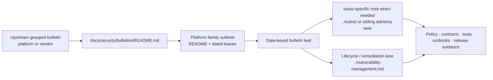

# bulletins

_Date-keyed routing index for KFM platform and vendor security bulletins under `docs/security/bulletins/`._

> **Status:** experimental  
> **Owners:** `@bartytime4life` *(confirmed `/docs/` owner; finer-grained security-owner split still needs verification)*  
>         
> **Quick jumps:** [Scope](#scope) · [Repo fit](#repo-fit) · [Accepted inputs](#accepted-inputs) · [Exclusions](#exclusions) · [Current verified snapshot](#current-verified-snapshot) · [Directory tree](#directory-tree) · [Quickstart](#quickstart) · [Usage](#usage) · [Diagram](#diagram) · [Tables](#tables) · [Task list](#task-list--gates--definition-of-done) · [FAQ](#faq) · [Appendix](#appendix)  
> **Repo fit:** `docs/security/bulletins/README.md` · upstream [`../README.md`](../README.md) · upstream [`../../README.md`](../../README.md) · sibling [`../vulnerability-management.md`](../vulnerability-management.md) · sibling [`../vulns/README.md`](../vulns/README.md) · downstream [`./android/README.md`](./android/README.md) · downstream [`./android/2025-12-android-security-bulletin.md`](./android/2025-12-android-security-bulletin.md)  
>
> [!WARNING]
> **CONFIRMED:** this path exists on public `main`.
>
> **CONFIRMED:** the currently visible family subtree is `android/`, and the public tree shows both a family `README.md` scaffold and one date-keyed bulletin leaf: `2025-12-android-security-bulletin.md`.
>
> **UNKNOWN / NEEDS VERIFICATION:** whether any current KFM release, deployment, or dependency set is actually affected by any bulletin tracked here.

| At a glance | Working rule |
|---|---|
| Lane purpose | Keep grouped upstream security bulletins legible, date-keyed, and cross-linked without letting them replace narrower advisory notes or remediation records. |
| Current public subtree | `android/README.md` scaffold + `android/2025-12-android-security-bulletin.md` |
| Routing rule | Bulletins summarize and route. Deeper KFM-specific impact, remediation, and proof burden belong in `../vulnerability-management.md`, `../vulns/`, or another issue-specific leaf. |
| Checked-in automation signal | Public `main` currently exposes `.github/workflows/README.md` only; do not infer checked-in workflow gates from this lane alone. |
| Trust posture | A bulletin is not proof of local exposure. Keep local affected/unaffected claims bounded until mounted manifests, lockfiles, runtime evidence, or release proof establish them. |

## Truth posture used in this README

| Label | Meaning here |
|---|---|
| **CONFIRMED** | Directly supported by files opened on current public `main` or by adjacent KFM README surfaces already present in the repo. |
| **INFERRED** | Strongly suggested by the observed lane shape or neighboring security docs, but not directly proven as the only live convention. |
| **PROPOSED** | Repo-ready structure or authoring guidance that fits KFM doctrine and the current public tree. |
| **NEEDS VERIFICATION** | A likely repo or runtime fact that should be checked against a mounted checkout, workflow history, or release evidence before being treated as settled. |
| **UNKNOWN** | Not evidenced strongly enough in the current review to state as current reality. |

## Scope

`docs/security/bulletins/` is the narrow security lane for **grouped bulletin-style references**.

This lane is for upstream platform or vendor bulletins that bundle multiple issues, fixes, or patch trains into one dated reference point. In KFM terms, bulletins are useful when a grouped upstream signal matters to review, release, containment, or later maintenance work, but should not be flattened into a passive feed mirror or a second authority for issue-specific remediation.

This directory should answer questions like these:

1. Which bulletin families already have a place in the repo?
2. Is a new upstream item better captured as a **grouped bulletin note** here or as a **narrow advisory leaf** elsewhere?
3. Which deeper KFM docs should a bulletin point to when grouped upstream guidance turns into specific trust, release, or remediation work?
4. Which parts of the bulletin are directly evidenced, and which local exposure claims still need verification?

> [!IMPORTANT]
> A bulletin note should usually **route** readers to narrower KFM notes when the grouped upstream bulletin breaks into one or more issue-specific questions. It should not become the only place where detailed impact, remediation, or closure logic lives.

[Back to top](#bulletins)

## Repo fit

| Item | Value |
|---|---|
| **Path** | `docs/security/bulletins/README.md` |
| **Role in repo** | Directory README for grouped security bulletin references inside the wider `docs/security/` subtree |
| **Upstream** | [`../README.md`](../README.md), [`../../README.md`](../../README.md), [`../vulnerability-management.md`](../vulnerability-management.md), [`../vulns/README.md`](../vulns/README.md) |
| **Downstream** | [`./android/README.md`](./android/README.md), [`./android/2025-12-android-security-bulletin.md`](./android/2025-12-android-security-bulletin.md) |
| **Typical reader** | maintainer, reviewer, release steward, incident responder, later maintainer |
| **What this file should do** | define the bulletin lane, distinguish it from advisory and lifecycle lanes, show the currently visible footprint, and keep grouped upstream signal connected to KFM proof surfaces |
| **What this file must not do** | store secrets, duplicate lifecycle doctrine, replace issue-specific advisory leaves, or imply mounted runtime/package reality without evidence |

### How this lane differs from nearby security docs

| Nearby doc | Owns what | What this bulletin lane should not steal |
|---|---|---|
| [`../README.md`](../README.md) | security subtree orientation | subtree-wide doctrine and lane map |
| [`../vulnerability-management.md`](../vulnerability-management.md) | intake, triage, containment, remediation, validation, disclosure, closure | lifecycle policy and closure process |
| [`../vulns/README.md`](../vulns/README.md) | issue-specific advisory notes and package-family vulnerability leaves | CVE-specific or component-specific detail |
| specific advisory leaves under `../vulns/` or sibling advisory directories | narrow issue history, KFM relevance, mitigation, verification impact, correction lineage | per-issue technical ownership and closure evidence |

### Working relationship

Use `bulletins/` when the source material is naturally **grouped by issuer and date**.

Use `vulns/` or another narrower advisory lane when the work is naturally **grouped by issue, package family, or exploit path**.

Use `vulnerability-management.md` when the question is **how KFM should contain, remediate, validate, disclose, or close** the finding.

[Back to top](#bulletins)

## Accepted inputs

Content that belongs here:

| Accepted input | Why it belongs here |
|---|---|
| Grouped platform or vendor security bulletins | These are naturally bulletin-shaped rather than issue-leaf-shaped |
| Date-keyed monthly or release-keyed bulletin notes | Keeps chronology stable and easy to scan |
| Bulletin summaries that route to narrower KFM notes | Preserves navigation without duplicating deeper remediation detail |
| Platform-family subdirectories when a recurring bulletin stream exists | Prevents unrelated issuers from collapsing into one flat list |
| Family README files that orient a recurring bulletin subtree | Keeps issuer-specific notes grouped without overloading the top-level index |
| Correction, supersession, or replacement notes for previously published bulletin docs | Preserves lineage rather than silently overwriting the trail |
| Cross-links to lifecycle, advisory, policy, contract, test, runbook, and release-evidence surfaces | Keeps the bulletin useful under review pressure |
| Scoped KFM relevance notes | Explains why a bulletin belongs in this repo at all |

### What a good bulletin leaf usually captures

A bulletin note under this lane should normally make room for:

- issuer and bulletin date
- upstream bulletin identifier or title
- grouped issue family or patch scope
- KFM relevance
- linked issue-specific notes where needed
- local exposure status (`CONFIRMED`, `UNKNOWN`, `NEEDS VERIFICATION`, and so on)
- mitigation / containment posture
- verification follow-up
- correction / supersession linkage
- related docs and proof surfaces

## Exclusions

This lane should stay small and sharply routed.

| Keep out of `docs/security/bulletins/` | Where it goes instead |
|---|---|
| Secrets, tokens, keys, or live credentials | secret manager, deployment environment, or other controlled runtime boundary |
| Raw incident artifacts or restricted evidence blobs | governed evidence/artifact stores and steward-only review lanes |
| General remediation lifecycle policy | [`../vulnerability-management.md`](../vulnerability-management.md) |
| One-off CVE or package-family issue detail that needs its own leaf | [`../vulns/README.md`](../vulns/README.md) or a narrower sibling advisory lane |
| Supply-chain doctrine, signing policy, provenance rules, or SBOM guidance | `../supply-chain/` and related supply-chain docs |
| Executable policy expressed only as prose | [`../../../policy/README.md`](../../../policy/README.md) plus the verified policy/test surface |
| Contract bodies, schema authorities, or machine-readable response envelopes | [`../../../contracts/README.md`](../../../contracts/README.md) and the authoritative schema home |
| Unqualified local exposure claims | keep them `UNKNOWN` / `NEEDS VERIFICATION` until mounted repo or runtime proof exists |
| Passive feed mirroring with no KFM routing value | do not add it here |

> [!NOTE]
> A useful rule of thumb: if the material is mainly about **a grouped upstream bulletin series**, it likely belongs here. If it is mainly about **one issue**, **one package family**, or **the lifecycle of remediation**, route it elsewhere.

[Back to top](#bulletins)

## Current verified snapshot

This table records the public-branch evidence used for this revision. It is intentionally narrow.

| Surface | Current public `main` signal | Status |
|---|---|---|
| [`README.md`](./README.md) | Present; current top-level bulletin lane index | **CONFIRMED** |
| [`./android/README.md`](./android/README.md) | Present; family README remains scaffold-only | **CONFIRMED** |
| [`./android/2025-12-android-security-bulletin.md`](./android/2025-12-android-security-bulletin.md) | Present; substantive date-keyed bulletin leaf | **CONFIRMED** |
| [`../README.md`](../README.md) | Security subtree tree and lane map include `bulletins/` | **CONFIRMED** |
| [`../vulnerability-management.md`](../vulnerability-management.md) | Treats advisory/bulletin as part of release, correction, and disclosure posture when required | **CONFIRMED** |
| [`../vulns/README.md`](../vulns/README.md) | Explicitly says bulletin-style references are useful when they route readers to narrower notes | **CONFIRMED** |
| [`../../../.github/workflows/README.md`](../../../.github/workflows/README.md) | Public `main` currently shows `.github/workflows/` as `README.md` only; checked-in workflow YAMLs are not confirmed from the public tree | **CONFIRMED** |
| Additional platform bulletin families | Not present in the current public directory listing | **CONFIRMED** |
| GitHub rulesets, required checks, and platform-side merge gates | Not derivable from public files alone | **UNKNOWN / NEEDS VERIFICATION** |

## Directory tree

> [!CAUTION]
> This tree reflects the files directly verified on current public `main`, not a claim about unpublished branches or private runtime inventory.

```text
docs/security/bulletins/
├── README.md
└── android/
    ├── README.md
    └── 2025-12-android-security-bulletin.md
```

### Observed pattern and growth rule

- **CONFIRMED:** platform family is currently expressed as a subdirectory (`android/`)
- **CONFIRMED:** the visible family subtree currently uses a family `README.md` plus a date-keyed bulletin leaf
- **INFERRED:** the visible leaf suggests a sortable filename pattern like `YYYY-MM-platform-security-bulletin.md`
- **PROPOSED:** add new platform-family subdirectories only when a recurring bulletin stream or review need actually exists

[Back to top](#bulletins)

## Quickstart

### Add or update a bulletin note

1. Read [`../README.md`](../README.md) first to confirm that `bulletins/` is the right security lane.
2. Decide whether the source is a **grouped upstream bulletin** or a **narrow issue/advisory**.
3. If it is the first recurring bulletin for an issuer or platform family, add or refresh that family `README.md`.
4. Add or update the correct date-keyed bulletin leaf here.
5. If any grouped item needs deeper KFM treatment, create or update the narrower note under [`../vulns/README.md`](../vulns/README.md) or another issue-specific advisory lane, then cross-link both ways.
6. If the bulletin changes trust, release, runtime, or mitigation behavior, update the matching governed surfaces in the same change stream:
   - policy
   - contracts / schemas
   - tests / fixtures
   - runbooks
   - release or correction evidence
7. Keep local affected/unaffected claims explicitly bounded until mounted manifests, lockfiles, runtime evidence, or release proof establish them.

### Minimal authoring sequence

```text
1. capture issuer + date
2. summarize grouped scope
3. record KFM relevance
4. link narrower notes if the bulletin breaks into issue-specific work
5. state local exposure as CONFIRMED / UNKNOWN / NEEDS VERIFICATION
6. link mitigation, verification follow-up, and correction/supersession surfaces
```

> [!TIP]
> The safest default is: **grouped bulletin here, issue-specific detail elsewhere**.

## Usage

| When you need to… | Start here | Then go deeper |
|---|---|---|
| Track a grouped upstream platform bulletin | this README | the matching family subtree or date-keyed bulletin leaf under `./` |
| Decide whether a new note belongs in `bulletins/` or `vulns/` | this README | [`../vulns/README.md`](../vulns/README.md) |
| Explain how KFM should contain, remediate, validate, or close the issue | this README for lane routing | [`../vulnerability-management.md`](../vulnerability-management.md) |
| Connect grouped upstream signal to issue-specific KFM notes | this README | narrower leaf under `../vulns/` or another sibling advisory lane |
| Determine whether KFM is actually affected | this README for routing and proof posture | mounted manifests, lockfiles, runtime evidence, and release history |
| Link grouped bulletin work to policy, contracts, tests, or release evidence | this README | [`../../../policy/README.md`](../../../policy/README.md), [`../../../contracts/README.md`](../../../contracts/README.md), [`../../../tests/README.md`](../../../tests/README.md), and the owning release/correction surface |

### Working rule

A bulletin note should help a reviewer or maintainer answer **“what grouped upstream signal matters here, and where do I go next?”**

It should **not** become a detached incident diary, a passive vendor-news mirror, or a substitute for narrower issue records.

[Back to top](#bulletins)

## Diagram



## Tables

### Lane selection matrix

| Content shape | Best home | Why |
|---|---|---|
| Grouped platform or vendor bulletin by date | `docs/security/bulletins/` | natural fit for release- or month-keyed upstream signal |
| One CVE or one package-specific issue note | `docs/security/vulns/` or another narrower advisory lane | issue-specific detail should not be buried in grouped bulletins |
| Cross-cutting remediation lifecycle | `docs/security/vulnerability-management.md` | process and closure logic belong there |
| Supply-chain provenance / signature / SBOM doctrine | `docs/security/supply-chain/` | doctrinal and control-specific, not bulletin-shaped |
| Restricted evidence or live incident material | governed evidence stores / steward review lanes | this lane must not widen exposure |

### Minimum bulletin record

| Field | Why it matters |
|---|---|
| Bulletin date / issuer | anchors chronology and provenance |
| Upstream bulletin title or identifier | gives the leaf a stable reference point |
| Grouped scope | helps readers see what the bulletin covers without opening the upstream source first |
| KFM relevance | explains why the note exists in this repo |
| Linked narrower notes | keeps grouped bulletin routing from replacing issue-specific work |
| Local exposure status | prevents “affected” or “not affected” claims from outrunning evidence |
| Mitigation / containment posture | keeps the note connected to action |
| Verification follow-up | ties the note to proof, not just prose |
| Correction / supersession state | preserves lineage when upstream or local understanding changes |

### What must change together

| If the bulletin changes… | Update alongside this lane |
|---|---|
| Runtime or public-surface behavior | threat model, policy, contracts, tests, and release evidence |
| Mitigation workflow or closure language | `../vulnerability-management.md` |
| Issue-specific assessment | the matching leaf under `../vulns/` or another advisory subtree |
| Correction, rollback, or withdrawal posture | runbooks and correction-linked notes |
| Trust-visible states or denial/abstention behavior | tests and any owning runtime-envelope examples |

[Back to top](#bulletins)

## Task list — gates & definition of done

A bulletin doc change is not done when the prose looks tidy.

It is done when grouped upstream signal stays useful under review pressure and does not create a second authority surface.

### Definition of done

- [ ] The bulletin clearly states **issuer**, **date**, and **grouped scope**.
- [ ] The note distinguishes what is **CONFIRMED** from what still needs verification.
- [ ] Local affected/unaffected language does not outrun mounted evidence.
- [ ] Narrower issue-specific notes are linked when grouped upstream signal breaks into separate KFM questions.
- [ ] Related lifecycle, policy, contract, test, runbook, or release-evidence links are updated when behavior changes.
- [ ] Correction or supersession linkage is visible when the bulletin view changes.
- [ ] The note remains a routing surface, not a passive mirror or second incident archive.

### Release-sensitive assumptions for this lane

| Gate family | Why it matters here |
|---|---|
| Documentation gate | grouped upstream signal should not drift from the deeper notes it routes to |
| Policy / contract / test gates | if behavior changes, prose-only updates are not enough |
| Release assembly / proof-pack gate | a trust-visible change may require release or correction evidence |
| Correction drill | bulletin revisions should preserve lineage rather than overwrite history silently |

> [!TIP]
> A short, well-routed bulletin note is stronger than a long note that mixes grouped vendor news, local assumptions, and unresolved issue detail into one page.

## FAQ

### Is a bulletin the same thing as an advisory leaf?

No. A bulletin is best used for **grouped upstream disclosure**. An advisory leaf is better for **one issue**, **one package family**, or **one exploit/relevance path**.

### Does the existence of a bulletin note prove KFM is affected?

No. This lane records that the grouped upstream signal matters enough to track. Local exposure still has to be proven from mounted manifests, lockfiles, deployed release evidence, or other direct proof.

### Should this directory mirror every upstream bulletin?

No. Add a bulletin here only when it has clear routing, review, release, or maintenance value for KFM.

### Should every grouped bulletin create narrower notes?

No. Create narrower notes only when KFM-specific impact, remediation, verification, or correction work becomes issue-specific enough to deserve its own leaf.

[Back to top](#bulletins)

## Appendix

<details>
<summary><strong>INFERRED / PROPOSED naming and authoring pattern</strong></summary>

### Observed naming pattern

The currently visible example suggests this structure:

```text
docs/security/bulletins/
└── <platform-or-issuer>/
    ├── README.md
    └── YYYY-MM-<platform-or-issuer>-security-bulletin.md
```

### Minimal starter skeleton for a new bulletin leaf

```md
# YYYY-MM <platform> security bulletin

_One-line purpose._

## Summary
## Upstream bulletin
## Grouped scope
## KFM relevance
## Linked narrower notes
## Local exposure status
## Mitigation / containment
## Verification follow-up
## Correction / supersession
## Related docs
```

### Growth rule

Prefer adding a new platform-family subtree only when at least one of these is true:

- there is a recurring bulletin stream worth keeping chronological
- grouped upstream disclosure routinely breaks into narrower KFM notes
- reviewers or operators need a stable routing surface during release or correction work

Otherwise, route the issue through the narrower advisory lane instead of creating a thin new hierarchy.

</details>
