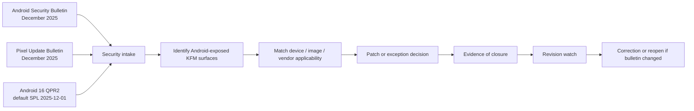

<!-- [KFM_META_BLOCK_V2]
doc_id: kfm://doc/<uuid-needs-verification>
title: Android Security Bulletin — December 2025
type: standard
version: v1
status: draft
owners: <owners-needs-verification>
created: <YYYY-MM-DD-needs-verification>
updated: <YYYY-MM-DD-needs-verification>
policy_label: <policy-label-needs-verification>
related: [<related-paths-or-kfm-ids-needs-verification>]
tags: [kfm, security, android, bulletin, mobile]
notes: [workspace evidence in this session was PDF-only; official Android facts were rechecked because they are version-sensitive; KFM Android fleet/app topology remains UNKNOWN]
[/KFM_META_BLOCK_V2] -->

# Android Security Bulletin — December 2025

Official December 2025 Android patch and revision intake translated into a KFM-ready bulletin for Android-exposed surfaces.

**Repo fit:** `docs/security/bulletins/android/2025-12-android-security-bulletin.md`  
**Role:** monthly security intake + rollout note + revision-watch record  
**Truth posture:** CONFIRMED official bulletin facts · INFERRED KFM Android/mobile relevance · PROPOSED KFM actions · UNKNOWN mounted Android fleet/app topology  
**Audience:** security, platform, mobile, field, stewardship, release review

**Quick jump:** [Scope](#scope) · [Official summary](#official-summary) · [KFM relevance](#kfm-relevance) · [Required actions](#required-actions) · [Verification checklist](#verification-checklist) · [Revision watch](#revision-watch) · [Explicit unknowns](#explicit-unknowns)

> [!IMPORTANT]
> Treat **`2025-12-05`** as the minimum target security patch level for full standard coverage of the December 2025 Android bulletin.

> [!WARNING]
> This bulletin changed after initial publication. Several CVEs were later removed because Google recorded incomplete fixes or regression risk. Do not use an early-December snapshot as final closure evidence.

> [!NOTE]
> This file does **not** assert that KFM currently ships a verified Android app, rugged device fleet, kiosk image, or custom Android build. Those implementation details remain **UNKNOWN** until the mounted repository, fleet inventory, or operations evidence is directly inspected.

---

## Scope

| Area | Included here | Not included here |
|---|---|---|
| Official bulletin basis | Android Security Bulletin — December 2025; Pixel Update Bulletin — December 2025; Android 16 QPR2 security release notes | OEM bulletins not yet reviewed in this session |
| KFM fit | Evidence-first interpretation, trust-visible rollout notes, correction-minded revision watch | Claims about mounted app modules, MDM policy, or release automation not directly verified |
| Surface focus | Android phones, tablets, kiosks, field devices, steward devices, custom Android images, Android-backed mobile map clients | iOS, desktop-only clients, generic Linux host patching |
| Outcome | Practical intake summary, action table, verification checklist, explicit unknowns | Device-by-device remediation proof |

### Accepted inputs

- Official Android security bulletins and release notes
- Verified device inventory exports
- Verified owner/team assignments
- Verified OEM / SoC applicability notes
- Verified patch and exception evidence

### Exclusions

- Speculation about unverified KFM Android apps or fleet size
- Unsupported owner assignments
- OEM-specific closure claims without a verified vendor bulletin
- “Fully resolved” language that ignores later bulletin revisions

---

## Status snapshot

| Topic | Status | Working interpretation |
|---|---|---|
| Official December 2025 Android facts | **CONFIRMED** | Use Google / AOSP bulletin facts directly |
| Relevance to KFM Android-exposed surfaces | **INFERRED** | The path and attached mobile mapping corpus justify an Android bulletin lane |
| KFM rollout actions | **PROPOSED** | Safe next actions are listed below; implementation remains unverified |
| KFM Android fleet, owners, and tooling | **UNKNOWN** | No mounted repo tree, device inventory, workflow YAML, or MDM evidence was directly visible |
| Bulletin closure after later revisions | **NEEDS VERIFICATION** | Recheck whether local CVE tracking, exception logs, and closure memos still match the revised bulletin |

---

## Official summary

| Item | December 2025 position |
|---|---|
| Bulletin publication | Published in early December 2025 |
| Bulletin revision state | Later revised after publication |
| Security patch levels | `2025-12-01` and `2025-12-05` |
| Full standard bulletin coverage | `2025-12-05` |
| Most severe issue called out by Google | Critical **Framework** vulnerability that could lead to remote denial of service |
| Exploitation note | Google indicated limited, targeted exploitation for selected December 2025 issues |
| Google Play system update / Mainline note | No security issues were listed for Project Mainline that month |
| Pixel note | Supported Pixel devices received December coverage at `2025-12-05` |
| Android 16 QPR2 note | Android 16 QPR2 in AOSP defaults to security patch level `2025-12-01` |

### Component areas worth explicit review

| Area | Why it matters operationally |
|---|---|
| Framework | Highest-severity area in the monthly bulletin summary |
| System | Relevant for local privilege escalation and user-facing runtime behavior |
| Kernel | Important for device hardening, especially vendor and virtualization-related fixes |
| GPU / graphics stack | Relevant for map-heavy clients, terrain, vector rendering, camera overlays, and field devices |
| Partner silicon / modem / bootloader components | Important for rugged devices, specialized tablets, and vendor-skewed Android fleets |
| Custom Android images | Need explicit upstream-vs-vendor patch accounting; default AOSP patch levels may not equal full monthly coverage |

---

## Intake and action flow



---

## KFM relevance

KFM doctrine treats external, version-sensitive facts as inputs that should be rechecked from authoritative sources and then translated into governed decisions without inventing repo or runtime reality. That is the correct posture for Android security bulletins.

In KFM terms, an Android bulletin is not just a news item. It is an operational input that may affect:

- **public-safe mobile reading surfaces**
- **field and stewardship devices**
- **any Android-hosted map shell**
- **export or capture workflows**
- **camera, GNSS, offline-map, and sensor-bearing devices**
- **custom Android images or kiosk deployments**

If KFM operates Android-backed trust-visible surfaces, those surfaces must remain downstream of governed APIs, policy evaluation, evidence resolution, and correction visibility. Security posture therefore matters not only for device hygiene, but also for trust-bearing product behavior.

### Trust-bearing surfaces this bulletin could affect

| Surface | Why Android matters |
|---|---|
| Map Explorer | Mobile map rendering, location access, gesture handling, offline cache, and field viewing |
| Timeline | Mobile inspection and comparison flows in constrained device conditions |
| Dossier | Feature- or place-centered reading on phones or tablets |
| Evidence Drawer | Immediate provenance access on field or steward devices |
| Focus Mode | Scoped, evidence-bounded synthesis on mobile clients if such a surface exists |
| Export | Device-side preview, download, and validation touchpoints |
| Review / Stewardship | Quarantine, correction, and moderation actions from secured devices |

---

## Required actions

| Priority | Action | Status | Applies to | Completion rule |
|---|---|---|---|---|
| P1 | Require minimum Android security patch level `2025-12-05` for normal December 2025 closure | **PROPOSED** | Managed Android phones, tablets, kiosks, rugged devices | Inventory shows compliant SPL or an approved exception |
| P1 | Patch supported Pixel devices to the December 2025 Pixel release level | **PROPOSED** | Pixel fleet, test devices, staff devices | Pixel devices report `2025-12-05` or later |
| P1 | Review Android 16 QPR2 images separately from standard vendor builds | **PROPOSED** | AOSP-derived images, custom system images, emulator baselines | Upstream `2025-12-01` coverage is explicitly reconciled with any needed vendor `2025-12-05` coverage |
| P1 | Match device classes to partner-component exposure | **PROPOSED** | MediaTek, Unisoc, Qualcomm, Arm, Imagination-dependent devices | Each device class is mapped to vendor applicability and patch status |
| P1 | Keep the December bulletin open until revision history is checked | **PROPOSED** | Security intake workflow | Local closure memo reflects the revised bulletin, not only the initial publication |
| P2 | Record unsupported or delayed devices in an explicit exception register | **PROPOSED** | Legacy devices, field devices awaiting carrier/OEM rollout | Exception includes owner, role, risk, compensating controls, target retirement date |
| P2 | Reopen any local CVE-specific closure that names later-removed December 2025 CVEs | **PROPOSED** | Security tickets, audit trails, compliance evidence | Ticket updated, superseded, or corrected |
| P3 | Link this bulletin to KFM correction and release evidence | **PROPOSED** | Security documentation and ops evidence | Closure note includes revision-watch timestamp and evidence pointers |

---

## Verification checklist

### Fleet / image inventory

- [ ] Export Android device inventory by **owner, role, model, vendor, Android version, and security patch level**
- [ ] Separate **Pixel**, **non-Pixel OEM**, **rugged / field**, and **custom-image** classes
- [ ] Identify which devices are **public-facing**, **steward-only**, or **field-only**
- [ ] Identify any Android devices used for **camera, GNSS, offline map, or capture** workflows

### Patch verification

- [ ] Confirm `ro.build.version.security_patch`
- [ ] Confirm update channel / build fingerprint
- [ ] Confirm whether devices require OEM follow-on bulletins beyond Google’s bulletin
- [ ] Confirm whether Android 16 QPR2 images need additional vendor delta handling

### Closure evidence

- [ ] Store compliant inventory snapshot
- [ ] Store exception register for noncompliant devices
- [ ] Record bulletin revision check date
- [ ] Record final decision note for December 2025 closure

### Illustrative device checks

```bash
adb shell getprop ro.build.version.security_patch
adb shell getprop ro.build.fingerprint
adb shell getprop ro.product.manufacturer
adb shell getprop ro.product.model
adb shell getprop ro.board.platform
```

```text
Minimum expected result for normal December 2025 closure:
ro.build.version.security_patch >= 2025-12-05
```

> [!TIP]
> Use the same inventory pass to separate **supported**, **temporarily accepted with compensating controls**, and **retire immediately** device classes. Do not collapse these into one “patched / unpatched” bucket.

---

## Revision watch

The December 2025 Android bulletin was revised after its initial publication. Treat that as an operational requirement, not a footnote.

| Revision point | Change recorded in the official bulletin | Why KFM should care |
|---|---|---|
| 2025-12-17 | CVE-2025-48600 and CVE-2025-48615 removed | Early closure notes may overstate fix completeness |
| 2026-01-08 | CVE-2025-48631 removed | Android 16-specific closure records may need reopening |
| 2026-02-10 | CVE-2025-48612 removed because of possible regression affecting default payment apps | Device policy and field workflow assumptions may need review |
| 2026-03-03 | CVE-2025-48565 removed | CVE-level compliance language may be stale |
| 2026-03-06 | CVE-2025-48566 and CVE-2025-48564 removed because they share a fix with CVE-2025-48565 | Related closure records may need correction or supersession |

### Operational rule

If any internal ticket, attestation, audit note, or exception memo claims December 2025 closure by naming one of the later-removed CVEs above, reopen the record and correct it rather than silently leaving the earlier statement in place.

---

## Explicit unknowns

| Unknown | Why it stays visible |
|---|---|
| Exact owners for this bulletin path | No mounted repo ownership markers for this file were directly verified |
| Adjacent security-bulletin index structure | Nearby repo markdown was not directly visible |
| Existing KFM Android app modules | No mounted repo tree or Android module inventory was directly inspected |
| Existing Android MDM / EMM enforcement | No workflow, fleet, or operations evidence was directly mounted |
| Device inventory and exceptions register | No current-session fleet export was visible |
| Whether KFM runs custom Android / AOSP-derived images | No direct image or manifest evidence was visible |
| Whether this bulletin already has a monthly intake workflow | No mounted workflow YAML or run evidence was visible |

---

## Source basis

### Official external basis

- Android Security Bulletin — December 2025
- Pixel Update Bulletin — December 2025
- Android 16 QPR2 Security Release Notes

### Project basis

- Attached March 2026 KFM doctrine and master-reference manuals
- Attached KFM mobile / renderer ecosystem research material
- Requested path itself: `docs/security/bulletins/android/2025-12-android-security-bulletin.md`

### Evidence rule used in this draft

- Use official external sources for version-sensitive Android facts
- Keep KFM implementation depth explicit where the mounted workspace was not directly visible
- Prefer a correction-friendly bulletin that can survive later bulletin revisions

---

## Maintenance note

Update this file if any of the following changes surface:

1. KFM Android fleet inventory becomes directly visible
2. Owners or adjacent bulletin indexes are verified
3. OEM-specific follow-on bulletins materially change applicability
4. Additional official revisions are made to the December 2025 bulletin record
5. Mounted repo evidence proves an Android client, kiosk image, or custom Android build path

[Back to top](#android-security-bulletin--december-2025)
