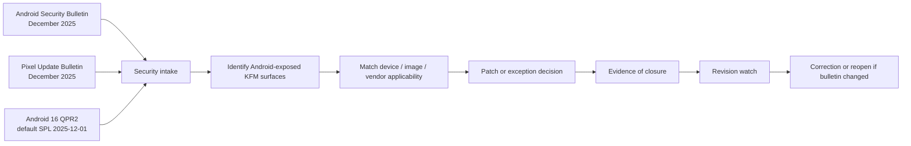

<!-- [KFM_META_BLOCK_V2]
doc_id: kfm://doc/<uuid-needs-verification>
title: Android Security Bulletin — December 2025
type: standard
version: v1
status: draft
owners: @bartytime4life
created: <YYYY-MM-DD-needs-verification>
updated: 2026-04-06
policy_label: public
related: [./README.md, ../README.md, ../../README.md, ../../vulnerability-management.md, ../../vulns/README.md]
tags: [kfm, security, android, bulletin, mobile, revision-watch]
notes: [Broad /docs/ CODEOWNERS coverage is confirmed; narrower security-lane ownership still needs verification, created date needs verification, official Android facts were rechecked against current source.android.com pages, KFM Android fleet/app topology remains UNKNOWN]
[/KFM_META_BLOCK_V2] -->

# Android Security Bulletin — December 2025

Official December 2025 Android patch and revision intake translated into a KFM-ready bulletin for Android-exposed surfaces.

> [!NOTE]
> **Status:** draft  
> **Owners:** `@bartytime4life` *(current public `/.github/CODEOWNERS` covers `/docs/`; any narrower security-lane split still needs verification)*  
>        
> **Quick jumps:** [Scope](#scope) · [Current public repo signals](#current-public-repo-signals) · [Status snapshot](#status-snapshot) · [Upstream bulletin anchors](#upstream-bulletin-anchors) · [Official summary](#official-summary) · [Patch-level interpretation](#patch-level-interpretation) · [KFM routing](#kfm-routing) · [KFM relevance](#kfm-relevance) · [Required actions](#required-actions) · [Verification checklist](#verification-checklist) · [Revision watch](#revision-watch) · [Explicit unknowns](#explicit-unknowns)  
> **Repo fit:** `docs/security/bulletins/android/2025-12-android-security-bulletin.md` → family README [`./README.md`](./README.md) · bulletin index [`../README.md`](../README.md) · security hub [`../../README.md`](../../README.md) · lifecycle owner [`../../vulnerability-management.md`](../../vulnerability-management.md) · narrower issue lane [`../../vulns/README.md`](../../vulns/README.md)  
> **Upstream anchors:** [Android Security Bulletin — December 2025][asb] · [Pixel Update Bulletin — December 2025][pixel] · [Android 16 QPR2 Security Release Notes][qpr2]

> [!IMPORTANT]
> Treat **`2025-12-05`** as the minimum **platform security patch level** for full standard coverage of the December 2025 Android Security Bulletin.

> [!WARNING]
> This bulletin changed after initial publication. Several CVEs were later removed from the December 2025 bulletin record because of incomplete fixes or regression risk. Do **not** use an early-December snapshot as final closure evidence.

> [!CAUTION]
> On some Android 10+ devices, the **Google Play system update** can show a **`2025-12-01`** date string. That is **not** a substitute for verifying the **platform** security patch level needed for full December bulletin coverage.

> [!NOTE]
> This file does **not** assert that KFM currently ships a verified Android app, rugged device fleet, kiosk image, or custom Android build. Those implementation details remain **UNKNOWN** until mounted repository, fleet, or runtime evidence proves them.

---

## Scope

| Area | Included here | Not included here |
| --- | --- | --- |
| Official bulletin basis | Android Security Bulletin — December 2025; Pixel Update Bulletin — December 2025; Android 16 QPR2 security release notes | OEM bulletins not rechecked in this leaf |
| KFM fit | Evidence-first interpretation, trust-visible rollout notes, correction-minded revision watch | Claims about mounted app modules, MDM policy, or release automation not directly verified |
| Surface focus | Android phones, tablets, kiosks, field devices, steward devices, custom Android images, Android-backed mobile map clients | iOS, desktop-only clients, generic Linux host patching |
| Outcome | Practical intake summary, action table, verification checklist, routing guidance, explicit unknowns | Device-by-device remediation proof or OEM-specific closure claims |

### Accepted inputs

- Official Android security bulletins and release notes
- Verified device inventory exports
- Verified owner or team assignments
- Verified OEM / SoC applicability notes
- Verified patch and exception evidence
- Verified links to narrower KFM security notes when issue detail grows

### Exclusions

- Speculation about unverified KFM Android apps or fleet size
- Unsupported owner assignments
- OEM-specific closure claims without a verified vendor bulletin
- “Fully resolved” language that ignores later bulletin revisions
- Package- or CVE-centered deep dives that belong in [`../../vulns/README.md`](../../vulns/README.md)
- Cross-cutting lifecycle or triage process guidance that belongs in [`../../vulnerability-management.md`](../../vulnerability-management.md)

---

## Current public repo signals

| Signal | Status | Why it matters here |
| --- | --- | --- |
| `docs/security/bulletins/android/` exists on current public `main` | **CONFIRMED** | This bulletin lives inside a real checked-in Android bulletin lane, not a speculative path |
| `docs/security/bulletins/android/2025-12-android-security-bulletin.md` already exists as a month-scoped leaf | **CONFIRMED** | Keep this page narrow, month-bounded, and easy to supersede or extend |
| `docs/security/bulletins/README.md` and `docs/security/bulletins/android/README.md` already provide lane-level routing | **CONFIRMED** | This leaf should not duplicate index-level behavior |
| `docs/security/vulnerability-management.md` owns lifecycle, triage, containment, remediation, validation, disclosure, and closure guidance | **CONFIRMED** | Process detail should route outward instead of expanding this leaf into a lifecycle manual |
| `docs/security/vulns/README.md` exists as the narrower advisory / issue lane | **CONFIRMED** | CVE-, package-, or exploit-path detail can be split or linked there |
| Android-exposed runtime surfaces, fleet inventory, and enforcement wiring | **UNKNOWN** | Public docs do not prove live Android packages, devices, MDM rules, or runtime emitters |

---

## Status snapshot

| Topic | Status | Working interpretation |
| --- | --- | --- |
| Official December 2025 Android facts | **CONFIRMED** | Use the current official Android / Pixel / QPR2 pages directly |
| Public repo lane placement | **CONFIRMED** | The Android bulletin lane and this month-scoped leaf are checked in on current public `main` |
| Relevance to Android-exposed KFM surfaces | **INFERRED** | KFM doctrine plus mobile-capable map/rendering material justify treating Android as a potential trust-bearing surface |
| KFM rollout actions | **PROPOSED** | Safe next actions are listed below; implementation remains unverified |
| KFM Android fleet, app, and MDM topology | **UNKNOWN** | No private runtime, fleet, or release evidence was directly inspected |
| Bulletin closure after later revisions | **NEEDS VERIFICATION** | Recheck whether local CVE tracking, exception logs, and closure memos still match the revised bulletin |

---

## Upstream bulletin anchors

| Source | Published / updated | What it establishes for this leaf |
| --- | --- | --- |
| [Android Security Bulletin — December 2025][asb] | Published **2025-12-01** · updated **2026-03-06** | Official patch levels, revision history, targeted-exploitation note, component families, and Project Mainline status |
| [Pixel Update Bulletin — December 2025][pixel] | Published **2025-12-02** | Supported Pixel devices move to **`2025-12-05`** and include both Pixel-specific fixes and December ASB coverage |
| [Android 16 QPR2 Security Release Notes][qpr2] | Published **2025-12-02** | Android 16 QPR2 as released on AOSP defaults to **`2025-12-01`**, which must be interpreted carefully against full ASB coverage |

---

## Official summary

| Item | December 2025 position |
| --- | --- |
| Android bulletin publication / latest official revision | Published **2025-12-01**; official page updated **2026-03-06** |
| Security patch levels in the Android bulletin | `2025-12-01` and `2025-12-05` |
| Full standard bulletin coverage | `2025-12-05` |
| Most severe issue called out by Google | Critical **Framework** issue that could lead to remote denial of service |
| Explicit exploitation note | Google flagged **CVE-2025-48633** and **CVE-2025-48572** as possibly under limited, targeted exploitation |
| Google Play system updates / Project Mainline | No security issues were addressed there that month |
| Pixel bulletin outcome | Supported Pixel devices receive **`2025-12-05`** coverage |
| Android 16 QPR2 outcome | Android 16 QPR2, as released on AOSP, defaults to **`2025-12-01`** |

### Component families worth explicit review

| Bulletin family | Why it matters operationally |
| --- | --- |
| Framework / System / Kernel LTS | Direct platform patch adoption still matters for core runtime behavior and hardening |
| Arm Mali / Imagination PowerVR GPU families | Graphics-heavy field or map clients can inherit vendor-specific GPU exposure |
| MediaTek / Unisoc modem and preloader families | Device-class mapping must include SoC and OEM bulletin applicability |
| Qualcomm kernel / bootloader / closed-source components | Some devices may need Qualcomm bulletin tracking in addition to the platform bulletin |
| Custom Android / AOSP-derived images | Upstream `2025-12-01` coverage must be reconciled explicitly against any needed `2025-12-05` vendor or downstream delta |

---

## Patch-level interpretation

| Signal | What it proves | What it does **not** prove |
| --- | --- | --- |
| `ro.build.version.security_patch = 2025-12-01` | Device includes fixes associated with the `2025-12-01` level | Full December 2025 bulletin coverage |
| `ro.build.version.security_patch = 2025-12-05` | Device includes fixes associated with the `2025-12-05` level and earlier levels in the December bulletin | OEM-specific applicability, exception approval, or local KFM closure evidence |
| Google Play system update date string `2025-12-01` | A Project Mainline / Google Play system update signal may be present on some Android 10+ devices | A substitute for the platform security patch level needed for full December bulletin coverage |
| Android 16 QPR2 default `2025-12-01` | AOSP QPR2 release notes are covered at that default level | That a custom image, OEM image, or downstream release automatically satisfies the full standard bulletin |

---

## Intake and action flow



---

## KFM routing

| If the question is mainly about… | Go here | Why |
| --- | --- | --- |
| Android bulletin family context | [`./README.md`](./README.md) | The Android bulletin lane stays the family index |
| Cross-platform bulletin routing | [`../README.md`](../README.md) | The broader bulletin subtree stays date-keyed and grouped |
| Vulnerability lifecycle, triage, containment, remediation, validation, or disclosure | [`../../vulnerability-management.md`](../../vulnerability-management.md) | That file owns lifecycle behavior |
| CVE-, package-, exploit-path-, or implementation-specific detail | [`../../vulns/README.md`](../../vulns/README.md) | That lane owns narrower advisory notes |
| Security subtree context | [`../../README.md`](../../README.md) | Use the root security README for broader trust-membrane and supply-chain context |

> [!TIP]
> Keep this file as the month-scoped routing hub. When a December 2025 issue needs deeper local analysis, add or link a narrower note instead of letting this bulletin become a second lifecycle manual.

---

## KFM relevance

KFM doctrine treats external, version-sensitive facts as inputs that should be rechecked from authoritative sources and then translated into governed decisions without inventing repo or runtime reality. That is the correct posture for Android security bulletins.

In KFM terms, an Android bulletin is not just a news item. It is an operational input that may affect:

- **public-safe mobile reading surfaces**
- **field and stewardship devices**
- **any Android-hosted map shell**
- **export or capture workflows**
- **camera, GNSS, offline-map, and sensor-bearing devices**
- **custom Android images or kiosk deployments**

If KFM operates Android-backed trust-visible surfaces, those surfaces must remain downstream of governed APIs, policy evaluation, evidence resolution, and correction visibility. Security posture therefore matters not only for device hygiene, but also for trust-bearing product behavior.

This remains a **surface relevance inference**, not proof that any specific Android client or fleet is currently shipping inside KFM.

### Trust-bearing surfaces this bulletin could affect

| Surface | Why Android matters |
| --- | --- |
| Map Explorer | Mobile map rendering, location access, gesture handling, offline cache, and field viewing |
| Timeline | Mobile inspection and comparison flows in constrained device conditions |
| Dossier | Feature- or place-centered reading on phones or tablets |
| Evidence Drawer | Immediate provenance access on field or steward devices |
| Focus Mode | Scoped, evidence-bounded synthesis on mobile clients if such a surface exists |
| Export | Device-side preview, download, and validation touchpoints |
| Review / Stewardship | Quarantine, correction, and moderation actions from secured devices |

---

## Required actions

| Priority | Action | Status | Applies to | Completion rule |
| --- | --- | --- | --- | --- |
| P1 | Require minimum **platform** security patch level `2025-12-05` for normal December 2025 closure | **PROPOSED** | Managed Android phones, tablets, kiosks, rugged devices | Inventory shows compliant platform SPL or an approved exception |
| P1 | Distinguish platform SPL from Google Play system update date when recording closure | **PROPOSED** | Android 10+ devices where both dates can appear | Closure evidence records both signals and does not treat Mainline date as full bulletin coverage |
| P1 | Patch supported Pixel devices to the December 2025 Pixel release level | **PROPOSED** | Pixel fleet, test devices, staff devices | Pixel devices report `2025-12-05` or later |
| P1 | Review Android 16 QPR2 images separately from standard vendor builds | **PROPOSED** | AOSP-derived images, custom system images, emulator baselines | Upstream `2025-12-01` coverage is explicitly reconciled with any needed vendor `2025-12-05` coverage |
| P1 | Match device classes to partner-component exposure | **PROPOSED** | Arm, Imagination, MediaTek, Unisoc, Qualcomm-dependent devices | Each device class is mapped to vendor applicability and patch status |
| P1 | Keep the December bulletin open until revision history is checked against the current official page | **PROPOSED** | Security intake workflow | Local closure memo reflects the revised bulletin, not only the initial publication |
| P2 | Record unsupported or delayed devices in an explicit exception register | **PROPOSED** | Legacy devices, field devices awaiting carrier / OEM rollout | Exception includes owner, role, risk, compensating controls, and target retirement date |
| P2 | Reopen any local CVE-specific closure that names later-removed December 2025 CVEs | **PROPOSED** | Security tickets, audit trails, compliance evidence | Ticket updated, superseded, or corrected |
| P3 | Route any December 2025 issue-specific deep dive into a narrower security leaf | **PROPOSED** | CVE-specific or package-specific follow-on work | Bulletin stays summary/routing-focused and links out to the narrower note |
| P3 | Link this bulletin to KFM correction and release evidence | **PROPOSED** | Security documentation and ops evidence | Closure note includes revision-watch timestamp and evidence pointers |

---

## Verification checklist

### Fleet / image inventory

- [ ] Export Android device inventory by **owner, role, model, vendor, Android version, and security patch level**
- [ ] Separate **Pixel**, **non-Pixel OEM**, **rugged / field**, and **custom-image** classes
- [ ] Identify which devices are **public-facing**, **steward-only**, or **field-only**
- [ ] Identify any Android devices used for **camera, GNSS, offline map, or capture** workflows
- [ ] Record whether any affected device line is **AOSP-derived**, **OEM-managed**, or **carrier-gated**

### Patch verification

- [ ] Confirm `ro.build.version.security_patch`
- [ ] Confirm build fingerprint and update channel
- [ ] Record Google Play system update date separately when present on Android 10+
- [ ] Confirm whether devices require OEM follow-on bulletins beyond Google’s bulletin
- [ ] Confirm whether Android 16 QPR2 images need additional vendor delta handling

### Closure evidence

- [ ] Store compliant inventory snapshot
- [ ] Store exception register for noncompliant devices
- [ ] Record bulletin revision check date
- [ ] Record final decision note for December 2025 closure
- [ ] Link any deeper issue notes created under `../../vulns/`

### Illustrative device checks

```bash
adb shell getprop ro.build.version.security_patch
adb shell getprop ro.build.fingerprint
adb shell getprop ro.product.manufacturer
adb shell getprop ro.product.model
adb shell getprop ro.board.platform
```

```text
Minimum expected result for normal December 2025 closure:
ro.build.version.security_patch >= 2025-12-05
```

> [!TIP]
> Use the same inventory pass to separate **supported**, **temporarily accepted with compensating controls**, and **retire immediately** device classes. Do not collapse these into one “patched / unpatched” bucket.

---

## Revision watch

The December 2025 Android bulletin was revised after its initial publication. Treat that as an operational requirement, not a footnote.

| Date | Change recorded on the official bulletin page | Why KFM should care |
| --- | --- | --- |
| 2025-12-04 | AOSP links added to the bulletin | Cached or mirrored early copies may not reflect the linked patch state |
| 2025-12-17 | CVE-2025-48600 and CVE-2025-48615 removed because of an incomplete fix | Early closure notes may overstate fix completeness |
| 2026-01-08 | CVE-2025-48631 removed because of an incomplete fix for Android 16 25Q4 | Android 16 QPR2 or adjacent custom-image closure records may need reopening |
| 2026-02-10 | CVE-2025-48612 removed because of a possible regression affecting default payment apps | Device policy and field workflow assumptions may need review |
| 2026-03-03 | CVE-2025-48565 removed because of an incomplete fix | CVE-level compliance language may be stale |
| 2026-03-06 | CVE-2025-48566 and CVE-2025-48564 removed because they share a fix with CVE-2025-48565 | Related closure records may need correction or supersession |

### Operational rule

If any internal ticket, attestation, audit note, or exception memo claims December 2025 closure by naming one of the later-removed CVEs above, reopen the record and correct it rather than silently leaving the earlier statement in place.

> [!IMPORTANT]
> For this leaf, the **current baseline** is the official December 2025 Android Security Bulletin page **as updated on 2026-03-06**, not a cached first-publication copy.

---

## Explicit unknowns

| Unknown | Why it stays visible |
| --- | --- |
| Whether any current KFM release actually targets Android phones, tablets, kiosks, or field devices | Current public repo docs do not prove a live Android surface or packaged Android client |
| Existing Android MDM / EMM enforcement | No fleet, workflow, or runtime policy evidence was directly inspected |
| Device inventory and exceptions register | No current-session fleet export was visible |
| Whether KFM runs custom Android / AOSP-derived images | No mounted image manifests or build definitions were directly inspected |
| OEM-specific applicability for exact device models and SoCs | This leaf did not recheck vendor bulletins model by model |
| Whether this bulletin already participates in a scheduled monthly intake workflow | Public docs do not prove a live workflow YAML or runtime emitter for this lane |
| Whether any deeper December 2025 issue notes already exist outside the visible `vulns/` lane | No mounted private branch or runtime evidence was available |

---

## Source basis

### Official external basis

- [Android Security Bulletin — December 2025][asb]
- [Pixel Update Bulletin — December 2025][pixel]
- [Android 16 QPR2 Security Release Notes][qpr2]

### Project basis

- Current public `docs/security/` subtree and `/.github/CODEOWNERS`
- Attached March 2026 KFM doctrine and master-reference manuals
- Attached KFM mobile / renderer ecosystem research material
- This checked-in path itself: `docs/security/bulletins/android/2025-12-android-security-bulletin.md`

### Evidence rule used in this draft

- Use official Android sources for version-sensitive bulletin facts
- Use current public repo tree for checked-in path, routing, and ownership-surface facts
- Keep KFM Android implementation depth explicit where mounted fleet or runtime evidence is absent
- Prefer a correction-friendly bulletin leaf that can survive later bulletin revisions without bluffing exposure or closure state

---

## Maintenance note

Update this file when any of the following changes surface:

1. KFM Android fleet inventory becomes directly visible
2. A narrower security-lane owner split is verified for this path
3. OEM-specific follow-on bulletins materially change applicability for tracked devices
4. Additional official revisions are made to the December 2025 bulletin record
5. Mounted repo or runtime evidence proves an Android client, kiosk image, or custom Android build path
6. A December 2025 issue note is added under `../../vulns/` and should be linked from this leaf

[Back to top](#android-security-bulletin--december-2025)

[asb]: https://source.android.com/docs/security/bulletin/2025-12-01
[pixel]: https://source.android.com/docs/security/bulletin/pixel/2025-12-01
[qpr2]: https://source.android.com/docs/security/bulletin/android-16-qpr2