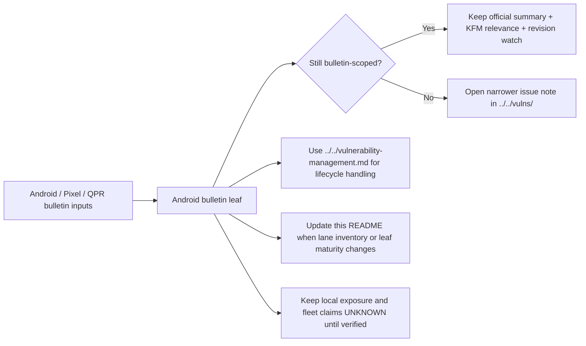

<!-- [KFM_META_BLOCK_V2]
doc_id: kfm://doc/NEEDS-VERIFICATION
title: Android Security Bulletins
type: standard
version: v1
status: draft
owners: @bartytime4life
created: YYYY-MM-DD
updated: YYYY-MM-DD
policy_label: public
related: [../../README.md, ../README.md, ../../vulnerability-management.md, ../../vulns/README.md, ./2025-12-android-security-bulletin.md, ../../../../.github/CODEOWNERS]
tags: [kfm, security, bulletins, android]
notes: [Owners grounded in current public /.github/CODEOWNERS broad /docs/ coverage; doc_id and dates still need verification.]
[/KFM_META_BLOCK_V2] -->

# Android Security Bulletins

Android-family bulletin index and routing surface for KFM security notes that originate in Android platform advisories.

> [!NOTE]
> **Status:** experimental  
> **Owners:** `@bartytime4life` *(confirmed broad `/docs/` coverage via `/.github/CODEOWNERS`; any narrower Android- or security-specific split still needs verification)*  
>       
> **Quick jumps:** [Scope](#scope) · [Evidence boundary](#evidence-boundary) · [Current public deltas](#current-public-deltas) · [Repo fit](#repo-fit) · [Accepted inputs](#accepted-inputs) · [Exclusions](#exclusions) · [Current verified snapshot](#current-verified-snapshot) · [Directory tree](#directory-tree) · [Quickstart](#quickstart) · [Usage](#usage) · [Diagram](#diagram) · [Tables](#tables) · [Task list](#task-list--gates--definition-of-done) · [FAQ](#faq) · [Appendix](#appendix)  
> **Repo fit:** `docs/security/bulletins/android/README.md` · upstream [`../README.md`](../README.md) · upstream [`../../README.md`](../../README.md) · sibling [`../../vulnerability-management.md`](../../vulnerability-management.md) · sibling [`../../vulns/README.md`](../../vulns/README.md) · leaf [`./2025-12-android-security-bulletin.md`](./2025-12-android-security-bulletin.md)

> [!IMPORTANT]
> This directory is the Android-family bulletin lane inside `docs/security/bulletins/`. Keep it bulletin-scoped, source-aware, and correction-friendly. Do not let it silently absorb lifecycle policy, package-level advisory depth, or unsupported fleet claims.

> [!WARNING]
> Current public `main` already shows a substantive December 2025 Android bulletin leaf. This README should track **real lane maturity and routing reality**, not preserve older scaffold-only snapshots.

## Scope

Use this directory for Android-family security bulletin intake that needs KFM-specific routing, verification posture, and follow-up guidance.

Good fits:

- date-keyed Android bulletin leaves
- Android / Pixel / AOSP security-release intake notes
- short KFM relevance framing for mobile, field, kiosk, or Android-backed trust surfaces
- revision-watch notes when upstream bulletin facts change after initial publication
- routing links to narrower vulnerability or lifecycle lanes

This directory should **not** be the primary home for:

- cross-cutting vulnerability lifecycle policy
- package- or CVE-specific deep dives
- OEM closure claims without verified vendor bulletins
- generic Android hardening guidance unrelated to a specific bulletin family
- unsupported statements that KFM is affected, patched, or unaffected

## Evidence boundary

| Evidence layer | What this README treats as settled |
| --- | --- |
| Current public `main` tree | the existence of `docs/security/bulletins/android/README.md` and `./2025-12-android-security-bulletin.md`, plus the broader `docs/security/` and `docs/security/bulletins/` routing surfaces |
| `/.github/CODEOWNERS` | broad owner coverage for `/docs/` resolving to `@bartytime4life` |
| Adjacent security docs | lane boundaries between grouped bulletins, vulnerability lifecycle, and issue-specific advisory notes |
| Dated Android bulletin leaves already checked in | current leaf maturity, section shape, and the need for family-level synchronization when leaves evolve |
| Platform-only controls, live Android fleet inventory, MDM policy, OEM rollout evidence, required checks, non-public workflows, deployment manifests | **UNKNOWN** or **NEEDS VERIFICATION** until the active checkout or runtime proves them |

## Current public deltas

| Delta | Why it matters now | Status |
| --- | --- | --- |
| `docs/security/bulletins/README.md` is substantive, not scaffold-only | the Android family lane sits under a real grouped-bulletin index with explicit sync expectations | **CONFIRMED** |
| `docs/security/bulletins/android/2025-12-android-security-bulletin.md` is substantive and revision-aware | the family lane already has one real bulletin leaf, so this README should optimize for routing and maintenance, not empty scaffolding | **CONFIRMED** |
| This README still carries an older scaffold-era snapshot | family-level inventory and maturity notes need correction so contributors do not understate what is already checked in | **CONFIRMED** |
| Owner coverage is broad at `/docs/`, not Android-specific | `@bartytime4life` is the grounded owner signal available now, but finer-grained lane ownership is still unverified | **CONFIRMED** / **NEEDS VERIFICATION** |
| Public docs do not prove live Android modules, fleet management, or workflow enforcement | this lane must keep exposure, closure, and tooling claims visibly bounded | **CONFIRMED** evidence boundary |

## Repo fit

| Path | Role | Relationship |
| --- | --- | --- |
| `docs/security/README.md` | security subtree hub | parent entry point for all security docs |
| `docs/security/bulletins/README.md` | grouped bulletin index | parent lane for vendor / platform bulletin families |
| `docs/security/bulletins/android/README.md` | this file | Android-family directory README |
| `docs/security/bulletins/android/2025-12-android-security-bulletin.md` | dated bulletin leaf | current checked-in Android bulletin record |
| `docs/security/vulnerability-management.md` | lifecycle owner | intake, triage, containment, remediation, validation, disclosure, and closure |
| `docs/security/vulns/README.md` | narrower issue lane | CVE-, package-, exploit-path, or implementation-specific follow-up |
| `../../../../.github/CODEOWNERS` | owner boundary | current public owner signal for `/docs/` |

## Accepted inputs

Place content here when it is primarily **Android-family bulletin intake**:

- official Android Security Bulletins
- Pixel Update Bulletins when they materially change applicability or rollout posture
- Android QPR security-release notes that affect patch-level interpretation
- verified OEM / SoC follow-on bulletins when they are used to scope applicability
- short KFM relevance framing for mobile map clients, field devices, kiosks, or Android-backed trust surfaces
- verified exception, revision-watch, or supersession notes that stay tied to a specific bulletin leaf

## Exclusions

| Keep out of this directory | Put it instead | Why |
| --- | --- | --- |
| Vulnerability lifecycle policy | [`../../vulnerability-management.md`](../../vulnerability-management.md) | this lane should route into the lifecycle owner, not duplicate it |
| Package- or CVE-specific advisory depth | [`../../vulns/README.md`](../../vulns/README.md) and the owning advisory file | issue depth should stay narrow and traceable |
| Generic Android hardening runbooks | the narrower lane that owns that behavior | keep bulletin intake separate from standing platform guidance |
| Unverified owner assignments, fleet claims, or patch-closure claims | keep them **UNKNOWN** / **NEEDS VERIFICATION** until verified evidence exists | KFM does not flatten uncertainty into certainty |
| Copied upstream bulletin text dumps | summarize and route instead | keeps the lane readable and avoids noisy duplication |
| Non-Android product, desktop, or server patching guidance | elsewhere under `docs/security/` or the owning platform lane | preserve directory identity |

## Truth posture used in this directory

| Label | Meaning here |
| --- | --- |
| **CONFIRMED** | directly supported by the current public repo tree, checked-in Markdown, or verified upstream bulletin material cited in a leaf |
| **INFERRED** | a conservative completion aligned with current repo evidence and KFM doctrine, but not directly proven as mounted implementation reality |
| **PROPOSED** | repo-ready structure, routing, or next-step guidance that fits KFM doctrine |
| **UNKNOWN** | not supported strongly enough to state as current repo, runtime, or fleet reality |
| **NEEDS VERIFICATION** | explicit placeholder that should be replaced when the mounted checkout, workflow, device inventory, or operations evidence is available |

## Current verified snapshot

| Surface | Current public `main` evidence | What not to infer |
| --- | --- | --- |
| Android family lane | `README.md` plus `2025-12-android-security-bulletin.md` are present | do not infer additional monthly leaves or OEM subtrees |
| Family README | directory README exists, but its snapshot text lags the current leaf maturity | do not keep scaffold-era claims once the leaf becomes substantive |
| December 2025 leaf | real bulletin page with official summary, KFM relevance, required actions, verification checklist, revision watch, and explicit unknowns | do not treat its proposed actions as proof of implemented Android fleet controls |
| Ownership signal | `/.github/CODEOWNERS` gives broad `/docs/` coverage to `@bartytime4life` | do not infer narrower Android-specific reviewers from that alone |
| Adjacent lifecycle and advisory lanes | visible sibling docs exist for lifecycle handling and narrower issue notes | do not collapse those boundaries back into this family README |

## Directory tree

```text
docs/
└── security/
    ├── README.md
    ├── vulnerability-management.md
    ├── vulns/
    │   └── README.md
    └── bulletins/
        ├── README.md
        └── android/
            ├── README.md
            └── 2025-12-android-security-bulletin.md
```

## Quickstart

When you add a new Android bulletin page, keep the first pass narrow, routable, and correction-friendly.

```md
# YYYY-MM Android Security Bulletin

One-line purpose for the bulletin window.

## Scope
- Official bulletin basis
- KFM fit
- Surface focus
- Outcome

## Official sources
- Android Security Bulletin
- Pixel Update Bulletin
- Android QPR or related release notes
- OEM / SoC follow-on bulletin when verified

## Status snapshot
| Topic | Status | Working interpretation |
| --- | --- | --- |

## Official summary
- publication timing
- security patch levels
- most severe issue framing
- exploitation note
- revision state

## KFM relevance
- which Android-backed KFM surfaces this could affect
- why the bulletin matters to trust-visible product behavior

## Required actions
| Priority | Action | Status | Applies to | Completion rule |
| --- | --- | --- | --- | --- |

## Verification checklist
- inventory
- patch verification
- exception handling
- closure evidence

## Revision watch
- record later bulletin changes that could reopen prior closure notes

## Explicit unknowns
- owners
- fleet scope
- device inventory
- workflow / MDM / OEM evidence
```

### Fast authoring rules

1. Start from the authoritative bulletin family and keep the leaf keyed to a specific window or advisory set.
2. Separate **official facts**, **local relevance**, **proposed actions**, and **explicit unknowns**.
3. Use routing links whenever depth moves into issue-specific advisory territory.
4. Reopen or correct the leaf when upstream bulletin revisions change what “closure” means.
5. Update this README when lane inventory, owner signals, or leaf maturity changes.

## Usage

### Add a new bulletin leaf

1. Create a date-keyed Markdown file in this directory.
2. Link to authoritative upstream sources first.
3. Add a short KFM relevance section only after the official facts are stable.
4. Mark local exposure, owner, and rollout claims as **UNKNOWN** until direct evidence exists.
5. Route package-level, CVE-level, or exploit-path follow-up into `../../vulns/`.

### Reopen a leaf when upstream facts change

1. Record the revision point.
2. Identify which earlier closure notes or exception memos might now be stale.
3. Correct or supersede the leaf instead of silently editing history away.
4. Update any linked advisory or lifecycle records that depended on the earlier bulletin state.

### Update this README

Update this file when any of the following changes:

- a new Android bulletin leaf is added
- leaf maturity changes enough to alter the family snapshot
- owner evidence becomes more precise than broad `/docs/` coverage
- parent or sibling security lanes change their routing boundaries
- the directory expands into year-based indexes or OEM-specific sublanes

## Diagram



## Tables

### Current leaf registry

| Leaf | Window | Current public maturity | Primary job |
| --- | --- | --- | --- |
| `2025-12-android-security-bulletin.md` | December 2025 | substantive bulletin leaf | official summary, KFM relevance, proposed actions, revision watch, and explicit unknowns |

### Routing matrix

| Question | Owning surface |
| --- | --- |
| “What did this Android bulletin say, and what patch level matters?” | the dated Android bulletin leaf in this directory |
| “How do we triage, contain, validate, and close the finding?” | [`../../vulnerability-management.md`](../../vulnerability-management.md) |
| “Which CVE, package, or exploit path do we need to track in depth?” | [`../../vulns/README.md`](../../vulns/README.md) and the owning advisory file |
| “Who owns `/docs/` right now?” | `../../../../.github/CODEOWNERS` |
| “Do we have a verified Android fleet, MDM policy, or workflow?” | **UNKNOWN** until mounted repo or operations evidence is inspected |

### Bulletin page design rules

| Rule | Why it matters |
| --- | --- |
| One file per bulletin window or clearly bounded advisory family | keeps review and correction scope legible |
| Prefer concise summary + routing over copied upstream text | preserves scanability and avoids noisy duplication |
| Separate official facts from KFM interpretation | keeps trust posture visible |
| Keep revision history explicit when upstream bulletins change | supports correction-friendly closure |
| Use uncertainty labels for local exposure, owners, and rollout claims | prevents bluffing about implementation state |
| Update the family README when leaf maturity changes | avoids stale subtree snapshots |

## Task list / gates / definition of done

- [ ] Meta-block placeholders are replaced once `doc_id`, `created`, and `updated` are verified
- [ ] Family snapshot matches the current checked-in leaf inventory
- [ ] Owners reflect the best grounded signal available and do not overstate reviewer precision
- [ ] Every dated bulletin leaf includes official sources, KFM relevance, routing, and explicit unknowns
- [ ] Revision-watch updates reopen or correct earlier closure language when upstream facts change
- [ ] Local exposure, patch compliance, and owner claims stay evidence-bounded
- [ ] CVE-, package-, and exploit-path depth routes into `../../vulns/`
- [ ] Lifecycle handling stays in `../../vulnerability-management.md`
- [ ] Long reference material stays collapsible and does not drown the scan path

## FAQ

### Why is this lane separate from `vulns/`?

Because bulletin families and issue-specific advisories solve different problems. This directory keeps grouped upstream bulletin intake legible; `vulns/` owns the deeper advisory record when an issue needs implementation-specific tracking.

### What should happen when a bulletin names issues that later get removed or revised?

Reopen the leaf, record the revision point, and correct any earlier closure notes that depended on the older bulletin state. Do not treat the first published snapshot as permanent truth if the authoritative bulletin later changed.

### Can this directory host OEM-specific Android notes?

Yes, but only when they remain bulletin-family scoped, are tied to a verified vendor bulletin, and still route deeper issue work outward instead of absorbing it.

### Why keep owner and fleet details visibly uncertain?

Because the public tree currently proves broad `/docs/` ownership coverage, not a fine-grained Android security team or a mounted Android device inventory. KFM is better served by explicit uncertainty than by polished overclaiming.

## Appendix

<details>
<summary><strong>Suggested future additions once the Android lane grows</strong></summary>

### Possible registry expansion

When additional leaves exist, extend the registry with:

| Leaf | Window | Upstream family | Revision state | Follow-up lane | Last reviewed |
| --- | --- | --- | --- | --- | --- |
| `2025-12-android-security-bulletin.md` | 2025-12 | Android / Pixel / QPR | revision-aware | `../../vulns/` when needed | YYYY-MM-DD |

### Possible naming pattern

```text
YYYY-MM-android-security-bulletin.md
YYYY-QX-android-security-rollup.md
android-bulletin-index-YYYY.md
vendor-android-bulletin-<oem>-YYYY-MM.md
```

### Review prompts for maintainers

- Is the leaf still bulletin-scoped?
- Are official and local sections clearly separated?
- Did an upstream revision invalidate older closure language?
- Should any follow-up be split into `../../vulns/`?
- Does this README still describe the real lane inventory?
- Has owner evidence improved enough to replace broad `/docs/` coverage?

</details>

[Back to top](#android-security-bulletins)