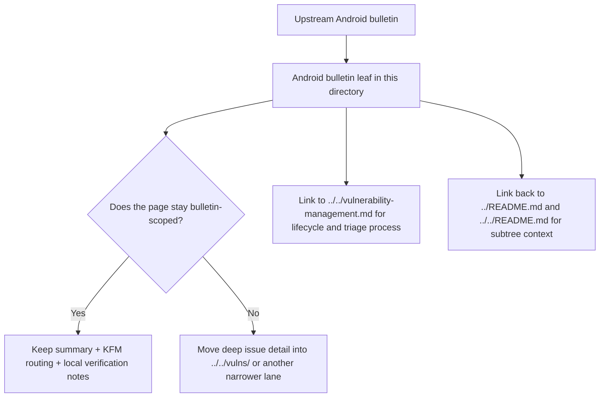

<!-- [KFM_META_BLOCK_V2]
doc_id: kfm://doc/NEEDS-VERIFICATION
title: Android Security Bulletins
type: standard
version: v1
status: draft
owners: NEEDS VERIFICATION
created: YYYY-MM-DD
updated: YYYY-MM-DD
policy_label: public
related: [../../README.md, ../README.md, ../../vulnerability-management.md, ../../vulns/README.md, ./2025-12-android-security-bulletin.md]
tags: [kfm, security, bulletins, android]
notes: [Replace placeholders after mounted repo verification.]
[/KFM_META_BLOCK_V2] -->

# Android Security Bulletins

Android bulletin index and routing surface for KFM security notes that originate in Android platform advisories.

> [!NOTE]
> **Status:** experimental  
> **Owners:** NEEDS VERIFICATION  
>     
> **Quick jumps:** [Scope](#scope) · [Repo fit](#repo-fit) · [Inputs](#accepted-inputs) · [Exclusions](#exclusions) · [Current verified snapshot](#current-verified-snapshot) · [Quickstart](#quickstart) · [Diagram](#diagram) · [Definition of done](#task-list--definition-of-done) · [FAQ](#faq)  
> **Repo fit:** `docs/security/bulletins/android/` → upstream: [`../README.md`](../README.md), [`../../README.md`](../../README.md), [`../../vulnerability-management.md`](../../vulnerability-management.md), [`../../vulns/README.md`](../../vulns/README.md) · downstream: bulletin leaves such as [`./2025-12-android-security-bulletin.md`](./2025-12-android-security-bulletin.md)

> [!IMPORTANT]
> This directory should function as a **bulletin lane**, not as a second vulnerability lifecycle manual and not as a catch-all Android security notebook. Keep bulletin pages narrow, source-aware, and easy to route into more specific security lanes when issue detail expands.

> [!WARNING]
> Current public-repo verification shows this lane is still scaffold-heavy. Treat any file inventory beyond the snapshot below as **NEEDS VERIFICATION** until the mounted repository, workflows, and adjacent bulletin leaves are directly inspected.

## Scope

This directory groups Android security bulletin references that matter to KFM. It is the place for:

- bulletin-specific summaries and pointers
- release-month or advisory-family pages for Android platform security updates
- short routing context that helps a reader move from a bulletin to narrower vulnerability notes, lifecycle guidance, or follow-on hardening work

This directory is **not** the owner of cross-cutting vulnerability process, broad security doctrine, or package-by-package remediation tracking.

## Repo fit

| Path | Role | Relationship |
| --- | --- | --- |
| `docs/security/README.md` | security subtree hub | parent entry point for all security docs |
| `docs/security/bulletins/README.md` | bulletin-family index | parent lane for bulletin-oriented references |
| `docs/security/bulletins/android/README.md` | this file | directory README for Android bulletin material |
| `docs/security/vulnerability-management.md` | lifecycle / operating guidance | use when the question is process, triage, prioritization, or response flow |
| `docs/security/vulns/README.md` | narrower issue lane | use when the work becomes CVE-linked, package-linked, or implementation-specific |
| `docs/security/bulletins/android/2025-12-android-security-bulletin.md` | bulletin leaf | current verified bulletin leaf path in this lane |

## Accepted inputs

Place these here when they are primarily **Android bulletin references**:

- monthly or release-window Android security bulletin summaries
- upstream bulletin links plus KFM-relevant interpretation notes
- short impact-routing notes that point to narrower writeups
- release-month indexes when several Android bulletin leaves exist
- bulletin metadata that helps readers navigate month, severity band, affected component family, or follow-up destination

## Exclusions

Do **not** place the following here:

- cross-platform vulnerability lifecycle policy → [`../../vulnerability-management.md`](../../vulnerability-management.md)
- package- or CVE-centered deep dives, exploitability notes, or implementation remediation logs → [`../../vulns/README.md`](../../vulns/README.md)
- general Android hardening runbooks not anchored to a bulletin → keep them in the more specific lane that owns that behavior (**NEEDS VERIFICATION** in the current public snapshot)
- unrelated mobile app UI, device testing, or Android development notes → outside `docs/security/`
- copied upstream bulletin text dumps → summarize and route instead
- unsupported claims that KFM is affected, patched, or not affected when current evidence does not prove that state

## Status vocabulary used in this directory

| Label | Use here |
| --- | --- |
| **CONFIRMED** | Directly verified in the visible repo or in the cited bulletin/source material |
| **INFERRED** | Small structural completion that fits KFM doctrine but is not yet directly proven |
| **PROPOSED** | Recommended directory behavior, template, or next step |
| **UNKNOWN** | Not verified strongly enough in the current session |
| **NEEDS VERIFICATION** | A review flag for metadata, ownership, inventory, or behavior that should be checked before commit |

## Current verified snapshot

The current public snapshot that could be directly verified for this lane is small:

| Item | Verified state | Notes |
| --- | --- | --- |
| `docs/security/README.md` | present | security subtree hub already routes to `./bulletins/` |
| `docs/security/bulletins/README.md` | present | still scaffold text only |
| `docs/security/bulletins/android/README.md` | present | this file currently exists as scaffold text only |
| `docs/security/bulletins/android/2025-12-android-security-bulletin.md` | present | current verified Android bulletin leaf path; still scaffold text only |

That means this README should prioritize **structure, routing, and local conventions** over claims about mature implementation.

## Directory tree

```text
docs/
└── security/
    ├── README.md
    ├── vulnerability-management.md
    ├── vulns/
    │   └── README.md
    └── bulletins/
        ├── README.md
        └── android/
            ├── README.md
            └── 2025-12-android-security-bulletin.md
```

## Quickstart

When adding a new Android bulletin page, start from a narrow, routable shape:

```md
# YYYY-MM Android Security Bulletin

One-line purpose for the specific bulletin window.

## What this page is
- Bulletin family / month
- Upstream source link(s)
- KFM relevance

## Key bulletin facts
- Release date
- Bulletin identifier or month
- Affected Android components or subsystem families
- Severity framing as reported upstream

## KFM routing
- Goes deeper in: `../../vulns/...` when issue detail becomes implementation-specific
- Process owner: `../../vulnerability-management.md`
- Related security subtree context: `../../README.md`

## Local notes
- CONFIRMED:
- INFERRED:
- PROPOSED:
- NEEDS VERIFICATION:
```

## Usage

### Add a bulletin leaf

1. Create a month- or release-scoped file in this directory.
2. Keep the file centered on the bulletin, not the entire remediation program.
3. Link outward to the owning narrower lane when issue detail grows.
4. Mark uncertain local impact as **NEEDS VERIFICATION** rather than implying exposure.
5. Update this README if the directory inventory or conventions change.

### Update this README

Update this file when any of the following changes:

- the verified file inventory in this lane changes
- the ownership or metadata placeholders are resolved
- a stable bulletin naming pattern is agreed
- adjacent security docs change the routing boundary
- the lane gains enough depth that a registry table or appendix needs expansion

## Diagram



## Bulletin page design rules

| Rule | Why it matters |
| --- | --- |
| Use one file per bulletin window or clearly defined bulletin family | Keeps review and correction scope legible |
| Prefer summaries, routing, and local interpretation over full-text mirroring | Avoids noisy duplication and copyright/reuse risk |
| Separate upstream bulletin facts from local KFM impact statements | Preserves evidence posture and makes uncertainty visible |
| Route implementation-heavy detail into narrower docs | Prevents this lane from becoming a second vulnerability tracker |
| Keep dates, identifiers, and source links easy to scan | Bulletins are usually consulted under time pressure |
| Use explicit uncertainty labels | Avoids bluffing about exposure, mitigation, or affected assets |

## Minimum fields for each bulletin leaf

| Field | Required | Notes |
| --- | --- | --- |
| Bulletin title | Yes | Prefer `YYYY-MM ...` naming when month-scoped |
| One-line purpose | Yes | Directly under H1 |
| Upstream source link(s) | Yes | Prefer authoritative bulletin source |
| KFM relevance note | Yes | Why this matters to KFM readers |
| Routing links | Yes | To subtree hub, lifecycle doc, and narrower issue lane when relevant |
| Local impact statement | Yes | Must separate CONFIRMED from UNKNOWN |
| Follow-up destination | Recommended | Point to a narrower doc if work continues elsewhere |
| Correction/update note | Recommended | Add when the page is superseded or revised |

## Task list / definition of done

- [ ] Meta block placeholders are replaced or consciously retained with review notes
- [ ] Directory inventory matches the mounted repo
- [ ] At least one real Android bulletin leaf is no longer scaffold-only
- [ ] Every bulletin page has upstream links, routing links, and explicit uncertainty handling
- [ ] Bulletin pages do not duplicate vulnerability lifecycle content
- [ ] Deep issue details are routed into narrower security docs
- [ ] Naming is consistent across month-scoped bulletin files
- [ ] Any new claims about exposure, severity, exploitability, or remediation are source-grounded
- [ ] Long reference material stays collapsible and does not drown the scanning path

## FAQ

### Why is this lane separate from `vulns/`?

Because bulletin pages and issue-specific vulnerability notes do different jobs. This lane should help a reader recognize the bulletin, understand its local relevance, and move to the narrower note if the issue requires deeper treatment.

### Why not keep everything in one security file?

Because bulletin readers usually need a fast route: *what bulletin is this, why does it matter here, and where do I go next?* Mixing that with lifecycle policy and issue deep dives makes the subtree harder to scan.

### What should happen when one bulletin spawns multiple local issue notes?

Keep the bulletin leaf as the routing hub. Add links to the narrower notes and keep the bulletin page concise.

### Can this directory host non-monthly Android advisory pages?

Yes, if the page is still bulletin- or advisory-family scoped and remains clearly narrower than the general security process docs.

## Appendix

<details>
<summary><strong>Suggested future additions once the lane is no longer scaffold-only</strong></summary>

### Possible registry table

When more bulletin leaves exist, add a registry like this:

| Bulletin file | Window | Upstream status | Local follow-up | Last reviewed |
| --- | --- | --- | --- | --- |
| `2025-12-android-security-bulletin.md` | 2025-12 | NEEDS VERIFICATION | NEEDS VERIFICATION | YYYY-MM-DD |

### Possible naming pattern

Prefer one stable pattern and keep it repo-wide:

```text
YYYY-MM-android-security-bulletin.md
YYYY-QX-android-security-rollup.md
android-bulletin-index-YYYY.md
```

### Review prompts for maintainers

- Is the page still bulletin-scoped?
- Does it mirror too much upstream content?
- Are all local impact claims grounded?
- Should any section be split into `../../vulns/`?
- Does the page need a correction/supersession note?

</details>

[Back to top](#android-security-bulletins)
