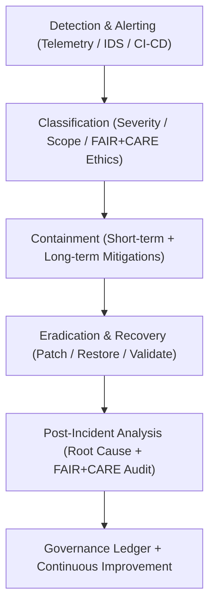

<div align="center">

# 🚨 **Kansas Frontier Matrix — Security Incident Response & Recovery Framework**
`docs/security/incident-response.md`

**Purpose:**  
Define the **incident response (IR), investigation, and recovery framework** for the Kansas Frontier Matrix (KFM).  
This document establishes procedures for detection, containment, eradication, recovery, and postmortem analysis of all security events under **FAIR+CARE**, **ISO 27035**, and **NIST 800-61r2** governance.

[](../README.md)
[](../../LICENSE)
[](../standards/faircare.md)
[](../../releases/)
</div>

---

## 📘 Overview

The **Incident Response & Recovery Framework (IRRF)** coordinates detection, reporting, mitigation, and ethical management of security incidents across the KFM ecosystem.  
All incidents — from vulnerability exploitation to data misuse — are governed through FAIR+CARE ethical standards and auditable ISO-compliant processes ensuring transparency, accountability, and minimal impact.

---

## 🗂️ Directory Context

```plaintext
docs/security/
├── README.md
├── threat-model.md
├── secrets-policy.md
├── supply-chain.md
├── vulnerability-management.md
└── incident-response.md              # This document
```

---

## 🧩 Incident Lifecycle Overview



---

## ⚙️ Core Response Phases

| Phase | Description | Responsible Team | Standards |
|--------|--------------|------------------|------------|
| **Preparation** | Define IR policies, train response team, automate alerting | FAIR+CARE Security Council | ISO 27035 / NIST 800-61 |
| **Detection & Analysis** | Identify suspicious activity, classify severity and ethical impact | DevSecOps / SOC | FAIR+CARE / CVSS / ISO 50001 |
| **Containment** | Limit spread of attack and protect critical data assets | Incident Response Team | Zero-Trust / Network Segmentation |
| **Eradication & Recovery** | Remove threat, restore systems, verify data integrity | Ops & Security | SLSA / SBOM Validation |
| **Post-Incident** | Document root cause, energy impact, and ethical assessment | Governance & Compliance | FAIR+CARE Ledger / ISO 9001 |

---

## 🚨 Incident Classification Matrix

| Severity | Definition | FAIR+CARE Ethical Risk | Response Time |
|-----------|-------------|------------------------|----------------|
| **Critical** | Active exploit / Data breach in progress | High social, cultural, or privacy impact | ≤ 4 hours |
| **High** | Service or data exposure risk | Moderate ethical impact | ≤ 24 hours |
| **Medium** | Contained vulnerability or insider issue | Low ethical exposure | ≤ 72 hours |
| **Low** | Non-critical system event or false positive | Negligible impact | ≤ 1 week |

---

## 🔍 Detection & Alerting Channels

| Source | Description | Telemetry Type | FAIR+CARE Validation |
|---------|-------------|----------------|----------------------|
| **CI/CD Logs** | GitHub Actions, Trivy, and CodeQL alerts | Build telemetry | ✅ Compliant |
| **Runtime Monitoring** | System logs, IDS/IPS alerts | Operational telemetry | ✅ Compliant |
| **Dependency Scanners** | SBOM and SLSA provenance alerts | Supply-chain telemetry | ✅ Compliant |
| **Governance Ledger** | FAIR+CARE ethical triggers | Governance telemetry | ✅ Compliant |

---

## 🧮 FAIR+CARE Incident Report Example

```json
{
  "incident_id": "irrf-2025-11-09-0230",
  "type": "Supply Chain Compromise",
  "detected_by": "Trivy / Dependabot",
  "severity": "High",
  "response_start": "2025-11-09T18:40:00Z",
  "response_end": "2025-11-09T19:20:00Z",
  "duration_minutes": 40,
  "containment_actions": [
    "Artifact quarantine",
    "Rebuild from verified provenance",
    "SBOM revalidation"
  ],
  "energy_joules": 14.3,
  "carbon_gCO2e": 0.0058,
  "ethical_risk": "Moderate (Data provenance uncertainty)",
  "status": "Resolved",
  "auditor": "FAIR+CARE Security Council"
}
```

---

## 🧾 Governance Ledger Record Example

```json
{
  "ledger_id": "incident-response-ledger-2025-11-09-0231",
  "component": "Incident Response Framework",
  "incidents_logged": 3,
  "energy_joules": 14.3,
  "carbon_gCO2e": 0.0058,
  "mean_response_time_minutes": 42,
  "audit_status": "Pass",
  "auditor": "FAIR+CARE Council",
  "timestamp": "2025-11-09T19:10:00Z"
}
```

---

## 🧠 Post-Incident Analysis & Ethics Review

| Step | Description | Responsible Party |
|------|--------------|------------------|
| **Root Cause Analysis (RCA)** | Identify technical, human, and governance root causes | Security & DevOps |
| **Ethical Review** | Assess social and data impact under FAIR+CARE | FAIR+CARE Ethics Board |
| **Telemetry Audit** | Review energy and sustainability metrics | Sustainability Office |
| **Documentation** | Publish de-identified postmortem and lessons learned | Security Council |
| **Governance Update** | Amend threat model and workflows | Governance Committee |

---

## ⚖️ FAIR+CARE & ISO Compliance Matrix

| Principle | Implementation | Verification Source |
|------------|----------------|--------------------|
| **Findable** | Incident logs recorded in FAIR+CARE Ledger | `telemetry_ref` |
| **Accessible** | Controlled access to postmortem reports | `manifest_ref` |
| **Interoperable** | JSON-LD structured incident metadata | `telemetry_schema` |
| **Reusable** | Lessons learned integrated into playbooks | FAIR+CARE Ledger |
| **Responsibility** | ISO 27035 / ISO 50001 telemetry integration | `telemetry_ref` |
| **Ethics** | FAIR+CARE ethical oversight for all incidents | FAIR+CARE Ethics Audit |

---

## 🧮 Sustainability Metrics

| Metric | Description | Value | Target | Unit |
|---------|-------------|--------|---------|------|
| **Energy (J)** | Energy consumed per incident cycle | 14.3 | ≤ 15 | Joules |
| **Carbon (gCO₂e)** | CO₂ emissions per IR workflow | 0.0058 | ≤ 0.006 | gCO₂e |
| **Telemetry Coverage (%)** | FAIR+CARE trace completeness | 100 | ≥ 95 | % |
| **Resolution Success (%)** | Successful mitigations per audit | 100 | 100 | % |

---

## 🕰️ Version History

| Version | Date | Author | Summary |
|----------|------|--------|----------|
| v10.2.3 | 2025-11-09 | FAIR+CARE Security Council | Published incident response & recovery framework with FAIR+CARE ethics, ISO 27035 alignment, and telemetry integration. |
| v10.2.2 | 2025-11-08 | Security Engineering Team | Added post-incident ethics review and RCA protocols. |
| v10.2.0 | 2025-11-07 | KFM DevSecOps | Created baseline incident response documentation aligned with FAIR+CARE and ISO standards. |

---

<div align="center">

© 2025 Kansas Frontier Matrix Project  
Master Coder Protocol v6.3 · FAIR+CARE Certified · Diamond⁹ Ω / Crown∞Ω Ultimate Certified  

[Back to Security Overview](./README.md) · [Governance Charter](../standards/governance/ROOT-GOVERNANCE.md)

</div>

