<div align="center">

# 🚨 **Kansas Frontier Matrix — Security Incident Response & Recovery Framework**  
`docs/security/incident-response.md`

**Purpose:**  
Define the **incident response (IR), investigation, and recovery framework** for the Kansas Frontier Matrix (KFM).  
This document establishes procedures for detection, containment, eradication, recovery, and postmortem analysis of all security events under **FAIR+CARE**, **ISO 27035**, and **NIST 800-61r2**, with telemetry-backed sustainability and ethics reporting.

[](../README.md)
[](../../LICENSE)
[](../standards/faircare.md)
[](../../releases/)
</div>

---

## 📘 Overview

The **Incident Response & Recovery Framework (IRRF)** coordinates detection, reporting, mitigation, and ethical management of security incidents across the KFM ecosystem.  
All incidents — from exploited vulnerabilities and suspicious access patterns to model misuse and data exposure — are processed through **FAIR+CARE ethical standards** and **ISO-compliant** procedures to ensure:

- Rapid detection and triage  
- Minimal harm to communities and data subjects  
- Transparent documentation and learning  
- Measured energy and sustainability impact  

IR is tightly integrated with:

- `vulnerability-management.md` (prevention + risk)  
- `threat-model.md` (proactive modeling)  
- `secrets-policy.md` (credential hygiene)  
- `supply-chain.md` (provenance and SBOM integrity)

---

## 🗂️ Directory Context

```plaintext
docs/security/
├── README.md
├── threat-model.md
├── secrets-policy.md
├── supply-chain.md
├── vulnerability-management.md
└── incident-response.md              # This document
```

---

## 🧩 Incident Lifecycle Overview

```mermaid
flowchart TD
  A["Detection & Alerting (Telemetry / IDS / CI-CD / Users)"] --> B["Classification (Severity · Scope · FAIR+CARE Impact)"]
  B --> C["Containment (Short-term & Long-term)"]
  C --> D["Eradication & Recovery (Patch · Restore · Validate)"]
  D --> E["Post-Incident Analysis (RCA + FAIR+CARE Audit)"]
  E --> F["Governance Ledger Entry + Process Improvements"]
```



---

## ⚙️ Core Response Phases

| Phase | Description | Responsible Team | Standards |
|---|---|---|---|
| **Preparation** | Define IR policies, playbooks, and runbooks; train responders; simulate incidents. | FAIR+CARE Security Council / DevSecOps | ISO 27035 / NIST 800-61 |
| **Detection & Analysis** | Monitor telemetry, alerts, and reports; confirm incident; classify severity + ethical impact. | DevSecOps / SOC / AI Ops | FAIR+CARE / CVSS / ISO 50001 |
| **Containment** | Limit damage by isolating systems, accounts, or datasets; protect evidence. | Incident Response Team | Zero-Trust / Network Segmentation |
| **Eradication & Recovery** | Remove root cause, patch systems, restore services, re-validate integrity with SBOM/SLSA. | Ops & Security | SLSA / SBOM Validation |
| **Post-Incident** | Perform root cause analysis (RCA), ethics review, and sustainability assessment; update docs and controls. | Governance & Compliance | FAIR+CARE Ledger / ISO 9001 |

---

## 🚨 Incident Classification Matrix

| Severity | Definition | FAIR+CARE Ethical Risk | Response Time Target |
|---|---|---|---|
| **Critical** | Active exploit, confirmed data breach, or high-impact model misuse in progress. | Severe social, cultural, or privacy impact. | Triage ≤ 1h, mitigation ≤ 4h |
| **High** | Exploitable issue with strong indicators of compromise or data exposure risk. | Moderate to high ethical impact. | Triage ≤ 4h, mitigation ≤ 24h |
| **Medium** | Contained vulnerability or localized misconfiguration, no confirmed exposure. | Low to moderate ethical impact. | Mitigation ≤ 72h |
| **Low** | Non-critical event, anomaly, or near-miss with negligible impact. | Minimal ethical exposure. | Resolution ≤ 7 days |

Each incident severity decision must consider:

- Potential harm to communities and individuals  
- Legal/treaty obligations and MOUs  
- Data sensitivity (especially CARE-governed datasets)  

---

## 🔍 Detection & Alerting Channels

| Source | Description | Telemetry Type | FAIR+CARE Validation |
|---|---|---|---|
| **CI/CD Security** | GitHub Actions, CodeQL, Trivy, SBOM diffs, SLSA checks. | Build & supply-chain telemetry. | ✅ Integrated into `focus-telemetry.json` |
| **Runtime Monitoring** | Service logs, IDS/IPS, API gateway alerts, rate-limit triggers. | Operational telemetry. | ✅ Logged per release |
| **AI Behavior Monitors** | Prompt injection anomalies, unusual tool calls, refusal spikes/drops. | AI safety telemetry. | ✅ Reviewed by Ethics Subcommittee |
| **User/Community Reports** | Responsible disclosures and community feedback. | Governance telemetry. | ✅ Fed into FAIR+CARE review queues |
| **Governance Signals** | Sovereign notices, revocations, CARE forms. | Governance/ethics telemetry. | ✅ Tracked in Governance Ledger |

---

## 🧮 FAIR+CARE Incident Report Example

```json
{
  "incident_id": "irrf-2025-11-12-0230",
  "type": "Supply Chain Compromise",
  "detected_by": ["Trivy", "Dependabot"],
  "severity": "High",
  "response_start": "2025-11-12T05:10:00Z",
  "response_end": "2025-11-12T05:50:00Z",
  "duration_minutes": 40,
  "containment_actions": [
    "Quarantined affected container images",
    "Disabled impacted deployment environment",
    "Rebuilt artifacts from verified provenance",
    "Regenerated SBOM and re-ran SLSA checks"
  ],
  "energy_wh": 4.0,
  "carbon_gCO2e": 0.0016,
  "ethical_risk": "Moderate (supply-chain trust uncertainty)",
  "care_impacted": false,
  "status": "resolved",
  "auditor": "FAIR+CARE Security Council",
  "timestamp": "2025-11-12T06:00:00Z"
}
```

---

## 🧾 Governance Ledger Record Example

```json
{
  "ledger_id": "incident-response-ledger-2025-11-12-0231",
  "component": "Incident Response Framework",
  "incidents_logged": 4,
  "mean_response_time_minutes": 38,
  "energy_wh": 4.0,
  "carbon_gCO2e": 0.0016,
  "audit_status": "pass",
  "auditor": "FAIR+CARE Council",
  "timestamp": "2025-11-12T06:05:00Z"
}
```

---

## 🧠 Post-Incident Analysis & Ethics Review

| Step | Description | Responsible Party |
|---|---|---|
| **Root Cause Analysis (RCA)** | Identify technical, process, and human factors that caused or enabled the incident. | Security & DevOps |
| **Ethical Review** | Evaluate cultural, social, or privacy impacts under FAIR+CARE and sovereignty frameworks. | FAIR+CARE Ethics Board / Indigenous Partners (when relevant) |
| **Telemetry & Sustainability Review** | Assess energy and carbon impact of detection, response, and remediation. | Sustainability Office |
| **Documentation & Knowledge Sharing** | Publish de-identified postmortems and integrate lessons into threat models, runbooks, and training. | Security Council |
| **Governance & Control Updates** | Update controls in `threat-model.md`, `supply-chain.md`, `secrets-policy.md`, or CI policies. | Governance Committee |

---

## 📜 Incident Runbooks (Examples)

### 1) Supply Chain Incident

1. Freeze affected artifacts and deployments.  
2. Quarantine impacted containers, packages, or images.  
3. Rebuild from trusted source commit with SLSA attestations.  
4. Regenerate SBOM and re-run vulnerability scanners.  
5. Validate no unauthorized changes in STAC/DCAT catalogs or AI models.  
6. Log full IRRF entry and update threat model.

### 2) AI Misuse / Prompt Injection Incident

1. Disable the affected AI endpoint or mode.  
2. Capture offending prompts, context segments, and tool-call traces.  
3. Reproduce in offline sandbox; identify exploit pattern.  
4. Update prompt-injection defenses (`prompt-injection-defense.md`, sanitizer rules).  
5. Add adversarial case to `prompt-attack-test.yml`.  
6. If cultural/CARE data involved, coordinate with affected communities and record outcomes in CARE-ledger.

---

## ⚖️ FAIR+CARE & ISO Compliance Matrix

| Principle | Implementation | Verification Source |
|---|---|---|
| **Findable** | Incidents and resolutions indexed by IDs and time in Governance Ledger. | `telemetry_ref`, ledger exports |
| **Accessible** | De-identified postmortems available to contributors; sensitive details protected. | Postmortem docs, access logs |
| **Interoperable** | JSON-based incident schemas; consistent metadata across tools. | `telemetry_schema`, IR reports |
| **Reusable** | Lessons learned feed threat models, runbooks, and training content. | `threat-model.md`, training docs |
| **Responsibility** | ISO 27035-aligned escalation and reporting pipeline. | IR audits, board reviews |
| **Ethics (CARE)** | Community impact is weighed before declaring incidents resolved; sovereign directives honored. | FAIR+CARE Ethics Review logs |

---

## 🌱 Sustainability Metrics

| Metric | Description | Value | Target | Unit |
|---|---|---|---|---|
| **Energy (Wh)** | Energy used per full incident handling cycle. | 4.0 | ≤ 5.0 | Wh |
| **Carbon (gCO₂e)** | CO₂ emissions per IR workflow. | 0.0016 | ≤ 0.003 | gCO₂e |
| **Telemetry Coverage (%)** | Incidents recorded with telemetry + governance linkage. | 100 | ≥ 95 | % |
| **Resolution Success (%)** | Incidents fully resolved and verified postmortem. | 100 | 100 | % |

All metrics are aggregated into:

```
releases/v10.2.0/focus-telemetry.json
```

---

## 🕰️ Version History

| Version | Date | Author | Summary |
|---|---|---|---|
| v10.2.4 | 2025-11-12 | FAIR+CARE Security Council | Aligned IR framework with v10.2 telemetry and sustainability metrics; expanded AI misuse and supply-chain runbooks. |
| v10.2.3 | 2025-11-09 | FAIR+CARE Security Council | Published incident response & recovery framework with FAIR+CARE ethics, ISO 27035 alignment, and telemetry integration. |
| v10.2.2 | 2025-11-08 | Security Engineering Team | Added post-incident ethics review and RCA protocols. |
| v10.2.0 | 2025-11-07 | KFM DevSecOps | Created baseline incident response documentation aligned with FAIR+CARE and ISO standards. |

---

<div align="center">

© 2025 Kansas Frontier Matrix Project — CC-BY 4.0  
Master Coder Protocol v6.3 · FAIR+CARE Certified · Diamond⁹ Ω / Crown∞Ω Ultimate Certified  

[Back to Security Overview](README.md) · [Governance Charter](../standards/governance/ROOT-GOVERNANCE.md)

</div>
