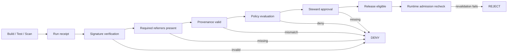
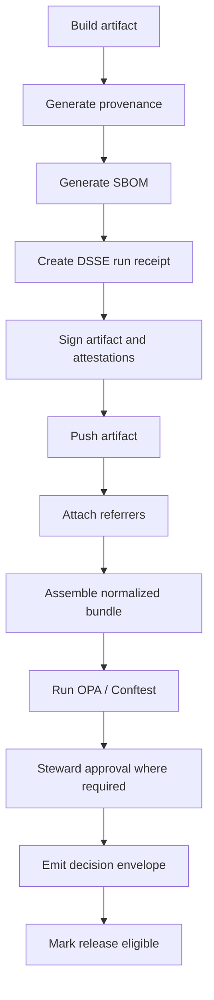
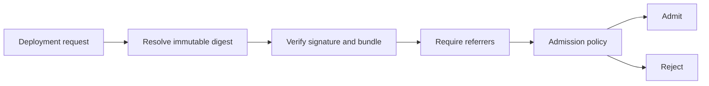

<!-- [KFM_META_BLOCK_V2]
doc_id: kfm://doc/NEEDS-UUID
title: Promotion Contract
type: standard
version: v1
status: draft
owners: @bartytime4life
created: 2026-03-30
updated: 2026-04-05
policy_label: public
related: [docs/security/README.md, docs/security/ai-receipts/README.md, docs/architecture/TRUST_MEMBRANE.md, docs/architecture/TRUTH_PATH_LIFECYCLE.md, contracts/, policy/, schemas/, scripts/, tests/]
tags: [kfm, security, supply-chain, promotion, attestations]
notes: [Public-main path and broad /docs/ ownership are confirmed; promotion-specific contract, policy, script, fixture, and workflow wiring remain PROPOSED or NEEDS VERIFICATION.]
[/KFM_META_BLOCK_V2] -->

# Promotion Contract

One governed, fail-closed contract for moving a KFM artifact from build proof to release eligibility and runtime admission.

> [!IMPORTANT]
> **Status:** draft  
> **Owners:** `@bartytime4life` *(broad `/docs/` CODEOWNERS coverage is confirmed; any narrower security-lane split remains `NEEDS VERIFICATION`)*  
>        
> **Repo fit:** `docs/security/promotion-contract.md` → hub [`./README.md`](./README.md) · adjacent [`./ai-receipts/README.md`](./ai-receipts/README.md) · doctrine [`../architecture/TRUST_MEMBRANE.md`](../architecture/TRUST_MEMBRANE.md) · [`../architecture/TRUTH_PATH_LIFECYCLE.md`](../architecture/TRUTH_PATH_LIFECYCLE.md) · root surfaces [`../../contracts/`](../../contracts/) · [`../../policy/`](../../policy/) · [`../../schemas/`](../../schemas/) · [`../../scripts/`](../../scripts/) · [`../../tests/`](../../tests/)  
> **Quick jump:** [Scope](#scope) · [Repo fit](#repo-fit) · [Current verified snapshot](#current-verified-snapshot) · [Accepted inputs](#accepted-inputs) · [Exclusions](#exclusions) · [Promotion model](#promotion-model) · [Contract gates](#promotion-contract-gates-a--g) · [Bundle](#normalized-promotion-bundle) · [Release-bearing minimum](#kfm-release-bearing-minimum) · [Policy](#policy-shape) · [Quickstart](#quickstart) · [Admission](#runtime-admission) · [Starter tree](#suggested-starter-tree-proposed) · [Definition of done](#definition-of-done) · [FAQ](#faq)

> [!WARNING]
> **Truth posture used here:**  
> **CONFIRMED** — the current public-main path of this file, adjacent doctrine files, the checked-in `docs/security/ai-receipts/` lane, the existence of root `contracts/`, `policy/`, `schemas/`, `scripts/`, and `tests/`, and broad `/docs/` ownership.  
> **PROPOSED** — promotion-specific schemas, policy packs, helper scripts, fixtures, release-proof packaging, and workflow wiring beneath those root surfaces.  
> **UNKNOWN / NEEDS VERIFICATION** — non-public GitHub rulesets, required checks, OIDC trust relationships, emitted proof packs, cluster admission-controller implementation, and runtime enforcement depth.

---

## Scope

This document defines KFM’s promotion contract for software and publication-bearing artifacts.

Promotion is not merely “the build passed.” In KFM, it is a governed state transition backed by typed evidence, policy evaluation, review action, and runtime revalidation. A candidate becomes outwardly usable only when it crosses the trust membrane with inspectable proof instead of convenience, inference, or undocumented operator judgment.

This contract preserves three non-negotiables:

- **authoritative control** stays in typed evidence, policy, and steward approval
- **derived layers** remain rebuildable and downstream of promoted scope
- **promotion** fails closed when required evidence is missing, unverifiable, stale, mismatched, or policy-disallowed

---

## Repo fit

### Upstream, adjacent, and downstream surfaces

| Relation | Path | Status | Why it matters |
|---|---|---:|---|
| Hub | [`./README.md`](./README.md) | **CONFIRMED** | Security subtree entry point and lane map. |
| Adjacent | [`./ai-receipts/README.md`](./ai-receipts/README.md) | **CONFIRMED** | Specialized receipt lane for AI-assisted derived outputs. |
| Doctrine | [`../architecture/TRUST_MEMBRANE.md`](../architecture/TRUST_MEMBRANE.md) | **CONFIRMED** | Keeps outward surfaces downstream of governed evidence, policy, release, and correction state. |
| Doctrine | [`../architecture/TRUTH_PATH_LIFECYCLE.md`](../architecture/TRUTH_PATH_LIFECYCLE.md) | **CONFIRMED** | Places promotion inside the canonical truth path and release-bearing lifecycle. |
| Root surface | [`../../contracts/`](../../contracts/) | **CONFIRMED** | Canonical home for machine-readable contract shapes. |
| Root surface | [`../../policy/`](../../policy/) | **CONFIRMED** | Policy bundles, reason codes, obligation codes, and fixtures belong here. |
| Root surface | [`../../schemas/`](../../schemas/) | **CONFIRMED** | Shared schema discipline matters if promotion uses both generic and lane-specific schema inventories. |
| Root surface | [`../../scripts/`](../../scripts/) | **CONFIRMED** | Thin orchestration wrappers belong here, not in prose. |
| Root surface | [`../../tests/`](../../tests/) | **CONFIRMED** | Positive/negative fixtures and promotion-path tests belong here. |
| Narrow promotion lanes beneath those roots | `contracts/promotion/`, `policy/promotion/`, `scripts/promotion/`, `tests/promotion/` | **PROPOSED** | Likely starter shape for this contract family, but not directly reverified as checked-in tree. |

### What this file should do

This document should make promotion law inspectable without pretending that prose alone is enforcement.

Use it to define:

- the **gate sequence**
- the **minimum typed evidence**
- the **normalized bundle** policy consumes
- the split between **promotion denial** and **runtime admission rejection**
- the **starter artifact set** that makes the contract testable

Do **not** use it to imply that workflows, controllers, or proof packs already exist unless those surfaces are directly reverified.

---

## Current verified snapshot

| Item | Status | Meaning here |
|---|---:|---|
| `docs/security/promotion-contract.md` exists on current public `main` | **CONFIRMED** | This is an already checked-in repo doc, not a new speculative path. |
| `docs/security/README.md` exists and maps the subtree | **CONFIRMED** | This file belongs to a live security documentation hub. |
| `docs/security/ai-receipts/README.md` exists | **CONFIRMED** | Promotion already has an adjacent receipt/provenance lane in the public tree. |
| `docs/architecture/TRUST_MEMBRANE.md` exists | **CONFIRMED** | Promotion must stay downstream of the trust membrane. |
| `docs/architecture/TRUTH_PATH_LIFECYCLE.md` exists | **CONFIRMED** | Promotion is part of the canonical lifecycle, not an isolated CI detail. |
| Root `contracts/`, `policy/`, `schemas/`, `scripts/`, and `tests/` exist | **CONFIRMED** | The repo has visible homes for contracts, policy, orchestration, and verification. |
| Broad `/docs/` ownership resolves to `@bartytime4life` | **CONFIRMED** | Ownership can be stated at broad path level without inventing narrower splits. |
| Promotion-specific schemas, helpers, fixtures, or workflows are visible in public `main` | **NOT CONFIRMED** | Keep narrow implementation claims `PROPOSED`, `UNKNOWN`, or `NEEDS VERIFICATION`. |

> [!TIP]
> For KFM, the first executable proof of this contract should be **one hydrology-first slice**, not a broad multi-domain rollout. Prove receipts, policy, release, and admission once, then widen lanes.

---

## Accepted inputs

This contract assumes one or more of the following inputs are available during promotion:

- OCI artifact reference and immutable digest
- DSSE-wrapped attestations
- in-toto statements and predicates
- Cosign signatures or verification bundles
- OCI referrers for SBOM, provenance, approval, or related attachments
- normalized policy input for OPA / Rego or Conftest
- steward approval attestation
- runtime admission verifier configuration
- optional release manifest or proof-pack reference when the transition is release-bearing

---

## Exclusions

This document does **not** define:

- vulnerability severity thresholds for a given release
- environment-specific rollout strategy
- key-management policy in full detail
- incident response and revocation procedures
- artifact build logic itself
- registry implementation specifics beyond standards-facing expectations
- product- or domain-specific publication classes outside the promotion boundary
- UI behavior beyond the trust-visible release and correction consequences promotion must preserve

---

## How to use this contract

1. **Resolve the artifact by immutable digest.** Promotion never starts from a mutable tag alone.
2. **Assemble a normalized promotion bundle.** Policy should consume one typed shape, not ad hoc verification output from many tools.
3. **Evaluate gates A→G.** Every deny or reject reason must remain inspectable.
4. **Distinguish promotion from runtime.** `DENY` is a promotion outcome; `REJECT` is a runtime admission outcome.
5. **Keep outward publication synchronized.** If the transition authorizes release-bearing scope, the release manifest, review artifacts, and rollback path must move with it.

> [!NOTE]
> In this document, **DENY** means “the candidate does not advance to the next governed state.” **REJECT** means “the runtime plane refuses admission even after a deployment request exists.”

---

## Promotion model

Promotion is treated as a governed truth transition.



---

## Promotion contract gates (A → G)

### A. Run receipt

The pipeline **MUST** emit a canonical DSSE envelope as the primary run receipt.

The run receipt is the first typed proof that a promotion-relevant execution happened, what it targeted, and under which build identity and input set it ran.

**Minimum expectations**

- one receipt per promotion-relevant run
- payload type explicitly declared
- subject artifact identified by immutable digest
- build or run identity present
- timestamps present
- input references present
- envelope signature material present

**Failure outcome**

- missing receipt → **DENY**
- malformed envelope or unknown payload type → **DENY**
- artifact digest mismatch → **DENY**

---

### B. Signature verification

The promotion surface **MUST** verify the artifact signature with Cosign and confirm transparency evidence through Rekor or an equivalent supported verification bundle path.

**Minimum expectations**

- signature verifies against the target digest
- signer identity matches an allowed issuer or subject rule
- transparency evidence or bundle verifies
- verification runs against immutable digest, not mutable tag alone

**Failure outcome**

- invalid signature → **DENY**
- signer identity mismatch → **DENY**
- transparency evidence missing or invalid → **DENY**

---

### C. Artifact metadata via OCI referrers

The promoted artifact **MUST** expose required attachments through OCI referrers or an equivalent standards-compliant reference mechanism.

**Baseline required attachment classes**

- SBOM
- provenance attestation
- steward approval attestation

**Profile-specific attachment classes**

- decision envelope
- release manifest or proof pack
- AI receipt or derived-output receipt
- domain-specific publication artifacts

**Minimum expectations**

- each attachment resolves to the exact subject digest
- attachment media types are recognized
- registry discoverability works through referrers or a documented compatible fallback
- attachment class requirements are profile-visible rather than hidden in operator lore

**Failure outcome**

- missing required attachment class → **DENY**
- subject mismatch → **DENY**
- unresolvable referrer → **DENY**

---

### D. Provenance

Promotion **SHOULD** require a valid in-toto statement for build provenance.

For release-bearing lanes that declare provenance mandatory, missing provenance becomes a hard deny rather than an advisory gap.

**Minimum expectations**

- provenance references the exact promoted digest
- build materials or inputs are recorded
- builder identity is captured
- invocation or environment details are sufficient for policy evaluation
- predicate type is known and allowed

**Failure outcome**

- missing provenance when required → **DENY**
- subject mismatch → **DENY**
- disallowed builder or predicate type → **DENY**

---

### E. Policy evaluation

Promotion **MUST** evaluate a normalized bundle with OPA / Rego, for example via Conftest in CI.

Promotion is not allowed by default.

**Policy posture**

- `default allow := false`
- explicit `deny` reasons are first-class evidence
- missing required fields are denial conditions
- policy output is retained with the promotion record
- obligation codes remain visible; they are not hidden inside prose comments or operator memory

**Failure outcome**

- any deny → **DENY**
- missing normalized fields → **DENY**
- evaluator failure → **DENY**

---

### F. Steward approval

Promotion to the next governed state **MUST** include a steward-signed approval attestation when the profile requires human or role-bearing approval.

Build authenticity and governance approval are different claims. DSSE is only the envelope layer; steward approval remains a separate KFM trust object.

**Minimum expectations**

- approval is a separately signed attestation
- approval references the exact artifact digest
- steward identity is policy-recognized
- approval includes time and reason or decision code
- approval remains linked to review lineage when the lane requires a human record

**Failure outcome**

- missing steward approval when required → **DENY**
- non-authorized approver → **DENY**
- approval digest mismatch → **DENY**

---

### G. Runtime admission

Cluster or runtime admission **MUST** revalidate promotion evidence at deployment time.

Runtime trust is not inherited from CI success. Admission is its own control point.

**Admission expectations**

- image referenced by immutable digest
- signature verified against expected identity
- transparency evidence or bundle verified
- required referrers resolvable
- steward approval present and valid when required
- optional match against release manifest digest, policy digest, or proof-pack digest where the profile declares that check mandatory

**Failure outcome**

- any required evidence missing at admission → **REJECT**
- verification failure at admission → **REJECT**

---

## Control matrix

| Gate | Required evidence | Primary job | Format / mechanism | Mandatory outcome on failure |
|---|---|---|---|---|
| A | Run receipt | Prove a promotion-relevant run happened against the artifact digest | DSSE envelope | deny |
| B | Artifact signature | Prove signer identity and digest integrity | Cosign + Rekor or bundle | deny |
| C | Required attachments | Make attached evidence discoverable by digest | OCI referrers | deny |
| D | Provenance | Bind subject, builder, and build materials | in-toto statement / predicate | deny when required |
| E | Governance result | Apply fail-closed policy to one normalized shape | OPA / Rego evaluation | deny |
| F | Steward approval | Preserve visible approval logic when required | signed attestation + review linkage | deny |
| G | Admission proof | Recheck trust at runtime boundary | runtime revalidation | reject deployment |

---

## Normalized promotion bundle

Promotion checks are easier to reason about if every gate consumes one normalized bundle assembled from raw artifacts.

### Suggested canonical bundle shape (PROPOSED starter contract)

```json
{
  "artifact": {
    "uri": "oci://registry.example/repo/image@sha256:...",
    "digest": "sha256:..."
  },
  "profile": {
    "release_bearing": true,
    "require_provenance": true,
    "require_steward_approval": true
  },
  "run_receipt": {
    "present": true,
    "payload_type": "application/vnd.kfm.run-receipt.v1",
    "valid": true
  },
  "signature": {
    "valid": true,
    "issuer": "https://token.actions.githubusercontent.com",
    "identity": "https://github.com/org/repo/.github/workflows/release.yml@refs/heads/main",
    "rekor_verified": true
  },
  "referrers": {
    "resolved": true,
    "required_classes": ["sbom", "provenance", "steward_approval"]
  },
  "sbom": {
    "present": true,
    "media_type": "application/spdx+json",
    "subject_matches": true
  },
  "provenance": {
    "present": true,
    "statement_type": "https://in-toto.io/Statement/v1",
    "predicate_type": "https://slsa.dev/provenance/v1",
    "subject_matches": true,
    "builder_id": "trusted-builder"
  },
  "steward_approval": {
    "present": true,
    "valid": true,
    "approver": "steward@example.org",
    "subject_matches": true
  },
  "decision_envelope": {
    "present": true,
    "result": "allow",
    "reason_codes": [],
    "obligation_codes": []
  },
  "release_manifest": {
    "present": true,
    "digest": "sha256:..."
  },
  "policy": {
    "deny": [],
    "warnings": []
  }
}
```

### Bundle invariants

- every subject-bearing document resolves to the **same digest**
- absence of required evidence is represented explicitly
- policy consumes normalized booleans and identifiers, not ad hoc raw registry output
- bundle assembly is reproducible and testable
- release-bearing transitions keep **decision**, **review**, and **release** artifacts inspectable instead of burying them in logs

---

## KFM release-bearing minimum

If a promotion event authorizes outward publication rather than internal staging only, the transition should carry more than signature + provenance.

At minimum, a release-worthy transition should surface:

| Artifact or proof | Why it matters |
|---|---|
| dataset version reference | Keeps published scope anchored to a releaseable unit instead of an ad hoc build. |
| catalog closure | Prevents release from outrunning discoverability, identifiers, or outward metadata. |
| decision envelope | Keeps policy result, reason codes, and obligation codes machine-visible. |
| review record where required | Preserves separation of duty and visible approval logic. |
| release manifest or proof pack | Defines what the release authorizes downstream surfaces to expose. |
| evidence-resolution pass or equivalent sample proof | Demonstrates that outward evidence still resolves under real use. |
| rollback note | Makes correction and rollback part of release meaning, not an afterthought. |
| synchronized contract, example, and runbook updates | Prevents documentation, examples, and operators from drifting apart. |

> [!TIP]
> This section is where the promotion contract becomes distinctly KFM rather than a generic supply-chain checklist. Promotion here is part of publication law, not only deployment hygiene.

---

## Suggested attestation shapes

<details>
<summary><strong>Expand example payloads</strong></summary>

### Run receipt attestation

```json
{
  "payloadType": "application/vnd.kfm.run-receipt.v1",
  "payload": {
    "artifact": {
      "uri": "oci://registry.example/repo/image@sha256:...",
      "digest": "sha256:..."
    },
    "build": {
      "system": "github-actions",
      "workflow": "release.yml",
      "run_id": "123456789"
    },
    "inputs": [
      {
        "type": "git",
        "uri": "git+https://github.com/org/repo",
        "digest": "sha1:..."
      }
    ],
    "timestamp": "2026-03-30T00:00:00Z"
  },
  "signatures": [
    { "keyid": "", "sig": "..." }
  ]
}
```

### Steward approval attestation

```json
{
  "payloadType": "application/vnd.kfm.steward-approval.v1",
  "payload": {
    "artifact_digest": "sha256:...",
    "decision": "approve",
    "reason_code": "policy-satisfied",
    "approved_by": "steward@example.org",
    "timestamp": "2026-03-30T00:00:00Z"
  },
  "signatures": [
    { "keyid": "", "sig": "..." }
  ]
}
```

### Provenance statement

```json
{
  "_type": "https://in-toto.io/Statement/v1",
  "subject": [
    {
      "name": "registry.example/repo/image",
      "digest": { "sha256": "..." }
    }
  ],
  "predicateType": "https://slsa.dev/provenance/v1",
  "predicate": {
    "buildDefinition": {},
    "runDetails": {}
  }
}
```

</details>

> [!NOTE]
> Predicate fields will evolve by profile and version. Keep the **verification-side contract** stable even when predicate schemas change.

---

## Policy shape

A minimal fail-closed policy pattern, written in current `rego.v1` style:

```rego
package kfm.promotion

import rego.v1

default allow := false

deny contains "run receipt missing" if not input.run_receipt.present

deny contains "signature invalid" if not input.signature.valid

deny contains "transparency verification missing" if not input.signature.rekor_verified

deny contains "sbom missing" if not input.sbom.present

deny contains "provenance missing" if input.profile.require_provenance and not input.provenance.present

deny contains "provenance subject mismatch" if input.provenance.present and not input.provenance.subject_matches

deny contains "untrusted builder" if input.provenance.present and input.provenance.builder_id != "trusted-builder"

deny contains "steward approval missing" if input.profile.require_steward_approval and not input.steward_approval.present

deny contains "steward approval invalid" if input.steward_approval.present and not input.steward_approval.valid

deny contains "release manifest missing" if input.profile.release_bearing and not input.release_manifest.present

allow if count(deny) == 0
```

### Policy design rules

- `default allow := false`
- every required field is checked directly
- denials are human-readable and stable enough for audit
- warning-only rules are explicitly separated from deny rules
- profile switches are visible in input; they are not hidden in branch-specific logic
- policy bundle versioning is tracked separately from artifact versioning

> [!NOTE]
> The example above uses `rego.v1` syntax. If the active toolchain is still in a mixed v0/v1 migration window, pin OPA and Conftest behavior explicitly and treat syntax migration as a separate verified change.

---

## Quickstart

These commands are illustrative. They show the intended contract edge, not a reverified current workflow file.

```bash
# verify artifact signature against expected identity
cosign verify \
  --certificate-identity "${EXPECTED_IDENTITY}" \
  --certificate-oidc-issuer "${EXPECTED_ISSUER}" \
  "${IMAGE_DIGEST_REF}"

# verify attached attestations
cosign verify-attestation "${IMAGE_DIGEST_REF}" > attestations.json

# discover required referrers
oras discover "${IMAGE_DIGEST_REF}" --format json > referrers.json

# evaluate normalized bundle
conftest test promotion-bundle.json --policy policy/promotion
```

### CI sketch (illustrative)



---

## Runtime admission

Promotion is not complete until the runtime plane independently confirms the evidence.

### Admission requirements

- image referenced by immutable digest
- signature verified against expected identity
- transparency evidence or bundle verified
- required referrers resolvable
- steward approval present and valid where required
- optional match against release-manifest digest, policy digest, or proof-pack digest where the profile declares that check mandatory

### Admission pattern



### Runtime law

- CI success alone is insufficient
- mutable tags are insufficient
- cached old verification results are insufficient
- missing evidence at admission is a hard reject
- release-bearing claims must stay aligned to release scope, correction state, and runtime evidence resolution

---

## Suggested starter tree (PROPOSED)

```text
docs/security/
├── README.md
├── promotion-contract.md
└── ai-receipts/
    └── README.md

# Confirmed public-main root surfaces
contracts/
policy/
schemas/
scripts/
tests/

# Promotion-specific starter lanes below are PROPOSED until directly reverified
contracts/promotion/
  promotion-bundle.schema.json
  run-receipt.schema.json
  steward-approval.schema.json
  decision-envelope.schema.json
  release-manifest.schema.json

policy/promotion/
  promotion.rego
  reason_codes.json
  obligation_codes.json

scripts/promotion/
  assemble-bundle.sh
  verify-signature.sh
  verify-referrers.sh
  verify-provenance.sh
  require-steward-approval.sh

tests/promotion/
  fixtures/
    valid/
    invalid/
  negative/
    missing-run-receipt/
    invalid-signature/
    wrong-builder/
    missing-approval/
    missing-release-manifest/
```

---

## Failure semantics

| Condition | Outcome | Notes |
|---|---|---|
| run receipt missing | deny | gate A |
| signature invalid | deny | gate B |
| signer identity mismatch | deny | gate B |
| transparency verification missing | deny | gate B |
| required referrer missing | deny | gate C |
| provenance subject mismatch | deny | gate D |
| untrusted builder | deny | gate D / E |
| policy engine error | deny | fail closed |
| steward approval missing where required | deny | gate F |
| release manifest missing on release-bearing transition | deny | release-bearing KFM minimum |
| admission recheck fails | reject | gate G |

---

## Definition of done

- [ ] run-receipt, steward-approval, normalized-bundle, decision-envelope, and release-manifest schemas exist under `contracts/` or another directly verified contract surface
- [ ] valid + invalid fixtures exist for every gate
- [ ] policy bundle exists under `policy/` with explicit deny reasons and versioning
- [ ] bundle assembly is reproducible and covered by tests
- [ ] registry publication exposes required referrers for every mandatory attachment class
- [ ] steward approval is separately signed when the profile requires it
- [ ] release-bearing lanes emit a decision envelope plus a release manifest or proof pack
- [ ] runtime admission revalidates signatures, referrers, and required attachments
- [ ] review, runbook, and example surfaces stay synchronized with behavior-significant contract changes
- [ ] owners, paths, workflow anchors, and runtime enforcement depth are reverified in a live checkout before claiming implementation completeness

---

## FAQ

### Why separate build signature from steward approval?

Because authenticity and governance approval are different claims. The first says “this artifact was produced by an expected signer.” The second says “this artifact is allowed to advance under governance.”

### Why normalize one bundle instead of reading raw tool output directly?

Because raw registry output, multiple attestation formats, and signer-specific verification results are awkward policy inputs. A normalized bundle makes denial logic deterministic, auditable, and testable.

### How does this relate to AI receipts?

AI receipts are adjacent proof objects for AI-assisted derived work. They can satisfy profile-specific attachment or evidence requirements, but they do **not** replace generic promotion evidence, release manifests, or runtime admission checks.

### Why require OCI referrers instead of sidecar files only?

Because digest-bound discoverability at the registry boundary matters. Required promotion evidence should follow the artifact and remain resolvable by subject digest.

### Why revalidate at admission?

Because trust is not inherited blindly across boundaries. Runtime is its own control point.

---

## Appendix

<details>
<summary><strong>Expand minimal implementation checklist</strong></summary>

1. Define schema for the run receipt.  
2. Define schema for steward approval.  
3. Define schema for the normalized promotion bundle.  
4. Define schema for the decision envelope if the lane is release-bearing.  
5. Define schema for the release manifest or proof pack.  
6. Implement bundle assembly script or equivalent typed builder.  
7. Implement Cosign verification wrapper.  
8. Implement referrer discovery wrapper.  
9. Implement provenance extraction and validation.  
10. Add Rego policy with fail-closed defaults and stable deny messages.  
11. Add negative fixtures for every denial class.  
12. Wire CI to block promotion on any denial.  
13. Wire runtime admission to repeat verification.  
14. Document operational failure handling and rollback.  
15. Reverify the live repo tree before replacing `PROPOSED` paths with `CONFIRMED` implementation claims.

</details>

---

[Back to top](#promotion-contract)
