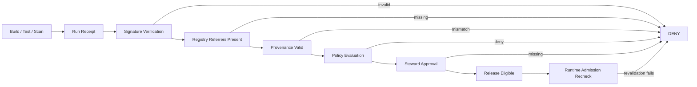
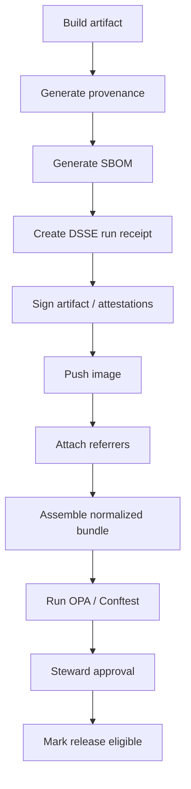
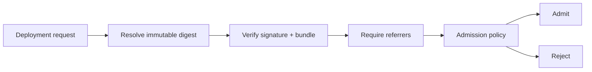

<!-- [KFM_META_BLOCK_V2]
doc_id: kfm://doc/NEEDS-UUID
title: Promotion Contract
type: standard
version: v1
status: draft
owners: NEEDS VERIFICATION
created: 2026-03-30
updated: 2026-03-30
policy_label: public
related:
  - docs/security/README.md
  - docs/architecture/TRUST_MEMBRANE.md
  - docs/architecture/TRUTH_PATH_LIFECYCLE.md
  - policy/
  - contracts/
tags:
  - kfm
  - security
  - supply-chain
  - promotion
  - attestations
notes: Source-bounded draft. Live repo paths, owners, and related anchors NEED VERIFICATION in a mounted checkout.
[/KFM_META_BLOCK_V2] -->

# Promotion Contract

One governed, fail-closed contract for promoting artifacts from build to release to runtime admission.

> [!IMPORTANT]
> **Truth posture:** **PROPOSED** and **source-bounded**. This document is doctrine-aligned and standards-grounded, but **live-tree ownership, exact paths, workflow anchors, and enforcement wiring NEED VERIFICATION** before merge.


**Path:** `docs/security/promotion-contract.md`
**Repo fit:** security + supply-chain governance for artifact promotion and runtime admission

**Quick jumps:** [Scope](#scope) · [Repo fit](#repo-fit) · [Inputs](#accepted-inputs) · [Exclusions](#exclusions) · [Contract](#promotion-contract-a--g) · [Bundle](#normalized-promotion-bundle) · [Policy](#policy-shape) · [CI sketch](#ci-integration-sketch) · [Admission](#runtime-admission) · [Checklist](#definition-of-done)

---

## Scope

This document defines a **promotion contract** for software artifacts. Promotion is not merely “the build passed”; it is a governed decision backed by signed evidence, policy evaluation, and runtime revalidation.

The contract is designed to preserve the KFM trust membrane:

* **authoritative control** remains in signed attestations, governed policy, and steward approval
* **derived layers** remain rebuildable and downstream
* **promotion** fails closed when required evidence is missing, unverifiable, stale, or policy-disallowed

---

## Repo fit

**Upstream / adjacent surfaces**

* `contracts/` — schemas for receipts, approvals, normalized bundles
* `policy/` — Rego policy bundles and obligation logic
* `scripts/` — thin orchestration for assemble / verify / promote
* `tests/` — negative tests, regression fixtures, admission proofs
* `docs/security/` — supply-chain and verification posture
* `docs/architecture/` — trust membrane, canonical vs rebuildable, truth path lifecycle

**Downstream surfaces**

* CI pipelines
* release assembly
* registry publication
* deployment manifests
* cluster admission policy

---

## Accepted inputs

This contract assumes one or more of the following inputs are available during promotion:

* OCI artifact reference and immutable digest
* DSSE-wrapped attestations
* in-toto statements and predicates
* Cosign signatures / verification bundles
* OCI referrers for SBOM / provenance / approval attachments
* policy input bundle for OPA or Conftest
* steward approval attestation
* runtime admission verifier configuration

---

## Exclusions

This document does **not** define:

* vulnerability severity thresholds for a given release
* environment-specific rollout strategy
* key management policy in full detail
* incident response and revocation procedures
* artifact build logic itself
* registry implementation specifics beyond standards-facing expectations

---

## Promotion model

Promotion is treated as a governed truth transition:



---

## Promotion contract (A → G)

### A. Run receipt

The pipeline **MUST** emit a canonical **DSSE envelope** as the primary run receipt. DSSE is designed to authenticate both the payload and its type, avoiding ambiguity and confusion attacks. ([GitHub][1])

**Minimum expectations**

* one receipt per promotion-relevant run
* payload type explicitly declared
* subject artifact identified by immutable digest
* build/run identity present
* timestamps present
* input references present
* envelope signature material present

**Gate result**

* missing receipt → **DENY**
* malformed envelope or unknown payload type → **DENY**
* artifact digest mismatch → **DENY**

---

### B. Signature verification

The promotion surface **MUST** verify the artifact signature with **Cosign** and confirm transparency-log evidence via **Rekor** (or equivalent supported Sigstore bundle verification path). Cosign’s documented verification flow validates the artifact against the signature and certificate/key material, while Sigstore documents Rekor as the transparency log used for timestamped signing evidence. ([Sigstore][2])

**Minimum expectations**

* signature verifies against the target digest
* signer identity matches an allowed issuer/subject rule
* Rekor inclusion or equivalent bundle evidence verifies
* verification runs against immutable digest, not mutable tag alone

**Gate result**

* invalid signature → **DENY**
* signer identity mismatch → **DENY**
* transparency evidence missing or invalid → **DENY**

---

### C. Artifact metadata via OCI referrers

The promoted artifact **MUST** expose required attachments through **OCI referrers** or an equivalent standards-compliant reference mechanism. The ORAS referrers API specification describes referrers as artifacts whose `subject` points at the referenced manifest digest. ([GitHub][3])

**Required attachment classes**

* SBOM
* provenance attestation
* steward approval attestation

**Minimum expectations**

* each attachment resolves to the exact subject digest
* attachment media types are recognized
* registry discoverability works through referrers or compatible fallback

**Gate result**

* missing required attachment class → **DENY**
* subject mismatch → **DENY**
* unresolvable referrer → **DENY**

---

### D. Provenance

Promotion **SHOULD** require a valid **in-toto statement** for build provenance, commonly with a SLSA provenance predicate. The in-toto attestation framework separates **envelope**, **statement**, and **predicate** layers; the statement binds the attestation to the subject and the predicate type. ([GitHub][4])

**Minimum expectations**

* provenance references the exact promoted digest
* build materials / inputs are recorded
* builder identity is captured
* invocation / environment details are sufficient for policy evaluation
* predicate type is known and allowed

**Gate result**

* missing provenance when required → **DENY**
* subject mismatch → **DENY**
* disallowed builder or predicate type → **DENY**

---

### E. Policy evaluation

Promotion **MUST** evaluate a normalized bundle with **OPA / Rego** (for example via Conftest in CI). This is the explicit governance layer: promotion is not allowed by default.

**Policy posture**

* `default allow = false`
* explicit `deny` reasons are first-class evidence
* absence of required fields is a denial condition
* policy output is retained with the promotion record

**Gate result**

* any deny → **DENY**
* missing policy bundle fields → **DENY**
* evaluator failure → **DENY**

---

### F. Steward approval

Promotion to the next governed state **MUST** include a **steward-signed approval attestation**. DSSE itself is just the envelope; the higher-level meaning of multiple signatures / thresholds is left to the application layer, so steward approval is defined here as a separate promotion requirement rather than assumed from DSSE alone. ([GitHub][5])

**Minimum expectations**

* approval is a separately signed attestation
* approval references the exact artifact digest
* steward identity is policy-recognized
* approval includes time and reason / decision code

**Gate result**

* missing steward approval → **DENY**
* non-authorized approver → **DENY**
* approval digest mismatch → **DENY**

---

### G. Runtime admission

Cluster/runtime admission **MUST** revalidate promotion evidence at deployment time. Runtime trust is not inherited solely from CI success; admission is a fresh control point.

**Admission expectations**

* verify signature and signer identity
* verify transparency evidence or bundle
* require SBOM, provenance, and steward approval referrers
* optionally require policy digest or release manifest digest match

**Gate result**

* any required evidence missing at admission → **REJECT**
* verification failure at admission → **REJECT**

---

## Control matrix

| Gate | Required evidence    | Format / mechanism            | Mandatory outcome on failure |
| ---- | -------------------- | ----------------------------- | ---------------------------- |
| A    | run receipt          | DSSE envelope                 | deny                         |
| B    | artifact signature   | Cosign + Rekor/bundle         | deny                         |
| C    | registry attachments | OCI referrers                 | deny                         |
| D    | provenance           | in-toto statement / predicate | deny when required           |
| E    | governance result    | OPA / Rego evaluation         | deny                         |
| F    | steward approval     | DSSE attestation              | deny                         |
| G    | admission proof      | runtime revalidation          | reject deployment            |

---

## Normalized promotion bundle

Promotion checks are easier to reason about if every gate consumes a **single normalized bundle** assembled from raw artifacts.

### Canonical bundle shape

```json
{
  "artifact": {
    "uri": "oci://registry.example/repo/image@sha256:...",
    "digest": "sha256:..."
  },
  "run_receipt": {
    "present": true,
    "payload_type": "application/vnd.kfm.run-receipt.v1",
    "valid": true
  },
  "signature": {
    "valid": true,
    "issuer": "https://token.actions.githubusercontent.com",
    "identity": "https://github.com/org/repo/.github/workflows/release.yml@refs/heads/main",
    "rekor_verified": true
  },
  "sbom": {
    "present": true,
    "media_type": "application/spdx+json",
    "subject_matches": true
  },
  "provenance": {
    "present": true,
    "statement_type": "https://in-toto.io/Statement/v1",
    "predicate_type": "https://slsa.dev/provenance/v1",
    "subject_matches": true,
    "builder_id": "trusted-builder"
  },
  "steward_approval": {
    "present": true,
    "valid": true,
    "approver": "steward@example.org",
    "subject_matches": true
  },
  "policy": {
    "deny": [],
    "warnings": []
  }
}
```

### Bundle invariants

* every subject-bearing document resolves to the **same digest**
* absence of required evidence is represented explicitly
* policy consumes normalized booleans and identifiers, not ad hoc raw registry output
* bundle assembly is reproducible and testable

---

## Suggested attestation shapes

### Run receipt attestation

```json
{
  "payloadType": "application/vnd.kfm.run-receipt.v1",
  "payload": {
    "artifact": {
      "uri": "oci://registry.example/repo/image@sha256:...",
      "digest": "sha256:..."
    },
    "build": {
      "system": "github-actions",
      "workflow": "release.yml",
      "run_id": "123456789"
    },
    "inputs": [
      { "type": "git", "uri": "git+https://github.com/org/repo", "digest": "sha1:..." }
    ],
    "timestamp": "2026-03-30T00:00:00Z"
  },
  "signatures": [
    { "keyid": "", "sig": "..." }
  ]
}
```

### Steward approval attestation

```json
{
  "payloadType": "application/vnd.kfm.steward-approval.v1",
  "payload": {
    "artifact_digest": "sha256:...",
    "decision": "approve",
    "reason_code": "policy-satisfied",
    "approved_by": "steward@example.org",
    "timestamp": "2026-03-30T00:00:00Z"
  },
  "signatures": [
    { "keyid": "", "sig": "..." }
  ]
}
```

### Provenance statement

```json
{
  "_type": "https://in-toto.io/Statement/v1",
  "subject": [
    {
      "name": "registry.example/repo/image",
      "digest": { "sha256": "..." }
    }
  ],
  "predicateType": "https://slsa.dev/provenance/v1",
  "predicate": {
    "buildDefinition": {},
    "runDetails": {}
  }
}
```

> [!NOTE]
> Exact predicate fields depend on the provenance version/profile you adopt. Keep the contract on the verification side stable even if the predicate schema evolves.

---

## Policy shape

A minimal fail-closed policy pattern:

```rego
package kfm.promotion

default allow = false

deny[msg] {
  not input.run_receipt.present
  msg := "run receipt missing"
}

deny[msg] {
  not input.signature.valid
  msg := "signature invalid"
}

deny[msg] {
  not input.signature.rekor_verified
  msg := "rekor verification missing"
}

deny[msg] {
  not input.sbom.present
  msg := "sbom missing"
}

deny[msg] {
  not input.provenance.present
  msg := "provenance missing"
}

deny[msg] {
  not input.provenance.subject_matches
  msg := "provenance subject mismatch"
}

deny[msg] {
  input.provenance.builder_id != "trusted-builder"
  msg := "untrusted builder"
}

deny[msg] {
  not input.steward_approval.present
  msg := "steward approval missing"
}

deny[msg] {
  not input.steward_approval.valid
  msg := "steward approval invalid"
}

allow {
  count(deny) == 0
}
```

### Policy design rules

* `default allow = false`
* every required field is checked directly
* denials are human-readable and stable enough for audit
* warning-only rules are explicitly separated from deny rules
* policy bundle versioning is tracked separately from artifact versioning

---

## CI integration sketch



### Example command sketch

```bash
# verify artifact signature
cosign verify \
  --certificate-identity "${EXPECTED_IDENTITY}" \
  --certificate-oidc-issuer "${EXPECTED_ISSUER}" \
  "${IMAGE_DIGEST_REF}"

# discover required referrers
oras discover "${IMAGE_DIGEST_REF}"

# run policy
conftest test promotion-bundle.json --policy policy/promotion
```

Cosign’s official docs describe signing and verifying artifacts, including keyless and key-based flows, and Sigstore’s quickstart positions Cosign as the recommended CLI for signing and verifying. ([Sigstore][6])

---

## Runtime admission

Promotion is not complete until the runtime plane independently confirms the evidence.

### Admission requirements

* image referenced by immutable digest
* signature verified against expected identity
* transparency evidence verified
* required referrers resolvable
* steward approval present and valid
* optional match against release manifest or policy digest

### Admission pattern



### Runtime law

* CI success alone is insufficient
* mutable tags are insufficient
* cached old verification results are insufficient
* missing evidence at admission is a hard reject

---

## Recommended repo layout

> [!NOTE]
> Paths below are **PROPOSED** and need live-tree verification.

```text
contracts/
  promotion/
    promotion-bundle.schema.json
    run-receipt.schema.json
    steward-approval.schema.json

policy/
  promotion/
    promotion.rego
    data.json

scripts/
  promotion/
    assemble-bundle.sh
    verify-signature.sh
    verify-referrers.sh
    verify-provenance.sh
    require-steward-approval.sh

tests/
  promotion/
    fixtures/
      valid/
      invalid/
    negative/
      missing-sbom/
      invalid-signature/
      wrong-builder/
      missing-approval/
```

---

## Failure semantics

| Condition                         | Outcome | Notes       |
| --------------------------------- | ------- | ----------- |
| run receipt missing               | deny    | gate A      |
| signature invalid                 | deny    | gate B      |
| signer identity mismatch          | deny    | gate B      |
| transparency verification missing | deny    | gate B      |
| required referrer missing         | deny    | gate C      |
| provenance subject mismatch       | deny    | gate D      |
| untrusted builder                 | deny    | gate D/E    |
| policy engine error               | deny    | fail closed |
| steward approval missing          | deny    | gate F      |
| admission recheck fails           | reject  | gate G      |

---

## Definition of done

* [ ] required attestation schemas exist under `contracts/`
* [ ] normalized bundle format is defined and tested
* [ ] policy bundle exists under `policy/`
* [ ] negative tests exist for every gate
* [ ] CI assembles and evaluates the normalized bundle
* [ ] registry publication includes required referrers
* [ ] steward approval is independently signed
* [ ] runtime admission revalidates signatures and attachments
* [ ] doc owners / related paths / anchors verified in live repo
* [ ] examples updated to match actual implementation paths and identities

---

## FAQ

### Why separate steward approval from the build signature?

Because build authenticity and governance approval are different claims. The first says “this artifact was produced by an expected signer”; the second says “this artifact is allowed to advance under governance.”

### Why require OCI referrers instead of sidecar files only?

Because discoverability at the registry boundary matters. Required promotion evidence should follow the artifact and remain resolvable by digest.

### Why normalize into one policy bundle?

Because raw registry outputs, multiple attestation formats, and signer-specific verification outputs are awkward policy inputs. A normalized bundle makes denial logic deterministic and testable.

### Why revalidate at admission?

Because trust is not inherited blindly across boundaries. Runtime is its own control point.

---

## Verification notes

### CONFIRMED

* DSSE is an envelope mechanism that authenticates payload and type. ([GitHub][1])
* Sigstore/Cosign provides signing and verification flows, and Rekor provides transparency-log capabilities. ([Sigstore][2])
* in-toto defines envelope / statement / predicate layers. ([GitHub][4])
* OCI referrers are based on artifacts referencing a subject digest. ([GitHub][3])

### INFERRED

* a KFM release/promotion control should treat steward approval as a separate attestation layer
* normalized bundle assembly belongs near `scripts/` + `contracts/` + `policy/`

### NEEDS VERIFICATION

* exact owners
* exact repo paths
* existing policy bundle names
* CI workflow filenames
* runtime admission controller implementation

---

## Appendix: minimal implementation checklist

<details>
<summary>Expand checklist</summary>

1. Define schema for run receipt
2. Define schema for steward approval
3. Define normalized bundle schema
4. Implement bundle assembly script
5. Implement Cosign verification wrapper
6. Implement referrer discovery wrapper
7. Implement provenance extraction / validation
8. Add Rego policy with fail-closed defaults
9. Add negative fixtures for every denial class
10. Wire CI to block promotion on any denial
11. Wire runtime admission to repeat verification
12. Document operational runbook for failures

</details>

---

[Back to top](#promotion-contract)
