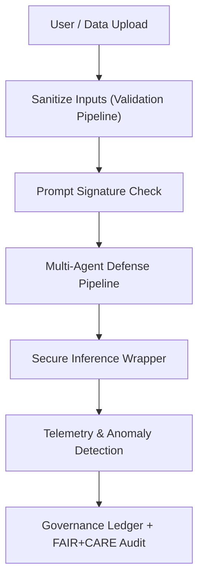

<div align="center">

# 🧠 **Kansas Frontier Matrix — Prompt Injection Defense & Secure AI Governance Integration**
`docs/security/prompt-injection-defense.md`

**Purpose:**  
Defines the defense framework protecting Kansas Frontier Matrix (KFM) AI systems from **prompt injection**, **context poisoning**, and **malicious automation** across pipelines, APIs, and governance layers.  
Implements multi-layer safeguards under **MCP-DL v6.3**, **FAIR+CARE**, and **Diamond⁹ Ω / Crown∞ Ω** certifications.

[](../standards/)
[](../../LICENSE)
[](../standards/faircare/)
[](../../)

</div>

---

## 📘 Overview
Prompt injection attacks embed hidden instructions in user or contextual inputs that override system behavior.  
The Kansas Frontier Matrix (KFM) mitigates this risk through a layered architecture of **signed prompts**, **AI governance**, **telemetry validation**, and **FAIR+CARE-aligned safeguards** across every level of the data-AI-governance stack.

---

## 🗂️ Directory Layout
```
docs/security/
├── prompt-injection-defense.md          # This document
├── ai-threat-model.md                   # AI threat landscape & control taxonomy
├── red-team-protocols.md                # Adversarial testing & injection suite
├── validation/                          # Sanitization and defense scripts
│   ├── sanitize_inputs.py               # Input sanitization filter
│   ├── prompt_signature_check.py        # Signed-prompt verifier
│   ├── anomaly_detector.py              # Real-time telemetry anomaly detection
│   └── reports/                         # Validation and audit outputs
│
└── governance/
    ├── defense-policy.yml               # Policy mappings for FAIR+CARE governance
    ├── audit-template.md                # Structured audit form for reviews
    └── ledger-integration.md            # Provenance + ledger logging specs
```

---

## 🧩 Defense Pattern Integration

| Pattern | Implementation in KFM | Repository Location |
|----------|----------------------|---------------------|
| **1. Signed Prompt Verification** | Embed cryptographic hashes (SHA-256) into all AI prompts; verify integrity before execution | `src/ai/models/**/governance/` |
| **2. Control/Data Flow Separation** | Strict schema separating instructions and data; enforced via `prompt_gate.py` | `src/pipelines/etl/` |
| **3. Microsegmentation** | Data access isolation by workspace layer (raw/work/tmp/processed) | `data/` hierarchy |
| **4. Input Sanitisation** | Regex & AI-based filters detecting directive phrases and invisible characters | `src/pipelines/validation/sanitize_inputs.py` |
| **5. Tool Invocation Validation** | All AI tool calls verified against pre-approved templates | `src/pipelines/ai/actions/` |
| **6. Adversarial Testing** | Automated prompt-injection suite in CI/CD (`prompt-attack-test.yml`) | `.github/workflows/` |
| **7. Monitoring & Anomaly Detection** | Real-time telemetry pipeline monitoring Focus Mode behaviors | `src/pipelines/telemetry/anomaly_detector.py` |
| **8. Inference-Time Scaling** | Secure wrapper generates multiple inference paths for consistency voting | `src/ai/models/focus_transformer_v1/` |
| **9. Multi-Agent Defense Pipeline** | Sanitizer → Verifier → Executor agent chain validating every action | `src/ai/focus/agents/` |
| **10. Data Provenance & Audit Trails** | Provenance signatures and trust-level metadata embedded in all catalogs | `data/processed/**/catalog.json` |

---

## 🧾 Governance & FAIR+CARE Mapping

| FAIR Principle | KFM Alignment | Control Reference |
|----------------|----------------|-------------------|
| **Findable** | Signed prompts linked to manifest entries | `manifest_ref` |
| **Accessible** | Clear provenance audit for AI decisions | `telemetry_ref` |
| **Interoperable** | Defense policies codified in YAML for automation | `governance/defense-policy.yml` |
| **Reusable** | Reproducible sanitization reports and signatures | `validation/reports/` |

| CARE Principle | KFM Implementation | Location |
|----------------|--------------------|-----------|
| **Collective Benefit** | Shared defense modules and AI audit transparency | `docs/standards/faircare/` |
| **Authority to Control** | Explicit user confirmation on agentic actions | `src/api/routes/ai.py` |
| **Responsibility** | Continuous telemetry & CI/CD red-teaming | `.github/workflows/prompt-attack-test.yml` |
| **Ethics** | Automated refusal when suspicious prompts detected | `sanitize_inputs.py` logic |

---

## ⚙️ Workflow → Artifact Mapping

| Workflow | Artifact Produced | Validation Output |
|-----------|------------------|-------------------|
| `sanitize_inputs.yml` | Sanitization report | `validation/reports/sanitize-report.json` |
| `prompt-attack-test.yml` | Adversarial test logs | `reports/audit/prompt-defense.json` |
| `telemetry-monitor.yml` | Focus telemetry stream | `releases/v*/focus-telemetry.json` |
| `ledger-sync.yml` | Governance ledger updates | `docs/standards/governance/LEDGER/` |

---

## 🧩 Governance Automation Flow (Mermaid)



---

## ⚖️ Governance Integration

| Ledger Reference | Function | Frequency |
|------------------|-----------|------------|
| `LEDGER/ai-defense-ledger.json` | Records all defense pipeline events | Continuous |
| `LEDGER/faircare-review.json` | Captures ethical compliance metrics | Quarterly |
| `LEDGER/telemetry-chain.json` | Stores telemetry checksums | Continuous |

---

## 🕰️ Version History

| Version | Date | Author | Summary |
|----------|------|---------|----------|
| v9.7.0 | 2025-11-09 | A. Barta | Initial defense framework integration |
| v9.6.0 | 2025-10-25 | FAIR+CARE Council | Drafted adversarial test protocols |
| v9.5.0 | 2025-10-05 | Governance Ops | Added telemetry & anomaly detection module |

---

<div align="center">

© 2025 Kansas Frontier Matrix · Master Coder Protocol v6.3 · FAIR+CARE Certified · Diamond⁹ Ω / Crown∞ Ω Ultimate Certified  
[Back to Security Docs](./) · [Governance Charter](../standards/governance/ROOT-GOVERNANCE.md)

</div>
