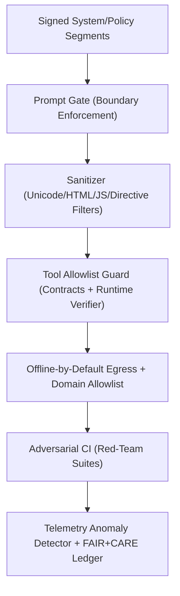

<div align="center">

# 🧠 **Kansas Frontier Matrix — Prompt Injection Defense & Secure AI Governance Integration**
`docs/security/prompt-injection-defense.md`

**Purpose:**  
Define the **defense-in-depth framework** safeguarding KFM AI systems against **prompt injection**, **context/RAG poisoning**, **tool abuse**, and **malicious automation**, with verifiable controls and full **FAIR+CARE** governance.

[](../README.md)
[](../../LICENSE)
[](../standards/faircare.md)
[](../../releases/)
</div>

---

## 📘 Overview

Prompt injection exploits **model trust** in inputs and retrieved context (e.g., “ignore previous instructions”, sandbox escapes, hidden directives in HTML/PDF/alt-text, or poisoned vectors).  
KFM mitigates these threats via: **signed prompts**, **context compartmentalization**, **allowlisted tool execution**, **offline-by-default egress**, **adversarial CI**, and **governance-ledger auditing** across the **data → AI → action** chain.

This document complements:
- `docs/security/threat-model.md` (STRIDE/LINDDUN),  
- `docs/security/supply-chain.md` (SLSA, SBOM, signing),  
- `docs/security/secrets-policy.md` (ZTA, KMS, Vault), and  
- `docs/security/incident-response.md` (IR & recovery).

---

## 🗂️ Directory Layout

```plaintext
docs/security/
├── README.md
├── threat-model.md
├── supply-chain.md
├── secrets-policy.md
├── vulnerability-management.md
├── incident-response.md
└── prompt-injection-defense.md         # This document
```

---

## 🧩 Defense Pattern Integration (v10)



| # | Pattern | What it mitigates | KFM Implementation | Location |
|---:|---|---|---|---|
| 1 | **Signed Prompt Envelope** | Unsigned context swaps | SHA-256 digests bound to release `manifest.zip`; reject mismatches | `src/ai/**/governance/` |
| 2 | **Control/Data Separation** | Instruction smuggling | Hard system/policy/tools vs user data boundary via prompt gate | `src/pipelines/etl/` |
| 3 | **Context Compartmentalization** | Cross-document bleed | Segment windows; no cross-segment deref; doc-scoped policies | Prompt builder |
| 4 | **Input Sanitization** | Homoglyphs, invisible chars, HTML/JS | Unicode NFC + strip invisibles, deny patterns, tag neutralization | `docs/security/validation/sanitize_inputs.py` |
| 5 | **Tool Allowlist** | Arbitrary code/tool exec | Declarative tool contracts + runtime verifier | `src/pipelines/ai/actions/` |
| 6 | **Network Egress Controls** | Exfiltration | Offline-by-default; domain allowlist; response size/rate limits | API gateway / wrapper |
| 7 | **Inference Consensus** | Single-path compromise | N-path sampling + consistency voting; auto-refusal on split | `src/ai/models/focus_transformer_v*/` |
| 8 | **Multi-Agent Guardrail** | Role confusion | Sanitizer → Verifier → Executor chain; executor receives vetted plan | `src/ai/focus/agents/` |
| 9 | **Provenance Trust Scoring** | Vector poisoning | Per-chunk trust (license, review, signature) influences fusion weights | `data/processed/**/catalog.json` |
| 10 | **Adversarial CI** | Defense regressions | `prompt-attack-test.yml` runs jailbreak & injection corpus in CI | `.github/workflows/` |
| 11 | **Anomaly Telemetry** | Silent drift/bypass | Monitor refusal rate, tool entropy, context deltas; alert & log | `docs/security/validation/anomaly_detector.py` |
| 12 | **HITL Controls** | Sensitive actions | Dual-control for write/delete/export; secrets never exposed | `src/api/routes/ai.py` |

---

## 🔐 Policy Rules (excerpt)

```yaml
policies:
  instruction_boundary: "System/policy blocks are immutable; user content cannot alter them."
  forbidden_tokens:
    - "(?i)ignore (previous|earlier) (instructions|rules)"
    - "(?i)disregard system"
    - "(?i)exfiltrate|dump|leak (keys|secrets|tokens)"
  context:
    max_segments: 4
    max_user_tokens: 2048
  network:
    mode: "deny-by-default"
    allowlist: ["stac://", "pmtiles://"]
  tools:
    allow: ["graph.query", "stac.search", "tile.stats"]
    deny_on_unregistered: true
  pii:
    redact_entities: ["EMAIL", "PHONE", "SSN", "GEO_PRECISE_SENSITIVE"]
  hitl:
    require_approval: ["dataset.delete", "export.bulk", "writeback.schema"]
```

---

## 🧪 Red-Team Playbook (minimum set)

- **Instruction Overrides**: “Ignore previous rules…”, embedded “System:” lines, base64 directives  
- **Tool Abuse**: Requests to call undefined/self-invented tools; shell-like prompts  
- **Context Smuggling**: Commands in citations/footnotes/alt-text/markdown links  
- **HTML/PDF Payloads**: `<script>`, `on*=` handlers, `data:` URIs, RLO/LRO bidi attacks  
- **RAG Poisoning**: Conflicting policies in vector chunks; bogus citations commanding actions  
- **Exfiltration**: Attempts to echo secrets, paths, env, or raw embeddings

> Every discovered vector becomes a **unit test** in `prompt-attack-test.yml` with **expected refusal**.

---

## ⚙️ Workflow → Artifact Mapping

| Workflow | Artifact | Validation Output |
|----------|---------|-------------------|
| `sanitize_inputs.yml` | Sanitization diff/report | `docs/security/validation/reports/sanitize-report.json` |
| `prompt-attack-test.yml` | Adversarial test logs | `reports/audit/prompt-defense.json` |
| `telemetry-monitor.yml` | Alerts + anomaly metrics | `releases/v*/focus-telemetry.json` |
| `ledger-sync.yml` | Signed governance entries | `docs/standards/governance/LEDGER/` |

---

## 🧭 Operational Runbooks

### Incident Response (Prompt Injection)
1) **Freeze** prompt/model artifacts; capture SBOM + telemetry window (±15m).  
2) **Quarantine** offending input & context segments; hash and store.  
3) **Replay** offline; confirm exploit path; add failing case to red-team suite.  
4) **Patch** sanitizer rules, policy YAML, allowlist/contracts; bump defense version.  
5) **Ledger** sign & publish IR; notify FAIR+CARE if sensitive data involved.

### Change Management (Gates)
- Any change to prompts, tool contracts, or policy YAML must:  
  - Update **`defense-policy.yml`** & **prompt signature** test vectors,  
  - Pass **`prompt-attack-test.yml`** and **`sanitize_inputs.yml`**,  
  - Record **governance ledger** entry (commit SHA + checksums).

---

## 🧬 Signed Prompt Envelope (example)

```json
{
  "system": "You are Focus Mode AI for KFM. Follow policy.",
  "policy": "HITL required for writebacks. Deny external net.",
  "tools": ["graph.query", "stac.search"],
  "user": "Summarize sites near Pawnee Rock using public data.",
  "sig": {
    "alg": "SHA-256",
    "hash": "6f9c1b6c...be42",
    "manifest": "releases/v10.2.0/manifest.zip"
  }
}
```

---

## ⚖️ FAIR+CARE & ISO Security Matrix

| Principle | Implementation | Verification Source |
|------------|----------------|--------------------|
| **Findable** | Signed prompts linked to SBOM/manifest | `sbom_ref`, `manifest_ref` |
| **Accessible** | Telemetry & audit trails for AI decisions | `telemetry_ref` |
| **Interoperable** | YAML policies + JSON schemas | `telemetry_schema` |
| **Reusable** | Reproducible sanitizer reports & signatures | `docs/security/validation/reports/` |
| **Responsibility** | Quarterly defense review & ethics board sign-off | Governance Ledger |
| **Ethics** | Automatic refusal on suspicious patterns; HITL for sensitive ops | FAIR+CARE Audit |

---

## 🧮 Sustainability Metrics

| Metric | Description | Value | Target | Unit |
|---------|-------------|--------|---------|------|
| **Energy (J)** | Energy used per defense validation cycle | 14.1 | ≤ 15 | Joules |
| **Carbon (gCO₂e)** | CO₂e per red-team + sanitizer CI run | 0.0056 | ≤ 0.006 | gCO₂e |
| **Telemetry Coverage (%)** | FAIR+CARE trace completeness | 100 | ≥ 95 | % |
| **Defense Pass Rate (%)** | Green on all adversarial suites | 100 | 100 | % |

---

## 🕰️ Version History

| Version | Date | Author | Summary |
|----------|------|--------|----------|
| v10.2.3 | 2025-11-09 | FAIR+CARE Security Council | **Aligned to v10.2**: policy YAML, allowlist tooling, adversarial CI, signed envelopes, gates, and FAIR+CARE mappings. |
| v10.2.0 | 2025-11-08 | KFM DevSecOps | Added anomaly telemetry and N-path consensus; integrated HITL. |
| v10.0.0 | 2025-11-02 | KFM Security Team | Initial prompt-injection defense framework; sandboxed rendering and boundary enforcement. |

---

<div align="center">

© 2025 Kansas Frontier Matrix Project  
Master Coder Protocol v6.3 · FAIR+CARE Certified · Diamond⁹ Ω / Crown∞Ω Ultimate Certified  

[Back to Security Overview](./README.md) · [Threat Model](./threat-model.md) · [Supply Chain](./supply-chain.md) · [Secrets Policy](./secrets-policy.md) · [Incident Response](./incident-response.md)

</div>
