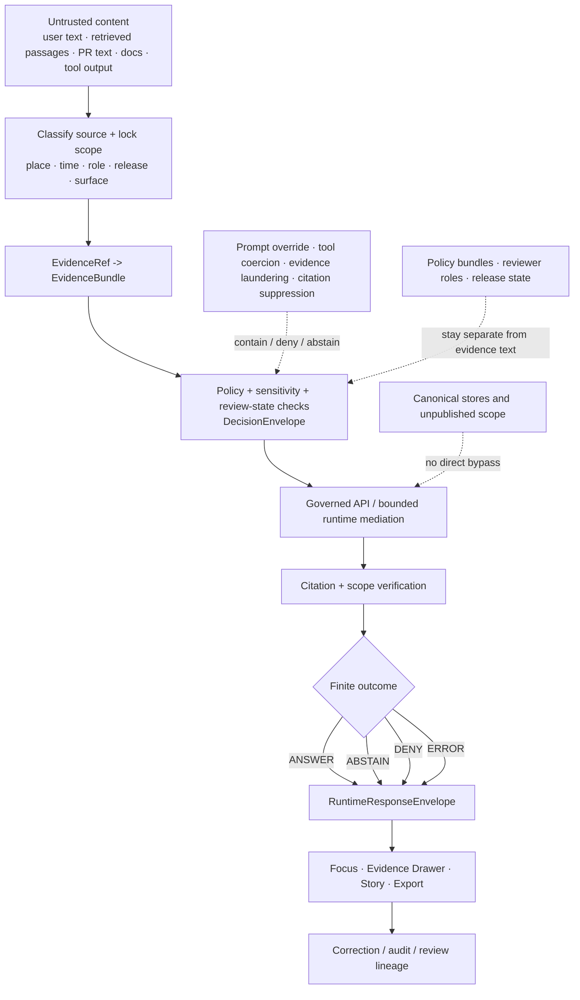

<!-- [KFM_META_BLOCK_V2]
doc_id: kfm://doc/<TODO-VERIFY-UUID>
title: Prompt Injection
type: standard
version: v1
status: draft
owners: @bartytime4life
created: <TODO-VERIFY-CREATED-DATE>
updated: <TODO-VERIFY-UPDATED-DATE>
policy_label: <TODO-VERIFY-POLICY-LABEL>
related: [../README.md, ../threat-model.md, ../prompt-injection-defense.md, ../ai-supply-chain/README.md, ../ai-receipts/README.md, ../../../apps/governed-api/README.md, ../../../policy/README.md, ../../../contracts/README.md, ../../../schemas/README.md, ../../../schemas/contracts/README.md, ../../../tests/README.md, ../../../.github/actions/README.md, ../../../.github/workflows/README.md, ../../../.github/PULL_REQUEST_TEMPLATE.md, ../../../.github/CODEOWNERS]
tags: [kfm, security, prompt-injection, focus-mode, evidence-first]
notes: [Assumed target path based on the uploaded draft and current public-main lane; owner is grounded to current public CODEOWNERS coverage for /docs/; created/updated dates and policy label still require branch-local verification before commit; relative links were corrected to actual repo-root-relative paths.]
[/KFM_META_BLOCK_V2] -->

# Prompt Injection

Public-safe lane README for KFM prompt-injection boundaries across retrieval, runtime mediation, review, and trust-visible product surfaces.


> [!IMPORTANT]
> **Status:** experimental  
> **Owners:** `@bartytime4life`  
> **Path:** `docs/security/prompt-injection/README.md`  
> **Repo fit:** lane README for prompt-injection risks that cross retrieval, runtime mediation, policy, review, and trust-visible UI behavior in `docs/security/`  
> **Upstream / adjacent doctrine:** [`../README.md`](../README.md) · [`../threat-model.md`](../threat-model.md) · [`../prompt-injection-defense.md`](../prompt-injection-defense.md) · [`../ai-supply-chain/README.md`](../ai-supply-chain/README.md) · [`../ai-receipts/README.md`](../ai-receipts/README.md) · [`../../../apps/governed-api/README.md`](../../../apps/governed-api/README.md)  
> **Companion repo surfaces:** [`../../../policy/README.md`](../../../policy/README.md) · [`../../../contracts/README.md`](../../../contracts/README.md) · [`../../../schemas/README.md`](../../../schemas/README.md) · [`../../../tests/README.md`](../../../tests/README.md) · [`../../../.github/actions/README.md`](../../../.github/actions/README.md) · [`../../../.github/workflows/README.md`](../../../.github/workflows/README.md)  
> **Quick jumps:** [Scope](#scope) · [Repo fit](#repo-fit) · [Accepted inputs](#accepted-inputs) · [Exclusions](#exclusions) · [Directory tree](#directory-tree) · [Quickstart](#quickstart) · [Usage](#usage) · [Diagram](#diagram) · [Control surfaces](#control-surfaces) · [Task list](#task-list) · [FAQ](#faq) · [Appendix](#appendix)

> [!WARNING]
> This file defines the **documentation lane** for prompt injection in KFM. It must not be read as proof of live policy bundles, checked-in workflow YAML, deployed runtime adapters, or mounted enforcement paths unless those are directly verified in the branch under review.

* * *

## Scope

In KFM, prompt injection is a **trust-boundary failure mode**, not just a model-prompt quirk.

The problem is broader than “malicious user text.” Any untrusted or semi-trusted text-bearing input can become an injection path if it is allowed to rewrite scope, tool permissions, review state, or citation behavior. That includes user prompts, retrieved passages, tool output, PR text, issue text, docs, OCR, transcripts, and model-facing context assembly.

This lane exists to keep three things explicit:

1. what prompt injection means in **KFM terms**
2. where the repo currently places adjacent control surfaces
3. what must still be marked **UNKNOWN** or **NEEDS VERIFICATION** instead of polished into certainty

### Truth posture used here

| Marker | Meaning in this README |
| --- | --- |
| **CONFIRMED** | Directly grounded in the attached KFM corpus or the current public `main` repo tree |
| **INFERRED** | Conservative interpretation of confirmed doctrine or visible repo structure |
| **PROPOSED** | Safe next-step guidance consistent with KFM doctrine, but not yet proven as current implementation |
| **UNKNOWN** | Not verified strongly enough to present as current reality |
| **NEEDS VERIFICATION** | Explicit branch-local or platform-local detail to confirm before merge |

### What prompt injection tries to do in KFM

A hostile or malformed text payload typically tries to:

- widen geography, time, role, or release scope
- convert evidence text into operating instruction
- coerce tool use, hidden-state disclosure, approval, or publication
- suppress citations, uncertainty, denial, or correction visibility
- make derived text or memory look like sovereign truth
- route around the governed API membrane and trust-visible UI cues

* * *

## Repo fit

This is an **in-place revision lane**, not a net-new concept file. The current public `main` branch already exposes `docs/security/prompt-injection/README.md`, plus sibling secure-AI and threat-model surfaces around it.

### Confirmed adjacent surfaces

| Surface | Why it matters here |
| --- | --- |
| [`../README.md`](../README.md) | Security subtree orientation, lane map, and cross-cutting trust posture |
| [`../threat-model.md`](../threat-model.md) | Cross-cutting trust-boundary and failure-mode framing |
| [`../prompt-injection-defense.md`](../prompt-injection-defense.md) | Concrete defensive patterns and runtime-facing guidance |
| [`../ai-supply-chain/README.md`](../ai-supply-chain/README.md) | Secure-AI runtime, admission, and provenance boundaries that should not collapse into this lane |
| [`../ai-receipts/README.md`](../ai-receipts/README.md) | Receipt, attestation, and proof-object detail for AI-assisted activity |
| [`../../../apps/governed-api/README.md`](../../../apps/governed-api/README.md) | API membrane boundary where no-direct-client-to-model claims belong |
| [`../../../policy/README.md`](../../../policy/README.md) | Deny-by-default rule-pack lane |
| [`../../../tests/README.md`](../../../tests/README.md) | Repo-facing governed verification families |
| [`../../../.github/actions/README.md`](../../../.github/actions/README.md) | Repo-local action scaffolding for validation, policy, provenance, and signing steps |
| [`../../../.github/workflows/README.md`](../../../.github/workflows/README.md) | Current workflow-lane inventory and its evidence limits |

### Current public snapshot

| Surface | Current public posture | Why that changes this README |
| --- | --- | --- |
| `docs/security/prompt-injection/README.md` | Substantive lane README is visible on public `main` | This should read as an in-place improvement, not a hypothetical target |
| `docs/security/prompt-injection/` | No additional child files were directly visible from the directory page | Keep this lane narrow unless executable neighbor surfaces justify more files |
| `docs/security/prompt-injection-defense.md` | Visible sibling standard | Concrete mitigation guidance already has a separate home |
| `docs/security/ai-supply-chain/README.md` | Visible sibling lane | Model-origin, runtime-containment, and secure-AI delivery detail should stay split out |
| `docs/security/ai-receipts/README.md` | Visible sibling lane | Receipt-shape and attestation detail should not drift into this README |
| `apps/governed-api/README.md` | Boundary README is visible; it also points to deeper `apps/api/src/api/README.md` detail elsewhere | Keep no-direct-client-to-model claims anchored to the membrane lane |
| `policy/` | `bundles/`, `fixtures/`, `policy-runtime/`, and `tests/` are visible, but README-heavy on public `main` | Policy presence is real; populated bundle depth is not proven here |
| `tests/` | `contracts/`, `policy/`, `e2e/`, `integration/`, `reproducibility/`, `accessibility/`, and `unit/` are visible | Negative-path proof is already a named repo concern, not a hypothetical one |
| `schemas/` | `contracts/`, `contracts/v1/`, `vocab/`, and `tests/fixtures/` are visible | Prompt-injection vocabulary can point at a live scaffold without claiming semantic maturity |
| `.github/actions/` | Named local action directories are visible, but placeholder-heavy | Action-based validation is plausible without being overstated as current behavior |
| `.github/workflows/` | `README.md` only on current public `main`; public Actions history exposes historical lane names | Current workflow inventory must stay conservative, and historical UI signal must stay explicitly separate |

### Evidence boundary for this doc

| Evidence layer | What this README treats as settled |
| --- | --- |
| Attached KFM doctrine | bounded AI posture, trust membrane, fail-closed behavior, finite runtime outcomes, EvidenceBundle-centered trust, and Evidence Drawer / Focus relationships |
| Current public repo tree | lane placement, sibling docs, visible policy/tests/schema scaffolds, `.github/actions/` placeholder inventory, `.github/workflows/` README-only status |
| Platform / branch-local settings | **UNKNOWN** unless proven in the branch under review: required checks, rulesets, OIDC wiring, environment approvals, app permissions, runtime deployment depth |

* * *

## Accepted inputs

This lane should accept content that helps contributors recognize and route prompt-injection risk **without** turning the file into a payload catalog or a second policy registry.

| Accepted input | Why it belongs here | Posture |
| --- | --- | --- |
| KFM-specific definition of prompt injection | Keeps the lane grounded in trust-membrane doctrine instead of generic jailbreak language | **CONFIRMED** |
| Retrieval, review, CI, and runtime threat paths | KFM risk enters through more than chat prompts alone | **CONFIRMED / INFERRED** |
| Trust-visible UI implications for Focus, Story, Export, and Evidence Drawer behavior | Prompt injection becomes a product trust issue when denial, citation, freshness, or correction visibility can be erased | **CONFIRMED** |
| Routing guidance to policy, tests, contracts, schema scaffolds, and AI-receipt surfaces | Contributors need to know what else must move in the same PR | **CONFIRMED** |
| Public-safe mitigation language | Helps maintainers wire fail-closed behavior without exposing internals or exploit details | **PROPOSED / CONFIRMED** |
| Review prompts and definition-of-done checks | Keeps this lane useful during PR review, not just readable in isolation | **PROPOSED** |

* * *

## Exclusions

This lane should stay narrow and public-safe.

| Keep out of this README | Better home |
| --- | --- |
| Offensive payload catalogs, exploit playbooks, or operator-only incident commands | Private red-team / steward-only materials, not public repo docs |
| AI receipt predicate shape, DSSE / in-toto detail, or attestation walkthroughs | [`../ai-receipts/README.md`](../ai-receipts/README.md) |
| Model-origin, model-admission, runtime-containment, or secure adapter detail with no prompt-injection focus | [`../ai-supply-chain/README.md`](../ai-supply-chain/README.md) |
| Governed API route topology, middleware inventory, or request-boundary ownership | [`../../../apps/governed-api/README.md`](../../../apps/governed-api/README.md) and deeper API docs it names |
| Executable policy bundles, fixtures, or decision logic | [`../../../policy/README.md`](../../../policy/README.md) |
| Contract-schema bodies or canonical vocab definitions | Start at [`../../../contracts/README.md`](../../../contracts/README.md) and [`../../../schemas/README.md`](../../../schemas/README.md); do not silently choose a canonical home if public-main authority is still mixed |
| Negative-path fixtures, policy assertions, or runtime-proof tests | [`../../../tests/README.md`](../../../tests/README.md) and its relevant child families |
| Secrets, internal hostnames, private prompts, or unrestricted canonical-store access notes | Never public docs |

> [!NOTE]
> A useful rule of thumb: if a change would need a validator, attestation checker, or repo-local action to prove it, this README should **name the seam** and **link to the owner**, not absorb the implementation.

* * *

## Directory tree

### Current verified prompt-injection neighborhood

```text
docs/security/
├── README.md
├── ai-receipts/
│   └── README.md
├── ai-supply-chain/
│   └── README.md
├── prompt-injection/
│   └── README.md
├── prompt-injection-defense.md
└── threat-model.md
```

### Relevant companion surfaces

```text
apps/
└── governed-api/
    └── README.md

policy/
├── README.md
├── bundles/
├── fixtures/
├── policy-runtime/
└── tests/

tests/
├── README.md
├── contracts/
├── e2e/
│   └── runtime_proof/
├── policy/
└── reproducibility/

schemas/
├── README.md
├── contracts/
│   ├── README.md
│   ├── v1/
│   │   ├── correction/
│   │   ├── evidence/
│   │   ├── policy/
│   │   └── runtime/
│   └── vocab/
└── tests/

.github/
├── CODEOWNERS
├── PULL_REQUEST_TEMPLATE.md
├── actions/
└── workflows/
```

> [!TIP]
> The tree above is grounded to the **current public `main` snapshot**, not to hidden platform settings or branch-local files. In particular, `.github/workflows/` is publicly **README-only** right now, and `.github/actions/` is present but placeholder-heavy.

* * *

## Quickstart

Use the smallest inspection loop that can keep claims honest.

```bash
# 1) Read the wider security subtree first
sed -n '1,260p' docs/security/README.md
sed -n '1,260p' docs/security/threat-model.md
sed -n '1,260p' docs/security/prompt-injection-defense.md
sed -n '1,260p' docs/security/ai-supply-chain/README.md
sed -n '1,260p' docs/security/ai-receipts/README.md

# 2) Inspect the membrane and proof-adjacent repo surfaces
sed -n '1,260p' apps/governed-api/README.md
sed -n '1,260p' policy/README.md
sed -n '1,260p' tests/README.md
sed -n '1,260p' schemas/README.md

# 3) Inventory what is actually there before you describe it
find docs/security/prompt-injection -maxdepth 3 -type f | sort
find policy -maxdepth 2 -type f | sort
find tests -maxdepth 3 -type f | sort
find schemas/contracts -maxdepth 3 -type f | sort
find .github/actions -maxdepth 2 \( -name 'README.md' -o -name 'action.yml' \) | sort
find .github/workflows -maxdepth 1 -type f \( -name '*.yml' -o -name '*.yaml' -o -name 'README.md' \) | sort

# 4) Confirm review routing before you assert ownership
sed -n '1,240p' .github/CODEOWNERS
sed -n '1,260p' .github/PULL_REQUEST_TEMPLATE.md
```

### Minimal review order

1. Read this file, then [`../README.md`](../README.md) and [`../threat-model.md`](../threat-model.md).
2. Read [`../prompt-injection-defense.md`](../prompt-injection-defense.md) before inventing new mitigation language.
3. Read [`../ai-supply-chain/README.md`](../ai-supply-chain/README.md) and [`../ai-receipts/README.md`](../ai-receipts/README.md) before drifting into receipt or model-origin detail.
4. Confirm the actual branch inventory before mentioning workflow YAML, bundle bodies, or runnable local actions.
5. If behavior changed, update docs, policy, tests, contracts/schema notes, and workflow notes together where those surfaces exist.

* * *

## Usage

| Need | Start here | Then inspect |
| --- | --- | --- |
| Explain prompt injection in KFM terms | This README | [`../threat-model.md`](../threat-model.md) |
| Describe concrete defensive controls | [`../prompt-injection-defense.md`](../prompt-injection-defense.md) | [`../../../policy/README.md`](../../../policy/README.md), [`../../../tests/README.md`](../../../tests/README.md) |
| Review Focus / Evidence Drawer trust implications | This README | [`../../../apps/governed-api/README.md`](../../../apps/governed-api/README.md), [`../ai-supply-chain/README.md`](../ai-supply-chain/README.md) |
| Review AI receipt or attestation implications | [`../ai-receipts/README.md`](../ai-receipts/README.md) | [`../ai-supply-chain/README.md`](../ai-supply-chain/README.md) |
| Check reason / obligation / reviewer vocabulary placement | This README | [`../../../schemas/README.md`](../../../schemas/README.md), [`../../../schemas/contracts/README.md`](../../../schemas/contracts/README.md) |
| Evaluate whether an enforcement claim is safe to write down | This README | [`../../../policy/README.md`](../../../policy/README.md), [`../../../tests/README.md`](../../../tests/README.md), [`../../../.github/workflows/README.md`](../../../.github/workflows/README.md) |

* * *

## Diagram



* * *

## Control surfaces

### Adjacent repo surfaces and responsibilities

| Surface | Prompt-injection responsibility | Current public posture | Read next |
| --- | --- | --- | --- |
| `docs/security/prompt-injection/README.md` | Define the lane, route contributors, and keep trust posture explicit | Substantive lane doc visible | This file |
| `docs/security/prompt-injection-defense.md` | Hold concrete defensive patterns and public-safe implementation guidance | Visible sibling doc | [`../prompt-injection-defense.md`](../prompt-injection-defense.md) |
| `docs/security/ai-supply-chain/README.md` | Hold secure-AI runtime, admission, adapter, and provenance boundaries | Visible sibling doc | [`../ai-supply-chain/README.md`](../ai-supply-chain/README.md) |
| `docs/security/ai-receipts/README.md` | Hold AI receipt and attestation guidance | Visible sibling doc | [`../ai-receipts/README.md`](../ai-receipts/README.md) |
| `apps/governed-api/` | Preserve the no-direct-client-to-model boundary and bounded runtime handoff | Boundary README visible; deeper API docs also exist elsewhere | [`../../../apps/governed-api/README.md`](../../../apps/governed-api/README.md) |
| `policy/` | Carry deny-by-default rules, fixtures, and runtime-policy coordination | Real public lane, but README-heavy on current `main` | [`../../../policy/README.md`](../../../policy/README.md) |
| `tests/` | Carry contract, policy, reproducibility, and runtime-proof verification burden | Real public families are visible | [`../../../tests/README.md`](../../../tests/README.md) |
| `schemas/contracts/v1/` + `schemas/contracts/vocab/` | Provide machine-file scaffold for envelopes and vocabularies this lane talks about | Files are visible on public `main`, but schema authority and semantic maturity remain mixed | [`../../../schemas/README.md`](../../../schemas/README.md), [`../../../schemas/contracts/README.md`](../../../schemas/contracts/README.md) |
| `.github/actions/` | Hold thin repo-local validation / provenance / signing step wrappers | Placeholder-heavy public inventory | [`../../../.github/actions/README.md`](../../../.github/actions/README.md) |
| `.github/workflows/` | Hold merge-gate orchestration and historical workflow reconstruction clues | `README.md` only on public `main`; historical names visible in Actions UI | [`../../../.github/workflows/README.md`](../../../.github/workflows/README.md) |

### Attack and failure families

| Family | What it tries to do | Safe KFM response |
| --- | --- | --- |
| Instruction override | Replace governing instructions with user-supplied or retrieved text | Keep scope, policy, and review-state objects authoritative |
| Review-path contamination | Smuggle approval, denial, or release intent through PR text, issue text, or comments | Treat contributor text as untrusted input, not self-approving control state |
| Tool coercion | Force browsing, command execution, or data access outside the allowed lane | Refuse or ignore; prompt text must not expand tool rights |
| Scope widening | Smuggle in broader geography, time window, role, or release scope | Hold the original scope or fail closed visibly |
| Evidence laundering | Present unsupported claims as if they were retrieved and verified | Resolve support first; fail citation or abstain instead of improvising |
| Citation suppression | Pressure the system to answer without visible support or caveats | Preserve cite-or-abstain behavior and evidence drill-through |
| Hidden-state extraction | Reveal hidden prompts, policy text, review notes, or unreleased material | Deny or abstain; hidden control state is not answer content |
| Sensitivity bypass | Pressure the system to reveal exact, rights-bearing, or review-bound material | Deny, generalize, or escalate to review-required state |
| Calm-failure erosion | Hide denial, stale state, or partial coverage behind polished prose | Keep negative states first-class and visible at the point of use |

_[Back to top](#prompt-injection)_

* * *

## Task list

### Definition of done for this lane

- [ ] The file stays **KFM-specific** and does not collapse into generic LLM-security prose.
- [ ] Relative links resolve correctly from `docs/security/prompt-injection/README.md`.
- [ ] Current public `main` facts, working-branch-only facts, and platform-only facts stay clearly separated.
- [ ] No sentence implies mounted workflow YAML, runnable local actions, populated bundle bodies, or deployed runtime behavior without direct proof.
- [ ] Finite runtime outcomes remain explicit: **ANSWER**, **ABSTAIN**, **DENY**, **ERROR**.
- [ ] Negative states remain valid trust-preserving outcomes, not embarrassing edge cases.
- [ ] Prompt-injection language stays tied to evidence, policy, review, and trust-visible UI behavior.
- [ ] Changes to this lane route readers to the correct deeper surfaces: defense standard, AI supply chain, AI receipts, policy, tests, governed API.

### Companion-change gate

- [ ] If mitigation behavior changed, the related surface changed in the same PR: docs, policy, tests, contracts/schema notes, workflow notes, or runbooks.
- [ ] If reason / obligation / reviewer vocabulary changed, the PR explicitly checked current public placement under `schemas/contracts/vocab/` and did not silently fabricate a canonical home.
- [ ] If envelope families are named, the PR checked current public scaffold paths for `EvidenceBundle`, `DecisionEnvelope`, `RuntimeResponseEnvelope`, and `CorrectionNotice`.
- [ ] If workflow or repo-local action behavior is claimed, the PR distinguishes current checked-in inventory from historical Actions UI signal.
- [ ] If unsafe-output handling changed, denial, abstention, correction, rollback, or generalized-state implications were updated together.

_[Back to top](#prompt-injection)_

* * *

## FAQ

### Is prompt injection only a model prompt problem?

No. In KFM it is also a retrieval, review, CI, scope, evidence, policy, and UI problem. A hostile text payload can fail the system by widening scope, laundering evidence, coercing tools, or hiding denial/citation state even when the model itself appears “well behaved.”

### Does this README prove live prompt-gate or workflow enforcement?

No. It proves a lane, not a deployment. Public `main` confirms adjacent docs and scaffolds, but not checked-in workflow YAML, runtime depth, or platform settings.

### What should the runtime do when it cannot answer safely?

Stay inside finite accountable outcomes: **ANSWER**, **ABSTAIN**, **DENY**, or **ERROR**. KFM should not turn missing evidence or failed citation checks into smooth but unsupported prose.

### Why is prompt injection linked to Focus Mode and the Evidence Drawer?

Because KFM treats consequential claims as trust objects that stay one hop away from inspectable evidence. If hostile text can break that path, the failure is no longer just “prompt quality”; it is a trust-surface failure.

### Where should receipt and attestation detail live?

In [`../ai-receipts/README.md`](../ai-receipts/README.md), not here.

### Why does this README point at both `contracts/` and `schemas/`?

Because current public `main` shows both a human-readable contract lane and a live schema-side scaffold. This file should acknowledge both without silently settling canonical authority if the public repo has not resolved it yet.

### Should this document include offensive payload catalogs?

No. This is a public-safe, contributor-facing lane document. It should help maintainers recognize classes of hostile behavior and wire fail-closed handling without becoming a payload handbook.

_[Back to top](#prompt-injection)_

* * *

## Appendix

<details>
<summary><strong>Appendix A — Current public machine-file scaffold relevant to this lane</strong></summary>

The paths below are **current public inventory**, not automatic proof of semantic maturity or settled authority.

```text
schemas/contracts/v1/
├── correction/
│   └── correction_notice.schema.json
├── evidence/
│   └── evidence_bundle.schema.json
├── policy/
│   └── decision_envelope.schema.json
└── runtime/
    └── runtime_response_envelope.schema.json

schemas/contracts/vocab/
├── obligation_codes.json
├── reason_codes.json
└── reviewer_roles.json
```

Use these paths as **scaffold visibility**, not as a license to overclaim that the vocabularies or schemas are fully populated, authoritative, or already wired into live workflow gates.

</details>

<details>
<summary><strong>Appendix B — Review prompts for maintainers</strong></summary>

Use these when reviewing changes to this lane:

1. Does the change keep prompt injection tied to **evidence**, **policy**, **review**, and **trust surfaces**, or does it drift into generic AI wording?
2. Does any sentence imply current mounted enforcement that is not directly proven?
3. If a behavior-significant claim changed, did the PR update the defense, AI supply-chain, AI-receipt, policy, tests, or workflow notes that would need to move with it?
4. Are denial, abstention, generalization, stale-visible, partial, and correction states still treated as first-class outcomes?
5. Are current public `main` facts kept distinct from branch-local or platform-local assumptions?

</details>

_[Back to top](#prompt-injection)_
