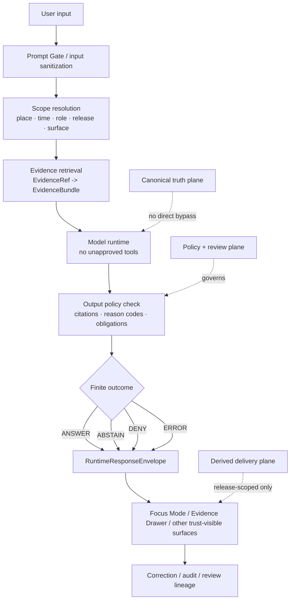

<!-- [KFM_META_BLOCK_V2]
doc_id: kfm://doc/<TODO-VERIFY-UUID>
title: Prompt Injection
type: standard
version: v1
status: draft
owners: <TODO-VERIFY-OWNERS>
created: <TODO-VERIFY-DATE>
updated: <TODO-VERIFY-DATE>
policy_label: <TODO-VERIFY-POLICY-LABEL>
related: [../README.md, ../threat-model.md, ../prompt-injection-defense.md, ../ai-supply-chain/README.md, ../../policy/README.md, ../../contracts/README.md, ../../schemas/README.md, ../../tests/README.md, ../../../.github/workflows/README.md, ../../../.github/PULL_REQUEST_TEMPLATE.md]
tags: [kfm, security, prompt-injection, focus-mode, evidence-first]
notes: [Placeholder metadata fields require mounted-checkout verification before commit; public-main snapshot showed this lane as scaffold-only at review time.]
[/KFM_META_BLOCK_V2] -->

# Prompt Injection

KFM control lane for hostile prompt handling, evidence-bounded AI behavior, and fail-closed runtime outcomes.


> [!IMPORTANT]
> **Status:** experimental  
> **Owners:** NEEDS VERIFICATION  
> **Path:** `docs/security/prompt-injection/README.md`  
> **Repo fit:** upstream [`../README.md`](../README.md) · [`../threat-model.md`](../threat-model.md) · [`../../policy/README.md`](../../policy/README.md) · [`../../contracts/README.md`](../../contracts/README.md)  
> **Downstream / companion surfaces:** [`../prompt-injection-defense.md`](../prompt-injection-defense.md) · [`../ai-supply-chain/README.md`](../ai-supply-chain/README.md) · [`../../tests/README.md`](../../tests/README.md) · [`../../../.github/workflows/README.md`](../../../.github/workflows/README.md)  
> **Quick jumps:** [Scope](#scope) · [Repo fit](#repo-fit) · [Accepted inputs](#accepted-inputs) · [Exclusions](#exclusions) · [Directory tree](#directory-tree) · [Quickstart](#quickstart) · [Usage](#usage) · [Diagram](#diagram) · [Control matrix](#control-matrix) · [Task list](#task-list) · [FAQ](#faq) · [Appendix](#appendix)

> [!WARNING]
> This README defines the **documentation lane** for prompt injection in KFM. It must not be used to imply mounted enforcement, live policy bundles, runnable fixtures, or runtime behavior that has not been directly verified in the repo or operating environment.

## Scope

KFM treats prompt injection as a **trust-boundary failure mode**, not as a purely model-side quirk. In this project, the risk is any input, retrieved text, or runtime instruction that tries to:

- widen scope beyond the allowed place, time, role, release, or surface
- bypass evidence, policy, or review state
- coerce tool use or hidden state disclosure
- suppress citations or flatten uncertainty
- turn unsupported prose into an apparently authoritative answer

### Current posture snapshot

| Item | Status | What that means here |
| --- | --- | --- |
| Directory path exists | **CONFIRMED** | This lane exists in the security subtree and deserves dedicated guidance. |
| Existing public-main file maturity | **CONFIRMED** | The public snapshot was scaffold-only and not sufficient as normative guidance. |
| Companion path exists | **CONFIRMED** | `../prompt-injection-defense.md` exists as an adjacent control surface. |
| Mounted enforcement proof | **UNKNOWN** | Public evidence did not prove workflow YAML, executable policy bundles, schema fixtures, or runtime envelope samples for this lane. |
| Recommended execution direction | **PROPOSED** | Keep this README doctrinal and repo-indexing in role; move concrete control logic into policy, contracts, tests, runbooks, and workflow notes. |

## Repo fit

| Aspect | Fit in this repo |
| --- | --- |
| Directory role | Explain **why prompt injection matters in KFM**, what surfaces it touches, and what companion artifacts must move with it. |
| Upstream dependencies | Security subtree doctrine, threat model, policy posture, contract surfaces, schema authority, tests, and workflow notes. |
| Downstream impact | Focus Mode behavior, Evidence Drawer trust cues, runtime envelopes, policy reason/obligation codes, negative fixtures, and release evidence. |
| Audience | Security reviewers, architecture stewards, policy authors, test authors, workflow maintainers, and UI/runtime contributors touching evidence-bounded AI surfaces. |
| Current boundary | This file is a README-like lane document, **not** the executable source of truth for policy bundles, schema files, or CI gates. |

## Accepted inputs

The following belong here:

| Accepted input | Why it belongs here |
| --- | --- |
| KFM-specific definitions of prompt injection | Keeps the lane grounded in project doctrine instead of generic model folklore. |
| Threat descriptions involving hostile instructions, role confusion, scope override, or citation suppression | These are core trust-boundary risks for Focus Mode and related runtime surfaces. |
| Retrieval-boundary failures | KFM treats unsafe retrieval, source laundering, and scope drift as part of the same control problem. |
| Output-shaping failures | Unsupported certainty, missing citations, erased stale-state cues, or hidden policy denial belong in this lane. |
| Trust-surface expectations | Evidence Drawer visibility, finite runtime outcomes, and negative-state behavior are part of prompt-injection handling in KFM. |
| Contributor guidance | What else must change with this file: policy notes, contracts, fixtures, tests, workflows, and runbooks. |

## Exclusions

The following do **not** belong here:

| Exclusion | Put it here instead |
| --- | --- |
| Mounted claims about live Prompt Gate, OPA/Rego bundles, runtime topology, or CI enforcement | Only state those where directly verified in repo/runtime evidence; otherwise keep them in review notes or verification backlogs. |
| Executable policy bundle source | [`../../policy/README.md`](../../policy/README.md) and the eventual policy bundle/test locations. |
| Canonical machine-contract definitions | [`../../contracts/README.md`](../../contracts/README.md) and whichever single schema authority root the repo confirms. |
| Fixture inventories and negative-path tests | [`../../tests/README.md`](../../tests/README.md) plus mounted fixture/test paths once verified. |
| Workflow implementation details | [`../../../.github/workflows/README.md`](../../../.github/workflows/README.md). |
| Secrets, red-team payload collections, or step-by-step offensive instructions | Out of scope for this README. Keep this document defensive, reviewable, and public-safe. |
| Generic “best practices” not mapped to KFM trust seams | Use a companion research note, not this lane README. |

## Directory tree

Current lane and immediate context:

```text
docs/security/
├── README.md
├── threat-model.md
├── prompt-injection/
│   └── README.md
├── prompt-injection-defense.md
└── ai-supply-chain/
    └── README.md
```

Minimal control-plane context this lane should stay synchronized with:

```text
policy/
├── README.md

contracts/
├── README.md

schemas/
├── README.md

tests/
├── README.md

.github/
├── PULL_REQUEST_TEMPLATE.md
└── workflows/
    └── README.md
```

## Quickstart

1. Read the adjacent security doctrine before editing this lane:
   - [`../README.md`](../README.md)
   - [`../threat-model.md`](../threat-model.md)

2. Check the companion trust surfaces before changing wording that sounds operational:
   - [`../../policy/README.md`](../../policy/README.md)
   - [`../../contracts/README.md`](../../contracts/README.md)
   - [`../../schemas/README.md`](../../schemas/README.md)
   - [`../../tests/README.md`](../../tests/README.md)
   - [`../../../.github/workflows/README.md`](../../../.github/workflows/README.md)

3. Decide which kind of change you are making:
   - **Doctrine clarification**
   - **Control-design clarification**
   - **Mounted-proof update**

4. If behavior changes, update the related surfaces in the **same PR**:
   - docs
   - policy notes or bundles
   - contract notes or schemas
   - valid/invalid fixtures
   - negative-path tests
   - workflow notes or merge-gate docs
   - runbooks if release/correction behavior changed

5. Keep truth labels explicit. If a control is not directly proven, say **UNKNOWN** or **NEEDS VERIFICATION** rather than polishing it into certainty.

### Minimum companion-check set

```text
- docs/security/README.md
- docs/security/threat-model.md
- docs/security/prompt-injection-defense.md
- docs/security/ai-supply-chain/README.md
- policy/README.md
- contracts/README.md
- schemas/README.md
- tests/README.md
- .github/workflows/README.md
- .github/PULL_REQUEST_TEMPLATE.md
```

## Usage

| Need | Start here | Also inspect |
| --- | --- | --- |
| Explain prompt injection in KFM terms | This README | [`../README.md`](../README.md), [`../threat-model.md`](../threat-model.md) |
| Describe concrete defensive controls | [`../prompt-injection-defense.md`](../prompt-injection-defense.md) | [`../../policy/README.md`](../../policy/README.md), [`../../tests/README.md`](../../tests/README.md) |
| Review Focus Mode or Evidence Drawer trust behavior | This README | [`../../contracts/README.md`](../../contracts/README.md), mounted runtime envelope samples if available |
| Wire or review enforcement | [`../../policy/README.md`](../../policy/README.md) | [`../../tests/README.md`](../../tests/README.md), [`../../../.github/workflows/README.md`](../../../.github/workflows/README.md) |
| Evaluate whether a change is safe to publish | This README | release/runbook surfaces, policy decisions, correction notes, and PR validation evidence |

## Diagram



## Control matrix

| Control surface | Prompt-injection objective | Minimum safe behavior | Current posture |
| --- | --- | --- | --- |
| Input boundary | Neutralize hostile instructions before model synthesis | Strip, reject, or contain attempts to override instructions, widen scope, or request disallowed behavior | **CONFIRMED doctrine / UNKNOWN mounted proof** |
| Scope resolution | Prevent silent scope creep | Lock geography, time, role, release window, and surface class before retrieval or synthesis | **CONFIRMED doctrine** |
| Evidence resolution | Prevent unsupported answers and evidence laundering | Resolve evidence first; no outward claim without reconstructible evidence path | **CONFIRMED doctrine / UNKNOWN mounted proof** |
| Model runtime | Prevent rogue tool use and hidden side effects | Default to text generation only; no unapproved internet, filesystem, or database access | **CONFIRMED doctrine / UNKNOWN mounted proof** |
| Output policy gate | Prevent uncited, disallowed, or policy-breaking prose from shipping | Enforce finite outcomes, reason/obligation grammar, and citation checks | **CONFIRMED doctrine / UNKNOWN mounted bundles/tests** |
| Trust-visible UI | Prevent bluffing, hidden denial, or erased uncertainty | Show answer/abstain/deny/error and stale/generalized/partial states visibly | **CONFIRMED doctrine / UNKNOWN mounted UI proof** |
| Verification layer | Prevent “looks safe” from substituting for actual evidence | Run negative-path fixtures, citation-negative tests, surface-state tests, and correction drills | **CONFIRMED doctrine / UNKNOWN mounted harness** |

### Attack and failure families

| Family | What it tries to do | Safe KFM response |
| --- | --- | --- |
| Instruction override | Replace governing instructions with user-supplied text | Ignore hostile override; keep scoped retrieval and policy checks intact |
| Hidden-state extraction | Reveal hidden prompts, internal policy text, or unreleased material | Deny or abstain; never treat hidden system state as normal answer content |
| Tool coercion | Force browsing, code execution, or data access outside the allow-list | Refuse or ignore; do not expand tool rights through prompt text |
| Scope widening | Smuggle in broader geography, time window, role, or release scope | Keep original scope or fail closed visibly |
| Evidence laundering | Present unsupported claims as if retrieved and verified | Fail citation checks; abstain or error rather than improvise |
| Sensitivity bypass | Pressure the system to reveal precise, rights-bearing, or review-bound material | Deny, generalize, or escalate to review-required state |
| Calm-failure erosion | Hide denial, stale state, or partial coverage behind polished prose | Preserve visible negative outcomes and in-place caveats |

## Task list

### Definition of done for this lane

- [ ] The problem statement is **KFM-specific** and does not collapse into generic jailbreak advice.
- [ ] Input, retrieval, runtime, policy, UI, and verification surfaces are all covered.
- [ ] The README clearly distinguishes **CONFIRMED**, **PROPOSED**, **UNKNOWN**, and **NEEDS VERIFICATION** where relevant.
- [ ] Any behavioral change in this lane is mirrored in the related policy / contract / fixture / test / workflow notes.
- [ ] Finite runtime outcomes remain explicit: **ANSWER**, **ABSTAIN**, **DENY**, **ERROR**.
- [ ] Negative states are treated as valid, reviewable outcomes rather than embarrassing edge cases.
- [ ] No wording implies mounted implementation unless direct evidence exists.
- [ ] Sensitive-location, rights-bearing, or review-required consequences remain visible and routed through policy/review surfaces.

### Merge gate expectations for future mounted enforcement

- [ ] Invalid fixtures exist for hostile or unsupported inputs.
- [ ] Citation-negative coverage exists for uncited synthesis.
- [ ] Output-policy checks validate reason and obligation codes.
- [ ] Surface-state tests cover denied, abstained, generalized, partial, stale-visible, and withdrawn states.
- [ ] Correction or rollback notes stay linked to affected runtime surfaces.

_[Back to top](#prompt-injection)_

## FAQ

### Is prompt injection only a model prompt problem?

No. In KFM it is also a retrieval, scope, evidence, policy, and UI problem. A hostile input can fail the system by widening scope, laundering evidence, coercing tools, suppressing citations, or hiding negative outcomes even when the model itself is behaving “normally.”

### Does this README prove Prompt Gate, policy bundles, or workflow gates are already mounted?

No. This README defines the lane and its obligations. Mounted implementation proof belongs in verified repo/runtime evidence, not in optimistic prose.

### What should the runtime do when it cannot answer safely?

It should stay inside finite outcomes: **ANSWER**, **ABSTAIN**, **DENY**, or **ERROR**. KFM should not turn partial support or missing evidence into smooth but unsupported prose.

### Why is prompt injection linked to Focus Mode and the Evidence Drawer?

Because KFM requires consequential claims to remain one hop away from inspectable evidence. If hostile input can break that path, the problem is no longer “just model safety”; it is a trust-surface failure.

### Where should concrete defenses live?

Use this split:

- **This README** for lane definition, scope, and contributor expectations
- [`../prompt-injection-defense.md`](../prompt-injection-defense.md) for concrete defensive patterns and countermeasures
- [`../../policy/README.md`](../../policy/README.md) for decision grammar and deny-by-default posture
- [`../../contracts/README.md`](../../contracts/README.md) for envelope and evidence object families
- [`../../tests/README.md`](../../tests/README.md) for fixtures and negative-path proof
- [`../../../.github/workflows/README.md`](../../../.github/workflows/README.md) for merge-gate documentation

### Should this document include offensive payload catalogs?

No. This is a public-safe, repo-facing control document. It should help contributors recognize classes of hostile behavior and wire fail-closed defenses, not become a payload handbook.

_[Back to top](#prompt-injection)_

## Appendix

<details>
<summary><strong>Appendix A — Illustrative starter decision vocabulary</strong></summary>

These entries are useful as **starter vocabulary** for this lane. Treat them as doctrinally aligned examples until a mounted registry is directly verified.

### Illustrative reason codes

| Code | Typical meaning |
| --- | --- |
| `runtime.evidence_missing` | No reconstructible evidence path exists for the outward claim. |
| `runtime.citation_failed` | Evidence was retrieved but user-visible claims failed citation verification. |
| `policy.denied` | Policy explicitly blocks the requested action or surface. |
| `projection.stale` | A derived surface is older than its declared freshness basis. |

### Illustrative obligation codes

| Code | Typical consequence |
| --- | --- |
| `cite` | Attach inspectable evidence or fail closed. |
| `generalize` | Serve only a generalized representation for this audience. |
| `withhold` | Do not publish or render the object on the requested surface. |
| `review_required` | Escalate to steward or reviewer lane before outward use. |
| `correction_notice` | Publish visible correction state across affected surfaces. |
| `disclose_partial` | Label incomplete coverage in-place. |
| `disclose_modeled` | Label modeled / forecast / assimilated status in-place. |
| `log_audit` | Emit audit linkage and decision trace for the action. |

</details>

<details>
<summary><strong>Appendix B — Illustrative first artifact wave for this lane</strong></summary>

These are **illustrative starter artifacts**, not asserted mounted paths.

```text
contracts/
├── runtime/
│   ├── evidence_bundle.schema.json
│   └── runtime_response_envelope.schema.json
├── policy/
│   └── decision_envelope.schema.json
└── correction/
    └── correction_notice.schema.json

policy/
├── reason_codes.json
├── obligation_codes.json
└── reviewer_roles.json

fixtures/
├── valid/
└── invalid/

tests/
├── contracts/
├── policy/
└── e2e/
```

Why this set matters:

- it gives the lane machine-checkable object boundaries
- it prevents free-text drift in reasons and obligations
- it makes citation-negative and deny/abstain cases testable
- it gives the UI and workflow surfaces something concrete to validate against

</details>

<details>
<summary><strong>Appendix C — Review prompts for maintainers</strong></summary>

Use these during PR review:

1. Does the change keep prompt injection tied to **evidence**, **policy**, and **trust surfaces**, or does it drift into generic AI language?
2. Does any sentence imply mounted enforcement that is not directly proven?
3. If behavior changed, did the PR update **docs + policy + contracts + fixtures/tests + workflow notes** together?
4. Are **negative outcomes** still visible and contract-bearing?
5. Did the change preserve the rule that evidence remains **one hop away** from consequential claims?

</details>

_[Back to top](#prompt-injection)_
