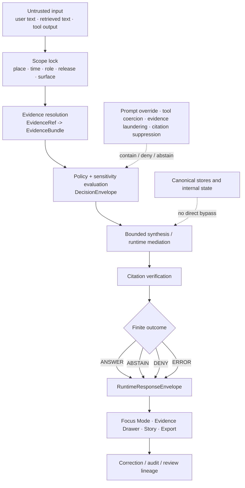

<!-- [KFM_META_BLOCK_V2]
doc_id: kfm://doc/<TODO-VERIFY-UUID>
title: Prompt Injection
type: standard
version: v1
status: draft
owners: <TODO-VERIFY-OWNERS>
created: <TODO-VERIFY-DATE>
updated: <TODO-VERIFY-DATE>
policy_label: <TODO-VERIFY-POLICY-LABEL>
related: [../README.md, ../threat-model.md, ../prompt-injection-defense.md, ../ai-supply-chain/README.md, ../../policy/README.md, ../../contracts/README.md, ../../schemas/README.md, ../../tests/README.md, ../../../.github/workflows/README.md, ../../../.github/PULL_REQUEST_TEMPLATE.md]
tags: [kfm, security, prompt-injection, focus-mode, evidence-first]
notes: [Placeholder metadata fields require mounted-checkout verification before commit; target-relative companion paths are retained from the requested lane and must be reverified in the current repo; prior corpus continuity suggests adjacent prompt-injection materials, but mounted current existence remains NEEDS VERIFICATION.]
[/KFM_META_BLOCK_V2] -->

# Prompt Injection

KFM control lane for hostile prompt handling, evidence-bounded AI behavior, and fail-closed runtime outcomes.


> [!IMPORTANT]
> **Status:** experimental  
> **Owners:** NEEDS VERIFICATION  
> **Path:** `docs/security/prompt-injection/README.md`  
> **Repo fit:** target security lane in `docs/security/`; companion paths below are retained as target-relative links and require mounted-checkout verification  
> **Upstream / adjacent doctrine:** [`../README.md`](../README.md) · [`../threat-model.md`](../threat-model.md) · [`../../policy/README.md`](../../policy/README.md) · [`../../contracts/README.md`](../../contracts/README.md)  
> **Downstream / companion surfaces:** [`../prompt-injection-defense.md`](../prompt-injection-defense.md) · [`../ai-supply-chain/README.md`](../ai-supply-chain/README.md) · [`../../schemas/README.md`](../../schemas/README.md) · [`../../tests/README.md`](../../tests/README.md) · [`../../../.github/workflows/README.md`](../../../.github/workflows/README.md)  
> **Quick jumps:** [Scope](#scope) · [Repo fit](#repo-fit) · [Accepted inputs](#accepted-inputs) · [Exclusions](#exclusions) · [Directory tree](#directory-tree) · [Quickstart](#quickstart) · [Usage](#usage) · [Diagram](#diagram) · [Control matrix](#control-matrix) · [Task list](#task-list) · [FAQ](#faq) · [Appendix](#appendix)

> [!WARNING]
> This README defines the **documentation lane** for prompt injection in KFM. It must not be read as proof of mounted policy bundles, workflow gates, runtime envelopes, UI wiring, or deployed enforcement that has not been directly verified in the repo or runtime environment.

## Scope

KFM treats prompt injection as a **trust-boundary failure mode**, not as a model-only quirk. In this project, the risk includes any input, retrieved text, tool output, or runtime instruction that tries to:

- widen scope beyond the allowed place, time, role, release, or surface
- bypass evidence, policy, review, or release state
- coerce tool use or hidden-state disclosure
- suppress citations, flatten uncertainty, or erase negative outcomes
- turn unsupported prose into apparently authoritative output

### Truth labels used here

| Label | Meaning in this file |
| --- | --- |
| **CONFIRMED** | Directly supported by the attached KFM corpus visible in this session |
| **INFERRED** | Strongly implied by repeated corpus patterns, but not verified as mounted implementation reality |
| **PROPOSED** | Recommended documentation or control shape consistent with doctrine |
| **UNKNOWN** | Not verified strongly enough in the current session |
| **NEEDS VERIFICATION** | Review checkpoint before commit against the mounted checkout |

### Current posture snapshot

| Item | Status | What that means here |
| --- | --- | --- |
| Doctrinal need for a prompt-injection lane | **CONFIRMED** | KFM doctrine requires bounded AI, trust-visible surfaces, evidence resolution, and fail-closed outcomes. |
| Current mounted repo tree for this lane | **NEEDS VERIFICATION** | The current session exposed PDFs only; path-level repo assertions were not directly inspected. |
| Companion-file continuity | **INFERRED** | The requested path and adjacent security surfaces form a coherent lane pattern, but current in-repo existence was not directly reverified. |
| Mounted policy bundles, schemas, tests, workflows, or runtime proofs | **UNKNOWN** | No mounted schema inventory, workflow YAML, tests, manifests, or runtime logs were directly inspected. |
| Recommended role of this README | **PROPOSED** | Keep this file doctrinal, contributor-facing, and lane-defining; put executable control logic in policy, contracts, tests, workflows, and runbooks. |

## Repo fit

| Aspect | Fit in this repo |
| --- | --- |
| Directory role | Explain **why prompt injection matters in KFM**, what surfaces it touches, and what else must move when this lane changes. |
| Audience | Security reviewers, architecture stewards, policy authors, test authors, workflow maintainers, runtime contributors, and UI contributors touching Focus Mode or Evidence Drawer behavior. |
| Upstream dependencies | Security doctrine, threat model, policy posture, contract surfaces, schema authority, test doctrine, and workflow notes. |
| Downstream impact | Focus Mode behavior, Evidence Drawer payloads, runtime envelopes, reason/obligation vocabularies, negative-path fixtures, review flows, and correction visibility. |
| Current boundary | This file is a README-like lane document, **not** the executable source of truth for policy bundles, schema files, merge gates, or runtime adapters. |

## Accepted inputs

The following belong here:

| Accepted input | Why it belongs here |
| --- | --- |
| KFM-specific definitions of prompt injection | Keeps the lane grounded in project doctrine rather than generic jailbreak language. |
| Threat descriptions involving hostile instructions, role confusion, scope override, or citation suppression | These are core trust-boundary risks for Focus Mode and adjacent trust-visible surfaces. |
| Retrieval-boundary failures | KFM treats unsafe retrieval, evidence laundering, and scope drift as part of the same control problem. |
| Output-shaping failures | Unsupported certainty, missing citations, erased stale-state cues, or hidden denial belong in this lane. |
| Trust-surface expectations | Evidence Drawer visibility, finite runtime outcomes, and visible negative states are part of prompt-injection handling in KFM. |
| Contributor guidance | What else must change with this file: policy notes, contracts, fixtures, tests, workflows, and runbooks. |

## Exclusions

The following do **not** belong here:

| Exclusion | Put it here instead |
| --- | --- |
| Mounted claims about live Prompt Gate, OPA/Rego bundles, runtime topology, or CI enforcement | Only state those where directly verified in the repo/runtime evidence; otherwise keep them in review notes or verification backlogs. |
| Executable policy bundle source | [`../../policy/README.md`](../../policy/README.md) and the eventual bundle/test locations |
| Canonical machine-contract definitions | [`../../contracts/README.md`](../../contracts/README.md) and the confirmed schema root |
| Fixture inventories and negative-path tests | [`../../tests/README.md`](../../tests/README.md) plus mounted fixture/test paths once verified |
| Workflow implementation details | [`../../../.github/workflows/README.md`](../../../.github/workflows/README.md) |
| Secrets, payload handbooks, or offensive prompt catalogs | Out of scope for this README; keep this document defensive, reviewable, and public-safe |
| Generic AI “best practices” not mapped to KFM trust seams | Use a research note or supporting standard, not this lane README |

## Directory tree

Target-relative layout to verify before commit:

```text
docs/security/
├── README.md
├── threat-model.md
├── prompt-injection/
│   └── README.md
├── prompt-injection-defense.md
└── ai-supply-chain/
    └── README.md
```

Minimum companion-check set for this lane:

```text
policy/
├── README.md

contracts/
├── README.md

schemas/
├── README.md

tests/
├── README.md

.github/
├── PULL_REQUEST_TEMPLATE.md
└── workflows/
    └── README.md
```

> [!NOTE]
> The trees above are **target-relative expectations**, not confirmed current checkout state. Reverify them against the mounted repository before committing.

## Quickstart

1. Verify the target path and adjacent links against the mounted checkout.
2. Read the adjacent doctrine first:
   - [`../README.md`](../README.md)
   - [`../threat-model.md`](../threat-model.md)
3. Inspect companion surfaces before wording anything that sounds operational:
   - [`../../policy/README.md`](../../policy/README.md)
   - [`../../contracts/README.md`](../../contracts/README.md)
   - [`../../schemas/README.md`](../../schemas/README.md)
   - [`../../tests/README.md`](../../tests/README.md)
   - [`../../../.github/workflows/README.md`](../../../.github/workflows/README.md)
   - [`../../../.github/PULL_REQUEST_TEMPLATE.md`](../../../.github/PULL_REQUEST_TEMPLATE.md)
4. Classify the change:
   - doctrine clarification
   - control-design clarification
   - mounted-proof update
5. If behavior changes, update the related surfaces in the **same PR** where those surfaces exist:
   - docs
   - policy notes or bundles
   - contracts or schemas
   - valid/invalid fixtures
   - negative-path tests
   - workflow notes
   - release or correction runbooks
6. Keep truth labels explicit. If a control is not directly proven, say **UNKNOWN** or **NEEDS VERIFICATION** instead of polishing it into certainty.

## Usage

| Need | Start here | Also inspect |
| --- | --- | --- |
| Explain prompt injection in KFM terms | This README | [`../README.md`](../README.md), [`../threat-model.md`](../threat-model.md) |
| Describe concrete defensive controls | [`../prompt-injection-defense.md`](../prompt-injection-defense.md) | [`../../policy/README.md`](../../policy/README.md), [`../../tests/README.md`](../../tests/README.md) |
| Review Focus Mode or Evidence Drawer trust behavior | This README | [`../../contracts/README.md`](../../contracts/README.md), mounted envelope samples if available |
| Wire or review enforcement | [`../../policy/README.md`](../../policy/README.md) | [`../../tests/README.md`](../../tests/README.md), [`../../../.github/workflows/README.md`](../../../.github/workflows/README.md) |
| Evaluate whether a change is safe to publish | This README | review artifacts, decision envelopes, correction notes, and release evidence |

## Diagram



## Control matrix

| Control surface | Prompt-injection objective | Minimum safe behavior | Current posture |
| --- | --- | --- | --- |
| Input boundary | Neutralize hostile instructions before synthesis | Strip, reject, or contain attempts to override instructions, widen scope, or request disallowed behavior | **CONFIRMED doctrine / UNKNOWN mounted proof** |
| Scope resolution | Prevent silent scope creep | Lock geography, time, role, release window, and surface class before retrieval or synthesis | **CONFIRMED doctrine** |
| Evidence resolution | Prevent unsupported answers and evidence laundering | Resolve evidence first; no outward claim without reconstructible evidence path | **CONFIRMED doctrine / UNKNOWN resolver proof** |
| Runtime mediation | Prevent rogue tool use and hidden side effects | Keep model behavior subordinate to evidence, policy, and release state | **CONFIRMED doctrine / UNKNOWN mounted adapter path** |
| Citation gate | Prevent unsupported prose from shipping as truth | Verify citations or fail closed into abstain/deny/error | **CONFIRMED doctrine / UNKNOWN harness proof** |
| Trust-visible UI | Prevent bluffing, hidden denial, or erased caveats | Show provenance, freshness, review state, and negative outcomes at the point of use | **CONFIRMED doctrine / UNKNOWN mounted UI proof** |
| Verification layer | Prevent “looks safe” from substituting for evidence | Run citation-negative, stale-scope, partial-coverage, conflict, deny, and abstain tests | **CONFIRMED doctrine / UNKNOWN mounted tests** |

### Attack and failure families

| Family | What it tries to do | Safe KFM response |
| --- | --- | --- |
| Instruction override | Replace governing instructions with user-supplied text | Ignore hostile override; keep scoped retrieval and policy checks intact |
| Hidden-state extraction | Reveal hidden prompts, policy text, or unreleased material | Deny or abstain; do not treat hidden system state as answer content |
| Tool coercion | Force browsing, code execution, or data access outside allowed boundaries | Refuse or ignore; prompt text must not expand tool rights |
| Scope widening | Smuggle in broader geography, time window, role, or release scope | Keep original scope or fail closed visibly |
| Evidence laundering | Present unsupported claims as if retrieved and verified | Fail citation/evidence checks; abstain or error rather than improvise |
| Citation suppression | Push the system to answer without support or to hide evidence traces | Preserve cite-or-abstain behavior and evidence drill-through |
| Sensitivity bypass | Pressure the system to reveal precise, rights-bearing, or review-bound material | Deny, generalize, or escalate to review-required state |
| Calm-failure erosion | Hide denial, stale state, or partial coverage behind polished prose | Preserve visible negative outcomes and in-place caveats |

## Task list

### Definition of done for this lane

- [ ] The problem statement stays **KFM-specific** and does not collapse into generic jailbreak language.
- [ ] Input, retrieval, runtime, policy, UI, and verification surfaces are all covered.
- [ ] The README clearly distinguishes **CONFIRMED**, **INFERRED**, **PROPOSED**, **UNKNOWN**, and **NEEDS VERIFICATION** where relevant.
- [ ] No sentence implies mounted implementation unless direct evidence exists.
- [ ] Finite runtime outcomes remain explicit: **ANSWER**, **ABSTAIN**, **DENY**, **ERROR**.
- [ ] Negative states are treated as valid, reviewable outcomes rather than embarrassing edge cases.
- [ ] Sensitive-location, rights-bearing, or review-required consequences remain visible and routed through policy/review surfaces.
- [ ] Relative links and metadata placeholders are rechecked before commit against the mounted checkout.

### Companion-change gate for future mounted enforcement

- [ ] Invalid fixtures exist for hostile or unsupported inputs.
- [ ] Citation-negative coverage exists for uncited synthesis.
- [ ] Output-policy checks validate reason and obligation codes.
- [ ] Surface-state tests cover denied, abstained, generalized, partial, stale-visible, and withdrawn states.
- [ ] Correction or rollback notes stay linked to affected runtime surfaces.
- [ ] Review artifacts or decision envelopes exist where policy-significant release actions are involved.

_[Back to top](#prompt-injection)_

## FAQ

### Is prompt injection only a model prompt problem?

No. In KFM it is also a retrieval, scope, evidence, policy, and UI problem. A hostile input can fail the system by widening scope, laundering evidence, coercing tools, suppressing citations, or hiding negative outcomes even when the model itself is behaving “normally.”

### Does this README prove Prompt Gate, policy bundles, or workflow gates are already mounted?

No. This README defines the lane, the language, and the contributor obligations. Mounted implementation proof belongs in verified repo or runtime evidence, not in optimistic prose.

### What should the runtime do when it cannot answer safely?

Stay inside finite outcomes: **ANSWER**, **ABSTAIN**, **DENY**, or **ERROR**. KFM should not turn partial support or missing evidence into smooth but unsupported prose.

### Why is prompt injection linked to Focus Mode and the Evidence Drawer?

Because KFM requires consequential claims to remain one hop away from inspectable evidence. If hostile input can break that path, the failure is no longer “just model safety”; it is a trust-surface failure.

### Where should concrete defenses live?

Use this split:

- **This README** for lane definition, scope, and contributor expectations
- [`../prompt-injection-defense.md`](../prompt-injection-defense.md) for concrete defensive patterns and countermeasures
- [`../../policy/README.md`](../../policy/README.md) for deny-by-default policy posture and decision grammar
- [`../../contracts/README.md`](../../contracts/README.md) for envelopes, evidence objects, and proof-bearing contract families
- [`../../tests/README.md`](../../tests/README.md) for fixtures and negative-path proof
- [`../../../.github/workflows/README.md`](../../../.github/workflows/README.md) for merge-gate documentation

### Should this document include offensive payload catalogs?

No. This is a public-safe, repo-facing control document. It should help contributors recognize classes of hostile behavior and wire fail-closed defenses, not become a payload handbook.

_[Back to top](#prompt-injection)_

## Appendix

<details>
<summary><strong>Appendix A — Illustrative starter decision vocabulary</strong></summary>

These entries are useful as **starter vocabulary** for this lane. Treat them as doctrinally aligned examples until a mounted registry is directly verified.

### Illustrative reason codes

| Code | Typical meaning |
| --- | --- |
| `runtime.evidence_missing` | No reconstructible evidence path exists for the outward claim. |
| `runtime.citation_failed` | Evidence was retrieved but user-visible claims failed citation verification. |
| `policy.denied` | Policy explicitly blocks the requested action or surface. |
| `release.docs_gate_failed` | Documentation or accessibility gate did not pass for the release candidate. |
| `projection.stale` | A derived projection is older than its declared freshness basis. |

### Illustrative obligation codes

| Code | Typical consequence |
| --- | --- |
| `generalize` | Serve only a generalized representation for this audience. |
| `withhold` | Do not publish or render the object on the requested surface. |
| `review_required` | Escalate to steward or reviewer lane before outward use. |
| `correction_notice` | Publish visible correction state across affected surfaces. |
| `rebuild_projection` | Rebuild tiles/search/vector/scene outputs from corrected release scope. |
| `cite` | Attach inspectable evidence or fail closed. |
| `disclose_partial` | Label incomplete coverage in-place. |
| `disclose_modeled` | Label modeled / assimilated / forecast status in-place. |
| `log_audit` | Emit audit linkage and decision trace for the action. |

</details>

<details>
<summary><strong>Appendix B — PROPOSED first-wave companion artifacts for this lane</strong></summary>

These are **proposed starter artifacts**, not asserted mounted paths.

```text
contracts/
├── runtime/
│   ├── evidence_bundle.schema.json
│   └── runtime_response_envelope.schema.json
├── policy/
│   └── decision_envelope.schema.json
└── correction/
    └── correction_notice.schema.json

policy/
├── reason_codes.json
├── obligation_codes.json
└── reviewer_roles.json

fixtures/
├── valid/
└── invalid/

tests/
├── contracts/
├── policy/
└── e2e/
```

Why this set matters:

- it gives the lane machine-checkable object boundaries
- it prevents free-text drift in reasons and obligations
- it makes citation-negative and deny/abstain cases testable
- it gives UI and workflow surfaces something concrete to validate against

</details>

<details>
<summary><strong>Appendix C — Review prompts for maintainers</strong></summary>

Use these during PR review:

1. Does the change keep prompt injection tied to **evidence**, **policy**, and **trust surfaces**, or does it drift into generic AI language?
2. Does any sentence imply mounted enforcement that is not directly proven?
3. If behavior changed, did the PR update **docs + policy + contracts + fixtures/tests + workflow notes** together where those surfaces exist?
4. Are **negative outcomes** still visible and contract-bearing?
5. Did the change preserve the rule that evidence remains **one hop away** from consequential claims?

</details>

_[Back to top](#prompt-injection)_
