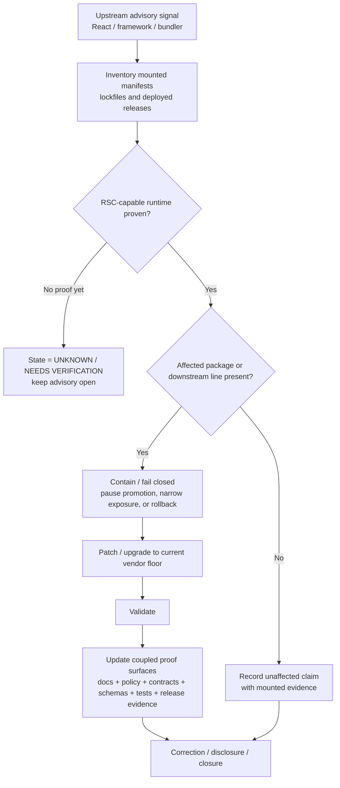

<!-- [KFM_META_BLOCK_V2]
doc_id: kfm://doc/<NEEDS_VERIFICATION_UUID>
title: React2Shell advisory
type: standard
version: v1
status: draft
owners: @bartytime4life
created: YYYY-MM-DD
updated: YYYY-MM-DD
policy_label: public
related: [docs/security/README.md, docs/security/react2shell/README.md, docs/security/vulnerability-management.md, SECURITY.md, .github/dependabot.yml]
tags: [kfm, security, advisory, react2shell, react, rsc]
notes: [doc_id placeholder pending authoritative UUID assignment, dates pending commit metadata, latest official React and Next.js advisory family reviewed through 2026-01-26, public repo evidence does not prove current KFM package inventory or deployed exposure]
[/KFM_META_BLOCK_V2] -->

# React2Shell advisory

_Evidence-first KFM advisory leaf for React Server Components / React2Shell exposure, containment, verification, and correction-aware remediation._

> **Status:** experimental  
> **Owners:** `@bartytime4life` *(confirmed current public `/docs/` coverage in `CODEOWNERS`; finer-grained security-owner split still needs verification)*  
>        
> **Quick jumps:** [Scope](#scope) · [Repo fit](#repo-fit) · [Accepted inputs](#accepted-inputs) · [Exclusions](#exclusions) · [Current verified snapshot](#current-verified-snapshot) · [Directory tree](#directory-tree) · [Quickstart](#quickstart) · [Usage](#usage) · [Diagram](#diagram) · [Tables](#tables) · [Task list](#task-list--gates--definition-of-done) · [FAQ](#faq) · [Appendix](#appendix)  
> **Repo fit:** `docs/security/react2shell-advisory/README.md` · upstream [`../README.md`](../README.md) · upstream [`../../README.md`](../../README.md) · adjacent [`../vulnerability-management.md`](../vulnerability-management.md) · sibling [`../react2shell/README.md`](../react2shell/README.md) · coupled [`../../../SECURITY.md`](../../../SECURITY.md), [`../../../.github/dependabot.yml`](../../../.github/dependabot.yml), [`../../../policy/README.md`](../../../policy/README.md), [`../../../contracts/README.md`](../../../contracts/README.md), [`../../../schemas/README.md`](../../../schemas/README.md), [`../../../tests/README.md`](../../../tests/README.md)

> [!WARNING]
> **CONFIRMED:** this path exists on public `main`, and the checked-in leaf is already substantive.  
> **CONFIRMED:** parts of the current public text still describe this lane as if it were scaffold-only; that self-description is stale and should be corrected here.  
> **UNKNOWN:** whether Kansas Frontier Matrix currently ships a vulnerable React / Next.js / React Server Components runtime.  
> Do **not** close this advisory as “not affected” until mounted manifests, lockfiles, and deployed release evidence are inspected.

> [!CAUTION]
> Do **not** stop at an early December 2025 patch floor.  
> For the official advisory family reviewed for this revision, the latest React package floor is **`19.0.4` / `19.1.5` / `19.2.4`**. Earlier December patch floors were interim and later follow-on advisories superseded them.

| At a glance | Working rule |
|---|---|
| Advisory purpose | Turn upstream React2Shell signal into a KFM-safe triage, containment, validation, and correction path |
| Truth posture | Keep `CONFIRMED`, `INFERRED`, `PROPOSED`, `UNKNOWN`, and `NEEDS VERIFICATION` explicit |
| Local exposure claim | Stay **UNKNOWN** until mounted package and deployment evidence exist |
| Closure rule | A patch alone is not closure; docs, policy, contracts, tests, and visible correction state must line up |

## Scope

This file owns the **issue-specific advisory lane** for React2Shell as it matters to Kansas Frontier Matrix.

It should answer questions like these:

1. What is the upstream advisory family, in its current usable form?
2. Which repo and release surfaces must be checked before KFM claims “affected” or “not affected”?
3. Which proof-bearing artifacts should move with containment or remediation?
4. When does this issue require visible correction, advisory linkage, or rollback rather than a silent dependency bump?

This file should stay focused on the **React2Shell / React Server Components advisory path**. Broader cross-cutting vulnerability lifecycle guidance belongs in [`../vulnerability-management.md`](../vulnerability-management.md).

## Repo fit

| Item | Value |
|---|---|
| **Path** | `docs/security/react2shell-advisory/README.md` |
| **Role in repo** | Narrow advisory leaf for the React2Shell / React Server Components security family |
| **Upstream** | [`../README.md`](../README.md), [`../../README.md`](../../README.md), [`../vulnerability-management.md`](../vulnerability-management.md) |
| **Adjacent** | [`../react2shell/README.md`](../react2shell/README.md) |
| **Operationally coupled surfaces** | [`../../../SECURITY.md`](../../../SECURITY.md), [`../../../.github/dependabot.yml`](../../../.github/dependabot.yml), [`../../../policy/README.md`](../../../policy/README.md), [`../../../contracts/README.md`](../../../contracts/README.md), [`../../../schemas/README.md`](../../../schemas/README.md), [`../../../tests/README.md`](../../../tests/README.md) |
| **Typical reader** | maintainer, reviewer, incident responder, release steward |
| **What this file should do** | summarize advisory state, define KFM triage posture, point to coupled proof surfaces, and prevent “safe by assumption” closure |
| **What this file must not do** | store secrets, embed exploit payloads, duplicate canonical architecture manuals, or imply mounted runtime/package reality without direct evidence |

Working relationship with the sibling lane:

- Use [`../react2shell/README.md`](../react2shell/README.md) for **family-level** or package-family orientation.
- Keep this file **issue-specific**: current advisory state, KFM verification burden, containment path, and closure conditions.
- If the family lane and the advisory lane start to drift, prefer one authoritative issue leaf over duplicated parallel version matrices.

## Accepted inputs

Content that belongs here:

- official React and framework/bundler advisories relevant to React2Shell
- mounted package inventories, lockfile evidence, and version-diff notes
- deployed release evidence that proves whether a public or steward-facing runtime was exposed
- KFM containment decisions, rollback notes, and correction/advisory linkage
- safe detection guidance, triage commands, and reviewer/operator checklists
- proof-bearing deltas that must move with remediation: docs, policy, contracts, tests, runbooks, release evidence

Framework- or bundler-specific detail only belongs here when package or runtime evidence proves it is relevant to KFM. That includes, for example, `next`, `react-router`, `waku`, `@parcel/rsc`, `@vitejs/plugin-rsc`, or `rwsdk`.

## Exclusions

| Keep out of this file | Where it goes instead | Why |
|---|---|---|
| Secrets, tokens, keys, live credentials | deployment environment or secret boundary | docs must never become a secret surface |
| Raw incident artifacts or restricted evidence | governed evidence stores and steward-only review lanes | this leaf should guide response without widening exposure |
| Exploit payloads, weaponized proof-of-concepts, or replayable attack strings | restricted security review material | this file is for triage and governance, not exploit distribution |
| General vulnerability lifecycle doctrine | [`../vulnerability-management.md`](../vulnerability-management.md) | keep this leaf issue-specific |
| Broad security architecture copied verbatim | [`../README.md`](../README.md), [`../../../SECURITY.md`](../../../SECURITY.md) | avoid duplicated doctrine surfaces |
| Executable policy expressed only as prose | [`../../../policy/README.md`](../../../policy/README.md) plus verified policy bundles/tests | reviewer guidance belongs here; enforcement does not |
| Contract bodies or schema authorities | [`../../../contracts/README.md`](../../../contracts/README.md), [`../../../schemas/README.md`](../../../schemas/README.md) | do not create a second contract home |
| Repo/runtime claims not directly evidenced | leave as `UNKNOWN` / `NEEDS VERIFICATION` | KFM requires visible uncertainty |

## Current verified snapshot

| Signal | Label | What it means now |
|---|---|---|
| `docs/security/react2shell-advisory/README.md` exists on public `main` | **CONFIRMED** | this is the correct repo-native path for the advisory leaf |
| Current public leaf is already substantive | **CONFIRMED** | this file is not a placeholder anymore; revision should preserve substance rather than restart from zero |
| Current public leaf still says it is scaffold-only | **CONFIRMED** | that self-description is stale and should be removed |
| `docs/security/react2shell/README.md` also exists and is substantive | **CONFIRMED** | the sibling lane is real, even though it remains verification-bounded rather than runtime-proving |
| `docs/security/README.md` routes readers to both `react2shell` and `react2shell-advisory` | **CONFIRMED** | the broader security subtree already expects both lanes |
| `/docs/` owner is `@bartytime4life` in current public `CODEOWNERS` | **CONFIRMED** | direct docs ownership is visible; narrower security reviewer split still needs verification |
| `.github/dependabot.yml` documents npm monitoring for `/`, `/apps/*`, and `/packages/*` | **CONFIRMED** | package-update coverage is documented at repo level |
| `apps/explorer-web/`, `apps/governed-api/`, `apps/review-console/`, `apps/workers/`, and `apps/cli/` all exist on public `main` | **CONFIRMED** | runtime inspection should start there, but directory existence is not proof of package inventory or deployment exposure |
| Mounted `package.json` / lockfile inventory for KFM | **UNKNOWN / NEEDS VERIFICATION** | public docs and directory READMEs do not prove exact dependency state |
| Deployed RSC / App Router / Server Function exposure in current KFM releases | **UNKNOWN / NEEDS VERIFICATION** | no mounted runtime or release evidence is established here |
| Automated remediation / merge-blocking closure for this advisory family | **UNKNOWN / NEEDS VERIFICATION** | documentary surfaces exist, but active gate behavior still needs direct verification |

## Directory tree

```text
docs/security/react2shell-advisory/
└── README.md
```

Adjacent currently relevant surfaces:

```text
docs/security/
├── README.md
├── vulnerability-management.md
├── react2shell/
│   └── README.md
└── react2shell-advisory/
    └── README.md
```

Relevant public app boundaries to inspect before any “not affected” conclusion:

```text
apps/
├── cli/
├── explorer-web/
├── governed-api/
├── review-console/
└── workers/
```

Potentially coupled proof surfaces outside this lane:

```text
.github/dependabot.yml
SECURITY.md
policy/README.md
contracts/README.md
schemas/README.md
tests/README.md
```

## Quickstart

These commands are intentionally **verification-first** and **read-only** until you decide to patch.

```bash
# 1) Inventory manifests and lockfiles in a mounted checkout
find . \
  \( -name package.json -o -name package-lock.json -o -name pnpm-lock.yaml -o -name yarn.lock -o -name bun.lockb \) \
  2>/dev/null | sort

# 2) Search for React2Shell-relevant packages and likely downstream frameworks
grep -RInE '"(next|react|react-dom|react-server-dom-webpack|react-server-dom-parcel|react-server-dom-turbopack|react-router|waku|@parcel/rsc|@vitejs/plugin-rsc|rwsdk)"' \
  . 2>/dev/null

# 3) Search for likely RSC / Server Function indicators
grep -RInE "'use server'|\"use server\"|server actions|server functions|react-server" \
  apps packages . 2>/dev/null

# 4) Confirm which trust-bearing proof surfaces must move with a fix
find docs/security policy contracts schemas tests .github \
  -maxdepth 5 -type f 2>/dev/null | sort | head -n 300
```

Minimal triage order:

1. **Prove whether any mounted dependency tree includes an affected RSC package or a downstream framework that can expose the vulnerable protocol.**
2. **Classify public, steward, and internal blast radius before polishing remediation notes.**
3. **Contain first if exposure is plausible.** Prefer a safe visible state over an optimistic uncertain one.
4. **Upgrade to the current vendor-advised floor for the affected line.**
5. **Move proof surfaces together**: docs, policy, contracts, schemas, tests, and release/correction evidence.

## Usage

| When you need to… | Start here | Then verify or continue with… |
|---|---|---|
| Determine whether KFM is currently affected | this file | mounted manifests, lockfiles, deployment evidence, and release history |
| Record the advisory and containment path | this file | correction/release evidence surfaces once verified |
| Handle the cross-cutting lifecycle of remediation | [`../vulnerability-management.md`](../vulnerability-management.md) | coupled proof and release surfaces |
| Understand subtree-wide security doctrine | [`../README.md`](../README.md), [`../../../SECURITY.md`](../../../SECURITY.md) | canonical KFM manuals if needed |
| Update policy / contract / test consequences of a fix | this file for coupling rules | [`../../../policy/README.md`](../../../policy/README.md), [`../../../contracts/README.md`](../../../contracts/README.md), [`../../../schemas/README.md`](../../../schemas/README.md), [`../../../tests/README.md`](../../../tests/README.md) |
| Track a broader React2Shell family lane later | [`../react2shell/README.md`](../react2shell/README.md) | keep this leaf focused on the advisory itself |

Working rule: **do not let this leaf become a detached incident diary**. It should remain a precise advisory surface that helps reviewers and maintainers decide, prove, and close correctly.

## Diagram



## Tables

### Official React advisory family reviewed for this leaf

| Advisory stage | Official disclosure | React `react-server-dom-*` floor introduced at that stage | KFM working rule |
|---|---|---|---|
| **Initial critical disclosure** | **CVE-2025-55182** — unauthenticated RCE in React Server Components / Server Function endpoints | `19.0.1` / `19.1.2` / `19.2.1` | First emergency floor only; not sufficient for closure on its own |
| **First December follow-up** | **CVE-2025-55183** source code exposure and **CVE-2025-55184** DoS | `19.0.2` / `19.1.3` / `19.2.2` | Interim floor only |
| **Incomplete-fix follow-up** | **CVE-2025-67779** — complete DoS fix replacing the incomplete December follow-up patch | `19.0.3` / `19.1.4` / `19.2.3` | Still not the final reviewed floor |
| **January 26, 2026 follow-up** | **CVE-2026-23864** — additional DoS family follow-up | `19.0.4` / `19.1.5` / `19.2.4` | Current official React floor reviewed for this revision |

### KFM exposure decision matrix

| Condition | Label to use here | Immediate next action |
|---|---|---|
| No mounted JS/TS manifests or lockfiles reviewed yet | **UNKNOWN** | keep advisory open; inventory first |
| Framework or bundler is present, but RSC capability and deployed release are unresolved | **NEEDS VERIFICATION** | prove App Router / RSC / Server Function usage before closing |
| Affected `react-server-dom-*` package is present below the current safe floor | **CONFIRMED (affected package state)** | contain, patch, validate, and record correction path |
| Next.js App Router is proven on an affected release line | **CONFIRMED (affected runtime class)** | follow current official downstream patch guidance for that line and preserve correction lineage |
| React/browser UI exists, but mounted proof shows no server and no RSC-capable framework/bundler/plugin | **CONFIRMED (non-affected upstream precondition)** + **PROPOSED local close path** | record the evidence, keep the advisory linked, and close only with mounted proof |
| Historically public and unpatched exposure is suspected | **NEEDS VERIFICATION** | reconstruct release window, decide on correction visibility and secret-rotation consequences explicitly |
| Public tree alone “looks thin,” so impact is assumed impossible | **INVALID CLOSE PATH** | do not use README depth or docs-only surfaces as a security proof |

### Repo-coupled surfaces that should move with remediation

| Surface | Why it should move with this advisory |
|---|---|
| [`../vulnerability-management.md`](../vulnerability-management.md) | cross-cutting lifecycle and closure expectations |
| [`../README.md`](../README.md) | subtree doctrine and lane routing |
| [`../../../SECURITY.md`](../../../SECURITY.md) | repo-level public security posture if behavior changes materially |
| [`../../../policy/README.md`](../../../policy/README.md) | deny-by-default, reasons/obligations, and runtime trust outcomes |
| [`../../../contracts/README.md`](../../../contracts/README.md) | trust-bearing object vocabulary if remediation changes outward or review-facing behavior |
| [`../../../schemas/README.md`](../../../schemas/README.md) | avoid drifting schema authority if object shapes or examples change |
| [`../../../tests/README.md`](../../../tests/README.md) | negative-path and proof expectations should keep pace with remediation |
| [`../../../.github/dependabot.yml`](../../../.github/dependabot.yml) | package monitoring coverage is part of the advisory operating context |
| release / correction evidence | correction-visible closure depends on release lineage, not only code change |

<details>
<summary><strong>Official Next.js App Router patch lines reviewed for this leaf</strong></summary>

> [!NOTE]
> This matrix is time-bounded to the official advisories reviewed for this revision. Recheck the current official Next.js advisory before merge if this leaf is being reused later.

| Release line | Latest official fixed floor reviewed here |
|---|---|
| 13.3.x, 13.4.x, 13.5.x, 14.x stable | `14.2.35` |
| 15.0.x | `15.0.8` |
| 15.1.x | `15.1.12` |
| 15.2.x | `15.2.9` |
| 15.3.x | `15.3.9` |
| 15.4.x | `15.4.11` |
| 15.5.x | `15.5.10` |
| 15.x canary | `15.6.0-canary.61` |
| 16.0.x | `16.0.11` |
| 16.1.x | `16.1.5` |

Pages Router applications are not affected. `npx fix-react2shell-next` is the official deterministic helper for version checks and release-line upgrades.

</details>

[Back to top](#react2shell-advisory)

## Task list / gates / definition of done

- [ ] mounted package inventory captured
- [ ] affected package or framework decision recorded with evidence
- [ ] public, steward, and internal blast radius classified
- [ ] containment decision recorded before convenience optimization
- [ ] current vendor floor applied, or unaffected status proven with mounted evidence
- [ ] docs, policy, contracts, schemas, tests, and release evidence reviewed together
- [ ] rollback / correction / disclosure need evaluated explicitly
- [ ] residual unknowns left visible instead of silently collapsed
- [ ] advisory-family floor rechecked against current official upstream/downstream advisories if remediation occurs later than this document revision

Definition of done:

1. **Not just patched** — the trust consequence is contained.
2. **Not just tested** — negative-path behavior and coupled proof surfaces are updated.
3. **Not just redeployed** — closure preserves release/correction lineage.
4. **Not just asserted** — unaffected claims have mounted evidence behind them.

## FAQ

### Is every React app affected?

No. The upstream condition is narrower: apps without a server, or without a framework, bundler, or bundler plugin that supports React Server Components, are not affected. KFM still needs mounted evidence before using that as a local close path.

### Are Pages Router apps affected?

No. Official Next.js guidance treats the downstream issue family as an App Router / Server Function problem. Pages Router applications are not affected.

### Does the current public repo prove KFM is affected?

No. Public docs prove that the advisory lane exists and that KFM documents app/security boundaries. They do **not** prove current package inventory, deployed router mode, or runtime exposure.

### Can this advisory be closed at `19.0.3` / `19.1.4` / `19.2.3`?

No. For the official React advisory family reviewed for this revision, those were interim fixes. The later January 26, 2026 follow-up moves the reviewed React floor to `19.0.4` / `19.1.5` / `19.2.4`.

### Can this advisory be closed with a doc-only change?

No. If KFM is affected, closure should move behavior, proof, and communication together.

### Should exploit details or replayable payloads live here?

No. Keep this leaf actionable but non-weaponized.

[Back to top](#react2shell-advisory)

## Appendix

<details>
<summary><strong>Source basis and verification boundary</strong></summary>

### CONFIRMED from the current public repo

- `docs/security/react2shell-advisory/README.md` exists.
- `docs/security/react2shell/README.md` exists.
- both files are substantive README surfaces on public `main`.
- the current advisory leaf still contains stale “scaffold-only” self-description that no longer matches public reality.
- `docs/security/README.md` routes readers to both lanes.
- `/docs/` ownership is visible via `/.github/CODEOWNERS`.
- npm dependency monitoring is documented via `/.github/dependabot.yml`.
- public app boundaries include `apps/explorer-web/`, `apps/governed-api/`, `apps/review-console/`, `apps/workers/`, and `apps/cli/`, each with checked-in README surfaces on public `main`.

### CONFIRMED official upstream facts this leaf is built around

- the original React2Shell disclosure is the React Server Components RCE advisory family.
- official React follow-on advisories mean the first emergency patch floor is not the current reviewed end state.
- the current React `react-server-dom-*` floor reviewed for this revision is `19.0.4`, `19.1.5`, and `19.2.4`.
- official affected framework/bundler families named by React include `next`, `react-router`, `waku`, `@parcel/rsc`, `@vitejs/plugin-rsc`, and `rwsdk`.
- official Next.js guidance treats the downstream issue family as App Router-related and says Pages Router applications are not affected.
- `npx fix-react2shell-next` is the official deterministic helper for Next.js version checks and release-line upgrades.

### UNKNOWN / NEEDS VERIFICATION before merge-time closure

- exact mounted `package.json` / lockfile inventory
- exact deployed React / Next.js / RSC surface
- whether KFM uses Next.js App Router, another RSC-capable framework/bundler/plugin, or only browser/client rendering
- whether any historical public exposure requires secret rotation, visible correction, or advisory escalation
- whether current CI gates already enforce the closure path this leaf describes

</details>

<details>
<summary><strong>Suggested close-note template</strong></summary>

Use a close note that leaves a trail:

- advisory family reviewed
- mounted inventory checked
- affected / not affected decision and why
- patched floor or non-affected proof
- containment / rollback / correction decision
- coupled surfaces updated
- remaining unknowns, if any

</details>

[Back to top](#react2shell-advisory)
