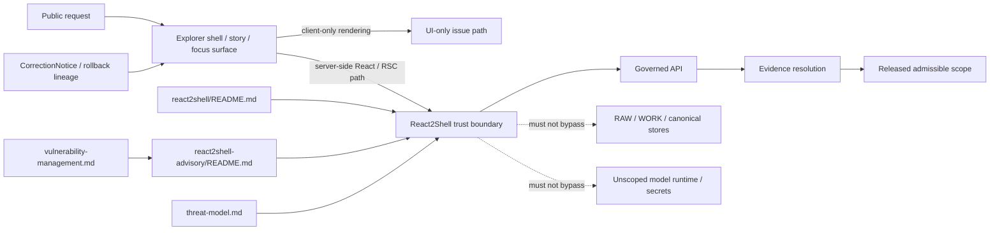

<!-- [KFM_META_BLOCK_V2]
doc_id: kfm://doc/<NEEDS_VERIFICATION>
title: React2Shell
type: standard
version: v1
status: review
owners: @bartytime4life
created: <YYYY-MM-DD NEEDS_VERIFICATION>
updated: 2026-03-25
policy_label: <NEEDS_VERIFICATION>
related: [../README.md, ../threat-model.md, ../vulnerability-management.md, ../react2shell-advisory/README.md, ../../README.md, ../../../README.md, ../../../SECURITY.md, ../../../apps/explorer-web/README.md, ../../../apps/governed-api/README.md]
tags: [kfm, security, react2shell, react-server-components, nextjs]
notes: [Lane contract plus reviewer guide; exact package, route, runtime, and deployment impact remain NEEDS VERIFICATION.]
[/KFM_META_BLOCK_V2] -->

# React2Shell

KFM security lane for interpreting the React Server Components / downstream framework “React2Shell” issue family as a shell-to-server trust-boundary problem, not only a dependency bulletin.

> [!WARNING]
> This README is intentionally evidence-bounded.
>
> The current session exposed KFM doctrine PDFs and the target scaffold text for this file, **not** a mounted repo tree, lockfiles, workflow YAML, or deployed runtime proof. Treat this file as the **lane contract and reviewer guide** for `docs/security/react2shell/README.md`, not as proof that KFM currently runs an affected React Server Components or Next.js stack.
>
> Keep exact package evidence, fixed-version matrices, exploit chronology, and patch bulletins in the sibling advisory leaf: [`../react2shell-advisory/README.md`](../react2shell-advisory/README.md).

> [!IMPORTANT]
> **Status:** experimental  
> **Owners:** `@bartytime4life`  
> **Repo fit:** `docs/security/react2shell/README.md`  
> **Upstream / downstream:** [`../README.md`](../README.md) · [`../threat-model.md`](../threat-model.md) · [`../vulnerability-management.md`](../vulnerability-management.md) · [`../react2shell-advisory/README.md`](../react2shell-advisory/README.md) · [`../../../apps/explorer-web/README.md`](../../../apps/explorer-web/README.md) · [`../../../apps/governed-api/README.md`](../../../apps/governed-api/README.md)  
> **Truth labels used here:** `CONFIRMED` · `INFERRED` · `PROPOSED` · `UNKNOWN` · `NEEDS VERIFICATION`  
> **Current evidence boundary:** doctrine PDFs + target scaffold text; exact repo tree, manifests, lockfiles, CI gates, and deployment state remain `UNKNOWN`


**Quick jumps:** [Scope](#scope) · [Repo fit](#repo-fit) · [Accepted inputs](#accepted-inputs) · [Exclusions](#exclusions) · [Directory tree](#directory-tree) · [Quickstart](#quickstart) · [Usage](#usage) · [Diagram](#diagram) · [Tables](#tables) · [Task list](#task-list) · [FAQ](#faq) · [Appendix](#appendix)

---

## Scope

This directory defines the **React2Shell** lane inside KFM security.

In KFM terms, this lane matters when a shell-facing flaw stops being “just frontend” and becomes a **server-side trust event**. The important question is not only whether a package is vulnerable. The important question is whether a public shell route, server-rendered surface, or server-side React boundary can weaken one or more of the following:

1. **Governed API mediation**  
   The shell must not become a side door around the trust membrane.

2. **Released-scope narrowing**  
   Public routes must stay downstream of admissible published scope.

3. **Evidence and citation visibility**  
   Consequential shell behavior must remain one hop away from inspectable evidence.

4. **Correction and rollback lineage**  
   Patching, redeploying, narrowing, withdrawing, or superseding a surface must stay visible.

### What this README owns

This file should own the **KFM-facing meaning** of the issue family:

- why a shell/RSC issue can become a trust-boundary issue
- how shell remediation must preserve governed API mediation
- what must change together when trust behavior changes
- where to place lane-specific review guidance

This file should **not** become the sovereign source for version truth, package matrices, or exploit chronology.

> [!NOTE]
> Use this README to explain **KFM boundary meaning**. Use the sibling advisory leaf to carry **moving vendor/package truth**.

[Back to top](#react2shell)

---

## Repo fit

| Item | Role in this file | Status |
|---|---|---|
| `docs/security/react2shell/README.md` | Lane README and reviewer guide | **Target scaffold / NEEDS VERIFICATION** |
| [`../react2shell-advisory/README.md`](../react2shell-advisory/README.md) | Advisory leaf for exact package, CVE, patch, and chronology detail | **Referenced by target scaffold / NEEDS VERIFICATION** |
| [`../README.md`](../README.md) | Security-lane parent context | **Referenced by target scaffold / NEEDS VERIFICATION** |
| [`../threat-model.md`](../threat-model.md) | Security consequence framing | **Referenced by target scaffold / NEEDS VERIFICATION** |
| [`../vulnerability-management.md`](../vulnerability-management.md) | Lifecycle, correction, and release handling | **Referenced by target scaffold / NEEDS VERIFICATION** |
| [`../../../apps/explorer-web/README.md`](../../../apps/explorer-web/README.md) | Expected shell-side implementation surface | **Referenced by target scaffold / NEEDS VERIFICATION** |
| [`../../../apps/governed-api/README.md`](../../../apps/governed-api/README.md) | Expected API-membrane implementation surface | **Referenced by target scaffold / NEEDS VERIFICATION** |
| KFM doctrine corpus | Confirms map-first shell, Evidence Drawer, Focus Mode, governed APIs, runtime envelopes, and correction lineage | **CONFIRMED** |

### Boundary rule

This lane should interpret **how the issue family touches KFM**. It should not replace:

- the sibling advisory leaf as the source of exact advisory truth
- mounted manifest or lockfile evidence as the source of dependency truth
- shell or API docs as the source of implementation truth
- policy, contract, or test surfaces as the source of executable enforcement

[Back to top](#react2shell)

---

## Accepted inputs

This directory is the right place for:

- official upstream advisory references that define the issue family
- KFM shell-boundary notes for server-side React or downstream framework exposure
- threat-model mappings for public-route, server-boundary, or membrane consequences
- remediation coupling guidance across docs, policy, contracts, tests, runbooks, and release evidence
- correction / rollback / disclosure expectations when released shell surfaces may have been affected
- reviewer-facing guidance for “affected”, “not affected”, “contained”, “corrected”, and `NEEDS VERIFICATION`

### Input classes

| Input class | Examples | Why it belongs here |
|---|---|---|
| **Upstream advisory evidence** | React / framework security advisories, vendor patch guidance | Defines the external issue family and official remediation posture |
| **Repo/package evidence** | `package.json`, lockfiles, route inventory, SSR/RSC notes | Determines whether KFM is actually in scope |
| **Runtime/release evidence** | deploy notes, image inventories, release manifests, correction notes | Determines whether visible correction or advisory publication is required |
| **KFM trust-boundary evidence** | shell doctrine, governed API doctrine, threat-model notes, rollback rules | Keeps the issue framed as trust work, not only dependency work |

### Minimum trust questions

Before this lane is considered stable, reviewers should be able to answer:

- Does the mounted repo actually use a server-side React / RSC / downstream affected path?
- If yes, which public or steward-facing surface is in scope?
- Does that path stay downstream of governed API mediation?
- Where is the exact package/advisory truth recorded?
- If public exposure was possible, what correction, narrowing, withdrawal, or advisory lineage now exists?

[Back to top](#react2shell)

---

## Exclusions

This lane is **not** the right place for the following:

| Keep out of this file | Put it here instead | Why |
|---|---|---|
| Exact fixed-version matrices | [`../react2shell-advisory/README.md`](../react2shell-advisory/README.md) | They are fast-moving vendor facts |
| Lockfile or manifest truth copied into prose | Actual repo artifacts + advisory leaf | Avoid stale duplication |
| Live exploit payloads, sensitive traces, or secret-bearing incident detail | Steward-only review lanes | This README must not become a leak surface |
| Executable policy, gate code, or schema bodies | Owning policy / contract / test surfaces | Guidance belongs here; enforcement does not |
| Broad React / Next.js architecture guidance unrelated to this issue family | App docs or broader security docs | Keep the lane narrow |
| Unverified repo, runtime, or deployment claims | Leave as `UNKNOWN` / `NEEDS VERIFICATION` | KFM requires visible uncertainty |

### Placement logic

If mounted evidence proves:

- **no affected server-side path** → record bounded non-applicability in the advisory leaf
- **an affected path exists** → keep package truth in the advisory leaf and KFM boundary consequences here
- **a released shell surface was exposed** → update this lane, the advisory leaf, and the owning shell/API/policy/test surfaces together

[Back to top](#react2shell)

---

## Directory tree

### Scaffold-level expected footprint

```text
docs/security/
├── react2shell/
│   └── README.md
└── react2shell-advisory/
    └── README.md
```

### Interpretation rule

This is an **expected lane/advisory split** derived from the target scaffold, not a current-session repo-tree confirmation.

Re-check the mounted checkout before merge. If the real directory shape differs, preserve the lane/advisory split concept and revise the path-level details rather than forcing the repo to mirror placeholder prose.

[Back to top](#react2shell)

---

## Quickstart

This section is for maintainers reviewing or building this lane in a mounted checkout.

### 1) Re-check the lane surfaces

```bash
find docs/security/react2shell docs/security/react2shell-advisory -maxdepth 2 -type f 2>/dev/null | sort
```

### 2) Verify whether the repo actually uses a relevant server-side React / RSC path

```bash
find . -maxdepth 5 \( \
  -name package.json -o \
  -name pnpm-lock.yaml -o \
  -name package-lock.json -o \
  -name yarn.lock \
\) | sort
```

```bash
grep -RInE '"use server"|react-server-dom|next|src/app|/app/' . 2>/dev/null | head -200
```

### 3) Separate boundary guidance from exact advisory truth

- keep **package names, versions, fix levels, and chronology** in `../react2shell-advisory/README.md`
- keep **KFM shell / API / correction implications** here
- do not let two files compete to be the “real” source for version truth

### 4) Fail closed when public trust may be at risk

If mounted evidence suggests a plausible public or steward-facing server-side exposure:

- narrow or withdraw unsafe surface behavior first
- patch and redeploy before broadening exposure again
- review whether secret review or rotation is required as part of closure
- preserve visible advisory / correction lineage instead of silently replacing state

### 5) Update coupled proof surfaces together

When trust behavior changes materially, the preferred KFM move is one governed change set across:

- this lane README
- the sibling advisory leaf
- affected shell or API docs
- policy / contract / test surfaces
- runbooks, release evidence, and correction notes where needed

[Back to top](#react2shell)

---

## Usage

### When to read this README

Use this README when a change does any of the following:

- introduces or confirms a server-side React / RSC trust boundary
- changes how the public shell reaches server behavior
- changes how shell routes consume governed API payloads after remediation
- needs a KFM explanation for why a package issue is also a trust-boundary issue
- requires visible correction, narrowing, withdrawal, or advisory handling for a shell surface

### When to route work elsewhere

| When you need to… | Start here | Then go deeper |
|---|---|---|
| Explain why React2Shell matters to KFM shell/API trust | This README | [`../threat-model.md`](../threat-model.md), [`../../../apps/explorer-web/README.md`](../../../apps/explorer-web/README.md), [`../../../apps/governed-api/README.md`](../../../apps/governed-api/README.md) |
| Record exact advisory, package, or fixed-version facts | This README for placement logic | [`../react2shell-advisory/README.md`](../react2shell-advisory/README.md) |
| Decide whether rollback, visible correction, or disclosure is required | This README | [`../vulnerability-management.md`](../vulnerability-management.md) |
| Change the actual shell implementation | This README for trust consequences | [`../../../apps/explorer-web/README.md`](../../../apps/explorer-web/README.md) |
| Change API boundary enforcement or payload shaping | This README for trust consequences | [`../../../apps/governed-api/README.md`](../../../apps/governed-api/README.md) |

### Review flow

1. Start with mounted package and route evidence, not assumptions.
2. Decide whether any public or steward-facing server-side path is in scope.
3. Separate **package fact** from **trust consequence**.
4. Keep exact remediation truth in the advisory leaf.
5. Keep shell/API/correction meaning in this lane README.
6. If not affected, say so explicitly in the advisory leaf instead of leaving placeholder language behind.

[Back to top](#react2shell)

---

## Diagram



### Read the flow

The issue becomes KFM-relevant when a shell-facing route is also a **server-side execution boundary**.

At that point the problem is no longer only dependency hygiene. It becomes a question of whether the route still preserves:

- the trust membrane
- governed API mediation
- released-scope narrowing
- evidence visibility
- correction and rollback lineage

[Back to top](#react2shell)

---

## Tables

### Current evidence boundary

| Observation | Status | Consequence for this README |
|---|---|---|
| KFM doctrine confirms a map-first shell with trust-visible surfaces such as Map Explorer, Evidence Drawer, Story, Focus Mode, Review, and Export | **CONFIRMED** | Shell-facing security consequences are first-class KFM documentation work |
| KFM doctrine confirms governed route families for evidence resolution and governed assistance behind the API membrane | **CONFIRMED** | Shell-facing remediation must preserve API mediation and evidence resolution |
| KFM doctrine confirms first-class contract families including `EvidenceBundle`, `RuntimeResponseEnvelope`, and `CorrectionNotice` | **CONFIRMED** | Patch / redeploy / withdrawal / correction work must preserve inspectable runtime and release lineage |
| The target scaffold references a sibling advisory leaf and adjacent security/shell/API docs | **INFERRED / NEEDS VERIFICATION** | Preserve the lane/advisory split, but re-check mounted paths before merge |
| Exact repo tree, lockfiles, framework packages, server-side routes, CI gates, and deployment exposure | **UNKNOWN / NEEDS VERIFICATION** | Do not claim KFM is affected without mounted evidence |

### KFM-aligned response matrix

| Finding posture | Meaning in KFM | Minimum response |
|---|---|---|
| Mounted evidence shows **no affected server-side path** | Likely non-applicable to KFM runtime | Record bounded non-applicability in the advisory leaf; keep this README focused on boundary rules |
| Package or route evidence is **unclear**, but a public server-side path is plausible | Partial trust | Contain or narrow exposure while review continues; do not overclaim safety |
| Public or steward-facing affected path is **confirmed** | Trust-boundary incident, not only dependency issue | Patch, redeploy, review secrets if warranted, update advisory/correction lineage, and validate negative paths |
| Fix is applied and validated | Safe re-entry may be possible | Preserve lineage through advisory/correction notes; rebuild derived outputs if release scope changed |

### Document ownership split

| Surface | Owns what | Must not own |
|---|---|---|
| `react2shell/README.md` | KFM-facing boundary meaning, routing, remediation coupling, disclosure/correction expectations | Exact version matrices, exploit chronology, hotfix bulletin detail |
| `react2shell-advisory/README.md` | Exact advisory facts, package truth, fixed-version checkpoints, bounded “not applicable” results | Broader KFM shell or API doctrine |
| `apps/explorer-web/README.md` | Public shell implementation and UI/runtime composition | Advisory truth or policy authority |
| `apps/governed-api/README.md` | API membrane, payload shaping, evidence mediation, finite outcomes | UI-local rendering detail or vulnerability bulletin content |

[Back to top](#react2shell)

---

## Task list

### Minimum completion conditions for this lane

- [ ] Re-check that the expected lane/advisory path split exists in the mounted checkout.
- [ ] Confirm whether the repo actually uses a relevant server-side React / RSC / framework path.
- [ ] Keep exact package and advisory truth in [`../react2shell-advisory/README.md`](../react2shell-advisory/README.md).
- [ ] Verify which public or steward-facing routes are in scope before claiming impact.
- [ ] Decide whether patch, redeploy, secret review, rollback, or visible correction must move together.
- [ ] Update shell/API/policy/test surfaces together if trust behavior changes.
- [ ] Keep unresolved runtime or deployment claims marked as `UNKNOWN` / `NEEDS VERIFICATION`.

### Recommended definition of done

A reviewer should be able to answer all of these without guessing:

- What exact issue family does this lane refer to?
- Does the mounted repo actually use an affected server-side path?
- Which document owns the version matrix?
- Which document owns the KFM trust-boundary interpretation?
- If a released surface was affected, what visible correction or advisory lineage now exists?

If any answer is “we assume”, this lane is not done.

[Back to top](#react2shell)

---

## FAQ

### Is every React application in scope for this lane?

No. This lane is about the **server-side React / RSC issue family and downstream shell exposure**, not React usage in general.

### Why does this README avoid the exact fixed-version matrix?

Because exact package and framework fix levels are fast-moving vendor facts. This file should stay stable as the **KFM-facing lane contract** while the sibling advisory leaf carries the moving matrix.

### Can this README say KFM is “not affected” on its own?

No. “Not affected” should come from mounted manifest, lockfile, route, or runtime evidence, then be recorded in the advisory leaf.

### What if the shell is client-only?

If mounted evidence proves there is no affected server-side path, record that bounded result in the advisory leaf and keep this README focused on the boundary rule.

### Why is this treated as a trust-boundary issue and not only a dependency issue?

Because once a public shell route becomes a server-side execution boundary, KFM has to reason about policy mediation, evidence scope, secrets, correction visibility, and membrane preservation, not only package versions.

### Does this README prove KFM runs Next.js or an affected RSC stack today?

No. The current session did not directly verify repo tree, dependency inventory, or deployed runtime state.

[Back to top](#react2shell)

---

## Appendix

<details>
<summary>Truth labels, verification burden, and handoff rules</summary>

### Truth labels used in this README

| Label | Meaning here |
|---|---|
| **CONFIRMED** | Directly supported by the current-session KFM doctrine corpus or by the target scaffold where its role is explicit |
| **INFERRED** | Conservative structural completion that follows KFM doctrine and the target scaffold, but is not mounted implementation proof |
| **PROPOSED** | Recommended lane behavior or reviewer workflow |
| **UNKNOWN** | Not verified strongly enough to claim as current repo or runtime fact |
| **NEEDS VERIFICATION** | Should be checked in the mounted checkout, manifests, CI, or runtime proof before merge |

### Minimum evidence to retire current UNKNOWNs

- mounted repo tree showing the actual security-doc layout
- manifest / lockfile proof for relevant framework packages
- route inventory showing whether a server-side shell path exists
- release or deployment evidence showing patched state and redeploy status
- proof of any required correction, narrowing, withdrawal, or rollback lineage
- verified metadata values for `doc_id`, `created`, and `policy_label`

### Handoff rule between this lane and the advisory leaf

When official advisory facts move:

1. update the **advisory leaf** first
2. update this lane README only if the **KFM interpretation** changes
3. avoid copying version truth into both places
4. keep public-facing correction language aligned with actual release state

### Reading rule

A clean-looking public shell does not prove a safe server boundary.

In KFM, trust is preserved only when package fact, route fact, policy fact, runtime fact, and correction lineage remain consistent.

</details>

[Back to top](#react2shell)
