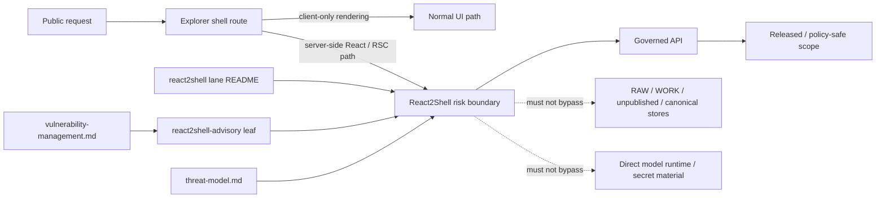

<!-- [KFM_META_BLOCK_V2]
doc_id: kfm://doc/<NEEDS_VERIFICATION>
title: React2Shell
type: standard
version: v1
status: review
owners: @bartytime4life
created: <YYYY-MM-DD NEEDS_VERIFICATION>
updated: 2026-03-25
policy_label: <NEEDS_VERIFICATION>
related: [../README.md, ../threat-model.md, ../vulnerability-management.md, ../react2shell-advisory/README.md, ../../README.md, ../../../README.md, ../../../SECURITY.md, ../../../apps/explorer-web/README.md, ../../../apps/governed-api/README.md]
tags: [kfm, security, react2shell, react-server-components, nextjs]
notes: [Target file existed as scaffold-only content on public main at review time; exact package, route, runtime, and deployment impact remain verification-bounded.]
[/KFM_META_BLOCK_V2] -->

# React2Shell

KFM security lane for the React Server Components / downstream Next.js “React2Shell” issue family, routed through shell, governed API, advisory, and remediation surfaces.

> [!WARNING]
> This directory is currently only minimally evidenced in the public repo surface. Treat this README as the **lane contract and reviewer guide**, not as proof that KFM currently runs an affected React Server Components or Next.js App Router stack.
>
> Keep exact version matrices, package evidence, exploit chronology, and patch bulletins in the sibling advisory leaf: [`../react2shell-advisory/README.md`](../react2shell-advisory/README.md).

**Status:** experimental  
**Owners:** `@bartytime4life`  
**Repo fit:** `docs/security/react2shell/README.md` → upstream security doctrine and lifecycle docs; adjacent advisory leaf; downstream shell, API, contracts, policy, and tests


**Quick jumps:** [Scope](#scope) · [Repo fit](#repo-fit) · [Accepted inputs](#accepted-inputs) · [Exclusions](#exclusions) · [Directory tree](#directory-tree) · [Quickstart](#quickstart) · [Usage](#usage) · [Diagram](#diagram) · [Tables](#tables) · [Task list](#task-list) · [FAQ](#faq) · [Appendix](#appendix)

---

## Scope

This directory documents the **React2Shell** lane inside KFM security.

In repo terms, “React2Shell” is the working name for the upstream **React Server Components** server-execution issue family and its downstream framework advisories. For KFM, the important question is not only whether a package is vulnerable. It is whether a **public shell route, server-rendered surface, or server-side React boundary** can become a trust-bearing execution path that crosses into server behavior, secrets, unpublished scope, or policy-bypassing behavior.

This lane therefore covers four things:

1. **Public-shell boundary meaning**  
   When a UI issue is actually a server-side trust issue.

2. **Membrane preservation**  
   How KFM’s governed API boundary still constrains shell-facing remediation.

3. **Lane vs. advisory split**  
   Why this README should explain the KFM-facing boundary while the sibling advisory records exact version and package facts.

4. **Release and correction consequences**  
   When patching, rollback, redeploy, visible correction, or advisory publication must move together.

### KFM reading rule for this lane

Use this README to keep the **KFM-facing interpretation** of the issue family stable:

- what this issue means for the public shell
- how it interacts with the governed API membrane
- what must change together when trust behavior changes
- where exact package/advisory detail belongs

Use the sibling leaf at [`../react2shell-advisory/README.md`](../react2shell-advisory/README.md) for:

- exact CVE and framework matrices
- mounted manifest / lockfile evidence
- package-level remediation notes
- chronology, disclosure, and patch checkpoints
- not-applicable findings when mounted evidence disproves impact

[Back to top](#react2shell)

---

## Repo fit

| Item | Value |
|---|---|
| **Path** | `docs/security/react2shell/README.md` |
| **Primary role** | README-like lane index and reviewer guide |
| **Upstream docs** | [`../README.md`](../README.md) · [`../threat-model.md`](../threat-model.md) · [`../vulnerability-management.md`](../vulnerability-management.md) · [`../../README.md`](../../README.md) · [`../../../README.md`](../../../README.md) · [`../../../SECURITY.md`](../../../SECURITY.md) |
| **Adjacent confirmed leaf** | [`../react2shell-advisory/README.md`](../react2shell-advisory/README.md) |
| **Downstream implementation surfaces** | [`../../../apps/explorer-web/README.md`](../../../apps/explorer-web/README.md) · [`../../../apps/governed-api/README.md`](../../../apps/governed-api/README.md) |
| **Shared proof surfaces** | [`../../../contracts/README.md`](../../../contracts/README.md) · [`../../../policy/README.md`](../../../policy/README.md) · [`../../../tests/README.md`](../../../tests/README.md) |
| **What this file should do** | Explain the KFM-facing trust boundary, routing, remediation coupling, and disclosure/correction expectations for this issue family |
| **What this file must not do** | Duplicate the exact vendor version matrix, claim mounted impact without proof, or replace the advisory leaf or executable controls |

### Boundary rule

This lane should interpret **how the issue touches KFM**. It should not become the sovereign source for:

- exact dependency truth
- deployed-version truth
- hotfix chronology
- exploit detail
- release-specific package inventory

Those belong in the advisory leaf, the mounted repo, release evidence, or steward-only review material.

[Back to top](#react2shell)

---

## Accepted inputs

This directory is the right place for:

- official upstream advisory references that define the issue family
- KFM shell-boundary notes for server-side React / RSC exposure
- threat-model mappings for trust-membrane or public-route consequences
- remediation coupling guidance across docs, policy, contracts, tests, runbooks, and release evidence
- correction / rollback / disclosure expectations when released surfaces may have been affected
- reviewer-facing rules for how to document “affected”, “not affected”, “contained”, “corrected”, or “NEEDS VERIFICATION”

### Input classes

| Input class | Examples | Why it matters here |
|---|---|---|
| **Upstream advisory evidence** | React and framework security advisories, vendor patch guidance | Defines the external issue family and official remediation posture |
| **Repo/package evidence** | `package.json`, lockfiles, route inventory, SSR/RSC usage notes | Determines whether KFM is actually in scope |
| **Runtime/release evidence** | deployment notes, image inventory, release manifests, correction notes | Determines whether correction or advisory publication is required |
| **KFM trust-boundary evidence** | shell docs, governed API docs, threat-model notes, denial/rollback rules | Keeps the issue framed as trust-boundary work, not only dependency work |

### Minimum trust questions

Before this lane is treated as complete, reviewers should be able to answer:

- Does the mounted repo actually use a server-side React Server Components path?
- If yes, which public or steward-facing surface is in scope?
- Does any affected route stay downstream of the governed API membrane?
- Are exact package and version claims stored in the advisory leaf rather than drifting through multiple docs?
- If public exposure was possible, is visible correction or advisory publication required?
- If a downstream framework requires it, were redeploy and secret review/rotation considered before closure?

---

## Exclusions

This lane is **not** the right place for the following:

| Keep out of this file | Put it here instead | Why |
|---|---|---|
| **Exact fixed-version matrices** | [`../react2shell-advisory/README.md`](../react2shell-advisory/README.md) | They are issue-specific, vendor-specific, and likely to evolve |
| **Mounted manifest or lockfile truth copied into prose** | The actual repo artifacts and the advisory leaf | Avoid stale duplication |
| **Live exploit payloads, sensitive traces, or secret-bearing incident detail** | Steward-only evidence/review lanes | This doc must not become a leak surface |
| **Executable policy, gate code, or schema bodies** | [`../../../policy/README.md`](../../../policy/README.md), [`../../../contracts/README.md`](../../../contracts/README.md), [`../../../tests/README.md`](../../../tests/README.md) | Reviewer guidance belongs here; enforcement does not |
| **Broad React or Next.js architecture guidance unrelated to this issue family** | app docs or broader security docs | Keep the lane narrow |
| **Unverified repo, runtime, or deployment claims** | Mark as `UNKNOWN` / `NEEDS VERIFICATION` until proven | KFM requires visible uncertainty |

### Placement logic

This README should orient the lane. It should **not** become a hand-maintained version bulletin.

If the mounted repo proves:

- **no affected server-side RSC/App Router usage** → record that in the advisory leaf as a bounded “not applicable” result
- **affected usage** → keep package/remediation facts in the advisory leaf, and keep KFM boundary consequences here
- **public trust-surface impact** → update this lane, the advisory leaf, and the owning shell/API/policy/test surfaces together

[Back to top](#react2shell)

---

## Directory tree

### CONFIRMED current footprint

```text
docs/security/
├── react2shell/
│   └── README.md
└── react2shell-advisory/
    └── README.md
```

### Interpretation rule

At review time, both README surfaces existed but were placeholder-level. Treat this file as the **lane contract** and the sibling leaf as the **advisory destination**; verify both again in the mounted checkout before merge.

[Back to top](#react2shell)

---

## Quickstart

This section is for maintainers reviewing or building this lane in a mounted checkout.

### 1) Re-check the currently mounted lane surfaces

```bash
find docs/security/react2shell docs/security/react2shell-advisory -maxdepth 2 -type f | sort
```

### 2) Verify whether the repo actually uses an affected server-side React / RSC path

```bash
find . -maxdepth 5 \( \
  -name package.json -o \
  -name pnpm-lock.yaml -o \
  -name package-lock.json -o \
  -name yarn.lock \
\) | sort
```

```bash
grep -RIn "react-server-dom\|\"use server\"\|next" apps packages . 2>/dev/null
```

### 3) Separate boundary guidance from exact advisory fact

- keep **package names, versions, fix levels, and chronology** in `../react2shell-advisory/README.md`
- keep **KFM shell/API/correction implications** here
- do not let two files compete to be the “real” source for version truth

### 4) Fail closed when public trust is at risk

If mounted evidence suggests a plausible public or steward-facing server-side exposure:

- narrow or withdraw unsafe surface behavior first
- patch and redeploy before broadening exposure again
- record whether secret review or rotation is required
- preserve visible advisory/correction lineage rather than silently replacing state

> [!IMPORTANT]
> If mounted evidence proves affected downstream framework usage, patching alone may not be enough for closure. Treat redeploy, secret review, and visible lineage as part of the response, not optional cleanup.

### 5) Update proof surfaces together

When behavior changes materially, the preferred KFM move is one governed change set across:

- this lane README
- the sibling advisory leaf
- affected shell or API docs
- policy / contract / test surfaces
- runbooks or release evidence if public trust behavior changed

[Back to top](#react2shell)

---

## Usage

### When to read this README

Use this README when a change does any of the following:

- introduces or confirms a React Server Components / server-rendered trust boundary
- changes how the public shell reaches server behavior
- changes how shell routes consume governed API payloads after remediation
- requires a KFM explanation for why a package issue is also a trust-boundary issue
- requires visible correction or advisory handling for a public-facing shell surface

### When to route work elsewhere

| When you need to… | Start here | Then go deeper |
|---|---|---|
| Explain why React2Shell matters to KFM’s shell/API boundary | This README | [`../threat-model.md`](../threat-model.md), [`../../../apps/explorer-web/README.md`](../../../apps/explorer-web/README.md), [`../../../apps/governed-api/README.md`](../../../apps/governed-api/README.md) |
| Record exact CVE, framework, package, or fixed-version facts | This README for placement logic | [`../react2shell-advisory/README.md`](../react2shell-advisory/README.md) |
| Decide whether rollback, visible correction, or disclosure is required | This README | [`../vulnerability-management.md`](../vulnerability-management.md) |
| Update denial, correction, or proof behavior | This README for coupling expectations | [`../../../policy/README.md`](../../../policy/README.md), [`../../../contracts/README.md`](../../../contracts/README.md), [`../../../tests/README.md`](../../../tests/README.md) |
| Change the actual public shell implementation | This README for trust consequences | [`../../../apps/explorer-web/README.md`](../../../apps/explorer-web/README.md) |
| Change API-side boundary enforcement or payload shaping | This README for trust consequences | [`../../../apps/governed-api/README.md`](../../../apps/governed-api/README.md) |

### How to use it in review

1. Start with **mounted package and route evidence**, not with assumptions.
2. Decide whether any **server-side public route** is actually in scope.
3. Separate **package fact** from **trust consequence**.
4. Keep exact remediation facts in the **advisory leaf**.
5. Keep shell/API/correction implications in this **lane README**.
6. If not affected, say so explicitly in the advisory leaf instead of leaving placeholder language behind.

---

## Diagram



### Reading the flow

The issue becomes KFM-relevant when a shell-facing route is also a **server-side execution boundary**. At that point, the question is not only package hygiene. It is whether the route still preserves:

- the trust membrane
- governed API mediation
- released-scope narrowing
- visible correction/advisory lineage

[Back to top](#react2shell)

---

## Tables

### Current evidence boundary

| Observation | Status | Consequence for this README |
|---|---|---|
| `docs/security/react2shell/README.md` exists | **CONFIRMED** | Expand it as a real lane README rather than leaving scaffold text |
| `docs/security/react2shell-advisory/README.md` exists | **CONFIRMED** | Keep exact advisory/package truth in the sibling leaf |
| Security subtree index routes to both paths | **CONFIRMED** | Preserve the split between lane guidance and advisory detail |
| `apps/explorer-web/README.md` documents a persistent map-first shell | **CONFIRMED** | Public-shell consequences are a real doc-level concern |
| `apps/governed-api/README.md` documents the trust membrane and no direct client bypass | **CONFIRMED** | Shell-facing remediation must preserve API mediation |
| Actual use of affected RSC / App Router / framework packages in mounted repo | **UNKNOWN / NEEDS VERIFICATION** | Do not claim KFM is affected without manifest/lockfile/runtime proof |
| Exact deployed versions, CI enforcement, release proof, and correction inventory | **UNKNOWN / NEEDS VERIFICATION** | Keep all runtime and deployment claims bounded |

### KFM-aligned response matrix

| Finding posture | Meaning in KFM | Minimum response |
|---|---|---|
| Mounted evidence shows **no affected server-side RSC/App Router path** | Likely not applicable | Record bounded non-applicability in the advisory leaf; keep this lane README focused on boundary rules |
| Package or route evidence is **unclear**, but a public server-side path is plausible | Partial trust | Contain or narrow exposure while review continues; do not overclaim safety |
| Public or steward-facing affected path is **confirmed** | Trust-boundary issue, not only dependency issue | Patch, redeploy, review secrets, update advisory/correction lineage, and validate negative paths |
| Fix is applied and validated | Safe re-entry may be possible | Preserve lineage through advisory/correction notes; do not silently replace prior trust state |

### Lane ownership matrix

| Surface | Owns what | Must not own |
|---|---|---|
| `react2shell/README.md` | KFM-facing boundary meaning, routing, remediation coupling, disclosure/correction expectations | Exact version matrix, incident archive, hotfix chronology |
| `react2shell-advisory/README.md` | Exact advisory facts, affected-package truth, version matrix, not-applicable findings, patch checkpoints | Broader KFM shell or API doctrine |
| `apps/explorer-web/README.md` | Public shell implementation and UI/runtime composition | Advisory truth or policy authority |
| `apps/governed-api/README.md` | API membrane, payload shaping, finite outcomes, evidence mediation | UI-local rendering or package bulletin content |

[Back to top](#react2shell)

---

## Task list

### Minimum completion conditions for this lane

- [ ] Confirm whether the mounted repo actually uses an affected server-side React / RSC / App Router path.
- [ ] Keep exact CVE, package, and fixed-version facts in [`../react2shell-advisory/README.md`](../react2shell-advisory/README.md).
- [ ] Verify which public or steward-facing shell routes are in scope before claiming impact.
- [ ] Verify whether redeploy, secret review, or secret rotation is part of closure.
- [ ] Update shell/API/policy/contract/test surfaces together if trust behavior changes.
- [ ] Preserve visible advisory, correction, rollback, or withdrawal lineage where released surfaces were affected.
- [ ] Keep any unresolved runtime or deployment claims marked as `UNKNOWN` / `NEEDS VERIFICATION`.

### Recommended definition of done

A reviewer should be able to answer all of these without guessing:

- What exact upstream issue family does this lane refer to?
- Does the mounted repo actually use an affected server-side path?
- Which document owns the version matrix?
- Which document owns the KFM trust-boundary interpretation?
- If the surface was exposed, what visible correction or advisory lineage now exists?

If any answer is “we assume,” this lane is not done.

[Back to top](#react2shell)

---

## FAQ

### Is every React application in scope for this lane?

No. This lane is about the **server-side React Server Components issue family** and downstream server-rendered framework exposure, not about React usage in general.

### Why does this README avoid carrying the exact fixed-version matrix?

Because exact package and framework fix levels are issue-specific and can evolve. This file should stay stable as the **KFM-facing lane contract** while the sibling advisory holds moving vendor/package detail.

### Does a pure client-only map shell belong here?

Usually no. If mounted evidence proves there is no affected server-side RSC or App Router path, record that in the advisory leaf and keep this README focused on the boundary rule.

### Can this README say KFM is “not affected” on its own?

No. “Not affected” should come from mounted manifest, lockfile, route, or runtime evidence, then be recorded in the advisory leaf.

### Why is this treated as a trust-boundary issue and not only a dependency issue?

Because once a public shell route becomes a server-side execution boundary, KFM must reason about policy mediation, evidence scope, secrets, correction visibility, and membrane preservation, not only package versions.

[Back to top](#react2shell)

---

## Appendix

<details>
<summary>Truth labels and minimum evidence to retire UNKNOWNs</summary>

### Truth labels used in this README

| Label | Meaning here |
|---|---|
| **CONFIRMED** | Directly verified in the current public repo surface or strongly established by adjacent repo-native docs |
| **INFERRED** | Conservative completion that follows KFM doctrine and repo structure but is not directly proven as mounted implementation |
| **PROPOSED** | Repo-ready direction for this lane |
| **UNKNOWN** | Not verified strongly enough to claim as current repo or runtime fact |
| **NEEDS VERIFICATION** | Should be checked in the mounted checkout, manifests, deployment evidence, or runtime proof before merge |

### Minimum evidence to move this lane from placeholder to stable

- mounted `package.json` / lockfile / image inventory proving or disproving affected packages
- route inventory showing whether a server-side RSC or App Router path exists
- deployment or release evidence showing patched version, redeploy state, and correction/advisory status
- test or proof artifacts showing the boundary is contained and visible negative paths remain honest
- verified metadata values for `doc_id`, `created`, and `policy_label`

### Reading rule

A clean public shell does not prove a safe server boundary.  
In KFM, trust is preserved when package fact, route fact, policy fact, test fact, and visible correction/advisory lineage remain consistent.

</details>

[Back to top](#react2shell)
