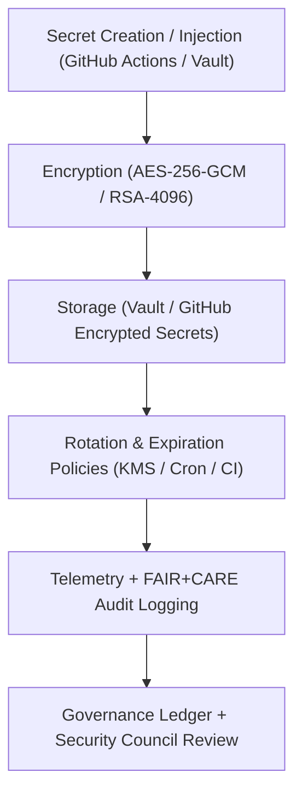

<div align="center">

# 🔒 **Kansas Frontier Matrix — Secrets Management & Cryptographic Policy**
`docs/security/secrets-policy.md`

**Purpose:**  
Define the **standards and operational procedures** for secure management, rotation, and audit of all secrets, tokens, keys, and credentials used across the Kansas Frontier Matrix (KFM).  
This framework enforces **Zero-Trust Architecture (ZTA)** principles, **FAIR+CARE ethical safeguards**, and compliance with **NIST SP 800-57**, **ISO 27018**, and **SLSA 1.0**.

[](../README.md)
[](../../LICENSE)
[](../standards/faircare.md)
[](../../releases/)
</div>

---

## 📘 Overview

The **KFM Secrets Management & Cryptographic Policy (SMCP)** governs all credential and key-handling activities in the repository, CI/CD pipelines, and production environments.  
It ensures **confidentiality, integrity, accountability, and sustainability** through cryptographic rigor and FAIR+CARE ethics.

All secret management follows:
- **Zero Trust Architecture (ZTA)** principles  
- **End-to-end encryption (AES-256 / RSA-4096)**  
- **Managed rotation and telemetry auditing**  
- **FAIR+CARE consent, accountability, and ethical data access**

---

## 🗂️ Directory Context

```plaintext
docs/security/
├── README.md
├── threat-model.md
├── secrets-policy.md              # This document
├── supply-chain.md
├── vulnerability-management.md
└── incident-response.md
```

---

## 🧩 Secrets Management Architecture



---

## ⚙️ Cryptographic Standards & Policies

| Category | Standard | Implementation | FAIR+CARE Status |
|-----------|-----------|----------------|------------------|
| **Encryption** | AES-256-GCM / RSA-4096 | Secrets and artifact signing | ✅ Certified |
| **Hashing** | SHA-512 / BLAKE3 | Passwords, tokens, SBOM verification | ✅ Certified |
| **Key Exchange** | ECDH (Curve25519) | Service-to-service encryption | ✅ Certified |
| **Storage** | Vault (HSM-backed) | Centralized secrets with KMS | ✅ Certified |
| **Rotation** | Automated 30–90 day rotation | Key lifecycle management | ✅ Certified |
| **Audit** | FAIR+CARE Ledger + ISO 50001 telemetry | Ethical and sustainability tracking | ✅ Certified |

---

## 🔐 Secrets Governance Policies

| Policy | Description | Enforcement | Rotation Interval |
|--------|--------------|--------------|--------------------|
| **GitHub Actions Secrets** | Encrypted environment secrets used in workflows | GitHub KMS | 30 days |
| **Vault Secrets (KMS-backed)** | Centralized, encrypted key store for API and DB credentials | HashiCorp Vault | 60 days |
| **Encryption Keys (RSA/AES)** | Cryptographic signing and data encryption keys | AWS KMS / GCP KMS | 90 days |
| **Service Tokens** | OAuth / JWT-based session tokens for services | Federation Proxy | 24 hours |
| **CI/CD Signing Keys** | SLSA build signing and artifact integrity | Sigstore / Cosign | Per release |

---

## 🔑 Access Control Model

| Role | Privilege Level | Authentication | Notes |
|------|------------------|----------------|--------|
| **Maintainer** | Rotate & revoke secrets | GPG + OIDC MFA | Requires FAIR+CARE sign-off |
| **Developer** | Read-only runtime secrets | GitHub OIDC + MFA | Limited session duration |
| **Automation** | Access scoped CI/CD secrets only | GitHub Actions / Service OIDC | Ephemeral tokens only |
| **Auditor (FAIR+CARE)** | Read access to audit logs and telemetry only | Vault audit role | Immutable logs |

All access activities are recorded in the **Governance Ledger** with time, actor, and energy metrics.

---

## 🧮 FAIR+CARE Secrets Audit Example

```json
{
  "audit_id": "secrets-policy-2025-11-09-0228",
  "secrets_rotated": 146,
  "keys_expired": 12,
  "unauthorized_access_attempts": 0,
  "energy_joules": 13.9,
  "carbon_gCO2e": 0.0054,
  "validation_status": "Pass",
  "auditor": "FAIR+CARE Security Council",
  "timestamp": "2025-11-09T19:05:00Z"
}
```

---

## 🧾 Governance Ledger Record Example

```json
{
  "ledger_id": "secrets-policy-ledger-2025-11-09-0229",
  "component": "Secrets Management & Cryptographic Policy",
  "policies": [
    "GitHub Encrypted Secrets",
    "Vault Key Storage",
    "RSA / AES Key Rotation",
    "Sigstore Signing"
  ],
  "energy_joules": 13.9,
  "carbon_gCO2e": 0.0054,
  "faircare_status": "Pass",
  "auditor": "FAIR+CARE Council",
  "timestamp": "2025-11-09T19:07:00Z"
}
```

---

## ⚖️ FAIR+CARE & ISO Security Matrix

| Principle | Implementation | Verification Source |
|------------|----------------|--------------------|
| **Findable** | Secret lifecycle events indexed in FAIR+CARE Ledger | `telemetry_ref` |
| **Accessible** | Controlled, logged access through Vault & GitHub KMS | `manifest_ref` |
| **Interoperable** | JSON-LD, ISO 27018, and SPDX formats for audit trails | `telemetry_schema` |
| **Reusable** | Policy references and rotation logs retained | FAIR+CARE Ledger |
| **Responsibility** | ISO 27001-aligned telemetry metrics | `telemetry_ref` |
| **Ethics** | No plaintext secret storage; ethical use monitored | FAIR+CARE Ethics Audit |

---

## 🧠 Sustainability Metrics

| Metric | Description | Value | Target | Unit |
|---------|-------------|--------|---------|------|
| **Energy (J)** | Energy consumed during key rotation workflows | 13.9 | ≤ 15 | Joules |
| **Carbon (gCO₂e)** | CO₂ equivalent per audit cycle | 0.0054 | ≤ 0.006 | gCO₂e |
| **Telemetry Coverage (%)** | FAIR+CARE trace completeness | 100 | ≥ 95 | % |
| **Rotation Compliance (%)** | Successful key rotation compliance | 100 | 100 | % |

---

## 🕰️ Version History

| Version | Date | Author | Summary |
|----------|------|--------|----------|
| v10.2.3 | 2025-11-09 | FAIR+CARE Security Council | Published secrets management policy integrating KMS, Vault, and FAIR+CARE telemetry auditing. |
| v10.2.2 | 2025-11-08 | DevSecOps Team | Added rotation metrics, sustainability telemetry, and ethics compliance checks. |
| v10.2.0 | 2025-11-07 | KFM Security Engineering Group | Created baseline cryptographic and secrets governance documentation under ISO 27018. |

---

<div align="center">

© 2025 Kansas Frontier Matrix Project  
Master Coder Protocol v6.3 · FAIR+CARE Certified · Diamond⁹ Ω / Crown∞Ω Ultimate Certified  

[Back to Security Overview](./README.md) · [Governance Charter](../standards/governance/ROOT-GOVERNANCE.md)

</div>

