<div align="center">

# 🔒 **Kansas Frontier Matrix — Secrets Management & Cryptographic Policy**  
`docs/security/secrets-policy.md`

**Purpose:**  
Define the **standards and operational procedures** for secure management, rotation, and audit of all secrets, tokens, keys, and credentials used across the Kansas Frontier Matrix (KFM).  
This framework enforces **Zero-Trust Architecture (ZTA)** principles, **FAIR+CARE ethical safeguards**, and compliance with **NIST SP 800-57**, **ISO 27018**, and **SLSA 1.0**.

[](../README.md)
[](../../LICENSE)
[](../standards/faircare.md)
[](../../releases/)
</div>

---

## 📘 Overview

The **KFM Secrets Management & Cryptographic Policy (SMCP)** governs all credential and key-handling activities in:

- Source repositories  
- CI/CD pipelines  
- Runtime and operational environments  
- Data and AI infrastructure

It ensures **confidentiality, integrity, accountability, and sustainability** through:

- Strong cryptography and key lifecycle hygiene  
- Zero-Trust service-to-service communication  
- Measured, FAIR+CARE-aligned access decisions  
- Telemetry-backed auditing and governance logging  

All secret management follows:

- **Zero Trust Architecture (ZTA)**  
- **End-to-end encryption (AES-256 / RSA-4096 / modern ECDH)**  
- **Managed rotation and access minimization**  
- **FAIR+CARE consent, accountability, and ethical data access**

---

## 🗂️ Directory Context

```plaintext
docs/security/
├── README.md
├── threat-model.md
├── secrets-policy.md              # This document
├── supply-chain.md
├── vulnerability-management.md
└── incident-response.md
```

---

## 🧩 Secrets Management Architecture

```mermaid
flowchart TD
  A["Secret Creation / Injection (GitHub Actions · Vault · KMS)"] --> B["Encryption (AES-256-GCM / RSA-4096 / ECDH)"]
  B --> C["Storage (Vault · KMS · GitHub Encrypted Secrets)"]
  C --> D["Rotation & Expiration Policies (Automated Schedules)"]
  D --> E["Telemetry + FAIR+CARE Audit Logging"]
  E --> F["Governance Ledger + Security Council Review"]
```



---

## ⚙️ Cryptographic Standards & Policies

| Category | Standard | Implementation | FAIR+CARE Status |
|---|---|---|---|
| **Encryption** | AES-256-GCM / RSA-4096 | Encryption of secrets at rest and in transit. | ✅ Certified |
| **Hashing** | SHA-512 / BLAKE3 | Passwords, tokens, SBOM verification. | ✅ Certified |
| **Key Exchange** | ECDH (Curve25519) | Service-to-service secure channels. | ✅ Certified |
| **Storage** | Vault (HSM/KMS-backed) | Centralized, encrypted secret storage. | ✅ Certified |
| **Rotation** | Policy-based rotation windows | 24h–90d depending on key type. | ✅ Certified |
| **Audit** | FAIR+CARE Ledger + ISO 50001 telemetry | Ethical & sustainability monitoring. | ✅ Certified |

---

## 🔐 Secrets Governance Policies

| Policy | Description | Enforcement | Rotation Interval |
|---|---|---|---|
| **GitHub Actions Secrets** | Encrypted environment secrets for CI jobs. | GitHub Encrypted Secrets + OIDC | 30 days |
| **Vault Secrets (KMS-backed)** | Central store for DB/API/service credentials. | Vault with KMS auto-unseal | 60 days |
| **Encryption Keys (RSA/AES/ECDH)** | Keys for signing, TLS, and data encryption. | AWS/GCP KMS, rotation aliases | 90 days |
| **Service Tokens** | OAuth / JWT / OIDC tokens for services. | Federation proxy + short-lived tokens | 24 hours (max) |
| **CI/CD Signing Keys** | Keys for SLSA build and artifact signing. | Sigstore / Cosign (keyless preferred) | Per release / build |

---

## 🔑 Access Control Model

| Role | Privilege Level | Authentication | Notes |
|---|---|---|---|
| **Maintainer** | Rotate & revoke secrets; manage policies. | Hardware-backed MFA + OIDC, signed approvals. | Requires FAIR+CARE + Security Council approval. |
| **Developer** | Read-only runtime secrets in dev/staging. | GitHub OIDC + MFA; time-bound access. | No production secret access. |
| **Automation (CI/CD)** | Scoped access to job-specific secrets. | GitHub Actions OIDC / workload identity. | Ephemeral, minimal-permission tokens only. |
| **Auditor (FAIR+CARE / Security)** | Read-only access to audit logs and telemetry. | Vault/Audit role + MFA. | Cannot view secret values, only metadata. |

**Principles:**

- **Least Privilege** — only required access, nothing more.  
- **Need-to-Know** — no broad/scoped “*” permissions.  
- **Ephemeral Access** — secrets are short-lived wherever possible.

---

## 🧮 FAIR+CARE Secrets Audit Example

```json
{
  "audit_id": "secrets-policy-2025-11-12-0428",
  "secrets_rotated": 162,
  "keys_expired": 15,
  "unauthorized_access_attempts": 0,
  "energy_wh": 3.6,
  "carbon_gCO2e": 0.0014,
  "validation_status": "pass",
  "auditor": "FAIR+CARE Security Council",
  "timestamp": "2025-11-12T05:58:00Z"
}
```

---

## 🧾 Governance Ledger Record Example

```json
{
  "ledger_id": "secrets-policy-ledger-2025-11-12-0429",
  "component": "Secrets Management & Cryptographic Policy",
  "policies": [
    "GitHub Encrypted Secrets",
    "Vault Key Storage",
    "KMS Key Rotation",
    "Sigstore / Cosign Signing"
  ],
  "energy_wh": 3.6,
  "carbon_gCO2e": 0.0014,
  "faircare_status": "pass",
  "auditor": "FAIR+CARE Council",
  "timestamp": "2025-11-12T06:00:00Z"
}
```

---

## ⚖️ FAIR+CARE & ISO Security Matrix

| Principle | Implementation | Verification Source |
|---|---|---|
| **Findable** | Secret lifecycle events logged with IDs and timestamps in the Governance Ledger. | `telemetry_ref`, ledger exports |
| **Accessible** | Authorized, audited access via Vault/KMS and GitHub KMS; no plaintext in repo. | Vault audit logs, GitHub audit logs |
| **Interoperable** | JSON-LD, ISO 27018, and SPDX-aligned records for integration. | `telemetry_schema`, SBOMs |
| **Reusable** | Policy histories preserved for training, audits, and replication in new environments. | Governance archives |
| **Responsibility** | ISO 27001-aligned metrics in telemetry; periodic FAIR+CARE review. | Telemetry dashboards |
| **Ethics (CARE)** | No secret policies may undermine cultural protections or community data safety. | FAIR+CARE Ethics Audit notes |

---

## 🌱 Sustainability Metrics

| Metric | Description | Value | Target | Unit |
|---|---|---|---|---|
| **Energy (Wh)** | Energy consumed during rotation + audit workflows. | 3.6 | ≤ 5.0 | Wh |
| **Carbon (gCO₂e)** | CO₂ equivalent per audit cycle. | 0.0014 | ≤ 0.003 | gCO₂e |
| **Telemetry Coverage (%)** | Percentage of secret events logged. | 100 | ≥ 95 | % |
| **Rotation Compliance (%)** | Percentage of secrets rotated within policy window. | 100 | 100 | % |

Metrics are appended to:

```
releases/v10.2.0/focus-telemetry.json
```

---

## 🕰️ Version History

| Version | Date | Author | Summary |
|---|---|---|---|
| v10.2.4 | 2025-11-12 | FAIR+CARE Security Council | Updated energy/carbon metrics, tightened rotation/role model, and aligned with v10.2 telemetry framework. |
| v10.2.3 | 2025-11-09 | FAIR+CARE Security Council | Published secrets management policy integrating KMS, Vault, and FAIR+CARE telemetry auditing. |
| v10.2.2 | 2025-11-08 | DevSecOps Team | Added rotation metrics, sustainability telemetry, and ethics compliance checks. |
| v10.2.0 | 2025-11-07 | KFM Security Engineering Group | Created baseline cryptographic and secrets governance documentation under ISO 27018. |

---

<div align="center">

© 2025 Kansas Frontier Matrix Project — CC-BY 4.0  
Master Coder Protocol v6.3 · FAIR+CARE Certified · Diamond⁹ Ω / Crown∞Ω Ultimate Certified  

[Back to Security Overview](README.md) · [Governance Charter](../standards/governance/ROOT-GOVERNANCE.md)

</div>
