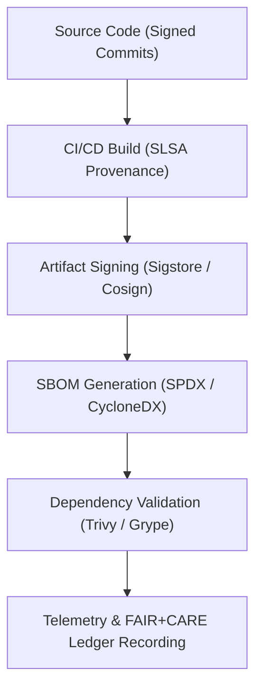

<div align="center">

# 🔗 **Kansas Frontier Matrix — Supply Chain Security & Provenance Framework**
`docs/security/supply-chain.md`

**Purpose:**  
Define the **supply chain integrity, artifact provenance, and dependency governance framework** used in the Kansas Frontier Matrix (KFM).  
This document ensures reproducibility and trust across all build and deployment pipelines, aligning with **FAIR+CARE**, **SLSA 1.0**, **SPDX 3.0**, and **ISO 27036** standards.

[](../README.md)
[](../../LICENSE)
[](../standards/faircare.md)
[](../../releases/)
</div>

---

## 📘 Overview

The **Supply Chain Security & Provenance Framework** establishes verifiable integrity across the KFM software lifecycle — from source to deployment — ensuring every artifact, dependency, and dataset is **authenticated, traceable, and tamper-evident**.

KFM integrates:
- **SBOM management (SPDX + CycloneDX)**  
- **Build provenance (SLSA + Sigstore)**  
- **Dependency integrity (Hash verification + attestations)**  
- **Telemetry traceability (ISO 50001)**  
- **FAIR+CARE ethical certification** for sustainable and responsible software development.

---

## 🗂️ Directory Context

```plaintext
docs/security/
├── README.md
├── threat-model.md
├── secrets-policy.md
├── supply-chain.md                  # This document
├── vulnerability-management.md
└── incident-response.md
```

---

## 🧩 Supply Chain Security Flow



---

## ⚙️ Core Supply Chain Governance Components

| Component | Description | Tools / Standards | FAIR+CARE Status |
|------------|-------------|-------------------|------------------|
| **Source Integrity** | Enforce GPG + Sigstore signed commits | GitHub Verified Commits, Sigstore Fulcio | ✅ Certified |
| **Build Provenance** | Capture build metadata and cryptographic attestations | SLSA 1.0 / Tekton Chains | ✅ Certified |
| **SBOM Management** | Generate and validate Software Bill of Materials | SPDX 3.0 / CycloneDX 1.5 | ✅ Certified |
| **Dependency Security** | Verify third-party libraries with CVE audit and hash validation | Trivy, Grype, Dependabot | ✅ Certified |
| **Artifact Signing** | Sign and verify build artifacts before deployment | Cosign / Sigstore | ✅ Certified |
| **Telemetry & Governance** | Log all provenance to FAIR+CARE ledger and ISO telemetry schema | FAIR+CARE / ISO 50001 | ✅ Certified |

---

## 🔐 SBOM & Provenance Policy

| Policy | Description | Enforcement Mechanism | Frequency |
|---------|-------------|------------------------|------------|
| **SBOM Generation** | Auto-generate SPDX & CycloneDX files per build | CI/CD Workflow | Every Commit |
| **Artifact Signing** | Require Sigstore / Cosign attestation for all release artifacts | GitHub Action + Tekton | Every Release |
| **Dependency Scanning** | Run CVE checks with Trivy + Dependabot | Scheduled Workflow | Daily |
| **Provenance Validation** | Verify attestations before deployment | SLSA / Rekor Transparency Log | Every Deploy |
| **Ledger Sync** | Push provenance events to FAIR+CARE Ledger | FAIR+CARE API | Continuous |

---

## 🧮 FAIR+CARE Supply Chain Validation Record Example

```json
{
  "validation_id": "supply-chain-2025-11-09-0226",
  "components_validated": [
    "SBOM Generation",
    "Artifact Signing",
    "Dependency Scanning",
    "SLSA Provenance"
  ],
  "sbom_items": 1523,
  "dependencies_audited": 684,
  "critical_cves_resolved": 0,
  "energy_joules": 14.1,
  "carbon_gCO2e": 0.0056,
  "validation_status": "Pass",
  "auditor": "FAIR+CARE Security Council",
  "timestamp": "2025-11-09T18:58:00Z"
}
```

---

## 🧾 Governance Ledger Record Example

```json
{
  "ledger_id": "supply-chain-ledger-2025-11-09-0227",
  "component": "Supply Chain Security Framework",
  "standards": ["SLSA", "SPDX", "Sigstore", "FAIR+CARE"],
  "energy_joules": 14.1,
  "carbon_gCO2e": 0.0056,
  "faircare_status": "Pass",
  "auditor": "FAIR+CARE Council",
  "timestamp": "2025-11-09T19:00:00Z"
}
```

---

## ⚖️ FAIR+CARE & ISO Security Matrix

| Principle | Implementation | Verification Source |
|------------|----------------|--------------------|
| **Findable** | SBOM and provenance metadata stored in Governance Ledger | `sbom_ref` |
| **Accessible** | Open SBOMs and attestations under CC-BY license | FAIR+CARE Ledger |
| **Interoperable** | SPDX, CycloneDX, JSON-LD metadata formats | `telemetry_schema` |
| **Reusable** | Build provenance retained for audit reproducibility | `manifest_ref` |
| **Responsibility** | Telemetry tracked under ISO 50001 and FAIR+CARE ethics | `telemetry_ref` |
| **Ethics** | Supply chain transparency validated under FAIR+CARE Council | FAIR+CARE Ethics Audit |

---

## 🧠 Sustainability Metrics

| Metric | Description | Value | Target | Unit |
|---------|-------------|--------|---------|------|
| **Energy (J)** | Energy consumed during SBOM + signing workflows | 14.1 | ≤ 15 | Joules |
| **Carbon (gCO₂e)** | CO₂ equivalent emissions | 0.0056 | ≤ 0.006 | gCO₂e |
| **Telemetry Coverage (%)** | FAIR+CARE trace completeness | 100 | ≥ 95 | % |
| **Audit Pass Rate (%)** | FAIR+CARE validation success | 100 | 100 | % |

---

## 🕰️ Version History

| Version | Date | Author | Summary |
|----------|------|--------|----------|
| v10.2.3 | 2025-11-09 | FAIR+CARE Security Council | Published supply chain governance doc integrating SLSA, SBOM, and Sigstore provenance. |
| v10.2.2 | 2025-11-09 | DevSecOps Team | Added FAIR+CARE telemetry schema and sustainability metrics. |
| v10.2.0 | 2025-11-08 | KFM Security Group | Created baseline supply chain security documentation under ISO 27036. |

---

<div align="center">

© 2025 Kansas Frontier Matrix Project  
Master Coder Protocol v6.3 · FAIR+CARE Certified · Diamond⁹ Ω / Crown∞Ω Ultimate Certified  

[Back to Security Overview](./README.md) · [Governance Charter](../standards/governance/ROOT-GOVERNANCE.md)

</div>

