<div align="center">

# 🔗 **Kansas Frontier Matrix — Supply Chain Security & Provenance Framework**  
`docs/security/supply-chain.md`

**Purpose:**  
Define the **supply chain integrity, artifact provenance, and dependency governance framework** used in the Kansas Frontier Matrix (KFM).  
Ensure end-to-end **reproducibility, traceability, and tamper-evidence** for all build and deployment pipelines, aligning with **FAIR+CARE**, **SLSA 1.0**, **SPDX**, **CycloneDX**, and **ISO 27036** standards.

[](../README.md)
[](../../LICENSE)
[](../standards/faircare.md)
[](../../releases/)
</div>

---

## 📘 Overview

The **Supply Chain Security & Provenance Framework** guarantees that every KFM artifact:

- Originates from **verified source control events** (signed commits, protected branches)  
- Is built using **hardened CI/CD workflows** with **SLSA-compliant** provenance  
- Has an associated **SBOM (SPDX/CycloneDX)** describing transitive dependencies  
- Is **signed and attested** (Cosign/Sigstore) prior to deployment  
- Is continuously monitored by **vulnerability management** and **FAIR+CARE** audits  
- Emits **telemetry events** for sustainability and governance reporting

This framework applies to:

- Backend services and APIs  
- Frontend/Web builds  
- AI models and data pipelines  
- Infrastructure-as-code and container images  
- STAC/DCAT catalog builders and support tools  

---

## 🗂️ Directory Context

```plaintext
docs/security/
├── README.md
├── threat-model.md
├── secrets-policy.md
├── supply-chain.md                  # This document
├── vulnerability-management.md
└── incident-response.md
```

---

## 🧩 Supply Chain Security Flow

```mermaid
flowchart TD
  A["Source Code (Signed Commits)"] --> B["CI/CD Build (Reproducible · SLSA Provenance)"]
  B --> C["Artifact Signing (Sigstore / Cosign)"]
  C --> D["SBOM Generation (SPDX / CycloneDX)"]
  D --> E["Dependency Validation (CVE Scans · Hash Verification)"]
  E --> F["Policy & FAIR+CARE Checks (Gates)"]
  F --> G["Telemetry + Governance Ledger Recording"]
```



---

## ⚙️ Core Supply Chain Governance Components

| Component | Description | Tools / Standards | FAIR+CARE Status |
|---|---|---|---|
| **Source Integrity** | Only signed commits merged via protected branches; PR review required. | GitHub Protected Branches, Sigstore/GPG | ✅ Certified |
| **Build Provenance** | Capture who built what, where, and how via signed provenance. | SLSA 1.0, GitHub OIDC, Attestations | ✅ Certified |
| **SBOM Management** | Produce SBOMs for all release images/bundles. | SPDX 2.3 / 3.0, CycloneDX 1.5 | ✅ Certified |
| **Dependency Security** | Scan dependencies for CVEs and malicious packages. | Trivy, Grype, Dependabot, osv-scanner | ✅ Certified |
| **Artifact Signing** | Sign all release artifacts with keyless Sigstore/Cosign. | Sigstore Fulcio, Cosign, Rekor | ✅ Certified |
| **Governance & Telemetry** | Sync provenance into Governance Ledger and sustainability telemetry. | FAIR+CARE Ledger, ISO 50001 Telemetry | ✅ Certified |

---

## 🔐 SBOM & Provenance Policy

| Policy | Description | Enforcement Mechanism | Frequency |
|---|---|---|---|
| **P1 — SBOM Generation** | All release builds must emit SPDX + CycloneDX SBOMs. | CI/CD workflows (`supply-chain-verify.yml`) | Every build of main/release branches |
| **P2 — Artifact Signing** | All release artifacts and container images must be Cosign-signed. | GitHub Action + Cosign in CI | Every release build |
| **P3 — Provenance Attestation** | SLSA provenance must be created and uploaded to Rekor. | SLSA GitHub Generator / Tekton Chains | Every build on protected branches |
| **P4 — Dependency Scanning** | Dependencies are scanned and triaged for CVEs and malicious behavior. | Trivy / Grype / osv-scanner / Dependabot | Daily + per-PR |
| **P5 — Policy Gate** | Deployments require successful SLSA, SBOM, and CVE gates. | Policy-as-code (e.g., OPA/Conftest) | Every deploy |
| **P6 — Governance Sync** | Provenance events appended to governance + telemetry. | `telemetry-export.yml`, ledger sync | Continuous |

---

## 🧱 Build & Artifact Requirements

For each **release** (e.g., `v10.2.0`):

1. **SBOM Files**  
   - `releases/v10.2.0/sbom.spdx.json`  
   - `releases/v10.2.0/sbom.cdx.json` (optional CycloneDX)  

2. **Manifest Bundle**  
   - `releases/v10.2.0/manifest.zip` containing:  
     - Checksums (SHA-256)  
     - Build logs (redacted)  
     - SLSA attestations (JSON)  
     - Signature metadata  

3. **Signed Artifacts**  
   - Container images, wheels, tarballs, static assets must be Cosign-signed.  

4. **Provenance Attestations**  
   - Build-level and artifact-level provenance (subject digests, build IDs, timestamps).  

Any artifact lacking these requirements is **ineligible** for promotion to production.

---

## 🧮 FAIR+CARE Supply Chain Validation Record Example

```json
{
  "validation_id": "supply-chain-2025-11-12-0426",
  "components_validated": [
    "SBOM Generation",
    "Artifact Signing",
    "Dependency Scanning",
    "SLSA Provenance"
  ],
  "sbom_items": 1639,
  "dependencies_audited": 712,
  "critical_cves_resolved": 0,
  "energy_wh": 4.3,
  "carbon_gCO2e": 0.0017,
  "validation_status": "pass",
  "auditor": "FAIR+CARE Security Council",
  "timestamp": "2025-11-12T05:51:00Z"
}
```

---

## 🧾 Governance Ledger Record Example

```json
{
  "ledger_id": "supply-chain-ledger-2025-11-12-0427",
  "component": "Supply Chain Security Framework",
  "standards": [
    "SLSA 1.0",
    "SPDX",
    "CycloneDX",
    "Sigstore",
    "FAIR+CARE"
  ],
  "energy_wh": 4.3,
  "carbon_gCO2e": 0.0017,
  "faircare_status": "pass",
  "auditor": "FAIR+CARE Council",
  "timestamp": "2025-11-12T05:52:00Z"
}
```

---

## ⚖️ FAIR+CARE & ISO Security Matrix

| Principle | Implementation | Verification Source |
|---|---|---|
| **Findable** | SBOM & provenance attached to each release and indexed in Governance Ledger. | `sbom_ref`, `manifest_ref` |
| **Accessible** | SBOMs and attestations available under open license for review. | Release artifacts, docs |
| **Interoperable** | Use of SPDX, CycloneDX, JSON-LD for cross-tool compatibility. | `telemetry_schema`, SBOM files |
| **Reusable** | Build recipes and provenance retained for replays and forensic analysis. | `manifest_ref`, CI configs |
| **Responsibility** | Telemetry recorded under ISO 50001 + FAIR+CARE audits. | `telemetry_ref` |
| **Ethics (CARE)** | Supply chain decisions consider downstream impact on communities and datasets. | FAIR+CARE audit notes |

---

## 🧠 Integration with Threat Modeling & Vulnerability Management

- **Threat-Model Link:**  
  Supply chain threats (e.g., dependency compromise, typosquatting, CI theft) are explicitly tracked in `threat-model.md` via STRIDE categories (Tampering, Elevation of Privilege, Information Disclosure).

- **Vulnerability-Management Link:**  
  Vulnerabilities discovered in dependencies are handled via the **Vulnerability Management Framework**:
  - CVE triage and patch workflows (`vulnerability-management.md`)  
  - SBOM cross-linking of affected components  
  - SLSA attestations updated after remediations  

- **Incident-Response Link:**  
  Confirmed supply chain attacks (e.g., compromised upstream library) trigger `incident-response.md` procedures and may lead to coordinated revocations of releases and/or SBOM updates.

---

## 🌱 Sustainability Metrics (Supply Chain Workflows)

| Metric | Description | Value | Target | Unit |
|---|---|---|---|---|
| **Energy (Wh)** | Energy used per full supply-chain validation cycle | 4.3 | ≤ 5.0 | Wh |
| **Carbon (gCO₂e)** | Emissions equivalent for SBOM+signing+scanning | 0.0017 | ≤ 0.003 | gCO₂e |
| **Telemetry Coverage (%)** | Supply-chain events captured in telemetry | 100 | ≥ 95 | % |
| **Audit Pass Rate (%)** | FAIR+CARE supply-chain audit success | 100 | 100 | % |

Telemetry events are appended to:

```
releases/v10.2.0/focus-telemetry.json
```

---

## 🕰️ Version History

| Version | Date | Author | Summary |
|---|---|---|---|
| v10.2.4 | 2025-11-12 | FAIR+CARE Security Council | Aligned supply chain framework with v10.2 telemetry, expanded SLSA/SPDX details, and refined sustainability metrics. |
| v10.2.3 | 2025-11-09 | FAIR+CARE Security Council | Published supply chain governance doc integrating SLSA, SBOM, and Sigstore provenance. |
| v10.2.2 | 2025-11-09 | DevSecOps Team | Added FAIR+CARE telemetry schema and sustainability metrics. |
| v10.2.0 | 2025-11-08 | KFM Security Group | Created baseline supply chain security documentation under ISO 27036. |

---

<div align="center">

© 2025 Kansas Frontier Matrix Project — CC-BY 4.0  
Master Coder Protocol v6.3 · FAIR+CARE Certified · Diamond⁹ Ω / Crown∞Ω Ultimate Certified  

[Back to Security Overview](../README.md) · [Governance Charter](../standards/governance/ROOT-GOVERNANCE.md)

</div>
