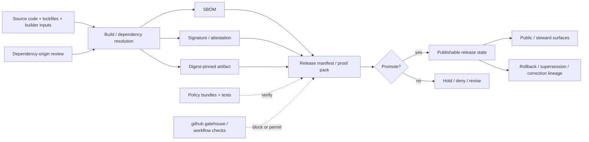

<!-- [KFM_META_BLOCK_V2]
doc_id: kfm://doc/NEEDS_VERIFICATION_UUID
title: KFM Supply-Chain Integrity & Release Provenance
type: standard
version: v1
status: draft
owners: @bartytime4life
created: NEEDS_VERIFICATION_DATE
updated: 2026-03-25
policy_label: public
related: [docs/security/README.md, .github/README.md, .github/workflows/README.md, policy/README.md, contracts/README.md, docs/security/supply-chain/dependency-confusion/README.md, docs/security/supply-chain/sigstore-cosign-v3/README.md, docs/security/supply-chain/reference-repos/README.md, docs/security/supply-chain/shai-hulud-2.0/README.md]
tags: [kfm, security, supply-chain, provenance, sbom, signing]
notes: [Current public main branch exposed this target file and four child lane README files as scaffold placeholders; doc_id and created date need repo verification before merge.]
[/KFM_META_BLOCK_V2] -->

# KFM Supply-Chain Integrity & Release Provenance
Governed documentation hub for dependency trust, digest-first release identity, SBOMs, signatures, attestations, provenance, and rollback-aware release memory under `docs/security/supply-chain/`.

> [!IMPORTANT]
> **Status:** experimental  
> **Owners:** `@bartytime4life`  
>        
> **Quick jump:** [Scope](#scope) · [Repo fit](#repo-fit) · [Accepted inputs](#accepted-inputs) · [Exclusions](#exclusions) · [Current verified snapshot](#current-verified-snapshot) · [Directory tree](#directory-tree) · [Quickstart](#quickstart) · [Usage](#usage) · [Diagram](#diagram) · [Control lanes](#control-lanes) · [Task list](#task-list--definition-of-done) · [FAQ](#faq) · [Appendix](#appendix)
>
> [!WARNING]
> This README is **current-branch grounded** for the public Markdown surfaces that were directly retrievable during drafting, and **doctrine-grounded** for KFM’s long-horizon supply-chain expectations.
> It does **not** claim that public `main` already has active checked-in workflow YAML for SBOM generation, signing, attestation, or release-proof emission. Public `main` currently exposed `.github/workflows/README.md` and no checked-in workflow YAML there.

## Scope
`docs/security/supply-chain/` is the security subtree for build and package trust.

Use this README to answer five questions quickly:

1. Which supply-chain topics belong in this subtree instead of only in `.github/`, `policy/`, or `contracts/`?
2. Which child lane owns the topic I am changing?
3. What can be stated as **current repo reality**, and what is still **target-state doctrine**?
4. How do SBOMs, signatures, attestations, digests, and release manifests fit KFM’s trust model?
5. What has to move together when supply-chain behavior changes?

In KFM, supply-chain security is not just about package hygiene. It is part of governed publication. A release unit that cannot explain its dependency inputs, builder identity, digest, approval posture, or rollback path weakens the same trust system that KFM expects from maps, dossiers, APIs, exports, and runtime answers.

### KFM supply-chain rules this README should preserve

| Rule | Practical meaning for this subtree |
| --- | --- |
| Trust membrane | Build and release automation must not become a quiet bypass around policy, review, or evidence-bearing promotion. |
| Fail-closed posture | Missing provenance, unresolved dependency origin, unsigned artifacts, or broken proof linkage should block promotion rather than degrade silently. |
| Authoritative vs. derived separation | Caches, tiles, indexes, summaries, containers, archives, and packages remain accountable to released scope and release evidence; they are not sovereign truth. |
| Docs as production surface | Supply-chain-significant changes should update docs, workflows, contracts, policy/tests, and release evidence together. |
| Digest-first identity | Mutable tags are convenience pointers; durable trust attaches to digests, typed artifacts, and lineage-bearing manifests. |
| Correction stays visible | Rollback, withdrawal, supersession, and correction-bearing states must survive beyond the build log and into release memory. |

[Back to top](#kfm-supply-chain-integrity--release-provenance)

## Repo fit
**Path:** `docs/security/supply-chain/README.md`  
**Role in repo:** subtree README for supply-chain security, release provenance, and dependency-trust lanes under `docs/security/`.

### Upstream and lateral anchors

| Relation | Path | Why it matters | Current posture |
| --- | --- | --- | --- |
| Parent security index | [`../README.md`](../README.md) | Maps the full security subtree and routes readers into this lane | **CONFIRMED** |
| Root docs index | [`../../README.md`](../../README.md) | Keeps this subtree aligned with the broader docs-as-production posture | **CONFIRMED** |
| Repo gatehouse | [`../../../.github/README.md`](../../../.github/README.md) | Explains repo-wide review, CI/CD, and delivery controls that may enforce supply-chain obligations | **CONFIRMED** |
| Workflow lane | [`../../../.github/workflows/README.md`](../../../.github/workflows/README.md) | Current public branch signal for checked-in workflow reality | **CONFIRMED** |
| Policy surface | [`../../../policy/README.md`](../../../policy/README.md) | Supply-chain docs must not replace executable deny-by-default policy | **CONFIRMED** |
| Contract surface | [`../../../contracts/README.md`](../../../contracts/README.md) | Release proof, runtime envelopes, and correction objects rely on typed contract families | **CONFIRMED** |
| GitHub security policy | [`../../../.github/SECURITY.md`](../../../.github/SECURITY.md) | Public disclosure and vulnerability intake should stay canonical there | **CONFIRMED** |

### Downstream lanes currently visible on public `main`

| Path | Role | Current posture |
| --- | --- | --- |
| [`./dependency-confusion/README.md`](./dependency-confusion/README.md) | Package-origin and namespace-trust lane | **CONFIRMED path; scaffold content** |
| [`./sigstore-cosign-v3/README.md`](./sigstore-cosign-v3/README.md) | Signing and attestation lane | **CONFIRMED path; scaffold content** |
| [`./reference-repos/README.md`](./reference-repos/README.md) | Curated examples and comparison lane | **CONFIRMED path; scaffold content** |
| [`./shai-hulud-2.0/README.md`](./shai-hulud-2.0/README.md) | Experimental / named pattern lane | **CONFIRMED path; scaffold content** |

> [!NOTE]
> The parent `docs/security/README.md` currently references a sibling `../supply-chain.md`, but that file was **not** retrievable from the public `main` branch during this drafting pass. Treat any link to that sibling as **NEEDS VERIFICATION** and repair it in the same PR if the file is still absent.

## Accepted inputs
Content that belongs in this subtree:

| Input class | What belongs here |
| --- | --- |
| Dependency-origin guidance | dependency-confusion notes, namespace trust, registry assumptions, lockfile drift, package-source anomalies, reference patterns for package-origin review |
| Provenance guidance | digest identity, builder provenance, attestation vocabulary, release-memory linkage, evidence-bearing promotion notes |
| Artifact-integrity guidance | signing, verification, immutable references, proof-pack expectations, rollback-aware release handling |
| SBOM guidance | what to generate, what it proves, what it does **not** prove, where reviewers should look, and how to tie SBOMs back to releases |
| Workflow-adjacent supply-chain notes | documentation that explains what workflows should prove without duplicating the workflow lane as source of truth |
| Reference-repo curation | bounded examples used for learning, comparison, or hardening patterns |
| Reviewer/operator notes | merge-time verification checks, release integrity questions, and correction/rollback implications when supply-chain posture changes |

### What belongs here only as documentation
This subtree explains and cross-links supply-chain controls.
It should **not** pretend that documentation alone is enforcement.

## Exclusions

| Keep out of `docs/security/supply-chain/` as canonical truth | Put it instead | Why |
| --- | --- | --- |
| Private keys, signing secrets, tokens, or live credentials | secret manager / host configuration / CI secret boundary | Docs must never become a secret store |
| Workflow YAML as the only description of policy | [`../../../.github/workflows/`](../../../.github/workflows/) **plus** policy/docs updates | Enforcement and explanation should move together |
| Executable policy bundles or rule fixtures | [`../../../policy/`](../../../policy/) | Policy remains executable and separately reviewable |
| Canonical schemas, vocabularies, envelopes, and OpenAPI definitions | [`../../../contracts/`](../../../contracts/) | This subtree can explain them, not replace them |
| Release artifacts, emitted SBOM files, signatures, attestations, or proof bundles as ad hoc checked-in evidence | designated release / proof / artifact surfaces | Keep immutable evidence where release logic expects it |
| Runtime code, build scripts, or package-manager configuration as narrative-only copy | owning code or automation surface | Supply-chain law should not drift away from the code that enforces it |
| Public disclosure instructions | [`../../../.github/SECURITY.md`](../../../.github/SECURITY.md) | Vulnerability intake should stay canonical there |

[Back to top](#kfm-supply-chain-integrity--release-provenance)

## Current verified snapshot
The strongest current-branch claim is intentionally narrow.

| Surface | What was directly retrievable during drafting | What it means |
| --- | --- | --- |
| `docs/security/supply-chain/README.md` | Present, but scaffold-only | This file is a real path on public `main`, but it needs substantive content |
| Child lane README files | `dependency-confusion`, `sigstore-cosign-v3`, `reference-repos`, and `shai-hulud-2.0` each resolved as scaffold placeholders | The subtree footprint exists; the lane content is not yet mature |
| `.github/workflows/README.md` | Present | Public `main` documents the workflow lane |
| `.github/workflows/*.yml` or `*.yaml` | Not visible on public `main` during drafting | Do **not** claim active checked-in SBOM/signing workflow YAML here without reinspection |
| `policy/README.md` and `contracts/README.md` | Present | Adjacent policy and contract surfaces are real and should be linked, not duplicated |
| `.github/CODEOWNERS` | Present and maps `/docs/` to `@bartytime4life` | Owner placeholder can be retired for this path |

## Directory tree

### Current verified snapshot

```text
docs/security/supply-chain/
├── README.md
├── dependency-confusion/
│   └── README.md
├── reference-repos/
│   └── README.md
├── shai-hulud-2.0/
│   └── README.md
└── sigstore-cosign-v3/
    └── README.md
```

### Proposed growth shape
The shape below is a **PROPOSED** documentation contract, not a claim about the current branch.

```text
docs/security/supply-chain/
├── README.md
├── dependency-confusion/
│   └── README.md
├── sigstore-cosign-v3/
│   └── README.md
├── reference-repos/
│   └── README.md
├── shai-hulud-2.0/
│   └── README.md
├── sbom/
│   └── README.md
├── attestations/
│   └── README.md
└── rollback-and-release-memory/
    └── README.md
```

> [!TIP]
> Grow this subtree only when a narrower lane has a clear owner, a clear reason to exist, and a direct link to contracts, policy, workflows, tests, or release evidence.

## Quickstart
Start from the repo root and verify the lane before you upgrade any statement from target state to current fact.

```bash
# 1) Inspect the security subtree
sed -n '1,240p' docs/security/README.md
find docs/security/supply-chain -maxdepth 3 -type f | sort

# 2) Inspect the supply-chain subtree itself
sed -n '1,240p' docs/security/supply-chain/README.md
sed -n '1,240p' docs/security/supply-chain/dependency-confusion/README.md
sed -n '1,240p' docs/security/supply-chain/sigstore-cosign-v3/README.md
sed -n '1,240p' docs/security/supply-chain/reference-repos/README.md
sed -n '1,240p' docs/security/supply-chain/shai-hulud-2.0/README.md

# 3) Cross-check the enforcement-adjacent surfaces
sed -n '1,220p' .github/README.md
sed -n '1,220p' .github/workflows/README.md
sed -n '1,220p' policy/README.md
sed -n '1,220p' contracts/README.md
sed -n '1,200p' .github/CODEOWNERS

# 4) Search for supply-chain terms before writing claims
grep -RIn "SBOM\|sigstore\|cosign\|attest\|provenance\|digest\|dependency confusion" \
  docs .github policy contracts tests 2>/dev/null || true
```

### Minimal review order
1. Confirm the live subtree and child paths.
2. Confirm whether public `main` still exposes `.github/workflows/README.md` only or whether checked-in workflow YAML has landed.
3. Confirm whether policy bundles, contract files, and test fixtures exist for the behavior you are documenting.
4. Confirm whether release proof, rollback, or correction objects are emitted anywhere real—not just described in doctrine.
5. Repair stale cross-links in the same PR.

[Back to top](#kfm-supply-chain-integrity--release-provenance)

## Usage
Use this README as the **subtree map** for supply-chain work.

### Start here when you need to…

| Task | Start here | Then go deeper |
| --- | --- | --- |
| Explain what “supply-chain security” means in KFM | This README | `.github/README.md`, `policy/README.md`, `contracts/README.md` |
| Add dependency-origin or registry-trust guidance | This README | `./dependency-confusion/README.md` |
| Add signing, verification, or attestation guidance | This README | `./sigstore-cosign-v3/README.md` |
| Curate example repos or external patterns | This README | `./reference-repos/README.md` |
| Document an experimental named pattern or branch of work | This README | `./shai-hulud-2.0/README.md` |
| Tie build provenance to release/correction posture | This README | adjacent release-manifest / policy / contract / workflow docs |

### Build, prove, promote, and correct are different moves

| Move | What changes | Why this subtree cares |
| --- | --- | --- |
| Build | An artifact is assembled from source plus dependencies | Dependency origin and reproducibility questions begin here |
| Prove | The artifact gains inspectable evidence such as digest, SBOM, signature, or attestation | Trust does not attach to the artifact by filename alone |
| Promote | A candidate changes trust state and becomes publishable or releasable | KFM treats this as a governed transition, not a casual upload |
| Correct / roll back | A release is superseded, withdrawn, generalized, or reverted | Supply-chain memory must survive beyond the original publish event |

### Current writing rule for this subtree
Do not let this README or any child lane imply that KFM has already mounted a full signing/SBOM/attestation pipeline unless the current branch proves it.
Keep **doctrine**, **current branch evidence**, and **proposed hardening direction** separate.

## Diagram


```mermaid
flowchart LR
    A[Source code + lockfiles + builder inputs] --> B[Build / dependency resolution]
    L[Dependency-origin review] --> B

    B --> C[Digest-pinned artifact]
    B --> D[SBOM]
    B --> E[Signature / attestation]

    D --> F[Release manifest / proof pack]
    E --> F
    C --> F

    G[Policy bundles + tests] -. verify .-> F
    H[.github gatehouse / workflow checks] -. block or permit .-> F

    F --> I{Promote?}
    I -- yes --> J[Publishable release state]
    I -- no --> K[Hold / deny / revise]

    J --> M[Public / steward surfaces]
    J --> N[Rollback / supersession / correction lineage]
```

## Control lanes

| Lane | Core concern | What this subtree should preserve | Closest path |
| --- | --- | --- | --- |
| Dependency origin | Can we trust where packages and builders came from? | namespace hygiene, registry assumptions, lockfile discipline, anomaly detection, explicit origin review | `./dependency-confusion/` |
| Integrity proof | Can we prove a release unit was built by the expected actor and was not silently replaced? | signatures, attestations, digest verification, review guidance, verifier commands | `./sigstore-cosign-v3/` |
| Release memory | Can later operators explain what shipped and how to reverse it safely? | release manifest linkage, SBOM reference, proof-pack expectations, rollback/correction posture | this README + adjacent release docs |
| Reference baselines | Which example repos or patterns are worth learning from without importing them blindly? | bounded comparison, rationale for inclusion, and explicit non-authority status | `./reference-repos/` |
| Experimental patterning | How do we incubate a named supply-chain pattern without pretending it is repo fact? | explicit experimental labeling, narrow scope, and cross-links to the governing lanes | `./shai-hulud-2.0/` |

### Supply-chain claims that should stay explicit

| Claim type | Safe posture |
| --- | --- |
| “We generate SBOMs in CI” | Say it only if checked-in workflow or emitted artifact evidence proves it on the reviewed branch |
| “Artifacts are signed / attestations are published” | Say it only if current release or workflow evidence proves it |
| “This doc is the enforcement point” | Never — docs explain; workflows, policy, contracts, and tests enforce |
| “Tags are enough” | No — durable trust should resolve to digests, manifests, or equivalent immutable identity |
| “Rollback is just redeploy” | No — KFM expects visible correction, supersession, or withdrawal memory where trust state changes |

[Back to top](#kfm-supply-chain-integrity--release-provenance)

## Task list — definition of done
A supply-chain doc change is done when it remains inspectable, bounded, and cross-linked to the surfaces that actually enforce behavior.

- [ ] The README clearly separates **current branch reality** from **doctrinal target state**.
- [ ] Every cross-link resolves on the branch being reviewed, or is explicitly marked `NEEDS VERIFICATION`.
- [ ] Behavior-significant claims about SBOMs, signatures, attestations, digests, or rollback posture are backed by current branch evidence before being stated as present.
- [ ] The change does not quietly turn `.github/`, `policy/`, `contracts/`, `tests/`, or release-evidence surfaces into undocumented dependencies.
- [ ] If a new child lane is introduced, it has a clear scope, a clear reason to exist, and does not duplicate another lane.
- [ ] Secrets, public keys not intended for publication, and sensitive operational material stay out of docs.
- [ ] If `docs/security/README.md` still points at a missing `../supply-chain.md`, that drift is fixed or explicitly documented in the same PR.
- [ ] Rollback, correction, or supersession implications are mentioned whenever the documented change affects trust-bearing release behavior.

## FAQ

### Does this README prove KFM already has checked-in SBOM/signing workflows?
No. Current public branch evidence during drafting confirmed the workflow README, but not checked-in workflow YAML for those controls.

### Why keep supply-chain docs under `docs/security/` if `.github/` owns workflows?
Because `.github/` is the gatehouse for repo automation, while this subtree explains the supply-chain trust model, lane ownership, and cross-links needed for reviewable documentation.

### Should emitted SBOMs, signatures, or attestations live in this subtree?
No. This subtree documents expectations and navigation. Emitted evidence should live with the designated release/proof/artifact surfaces.

### Are child lanes allowed to stay scaffold placeholders?
Only temporarily. A placeholder is acceptable as a directory anchor, but not as a long-term substitute for behavior-significant documentation.

### What is the most important anti-pattern here?
Treating mutable release tags, unverified docs prose, or smooth CI language as if they were equivalent to digest-linked, review-bearing release evidence.

## Appendix

<details>
<summary>Evidence boundary, open gaps, and repair list</summary>

### Evidence boundary used for this revision
- **Direct current-branch evidence:** `docs/security/supply-chain/README.md`, four child lane README files, `.github/README.md`, `.github/workflows/README.md`, `.github/CODEOWNERS`, `.github/SECURITY.md`, `docs/README.md`, `policy/README.md`, and `contracts/README.md` were retrievable from the public `main` branch during drafting.
- **Doctrinal evidence:** March 2026 KFM manuals and repo-grounded synthesis documents establish the trust membrane, fail-closed posture, contract-first release memory, and supply-chain evidence expectations.
- **Not directly proven here:** active checked-in workflow YAML for SBOM/signing/attestations on public `main`; emitted release artifacts; mounted policy bundles; mounted schema inventory; private GitHub settings.

### Immediate repair candidates
1. Replace the scaffold content of this README.
2. Expand or explicitly bound the four child lane README files.
3. Verify whether `docs/security/README.md` should still link to `../supply-chain.md`.
4. When workflow YAML lands, update this README so “current reality” reflects it.
5. Keep any future supply-chain doc changes tied to the matching workflow/policy/contract/test update stream.

### Verification backlog
- Reinspect the live branch checkout and record the exact subtree inventory.
- Confirm whether workflow YAML exists on another branch or is still README-only on public `main`.
- Surface at least one real release-proof example before documenting supply-chain controls as operational fact.
- Verify whether public-key publication is intended anywhere in-repo before documenting verifier-key paths.
- Reconcile supply-chain docs with any future `ReleaseManifest`, `DecisionEnvelope`, `RuntimeResponseEnvelope`, or correction-object contracts.

</details>
