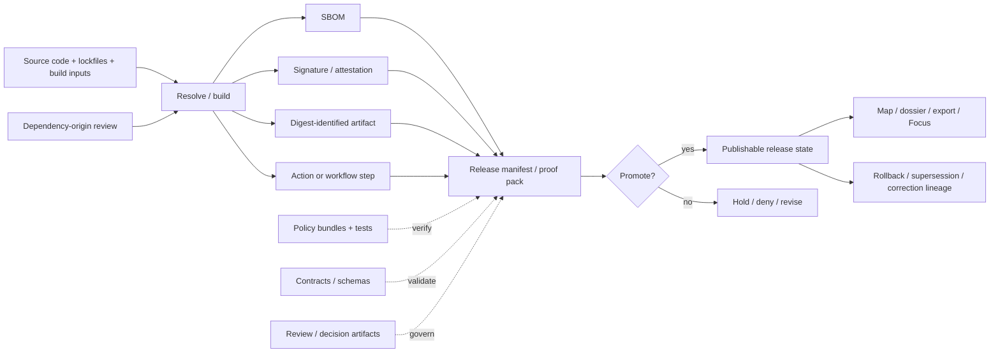

<!-- [KFM_META_BLOCK_V2]
doc_id: kfm://doc/NEEDS_VERIFICATION_UUID
title: KFM Supply-Chain Integrity & Release Provenance
type: standard
version: v1
status: draft
owners: @bartytime4life
created: NEEDS_VERIFICATION_DATE
updated: 2026-04-05
policy_label: public
related: [docs/README.md, docs/security/README.md, docs/security/promotion-contract.md, docs/security/ai-supply-chain/README.md, docs/security/ai-receipts/README.md, .github/README.md, .github/CODEOWNERS, .github/actions/README.md, .github/workflows/README.md, .github/SECURITY.md, policy/README.md, policy/bundles/README.md, policy/tests/README.md, tests/README.md, tests/policy/README.md, tests/contracts/README.md, contracts/README.md, schemas/README.md, schemas/contracts/README.md, schemas/tests/README.md, docs/security/supply-chain/dependency-confusion/README.md, docs/security/supply-chain/sigstore-cosign-v3/README.md, docs/security/supply-chain/reference-repos/README.md, docs/security/supply-chain/shai-hulud-2.0/README.md]
tags: [kfm, security, supply-chain, provenance, sbom, signing]
notes: [Current public main inspection confirms this README plus four child lane README files; dependency-confusion/ now exposes checks/examples/policy plus named example docs, while shai-hulud-2.0/ is deeper than earlier root snapshots and visibly routes through protections/, workflows/, indicators/, indicators/samples/, and indicators/signatures/; sigstore-cosign-v3/ and reference-repos/ remain README-only; docs/security/README.md still drifts through ./supply-chain.md; doc_id and created date still need repo verification before merge.]
[/KFM_META_BLOCK_V2] -->

# KFM Supply-Chain Integrity & Release Provenance

Governed documentation hub for dependency trust, digest-first release identity, SBOMs, signatures, attestations, provenance, and rollback-aware release memory under `docs/security/supply-chain/`.

> [!IMPORTANT]
> **Status:** experimental  
> **Owners:** `@bartytime4life`  
>        
> **Repo fit:** `docs/security/supply-chain/README.md` → upstream [`../README.md`](../README.md) · sibling lanes [`./dependency-confusion/README.md`](./dependency-confusion/README.md), [`./sigstore-cosign-v3/README.md`](./sigstore-cosign-v3/README.md), [`./reference-repos/README.md`](./reference-repos/README.md), [`./shai-hulud-2.0/README.md`](./shai-hulud-2.0/README.md) · adjacent enforcement surfaces [`../../../.github/README.md`](../../../.github/README.md), [`../../../policy/README.md`](../../../policy/README.md), [`../../../tests/README.md`](../../../tests/README.md), [`../../../contracts/README.md`](../../../contracts/README.md), [`../../../schemas/README.md`](../../../schemas/README.md)  
> **Quick jump:** [Scope](#scope) · [Repo fit](#repo-fit) · [Accepted inputs](#accepted-inputs) · [Exclusions](#exclusions) · [Current verified snapshot](#current-verified-snapshot) · [Directory tree](#directory-tree) · [Quickstart](#quickstart) · [Usage](#usage) · [Diagram](#diagram) · [Control lanes](#control-lanes) · [Adjacent enforcement signals](#adjacent-enforcement-signals) · [Task list](#task-list--definition-of-done) · [FAQ](#faq) · [Appendix](#appendix)

> [!WARNING]
> This README is **public-tree-grounded** for currently visible repo surfaces and **doctrine-grounded** for KFM’s supply-chain law.
>
> It does **not** claim that public `main` already has checked-in workflow YAML for SBOM generation, signing, attestation, or release-proof emission. Public `main` still exposes `.github/workflows/README.md` only.
>
> It **does** distinguish current control-surface shape from proven executed automation: `.github/actions/` now exposes relevant local-action directories, but inspected supply-chain-significant child action directories remain placeholder-only on public `main`.

## Scope

`docs/security/supply-chain/` is the security subtree for build, dependency, artifact, and release trust.

Use this README to answer five questions quickly:

1. Which supply-chain topics belong in this subtree instead of only in `.github/`, `policy/`, `tests/`, `contracts/`, or `schemas/`?
2. Which child lane owns the topic I am changing?
3. What can be stated as **current public-branch reality**, and what is still **target-state doctrine**?
4. How do digests, SBOMs, signatures, attestations, release manifests, and rollback memory fit KFM’s trust model?
5. What has to move together when supply-chain behavior changes?

In KFM, supply-chain security is not a sidecar concern. It is part of governed publication. A release unit that cannot explain its dependency inputs, builder identity, digest, proof objects, approval posture, or rollback path weakens the same trust system that KFM expects from maps, dossiers, exports, and runtime answers.

### KFM supply-chain rules this README should preserve

| Rule | Practical meaning for this subtree |
| --- | --- |
| Trust membrane | Build and release automation must not become a quiet bypass around policy, review, or evidence-bearing promotion. |
| Fail-closed posture | Missing provenance, unresolved dependency origin, unsigned artifacts, broken proof linkage, or unreviewed release state should block promotion rather than degrade silently. |
| Authoritative vs. derived separation | Packages, tiles, indexes, search layers, summaries, containers, and archives remain accountable to released scope and release evidence; they are not sovereign truth. |
| Docs as production surface | Supply-chain-significant changes should update docs, actions/workflows, policy/tests, contracts/schemas, and release evidence together. |
| Digest-first identity | Mutable tags are convenience pointers; durable trust attaches to digests, typed artifacts, and lineage-bearing manifests. |
| Correction stays visible | Rollback, withdrawal, supersession, and correction-bearing states must survive beyond build logs and into release memory. |

[Back to top](#kfm-supply-chain-integrity--release-provenance)

## Repo fit

**Path:** `docs/security/supply-chain/README.md`  
**Role in repo:** subtree README for supply-chain security, release provenance, dependency trust, and correction-aware delivery lanes under `docs/security/`.

### Upstream and lateral anchors

| Relation | Path | Why it matters | Current posture |
| --- | --- | --- | --- |
| Parent security index | [`../README.md`](../README.md) | Maps the broader security subtree and routes readers into this lane | **CONFIRMED** |
| Root docs index | [`../../README.md`](../../README.md) | Keeps this subtree aligned with the repo’s docs-as-production pattern | **CONFIRMED** |
| Repo gatehouse | [`../../../.github/README.md`](../../../.github/README.md) | Describes review, automation, CODEOWNERS, and repo-control surfaces | **CONFIRMED** |
| Local actions lane | [`../../../.github/actions/README.md`](../../../.github/actions/README.md) | Step-level action wrappers and helper seams live here; this is signal, not proof of live workflow execution | **CONFIRMED** |
| Workflow lane | [`../../../.github/workflows/README.md`](../../../.github/workflows/README.md) | Current public signal for checked-in workflow inventory | **CONFIRMED** |
| Policy surface | [`../../../policy/README.md`](../../../policy/README.md) | Supply-chain docs must not replace deny-by-default policy or reason/obligation grammar | **CONFIRMED** |
| Verification surface | [`../../../tests/README.md`](../../../tests/README.md) | Supply-chain claims should eventually land in runnable proof families, not prose alone | **CONFIRMED** |
| Contract surface | [`../../../contracts/README.md`](../../../contracts/README.md) | Release proof, runtime envelopes, and correction objects rely on typed contract families, but current contract-home wording still needs reconciliation | **CONFIRMED** path · **NEEDS VERIFICATION** authority cleanup |
| Schema boundary | [`../../../schemas/README.md`](../../../schemas/README.md) | Schema-home responsibility remains relevant to supply-chain proof objects and validation; current public tree is broader than a single README but still authority-sensitive | **CONFIRMED** |
| Public disclosure policy | [`../../../.github/SECURITY.md`](../../../.github/SECURITY.md) | Vulnerability reporting and disclosure guidance should stay canonical there | **CONFIRMED** |

### Security-neighbor lanes outside this subtree

| Neighbor | Why it is adjacent but not owned here | Current posture |
| --- | --- | --- |
| [`../promotion-contract.md`](../promotion-contract.md) | Promotion and release-state doctrine that this subtree should align with rather than duplicate | **CONFIRMED** |
| [`../ai-supply-chain/README.md`](../ai-supply-chain/README.md) | AI/runtime/provider provenance and model-supply-chain concerns that sit beside, not inside, generic artifact-trust guidance | **CONFIRMED** |
| [`../ai-receipts/README.md`](../ai-receipts/README.md) | Receipt and evidence-object guidance that intersects with release proof but has a wider AI/runtime burden | **CONFIRMED** |

### Downstream lanes currently visible on public `main`

| Path | Role | Current public-main posture |
| --- | --- | --- |
| [`./dependency-confusion/README.md`](./dependency-confusion/README.md) | Package-origin and namespace-trust lane | **CONFIRMED** — README plus `checks/`, `examples/`, and `policy/`, with named example docs visible in `examples/` |
| [`./sigstore-cosign-v3/README.md`](./sigstore-cosign-v3/README.md) | Signing and attestation lane | **CONFIRMED** — README-only tree shape on public `main` |
| [`./reference-repos/README.md`](./reference-repos/README.md) | Curated examples and comparison lane | **CONFIRMED** — README-only tree shape on public `main` |
| [`./shai-hulud-2.0/README.md`](./shai-hulud-2.0/README.md) | Experimental / named pattern lane | **CONFIRMED** — README plus `protections/`, `workflows/`, and `indicators/`, with nested `indicators/samples/` and `indicators/signatures/` visible beneath the lane |

> [!NOTE]
> `docs/security/README.md` still references `./supply-chain.md`, but the current public `docs/security/` tree exposes `./supply-chain/` and does not show a sibling `supply-chain.md`. Repair that drift in the same PR as this README.

## Accepted inputs

Content that belongs in this subtree:

| Input class | What belongs here |
| --- | --- |
| Dependency-origin guidance | Dependency confusion notes, namespace trust, registry assumptions, lockfile drift, package-source anomalies, and package-origin review patterns |
| Provenance guidance | Digest identity, builder provenance, attestation vocabulary, release-memory linkage, and evidence-bearing promotion notes |
| Artifact-integrity guidance | Signing, verification, immutable references, proof-pack expectations, and rollback-aware release handling |
| SBOM guidance | What to generate, what it proves, what it does **not** prove, where reviewers should look, and how to tie SBOMs back to releases |
| Action / workflow interpretation | Documentation that explains what action wrappers or workflows should prove without claiming execution that the reviewed branch does not show |
| Policy / test linkage notes | How supply-chain expectations connect to policy bundles, fixtures, validator tests, and merge gates |
| Reference-repo curation | Bounded examples used for learning, comparison, or hardening patterns |
| Reviewer / operator notes | Merge-time verification checks, release integrity questions, and correction / rollback implications when supply-chain posture changes |

### What belongs here only as documentation

This subtree explains and cross-links supply-chain controls.

It should **not** pretend that documentation alone is enforcement.

## Exclusions

| Keep out of `docs/security/supply-chain/` as canonical truth | Put it instead | Why |
| --- | --- | --- |
| Private keys, signing secrets, tokens, or live credentials | Secret manager / host configuration / CI secret boundary | Docs must never become a secret store |
| Workflow YAML as the only expression of policy | [`../../../.github/workflows/`](../../../.github/workflows/) **plus** policy/tests/docs updates | Enforcement and explanation should move together |
| Repo-local action implementation as narrative-only copy | [`../../../.github/actions/`](../../../.github/actions/) | Step wrappers belong with the action code or action README |
| Executable policy bundles or rule fixtures | [`../../../policy/`](../../../policy/) | Policy remains executable and separately reviewable |
| Canonical schemas, vocabularies, envelopes, and OpenAPI definitions | [`../../../contracts/`](../../../contracts/) and/or [`../../../schemas/`](../../../schemas/) | This subtree can explain them, not replace them |
| Runnable verification suites as prose-only claims | [`../../../tests/`](../../../tests/) | Trust needs proof families, not just text |
| Release artifacts, emitted SBOM files, signatures, attestations, or proof bundles as ad hoc checked-in evidence | Designated release / proof / artifact surfaces | Keep immutable evidence where release logic expects it |
| Runtime code, build scripts, or package-manager configuration as narrative-only copy | Owning code or automation surface | Supply-chain law should not drift away from what enforces it |
| Public disclosure instructions | [`../../../.github/SECURITY.md`](../../../.github/SECURITY.md) | Vulnerability intake should stay canonical there |

[Back to top](#kfm-supply-chain-integrity--release-provenance)

## Current verified snapshot

The strongest subtree claims are now more specific than a pure scaffold reading, but still narrower than “fully operational.”

| Surface | Current public-main signal | Why it matters |
| --- | --- | --- |
| `docs/security/supply-chain/README.md` | Present as a substantive README surface | This path is real and already functions as a lane index, but parts of its inventory language needed refresh |
| `dependency-confusion/` | README plus `checks/`, `examples/`, and `policy/`; `examples/` currently includes `lockfile-drift-attack.md` and `namespace-collision-basic.md` | This lane now has concrete review material beyond a lane README |
| `shai-hulud-2.0/` | README plus child README lanes `protections/`, `workflows/`, and `indicators/`, with nested `indicators/samples/README.md` and `indicators/signatures/README.md` visible | This lane is deeper than a three-directory scaffold and should be documented that way |
| `sigstore-cosign-v3/` | README-only tree shape visible | Treat this as a current lane anchor, not proof of executed signing controls |
| `reference-repos/` | README-only tree shape visible | Treat this as a curation lane anchor, not as a populated example corpus |
| Parent security index | Still points to a missing `./supply-chain.md` sibling | Current cross-link drift should be repaired now, not left to future readers |

## Directory tree

### Current public-main subtree (**CONFIRMED**)

```text
docs/security/supply-chain/
├── README.md
├── dependency-confusion/
│   ├── README.md
│   ├── checks/
│   │   └── README.md
│   ├── examples/
│   │   ├── README.md
│   │   ├── lockfile-drift-attack.md
│   │   └── namespace-collision-basic.md
│   └── policy/
│       └── README.md
├── reference-repos/
│   └── README.md
├── shai-hulud-2.0/
│   ├── README.md
│   ├── indicators/
│   │   ├── README.md
│   │   ├── samples/
│   │   │   └── README.md
│   │   └── signatures/
│   │       └── README.md
│   ├── protections/
│   │   └── README.md
│   └── workflows/
│       └── README.md
└── sigstore-cosign-v3/
    └── README.md
```

### Adjacent enforcement excerpt

```text
.github/
├── actions/
│   ├── README.md
│   ├── action.yml
│   ├── metadata-validate/
│   │   └── README.md
│   ├── metadata-validate-v2/
│   │   └── README.md
│   ├── opa-gate/
│   │   └── README.md
│   ├── provenance-guard/
│   │   └── README.md
│   ├── sbom-produce-and-sign/
│   │   └── README.md
│   └── src/
│       └── README.md
└── workflows/
    └── README.md

policy/
├── README.md
├── bundles/
│   └── README.md
├── fixtures/
│   └── README.md
├── policy-runtime/
│   └── README.md
└── tests/
    └── README.md

tests/
├── README.md
├── accessibility/
├── contracts/
│   └── README.md
├── e2e/
├── integration/
├── policy/
│   └── README.md
├── reproducibility/
└── unit/

contracts/
└── README.md

schemas/
├── README.md
├── contracts/
├── schemas/
├── standards/
├── tests/
└── workflows/
```

### Proposed growth shape

The shape below is **PROPOSED** documentation structure, not a claim about the current branch.

```text
docs/security/supply-chain/
├── README.md
├── dependency-confusion/
│   └── README.md
├── sigstore-cosign-v3/
│   └── README.md
├── reference-repos/
│   └── README.md
├── shai-hulud-2.0/
│   └── README.md
├── sbom/
│   └── README.md
├── attestations/
│   └── README.md
└── rollback-and-release-memory/
    └── README.md
```

> [!TIP]
> Add new lanes only when they have a distinct burden, a clear owner, and a direct link to adjacent policy, tests, contracts, actions/workflows, or release evidence.

## Quickstart

Start from the repo root and re-verify the lane before you upgrade any statement from target state to current fact.

```bash
# 1) Inspect the security subtree and this lane
sed -n '1,260p' docs/security/README.md
find docs/security/supply-chain -maxdepth 4 -type f | sort
find docs/security/supply-chain -maxdepth 4 -type d | sort

# 2) Inspect each child lane and the now-visible nested leaves
sed -n '1,260p' docs/security/supply-chain/README.md
sed -n '1,240p' docs/security/supply-chain/dependency-confusion/README.md
sed -n '1,220p' docs/security/supply-chain/dependency-confusion/checks/README.md
sed -n '1,220p' docs/security/supply-chain/dependency-confusion/examples/README.md
find docs/security/supply-chain/dependency-confusion/examples -maxdepth 1 -type f | sort
sed -n '1,220p' docs/security/supply-chain/dependency-confusion/policy/README.md
sed -n '1,240p' docs/security/supply-chain/sigstore-cosign-v3/README.md
sed -n '1,240p' docs/security/supply-chain/reference-repos/README.md
sed -n '1,240p' docs/security/supply-chain/shai-hulud-2.0/README.md
sed -n '1,220p' docs/security/supply-chain/shai-hulud-2.0/protections/README.md
sed -n '1,220p' docs/security/supply-chain/shai-hulud-2.0/workflows/README.md
sed -n '1,220p' docs/security/supply-chain/shai-hulud-2.0/indicators/README.md
sed -n '1,220p' docs/security/supply-chain/shai-hulud-2.0/indicators/samples/README.md
sed -n '1,220p' docs/security/supply-chain/shai-hulud-2.0/indicators/signatures/README.md

# 3) Cross-check adjacent enforcement-adjacent surfaces
sed -n '1,240p' .github/README.md
sed -n '1,240p' .github/actions/README.md
sed -n '1,240p' .github/workflows/README.md
find .github/actions -maxdepth 2 \( -type d -o -name 'README.md' -o -name 'action.yml' \) | sort
find .github/workflows -maxdepth 2 -type f | sort

sed -n '1,240p' policy/README.md
sed -n '1,220p' policy/bundles/README.md
sed -n '1,220p' policy/tests/README.md
find policy -maxdepth 2 -type f | sort

sed -n '1,240p' tests/README.md
sed -n '1,220p' tests/contracts/README.md
sed -n '1,220p' tests/policy/README.md
find tests -maxdepth 2 -type f | sort

sed -n '1,240p' contracts/README.md
sed -n '1,240p' schemas/README.md
sed -n '1,220p' schemas/contracts/README.md
sed -n '1,220p' schemas/tests/README.md
find contracts schemas -maxdepth 2 -type f | sort

# 4) Search for supply-chain-significant terms before writing claims
grep -RIn "SBOM\|cosign\|sigstore\|attest\|provenance\|ReleaseManifest\|EvidenceBundle\|RuntimeResponseEnvelope\|CorrectionNotice" \
  docs .github policy tests contracts schemas 2>/dev/null || true
```

### Minimal review order

1. Confirm the live subtree and child paths.
2. Confirm whether public `main` still exposes `.github/workflows/README.md` only or whether checked-in workflow YAML has landed.
3. Confirm whether the now-visible nested leaves under `dependency-confusion/` and `shai-hulud-2.0/` materially change the lane summary you are about to write.
4. Confirm whether `.github/actions/` contains substantive implementations or placeholder wrappers for the controls you are documenting.
5. Confirm whether policy bundles, contract files, and test fixtures exist for the behavior you are describing.
6. Surface at least one real release-proof / attestation example before documenting signing, SBOM, or provenance controls as already operational.
7. Repair stale cross-links in the same PR.

[Back to top](#kfm-supply-chain-integrity--release-provenance)

## Usage

Use this README as the **subtree map** for supply-chain work.

### Start here when you need to…

| Task | Start here | Then go deeper |
| --- | --- | --- |
| Explain what “supply-chain security” means in KFM | This README | `.github/README.md`, `policy/README.md`, `tests/README.md`, `contracts/README.md`, `schemas/README.md` |
| Add package-origin or registry-trust guidance | This README | `./dependency-confusion/README.md` |
| Add signing, verification, or attestation guidance | This README | `./sigstore-cosign-v3/README.md` |
| Curate example repos or external patterns | This README | `./reference-repos/README.md` |
| Document an experimental named pattern or branch of work | This README | `./shai-hulud-2.0/README.md` |
| Tie build provenance to release/correction posture | This README | adjacent policy / tests / contracts / release-manifest docs |
| Review whether a repo change proves execution or only intent | This README | `.github/actions/README.md`, `.github/workflows/README.md`, `tests/README.md` |
| Route a neighboring security topic without collapsing lanes | This README | `../promotion-contract.md`, `../ai-supply-chain/README.md`, `../ai-receipts/README.md` |

### Build, prove, promote, and correct are different moves

| Move | What changes | Why this subtree cares |
| --- | --- | --- |
| Build | An artifact is assembled from source plus dependencies | Dependency origin and reproducibility questions begin here |
| Prove | The artifact gains inspectable evidence such as digest, SBOM, signature, or attestation | Trust does not attach to the artifact by filename or tag alone |
| Promote | A candidate changes trust state and becomes publishable or releasable | KFM treats this as a governed transition, not a casual upload |
| Correct / roll back | A release is superseded, withdrawn, generalized, or reverted | Supply-chain memory must survive beyond the original publish event |

### Current writing rule for this subtree

Do not let this README or any child lane imply that KFM has already mounted a full signing / SBOM / attestation pipeline unless the reviewed branch proves it.

Keep **doctrine**, **current public tree evidence**, and **proposed hardening direction** separate.

## Diagram


```mermaid
flowchart LR
    A[Source code + lockfiles + build inputs] --> B[Resolve / build]
    L[Dependency-origin review] --> B

    B --> C[Digest-identified artifact]
    B --> D[SBOM]
    B --> E[Signature / attestation]
    B --> F[Action or workflow step]

    D --> G[Release manifest / proof pack]
    E --> G
    C --> G
    F --> G

    H[Policy bundles + tests] -. verify .-> G
    I[Contracts / schemas] -. validate .-> G
    J[Review / decision artifacts] -. govern .-> G

    G --> K{Promote?}
    K -- yes --> M[Publishable release state]
    K -- no --> N[Hold / deny / revise]

    M --> O[Map / dossier / export / Focus]
    M --> P[Rollback / supersession / correction lineage]
```

## Control lanes

| Lane | Core concern | What this subtree should preserve | Closest path |
| --- | --- | --- | --- |
| Dependency origin | Can we trust where packages, registries, and names came from? | Namespace hygiene, registry assumptions, lockfile discipline, anomaly detection, explicit origin review | `./dependency-confusion/` |
| Integrity proof | Can we prove a release unit was built by the expected actor and not silently replaced? | Signatures, attestations, digest verification, verifier commands, public-safe proof linkage | `./sigstore-cosign-v3/` |
| Release memory | Can later operators explain what shipped, under what posture, and how to reverse it safely? | Release manifests, proof-pack expectations, rollback/correction posture, digest-first identity | this README + adjacent contracts/policy/tests docs |
| Reference baselines | Which example repos or patterns are worth learning from without importing them blindly? | Bounded comparison, rationale for inclusion, and explicit non-authority status | `./reference-repos/` |
| Experimental patterning | How do we incubate a named supply-chain pattern without pretending it is already repo fact? | Explicit experimental labeling, narrow scope, and cross-links to governing lanes | `./shai-hulud-2.0/` |
| Workflow / action seam | Where should “execution intent” be described without overstating current automation reality? | Clear distinction between action wrappers, workflow inventory, and proven execution on the reviewed branch | this README + `../../../.github/actions/README.md` + `../../../.github/workflows/README.md` |

### Supply-chain claims that should stay explicit

| Claim type | Safe posture |
| --- | --- |
| “We generate SBOMs in CI” | Say it only if checked-in workflow or emitted artifact evidence proves it on the reviewed branch |
| “Artifacts are signed / attestations are published” | Say it only if current release or workflow evidence proves it |
| “This doc is the enforcement point” | Never — docs explain; actions, workflows, policy, tests, contracts, and review gates enforce |
| “Tags are enough” | No — durable trust should resolve to digests, manifests, or equivalent immutable identity |
| “Rollback is just redeploy” | No — KFM expects visible correction, supersession, or withdrawal memory where trust state changes |

[Back to top](#kfm-supply-chain-integrity--release-provenance)

## Adjacent enforcement signals

The table below keeps nearby repo surfaces honest without upgrading them into proof of live automation.

| Surface | Current public signal | Interpret carefully |
| --- | --- | --- |
| `.github/workflows/` | README-only on public `main` | No public checked-in YAML proof of live merge-gating or supply-chain execution from this branch view |
| `.github/actions/` | Named local-action directories are visible, including `opa-gate`, `provenance-guard`, and `sbom-produce-and-sign`; root `action.yml` is present but placeholder-level | These are current intent/control-surface signals; inspected supply-chain-significant child action READMEs remain placeholder-only on public `main` |
| `policy/` | `bundles/`, `fixtures/`, `policy-runtime/`, and `tests/` subdirectories are visible | Policy surface is structurally richer than a README-only reading, but executable depth still needs branch/runtime proof |
| `tests/` | `accessibility/`, `contracts/`, `e2e/`, `integration/`, `policy/`, `reproducibility/`, and `unit/` families are visible | Verification architecture is visibly broader than a single README, but individual case density and CI execution still need proof |
| `contracts/` | Root tree is README-only; current README still self-identifies with `tests/contracts/README.md` as its path | Contract-home intent is real, but current public contract-home wording still needs reconciliation before it is treated as settled authority |
| `schemas/` | README plus visible `contracts/`, `schemas/`, `standards/`, `tests/`, and `workflows/` child lanes | The public tree is broader than a single README, but visible machine files do not settle schema-home authority on their own |

## Task list — definition of done

A supply-chain doc change is done when it remains inspectable, bounded, cross-linked, and honest about what the reviewed branch actually proves.

- [ ] The README clearly separates **current public-tree reality** from **doctrinal target state**.
- [ ] Every cross-link resolves on the reviewed branch, or is explicitly marked `NEEDS VERIFICATION`.
- [ ] Inventory claims about child lanes, `.github/actions/`, `.github/workflows/`, `policy/`, `tests/`, `contracts/`, and `schemas/` match the reviewed branch.
- [ ] Behavior-significant claims about SBOMs, signatures, attestations, digests, release manifests, or rollback posture are backed by branch evidence before being stated as present.
- [ ] The change does not quietly turn `.github/`, `policy/`, `tests/`, `contracts/`, or release-evidence surfaces into undocumented dependencies.
- [ ] If a new child lane is introduced, it has a clear scope, a clear reason to exist, and does not duplicate another lane.
- [ ] If this README mentions current automation, it distinguishes clearly between **visible tree shape**, **placeholder scaffolding**, and **proven executed enforcement**.
- [ ] Secrets, live verifier keys not intended for publication, and sensitive operational material stay out of docs.
- [ ] If `docs/security/README.md` still points at a missing `./supply-chain.md`, that drift is fixed or explicitly documented in the same PR.
- [ ] Rollback, correction, or supersession implications are mentioned whenever the documented change affects trust-bearing release behavior.

## FAQ

### Does this README prove KFM already has checked-in SBOM / signing workflows?
No. Current public-tree evidence still shows `.github/workflows/README.md` only.

### Why mention `.github/actions/` if `.github/workflows/` is README-only?
Because named local-action directories are now part of the visible repo surface and they matter for documentation and review. They still do **not** prove that live workflows call them.

### Are all child lanes equally mature?
No. Current public tree shape is uneven: `dependency-confusion/` and `shai-hulud-2.0/` expose deeper child-lane material, while `sigstore-cosign-v3/` and `reference-repos/` remain README-only.

### Should this subtree define schemas or policy?
No. It should explain and connect them. Canonical machine-facing artifacts belong in their owning contract, schema, policy, and test surfaces.

### Why call out contract-home ambiguity here?
Because supply-chain docs rely on typed trust objects such as release manifests, evidence bundles, runtime envelopes, and correction notices. The current public repo shows both a `contracts/` root lane and a broader `schemas/` tree, while the root `contracts/README.md` still carries path drift. That ambiguity is important enough to keep visible.

### What should be repaired first around this lane?
The stale `./supply-chain.md` link in `docs/security/README.md`, then any adjacent docs that materially misstate current inventory or overclaim execution.

## Appendix

<details>
<summary>Evidence boundary, cross-surface drift, and repair queue</summary>

### Evidence boundary used for this revision

- **Direct current public-tree evidence:** live GitHub tree inspection of `docs/security/supply-chain/`, its child lanes, `.github/`, `policy/`, `tests/`, `contracts/`, `schemas/`, and adjacent README surfaces.
- **Doctrinal evidence:** March–April 2026 KFM manuals and synthesis overlays establish the trust membrane, fail-closed posture, release/correction law, contract-first proof objects, and evidence-bounded runtime expectations.
- **Not directly proven here:** active checked-in workflow YAML for SBOM/signing/attestations on public `main`; emitted release artifacts; live merge-gate enforcement; runtime resolver behavior; branch protection settings.

### Cross-surface drift this README now keeps explicit

1. `docs/security/README.md` still references `./supply-chain.md`, while the visible tree shows `./supply-chain/`.
2. The supply-chain subtree is no longer uniformly shallow: `dependency-confusion/` now includes real example docs, and `shai-hulud-2.0/` now exposes nested indicator child lanes.
3. `.github/workflows/` remains README-only, so no current public-tree claim of operational CI signing/SBOM/attestation should be upgraded from intent to fact.
4. `.github/actions/` now exposes supply-chain-significant local-action directories, but inspected child action READMEs remain placeholder-level and should not be mistaken for proven enforcement.
5. `policy/`, `tests/`, and `schemas/` all have broader visible family trees than older README-only phrasing suggests.
6. `contracts/` remains root-README-only on the visible tree, and its current README still carries `tests/contracts/README.md` as the self-reported path. Treat contract-home authority as review-sensitive until that drift is repaired.

### Immediate repair candidates

1. Add this README revision with an updated public-tree snapshot and KFM meta block.
2. Repair the stale `./supply-chain.md` link in `docs/security/README.md`.
3. Reconcile adjacent docs that materially understate or overstate current inventory if they are cited as current branch fact.
4. Clarify the public contract-home wording so `contracts/README.md` and adjacent schema/verification docs stop fighting over path identity.
5. When workflow YAML or real proof artifacts land, update this README so “current reality” reflects them.
6. Surface at least one real release-proof / attestation example before documenting signing, SBOM, or provenance controls as operational fact.

### Verification backlog

- Reinspect the reviewed branch checkout and record the exact subtree inventory, not just public web rendering.
- Confirm whether checked-in workflow YAML exists on another branch or remains README-only on public `main`.
- Confirm whether `.github/actions/opa-gate`, `.github/actions/provenance-guard`, and `.github/actions/sbom-produce-and-sign` contain real implementations beyond placeholder README surfaces on the target branch.
- Surface one real release receipt, proof pack, or attestation chain before upgrading supply-chain execution claims.
- Reconcile supply-chain docs with any actual `ReleaseManifest`, `EvidenceBundle`, `RuntimeResponseEnvelope`, `DecisionEnvelope`, or `CorrectionNotice` contracts once visible.

</details>

[Back to top](#kfm-supply-chain-integrity--release-provenance)
