<div align="center">

# 🛡️ **Kansas Frontier Matrix — Supply Chain Security, Provenance & NPM Worm Defense**  
`docs/security/supply-chain/README.md`

**Purpose**  
Define the **end-to-end supply-chain security framework** for the Kansas Frontier Matrix, including **provenance, SBOM, artifact signing, dependency governance**, and the **NPM Worm Defense Suite**.  
Ensure that all builds are **tamper-evident, reproducible, traceable, and governance-approved**, resistant to Shai-Hulud–class npm worms and emerging supply-chain threats.

</div>

---

## 📘 1. Overview

The KFM v11.2.2 supply-chain framework ensures:

- Every artifact originates from **signed, protected, reviewed source commits**.  
- Every build generates:
  - **SLSA-compliant provenance**
  - **SPDX & CycloneDX SBOMs**
  - **Cosign signatures + attestations**
- All dependencies are validated for:
  - CVEs  
  - Malware  
  - Scripted worm behaviors  
  - Registry spoofing  
- Every CI/CD stage emits:
  - Governance telemetry  
  - FAIR+CARE compliance notes  
  - Sustainability metrics (energy, carbon)  
- Any deviation is:
  - Blocked automatically  
  - Logged to governance ledger  
  - Exposed to Story Nodes + Focus Mode for auditability  

This standard governs Node-based pipelines **and all other build systems** that import npm tools.

---

## 🗂️ 2. Directory Layout (Security Standards Context)

```text
📁 docs/
└── 📁 security/
    ├── 📄 README.md                        — Security overview index
    └── 📁 supply-chain/
        ├── 📄 README.md                    — ← This document
        └── 📁 npm-ignore-scripts/          — Lifecycle-script suppression safeguard
            ├── 📄 README.md
            ├── 📄 policy.md
            ├── 📁 examples/
            ├── 📁 validation/
            └── 📁 metadata/
```

Implementation for the full NPM Worm Defense Suite is housed under:

```text
📁 supply-chain-protection/
    📄 README.md
    📁 scanners/
    📁 ci/
    📁 policies/
    📁 registry/
    📁 monitoring/
    📁 local-tools/
    📁 ioc/
    📁 tests/
```

This document provides the **governance specification**, while `supply-chain-protection/` contains **implementation modules**.

---

## 🧩 3. Supply Chain Security Flow (v11.2.2)

```mermaid
flowchart TD
  A["Source Control\nSigned Commits · Protected Branches"]
    --> B["Reproducible Build\n(SLSA Provenance)"]
  B --> C["Artifact Signing\nSigstore / Cosign"]
  C --> D["SBOM Generation\nSPDX · CycloneDX"]
  D --> E["Dependency Security\nCVE Scans · Worm Scanners · Registry Checks"]
  E --> F["Policy Gates\nOPA · FAIR+CARE · Secret Safety"]
  F --> G["Deployment\nKFM Services · Data Pipelines · AI Systems"]
  G --> H["Governance Ledger\nTelemetry · Sustainability · Risk"]
```



The NPM Worm Defense Suite hooks into **Dependency Security** and **Policy Gates**.

---

## 🛡️ 4. NPM Worm Defense Suite (Conceptual)

This suite protects against Shai-Hulud-class worms and other install-time malware by providing:

### ✔ Lifecycle Script Suppression (CI)
- `npm ci --ignore-scripts`
- `NPM_CONFIG_IGNORE_SCRIPTS=true`
- Mandatory in all CI/automation contexts  
- Covers:
  - `preinstall`
  - `install`
  - `postinstall`
  - `prepare`
  - All equivalent yarn/pnpm/Bun hooks  

### ✔ Malware & Worm Scanning
Scanning includes:

- Obfuscated or suspicious lifecycle scripts  
- Dependency tampering or unverified version drift  
- Unexpected `child_process` usage  
- Network calls in install time  
- Known malicious IoCs from `ioc/`  

### ✔ Controlled Internal Registry
All CI npm traffic is routed through an approval-gated proxy which:

- Enforces package allow/deny lists  
- Logs all installs  
- Blocks high-risk dependency sources  
- Supports package quarantine & review  

### ✔ Monitoring & Alerts
Triggers on:

- Unexpected registry publishes  
- New org-owned npm packages  
- Install attempts containing lifecycle scripts  
- Dependency trees changing without PR review  

### ✔ Developer Hardening Tools
- Git hooks preventing addition of lifecycle scripts  
- CLI wrappers for safe installs  
- Local malware/IoC scanners  
- Warnings for risky actions  

---

## 🔐 5. Core Governance Policies

### P1 — SBOM Generation (Mandatory)
All releases include SPDX + CycloneDX SBOMs.

### P2 — Signed Artifacts
All artifacts must be signed with Cosign and logged to Rekor.

### P3 — SLSA Provenance
Builds must emit SLSA 1.0 provenance describing:

- Builder  
- Source repo + ref  
- Inputs  
- Dependencies  
- Environment  

### P4 — CVE + Worm Scanning
Before deployment:

- All dependencies scanned  
- High-risk components must be patched/removed  
- Unknown or suspicious registry sources blocked  

### P5 — Policy-as-Code Gates
OPA/Conftest govern:

- Dependency validity  
- SBOM presence  
- Signing  
- Secrets isolation  
- FAIR+CARE metadata  

### P6 — Telemetry Reporting
All supply-chain events logged to:

- `focus-telemetry.json`  
- Governance ledger  

---

## 🧪 6. CI Integration Requirements

### Mandatory flags
- `npm ci --ignore-scripts`  
- `NPM_CONFIG_IGNORE_SCRIPTS=true`  

### Prohibited patterns
- `npm install` (in CI)  
- Any `prepare`, `preinstall`, `postinstall` triggered in CI  
- Direct downloads from unapproved external registries  

### CI failure conditions
- Missing SBOM  
- Missing provenance  
- Missing Cosign signature  
- Any lifecycle-script detected during install  
- Any registry-mismatch event  
- FAIR+CARE violation indicators  

---

## 📊 7. Telemetry Model

Supply-chain telemetry includes:

- Audit pass/fail  
- Number of dependencies scanned  
- Count of worm-like behaviors detected  
- Signing/attestation completeness  
- SBOM coverage  
- Energy & carbon cost of build  
- FAIR+CARE impact markers  

Example event:

```json
{
  "event": "supply_chain_audit",
  "timestamp": "2025-11-27T21:09:00Z",
  "workflow": "ci-build.yml",
  "sbom_ok": true,
  "provenance_ok": true,
  "npm_ignore_scripts_enforced": true,
  "worm_detected": false,
  "cve_critical": 0,
  "energy_wh": 4.4,
  "carbon_gco2e": 0.0019
}
```

---

## ⚖️ 8. FAIR+CARE Integration

Supply-chain integrity is tied to FAIR+CARE because:

- Malicious packages can compromise community-serving tools.  
- Corrupted STAC/DCAT metadata can propagate misinformation.  
- Worms can alter ecological, hydrologic, or historical results.  
- Secure builds protect Indigenous and community data from tampering.

FAIR+CARE checks integrated into supply-chain workflows ensure:

- Ethical downstream impact  
- Responsible artifact distribution  
- Transparency of provenance  
- Alignment with KFM governance  

---

## 🧠 9. Story Node & Focus Mode Integration

This standard powers security storytelling in KFM:

- **Shielded Builds** — how CI prevents harmful packages  
- **Hardened Dependency Chain** — before/after narratives  
- **Supply Chain Incident Map** — IoCs and timeline data  
- **“The Day the Worm Tried to Land”** — Story Node using telemetry data  

Focus Mode surfaces:

- Artifact integrity  
- Provenance scores  
- SBOM completeness  
- Supply-chain risk lenses  

---

## 🕰️ 10. Version History

| Version | Date       | Summary                                                                                           |
|--------:|------------|---------------------------------------------------------------------------------------------------|
| v11.2.2 | 2025-11-27 | Fully updated; canonical directory layout; telemetry and governance tightened; integrated NPM ignore-scripts standard. |
| v11.2.0 | 2025-11-27 | Initial v11.2 supply-chain security + worm defense specification.                                  |
| v10.2.4 | 2025-11-12 | v10.2 supply chain governance; aligned with SBOM and provenance pipelines.                        |

---

<div align="center">

🛡️ **Kansas Frontier Matrix — Supply Chain Security & NPM Worm Defense v11.2.2**  
Supply-chain hardening as foundational governance.

© 2025 Kansas Frontier Matrix — CC-BY 4.0  
FAIR+CARE Security Council · MCP-DL v6.3 · KFM-MDP v11.2.2  

[⬅ Back to Security Overview](../README.md) ·  
[⚖ Root Governance Charter](../../standards/governance/ROOT-GOVERNANCE.md)

</div>
