<div align="center">

# 🛡️ **Kansas Frontier Matrix — Supply Chain Security, Provenance & NPM Worm Defense**  
`docs/security/supply-chain/README.md`

[]()
[]()
[]()
[]()
[]()
[]()

**Purpose**  
Define the **supply chain integrity, artifact provenance, and dependency-governance framework** used in the Kansas Frontier Matrix (KFM), and describe the **NPM Worm Defense Suite** that protects against **Shai-Hulud–style npm supply-chain worms** and related threats.  
Ensure end-to-end **reproducibility, traceability, tamper-evidence, and exploit resistance** for all build, deployment, and package-consumption pipelines, aligned with **FAIR+CARE**, **SLSA 1.0**, **SPDX**, **CycloneDX**, and **ISO 27036**.

</div>

---

## 📘 1. Overview

The **KFM Supply Chain Security & Provenance Framework** ensures that every KFM artifact:

- Originates from **verified source control events** (signed commits, protected branches)  
- Is built using **hardened CI/CD workflows** with **SLSA-compliant provenance**  
- Has attached **SBOMs** (SPDX/CycloneDX) describing transitive dependencies  
- Is **signed and attested** (Sigstore/Cosign) before deployment  
- Is monitored by **vulnerability management**, **FAIR+CARE audits**, and **threat detection**  
- Emits **telemetry** for sustainability and governance reporting  

The **NPM Worm Defense Suite** (Shai-Hulud-class protection) provides a **specialized subsystem** for:

- Preventing malicious npm install-time behavior  
- Blocking credential exfiltration from CI and developer machines  
- Detecting and quarantining suspicious dependency drift  
- Isolating blast radius via strict secrets + registry controls  

This framework applies to:

- Backend services and APIs  
- Frontend/web builds and Node-based toolchains  
- AI model builds and data pipelines using npm-based tooling  
- Infrastructure-as-code and container images  
- STAC/DCAT catalog builders and helper tools  

---

## 🗂️ 2. Directory Context (v11.2 · Immediate + One Branch)

```text
📁 docs/security/                             — Security-related governance & standards
│   📂 supply-chain/                          — Supply chain security & worm-defense documentation
│       📄 README.md                          — This framework document

📁 supply-chain-protection/                   — NPM worm defense implementation root
│   📂 scanners/                              — Automated malware & lifecycle-script detection
│   📂 ci/                                    — Hardened CI templates for safe dependency install
│   📂 policies/                              — Security policies & organizational standards
│   📂 registry/                              — Controlled internal npm proxy configurations
│   📂 monitoring/                            — Alerting & anomaly detection rules
│   📂 local-tools/                           — Developer-side safety tools and CLI wrappers
│   📂 ioc/                                   — Indicators of compromise (IoCs) for worm families
│   📂 tests/                                 — Validation & regression tests for the suite
│   📄 README.md                              — NPM defense suite overview
```

> Exact physical path for `supply-chain-protection/` MAY be the repository root or `security/`; this document remains the normative governance spec either way.

---

## 🧩 3. Supply Chain Security Flow

```mermaid
flowchart TD
  A["Source Code (Signed Commits)"] --> B["CI/CD Build (Reproducible · SLSA Provenance)"]
  B --> C["Artifact Signing (Sigstore / Cosign)"]
  C --> D["SBOM Generation (SPDX / CycloneDX)"]
  D --> E["Dependency Validation (CVE Scans · Hash Verification · Worm Scanners)"]
  E --> F["Policy & FAIR+CARE Checks (Gates)"]
  F --> G["Telemetry + Governance Ledger Recording"]
```



The NPM worm defense suite primarily hooks into **Dependency Validation** and **CI templates**.

---

## 🧱 4. Core Supply Chain Governance Components

| Component               | Description                                                           | Tools / Standards                            | FAIR+CARE Status |
|-------------------------|-----------------------------------------------------------------------|----------------------------------------------|------------------|
| **Source Integrity**    | Signed commits, protected branches, PR review.                       | GitHub Protected Branches, Sigstore/GPG      | ✅ Certified      |
| **Build Provenance**    | Capture who built what, where, and how.                              | SLSA 1.0, GitHub OIDC, attestations          | ✅ Certified      |
| **SBOM Management**     | Generate SBOMs for all artifacts and images.                         | SPDX 2.3/3.0, CycloneDX 1.5                  | ✅ Certified      |
| **Dependency Security** | Scan deps for CVEs & malicious packages/worms.                       | Trivy, Grype, osv-scanner, custom scanners   | ✅ Certified      |
| **Artifact Signing**    | Sign containers, bundles, and binaries.                              | Sigstore Fulcio, Cosign, Rekor               | ✅ Certified      |
| **Governance & Telemetry** | Record provenance, audits, energy, carbon use.                  | FAIR+CARE Ledger, ISO 50001/14064 telemetry  | ✅ Certified      |

---

## 🔐 5. SBOM & Provenance Policy

| Policy                      | Description                                               | Enforcement Mechanism                        | Frequency                       |
|-----------------------------|-----------------------------------------------------------|----------------------------------------------|---------------------------------|
| **P1 — SBOM Generation**    | All releases must emit SPDX + CycloneDX SBOMs.           | `supply-chain-verify.yml` CI workflow        | Every build on main/release     |
| **P2 — Artifact Signing**   | All release artifacts must be Cosign-signed.             | GitHub Actions + Cosign                      | Every release                   |
| **P3 — Provenance Attest.** | SLSA attestations included and uploaded to Rekor.        | SLSA Progen / Tekton Chains                  | Every protected-branch build    |
| **P4 — Dependency Scans**   | CVEs & malicious packages scanned + triaged.             | Trivy/Grype/osv-scanner/Dependabot           | Daily + per-PR                  |
| **P5 — Policy Gate**        | Deployments require SLSA, SBOM, CVE & worm-defense gates.| Policy-as-code (OPA/Conftest)                | Every deployment                |
| **P6 — Governance Sync**    | Telemetry + provenance appended to Governance Ledger.    | `telemetry-export.yml`, ledger sync          | Continuous                      |

Any artifact or deployment path that fails these checks is **ineligible** for production.

---

## 🛡️ 6. NPM Worm Defense Suite (Shai-Hulud-Class Protection)

The **NPM Worm Defense Suite** is an implementation-focused subsystem backing the policies in this document.

### 6.1 Components

#### `scanners/`
Automated analysis tools that inspect:

- `package.json` for risky lifecycle scripts (e.g., `preinstall`, `postinstall`)  
- Lockfiles for untrusted, unexplained dependency drift  
- Packages exhibiting:
  - Obfuscation  
  - Network calls at install time  
  - Bun/child-process execution  
  - Known IoCs (indicators of compromise)  
- Suspicious timestamps, publishers, or version patterns  

Outputs: `HIGH`, `MEDIUM`, `LOW` risk findings with human-readable explanations.

---

#### `ci/`
Hardened CI/CD templates that enforce:

- Install steps with **no secrets** present  
- `npm ci --ignore-scripts` for dependency resolution where possible  
- Frozen lockfiles  
- Secret-safe build stages with environment partitioning  
- Isolation between dependency-install and deployment steps  

Templates for: **GitHub Actions, GitLab CI, Jenkins** and others.

---

#### `policies/`
Security and governance documents for:

- Dependency vetting and approval  
- Lifecycle script review and approval  
- Token-storage and expiration standards  
- npm registry scope + usage policies  
- Developer-machine hardening and MDM guidance  
- Incident escalation and response procedures  

These formalize the **org-wide contract** for npm/yarn/pnpm/Bun safety.

---

#### `registry/`
Configuration for a **controlled internal npm proxy**:

- Forces CI to route npm traffic through the proxy  
- Maintain deny/allow lists for package scopes  
- Monitor suspicious new publishes under the org scope  
- Provide staging/quarantine for flagged packages  

Prevents malicious upstream packages from ever reaching builds.

---

#### `monitoring/`
Real-time detection rules:

- Alerts for unexpected new GitHub repositories in org  
- Alerts for new npm packages published by org accounts  
- Monitors for outbound network calls during `npm install`  
- (Optional) eBPF hooks detecting suspicious file/secret access during dependency install  

Events routed to Slack, email, or SIEM dashboards.

---

#### `local-tools/`
Developer-facing protections:

- CLI wrappers for safe `npm install`/`pnpm install`/`yarn`/`bun` flows  
- Git hooks blocking unauthorized lifecycle-script changes  
- Local lockfile integrity checkers  
- Commands that scan developer machines for IoCs  

Ensures workstations cannot become worm propagation points.

---

#### `ioc/`
Indicators of compromise:

- Malicious script signatures  
- Known attacker domains and IP ranges  
- Obfuscation patterns  
- Historical Shai-Hulud TTPs (tactics, techniques, procedures)  
- Checksums for known trojanized packages  

Updated as new variants appear.

---

#### `tests/`
Validation suite ensures:

- Scanners detect known malicious patterns and reference samples  
- CI templates block unsafe installs in practice  
- Registry policies behave as expected  
- Monitoring alerts trigger correctly under simulated compromise  

Guarantees **reliability and future-proofing**.

---

## 📦 7. Supply-Chain Protection Directory Layout

```text
supply-chain-protection/                      — NPM worm defense implementation root
├── README.md                                 — NPM worm defense overview
├── scanners/                                 — Automated malware & lifecycle-script detection
├── ci/                                       — Hardened CI templates for dependency installs
├── policies/                                 — Security policies & organizational standards
├── registry/                                 — Internal npm proxy configurations
├── monitoring/                               — Alerting & anomaly detection rules
├── local-tools/                              — Developer-side safety tools / CLI wrappers
├── ioc/                                      — Indicators of compromise for malicious families
└── tests/                                    — Validation & regression tests
```

---

## 🌱 8. Sustainability & Telemetry (Supply Chain Workflows)

| Metric                     | Description                                       | Example | Target | Unit   |
|----------------------------|---------------------------------------------------|---------|--------|--------|
| **Energy (Wh)**            | Energy used per full supply-chain validation run | 4.3     | ≤ 5.0  | Wh     |
| **Carbon (gCO₂e)**         | Emissions from SBOM + signing + scanning         | 0.0017  | ≤ 0.003| gCO₂e  |
| **Telemetry Coverage (%)** | Supply chain events captured in telemetry        | 100     | ≥ 95   | %      |
| **Audit Pass Rate (%)**    | FAIR+CARE supply chain audit success             | 100     | 100    | %      |

Telemetry events are appended to:

```text
releases/v11.2.0/focus-telemetry.json
```

and validated against `telemetry_schema`.

---

## ⚖️ 9. FAIR+CARE & Security Matrix

| Principle     | Implementation                                                                    | Verification Source             |
|---------------|------------------------------------------------------------------------------------|---------------------------------|
| **Findable**  | SBOM & provenance attached, indexed in Governance Ledger.                         | `sbom_ref`, `manifest_ref`      |
| **Accessible**| SBOMs/attestations accessible under open license.                                 | Release artifacts, docs         |
| **Interoper.**| SPDX, CycloneDX, JSON-LD for cross-tool compatibility.                            | `telemetry_schema`, SBOM files  |
| **Reusable**  | Build recipes & provenance enable replays & forensic analysis.                    | `manifest_ref`, CI configs      |
| **Responsib.**| Telemetry recorded under ISO 50001/14064 and FAIR+CARE audits.                   | `telemetry_ref`                 |
| **Ethics**    | Supply chain design considers impact on communities & sensitive datasets.         | FAIR+CARE audit notes           |

---

## 🕰️ 10. Version History

| Version | Date       | Summary                                                                                                                |
|--------:|------------|------------------------------------------------------------------------------------------------------------------------|
| v11.2.0 | 2025-11-27 | Upgraded to KFM-MDP v11.2.2; merged supply-chain framework with NPM Worm Defense Suite; added badges, layout, and telemetry hooks. |
| v10.2.4 | 2025-11-12 | v10.2 supply chain framework aligned with telemetry; refined SLSA/SPDX details and sustainability metrics.             |
| v10.2.3 | 2025-11-09 | Published supply chain governance doc integrating SLSA, SBOM, and Sigstore provenance.                                 |
| v10.2.2 | 2025-11-09 | Added FAIR+CARE telemetry schema and sustainability metrics.                                                           |
| v10.2.0 | 2025-11-08 | Created baseline supply chain security documentation under ISO 27036.                                                 |

---

<div align="center">

© 2025 Kansas Frontier Matrix — CC-BY 4.0  
*Master Coder Protocol v6.3 · FAIR+CARE Certified · Diamond⁹ Ω / Crown∞Ω Ultimate Certified*  

[⬅ Back to Security Overview](../README.md) ·  
[⚖ Governance Charter](../standards/governance/ROOT-GOVERNANCE.md) ·  
[🛰 Telemetry Schema](../../schemas/telemetry/docs-security-supply-chain-v4.json)

</div>