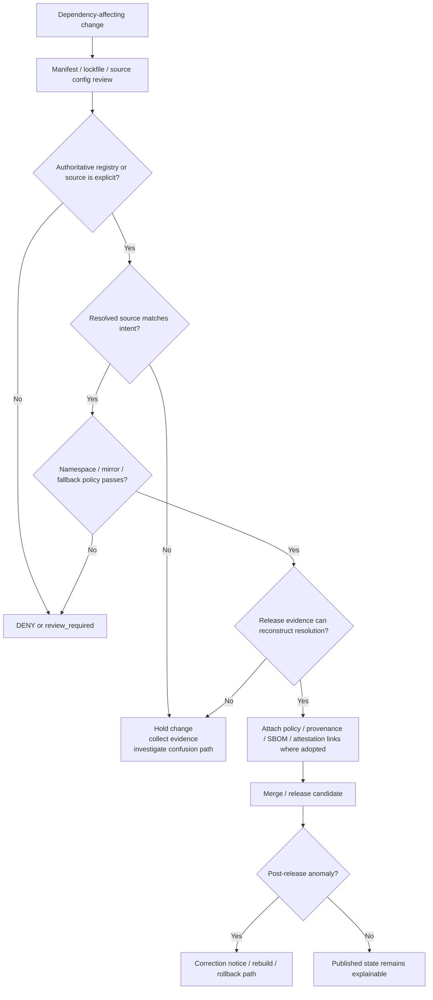

<!-- [KFM_META_BLOCK_V2]
doc_id: kfm://doc/<REVIEW-REQUIRED-UUID>
title: Dependency Confusion
type: standard
version: v1
status: draft
owners: @bartytime4life
created: <REVIEW-REQUIRED-YYYY-MM-DD>
updated: <REVIEW-REQUIRED-YYYY-MM-DD>
policy_label: <REVIEW-REQUIRED-policy-label>
related: [docs/README.md, docs/security/README.md, docs/security/supply-chain/README.md, SECURITY.md, .github/CODEOWNERS]
tags: [kfm, security, supply-chain, dependency-confusion]
notes: [owner confirmed from CODEOWNERS; dates/doc_id/policy label need verification before merge; deeper subtree files listed by parent security index should be rechecked before this doc is marked published]
[/KFM_META_BLOCK_V2] -->

# Dependency Confusion

Evidence-first control surface for preventing wrong-registry package resolution, namespace collision, lockfile drift, and unresolved dependency provenance in `docs/security/supply-chain/dependency-confusion/`.

> [!WARNING]
> This directory is currently only partially evidenced in the visible repo surface. Treat this README as the lane contract and review guide. Treat any deeper file references not directly reverified from the mounted repo as **NEEDS VERIFICATION** before merge or publication.

**Status:** experimental  
**Owners:** `@bartytime4life`  
**Repo fit:** `docs/security/supply-chain/dependency-confusion/` → upstream security and supply-chain docs; downstream policy, checks, and examples for this lane


**Quick jumps:** [Scope](#scope) · [Repo fit](#repo-fit) · [Inputs](#inputs) · [Exclusions](#exclusions) · [Directory tree](#directory-tree) · [Quickstart](#quickstart) · [Usage](#usage) · [Diagram](#diagram) · [Controls matrix](#controls-matrix) · [Task list](#task-list) · [FAQ](#faq) · [Appendix](#appendix)

---

## Scope

This directory documents the **dependency-confusion** lane inside KFM supply-chain security.

In KFM terms, dependency confusion is not just a package-manager nuisance. It is a **trust-boundary failure** in which build or runtime resolution can select the wrong package source, wrong namespace, wrong registry, or wrong artifact lineage. That can happen through public/private namespace collision, fallback-to-public behavior, lockfile drift, mis-scoped registry configuration, or release evidence that never proves where a dependency really came from.

This lane therefore covers four things:

1. **Resolution authority**
   Which registry, namespace, mirror, or package source is allowed to answer a dependency request.

2. **Dependency provenance**
   Whether a lockfile, manifest, artifact, SBOM, attestation, or release proof can reconstruct what was actually resolved.

3. **Fail-closed review**
   Whether changes that affect package resolution are blocked until provenance, policy, and review obligations are satisfied.

4. **Surface-visible correction**
   Whether a wrong-resolution event can be withdrawn, corrected, or rebuilt without silently erasing lineage.

### KFM reading rule for this lane

Dependency confusion belongs to the same governed path as other KFM trust objects:

`source/registry intent -> manifest change -> lockfile resolution -> build evidence -> policy decision -> release evidence -> correction path`

If any of those steps cannot be explained, this lane should assume **partial trust at best** and prefer **deny**, **hold**, or **review_required** over smooth continuation.

[Back to top](#dependency-confusion)

---

## Repo fit

| Item | Value |
|---|---|
| Path | `docs/security/supply-chain/dependency-confusion/README.md` |
| Primary role | README-like lane index and reviewer guide |
| Upstream docs | [`../../../README.md`](../../../README.md) · [`../../README.md`](../../README.md) · [`../README.md`](../README.md) · [`../../../../SECURITY.md`](../../../../SECURITY.md) |
| Confirmed local children | `./checks/` · `./examples/` · `./policy/` · `./examples/README.md` · `./examples/lockfile-drift-attack.md` · `./policy/README.md` |
| Intended downstream material | lane-specific policy notes, check guidance, and examples for dependency confusion |
| Enforcement should live in | package-manager config, CI, policy bundles, lockfile review, attestations/SBOM generation, and release proof objects |

### Accepted inputs

This directory is the right place for:

- dependency-confusion threat models scoped to KFM
- namespace ownership rules
- registry precedence rules
- package source allowlists / deny lists
- lockfile drift examples
- mixed-registry anomaly notes
- review checklists for dependency-affecting changes
- provenance expectations for package resolution
- SBOM / attestation / digest-link guidance where it directly supports this lane
- exception patterns for emergency or steward-reviewed override cases
- examples showing how a dependency confusion issue would be detected, denied, corrected, and rebuilt

### Exclusions

This directory is **not** the right place for:

- live credentials, tokens, `.npmrc` secrets, index URLs, or auth material
- canonical CI implementation files that belong under `.github/`, `tools/`, `tests/`, `scripts/`, or package-manager config
- broad vulnerability management content that is not specific to dependency confusion
- incident response details that should remain restricted
- general package hygiene advice with no KFM trust consequence
- runtime package inventories that belong in generated release evidence, SBOM outputs, or proof packs

### Placement logic

This README should orient the lane.  
It should **not** become a substitute for executable controls.

[Back to top](#dependency-confusion)

---

## Inputs

The lane expects inputs from four evidence classes.

| Input class | Examples | Why it matters |
|---|---|---|
| Manifest intent | `package.json`, `pyproject.toml`, `requirements.txt`, `Cargo.toml`, `go.mod`, workspace config | States what the repo asked for |
| Resolution evidence | lockfiles, vendor metadata, resolved registry URLs, provenance logs | States what actually got resolved |
| Policy evidence | namespace rules, allowed registries, exception records, review decisions | States what was allowed |
| Release evidence | SBOMs, attestations, release manifests, digest-linked artifacts, correction notices | States what became publishable and how it can be corrected |

### Minimum trust questions

Before a dependency-affecting change is treated as acceptable, reviewers should be able to answer:

- Which registry or source was intended?
- Which registry or source actually answered?
- Is the namespace private, public, mirrored, or mixed?
- Does the lockfile prove the answer?
- Can the release evidence reconstruct the result later?
- If the answer was wrong, is there a correction path that preserves lineage?

---

## Exclusions

The following common topics are adjacent, but belong elsewhere unless they directly support this lane:

| Topic | Where it belongs instead |
|---|---|
| General repo security hub | `docs/security/README.md` |
| Broader supply-chain hub | `docs/security/supply-chain/README.md` |
| Coordinated disclosure / reporting | `SECURITY.md` |
| Sigstore / Cosign / attestation specifics | sibling supply-chain documentation such as `../sigstore-cosign-v3/README.md` |
| Repo-wide policy implementation | top-level `policy/`, `.github/`, `tests/`, `tools/`, `scripts/` |
| Runtime or deployment topology | architecture and runtime docs, not this lane README |

> [!IMPORTANT]
> A dependency-confusion document that contains only prose and no link to actual review or release evidence is incomplete. In KFM, this lane is useful only when it helps the repo explain, block, or correct real resolution events.

[Back to top](#dependency-confusion)

---

## Directory tree

### CONFIRMED current subtree

```text
docs/security/supply-chain/dependency-confusion/
├── README.md
├── checks/
├── examples/
│   ├── README.md
│   └── lockfile-drift-attack.md
└── policy/
    └── README.md
```

### Source-reported by parent security index, but NEEDS VERIFICATION here

The parent security README reports additional files under this subtree. They should not be treated as current repo fact until directly rechecked in the mounted workspace:

```text
docs/security/supply-chain/dependency-confusion/
├── policy/
│   ├── rules.md
│   ├── exceptions.md
│   └── evidence/README.md
├── checks/
│   ├── provenance-hooks.md
│   ├── registry-anomaly-detection.md
│   └── local-scan-guidance.md
└── examples/
    └── typosquat-examples.md
```

### Interpretation rule

Use the confirmed tree for current edits.  
Use the source-reported tree as a queue for repo verification or follow-on documentation work.

[Back to top](#dependency-confusion)

---

## Quickstart

This section is for maintainers reviewing or building this lane in a mounted checkout.

### 1) Inspect the currently mounted subtree

```bash
find docs/security/supply-chain/dependency-confusion -maxdepth 3 -type f | sort
```

### 2) Locate package ecosystems that could participate in dependency confusion

```bash
find . -maxdepth 5 \( \
  -name package.json -o \
  -name pnpm-lock.yaml -o \
  -name package-lock.json -o \
  -name yarn.lock -o \
  -name pyproject.toml -o \
  -name poetry.lock -o \
  -name requirements.txt -o \
  -name Cargo.toml -o \
  -name go.mod \
\) | sort
```

### 3) Search for registry or source configuration

```bash
grep -RIn "registry\|npmrc\|PIP_INDEX_URL\|index-url\|extra-index-url\|source *= *\"\|replace *= *\"\|registries:" \
  .github apps docs policy schemas scripts tests tools 2>/dev/null
```

### 4) Review dependency-affecting diffs together

```bash
git diff -- \
  '**/package.json' \
  '**/pnpm-lock.yaml' \
  '**/package-lock.json' \
  '**/yarn.lock' \
  '**/pyproject.toml' \
  '**/poetry.lock' \
  '**/requirements.txt' \
  '**/Cargo.toml' \
  '**/go.mod' 2>/dev/null
```

### 5) Fail closed when intent and evidence diverge

If manifest intent, lockfile evidence, registry configuration, and release proof do not line up, the correct KFM default is:

- hold the change
- request steward review
- preserve evidence
- require rebuild or correction if needed

[Back to top](#dependency-confusion)

---

## Usage

### When to read this README

Use this README when a change does any of the following:

- adds or renames dependencies
- changes a registry, mirror, or source configuration
- introduces a private namespace that could collide with a public package name
- updates a lockfile without clear provenance
- changes build tooling that resolves packages differently across environments
- changes release evidence expectations for package-origin proof
- proposes an exception to strict dependency-source rules

### How to use it in review

1. Start with the **manifest change**.
2. Verify the **authoritative source** for each affected dependency.
3. Check whether the **lockfile and registry config** prove the same answer.
4. Confirm that **release evidence** can later explain the result.
5. If any of those steps are unclear, treat the change as **review-bearing**.

### KFM truth labels for this lane

| Label | Use in this README |
|---|---|
| **CONFIRMED** | Directly verified in the mounted repo or clearly established by adjacent governing docs |
| **INFERRED** | Strongly implied by KFM doctrine, but not directly proven as implemented here |
| **PROPOSED** | Recommended control shape or directory growth for this lane |
| **UNKNOWN** | Not yet verified in the current mounted workspace |
| **NEEDS VERIFICATION** | Source-reported by nearby docs, but not directly rechecked before merge |

### Change coupling rule

For dependency-confusion work, the preferred KFM move is not “update the doc later.”  
It is to keep these together in the same change set whenever behavior changes:

- docs
- policy
- tests
- validation or scanning guidance
- release evidence expectations
- reviewer instructions

[Back to top](#dependency-confusion)

---

## Diagram



### Reading the flow

The critical design move is that **resolution authority** is checked before trust is granted.  
KFM should never treat “the build passed” as sufficient proof that the right dependency source was used.

[Back to top](#dependency-confusion)

---

## Controls matrix

### Lane controls

| Control area | What this lane should define | Preferred enforcement surface | Current status |
|---|---|---|---|
| Namespace ownership | Which names are private, mirrored, public, or forbidden | policy bundles, package-manager config, review checklist | PROPOSED |
| Registry precedence | Which source wins, and whether fallback is allowed | package-manager config, CI, environment policy | UNKNOWN |
| Lockfile discipline | When lockfiles must be regenerated, reviewed, or denied | CI checks, review template, local guidance | INFERRED |
| Resolution provenance | What evidence proves the package came from the intended source | SBOMs, attestations, release manifests, logs | PROPOSED |
| Exception handling | Who can override, how long, and what evidence is required | review records, policy exceptions, steward workflow | PROPOSED |
| Local developer safeguards | How to avoid accidental public resolution during local work | local scan guidance, config templates, docs | NEEDS VERIFICATION |
| Correction path | How a wrong resolution is withdrawn, rebuilt, and surfaced | correction notices, rebuild receipts, release linkage | INFERRED |

### Current evidence boundary

| Observation | Status | Consequence for this README |
|---|---|---|
| This lane directory exists | CONFIRMED | Safe to document as a real subtree |
| Current lane README is scaffold-level | CONFIRMED | This file should be expanded, not merely restyled |
| `checks/`, `examples/`, and `policy/` directories exist | CONFIRMED | Keep the README oriented toward those children |
| `policy/README.md`, `examples/README.md`, and `examples/lockfile-drift-attack.md` exist | CONFIRMED | Link the lane to real child surfaces already present |
| Additional deeper files are listed by the parent security index | NEEDS VERIFICATION | Do not claim them as live without rechecking |
| Merge-blocking dependency-confusion enforcement is present | UNKNOWN | Do not describe any live CI gate here as implemented fact |

### KFM-aligned outcome table

| Outcome | Meaning in this lane | Reviewer expectation |
|---|---|---|
| **allow** | Source authority and resolution evidence align | Merge may proceed |
| **review_required** | Some evidence exists, but human judgment is still required | Escalate with notes |
| **deny** | Policy or trust boundary fails | Block change |
| **rebuild_projection / correction_notice** | A released artifact must be rebuilt or visibly corrected | Preserve lineage; do not silently patch |

[Back to top](#dependency-confusion)

---

## Task list

### Minimum completion conditions for this lane

- [ ] Confirm the actual package ecosystems present in the mounted repo
- [ ] Confirm authoritative registries or source authorities for each ecosystem
- [ ] Document namespace ownership and private/public collision rules
- [ ] Add or verify a fail-closed review path for manifest + lockfile + registry changes
- [ ] Add at least one valid and one invalid dependency-confusion example
- [ ] Add or verify exception handling with visible review ownership
- [ ] Link dependency-affecting releases to release evidence, SBOMs, or attestations where adopted
- [ ] Define correction behavior for wrong-resolution events
- [ ] Keep docs, policy, tests, and tooling updates in the same change stream when this lane changes

### Recommended definition of done

A maintainer should be able to answer all of these without guessing:

- What package source was intended?
- What package source was actually used?
- What evidence proves it?
- What policy approved it?
- What happens if it was wrong?

If the answer to any one of those is “we assume,” the lane is not done.

[Back to top](#dependency-confusion)

---

## FAQ

### What is dependency confusion?

Dependency confusion is the risk that a build or environment resolves a dependency from the wrong source—often a public registry instead of an intended private one, or from the wrong namespace or mirror—because precedence, naming, or provenance rules are unclear.

### How is it different from typosquatting?

Typosquatting is usually a **look-alike naming attack**.  
Dependency confusion is usually a **wrong-source resolution attack**.

They overlap, but they are not identical. This lane should treat typosquatting examples as supporting material, not as the whole problem.

### Why is this a supply-chain issue in KFM?

Because KFM treats publication, release evidence, and correction lineage as trust-bearing objects. If the system cannot prove what dependency source it used, the release memory is incomplete.

### Why not keep all of this only in CI?

Because KFM explicitly avoids trust theater. CI is necessary, but not sufficient. Reviewers, docs, policy, and release evidence all need the same story.

### Should this README describe exact package-manager commands?

Only where they are repo-true and directly verified.  
Generic commands are acceptable as review aids, but repo-specific enforcement details should live next to the actual toolchain and be linked here.

### What should a reviewer inspect first?

Start with the smallest reliable chain:

1. manifest change  
2. lockfile change  
3. registry/source configuration  
4. release evidence or provenance linkage

### Does this lane imply that all supply-chain controls already exist in the repo?

No. This README must stay honest about what is current, what is source-reported, and what is still target-state.

[Back to top](#dependency-confusion)

---

## Appendix

<details>
<summary><strong>Verification notes, open questions, and merge cautions</strong></summary>

### Open verification items

- Actual repo package ecosystems are not confirmed from this README’s source set alone.
- Current authoritative registry configuration per ecosystem is not yet verified here.
- It is not yet directly verified whether a merge-blocking dependency-confusion check already exists in `.github/`, `policy/`, `tests/`, `tools/`, or package-manager config.
- The parent security README reports deeper files in this subtree that should be rechecked before being treated as current repo fact.
- Any future exception process must remain proportional: fail closed by default, but do not create a review burden so heavy that maintainers bypass the lane entirely.

### Suggested follow-on docs

- `./policy/rules.md` — lane rules and decision grammar
- `./policy/exceptions.md` — steward-reviewed override flow
- `./checks/registry-anomaly-detection.md` — how wrong-source detection is performed
- `./checks/local-scan-guidance.md` — local developer verification workflow
- `./examples/typosquat-examples.md` — contrast cases for related attacks

### Merge caution

Before marking this README `review` or `published`, verify:

- doc metadata values in the KFM meta block
- current subtree inventory
- actual enforcement locations
- actual package ecosystems present in the mounted repository

</details>

[Back to top](#dependency-confusion)
