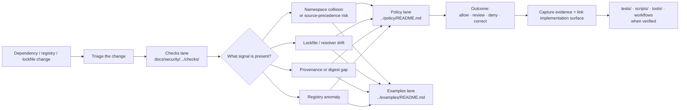

# Dependency Confusion Checks

Reviewer-facing check guidance for detecting, documenting, and hardening against dependency-confusion risk under `docs/security/supply-chain/dependency-confusion/checks/`.

> **Status:** experimental  
> **Owners:** `@bartytime4life` *(broad `/docs/` CODEOWNERS coverage)*  
> 
> 
> 
>   
> **Quick jumps:** [Scope](#scope) · [Repo fit](#repo-fit) · [Accepted inputs](#accepted-inputs) · [Exclusions](#exclusions) · [Directory tree](#directory-tree) · [Quickstart](#quickstart) · [Usage](#usage) · [Diagram](#diagram) · [Check families](#check-families) · [Task list](#task-list--definition-of-done) · [FAQ](#faq) · [Appendix](#appendix)

> [!IMPORTANT]
> This directory is the **checks lane** for dependency confusion. It explains **what to inspect**, **what evidence to capture**, and **where enforcement should live**. It does **not** by itself prove that a workflow, policy bundle, or runnable scanner is already active.

> [!WARNING]
> Current public `main` exposes `README.md` as the only file inside `docs/security/supply-chain/dependency-confusion/checks/`. Filenames listed below as deeper check pages are kept visible as **INFERRED / NEEDS VERIFICATION** because adjacent security documentation indexes them, but they are not currently visible here on public `main`.

## Scope

This README turns a scaffold into a usable control surface for dependency-confusion review.

In KFM terms, this directory should stay focused on **inspection logic** and **reviewer/operator guidance** for package-source precedence, namespace collision, lockfile drift, provenance gaps, registry anomalies, and related supply-chain trust failures. It should remain downstream of broader security doctrine and upstream of executable enforcement in CI, policy, scripts, tools, or tests.

## Repo fit

| Field | Value |
| --- | --- |
| Path | `docs/security/supply-chain/dependency-confusion/checks/README.md` |
| Immediate parent | [`../README.md`](../README.md) |
| Upstream context | [`../../README.md`](../../README.md) · [`../../../README.md`](../../../README.md) · [`../../../../../README.md`](../../../../../README.md) |
| Adjacent lanes | [`../policy/README.md`](../policy/README.md) · [`../examples/README.md`](../examples/README.md) |
| Confirmed example docs | [`../examples/lockfile-drift-attack.md`](../examples/lockfile-drift-attack.md) · [`../examples/namespace-collision-basic.md`](../examples/namespace-collision-basic.md) |
| Downstream intent | Future deep-dive check pages in this directory, plus implementation hooks in `tests/`, `scripts/`, `tools/`, `.github/workflows/`, and policy/runtime surfaces when verified |

## Accepted inputs

This directory accepts material such as:

- check definitions for dependency-confusion failure modes
- reviewer guidance for package-source precedence and namespace ownership
- lockfile, resolver, and registry-host inspection rules
- provenance-hook guidance for digest, attestation, and source-origin checks
- anomaly-detection notes for suspicious registry, mirror, or package-resolution behavior
- local operator or contributor guidance for pre-PR inspection
- mapping from observed signals to **allow / review / deny / correct** outcomes

## Exclusions

This directory should **not** become a dumping ground for adjacent work.

Send the following elsewhere:

- **policy decisions, exception rules, and decision grammar** → [`../policy/README.md`](../policy/README.md)
- **attack narratives, demonstrations, and teaching examples** → [`../examples/README.md`](../examples/README.md)
- **runnable scanners, hooks, scripts, or harnesses** → repo execution surfaces such as `tests/`, `scripts/`, `tools/`, or `.github/workflows/`
- **broad signing / SBOM / release-integrity guidance not specific to dependency confusion** → higher-level supply-chain docs under [`../../README.md`](../../README.md)
- **claims of active enforcement** without visible repo evidence

## Directory tree

### Current public-main inventory

```text
docs/security/supply-chain/dependency-confusion/checks/
└── README.md
```

### Indexed deeper checks to keep visible

| Candidate doc | Intended role in this lane | Current status |
| --- | --- | --- |
| `provenance-hooks.md` | Explain where dependency-origin, digest, attestation, and release-proof checks should hook in | INFERRED / NEEDS VERIFICATION |
| `registry-anomaly-detection.md` | Describe suspicious package-source or registry-behavior signals and review flow | INFERRED / NEEDS VERIFICATION |
| `local-scan-guidance.md` | Give contributor/operator guidance for local pre-merge inspection | INFERRED / NEEDS VERIFICATION |

## Quickstart

1. Start from [`../README.md`](../README.md) to confirm the lane-level dependency-confusion purpose.
2. Decide whether your addition is a **check**, a **policy rule**, or an **example**.
3. If it is a check, document:
   - the threat or failure mode
   - the observable signal
   - the evidence to capture
   - the enforcement surface
   - the expected outcome
4. If you claim a check is enforced, point to the implementation surface that proves it.
5. Keep broken assumptions visible. Do not write future enforcement as present-tense fact.

### Minimum change shape

```text
checks/
├── README.md
└── <future-check>.md
```

A new check page should be small, specific, and link outward to policy, examples, and implementation surfaces instead of duplicating them.

## Usage

| Need | Start here | Then go to |
| --- | --- | --- |
| Clarify what belongs in the checks lane | this README | [`../README.md`](../README.md) |
| Explain how to interpret a suspicious dependency-resolution signal | this README | future deep-dive check doc in `checks/` |
| Document an attack pattern or teaching example | [`../examples/README.md`](../examples/README.md) | confirmed example doc |
| Explain why a finding should block, warn, or require review | [`../policy/README.md`](../policy/README.md) | policy deep-dive docs when verified |
| Add executable validation | repo execution surfaces | `tests/`, `scripts/`, `tools/`, `.github/workflows/` |

## Diagram



## Check families

| Check family | Primary question | Typical evidence | Enforcement surface | Current documentation state |
| --- | --- | --- | --- | --- |
| Namespace / source precedence | Can an internal or expected package be replaced by a public or higher-precedence source? | package manager config, registry hostnames, namespace ownership, resolver output | policy, local review, CI | PARTIAL: lane documented here; deeper check doc not yet visible |
| Lockfile / resolver drift | Did the resolved package source, tarball, or integrity value change without intentional review? | lockfile diff, integrity fields, registry URL changes, package metadata | tests, CI, local inspection | PARTIAL: confirmed example in [`../examples/lockfile-drift-attack.md`](../examples/lockfile-drift-attack.md) |
| Provenance hooks | Are origin, digest, attestation, or release-proof checks wired before merge or publication? | digest records, attestations, proof packs, workflow evidence | CI, policy, release assembly | INFERRED / NEEDS VERIFICATION |
| Registry anomaly detection | Are typosquats, mirror drift, or resolver anomalies made visible before trust is granted? | allowlists, anomaly thresholds, registry logs, source deltas | local review, CI, policy | INFERRED / NEEDS VERIFICATION |
| Local scan guidance | What should a contributor or reviewer run locally before opening a PR or approving a dependency change? | dry-run installs, audit output, lockfile diff review, source-origin summaries | scripts, tools, docs | INFERRED / NEEDS VERIFICATION |
| Correction / rollback linkage | If a bad dependency enters scope, is the correction path visible forward through release state? | correction notice, release manifest, affected surfaces, follow-up evidence | release/correction workflows | INFERRED / NEEDS VERIFICATION |

## Task list / definition of done

A dependency-confusion check doc is ready to keep when all of these are true:

- [ ] The threat model is named plainly.
- [ ] The failing condition is observable.
- [ ] The evidence a reviewer must capture is explicit.
- [ ] The expected outcome is mapped to **allow / review / deny / correct**.
- [ ] The correct neighboring lane is linked (`policy`, `examples`, or implementation surfaces).
- [ ] Any claim of live enforcement is backed by visible repo evidence.
- [ ] The write-up does not confuse documentation intent with current implementation state.
- [ ] The page stays specific to dependency confusion rather than drifting into generic supply-chain prose.

## FAQ

### Is this directory the enforcement engine?

No. This directory is for **check guidance**. Enforcement belongs in verified policy, CI, test, script, tool, or runtime surfaces.

### Why separate checks from policy?

Because they answer different questions:

- **checks** = what to inspect
- **policy** = how to interpret and decide
- **examples** = how the failure mode looks in practice

Keeping them separate reduces drift and makes review easier.

### Why are some filenames marked `INFERRED / NEEDS VERIFICATION`?

Because adjacent security documentation indexes a richer dependency-confusion subtree than the one currently visible on public `main`. This README keeps those likely seams visible without pretending the files already exist here.

### Where should runnable code or hooks live?

Not in this directory. Put runnable behavior in the repo’s executable surfaces and link to it from here once verified.

## Appendix

<details>
<summary><strong>Starter template for a future check page</strong></summary>

### `<check-name>.md`

**Goal**  
What this check is trying to prevent or reveal.

**Threat / failure mode**  
What goes wrong if the check is skipped or fails.

**Signals to inspect**  
The concrete conditions, fields, files, logs, or diffs a reviewer should inspect.

**Required inputs**  
Configs, lockfiles, registry settings, attestations, manifests, or examples needed to run the check.

**Manual review flow**  
1. Inspect source-precedence inputs.  
2. Inspect resolution output.  
3. Compare against expected namespace / origin / integrity posture.  
4. Capture evidence.  
5. Escalate to policy if needed.

**Automation hook points**  
Where this check should eventually run: CI, pre-merge, local tooling, release assembly, or runtime audit.

**Evidence to retain**  
What should be attached to a PR, review note, proof pack, or correction record.

**Outcome mapping**  
- allow  
- review  
- deny  
- correct / rollback

**Related docs**  
- `../README.md`  
- `../policy/README.md`  
- `../examples/README.md`

</details>

[Back to top](#dependency-confusion-checks)
