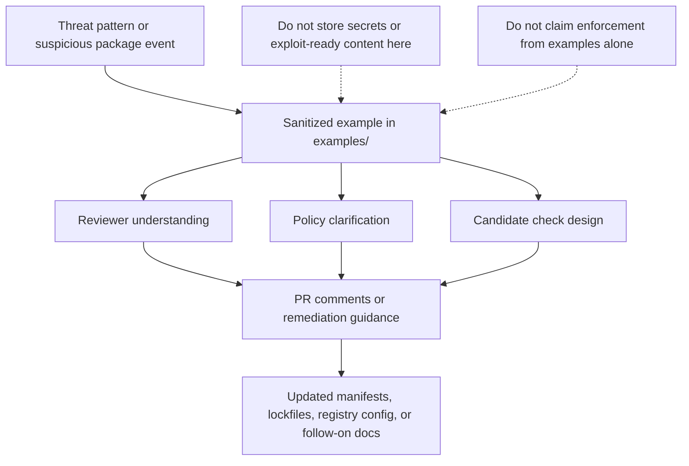

# KFM Dependency Confusion Examples

Reviewable, sanitized examples for package-origin ambiguity, namespace collision, and lockfile-drift scenarios under `docs/security/supply-chain/dependency-confusion/examples/`.

> [!IMPORTANT]
> **Status:** experimental  
> **Owners:** `TODO` (`NEEDS VERIFICATION`)  
> 
> 
> 
>   
> **Quick jumps:** [Scope](#scope) · [Repo fit](#repo-fit) · [Accepted inputs](#accepted-inputs) · [Exclusions](#exclusions) · [Directory tree](#directory-tree) · [Quickstart](#quickstart) · [Usage](#usage) · [Diagram](#diagram) · [Task list](#task-list--quality-gates-and-definition-of-done) · [FAQ](#faq) · [Appendix](#appendix)

> [!NOTE]
> **Truth posture used here**
> - **CONFIRMED** — present in the current tree or directly anchored in adjacent KFM doctrine
> - **INFERRED** — repo-aligned interpretation of the local security-doc structure
> - **PROPOSED** — recommended documentation shape or authoring rule
> - **UNKNOWN / NEEDS VERIFICATION** — current repo evidence is incomplete, drifting, or scaffold-only

## Scope

This directory holds reviewer-facing examples that explain how dependency confusion can appear in KFM-adjacent package flows, lockfiles, namespaces, and registry selection.

Examples in this folder are for **inspection, education, review, and cross-linking**. They are **not** enforcement logic, policy bundles, CI gates, or proof that a control is mounted.

## Repo fit

| Fit | Path / link | Purpose |
| --- | --- | --- |
| Path | `docs/security/supply-chain/dependency-confusion/examples/README.md` | Directory guide for the examples sublane |
| Upstream | [`../README.md`](../README.md) · [`../../README.md`](../../README.md) · [`../../../README.md`](../../../README.md) | Dependency-confusion, supply-chain, and security context |
| Downstream | [`./lockfile-drift-attack.md`](./lockfile-drift-attack.md) · [`./namespace-collision-basic.md`](./namespace-collision-basic.md) | Current example files in this directory |
| Adjacent | [`../checks/README.md`](../checks/README.md) · [`../policy/README.md`](../policy/README.md) | Where checks and policy guidance should live |

> [!WARNING]
> **NEEDS VERIFICATION:** the broader security index may name example files differently from the live tree. Keep filenames, H1 titles, and parent-directory links synchronized before treating this subtree as stable.

## Accepted inputs

- Sanitized dependency-confusion scenarios
- Namespace collision and package-origin ambiguity examples
- Lockfile drift examples
- Reviewable manifest or lockfile fragments with safe redaction
- Reviewer notes that explain **what should fail**, **what should be questioned**, or **what should be fixed**
- Cross-links to sibling `checks/` and `policy/` docs when those docs exist

## Exclusions

Do **not** put these here:

- Live credentials, tokens, registry secrets, or internal hostnames
- Exploit-ready payloads or unpublished incident evidence
- Actual enforcement code or policy bundles
- CI workflow logic
- Canonical incident response records
- Sensitive private package names unless they are already public and intentionally documented

Put those instead in the appropriate governed lane:

- enforcement or detection logic -> sibling `../checks/`
- rule language or exception handling -> sibling `../policy/`
- broader lane guidance -> parent `../README.md`
- runtime, release, or proof artifacts -> repo contracts, policy, tests, or runbook lanes, not this examples directory

## Directory tree

```text
docs/security/supply-chain/dependency-confusion/examples/
├── README.md
├── lockfile-drift-attack.md
└── namespace-collision-basic.md
```

### Example registry

| Item | Status | Role | Notes |
| --- | --- | --- | --- |
| `README.md` | CONFIRMED | Directory contract | Explains what belongs here and what does not |
| `lockfile-drift-attack.md` | CONFIRMED | Example scenario | Use for drift, provenance, and review conversations |
| `namespace-collision-basic.md` | CONFIRMED | Example scenario | Use for namespace ambiguity and source-origin review |
| `typosquat-examples.md` | NEEDS VERIFICATION | Index-sync item | Mentioned in wider security documentation patterns, but not present in the current live examples tree |

[Back to top](#kfm-dependency-confusion-examples)

## Quickstart

1. Start at [`../README.md`](../README.md) to understand the dependency-confusion lane.
2. Pick the closest existing example in this directory.
3. Confirm that the example filename, H1 title, and inbound links all agree.
4. Keep the content sanitized, reviewer-facing, and non-exploitative.
5. If the example implies a control, link to the sibling `checks/` or `policy/` doc instead of embedding enforcement logic here.
6. If you add or rename an example, update parent trees and registries in the same change set.

## Usage

### Use these examples to

- explain attack shape during review
- illustrate what a suspicious package-resolution pattern looks like
- clarify why lockfiles, namespace boundaries, or registry precedence matter
- support future `checks/` and `policy/` docs without pretending those controls already exist
- give contributors a stable place to put sanitized, teachable scenarios

### Do not use these examples to

- prove that a detection rule runs in CI
- claim that policy enforcement is mounted
- substitute for fixture-backed validation
- store raw incident evidence that belongs in a governed review or operations lane

### Suggested reading path

| Goal | Start here | Then go to |
| --- | --- | --- |
| Understand the example lane | This README | [`../README.md`](../README.md) |
| Turn an example into review guidance | Example file | [`../policy/README.md`](../policy/README.md) |
| Turn an example into a detection or guardrail candidate | Example file | [`../checks/README.md`](../checks/README.md) |
| Reconcile filename or tree drift | This README | Parent security READMEs in the same PR |

## Diagram



## Tables

### What belongs here vs elsewhere

| Content type | Belongs here? | Where it should go |
| --- | --- | --- |
| Sanitized attack narrative | Yes | `examples/` |
| Reviewer-facing manifest snippet | Yes, if redacted | `examples/` |
| Actual policy rule text | No | `../policy/` |
| Detection logic or hook design | No | `../checks/` |
| CI workflow YAML | No | repo workflow / test lanes |
| Incident evidence with sensitive detail | No | governed review / ops lane |
| Release proof or runtime trace | No | contracts, tests, runbooks, or audit lanes |

### Minimum quality bar for each example

| Criterion | Expectation |
| --- | --- |
| Scenario naming | Filename, H1, and parent links match |
| Safety | No secrets, no internal registry exposure unless intentionally public |
| Clarity | The attack shape is understandable without external context |
| Boundaries | The example does not masquerade as enforcement |
| Remediation | A plausible response or review action is included |
| Cross-linking | Related `checks/` or `policy/` docs are linked when available |
| Truthfulness | Implementation claims are labeled or avoided if not verified |

[Back to top](#kfm-dependency-confusion-examples)

## Task list — quality gates and definition of done

### Definition of done

- [ ] The example file is present in the live tree.
- [ ] The filename, title, and parent-directory references agree.
- [ ] The example is clearly sanitized and safe to publish.
- [ ] The example distinguishes **illustration** from **implemented control**.
- [ ] Any implied policy or detection follow-up is linked to the sibling lane, not duplicated here.
- [ ] The surrounding security docs are updated if filenames or tree shape changed.
- [ ] No new text quietly overclaims repo enforcement, CI coverage, or runtime behavior.

### Review checks

- [ ] Does the example describe **registry precedence**, **namespace ambiguity**, **package origin**, **lockfile drift**, or another real dependency-confusion shape?
- [ ] Does it explain why the condition is risky in supply-chain review?
- [ ] Does it avoid exploit-ready detail?
- [ ] Does it say what a reviewer should inspect next?
- [ ] Does it preserve KFM’s evidence-first and fail-closed posture?

## FAQ

### Are these examples supposed to be runnable?

No. This directory is for reviewer-facing and maintainer-facing examples. Runnable checks, fixtures, or CI behavior belong elsewhere.

### Can this folder contain real incident write-ups?

Only if they are deliberately sanitized and scoped for public or repo-safe documentation. Raw incident evidence should stay in the governed review or operations lane.

### Why keep examples separate from checks and policy?

Because examples explain *how the risk looks*; checks explain *how to detect or block it*; policy explains *how to decide and respond*. Collapsing all three makes the subtree harder to review and easier to overclaim.

### Why call out filename drift?

Because documentation drift in a security subtree creates ambiguity at exactly the point where maintainers need clarity. If the tree says one thing and the index says another, fix both in the same PR.

### Can a new example land before a matching check exists?

Yes — but the doc must not imply that enforcement already exists.

[Back to top](#kfm-dependency-confusion-examples)

## Appendix

<details>
<summary>Appendix — example authoring template</summary>

### Recommended example shape

```md
# <example title>

## Attack shape
What is happening?

## Why this matters
Why could this lead to dependency confusion or package-origin ambiguity?

## Observable signals
What should a reviewer notice in manifests, lockfiles, package names, registry settings, or build behavior?

## What should happen next
Which policy, check, or remediation path should be consulted?

## Safety note
What has been redacted, generalized, or intentionally left non-operational?
```

### Authoring checklist

- Prefer short, reviewable examples over long essays.
- Prefer synthetic or redacted package names unless a public example is necessary.
- Keep remediation language concrete.
- Avoid language that implies CI or policy is already wired unless that implementation is separately verified.
- When renaming files, update every inbound tree listing and quick link in the same PR.

</details>

[Back to top](#kfm-dependency-confusion-examples)
